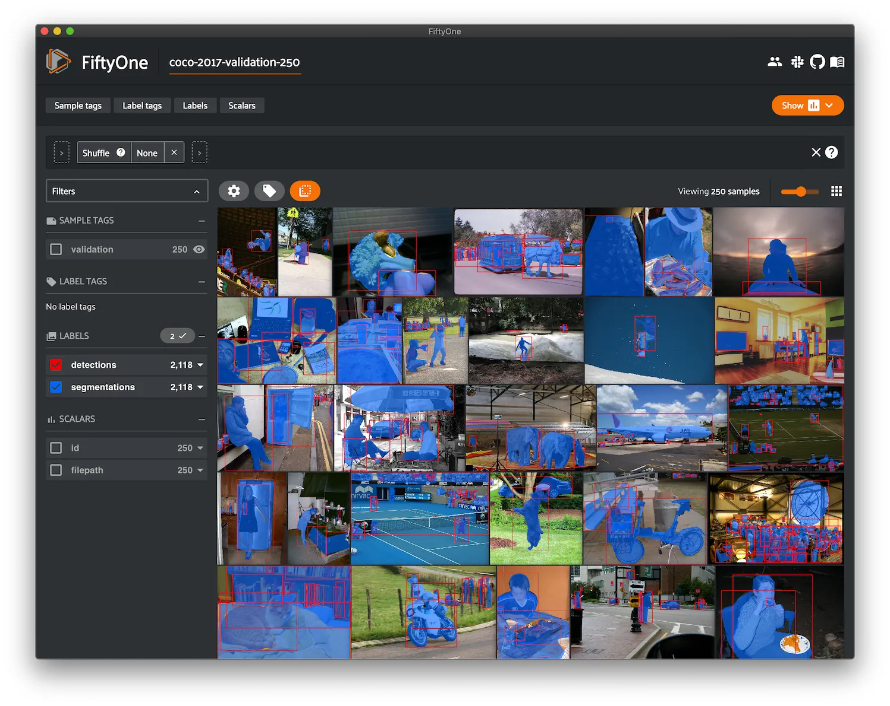
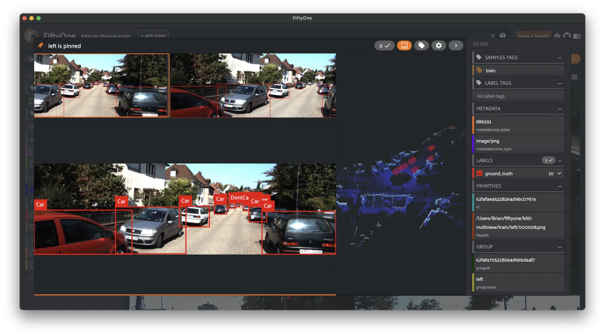
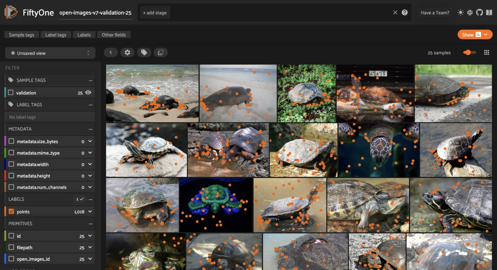
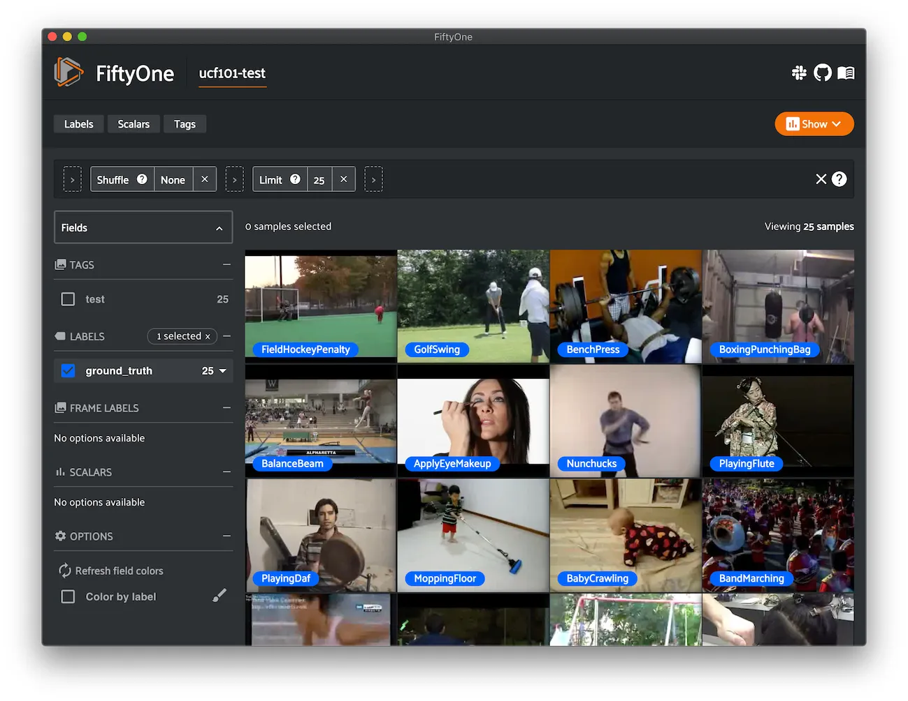
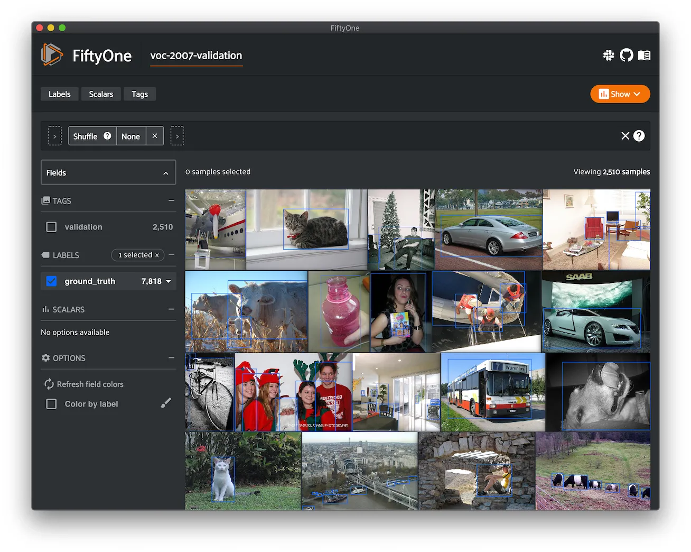

# Built-In Zoo Datasets [¶](\#built-in-zoo-datasets "Permalink to this headline")

This page lists all of the natively available datasets in the FiftyOne Dataset
Zoo.

Check out the [API reference](api.md#dataset-zoo-api) for complete instructions
for using the Dataset Zoo.

Note

Some datasets are loaded via the
[TorchVision Datasets](https://pytorch.org/vision/stable/datasets.html)
or [TensorFlow Datasets](https://www.tensorflow.org/datasets) packages
under the hood.

If you do not have a [suitable package](api.md#dataset-zoo-ml-backend)
installed when attempting to download a zoo dataset, you’ll see an error
message that will help you install one.

| Dataset name | Tags |
| --- | --- |
| [ActivityNet 100](#dataset-zoo-activitynet-100) | video, classification, action-recognition, temporal-detection |
| [ActivityNet 200](#dataset-zoo-activitynet-200) | video, classification, action-recognition, temporal-detection |
| [BDD100K](#dataset-zoo-bdd100k) | image, multilabel, automotive, manual |
| [Caltech-101](#dataset-zoo-caltech101) | image, classification |
| [Caltech-256](#dataset-zoo-caltech256) | image, classification |
| [CIFAR-10](#dataset-zoo-cifar10) | image, classification |
| [CIFAR-100](#dataset-zoo-cifar100) | image, classification |
| [Cityscapes](#dataset-zoo-cityscapes) | image, multilabel, automotive, manual |
| [COCO-2014](#dataset-zoo-coco-2014) | image, detection, segmentation |
| [COCO-2017](#dataset-zoo-coco-2017) | image, detection, segmentation |
| [Fashion MNIST](#dataset-zoo-fashion-mnist) | image, classification |
| [Families in the Wild](#dataset-zoo-fiw) | image, classification |
| [HMDB51](#dataset-zoo-hmdb51) | video, action-recognition |
| [ImageNet 2012](#dataset-zoo-imagenet-2012) | image, classification, manual |
| [ImageNet Sample](#dataset-zoo-imagenet-sample) | image, classification |
| [Kinetics 400](#dataset-zoo-kinetics-400) | video, classification, action-recognition |
| [Kinetics 600](#dataset-zoo-kinetics-600) | video, classification, action-recognition |
| [Kinetics 700](#dataset-zoo-kinetics-700) | video, classification, action-recognition |
| [Kinetics 700-2020](#dataset-zoo-kinetics-700-2020) | video, classification, action-recognition |
| [KITTI](#dataset-zoo-kitti) | image, detection |
| [KITTI Multiview](#dataset-zoo-kitti-multiview) | image, point-cloud, detection |
| [Labeled Faces in the Wild](#dataset-zoo-lfw) | image, classification, facial-recognition |
| [MNIST](#dataset-zoo-mnist) | image, classification |
| [Open Images V6](#dataset-zoo-open-images-v6) | image, classification, detection, segmentation, relationships |
| [Open Images V7](#dataset-zoo-open-images-v7) | image, classification, detection, segmentation, keypoints, relationships |
| [Places](#dataset-zoo-places) | image, classification |
| [Quickstart](#dataset-zoo-quickstart) | image, quickstart |
| [Quickstart Geo](#dataset-zoo-quickstart-geo) | image, location, quickstart |
| [Quickstart Video](#dataset-zoo-quickstart-video) | video, quickstart |
| [Quickstart Groups](#dataset-zoo-quickstart-groups) | image, point-cloud, quickstart |
| [Quickstart 3D](#dataset-zoo-quickstart-3d) | 3d, point-cloud, mesh, quickstart |
| [Sama-COCO](#dataset-zoo-sama-coco) | image, detection, segmentation |
| [UCF101](#dataset-zoo-ucf101) | video, action-recognition |
| [VOC-2007](#dataset-zoo-voc-2007) | image, detection |
| [VOC-2012](#dataset-zoo-voc-2012) | image, detection |

## ActivityNet 100 [¶](\#activitynet-100 "Permalink to this headline")

ActivityNet is a large-scale video dataset for human activity understanding
supporting the tasks of global video classification, trimmed activity
classification, and temporal activity detection.

This version contains videos and temporal activity detections for the 100 class
version of the dataset.

Note

Check out [this guide](../../integrations/activitynet.md#activitynet) for more details on using
FiftyOne to work with ActivityNet.

**Notes**

- ActivityNet 100 and 200 differ in the number of activity classes and
videos per split

- Partial downloads will download videos (if still available) from YouTube

- Full splits can be loaded by first downloading the official source files
from the
[ActivityNet maintainers](https://docs.google.com/forms/d/e/1FAIpQLSeKaFq9ZfcmZ7W0B0PbEhfbTHY41GeEgwsa7WobJgGUhn4DTQ/viewform)

- The test set does not have annotations


**Details**

- Dataset name: `activitynet-100`

- Dataset source: [http://activity-net.org/index.html](http://activity-net.org/index.html)

- Dataset size: 223 GB

- Tags: `video, classification, action-recognition, temporal-detection`

- Supported splits: `train, validation, test`

- ZooDataset class:
[`ActivityNet100Dataset`](../../api/fiftyone.zoo.datasets.base.html#fiftyone.zoo.datasets.base.ActivityNet100Dataset "fiftyone.zoo.datasets.base.ActivityNet100Dataset")


**Full split stats**

- Train split: 4,819 videos (7,151 instances)

- Test split: 2,480 videos (labels withheld)

- Validation split: 2,383 videos (3,582 instances)


**Partial downloads**

FiftyOne provides parameters that can be used to efficiently download specific
subsets of the ActivityNet dataset to suit your needs. When new subsets are
specified, FiftyOne will use existing downloaded data first if possible before
resorting to downloading additional data from YouTube.

The following parameters are available to configure a partial download of
ActivityNet 100 by passing them to
[`load_zoo_dataset()`](../../api/fiftyone.zoo.datasets.html#fiftyone.zoo.datasets.load_zoo_dataset "fiftyone.zoo.datasets.load_zoo_dataset"):

- **split** ( _None_) and **splits** ( _None_): a string or list of strings,
respectively, specifying the splits to load. Supported values are
`("train", "test", "validation")`. If none are provided, all available
splits are loaded

- **source\_dir** ( _None_): the directory containing the manually downloaded
ActivityNet files used to avoid downloading videos from YouTube

- **classes** ( _None_): a string or list of strings specifying required
classes to load. If provided, only samples containing at least one instance
of a specified class will be loaded

- **max\_duration** ( _None_): only videos with a duration in seconds that is
less than or equal to the `max_duration` will be downloaded. By default,
all videos are downloaded

- **copy\_files** ( _True_): whether to move (False) or create copies (True) of
the source files when populating `dataset_dir`. This is only relevant
when a `source_dir` is provided

- **num\_workers** ( _None_): the number of processes to use when downloading
individual videos. By default, `multiprocessing.cpu_count()` is used

- **shuffle** ( _False_): whether to randomly shuffle the order in which
samples are chosen for partial downloads

- **seed** ( _None_): a random seed to use when shuffling

- **max\_samples** ( _None_): a maximum number of samples to load per split. If
`classes` are also specified, only up to the number of samples that
contain at least one specified class will be loaded. By default, all
matching samples are loaded


Note

See
[`ActivityNet100Dataset`](../../api/fiftyone.zoo.datasets.base.ActivityNet100Dataset.html "fiftyone.zoo.datasets.base.ActivityNet100Dataset") and
[`ActivityNetDatasetImporter`](../../api/fiftyone.utils.activitynet.ActivityNetDatasetImporter.html "fiftyone.utils.activitynet.ActivityNetDatasetImporter")
for complete descriptions of the optional keyword arguments that you can
pass to [`load_zoo_dataset()`](../../api/fiftyone.zoo.datasets.html#load_zoo_dataset "fiftyone.zoo.datasets.load_zoo_dataset").

**Full split downloads**

Many videos have been removed from YouTube since the creation of ActivityNet.
As a result, if you do not specify any partial download parameters defined in
the previous section, you must first download the official source files from
the ActivityNet maintainers in order to load a full split into FiftyOne.

To download the source files, you must fill out
[this form](https://docs.google.com/forms/d/e/1FAIpQLSeKaFq9ZfcmZ7W0B0PbEhfbTHY41GeEgwsa7WobJgGUhn4DTQ/viewform).

Refer to [this page](../../integrations/activitynet.md#activitynet-full-split-downloads) to see how to load
full splits by passing the `source_dir` parameter to
[`load_zoo_dataset()`](../../api/fiftyone.zoo.datasets.html#fiftyone.zoo.datasets.load_zoo_dataset "fiftyone.zoo.datasets.load_zoo_dataset").

**Example usage**

Note

In order to work with video datasets, you’ll need to have
[ffmpeg installed](../../../getting_started/basic/troubleshooting/#videos-do-not-load-in-the-app)).


## ActivityNet 200 [¶](\#activitynet-200 "Permalink to this headline")

ActivityNet is a large-scale video dataset for human activity understanding
supporting the tasks of global video classification, trimmed activity
classification, and temporal activity detection.

This version contains videos and temporal activity detections for the 200 class
version of the dataset.

Note

Check out [this guide](../../integrations/activitynet.md#activitynet) for more details on using
FiftyOne to work with ActivityNet.

**Notes**

- ActivityNet 200 is a superset of ActivityNet 100

- ActivityNet 100 and 200 differ in the number of activity classes and videos
per split

- Partial downloads will download videos (if still available) from YouTube

- Full splits can be loaded by first downloading the official source files
from the
[ActivityNet maintainers](https://docs.google.com/forms/d/e/1FAIpQLSeKaFq9ZfcmZ7W0B0PbEhfbTHY41GeEgwsa7WobJgGUhn4DTQ/viewform)

- The test set does not have annotations


**Details**

- Dataset name: `activitynet-200`

- Dataset source: [http://activity-net.org/index.html](http://activity-net.org/index.html)

- Dataset size: 500 GB

- Tags: `video, classification, action-recognition, temporal-detection`

- Supported splits: `train, validation, test`

- ZooDataset class:
[`ActivityNet200Dataset`](../../api/fiftyone.zoo.datasets.base.html#fiftyone.zoo.datasets.base.ActivityNet200Dataset "fiftyone.zoo.datasets.base.ActivityNet200Dataset")


**Full split stats**

- Train split: 10,024 videos (15,410 instances)

- Test split: 5,044 videos (labels withheld)

- Validation split: 4,926 videos (7,654 instances)


**Partial downloads**

FiftyOne provides parameters that can be used to efficiently download specific
subsets of the ActivityNet dataset to suit your needs. When new subsets are
specified, FiftyOne will use existing downloaded data first if possible before
resorting to downloading additional data from YouTube.

The following parameters are available to configure a partial download of
ActivityNet 200 by passing them to
[`load_zoo_dataset()`](../../api/fiftyone.zoo.datasets.html#fiftyone.zoo.datasets.load_zoo_dataset "fiftyone.zoo.datasets.load_zoo_dataset"):

- **split** ( _None_) and **splits** ( _None_): a string or list of strings,
respectively, specifying the splits to load. Supported values are
`("train", "test", "validation")`. If none are provided, all available
splits are loaded

- **source\_dir** ( _None_): the directory containing the manually downloaded
ActivityNet files used to avoid downloading videos from YouTube

- **classes** ( _None_): a string or list of strings specifying required
classes to load. If provided, only samples containing at least one instance
of a specified class will be loaded

- **max\_duration** ( _None_): only videos with a duration in seconds that is
less than or equal to the `max_duration` will be downloaded. By default,
all videos are downloaded

- **copy\_files** ( _True_): whether to move (False) or create copies (True) of
the source files when populating `dataset_dir`. This is only relevant
when a `source_dir` is provided

- **num\_workers** ( _None_): the number of processes to use when downloading
individual videos. By default, `multiprocessing.cpu_count()` is used

- **shuffle** ( _False_): whether to randomly shuffle the order in which
samples are chosen for partial downloads

- **seed** ( _None_): a random seed to use when shuffling

- **max\_samples** ( _None_): a maximum number of samples to load per split. If
`classes` are also specified, only up to the number of samples that
contain at least one specified class will be loaded. By default, all
matching samples are loaded


Note

See
[`ActivityNet200Dataset`](../../api/fiftyone.zoo.datasets.base.html#fiftyone.zoo.datasets.base.ActivityNet200Dataset "fiftyone.zoo.datasets.base.ActivityNet200Dataset") and
[`ActivityNetDatasetImporter`](../../api/fiftyone.utils.activitynet.html#fiftyone.utils.activitynet.ActivityNetDatasetImporter "fiftyone.utils.activitynet.ActivityNetDatasetImporter")
for complete descriptions of the optional keyword arguments that you can
pass to [`load_zoo_dataset()`](../../api/fiftyone.zoo.datasets.html#fiftyone.zoo.datasets.load_zoo_dataset "fiftyone.zoo.datasets.load_zoo_dataset").

**Full split downloads**

Many videos have been removed from YouTube since the creation of ActivityNet.
As a result, if you do not specify any partial download parameters defined in
the previous section, you must first download the official source files from
the ActivityNet maintainers in order to load a full split into FiftyOne.

To download the source files, you must fill out
[this form](https://docs.google.com/forms/d/e/1FAIpQLSeKaFq9ZfcmZ7W0B0PbEhfbTHY41GeEgwsa7WobJgGUhn4DTQ/viewform).

Refer to [this page](../../integrations/activitynet.md#activitynet-full-split-downloads) to see how to load
full splits by passing the `source_dir` parameter to
[`load_zoo_dataset()`](../../api/fiftyone.zoo.datasets.html#fiftyone.zoo.datasets.load_zoo_dataset "fiftyone.zoo.datasets.load_zoo_dataset").

**Example usage**

Note

In order to work with video datasets, you’ll need to have
[ffmpeg installed](../../../getting_started/basic/troubleshooting/#videos-do-not-load-in-the-app)).


## BDD100K [¶](\#bdd100k "Permalink to this headline")

The Berkeley Deep Drive (BDD) dataset is one of the largest and most diverse
video datasets for autonomous vehicles.

The BDD100K dataset contains 100,000 video clips collected from more than
50,000 rides covering New York, San Francisco Bay Area, and other regions.
The dataset contains diverse scene types such as city streets, residential
areas, and highways. Furthermore, the videos were recorded in diverse
weather conditions at different times of the day.

The videos are split into training (70K), validation (10K) and testing
(20K) sets. Each video is 40 seconds long with 720p resolution and a frame
rate of 30fps. The frame at the 10th second of each video is annotated for
image classification, detection, and segmentation tasks.

This version of the dataset contains only the 100K images extracted from
the videos as described above, together with the image classification,
detection, and segmentation labels.

Note

In order to load the BDD100K dataset, you must download the source data
manually. The directory should be organized in the following format:

```python
source_dir/
    labels/
        bdd100k_labels_images_train.json
        bdd100k_labels_images_val.json
    images/
        100k/
            train/
            test/
            val/

```

You can register at [https://bdd-data.berkeley.edu](https://bdd-data.berkeley.edu) in order to get links
to download the data.

**Details**

- Dataset name: `bdd100k`

- Dataset source: [https://bdd-data.berkeley.edu](https://bdd-data.berkeley.edu)

- Dataset size: 7.10 GB

- Tags: `image, multilabel, automotive, manual`

- Supported splits: `train, validation, test`

- ZooDataset class:
[`BDD100KDataset`](../../api/fiftyone.zoo.datasets.base.html#fiftyone.zoo.datasets.base.BDD100KDataset "fiftyone.zoo.datasets.base.BDD100KDataset")


**Example usage**


## Caltech-101 [¶](\#caltech-101 "Permalink to this headline")

The Caltech-101 dataset of images.

The dataset consists of pictures of objects belonging to 101 classes, plus
one background clutter class ( `BACKGROUND_Google`). Each image is labelled
with a single object.

Each class contains roughly 40 to 800 images, totalling around 9,000
images. Images are of variable sizes, with typical edge lengths of 200-300
pixels. This version contains image-level labels only.

**Details**

- Dataset name: `caltech101`

- Dataset source: [https://data.caltech.edu/records/mzrjq-6wc02](https://data.caltech.edu/records/mzrjq-6wc02)

- Dataset size: 138.60 MB

- Tags: `image, classification`

- Supported splits: `N/A`

- ZooDataset class:
[`Caltech101Dataset`](../../api/fiftyone.zoo.datasets.base.html#fiftyone.zoo.datasets.base.Caltech101Dataset "fiftyone.zoo.datasets.base.Caltech101Dataset")


**Example usage**


## Caltech-256 [¶](\#caltech-256 "Permalink to this headline")

The Caltech-256 dataset of images.

The dataset consists of pictures of objects belonging to 256 classes, plus
one background clutter class ( `clutter`). Each image is labelled with a
single object.

Each class contains between 80 and 827 images, totalling 30,607 images.
Images are of variable sizes, with typical edge lengths of 80-800 pixels.

**Details**

- Dataset name: `caltech256`

- Dataset source: [https://data.caltech.edu/records/nyy15-4j048](https://data.caltech.edu/records/nyy15-4j048)

- Dataset size: 1.16 GB

- Tags: `image, classification`

- Supported splits: `N/A`

- ZooDataset class:
[`Caltech256Dataset`](../../api/fiftyone.zoo.datasets.base.html#fiftyone.zoo.datasets.base.Caltech256Dataset "fiftyone.zoo.datasets.base.Caltech256Dataset")


**Example usage**


## CIFAR-10 [¶](\#cifar-10 "Permalink to this headline")

The CIFAR-10 dataset of images.

The dataset consists of 60,000 32 x 32 color images in 10 classes, with 6,000
images per class. There are 50,000 training images and 10,000 test images.

**Details**

- Dataset name: `cifar10`

- Dataset source: [https://www.cs.toronto.edu/~kriz/cifar.html](https://www.cs.toronto.edu/~kriz/cifar.html)

- Dataset size: 132.40 MB

- Tags: `image, classification`

- Supported splits: `train, test`

- ZooDataset classes:

  - [`CIFAR10Dataset`](../../api/fiftyone.zoo.datasets.tf.CIFAR10Dataset.html "fiftyone.zoo.datasets.tf.CIFAR10Dataset") (TF backend)

  - [`CIFAR10Dataset`](../../api/fiftyone.zoo.datasets.torch.CIFAR10Dataset.html "fiftyone.zoo.datasets.torch.CIFAR10Dataset") (Torch backend)

Note

You must have the
[Torch or TensorFlow backend(s)](api.md#dataset-zoo-ml-backend) installed to
load this dataset.

**Example usage**


## CIFAR-100 [¶](\#cifar-100 "Permalink to this headline")

The CIFAR-100 dataset of images.

The dataset consists of 60,000 32 x 32 color images in 100 classes, with
600 images per class. There are 50,000 training images and 10,000 test
images.

**Details**

- Dataset name: `cifar100`

- Dataset source: [https://www.cs.toronto.edu/~kriz/cifar.html](https://www.cs.toronto.edu/~kriz/cifar.html)

- Dataset size: 132.03 MB

- Tags: `image, classification`

- Supported splits: `train, test`

- ZooDataset classes:

  - [`CIFAR100Dataset`](../../api/fiftyone.zoo.datasets.tf.html#fiftyone.zoo.datasets.tf.CIFAR100Dataset "fiftyone.zoo.datasets.tf.CIFAR100Dataset") (TF backend)

  - [`CIFAR100Dataset`](../../api/fiftyone.zoo.datasets.torch.html#fiftyone.zoo.datasets.torch.CIFAR100Dataset "fiftyone.zoo.datasets.torch.CIFAR100Dataset") (Torch backend)

Note

You must have the
[Torch or TensorFlow backend(s)](api.md#dataset-zoo-ml-backend) installed to
load this dataset.

**Example usage**


## Cityscapes [¶](\#cityscapes "Permalink to this headline")

Cityscapes is a large-scale dataset that contains a diverse set of
stereo video sequences recorded in street scenes from 50 different cities,
with high quality pixel-level annotations of 5,000 frames in addition to a
larger set of 20,000 weakly annotated frames.

The dataset is intended for:

- Assessing the performance of vision algorithms for major tasks of
semantic urban scene understanding: pixel-level, instance-level, and
panoptic semantic labeling

- Supporting research that aims to exploit large volumes of (weakly)
annotated data, e.g. for training deep neural networks


Note

In order to load the Cityscapes dataset, you must download the source data
manually. The directory should be organized in the following format:

```python
source_dir/
    leftImg8bit_trainvaltest.zip
    gtFine_trainvaltest.zip             # optional
    gtCoarse.zip                        # optional
    gtBbox_cityPersons_trainval.zip     # optional

```

You can register at [https://www.cityscapes-dataset.com/register](https://www.cityscapes-dataset.com/register) in order
to get links to download the data.

**Details**

- Dataset name: `cityscapes`

- Dataset source: [https://www.cityscapes-dataset.com](https://www.cityscapes-dataset.com)

- Dataset size: 11.80 GB

- Tags: `image, multilabel, automotive, manual`

- Supported splits: `train, validation, test`

- ZooDataset class:
[`CityscapesDataset`](../../api/fiftyone.zoo.datasets.base.html#fiftyone.zoo.datasets.base.CityscapesDataset "fiftyone.zoo.datasets.base.CityscapesDataset")


**Example usage**


## COCO-2014 [¶](\#coco-2014 "Permalink to this headline")

COCO is a large-scale object detection, segmentation, and captioning
dataset.

This version contains images, bounding boxes, and segmentations for the 2014
version of the dataset.

Note

With support from the [COCO team](https://cocodataset.org/#download),
FiftyOne is a recommended tool for downloading, visualizing, and evaluating
on the COCO dataset!

Check out [this guide](../../integrations/coco.md#coco) for more details on using FiftyOne to
work with COCO.

**Notes**

- COCO defines 91 classes but the data only uses 80 classes

- Some images from the train and validation sets don’t have annotations

- The test set does not have annotations

- COCO 2014 and 2017 use the same images, but the splits are different


**Details**

- Dataset name: `coco-2014`

- Dataset source: [http://cocodataset.org/#home](http://cocodataset.org/#home)

- Dataset size: 37.57 GB

- Tags: `image, detection, segmentation`

- Supported splits: `train, validation, test`

- ZooDataset class:
[`COCO2014Dataset`](../../api/fiftyone.zoo.datasets.base.html#fiftyone.zoo.datasets.base.COCO2014Dataset "fiftyone.zoo.datasets.base.COCO2014Dataset")


**Full split stats**

- Train split: 82,783 images

- Test split: 40,775 images

- Validation split: 40,504 images


**Partial downloads**

FiftyOne provides parameters that can be used to efficiently download specific
subsets of the COCO dataset to suit your needs. When new subsets are specified,
FiftyOne will use existing downloaded data first if possible before resorting
to downloading additional data from the web.

The following parameters are available to configure a partial download of
COCO-2014 by passing them to
[`load_zoo_dataset()`](../../api/fiftyone.zoo.datasets.html#fiftyone.zoo.datasets.load_zoo_dataset "fiftyone.zoo.datasets.load_zoo_dataset"):

- **split** ( _None_) and **splits** ( _None_): a string or list of strings,
respectively, specifying the splits to load. Supported values are
`("train", "test", "validation")`. If neither is provided, all available
splits are loaded

- **label\_types** ( _None_): a label type or list of label types to load.
Supported values are `("detections", "segmentations")`. By default, only
detections are loaded

- **classes** ( _None_): a string or list of strings specifying required
classes to load. If provided, only samples containing at least one instance
of a specified class will be loaded

- **image\_ids** ( _None_): a list of specific image IDs to load. The IDs can
be specified either as `<split>/<image-id>` strings or `<image-id>`
ints of strings. Alternatively, you can provide the path to a TXT
(newline-separated), JSON, or CSV file containing the list of image IDs to
load in either of the first two formats

- **include\_id** ( _False_): whether to include the COCO ID of each sample in
the loaded labels

- **include\_license** ( _False_): whether to include the COCO license of each
sample in the loaded labels, if available. The supported values are:

  - `"False"` (default): don’t load the license

  - `True`/ `"name"`: store the string license name

  - `"id"`: store the integer license ID

  - `"url"`: store the license URL
- **only\_matching** ( _False_): whether to only load labels that match the
`classes` or `attrs` requirements that you provide (True), or to load
all labels for samples that match the requirements (False)

- **num\_workers** ( _None_): the number of processes to use when downloading
individual images. By default, `multiprocessing.cpu_count()` is used

- **shuffle** ( _False_): whether to randomly shuffle the order in which
samples are chosen for partial downloads

- **seed** ( _None_): a random seed to use when shuffling

- **max\_samples** ( _None_): a maximum number of samples to load per split. If
`label_types` and/or `classes` are also specified, first priority will
be given to samples that contain all of the specified label types and/or
classes, followed by samples that contain at least one of the specified
labels types or classes. The actual number of samples loaded may be less
than this maximum value if the dataset does not contain sufficient samples
matching your requirements


Note

See
[`COCO2014Dataset`](../../api/fiftyone.zoo.datasets.base.COCO2014Dataset.html "fiftyone.zoo.datasets.base.COCO2014Dataset") and
[`COCODetectionDatasetImporter`](../../api/fiftyone.utils.coco.COCODetectionDatasetImporter.html "fiftyone.utils.coco.COCODetectionDatasetImporter")
for complete descriptions of the optional keyword arguments that you can
pass to [`load_zoo_dataset()`](../../api/fiftyone.zoo.datasets.html#load_zoo_dataset "fiftyone.zoo.datasets.load_zoo_dataset").

**Example usage**


## COCO-2017 [¶](\#coco-2017 "Permalink to this headline")

COCO is a large-scale object detection, segmentation, and captioning
dataset.

This version contains images, bounding boxes, and segmentations for the 2017
version of the dataset.

Note

With support from the [COCO team](https://cocodataset.org/#download),
FiftyOne is a recommended tool for downloading, visualizing, and evaluating
on the COCO dataset!

Check out [this guide](../../integrations/coco.md#coco) for more details on using FiftyOne to
work with COCO.

**Notes**

- COCO defines 91 classes but the data only uses 80 classes

- Some images from the train and validation sets don’t have annotations

- The test set does not have annotations

- COCO 2014 and 2017 use the same images, but the splits are different


**Details**

- Dataset name: `coco-2017`

- Dataset source: [http://cocodataset.org/#home](http://cocodataset.org/#home)

- Dataset size: 25.20 GB

- Tags: `image, detection, segmentation`

- Supported splits: `train, validation, test`

- ZooDataset class:
[`COCO2017Dataset`](../../api/fiftyone.zoo.datasets.base.html#fiftyone.zoo.datasets.base.COCO2017Dataset "fiftyone.zoo.datasets.base.COCO2017Dataset")


**Full split stats**

- Train split: 118,287 images

- Test split: 40,670 images

- Validation split: 5,000 images


**Partial downloads**

FiftyOne provides parameters that can be used to efficiently download specific
subsets of the COCO dataset to suit your needs. When new subsets are specified,
FiftyOne will use existing downloaded data first if possible before resorting
to downloading additional data from the web.

The following parameters are available to configure a partial download of
COCO-2017 by passing them to
[`load_zoo_dataset()`](../../api/fiftyone.zoo.datasets.html#fiftyone.zoo.datasets.load_zoo_dataset "fiftyone.zoo.datasets.load_zoo_dataset"):

- **split** ( _None_) and **splits** ( _None_): a string or list of strings,
respectively, specifying the splits to load. Supported values are
`("train", "test", "validation")`. If neither is provided, all available
splits are loaded

- **label\_types** ( _None_): a label type or list of label types to load.
Supported values are `("detections", "segmentations")`. By default, only
detections are loaded

- **classes** ( _None_): a string or list of strings specifying required
classes to load. If provided, only samples containing at least one instance
of a specified class will be loaded

- **image\_ids** ( _None_): a list of specific image IDs to load. The IDs can
be specified either as `<split>/<image-id>` strings or `<image-id>`
ints of strings. Alternatively, you can provide the path to a TXT
(newline-separated), JSON, or CSV file containing the list of image IDs to
load in either of the first two formats

- **include\_id** ( _False_): whether to include the COCO ID of each sample in
the loaded labels

- **include\_license** ( _False_): whether to include the COCO license of each
sample in the loaded labels, if available. The supported values are:

  - `"False"` (default): don’t load the license

  - `True`/ `"name"`: store the string license name

  - `"id"`: store the integer license ID

  - `"url"`: store the license URL
- **only\_matching** ( _False_): whether to only load labels that match the
`classes` or `attrs` requirements that you provide (True), or to load
all labels for samples that match the requirements (False)

- **num\_workers** ( _None_): the number of processes to use when downloading
individual images. By default, `multiprocessing.cpu_count()` is used

- **shuffle** ( _False_): whether to randomly shuffle the order in which
samples are chosen for partial downloads

- **seed** ( _None_): a random seed to use when shuffling

- **max\_samples** ( _None_): a maximum number of samples to load per split. If
`label_types` and/or `classes` are also specified, first priority will
be given to samples that contain all of the specified label types and/or
classes, followed by samples that contain at least one of the specified
labels types or classes. The actual number of samples loaded may be less
than this maximum value if the dataset does not contain sufficient samples
matching your requirements


Note

See
[`COCO2017Dataset`](../../api/fiftyone.zoo.datasets.base.html#fiftyone.zoo.datasets.base.COCO2017Dataset "fiftyone.zoo.datasets.base.COCO2017Dataset") and
[`COCODetectionDatasetImporter`](../../api/fiftyone.utils.coco.html#fiftyone.utils.coco.COCODetectionDatasetImporter "fiftyone.utils.coco.COCODetectionDatasetImporter")
for complete descriptions of the optional keyword arguments that you can
pass to [`load_zoo_dataset()`](../../api/fiftyone.zoo.datasets.html#fiftyone.zoo.datasets.load_zoo_dataset "fiftyone.zoo.datasets.load_zoo_dataset").

**Example usage**



## Fashion MNIST [¶](\#fashion-mnist "Permalink to this headline")

The Fashion-MNIST database of Zalando’s fashion article images.

The dataset consists of 70,000 28 x 28 grayscale images in 10 classes.
There are 60,000 training images and 10,000 test images.

**Details**

- Dataset name: `fashion-mnist`

- Dataset source: [https://github.com/zalandoresearch/fashion-mnist](https://github.com/zalandoresearch/fashion-mnist)

- Dataset size: 36.42 MB

- Tags: `image, classification`

- Supported splits: `train, test`

- ZooDataset classes:

  - [`FashionMNISTDataset`](../../api/fiftyone.zoo.datasets.tf.html#fiftyone.zoo.datasets.tf.FashionMNISTDataset "fiftyone.zoo.datasets.tf.FashionMNISTDataset") (TF backend)

  - [`FashionMNISTDataset`](../../api/fiftyone.zoo.datasets.torch.html#fiftyone.zoo.datasets.torch.FashionMNISTDataset "fiftyone.zoo.datasets.torch.FashionMNISTDataset") (Torch backend)

Note

You must have the
[Torch or TensorFlow backend(s)](api.md#dataset-zoo-ml-backend) installed to
load this dataset.

**Example usage**


## Families in the Wild [¶](\#families-in-the-wild "Permalink to this headline")

Families in the Wild is a public benchmark for recognizing families via facial
images. The dataset contains over 26,642 images of 5,037 faces collected from
978 families. A unique Family ID (FID) is assigned per family, ranging from
F0001-F1018 (i.e., some families were merged or removed since its first release
in 2016). The dataset is a continued work in progress. Any contributions are
both welcome and appreciated!

Faces were cropped from imagery using the five-point face detector MTCNN from
various phototypes (i.e., mostly family photos, along with several profile pics
of individuals (facial shots). The number of members per family varies from
3-to-26, with the number of faces per subject ranging from 1 to >10.

Various levels and types of labels are associated with samples in this dataset.
Family-level labels contain a list of members, each assigned a member ID (MID)
unique to that respective family (e.g., F0011.MID2 refers to member 2 of family
11). Each member has annotations specifying gender and relationship to all
other members in that respective family.

The relationships in FIW are:

```python
=====  =====
  ID    Type
=====  =====
    0  not related or self
    1  child
    2  sibling
    3  grandchild
    4  parent
    5  spouse
    6  grandparent
    7  great grandchild
    8  great grandparent
    9  TBD
=====  =====

```

Within FiftyOne, each sample corresponds to a single face image and contains
primitive labels of the Family ID, Member ID, etc. The relationship labels are
stored as [multi-label classifications](../../fiftyone_concepts/using_datasets.md#multilabel-classification),
where each classification represents one relationship that the member has with
another member in the family. The number of relationships will differ from one
person to the next, but all faces of one person will have the same relationship
labels.

Additionally, the labels for the
[Kinship Verification task](https://competitions.codalab.org/competitions/21843)
are also loaded into this dataset through FiftyOne. These labels are stored
as classifications just like relationships, but the labels of kinship differ
from those defined above. For example, rather than Parent, the label might be
`fd` representing a Father-Daughter kinship or `md` for Mother-Daughter.

In order to make it easier to browse the dataset in the FiftyOne App, each
sample also contains a `face_id` field containing a unique integer for each
face of a member, always starting at 0. This allows you to filter the `face_id`
field to 0 in the App to show only a single image of each person.

For your reference, the relationship labels are stored in disk in a matrix that
provides the relationship of each member with other members of the family as
well as names and genders. The i-th rows represent the i-th family member’s
relationship to the j-th other members.

For example, `FID0001.csv` contains:

```python
MID     1     2     3     Name    Gender
 1      0     4     5     name1     f
 2      1     0     1     name2     f
 3      5     4     0     name3     m

```

Here we have three family members, as listed under the MID column (far-left).
Each MID reads across its row. We can see that MID1 is related to MID2 by
4 -> 1 (Parent -> Child), which of course can be viewed as the inverse, i.e.,
MID2 -> MID1 is 1 -> 4. It can also be seen that MID1 and MID3 are spouses of
one another, i.e., 5 -> 5.

Note

The spouse label will likely be removed in future version of this
dataset. It serves no value to the problem of kinship.

For more information on the data (e.g., statistics, task evaluations,
benchmarks, and more), see the recent journal:

```python
Robinson, JP, M. Shao, and Y. Fu. "Survey on the Analysis and Modeling of
Visual Kinship: A Decade in the Making." IEEE Transactions on Pattern
Analysis and Machine Intelligence (PAMI), 2021.

```

**Details**

- Dataset name: `fiw`

- Dataset source: [https://web.northeastern.edu/smilelab/fiw/](https://web.northeastern.edu/smilelab/fiw/)

- Dataset size: 173.00 MB

- Tags: `image, kinship, verification, classification, search-and-retrieval, facial-recognition`

- Supported splits: `test, val, train`

- ZooDataset class:
[`FIWDataset`](../../api/fiftyone.zoo.datasets.base.html#fiftyone.zoo.datasets.base.FIWDataset "fiftyone.zoo.datasets.base.FIWDataset")


Note

For your convenience, FiftyOne provides
[`get_pairwise_labels()`](../../api/fiftyone.utils.fiw.html#get_pairwise_labels "fiftyone.utils.fiw.get_pairwise_labels")
and
[`get_identifier_filepaths_map()`](../../api/fiftyone.utils.fiw.html#get_identifier_filepaths_map "fiftyone.utils.fiw.get_identifier_filepaths_map")
utilities for FIW.

**Example usage**


## HMBD51 [¶](\#hmbd51 "Permalink to this headline")

HMDB51 is an action recognition dataset containing a total of 6,766
clips distributed across 51 action classes.

**Details**

- Dataset name: `hmdb51`

- Dataset source: [https://serre-lab.clps.brown.edu/resource/hmdb-a-large-human-motion-database](https://serre-lab.clps.brown.edu/resource/hmdb-a-large-human-motion-database)

- Dataset size: 2.16 GB

- Tags: `video, action-recognition`

- Supported splits: `train, test, other`

- ZooDataset class:
[`HMDB51Dataset`](../../api/fiftyone.zoo.datasets.base.html#fiftyone.zoo.datasets.base.HMDB51Dataset "fiftyone.zoo.datasets.base.HMDB51Dataset")


**Example usage**

Note

In order to work with video datasets, you’ll need to have
[ffmpeg installed](../../../getting_started/basic/troubleshooting/#videos-do-not-load-in-the-app).


## ImageNet 2012 [¶](\#imagenet-2012 "Permalink to this headline")

The ImageNet 2012 dataset.

ImageNet, as known as ILSVRC 2012, is an image dataset organized according
to the WordNet hierarchy. Each meaningful concept in WordNet, possibly
described by multiple words or word phrases, is called a “synonym set” or
“synset”. There are more than 100,000 synsets in WordNet, majority of them
are nouns (80,000+). ImageNet provides on average 1,000 images to
illustrate each synset. Images of each concept are quality-controlled and
human-annotated. In its completion, we hope ImageNet will offer tens of
millions of cleanly sorted images for most of the concepts in the WordNet
hierarchy.

Note that labels were never publicly released for the test set, so only the
training and validation sets are provided.

Note

In order to load the ImageNet dataset, you must download the source data
manually. The directory should be organized in the following format:

```python
source_dir/
    ILSVRC2012_devkit_t12.tar.gz    # both splits
    ILSVRC2012_img_train.tar        # train split
    ILSVRC2012_img_val.tar          # validation split

```

You can register at [http://www.image-net.org/download-images](http://www.image-net.org/download-images) in order to
get links to download the data.

**Details**

- Dataset name: `imagenet-2012`

- Dataset source: [http://image-net.org](http://image-net.org)

- Dataset size: 144.02 GB

- Tags: `image, classification, manual`

- Supported splits: `train, validation`

- ZooDataset classes:

  - [`ImageNet2012Dataset`](../../api/fiftyone.zoo.datasets.tf.html#fiftyone.zoo.datasets.tf.ImageNet2012Dataset "fiftyone.zoo.datasets.tf.ImageNet2012Dataset") (TF backend)

  - [`ImageNet2012Dataset`](../../api/fiftyone.zoo.datasets.torch.html#fiftyone.zoo.datasets.torch.ImageNet2012Dataset "fiftyone.zoo.datasets.torch.ImageNet2012Dataset") (Torch backend)

Note

You must have the
[Torch or TensorFlow backend(s)](api.md#dataset-zoo-ml-backend) installed to
load this dataset.

**Example usage**


## ImageNet Sample [¶](\#imagenet-sample "Permalink to this headline")

A small sample of images from the ImageNet 2012 dataset.

The dataset contains 1,000 images, one randomly chosen from each class of
the validation split of the ImageNet 2012 dataset.

These images are provided according to the terms below.

```python
You have been granted access for non-commercial research/educational
use. By accessing the data, you have agreed to the following terms.

You (the "Researcher") have requested permission to use the ImageNet
database (the "Database") at Princeton University and Stanford
University. In exchange for such permission, Researcher hereby agrees
to the following terms and conditions:

1.  Researcher shall use the Database only for non-commercial research
    and educational purposes.
2.  Princeton University and Stanford University make no
    representations or warranties regarding the Database, including but
    not limited to warranties of non-infringement or fitness for a
    particular purpose.
3.  Researcher accepts full responsibility for his or her use of the
    Database and shall defend and indemnify Princeton University and
    Stanford University, including their employees, Trustees, officers
    and agents, against any and all claims arising from Researcher's
    use of the Database, including but not limited to Researcher's use
    of any copies of copyrighted images that he or she may create from
    the Database.
4.  Researcher may provide research associates and colleagues with
    access to the Database provided that they first agree to be bound
    by these terms and conditions.
5.  Princeton University and Stanford University reserve the right to
    terminate Researcher's access to the Database at any time.
6.  If Researcher is employed by a for-profit, commercial entity,
    Researcher's employer shall also be bound by these terms and
    conditions, and Researcher hereby represents that he or she is
    fully authorized to enter into this agreement on behalf of such
    employer.
7.  The law of the State of New Jersey shall apply to all disputes
    under this agreement.

```

**Details**

- Dataset name: `imagenet-sample`

- Dataset source: [http://image-net.org](http://image-net.org)

- Dataset size: 98.26 MB

- Tags: `image, classification`

- Supported splits: `N/A`

- ZooDataset class:
[`ImageNetSampleDataset`](../../api/fiftyone.zoo.datasets.base.html#fiftyone.zoo.datasets.base.ImageNetSampleDataset "fiftyone.zoo.datasets.base.ImageNetSampleDataset")


**Example usage**


## Kinetics 400 [¶](\#kinetics-400 "Permalink to this headline")

Kinetics is a collection of large-scale, high-quality datasets of URL links of
up to 650,000 video clips that cover 400/600/700 human action classes,
depending on the dataset version. The videos include human-object interactions
such as playing instruments, as well as human-human interactions such as
shaking hands and hugging. Each action class has at least 400/600/700 video
clips. Each clip is human annotated with a single action class and lasts around
10 seconds.

This dataset contains videos and action classifications for the 400 class
version of the dataset.

**Details**

- Dataset name: `kinetics-400`

- Dataset source: [https://deepmind.com/research/open-source/kinetics](https://deepmind.com/research/open-source/kinetics)

- Dataset size: 456 GB

- Tags: `video, classification, action-recognition`

- Supported splits: `train, test, validation`

- ZooDataset class:
[`Kinetics400Dataset`](../../api/fiftyone.zoo.datasets.base.html#fiftyone.zoo.datasets.base.Kinetics400Dataset "fiftyone.zoo.datasets.base.Kinetics400Dataset")


Original split stats:

- Train split: 219,782 videos

- Test split: 35,357 videos

- Validation split: 18,035 videos


CVDF split stats:

- Train split: 246,534 videos

- Test split: 39,805 videos

- Validation split: 19,906 videos


Dataset size:

- Train split: 370 GB

- Test split: 56 GB

- Validation split: 30 GB


**Partial downloads**

Kinetics is a massive dataset, so FiftyOne provides parameters that can be used
to efficiently download specific subsets of the dataset to suit your needs.
When new subsets are specified, FiftyOne will use existing downloaded data
first if possible before resorting to downloading additional data from the web.

Kinetics videos were originally only accessible from YouTube. Over time, some
videos have become unavailable so the
[CVDF](https://github.com/cvdfoundation) have hosted the Kinetics dataset on
AWS.

If you are partially downloading the dataset through FiftyOne, the specific
videos of interest will be downloaded from YouTube, if necessary. However,
when you load an entire split, the CVDF-provided files will be downloaded from
AWS.

The following parameters are available to configure a partial download of
Kinetics by passing them to
[`load_zoo_dataset()`](../../api/fiftyone.zoo.datasets.html#fiftyone.zoo.datasets.load_zoo_dataset "fiftyone.zoo.datasets.load_zoo_dataset"):

- **split** ( _None_) and **splits** ( _None_): a string or list of strings,
respectively, specifying the splits to load. Supported values are
`("train", "test", "validation")`. If neither is provided, all available
splits are loaded

- **classes** ( _None_): a string or list of strings specifying required
classes to load. If provided, only samples containing at least one instance
of a specified class will be loaded

- **num\_workers** ( _None_): the number of processes to use when downloading
individual videos. By default, `multiprocessing.cpu_count()` is used

- **shuffle** ( _False_): whether to randomly shuffle the order in which
samples are chosen for partial downloads

- **seed** ( _None_): a random seed to use when shuffling

- **max\_samples** ( _None_): a maximum number of samples to load per split. If
`classes` are also specified, only up to the number of samples that
contain at least one specified class will be loaded. By default, all
matching samples are loaded


Note

Unlike other versions, Kinteics 400 does not have zips available by class
so whenever either `classes` or `max_samples` is provided, videos will be
downloaded from YouTube.

**Example usage**

Note

In order to work with video datasets, you’ll need to have
[ffmpeg installed](../../../getting_started/basic/troubleshooting/#videos-do-not-load-in-the-app).


## Kinetics 600 [¶](\#kinetics-600 "Permalink to this headline")

Kinetics is a collection of large-scale, high-quality datasets of URL links of
up to 650,000 video clips that cover 400/600/700 human action classes,
depending on the dataset version. The videos include human-object interactions
such as playing instruments, as well as human-human interactions such as
shaking hands and hugging. Each action class has at least 400/600/700 video
clips. Each clip is human annotated with a single action class and lasts around
10 seconds.

This dataset contains videos and action classifications for the 600 class
version of the dataset.

**Details**

- Dataset name: `kinetics-600`

- Dataset source: [https://deepmind.com/research/open-source/kinetics](https://deepmind.com/research/open-source/kinetics)

- Dataset size: 779 GB

- Tags: `video, classification, action-recognition`

- Supported splits: `train, test, validation`

- ZooDataset class:
[`Kinetics600Dataset`](../../api/fiftyone.zoo.datasets.base.html#fiftyone.zoo.datasets.base.Kinetics600Dataset "fiftyone.zoo.datasets.base.Kinetics600Dataset")


Original split stats:

- Train split: 370,582 videos

- Test split: 56,618 videos

- Validation split: 28,313 videos


CVDF split stats:

- Train split: 427,549 videos

- Test split: 72,924 videos

- Validation split: 29,793 videos


Dataset size:

- Train split: 648 GB

- Test split: 88 GB

- Validation split: 43 GB


**Partial downloads**

Kinetics is a massive dataset, so FiftyOne provides parameters that can be used
to efficiently download specific subsets of the dataset to suit your needs.
When new subsets are specified, FiftyOne will use existing downloaded data
first if possible before resorting to downloading additional data from the web.

Kinetics videos were originally only accessible from YouTube. Over time, some
videos have become unavailable so the
[CVDF](https://github.com/cvdfoundation) have hosted the Kinetics dataset on
AWS.

If you are partially downloading the dataset through FiftyOne, the specific
videos of interest will be downloaded from YouTube, if necessary. However,
when you load an entire split, the CVDF-provided files will be downloaded from
AWS.

The following parameters are available to configure a partial download of
Kinetics by passing them to
[`load_zoo_dataset()`](../../api/fiftyone.zoo.datasets.html#fiftyone.zoo.datasets.load_zoo_dataset "fiftyone.zoo.datasets.load_zoo_dataset"):

- **split** ( _None_) and **splits** ( _None_): a string or list of strings,
respectively, specifying the splits to load. Supported values are
`("train", "test", "validation")`. If neither is provided, all available
splits are loaded

- **classes** ( _None_): a string or list of strings specifying required
classes to load. If provided, only samples containing at least one instance
of a specified class will be loaded

- **num\_workers** ( _None_): the number of processes to use when downloading
individual videos. By default, `multiprocessing.cpu_count()` is used

- **shuffle** ( _False_): whether to randomly shuffle the order in which
samples are chosen for partial downloads

- **seed** ( _None_): a random seed to use when shuffling

- **max\_samples** ( _None_): a maximum number of samples to load per split. If
`classes` are also specified, only up to the number of samples that
contain at least one specified class will be loaded. By default, all
matching samples are loaded


**Example usage**

Note

In order to work with video datasets, you’ll need to have
[ffmpeg installed](../../../getting_started/basic/troubleshooting/#videos-do-not-load-in-the-app).


## Kinetics 700 [¶](\#kinetics-700 "Permalink to this headline")

Kinetics is a collection of large-scale, high-quality datasets of URL links of
up to 650,000 video clips that cover 400/600/700 human action classes,
depending on the dataset version. The videos include human-object interactions
such as playing instruments, as well as human-human interactions such as
shaking hands and hugging. Each action class has at least 400/600/700 video
clips. Each clip is human annotated with a single action class and lasts around
10 seconds.

This dataset contains videos and action classifications for the 700 class
version of the dataset.

**Details**

- Dataset name: `kinetics-700`

- Dataset source: [https://deepmind.com/research/open-source/kinetics](https://deepmind.com/research/open-source/kinetics)

- Dataset size: 710 GB

- Tags: `video, classification, action-recognition`

- Supported splits: `train, test, validation`

- ZooDataset class:
[`Kinetics700Dataset`](../../api/fiftyone.zoo.datasets.base.html#fiftyone.zoo.datasets.base.Kinetics700Dataset "fiftyone.zoo.datasets.base.Kinetics700Dataset")


Split stats:

- Train split: 529,046 videos

- Test split: 67,446 videos

- Validation split: 33,925 videos


Dataset size

- Train split: 603 GB

- Test split: 59 GB

- Validation split: 48 GB


**Partial downloads**

Kinetics is a massive dataset, so FiftyOne provides parameters that can be used
to efficiently download specific subsets of the dataset to suit your needs.
When new subsets are specified, FiftyOne will use existing downloaded data
first if possible before resorting to downloading additional data from the web.

Kinetics videos were originally only accessible from YouTube. Over time, some
videos have become unavailable so the
[CVDF](https://github.com/cvdfoundation) have hosted the Kinetics dataset on
AWS.

If you are partially downloading the dataset through FiftyOne, the specific
videos of interest will be downloaded from YouTube, if necessary. However,
when you load an entire split, the CVDF-provided files will be downloaded from
AWS.

The following parameters are available to configure a partial download of
Kinetics by passing them to
[`load_zoo_dataset()`](../../api/fiftyone.zoo.datasets.html#fiftyone.zoo.datasets.load_zoo_dataset "fiftyone.zoo.datasets.load_zoo_dataset"):

- **split** ( _None_) and **splits** ( _None_): a string or list of strings,
respectively, specifying the splits to load. Supported values are
`("train", "test", "validation")`. If neither is provided, all available
splits are loaded

- **classes** ( _None_): a string or list of strings specifying required
classes to load. If provided, only samples containing at least one instance
of a specified class will be loaded

- **num\_workers** ( _None_): the number of processes to use when downloading
individual videos. By default, `multiprocessing.cpu_count()` is used

- **shuffle** ( _False_): whether to randomly shuffle the order in which
samples are chosen for partial downloads

- **seed** ( _None_): a random seed to use when shuffling

- **max\_samples** ( _None_): a maximum number of samples to load per split. If
`classes` are also specified, only up to the number of samples that
contain at least one specified class will be loaded. By default, all
matching samples are loaded


**Example usage**

Note

In order to work with video datasets, you’ll need to have
[ffmpeg installed](../../../getting_started/basic/troubleshooting/#videos-do-not-load-in-the-app).


## Kinetics 700-2020 [¶](\#kinetics-700-2020 "Permalink to this headline")

Kinetics is a collection of large-scale, high-quality datasets of URL links of
up to 650,000 video clips that cover 400/600/700 human action classes,
depending on the dataset version. The videos include human-object interactions
such as playing instruments, as well as human-human interactions such as
shaking hands and hugging. Each action class has at least 400/600/700 video
clips. Each clip is human annotated with a single action class and lasts around
10 seconds.

This version contains videos and action classifications for the 700 class
version of the dataset that was updated with new videos in 2020. This dataset
is a superset of Kinetics 700.

**Details**

- Dataset name: `kinetics-700-2020`

- Dataset source: [https://deepmind.com/research/open-source/kinetics](https://deepmind.com/research/open-source/kinetics)

- Dataset size: 710 GB

- Tags: `video, classification, action-recognition`

- Supported splits: `train, test, validation`

- ZooDataset class:
[`Kinetics7002020Dataset`](../../api/fiftyone.zoo.datasets.base.html#fiftyone.zoo.datasets.base.Kinetics7002020Dataset "fiftyone.zoo.datasets.base.Kinetics7002020Dataset")


Original split stats:

- Train split: 542,352 videos

- Test split: 67,433 videos

- Validation split: 34,125 videos


CVDF split stats:

- Train split: 534,073 videos

- Test split: 64,260 videos

- Validation split: 33,914 videos


Dataset size

- Train split: 603 GB

- Test split: 59 GB

- Validation split: 48 GB


**Partial downloads**

Kinetics is a massive dataset, so FiftyOne provides parameters that can be used
to efficiently download specific subsets of the dataset to suit your needs.
When new subsets are specified, FiftyOne will use existing downloaded data
first if possible before resorting to downloading additional data from the web.

Kinetics videos were originally only accessible from YouTube. Over time, some
videos have become unavailable so the
[CVDF](https://github.com/cvdfoundation) have hosted the Kinetics dataset on
AWS.

If you are partially downloading the dataset through FiftyOne, the specific
videos of interest will be downloaded from YouTube, if necessary. However,
when you load an entire split, the CVDF-provided files will be downloaded from
AWS.

The following parameters are available to configure a partial download of
Kinetics by passing them to
[`load_zoo_dataset()`](../../api/fiftyone.zoo.datasets.html#fiftyone.zoo.datasets.load_zoo_dataset "fiftyone.zoo.datasets.load_zoo_dataset"):

- **split** ( _None_) and **splits** ( _None_): a string or list of strings,
respectively, specifying the splits to load. Supported values are
`("train", "test", "validation")`. If neither is provided, all available
splits are loaded

- **classes** ( _None_): a string or list of strings specifying required
classes to load. If provided, only samples containing at least one instance
of a specified class will be loaded

- **num\_workers** ( _None_): the number of processes to use when downloading
individual videos. By default, `multiprocessing.cpu_count()` is used

- **shuffle** ( _False_): whether to randomly shuffle the order in which
samples are chosen for partial downloads

- **seed** ( _None_): a random seed to use when shuffling

- **max\_samples** ( _None_): a maximum number of samples to load per split. If
`classes` are also specified, only up to the number of samples that
contain at least one specified class will be loaded. By default, all
matching samples are loaded


**Example usage**

Note

In order to work with video datasets, you’ll need to have
[ffmpeg installed](../../../getting_started/basic/troubleshooting/#videos-do-not-load-in-the-app).


## KITTI [¶](\#kitti "Permalink to this headline")

KITTI contains a suite of vision tasks built using an autonomous
driving platform.

This dataset contains the left camera images and the associated 2D object
detections.

The training split contains 7,481 annotated images, and the test split contains
7,518 unlabeled images.

A full description of the annotations can be found in the README of the
object development kit on the KITTI homepage.

**Details**

- Dataset name: `kitti`

- Dataset source: [http://www.cvlibs.net/datasets/kitti](http://www.cvlibs.net/datasets/kitti)

- Dataset size: 12.57 GB

- Tags: `image, detection`

- Supported splits: `train, test`

- ZooDataset class:
[`KITTIDataset`](../../api/fiftyone.zoo.datasets.base.html#fiftyone.zoo.datasets.base.KITTIDataset "fiftyone.zoo.datasets.base.KITTIDataset")


**Example usage**


## KITTI Multiview [¶](\#kitti-multiview "Permalink to this headline")

KITTI contains a suite of vision tasks built using an autonomous
driving platform.

This dataset contains the following multiview data for each scene:

- Left camera images annotated with 2D object detections

- Right camera images annotated with 2D object detections

- Velodyne LIDAR point clouds annotated with 3D object detections


The training split contains 7,481 annotated scenes, and the test split contains
7,518 unlabeled scenes.

A full description of the annotations can be found in the README of the
object development kit on the KITTI homepage.

**Details**

- Dataset name: `kitti-multiview`

- Dataset source: [http://www.cvlibs.net/datasets/kitti](http://www.cvlibs.net/datasets/kitti)

- Dataset size: 53.34 GB

- Tags: `image, point-cloud, detection`

- Supported splits: `train, test`

- ZooDataset class:
[`KITTIMultiviewDataset`](../../api/fiftyone.zoo.datasets.base.html#fiftyone.zoo.datasets.base.KITTIMultiviewDataset "fiftyone.zoo.datasets.base.KITTIMultiviewDataset")


**Example usage**



## Labeled Faces in the Wild [¶](\#labeled-faces-in-the-wild "Permalink to this headline")

Labeled Faces in the Wild is a public benchmark for face verification,
also known as pair matching.

The dataset contains 13,233 images of 5,749 people’s faces collected from
the web. Each face has been labeled with the name of the person pictured.
1,680 of the people pictured have two or more distinct photos in the data
set. The only constraint on these faces is that they were detected by the
Viola-Jones face detector.

**Details**

- Dataset name: `lfw`

- Dataset source: [http://vis-www.cs.umass.edu/lfw](http://vis-www.cs.umass.edu/lfw)

- Dataset size: 173.00 MB

- Tags: `image, classification, facial-recognition`

- Supported splits: `test, train`

- ZooDataset class:
[`LabeledFacesInTheWildDataset`](../../api/fiftyone.zoo.datasets.base.html#fiftyone.zoo.datasets.base.LabeledFacesInTheWildDataset "fiftyone.zoo.datasets.base.LabeledFacesInTheWildDataset")


**Example usage**


## MNIST [¶](\#mnist "Permalink to this headline")

The MNIST database of handwritten digits.

The dataset consists of 70,000 28 x 28 grayscale images in 10 classes.
There are 60,000 training images and 10,000 test images.

**Details**

- Dataset name: `mnist`

- Dataset source: [http://yann.lecun.com/exdb/mnist](http://yann.lecun.com/exdb/mnist)

- Dataset size: 21.00 MB

- Tags: `image, classification`

- Supported splits: `train, test`

- ZooDataset classes:

  - [`MNISTDataset`](../../api/fiftyone.zoo.datasets.tf.html#fiftyone.zoo.datasets.tf.MNISTDataset "fiftyone.zoo.datasets.tf.MNISTDataset") (TF backend)

  - [`MNISTDataset`](../../api/fiftyone.zoo.datasets.torch.html#fiftyone.zoo.datasets.torch.MNISTDataset "fiftyone.zoo.datasets.torch.MNISTDataset") (Torch backend)

Note

You must have the
[Torch or TensorFlow backend(s)](api.md#dataset-zoo-ml-backend) installed to
load this dataset.

**Example usage**


## Open Images V6 [¶](\#open-images-v6 "Permalink to this headline")

Open Images V6 is a dataset of ~9 million images, roughly 2 million of which
are annotated and available via this zoo dataset.

The dataset contains annotations for classification, detection, segmentation,
and visual relationship tasks for the 600 boxable classes.

Note

We’ve collaborated with the
[Open Images Team at Google](https://storage.googleapis.com/openimages/web/download.html)
to make FiftyOne a recommended tool for downloading, visualizing, and
evaluating on the Open Images Dataset!

Check out [this guide](../../integrations/open_images.md#open-images) for more details on using
FiftyOne to work with Open Images.

**Details**

- Dataset name: `open-images-v6`

- Dataset source: [https://storage.googleapis.com/openimages/web/index.html](https://storage.googleapis.com/openimages/web/index.html)

- Dataset size: 561 GB

- Tags: `image, detection, segmentation, classification`

- Supported splits: `train, test, validation`

- ZooDataset class:
[`OpenImagesV6Dataset`](../../api/fiftyone.zoo.datasets.base.html#fiftyone.zoo.datasets.base.OpenImagesV6Dataset "fiftyone.zoo.datasets.base.OpenImagesV6Dataset")


**Notes**

- Not all images contain all types of labels

- All images have been rescaled so that their largest side is at most
1024 pixels


**Full split stats**

- Train split: 1,743,042 images (513 GB)

- Test split: 125,436 images (36 GB)

- Validation split: 41,620 images (12 GB)


**Partial downloads**

Open Images is a massive dataset, so FiftyOne provides parameters that can be
used to efficiently download specific subsets of the dataset to suit your
needs. When new subsets are specified, FiftyOne will use existing downloaded
data first if possible before resorting to downloading additional data from the
web.

The following parameters are available to configure a partial download of Open
Images V6 by passing them to
[`load_zoo_dataset()`](../../api/fiftyone.zoo.datasets.html#fiftyone.zoo.datasets.load_zoo_dataset "fiftyone.zoo.datasets.load_zoo_dataset"):

- **split** ( _None_) and **splits** ( _None_): a string or list of strings,
respectively, specifying the splits to load. Supported values are
`("train", "test", "validation")`. If neither is provided, all available
splits are loaded

- **label\_types** ( _None_): a label type or list of label types to load.
Supported values are
`("detections", "classifications", "relationships", "segmentations")`.
By default, all labels types are loaded

- **classes** ( _None_): a string or list of strings specifying required
classes to load. If provided, only samples containing at least one instance
of a specified class will be loaded. You can use
[`get_classes()`](../../api/fiftyone.utils.openimages.html#get_classes "fiftyone.utils.openimages.get_classes") and
[`get_segmentation_classes()`](../../api/fiftyone.utils.openimages.html#get_segmentation_classes "fiftyone.utils.openimages.get_segmentation_classes")
to see the available classes and segmentation classes, respectively

- **attrs** ( _None_): a string or list of strings specifying required
relationship attributes to load. This parameter is only applicable if
`label_types` contains `"relationships"`. If provided, only samples
containing at least one instance of a specified attribute will be loaded.
You can use
[`get_attributes()`](../../api/fiftyone.utils.openimages.html#get_attributes "fiftyone.utils.openimages.get_attributes")
to see the available attributes

- **image\_ids** ( _None_): a list of specific image IDs to load. The IDs can
be specified either as `<split>/<image-id>` or `<image-id>` strings.
Alternatively, you can provide the path to a TXT (newline-separated), JSON,
or CSV file containing the list of image IDs to load in either of the first
two formats

- **include\_id** ( _True_): whether to include the Open Images ID of each
sample in the loaded labels

- **only\_matching** ( _False_): whether to only load labels that match the
`classes` or `attrs` requirements that you provide (True), or to load
all labels for samples that match the requirements (False)

- **num\_workers** ( _None_): the number of processes to use when downloading
individual images. By default, `multiprocessing.cpu_count()` is used

- **shuffle** ( _False_): whether to randomly shuffle the order in which
samples are chosen for partial downloads

- **seed** ( _None_): a random seed to use when shuffling

- **max\_samples** ( _None_): a maximum number of samples to load per split. If
`label_types`, `classes`, and/or `attrs` are also specified, first
priority will be given to samples that contain all of the specified label
types, classes, and/or attributes, followed by samples that contain at
least one of the specified labels types or classes. The actual number of
samples loaded may be less than this maximum value if the dataset does not
contain sufficient samples matching your requirements


Note

See
[`OpenImagesV6Dataset`](../../api/fiftyone.zoo.datasets.base.html#fiftyone.zoo.datasets.base.OpenImagesV6Dataset "fiftyone.zoo.datasets.base.OpenImagesV6Dataset")
and [`OpenImagesV6DatasetImporter`](../../api/fiftyone.utils.openimages.html#fiftyone.utils.openimages.OpenImagesV6DatasetImporter "fiftyone.utils.openimages.OpenImagesV6DatasetImporter")
for complete descriptions of the optional keyword arguments that you can
pass to [`load_zoo_dataset()`](../../api/fiftyone.zoo.datasets.html#fiftyone.zoo.datasets.load_zoo_dataset "fiftyone.zoo.datasets.load_zoo_dataset").

**Example usage**


## Open Images V7 [¶](\#open-images-v7 "Permalink to this headline")

Open Images V7 is a dataset of ~9 million images, roughly 2 million of which
are annotated and available via this zoo dataset.

The dataset contains annotations for classification, detection, segmentation,
keypoints, and visual relationship tasks for the 600 boxable classes.

Note

We’ve collaborated with the
[Open Images Team at Google](https://storage.googleapis.com/openimages/web/download.html)
to make FiftyOne a recommended tool for downloading, visualizing, and
evaluating on the Open Images Dataset!

Check out [this guide](../../integrations/open_images.md#open-images) for more details on using
FiftyOne to work with Open Images.

**Details**

- Dataset name: `open-images-v7`

- Dataset source: [https://storage.googleapis.com/openimages/web/index.html](https://storage.googleapis.com/openimages/web/index.html)

- Dataset size: 561 GB

- Tags: `image, detection, segmentation, classification, keypoint`

- Supported splits: `train, test, validation`

- ZooDataset class:
[`OpenImagesV7Dataset`](../../api/fiftyone.zoo.datasets.base.html#fiftyone.zoo.datasets.base.OpenImagesV7Dataset "fiftyone.zoo.datasets.base.OpenImagesV7Dataset")


**Notes**

- Not all images contain all types of labels

- All images have been rescaled so that their largest side is at most
1024 pixels


**Full split stats**

- Train split: 1,743,042 images (513 GB)

- Test split: 125,436 images (36 GB)

- Validation split: 41,620 images (12 GB)


**Partial downloads**

Open Images is a massive dataset, so FiftyOne provides parameters that can be
used to efficiently download specific subsets of the dataset to suit your
needs. When new subsets are specified, FiftyOne will use existing downloaded
data first if possible before resorting to downloading additional data from the
web.

The following parameters are available to configure a partial download of Open
Images V7 by passing them to
[`load_zoo_dataset()`](../../api/fiftyone.zoo.datasets.html#fiftyone.zoo.datasets.load_zoo_dataset "fiftyone.zoo.datasets.load_zoo_dataset"):

- **split** ( _None_) and **splits** ( _None_): a string or list of strings,
respectively, specifying the splits to load. Supported values are
`("train", "test", "validation")`. If neither is provided, all available
splits are loaded

- **label\_types** ( _None_): a label type or list of label types to load.
Supported values are
`("detections", "classifications", "relationships", "points", segmentations")`.
By default, all labels types are loaded

- **classes** ( _None_): a string or list of strings specifying required
classes to load. If provided, only samples containing at least one instance
of a specified class will be loaded. You can use
[`get_classes()`](../../api/fiftyone.utils.openimages.html#fiftyone.utils.openimages.get_classes "fiftyone.utils.openimages.get_classes") and
[`get_segmentation_classes()`](../../api/fiftyone.utils.openimages.html#fiftyone.utils.openimages.get_segmentation_classes "fiftyone.utils.openimages.get_segmentation_classes")
to see the available classes and segmentation classes, respectively

- **attrs** ( _None_): a string or list of strings specifying required
relationship attributes to load. This parameter is only applicable if
`label_types` contains `"relationships"`. If provided, only samples
containing at least one instance of a specified attribute will be loaded.
You can use
[`get_attributes()`](../../api/fiftyone.utils.openimages.html#fiftyone.utils.openimages.get_attributes "fiftyone.utils.openimages.get_attributes")
to see the available attributes

- **image\_ids** ( _None_): a list of specific image IDs to load. The IDs can
be specified either as `<split>/<image-id>` or `<image-id>` strings.
Alternatively, you can provide the path to a TXT (newline-separated), JSON,
or CSV file containing the list of image IDs to load in either of the first
two formats

- **include\_id** ( _True_): whether to include the Open Images ID of each
sample in the loaded labels

- **only\_matching** ( _False_): whether to only load labels that match the
`classes` or `attrs` requirements that you provide (True), or to load
all labels for samples that match the requirements (False)

- **num\_workers** ( _None_): the number of processes to use when downloading
individual images. By default, `multiprocessing.cpu_count()` is used

- **shuffle** ( _False_): whether to randomly shuffle the order in which
samples are chosen for partial downloads

- **seed** ( _None_): a random seed to use when shuffling

- **max\_samples** ( _None_): a maximum number of samples to load per split. If
`label_types`, `classes`, and/or `attrs` are also specified, first
priority will be given to samples that contain all of the specified label
types, classes, and/or attributes, followed by samples that contain at
least one of the specified labels types or classes. The actual number of
samples loaded may be less than this maximum value if the dataset does not
contain sufficient samples matching your requirements


Note

See
[`OpenImagesV7Dataset`](../../api/fiftyone.zoo.datasets.base.html#fiftyone.zoo.datasets.base.OpenImagesV7Dataset "fiftyone.zoo.datasets.base.OpenImagesV7Dataset")
and [`OpenImagesV7DatasetImporter`](../../api/fiftyone.utils.openimages.html#fiftyone.utils.openimages.OpenImagesV7DatasetImporter "fiftyone.utils.openimages.OpenImagesV7DatasetImporter")
for complete descriptions of the optional keyword arguments that you can
pass to [`load_zoo_dataset()`](../../api/fiftyone.zoo.datasets.html#fiftyone.zoo.datasets.load_zoo_dataset "fiftyone.zoo.datasets.load_zoo_dataset").

**Example usage**



## Places [¶](\#places "Permalink to this headline")

Places is a scene recognition dataset of 10 million images comprising ~400
unique scene categories.

The images are labeled with scene semantic categories, comprising a large
and diverse list of the types of environments encountered in the world.

**Details**

- Dataset name: `places`

- Dataset source: [http://places2.csail.mit.edu/download-private.html](http://places2.csail.mit.edu/download-private.html)

- Dataset size: 29 GB

- Tags: `image, classification`

- Supported splits: `train, validation, test`

- ZooDataset classes:
[`PlacesDataset`](../../api/fiftyone.zoo.datasets.base.html#fiftyone.zoo.datasets.base.PlacesDataset "fiftyone.zoo.datasets.base.PlacesDataset")


**Full split stats**

- Train split: 1,803,460 images, with between 3,068 and 5,000 per category

- Test split: 328,500 images, with 900 images per category

- Validation split: 36,500 images, with 100 images per category


**Example usage**


## Quickstart [¶](\#quickstart "Permalink to this headline")

A small dataset with ground truth bounding boxes and predictions.

The dataset consists of 200 images from the validation split of COCO-2017,
with model predictions generated by an out-of-the-box Faster R-CNN model
from
[torchvision.models](https://pytorch.org/docs/stable/torchvision/models.html).

**Details**

- Dataset name: `quickstart`

- Dataset size: 23.40 MB

- Tags: `image, quickstart`

- Supported splits: `N/A`

- ZooDataset class:
[`QuickstartDataset`](../../api/fiftyone.zoo.datasets.base.html#fiftyone.zoo.datasets.base.QuickstartDataset "fiftyone.zoo.datasets.base.QuickstartDataset")


**Example usage**


## Quickstart Geo [¶](\#quickstart-geo "Permalink to this headline")

A small dataset with geolocation data.

The dataset consists of 500 images from the validation split of the BDD100K
dataset in the New York City area with object detections and GPS timestamps.

**Details**

- Dataset name: `quickstart-geo`

- Dataset size: 33.50 MB

- Tags: `image, location, quickstart`

- Supported splits: `N/A`

- ZooDataset class:
[`QuickstartGeoDataset`](../../api/fiftyone.zoo.datasets.base.html#fiftyone.zoo.datasets.base.QuickstartGeoDataset "fiftyone.zoo.datasets.base.QuickstartGeoDataset")


**Example usage**


## Quickstart Video [¶](\#quickstart-video "Permalink to this headline")

A small video dataset with dense annotations.

The dataset consists of 10 video segments with dense object detections
generated by human annotators.

**Details**

- Dataset name: `quickstart-video`

- Dataset size: 35.20 MB

- Tags: `video, quickstart`

- Supported splits: `N/A`

- ZooDataset class:
[`QuickstartVideoDataset`](../../api/fiftyone.zoo.datasets.base.html#fiftyone.zoo.datasets.base.QuickstartVideoDataset "fiftyone.zoo.datasets.base.QuickstartVideoDataset")


**Example usage**

Note

In order to work with video datasets, you’ll need to have
[ffmpeg installed](../../../getting_started/basic/troubleshooting/#videos-do-not-load-in-the-app).


## Quickstart Groups [¶](\#quickstart-groups "Permalink to this headline")

A small dataset with grouped image and point cloud data.

The dataset consists of 200 scenes from the train split of the KITTI dataset,
each containing left camera, right camera, point cloud, and 2D/3D object
annotation data.

**Details**

- Dataset name: `quickstart-groups`

- Dataset size: 516.3 MB

- Tags: `image, point-cloud, quickstart`

- Supported splits: `N/A`

- ZooDataset class:
[`QuickstartGroupsDataset`](../../api/fiftyone.zoo.datasets.base.html#fiftyone.zoo.datasets.base.QuickstartGroupsDataset "fiftyone.zoo.datasets.base.QuickstartGroupsDataset")


**Example usage**


## Quickstart 3D [¶](\#quickstart-3d "Permalink to this headline")

A small 3D dataset with meshes, point clouds, and oriented bounding boxes.

The dataset consists of 200 3D mesh samples from the test split of the
[ModelNet40](https://modelnet.cs.princeton.edu) dataset, with point
clouds generated using a Poisson disk sampling method, and oriented
bounding boxes generated based on the convex hull.

Objects have been rescaled and recentered from the original dataset.

**Details**

- Dataset name: `quickstart-3d`

- Dataset size: 215.7 MB

- Tags: `3d, point-cloud, mesh, quickstart`

- Supported splits: `N/A`

- ZooDataset class:
[`Quickstart3DDataset`](../../api/fiftyone.zoo.datasets.base.html#fiftyone.zoo.datasets.base.Quickstart3DDataset "fiftyone.zoo.datasets.base.Quickstart3DDataset")


**Example usage**


## Sama-COCO [¶](\#sama-coco "Permalink to this headline")

Sama-COCO is a relabeling of COCO-2017 and is a large-scale object detection
and segmentation dataset. Masks in Sama-COCO are tighter and many crowd
instances have been decomposed into their components.

This version contains images from the COCO-2017 version of the dataset, as well
as annotations in the form of bounding boxes, and segmentation masks provided
by Sama.

**Notes**

- Sama-COCO defines 91 classes but the data only uses 80 classes (like COCO-2017)

- Some images from the train and validation sets don’t have annotations

- The test set does not have annotations

- Sama-COCO has identical splits to COCO-2017


**Details**

- Dataset name: `sama-coco`

- Dataset source: [https://www.sama.com/sama-coco-dataset/](https://www.sama.com/sama-coco-dataset/)

- Dataset size: 25.67 GB

- Tags: `image, detection, segmentation`

- Supported splits: `train, validation, test`

- ZooDataset class:
[`SamaCOCODataset`](../../api/fiftyone.zoo.datasets.base.html#fiftyone.zoo.datasets.base.SamaCOCODataset "fiftyone.zoo.datasets.base.SamaCOCODataset")


**Full split stats**

- Train split: 118,287 images

- Test split: 40,670 images

- Validation split: 5,000 images


**Partial downloads**

FiftyOne provides parameters that can be used to efficiently download specific
subsets of the Sama-COCO dataset to suit your needs. When new subsets are
specified, FiftyOne will use existing downloaded data first if possible before
resorting to downloading additional data from the web.

The following parameters are available to configure a partial download of
Sama-COCO by passing them to
[`load_zoo_dataset()`](../../api/fiftyone.zoo.datasets.html#fiftyone.zoo.datasets.load_zoo_dataset "fiftyone.zoo.datasets.load_zoo_dataset"):

- **split** ( _None_) and **splits** ( _None_): a string or list of strings,
respectively, specifying the splits to load. Supported values are
`("train", "test", "validation")`. If neither is provided, all available
splits are loaded

- **label\_types** ( _None_): a label type or list of label types to load.
Supported values are `("detections", "segmentations")`. By default, only
detections are loaded

- **classes** ( _None_): a string or list of strings specifying required
classes to load. If provided, only samples containing at least one instance
of a specified class will be loaded

- **image\_ids** ( _None_): a list of specific image IDs to load. The IDs can
be specified either as `<split>/<image-id>` strings or `<image-id>`
ints of strings. Alternatively, you can provide the path to a TXT
(newline-separated), JSON, or CSV file containing the list of image IDs to
load in either of the first two formats

- **include\_id** ( _False_): whether to include the COCO ID of each sample in
the loaded labels

- **include\_license** ( _False_): whether to include the COCO license of each
sample in the loaded labels, if available. The supported values are:

  - `"False"` (default): don’t load the license

  - `True`/ `"name"`: store the string license name

  - `"id"`: store the integer license ID

  - `"url"`: store the license URL
- **only\_matching** ( _False_): whether to only load labels that match the
`classes` or `attrs` requirements that you provide (True), or to load
all labels for samples that match the requirements (False)

- **num\_workers** ( _None_): the number of processes to use when downloading
individual images. By default, `multiprocessing.cpu_count()` is used

- **shuffle** ( _False_): whether to randomly shuffle the order in which
samples are chosen for partial downloads

- **seed** ( _None_): a random seed to use when shuffling

- **max\_samples** ( _None_): a maximum number of samples to load per split. If
`label_types` and/or `classes` are also specified, first priority will
be given to samples that contain all of the specified label types and/or
classes, followed by samples that contain at least one of the specified
labels types or classes. The actual number of samples loaded may be less
than this maximum value if the dataset does not contain sufficient samples
matching your requirements


Note

See
[`SamaCOCODataset`](../../api/fiftyone.zoo.datasets.base.html#fiftyone.zoo.datasets.base.SamaCOCODataset "fiftyone.zoo.datasets.base.SamaCOCODataset") and
[`COCODetectionDatasetImporter`](../../api/fiftyone.utils.coco.html#fiftyone.utils.coco.COCODetectionDatasetImporter "fiftyone.utils.coco.COCODetectionDatasetImporter")
for complete descriptions of the optional keyword arguments that you can
pass to [`load_zoo_dataset()`](../../api/fiftyone.zoo.datasets.html#fiftyone.zoo.datasets.load_zoo_dataset "fiftyone.zoo.datasets.load_zoo_dataset").

**Example usage**


## UCF101 [¶](\#ucf101 "Permalink to this headline")

UCF101 is an action recognition data set of realistic action videos,
collected from YouTube, having 101 action categories. This data set is an
extension of UCF50 data set which has 50 action categories.

With 13,320 videos from 101 action categories, UCF101 gives the largest
diversity in terms of actions and with the presence of large variations in
camera motion, object appearance and pose, object scale, viewpoint,
cluttered background, illumination conditions, etc, it is the most
challenging data set to date. As most of the available action recognition
data sets are not realistic and are staged by actors, UCF101 aims to
encourage further research into action recognition by learning and
exploring new realistic action categories.

The videos in 101 action categories are grouped into 25 groups, where each
group can consist of 4-7 videos of an action. The videos from the same
group may share some common features, such as similar background, similar
viewpoint, etc.

**Details**

- Dataset name: `ucf101`

- Dataset source: [https://www.crcv.ucf.edu/research/data-sets/ucf101](https://www.crcv.ucf.edu/research/data-sets/ucf101)

- Dataset size: 6.48 GB

- Tags: `video, action-recognition`

- Supported splits: `train, test`

- ZooDataset class:
[`UCF101Dataset`](../../api/fiftyone.zoo.datasets.base.html#fiftyone.zoo.datasets.base.UCF101Dataset "fiftyone.zoo.datasets.base.UCF101Dataset")


**Example usage**

Note

In order to work with video datasets, you’ll need to have
[ffmpeg installed](../../../getting_started/basic/troubleshooting/#videos-do-not-load-in-the-app).

Also, if you don’t already have a utility to uncompress `.rar` archives,
you may need to install one. For example, on macOS:

```python
brew install rar

```



## VOC-2007 [¶](\#voc-2007 "Permalink to this headline")

The dataset for the PASCAL Visual Object Classes Challenge 2007
(VOC2007) for the detection competition.

A total of 9,963 images are included in this dataset, where each image
contains a set of objects, out of 20 different classes, making a total of
24,640 annotated objects.

Note that, as per the official dataset, the test set of VOC2007 does not
contain annotations.

**Details**

- Dataset name: `voc-2007`

- Dataset source: [http://host.robots.ox.ac.uk/pascal/VOC/voc2007](http://host.robots.ox.ac.uk/pascal/VOC/voc2007)

- Dataset size: 868.85 MB

- Tags: `image, detection`

- Supported splits: `train, validation, test`

- ZooDataset classes:

  - [`VOC2007Dataset`](../../api/fiftyone.zoo.datasets.tf.html#fiftyone.zoo.datasets.tf.VOC2007Dataset "fiftyone.zoo.datasets.tf.VOC2007Dataset") (TF backend)

  - [`VOC2007Dataset`](../../api/fiftyone.zoo.datasets.torch.html#fiftyone.zoo.datasets.torch.VOC2007Dataset "fiftyone.zoo.datasets.torch.VOC2007Dataset") (Torch backend)

Note

The `test` split is only available via the
[TensorFlow backend](api.md#dataset-zoo-ml-backend).

Note

You must have the
[Torch or TensorFlow backend(s)](api.md#dataset-zoo-ml-backend) installed to
load this dataset.

**Example usage**



## VOC-2012 [¶](\#voc-2012 "Permalink to this headline")

The dataset for the PASCAL Visual Object Classes Challenge 2012
(VOC2012) for the detection competition.

A total of 11540 images are included in this dataset, where each image
contains a set of objects, out of 20 different classes, making a total of
27450 annotated objects.

Note that, as per the official dataset, the test set of VOC2012 does not
contain annotations.

**Details**

- Dataset name: `voc-2012`

- Dataset source: [http://host.robots.ox.ac.uk/pascal/VOC/voc2012](http://host.robots.ox.ac.uk/pascal/VOC/voc2012)

- Dataset size: 3.59 GB

- Tags: `image, detection`

- Supported splits: `train, validation, test`

- ZooDataset classes:

  - [`VOC2012Dataset`](../../api/fiftyone.zoo.datasets.tf.html#fiftyone.zoo.datasets.tf.VOC2012Dataset "fiftyone.zoo.datasets.tf.VOC2012Dataset") (TF backend)

  - [`VOC2012Dataset`](../../api/fiftyone.zoo.datasets.torch.html#fiftyone.zoo.datasets.torch.VOC2012Dataset "fiftyone.zoo.datasets.torch.VOC2012Dataset") (Torch backend)

Note

The `test` split is only available via the
[TensorFlow backend](api.md#dataset-zoo-ml-backend).

Note

You must have the
[Torch or TensorFlow backend(s)](api.md#dataset-zoo-ml-backend) installed to
load this dataset.

**Example usage**


