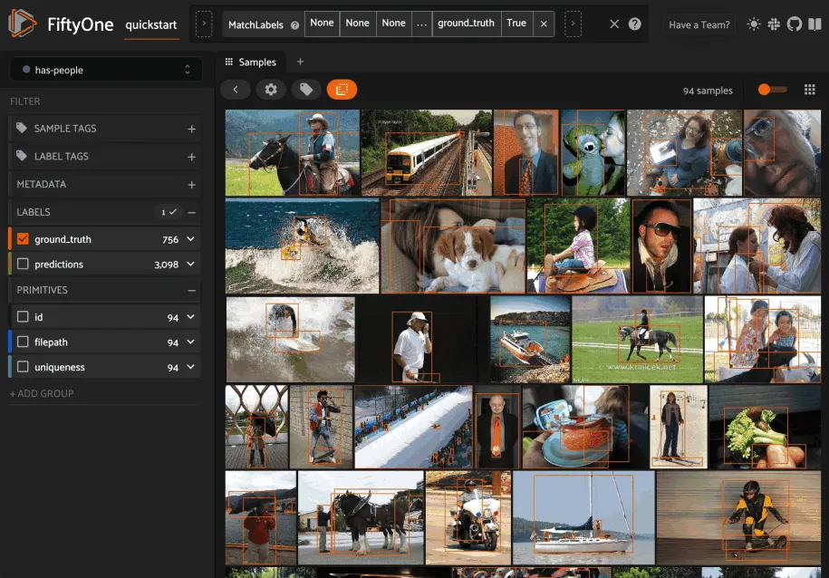
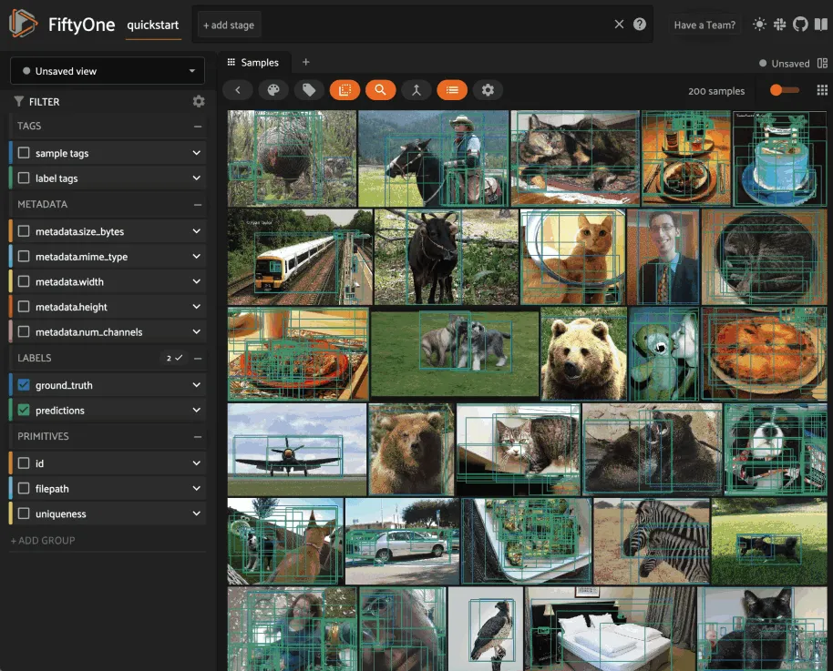
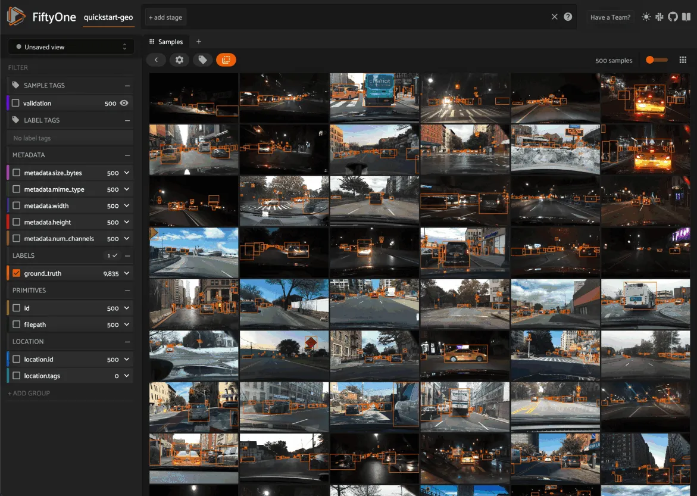
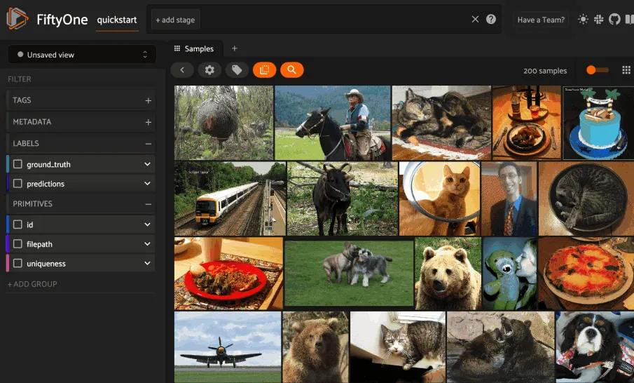
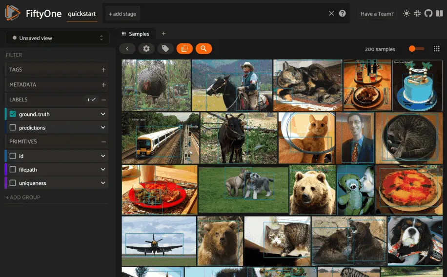
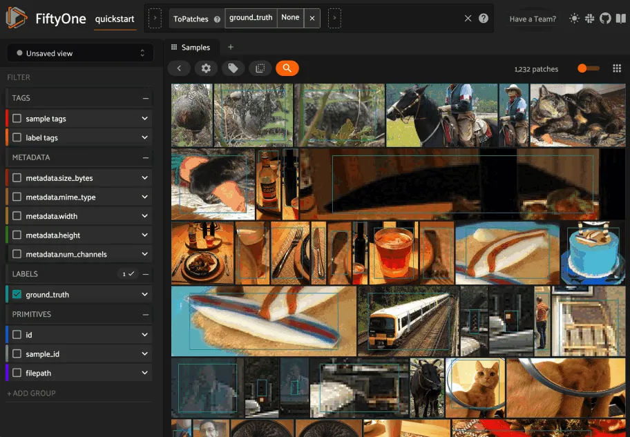

# Using the FiftyOne App [¶](\#using-the-fiftyone-app "Permalink to this headline")

The FiftyOne App is a powerful graphical user interface that enables you to
visualize, browse, and interact directly with your
[datasets](using_datasets.md#using-datasets).


Note

Did you know? You can use FiftyOne’s
[plugin framework](../plugins/index.md#fiftyone-plugins) to customize and extend the
behavior of the App!

## App environments [¶](\#app-environments "Permalink to this headline")

The FiftyOne App can be used in any environment that you’re working in, from
a local IPython shell, to a remote machine or cloud instance, to a Jupyter or
Colab notebook. Check out the [environments guide](running_environments.md#environments) for best
practices when working in each environment.

## Sessions [¶](\#sessions "Permalink to this headline")

The basic FiftyOne workflow is to open a Python shell and load a [`Dataset`](../api/fiftyone.core.dataset.html#fiftyone.core.dataset.Dataset "fiftyone.core.dataset.Dataset").
From there you can launch the FiftyOne App and interact with it
programmatically via a _session_.

### Creating a session [¶](\#creating-a-session "Permalink to this headline")

You can launch an instance of the App by calling
[`launch_app()`](../api/fiftyone.core.session.html#fiftyone.core.session.launch_app "fiftyone.core.session.launch_app"). This method returns a
[`Session`](../api/fiftyone.core.session.html#fiftyone.core.session.Session "fiftyone.core.session.Session") instance, which you can subsequently use to interact programmatically
with the App!

```python
import fiftyone as fo

session = fo.launch_app()

```


App sessions are highly flexible. For example, you can launch
[launch multiple App instances](../faq/index.md#faq-multiple-apps) and connect multiple
App instances to the [same dataset](../faq/index.md#faq-multiple-sessions-same-dataset).

By default, when you’re working in a non-notebook context, the App will be
opened in a new tab of your web browser. See
[this FAQ](../faq/index.md#faq-supported-browsers) for supported browsers.

Note

[`fo.launch_app()`](../api/fiftyone.core.session.html#fiftyone.core.session.launch_app "fiftyone.core.session.launch_app") will launch the
App asynchronously and return control to your Python process. The App will
then remain connected until the process exits.

Therefore, if you are using the App in a script, you should use
[`session.wait()`](../api/fiftyone.core.session.html#fiftyone.core.session.Session.wait "fiftyone.core.session.Session.wait") to block
execution until you close it manually:

```python
# Launch the App
session = fo.launch_app(...)

# (Perform any additional operations here)

# Blocks execution until the App is closed
session.wait()

# Or block execution indefinitely with a negative wait value
# session.wait(-1)

```

Note

When working inside a Docker container, FiftyOne should automatically
detect and appropriately configure networking. However, if you are unable
to load the App in your browser, you many need to manually
[set the App address](running_environments.md#restricting-app-address) to `0.0.0.0`:

```python
session = fo.launch_app(..., address="0.0.0.0")

```

See [this page](running_environments.md#docker) for more information about working with
FiftyOne inside Docker.

Note

If you are a Windows user launching the App from a script, you should use
the pattern below to avoid
[multiprocessing issues](https://stackoverflow.com/q/20360686), since the
App is served via a separate process:

```python
import fiftyone as fo

dataset = fo.load_dataset(...)

if __name__ == "__main__":
    # Ensures that the App processes are safely launched on Windows
    session = fo.launch_app(dataset)
    session.wait()

```

### Updating a session’s dataset [¶](\#updating-a-session-s-dataset "Permalink to this headline")

Sessions can be updated to show a new [`Dataset`](../api/fiftyone.core.dataset.html#fiftyone.core.dataset.Dataset "fiftyone.core.dataset.Dataset") by updating the
[`Session.dataset`](../api/fiftyone.core.session.html#fiftyone.core.session.Session.dataset "fiftyone.core.session.Session.dataset") property of the
session object:

```python
import fiftyone.zoo as foz

dataset = foz.load_zoo_dataset("cifar10")

# View the dataset in the App
session.dataset = dataset

```


### Updating a session’s view [¶](\#updating-a-session-s-view "Permalink to this headline")

You can also show a specific [view](using_views.md#using-views) into the current dataset
in the App by setting the
[`Session.view`](../api/fiftyone.core.session.html#fiftyone.core.session.Session.view "fiftyone.core.session.Session.view") property of the
session.

For example, the command below loads a [`DatasetView`](../api/fiftyone.core.view.html#fiftyone.core.view.DatasetView "fiftyone.core.view.DatasetView") in the App that shows the
first 10 samples in the dataset sorted by their `uniqueness` field:

```python
session.view = dataset.sort_by("uniqueness").limit(10)

```


### Loading a sample or group [¶](\#loading-a-sample-or-group "Permalink to this headline")

You can immediately load a specific sample
[in the modal](#app-sample-view) when launching a new [`Session`](../api/fiftyone.core.session.html#fiftyone.core.session.Session "fiftyone.core.session.Session") by
providing its ID via the `sample_id` parameter:

```python
import fiftyone as fo
import fiftyone.zoo as foz

dataset = foz.load_zoo_dataset("quickstart")
sample_id = dataset.last().id

session = fo.launch_app(dataset, sample_id=sample_id)

```

You can also programmatically load a sample in the modal on an existing session
by setting its
[`session.sample_id`](../api/fiftyone.core.session.html#fiftyone.core.session.Session.sample_id "fiftyone.core.session.Session.sample_id") property:

```python
sample_id = dataset.take(1).first().id

session.sample_id = sample_id

```

Note

Did you know? You can link directly to a sample by copy + pasting the App’s
URL into your browser search bar!

Similarly, for [group datasets](groups.md#groups), you can immediately load a
specific group in the modal when launching a new [`Session`](../api/fiftyone.core.session.html#fiftyone.core.session.Session "fiftyone.core.session.Session") by providing its ID
via the `group_id` parameter:

```python
import fiftyone as fo
import fiftyone.zoo as foz

dataset = foz.load_zoo_dataset("quickstart-groups")
group_id = dataset.last().group.id

session = fo.launch_app(dataset, group_id=group_id)

```

You can also programmatically load a group in the modal on an existing session
by setting its
[`session.group_id`](../api/fiftyone.core.session.html#fiftyone.core.session.Session.group_id "fiftyone.core.session.Session.group_id") property:

```python
group_id = dataset.take(1).first().group.id

session.group_id = group_id

```

Note

Did you know? You can link directly to a group by copy + pasting the App’s
URL into your browser search bar!

## Remote sessions [¶](\#remote-sessions "Permalink to this headline")

If your data is stored on a remote machine, you can forward a session from
the remote machine to your local machine and seamlessly browse your remote
dataset from you web browser.

Check out the [environments page](running_environments.md#environments) for more information on
possible configurations of local/remote/cloud data and App access.

### Remote machine [¶](\#remote-machine "Permalink to this headline")

On the remote machine, you can load a [`Dataset`](../api/fiftyone.core.dataset.html#fiftyone.core.dataset.Dataset "fiftyone.core.dataset.Dataset") and launch a remote session
using either the Python library or the CLI.

### Local machine [¶](\#local-machine "Permalink to this headline")

On the local machine, you can access an App instance connected to the remote
session by either manually configuring port forwarding or via the FiftyOne CLI:

Note

Remote sessions are highly flexible. For example, you can connect to
[multiple remote sessions](../faq/index.md#faq-connect-to-multiple-remote-sessions)
and run multiple remote sessions
[from one machine](../faq/index.md#faq-serve-multiple-remote-sessions).

## Using the sidebar [¶](\#using-the-sidebar "Permalink to this headline")

Any labels, tags, and scalar fields can be overlaid on the samples in the App
by toggling the corresponding display options in the App’s sidebar:


If you have [stored metadata](using_datasets.md#storing-field-metadata) on your fields,
then you can view this information in the App by hovering over field or
attribute names in the App’s sidebar:


### Filtering sample fields [¶](\#filtering-sample-fields "Permalink to this headline")

The App provides UI elements in both grid view and expanded sample view that
you can use to filter your dataset. To view the available filter options for a
field, click the caret icon to the right of the field’s name.

Whenever you modify a filter element, the App will automatically update to show
only those samples and/or labels that match the filter.

Note

Did you know? When you
[declare custom attributes](using_datasets.md#dynamic-attributes) on your dataset’s
schema, they will automatically become filterable in the App!

Note

Did you know? When you have applied filter(s) in the App, a bookmark icon
appears in the top-left corner of the sample grid. Click this button to
convert your filters to an equivalent set of stage(s) in the
[view bar](#app-create-view)!


### Optimizing Query Performance [¶](\#optimizing-query-performance "Permalink to this headline")

The App’s sidebar is optimized to leverage database indexes whenever possible.

Fields that are indexed are indicated by lightning bolt icons next to their
field/attribute names:


The above GIF shows query performance in action on the train split of the
[BDD100K dataset](../data/dataset_zoo/datasets.md#bdd100k) with an index on the
`detections.detections.label` field:

```python
import fiftyone as fo
import fiftyone.zoo as foz

# The path to the source files that you manually downloaded
source_dir = "/path/to/dir-with-bdd100k-files"

dataset = foz.load_zoo_dataset(
    "bdd100k",
    split="train",
    source_dir=source_dir,
)

dataset.create_index("detections.detections.label")

session = fo.launch_app(dataset)

```

Note

When filtering by multiple fields, queries will be more efficient when your
**first** filter is on an indexed field.

The SDK provides a number of useful utilities for managing indexes on your
datasets:

- [`list_indexes()`](../api/fiftyone.core.collections.html#fiftyone.core.collections.SampleCollection.list_indexes "fiftyone.core.collections.SampleCollection.list_indexes") -
list all existing indexes

- [`create_index()`](../api/fiftyone.core.collections.html#fiftyone.core.collections.SampleCollection.create_index "fiftyone.core.collections.SampleCollection.create_index") -
create a new index

- [`drop_index()`](../api/fiftyone.core.collections.html#fiftyone.core.collections.SampleCollection.drop_index "fiftyone.core.collections.SampleCollection.drop_index") -
drop an existing index

- [`get_index_information()`](../api/fiftyone.core.collections.html#fiftyone.core.collections.SampleCollection.get_index_information "fiftyone.core.collections.SampleCollection.get_index_information") -
get information about the existing indexes

Note

Did you know? With [FiftyOne Teams](../teams/index.md#fiftyone-teams) you can manage
indexes natively in the App via the
[Query Performance panel](../teams/query_performance.md#query-performance).

In general, we recommend indexing _only_ the specific fields that you wish to
perform initial filters on:

```python
import fiftyone as fo

dataset = fo.Dataset()

# Index specific top-level fields
dataset.create_index("camera_id")
dataset.create_index("recorded_at")
dataset.create_index("annotated_at")
dataset.create_index("annotated_by")

# Index specific embedded document fields
dataset.create_index("ground_truth.detections.label")
dataset.create_index("ground_truth.detections.confidence")

# Note: it is faster to declare indexes before adding samples
dataset.add_samples(...)

session = fo.launch_app(dataset)

```

Note

Filtering by frame fields of video datasets is not directly optimizable by
creating indexes. Instead, use [summary fields](using_datasets.md#summary-fields) to
efficiently query frame-level information on large video datasets.

Frame filtering in the App’s grid view can be disabled by setting
`disable_frame_filtering=True` in your
[App config](config.md#configuring-fiftyone-app).

For [grouped datasets](groups.md#groups), you should create two indexes for each
field you wish to filter by: the field itself and a compound index that
includes the group slice name:

```python
import fiftyone as fo
import fiftyone.zoo as foz

dataset = foz.load_zoo_dataset("quickstart-groups")

# Index a specific field
dataset.create_index("ground_truth.detections.label")
dataset.create_index([("group.name", 1), ("ground_truth.detections.label", 1)])

session = fo.launch_app(dataset)

```

For datasets with a small number of fields, you can index all fields by adding
a single
[global wildcard index](https://www.mongodb.com/docs/manual/core/indexes/index-types/index-wildcard/create-wildcard-index-all-fields/#std-label-create-wildcard-index-all-fields):

```python
import fiftyone as fo
import fiftyone.zoo as foz

dataset = foz.load_zoo_dataset("quickstart")
dataset.create_index("$**")

session = fo.launch_app(dataset)

```

Warning

For large datasets with many fields, global wildcard indexes may require a
substantial amount of RAM and query performance may be degraded compared to
selectively indexing a smaller number of fields.

You can also wildcard index all attributes of a specific embedded document
field:

```python
# Wildcard index for all attributes of ground truth detections
dataset.create_index("ground_truth.detections.$**")

```

Note

Numeric field filters are not supported by wildcard indexes.

### Disabling Query Performance [¶](\#disabling-query-performance "Permalink to this headline")

[Query Performance](#app-optimizing-query-performance) is enabled by
default for all datasets. This is generally the recommended setting for all
large datasets to ensure that queries are performant.

However, in certain circumstances you may prefer to disable Query Performance,
which enables the App’s sidebar to show additional information such as
label/value counts that are useful but more expensive to compute.

You can disable Query Performance for a particular dataset for its lifetime
(in your current browser) via the gear icon in the Samples panel’s actions row:


You can also disable Query Performance by default for all datasets by setting
`default_query_performance=False` in your
[App config](config.md#configuring-fiftyone-app).

### Sidebar groups [¶](\#sidebar-groups "Permalink to this headline")

You can customize the layout of the App’s sidebar by creating/renaming/deleting
groups and dragging fields between groups directly in the App:

```python
import fiftyone as fo
import fiftyone.zoo as foz

dataset = foz.load_zoo_dataset("quickstart")
session = fo.launch_app(dataset)

```


Note

Any changes you make to a dataset’s sidebar groups in the App are saved on
the dataset and will persist between sessions.

You can also programmatically modify a dataset’s sidebar groups by editing the
[`sidebar_groups`](../api/fiftyone.core.odm.dataset.html#fiftyone.core.odm.dataset.DatasetAppConfig "fiftyone.core.odm.dataset.DatasetAppConfig") property
of the [dataset’s App config](using_datasets.md#dataset-app-config):

```python
# Get the default sidebar groups for the dataset
sidebar_groups = fo.DatasetAppConfig.default_sidebar_groups(dataset)

# Collapse the `metadata` section by default
print(sidebar_groups[2].name)  # metadata
sidebar_groups[2].expanded = False

# Add a new group
sidebar_groups.append(fo.SidebarGroupDocument(name="new"))

# Modify the dataset's App config
dataset.app_config.sidebar_groups = sidebar_groups
dataset.save()  # must save after edits

session = fo.launch_app(dataset)

```

You can conveniently reset the sidebar groups to their default state by setting
[`sidebar_groups`](../api/fiftyone.core.odm.dataset.html#fiftyone.core.odm.dataset.DatasetAppConfig "fiftyone.core.odm.dataset.DatasetAppConfig") to `None`:

```python
# Reset sidebar groups
dataset.app_config.sidebar_groups = None
dataset.save()  # must save after edits

session = fo.launch_app(dataset)

```

Note

If a dataset has fields that do not appear in the dataset’s
[`sidebar_groups`](../api/fiftyone.core.odm.dataset.html#fiftyone.core.odm.dataset.DatasetAppConfig "fiftyone.core.odm.dataset.DatasetAppConfig")
property, these fields will be dynamically assigned to default groups in
the App at runtime.

## Using the view bar [¶](\#using-the-view-bar "Permalink to this headline")

The view bar makes all of the powerful searching, sorting, and filtering
operations [provided by dataset views](using_views.md#using-views) available directly in
the App.

Note

Any changes to the current view that you make in the view bar are
automatically reflected in the [`DatasetView`](../api/fiftyone.core.view.html#fiftyone.core.view.DatasetView "fiftyone.core.view.DatasetView") exposed by the
[`Session.view`](../api/fiftyone.core.session.html#fiftyone.core.session.Session.view "fiftyone.core.session.Session.view") property of the
App’s session object.


## Grouping samples [¶](\#grouping-samples "Permalink to this headline")

You can use the group action in the App’s menu to
[dynamically group](using_views.md#view-groups) your samples by a field of your choice:


In this mode, the App’s grid shows the first sample from each group, and you
can click on a sample to view all elements of the group in the modal.

You may navigate through the elements of the group either sequentially using
the carousel, or randomly using the pagination UI at the bottom of the modal.


When viewing _ordered_ groups, you have an additional option to render the
elements of the group as a video.


## Field visibility [¶](\#field-visibility "Permalink to this headline")

You can configure which fields of your dataset appear in the App’s sidebar by
clicking the settings icon in the upper right of the sidebar to open the Field
visibility modal.

Consider the following example:

```python
import fiftyone as fo
import fiftyone.zoo as foz
from datetime import datetime

dataset = foz.load_zoo_dataset("quickstart")
dataset.add_dynamic_sample_fields()

field = dataset.get_field("ground_truth")
field.description = "Ground truth annotations"
field.info = {"creator": "alice", "created_at": datetime.utcnow()}
field.save()

field = dataset.get_field("predictions")
field.description = "YOLOv8 predictions"
field.info = {"owner": "bob", "created_at": datetime.utcnow()}
field.save()

session = fo.launch_app(dataset)

```

### Manual selection [¶](\#manual-selection "Permalink to this headline")

You can use the `Selection` tab to manually select which fields to display.
By default, only top-level fields are available for selection, but if you want
fine-grained control you can opt to include nested fields
(eg [dynamic attributes](using_datasets.md#dynamic-attributes) of your label fields) in the
selection list as well.

Note

You cannot exclude default fields/attributes from your dataset’s
schema, so these rows are always disabled in the Field visibility UI.

Click `Apply` to reload the App with only the specified fields in the sidebar.
When you do so, a filter icon will appear to the left of the settings icon in
the sidebar indicating how many fields are currently excluded. You can reset
your selection by clicking this icon or reopening the modal and pressing the
`Reset` button at the bottom.


Note

If your dataset has many fields and you frequently work with different
subsets of them, you can persist/reload field selections by
[saving views](#app-saving-views).

### Filter rules [¶](\#filter-rules "Permalink to this headline")

Alternatively, you can use the `Filter rule` tab to define a rule that is
dynamically applied to the dataset’s
[field metadata](using_datasets.md#storing-field-metadata) each time the App loads to
determine which fields to include in the sidebar.

Note

Filter rules are dynamic. If you [save a view](#app-saving-views) that
contains a filter rule, the matching fields may increase or decrease over
time as you modify the dataset’s schema.

Filter rules provide a simple syntax with different options for matching
fields:


Note

All filter rules are implemented as substring matches against the
stringified contents of the relevant field metadata.

## Color schemes [¶](\#color-schemes "Permalink to this headline")

You can configure the color scheme used by the App to render content by
clicking on the color palette icon above the sample grid.

Consider the following example:

```python
import fiftyone as fo
import fiftyone.zoo as foz

dataset = foz.load_zoo_dataset("quickstart")
dataset.evaluate_detections(
    "predictions", gt_field="ground_truth", eval_key="eval"
)

session = fo.launch_app(dataset)

```

### Color schemes in the App [¶](\#color-schemes-in-the-app "Permalink to this headline")

The GIF below demonstrates how to:

- Configure a custom color pool from which to draw colors for otherwise
unspecified fields/values

- Configure the colors assigned to specific fields in color by `field` mode

- Configure the colors used to render specific annotations based on their
attributes in color by `value` mode

- Save the customized color scheme as the default for the dataset


Note

Any customizations you make only apply to the current dataset. Each time
you load a new dataset, the color scheme will revert to that dataset’s
default color scheme (if any) or else the global default color scheme.

To persist a color scheme, you can press `Save as default` to save the
color scheme as the dataset’s default scheme, copy it via the modal’s JSON
viewer, or access it programmatically via
[`session.color_scheme`](../api/fiftyone.core.session.html#fiftyone.core.session.Session.color_scheme "fiftyone.core.session.Session.color_scheme")
as described below.

The following table describes the available color scheme customization options
in detail:

| Tab | Element | Description |
| --- | --- | --- |
| Global settings | Color annotations by | Whether to color the annotations in the grid/modal based on<br>the `field` that they are in, the `value` that each<br>annotation takes, or per `instance` of the annotation |
| Global settings | Color pool | A pool of colors from which colors are randomly assigned<br>for otherwise unspecified fields/values |
| Global settings | Label Opacity | Color opacity of annotations |
| Global settings | Multicolor keypoints | Whether to independently coloy keypoint points by their index |
| Global settings | Show keypoints skeletons | Whether to show keypoint skeletons, if available |
| Global settings | Default mask targets colors | If the MaskTargetsField is defined with integer keys, the<br>dataset can assign a default color based on the integer keys |
| Global settings | Default colorscale | The default colorscale to use when rendering heatmaps |
| JSON editor |  | A JSON representation of the current color scheme that you<br>can directly edit or copy + paste |
| All | `Reset` button | Reset the current color scheme to the dataset’s default<br>(if any) or else the global default scheme |
| All | `Save as default` button | Save the current color scheme as the default for the<br>current dataset. Note that this scheme can be viewed and/or<br>modified [in Python](using_datasets.md#dataset-app-config-color-scheme) |
| All | `Clear default` button | Deletes the current dataset’s default color scheme |
| `FIELD` | Use custom colors for `FIELD` | Allows you to specify a custom color to use whenever<br>rendering any content from that field in the grid/modal<br>when the App is in color by `field` mode |
| `FIELD` | Use custom colors for<br>specific field values | Allows you to specify custom colors to use to render<br>annotations in this field based on the individual values<br>that it takes. In the case of embedded document fields,you<br>must also specify an attribute of each object. For example,<br>color all<br>[`Classification`](../api/fiftyone.core.labels.html#fiftyone.core.labels.Classification "fiftyone.core.labels.Classification")<br>instances whose `label` is `"car"` in `#FF0000`;<br>[`Segmentation`](../api/fiftyone.core.labels.html#fiftyone.core.labels.Segmentation "fiftyone.core.labels.Segmentation")<br>instances whose `mask target integer` is `12` in `#FF0000`;<br>[`Heatmap`](../api/fiftyone.core.labels.html#fiftyone.core.labels.Heatmap "fiftyone.core.labels.Heatmap")<br>instances using `hsv` colorscale. |

### Color schemes in Python [¶](\#color-schemes-in-python "Permalink to this headline")

You can also programmatically configure a session’s color scheme by creating
[`ColorScheme`](../api/fiftyone.core.odm.dataset.html#fiftyone.core.odm.dataset.ColorScheme "fiftyone.core.odm.dataset.ColorScheme") instances in Python:

```python
# Create a custom color scheme
fo.ColorScheme(
    color_pool=["#ff0000", "#00ff00", "#0000ff", "pink", "yellowgreen"],
    fields=[\
        {\
            "path": "ground_truth",\
            "colorByAttribute": "eval",\
            "valueColors": [\
                 # false negatives: blue\
                {"value": "fn", "color": "#0000ff"},\
                # true positives: green\
                {"value": "tp", "color": "#00ff00"},\
            ]\
        },\
        {\
            "path": "predictions",\
            "colorByAttribute": "eval",\
            "valueColors": [\
                # false positives: red\
                {"value": "fp", "color": "#ff0000"},\
                 # true positives: green\
                {"value": "tp", "color": "#00ff00"},\
            ]\
        },\
        {\
            "path": "segmentations",\
            "maskTargetsColors": [\
                 # 12: red\
                {"intTarget": 12, "color": "#ff0000"},\
                 # 15: green\
                {"intTarget": 15, "color": "#00ff00"},\
            ]\
        }\
    ],
    color_by="value",
    opacity=0.5,
    default_colorscale= {"name": "rdbu", "list": None},
    colorscales=[\
        {\
             # field definition overrides the default_colorscale\
            "path": "heatmap_2",\
             # if name is defined, it will override the list\
            "name": None,\
            "list": [\
                {"value": 0.0, "color": "rgb(0,255,255)"},\
                {"value": 0.5, "color": "rgb(255,0,0)"},\
                {"value": 1.0, "color": "rgb(0,0,255)"},\
            ],\
        }\
    ],
)

```

Note

Refer to the [`ColorScheme`](../api/fiftyone.core.odm.dataset.html#fiftyone.core.odm.dataset.ColorScheme "fiftyone.core.odm.dataset.ColorScheme") class for documentation of the available
customization options.

You can launch the App with a custom color scheme by passing the optional
`color_scheme` parameter to
[`launch_app()`](../api/fiftyone.core.session.html#fiftyone.core.session.launch_app "fiftyone.core.session.launch_app"):

```python
# Launch App with a custom color scheme
session = fo.launch_app(dataset, color_scheme=color_scheme)

```

Once the App is launched, you can retrieve your current color scheme at any
time via the
[`session.color_scheme`](../api/fiftyone.core.session.html#fiftyone.core.session.Session.color_scheme "fiftyone.core.session.Session.color_scheme")
property:

```python
print(session.color_scheme)

```

You can also dynamically edit your current color scheme by modifying it:

```python
# Change the session's current color scheme
session.color_scheme = fo.ColorScheme(...)

# Edit the existing color scheme in-place
session.color_scheme.color_pool = [...]
session.refresh()

```

Note

Did you know? You can also configure default color schemes for
[individual datasets](using_datasets.md#dataset-app-config-color-scheme) via Python!

## Saving views [¶](\#saving-views "Permalink to this headline")

You can use the menu in the upper-left of the App to record the current state
of the App’s view bar and filters sidebar as a **saved view** into your
dataset:


Saved views are persisted on your dataset under a name of your choice so that
you can quickly load them in a future session via this UI.

Saved views are a convenient way to record semantically relevant subsets of a
dataset, such as:

- Samples in a particular state, eg with certain tag(s)

- A subset of a dataset that was used for a task, eg training a model

- Samples that contain content of interest, eg object types or image
characteristics

Note

Saved views only store the rule(s) used to extract content from the
underlying dataset, not the actual content itself. Saving views is cheap.
Don’t worry about storage space!

Keep in mind, though, that the contents of a saved view may change as the
underlying dataset is modified. For example, if a save view contains
samples with a certain tag, the view’s contents will change as you
add/remove this tag from samples.

You can load a saved view at any time by selecting it from the saved view menu:


You can also edit or delete saved views by clicking on their pencil icon:



Note

Did you know? You can also programmatically create, modify, and delete
saved views [via Python](using_views.md#saving-views)!

## Viewing a sample [¶](\#viewing-a-sample "Permalink to this headline")

Click a sample to open an expanded view of the sample. This modal also
contains information about the fields of the [`Sample`](../api/fiftyone.core.sample.html#fiftyone.core.sample.Sample "fiftyone.core.sample.Sample") and allows you to access
the raw JSON description of the sample.



If your labels contain many [dynamic attributes](using_datasets.md#dynamic-attributes), you
may find it helpful to configure which attributes are shown in the tooltip.
To do so, press `ctrl` while hovering over a label to lock the tooltip
in-place and then use the show/hide buttons to customize the display.

Note

Tooltip customizations are persisted in your browser’s local storage on a
per-dataset and per-field basis.


## Using the image visualizer [¶](\#using-the-image-visualizer "Permalink to this headline")

The image visualizer allows you to interactively visualize images along with
their associated labels. When you hover over an image in the visualizer, a
head-up display (HUD) appears with a control bar providing various options.

For example, you can zoom in/out and pan around an image by scrolling and
click-dragging with your mouse or trackpad. You can also zoom tightly into the
currently visible (or selected) labels by clicking on the `Crop` icon in the
controls HUD or using the `z` keyboard shortcut. Press `ESC` to reset your
view.

When multiple labels are overlaid on top of each other, the up and down
arrows offer a convenient way to rotate the z-order of the labels that your
cursor is hovering over, so every label and it’s tooltip can be viewed.

The settings icon in the controls HUD contains a variety of options for
customizing the rendering of your labels, including whether to show object
labels, confidences, or the tooltip. The default settings for these parameters
can be configured via the [App config](#app-config).

Keyboard shortcuts are available for almost every action. Click the `?` icon
in the controls HUD or use the `?` keyboard shortcut to display the list of
available actions and their associated hotkeys.


Note

When working in [Jupyter/Colab notebooks](running_environments.md/#notebooks), you can hold
down the `SHIFT` key when zoom-scrolling or using the arrow keys to
navigate between samples/labels to restrict your inputs to the App and thus
prevent them from also affecting your browser window.

## Using the video visualizer [¶](\#using-the-video-visualizer "Permalink to this headline")

The video visualizer offers all of the same functionality as the image
visualizer, as well as some convenient actions and shortcuts for navigating
through a video and its labels.

There are a variety of additional video-specific keyboard shortcuts. For
example, you can press the spacebar to play/pause the video, and you can press
`0`, `1`, …, `9` to seek to the 0%, 10%, …, 90% timestamp in the video.
When the video is paused, you can use `<` and `>` to navigate frame-by-frame
through the video.

Click the `?` icon in the controls HUD or use the `?` keyboard shortcut to
display the list of available actions and their associated hotkeys.

All of the same options in the image settings are available in the video
settings menu in the controls HUD, as well as additional options like whether
to show frame numbers rather than timestamp in the HUD. The default settings
for all such parameters can be configured via the
[App config](#app-config).

Playback rate and volume are also available in the video controls HUD.
Clicking on one of the icons resets the setting to the default. And when
hovering, a slider appears to adjust the setting manually.

Note

Did you know? The video visualizer streams frame data on-demand, which
means that playback begins as soon as possible and even heavyweight label
types like segmentations are supported!


Note

When working in [Jupyter/Colab notebooks](running_environments.md/#notebooks), you can hold
down the `SHIFT` key when zoom-scrolling or using the arrow keys to
navigate between samples/labels to restrict your inputs to the App and thus
prevent them from also affecting your browser window.

## Using the 3D visualizer [¶](\#using-the-3d-visualizer "Permalink to this headline")

The 3D visualizer allows you to interactively visualize
[3D samples](using_datasets.md#d-datasets) or
[point cloud samples](using_datasets.md#point-cloud-datasets)
along with any associated
[3D detections](using_datasets.md#d-detections) and [3D polylines](using_datasets.md#d-polylines):


The table below summarizes the mouse/keyboard controls that the 3D visualizer
supports:

| Input | Action | Description |
| --- | --- | --- |
| Wheel | Zoom | Zoom in and out |
| Drag | Rotate | Rotate the camera |
| Shift + drag | Translate | Translate the camera |
| B | Background | Toggle background on/off |
| F | Fullscreen | Toggle fullscreen |
| G | Grid | Toggle the grid on/off |
| T | Top-down | Reset camera to top-down view |
| E | Ego-view | Reset the camera to ego view |
| ESC | Escape context | Escape the current context |

A variety of context-specific options are available in a draggable
panel in the 3D visualizer that let you configure lights, as well as
material and visibility of the 3D objects in the scene.

In addition, the HUD at the bottom of the 3D visualizer provides the following
controls:

- Click the grid icon to toggle the grid on/off

- Click the `T` to reset the camera to top-down view

- Click the `E` to reset the camera to ego-view

For point clouds, when coloring by intensity, the color of each point is
computed by mapping the `r` channel of the `rgb` field of the
[PCD file](https://pointclouds.org/documentation/tutorials/pcd_file_format.html)
onto a fixed colormap, which is scaled so that the full colormap is matched to
the observed dynamic range of `r` values for each sample.

Similarly, when coloring by height, the `z` value of each point is mapped to
the full colormap using the same strategy.

### Viewing 3D samples in the grid [¶](\#viewing-3d-samples-in-the-grid "Permalink to this headline")

When you load 3D collections in the App, any
[3D detections](using_datasets.md#d-detections) and [3D polylines](using_datasets.md#d-polylines)
fields will be visualized in the grid using an orthographic projection
(onto the xy plane by default).

In addition, if you have populated
[orthographic projection images](using_datasets.md#orthographic-projection-images) on your
dataset, the projection images will be rendered for each sample in the grid:

```python
import fiftyone as fo
import fiftyone.utils.utils3d as fou3d
import fiftyone.zoo as foz

# Load an example 3D dataset
dataset = (
    foz.load_zoo_dataset("quickstart-groups")
    .select_group_slices("pcd")
    .clone()
)

# Populate orthographic projections
fou3d.compute_orthographic_projection_images(dataset, (-1, 512), "/tmp/proj")

session = fo.launch_app(dataset)

```


### Configuring the 3D visualizer [¶](\#configuring-the-3d-visualizer "Permalink to this headline")

The 3D visualizer can be configured by including any subset of the settings
shown below under the `plugins.3d` key of your
[App config](config.md#configuring-fiftyone-app):

```python
// The default values are shown below
{
    "plugins": {
        "3d": {
            // Whether to show the 3D visualizer
            "enabled": true,

            // The initial camera position in the 3D scene
            "defaultCameraPosition": {"x": 0, "y": 0, "z": 0},

            // The default up direction for the scene
            "defaultUp": [0, 0, 1],

            "pointCloud": {
                // Don't render points below this z value
                "minZ": null
            }
        }
    }
}

```

You can also store dataset-specific plugin settings by storing any subset of
the above values on a [dataset’s App config](using_datasets.md#dataset-app-config):

```python
# Configure the 3D visualizer for a dataset's PCD/Label data
dataset.app_config.plugins["3d"] = {
    "defaultCameraPosition": {"x": 0, "y": 0, "z": 100},
}
dataset.save()

```

Note

Dataset-specific plugin settings will override any settings from your
[global App config](config.md#configuring-fiftyone-app).

## Spaces [¶](\#spaces "Permalink to this headline")

Spaces provide a customizable framework for organizing interactive Panels of
information within the App.

FiftyOne natively includes the following Panels:

- [Samples panel](#app-samples-panel): the media grid that loads by
default when you launch the App

- [Embeddings panel](#app-embeddings-panel): a canvas for working with
[embeddings visualizations](brain.md#visualizing-embeddings)

- [Model Evaluation panel](#app-model-evaluation-panel): interactively
analyze and visualize your model’s performance

- [Map panel](#app-map-panel): visualizes the geolocation data of
datasets that have a [`GeoLocation`](../api/fiftyone.core.labels.html#fiftyone.core.labels.GeoLocation "fiftyone.core.labels.GeoLocation") field

- [Histograms panel](#app-histograms-panel): a dashboard of histograms
for the fields of your dataset

Note

You can also configure custom Panels [via plugins](../plugins/index.md#fiftyone-plugins)!


### Configuring spaces in the App [¶](\#configuring-spaces-in-the-app "Permalink to this headline")

Consider the following example dataset:

```python
import fiftyone as fo
import fiftyone.brain as fob
import fiftyone.zoo as foz

dataset = foz.load_zoo_dataset("quickstart")
fob.compute_visualization(dataset, brain_key="img_viz")

session = fo.launch_app(dataset)

```

You can configure spaces visually in the App in a variety of ways described
below.

Click the `+` icon in any Space to add a new Panel:


When you have multiple Panels open in a Space, you can use the divider buttons
to split the Space either horizontally or vertically:


You can rearrange Panels at any time by dragging their tabs between Spaces, or
close Panels by clicking their `x` icon:


### Configuring spaces in Python [¶](\#configuring-spaces-in-python "Permalink to this headline")

You can also programmatically configure your Space layout and the states of the
individual Panels via the `Space` and `Panel` classes in Python, as shown
below:

```python
samples_panel = fo.Panel(type="Samples", pinned=True)

histograms_panel = fo.Panel(
    type="Histograms",
    state=dict(plot="Labels"),
)

embeddings_panel = fo.Panel(
    type="Embeddings",
    state=dict(brainResult="img_viz", colorByField="metadata.size_bytes"),
)

spaces = fo.Space(
    children=[\
        fo.Space(\
            children=[\
                fo.Space(children=[samples_panel]),\
                fo.Space(children=[histograms_panel]),\
            ],\
            orientation="horizontal",\
        ),\
        fo.Space(children=[embeddings_panel]),\
    ],
    orientation="vertical",
)

```

The `children` property of each
`Space` describes what the Space contains, which can be either:

- A list of `Space` instances. In this case, the Space contains a nested list
of Spaces, arranged either horizontally or vertically, as per the
`orientation` property of the
parent Space

- A list of `Panel` instances describing the Panels that should be available
as tabs within the Space

Set a Panel’s `pinned` property to
`True` if you do not want a Panel’s tab to have a close icon `x` in the App.
Each `Panel` also has a `state` dict
that can be used to configure the specific state of the Panel to load. Refer to
the sections below for each Panel’s available state.

You can launch the App with an initial spaces layout by passing the optional
`spaces` parameter to
[`launch_app()`](../api/fiftyone.core.session.html#fiftyone.core.session.launch_app "fiftyone.core.session.launch_app"):

```python
# Launch the App with an initial Spaces layout
session = fo.launch_app(dataset, spaces=spaces)

```

Once the App is launched, you can retrieve your current layout at any time via
the [`session.spaces`](../api/fiftyone.core.session.html#fiftyone.core.session.Session.spaces "fiftyone.core.session.Session.spaces") property:

```python
print(session.spaces)

```

You can also programmatically configure the App’s current layout by setting
[`session.spaces`](../api/fiftyone.core.session.html#fiftyone.core.session.Session.spaces "fiftyone.core.session.Session.spaces") to any valid
`Space` instance:

```python
# Change the session's current Spaces layout
session.spaces = spaces

```

Note

Inspecting [`session.spaces`](../api/fiftyone.core.session.html#fiftyone.core.session.Session.spaces "fiftyone.core.session.Session.spaces") of
a session whose Spaces layout you’ve configured in the App is a convenient
way to discover the available state options for each Panel type!

You can reset your spaces to their default state by setting
[`session.spaces`](../api/fiftyone.core.session.html#fiftyone.core.session.Session.spaces "fiftyone.core.session.Session.spaces") to None:

```python
# Reset spaces layout in the App
session.spaces = None

```

## Saving workspaces [¶](\#saving-workspaces "Permalink to this headline")

If you find yourself frequently using/recreating a certain
[spaces layout](#app-spaces), you can save it as a workspace with a name
of your choice and then load it later via the App or programmatically!

### Saving workspaces in the App [¶](\#saving-workspaces-in-the-app "Permalink to this headline")

Continuing from the [example above](#app-spaces-layout), once you’ve
configured a spaces layout of interest, click the “Unsaved workspace” icon in
the upper right corner to open the workspaces menu and save your current
workspace with a name and optional description/color of your choice:


Note

Saved workspaces include all aspects of your current spaces layout,
including panel types, layouts, sizes, and even the current state of each
panel!

You can load saved workspaces at any time later via this same menu:


You can also edit the details of an existing saved workspace at any time by
clicking on its pencil icon in the workspace menu:


Note

If you want to modify the layout of an existing saved workspace, you must
delete the existing workspace and then re-save it under the same name after
modifying the layout in the App.

### Saving workspaces in Python [¶](\#saving-workspaces-in-python "Permalink to this headline")

You can also programmatically create and manage saved workspaces!

Use [`save_workspace()`](../api/fiftyone.core.dataset.html#fiftyone.core.dataset.Dataset.save_workspace "fiftyone.core.dataset.Dataset.save_workspace")
to create a new saved workspace with a name of your choice:

```python
import fiftyone as fo
import fiftyone.zoo as foz

dataset = foz.load_zoo_dataset("quickstart")

samples_panel = fo.Panel(type="Samples", pinned=True)

histograms_panel = fo.Panel(
    type="Histograms",
    state=dict(plot="Labels"),
)

embeddings_panel = fo.Panel(
    type="Embeddings",
    state=dict(brainResult="img_viz", colorByField="metadata.size_bytes"),
)

workspace = fo.Space(
    children=[\
        fo.Space(\
            children=[\
                fo.Space(children=[samples_panel]),\
                fo.Space(children=[histograms_panel]),\
            ],\
            orientation="horizontal",\
        ),\
        fo.Space(children=[embeddings_panel]),\
    ],
    orientation="vertical",
)

dataset.save_workspace(
    "my-workspace",
    workspace,
    description="Samples, embeddings, histograms, oh my!",
    color="#FF6D04",
)

```

Note

Pro tip! You can save your current spaces layout in the App via
[`session.spaces`](../api/fiftyone.core.session.html#fiftyone.core.session.Session.spaces "fiftyone.core.session.Session.spaces"):

```python
workspace = session.spaces
dataset.save_workspace("my-workspace", workspace, ...)

```

Then in a future session you can load the workspace by name with
[`load_workspace()`](../api/fiftyone.core.dataset.html#fiftyone.core.dataset.Dataset.load_workspace "fiftyone.core.dataset.Dataset.load_workspace"):

```python
import fiftyone as fo

dataset = fo.load_dataset("quickstart")

# Retrieve a saved workspace and launch app with it
workspace = dataset.load_workspace("my-workspace")
session = fo.launch_app(dataset, spaces=workspace)

# Or, load a workspace on an existing session
session.spaces = workspace

```

Saved workspaces have certain editable metadata such as a name, description,
and color that you can view via
[`get_workspace_info()`](../api/fiftyone.core.dataset.html#fiftyone.core.dataset.Dataset.get_workspace_info "fiftyone.core.dataset.Dataset.get_workspace_info")
and update via
[`update_workspace_info()`](../api/fiftyone.core.dataset.html#fiftyone.core.dataset.Dataset.get_workspace_info "fiftyone.core.dataset.Dataset.get_workspace_info"):

```python
# Get a saved workspace's editable info
print(dataset.get_workspace_info("my-workspace"))

# Update the workspace's name and add a description
info = dict(
    name="still-my-workspace",
    description="Samples, embeddings, histograms, oh my oh my!!",
)
dataset.update_workspace_info("my-workspace", info)

# Verify that the info has been updated
print(dataset.get_workspace_info("still-my-workspace"))
# {
#   'name': 'still-my-workspace',
#   'description': 'Samples, embeddings, histograms, oh my oh my!!',
#   'color': None
# }

```

You can also use
[`list_workspaces()`](../api/fiftyone.core.dataset.html#fiftyone.core.dataset.Dataset.list_workspaces "fiftyone.core.dataset.Dataset.list_workspaces"),
[`has_workspace()`](../api/fiftyone.core.dataset.html#fiftyone.core.dataset.Dataset.has_workspace "fiftyone.core.dataset.Dataset.has_workspace"),
and
[`delete_workspace()`](../api/fiftyone.core.dataset.html#fiftyone.core.dataset.Dataset.delete_workspace "fiftyone.core.dataset.Dataset.delete_workspace")
to manage your saved workspaces.

## Samples panel [¶](\#samples-panel "Permalink to this headline")

By default, when you launch the App, your spaces layout will contain a single
space with the Samples panel active:


When configuring spaces [in Python](#app-spaces-python), you can create a
Samples panel as follows:

```python
samples_panel = fo.Panel(type="Samples")

```

## Embeddings panel [¶](\#embeddings-panel "Permalink to this headline")

When you load a dataset in the App that contains an
[embeddings visualization](brain.md#visualizing-embeddings), you can open
the Embeddings panel to visualize and interactively explore a scatterplot of
the embeddings in the App:

```python
import fiftyone as fo
import fiftyone.brain as fob
import fiftyone.zoo as foz

dataset = foz.load_zoo_dataset("quickstart")

# Image embeddings
fob.compute_visualization(dataset, brain_key="img_viz")

# Object patch embeddings
fob.compute_visualization(
    dataset, patches_field="ground_truth", brain_key="gt_viz"
)

session = fo.launch_app(dataset)

```

Use the two menus in the upper-left corner of the Panel to configure your plot:

- **Brain key**: the brain key associated with the
`compute_visualization()` run
to display

- **Color by**: an optional sample field (or label attribute, for patches
embeddings) to color the points by

From there you can lasso points in the plot to show only the corresponding
samples/patches in the Samples panel:


Note

Did you know? With [FiftyOne Teams](../teams/index.md#fiftyone-teams) you can generate
embeddings visualizations natively from the App
[in the background](../plugins/using_plugins.md#delegated-operations) while you work.

The embeddings UI also provides a number of additional controls:

- Press the `pan` icon in the menu (or type `g`) to switch to pan mode, in
which you can click and drag to change your current field of view

- Press the `lasso` icon (or type `s`) to switch back to lasso mode

- Press the `locate` icon to reset the plot’s viewport to a tight crop of the
current view’s embeddings

- Press the `x` icon (or double click anywhere in the plot) to clear the
current selection

When coloring points by categorical fields (strings and integers) with fewer
than 100 unique classes, you can also use the legend to toggle the visibility
of each class of points:

- Single click on a legend trace to show/hide that class in the plot

- Double click on a legend trace to show/hide all other classes in the plot


When configuring spaces [in Python](#app-spaces-python), you can define an
Embeddings panel as follows:

```python
embeddings_panel = fo.Panel(
    type="Embeddings",
    state=dict(brainResult="img_viz", colorByField="uniqueness"),
)

```

The Embeddings panel supports the following `state` parameters:

- **brainResult**: the brain key associated with the
`compute_visualization()` run
to display

- **colorByField**: an optional sample field (or label attribute, for patches
embeddings) to color the points by

## Model Evaluation panel **NEW** [¶](\#model-evaluation-panel-sub-new "Permalink to this headline")

When you load a dataset in the App that contains one or more
[evaluations](evaluation.md#evaluating-models), you can open the Model Evaluation panel
to visualize and interactively explore the evaluation results in the App:

```python
import fiftyone as fo
import fiftyone.zoo as foz

dataset = foz.load_zoo_dataset("quickstart")

# Evaluate the objects in the `predictions` field with respect to the
# objects in the `ground_truth` field
results = dataset.evaluate_detections(
    "predictions",
    gt_field="ground_truth",
    eval_key="eval",
)

session = fo.launch_app(dataset)

```

The panel’s home page shows a list of evaluation on the dataset, their current
review status, and any evaluation notes that you’ve added. Click on an
evaluation to open its expanded view, which provides a set of expandable cards
that dives into various aspects of the model’s performance:


Note

Did you know? With [FiftyOne Teams](../teams/index.md#fiftyone-teams) you can execute
model evaluations natively from the App
[in the background](../plugins/using_plugins.md#delegated-operations) while you work.

### Review status [¶](\#review-status "Permalink to this headline")

You can use the status pill in the upper right-hand corner of the panel to
toggle an evaluation between `Needs Review`, `In Review`, and `Reviewed`:


### Evaluation notes [¶](\#evaluation-notes "Permalink to this headline")

The Evaluation Notes card provides a place to add your own Markdown-formatted
notes about the model’s performance:


### Summary [¶](\#summary "Permalink to this headline")

The Summary card provides a table of common model performance metrics. You can
click on the grid icons next to TP/FP/FN to load the corresponding labels in
the Samples panel:


### Metric performance [¶](\#metric-performance "Permalink to this headline")

The Metric Performance card provides a graphical summary of key model
performance metrics:


### Class performance [¶](\#class-performance "Permalink to this headline")

The Class Performance card provides a per-class breakdown of each model
performance metric. If an evaluation contains many classes, you can use the
settings menu to control which classes are shown. The histograms are also
interactive: you can click on bars to show the corresponding labels in the
Samples panel:


### Confusion matrices [¶](\#confusion-matrices "Permalink to this headline")

The Confusion Matrices card provides an interactive confusion matrix for the
evaluation. If an evaluation contains many classes, you can use the settings
menu to control which classes are shown. You can also click on cells to show
the corresponding labels in the Samples panel:


### Comparing models [¶](\#comparing-models "Permalink to this headline")

When a dataset contains multiple evaluations, you can compare two model’s
performance by selecting a “Compare against” key:

```python
model = foz.load_zoo_model("yolo11s-coco-torch")

dataset.apply_model(model, label_field="predictions_yolo11")

dataset.evaluate_detections(
    "predictions_yolo11",
    gt_field="ground_truth",
    eval_key="eval_yolo11",
)

session.refresh()

```


## Map panel [¶](\#map-panel "Permalink to this headline")

When you load a dataset in the App that contains a [`GeoLocation`](../api/fiftyone.core.labels.html#fiftyone.core.labels.GeoLocation "fiftyone.core.labels.GeoLocation") field with
[`point`](../api/fiftyone.core.labels.html#fiftyone.core.labels.GeoLocation.point "fiftyone.core.labels.GeoLocation.point") data populated, you can
open the Map panel to visualize and interactively explore a scatterplot of the
location data:

```python
import fiftyone as fo
import fiftyone.zoo as foz

dataset = foz.load_zoo_dataset("quickstart-geo")

session = fo.launch_app(dataset)

```

Note

You must configure a
[Mapbox access token](https://docs.mapbox.com/help/getting-started/access-tokens)
in order to use the Map UI. See below for instructions.

FiftyOne uses the Mapbox GL JS API,
[which is free](https://www.mapbox.com/pricing/#maps) up to 50,000 map
loads each month.



You can lasso points in the map to show only the corresponding data in the
Samples panel. Confirm the selection by either double-clicking the last
vertex or typing `enter`:


The map UI also provides a number of additional controls:

- Use the menu in the upper-left corner to choose between the available
map types

- Press the `locate` icon to reset the map’s viewport to a tight crop of the
current view’s location data

- Press the `x` icon to clear the current selection


When configuring spaces [in Python](#app-spaces-python), you can define a
Map panel as follows:

```python
map_panel = fo.Panel(type="Map")

```

Additionally, the map UI can be configured by including any subset of the
settings shown below under the `plugins.map` key of your
[App config](config.md#configuring-fiftyone-app):

```python
// The default values are shown below
{
    "plugins": {
        "map": {
            // Your mapbox token. This is required
            "mapboxAccessToken": "XXXXXXXX",

            // Whether to enable clustering
            "clustering": true,

            // Never use clustering beyond this zoom level
            // https://docs.mapbox.com/help/glossary/zoom-level
            "clusterMaxZoom": 11,

            // Controls the look and feel of clusters
            "clusters": {
                "paint": {
                    "circle-color": "rgb(244, 113, 6)",
                    "circle-opacity": 0.7,

                    // Step expressions can be used
                    // https://docs.mapbox.com/mapbox-gl-js/style-spec/#expressions-step
                    // 20px circles when point count is less than 10
                    // 30px circles when point count is between 10 and 25
                    // 40px circles when point count is greater than or equal to 25
                    "circle-radius": ["step", ["get", "point_count"], 20, 10, 30, 25, 40]
                }
            },

            // Controls the look and feel of individual scatter points
            "pointPaint": {
                "circle-color": "rgb(244, 113, 6)",
                "circle-opacity": 0.7,
                "circle-radius": 4
            }
        }
    }
}

```

If you prefer, you can provide your Mapbox token by setting the `MAPBOX_TOKEN`
environment variable:

```python
export MAPBOX_TOKEN=XXXXXXXX

```

You can also store dataset-specific plugin settings by storing any subset of
the above values on a [dataset’s App config](using_datasets.md#dataset-app-config):

```python
# Disable clustering for this dataset
dataset.app_config.plugins["map"] = {"clustering": False}
dataset.save()

```

Note

Dataset-specific plugin settings will override any settings from your
[global App config](config.md#configuring-fiftyone-app).

## Histograms panel [¶](\#histograms-panel "Permalink to this headline")

The Histograms panel in the App lets you visualize different statistics about
the fields of your dataset.

- The `Sample tags` and `Label tags` modes show the distribution of any
[tags](#app-tagging) that you’ve added to your dataset

- The `Labels` mode shows the class distributions for each
[labels field](using_datasets.md#using-labels) that you’ve added to your dataset. For
example, you may have histograms of ground truth labels and one more sets
of model predictions

- The `Other fields` mode shows distributions for numeric (integer or float)
or categorical (e.g., string)
[primitive fields](using_datasets.md#adding-sample-fields) that you’ve added to your
dataset. For example, if you computed
[uniqueness](brain.md#brain-image-uniqueness) on your dataset, a histogram of
uniqueness values will be available under this mode.

Note

The statistics in the plots automatically update to reflect the current
[view](using_views.md#using-views) that you have loaded in the App!


When configuring spaces [in Python](#app-spaces-python), you can define a
Histograms panel as follows:

```python
histograms_panel = fo.Panel(type="Histograms", state=dict(plot="Labels"))

```

The Histograms panel supports the following `state` parameters:

- **plot**: the histograms to plot. Supported values are `"Sample tags"`,
`"Label tags"`, `"Labels"`, and `"Other fields"`

## Selecting samples [¶](\#selecting-samples "Permalink to this headline")

As previously explained, the [`Session`](../api/fiftyone.core.session.html#fiftyone.core.session.Session "fiftyone.core.session.Session") object created when you launch the App
lets you interact with the App from your Python process.

One common workflow is to select samples visually in the App and then access
the data for the selected samples in Python. To perform this workflow, first
select some samples in the App:


The selected samples checkmark in the options row in the upper-left corner of
the sample grid records the number of samples that you have currently selected.
You can also take actions such as updating the view to only show (or exclude)
the currently selected samples.

Tagging also automatically applies to selected samples or their labels when any
samples are selected. See [tagging](#app-tagging) for more details.

You can also access the
[`Session.selected`](../api/fiftyone.core.session.html#fiftyone.core.session.Session.selected "fiftyone.core.session.Session.selected") property of
your session to retrieve the IDs of the currently selected samples in the App:

```python
# Print the IDs of the currently selected samples
print(session.selected)

# Create a view containing only the selected samples
selected_view = dataset.select(session.selected)

```

```python
['5ef0eef405059ebb0ddfa6cc',\
 '5ef0eef405059ebb0ddfa7c4',\
 '5ef0eef405059ebb0ddfa86e',\
 '5ef0eef405059ebb0ddfa93c']

```

## Selecting labels [¶](\#selecting-labels "Permalink to this headline")

You can also use the App to select individual labels within samples. You can
use this functionality to visually show/hide labels of interest in the App; or
you can access the data for the selected labels from Python, for example by
creating a [`DatasetView`](../api/fiftyone.core.view.html#fiftyone.core.view.DatasetView "fiftyone.core.view.DatasetView") that includes/excludes the selected labels.

To perform this workflow, open the expanded sample view by clicking on a sample
in the App. Then click on individual labels to select them:


Selected labels will appear with dotted lines around them. The example above
shows selecting an object detection, but classifications, polygons, polylines,
segmentations, and keypoints can be selected as well.

When you have selected labels in the App, you can use the selected labels
options in the upper-right (the orange checkmark button) to hide these labels
from view or exclude all other labels.

You can also access the
[`Session.selected_labels`](../api/fiftyone.core.session.html#fiftyone.core.session.Session.selected_labels "fiftyone.core.session.Session.selected_labels")
property of your session to retrieve information about the currently selected
labels in the App:

```python
# Print information about the currently selected samples in the App
fo.pprint(session.selected_labels)

# Create a view containing only the selected labels
selected_view = dataset.select_labels(session.selected_labels)

# Create a view containing everything except the selected labels
excluded_view = dataset.exclude_labels(session.selected_labels)

```

```python
[\
    {\
        'object_id': '5f99d2eb36208058abbfc02a',\
        'sample_id': '5f99d2eb36208058abbfc030',\
        'field': 'ground_truth',\
    },\
    {\
        'object_id': '5f99d2eb36208058abbfc02b',\
        'sample_id': '5f99d2eb36208058abbfc030',\
        'field': 'ground_truth',\
    },\
    ...\
]

```

## Tags and tagging [¶](\#tags-and-tagging "Permalink to this headline")

Tagging is a first-class citizen in FiftyOne, as both [`Sample`](../api/fiftyone.core.sample.html#fiftyone.core.sample.Sample "fiftyone.core.sample.Sample") and [`Label`](../api/fiftyone.core.labels.html#fiftyone.core.labels.Label "fiftyone.core.labels.Label")
instances have a `tags` attribute that you can use to store arbitrary string
tags for your data.

The FiftyOne API provides methods like
[`tag_samples()`](../api/fiftyone.core.collections.html#fiftyone.core.collections.SampleCollection.tag_samples "fiftyone.core.collections.SampleCollection.tag_samples")
and
[`tag_labels()`](../api/fiftyone.core.collections.html#fiftyone.core.collections.SampleCollection.tag_labels "fiftyone.core.collections.SampleCollection.tag_labels")
that you can use to programmatically manage the tags on your dataset. However,
the App also provides a convenient UI for interactively adding, removing, and
filtering by [`Sample`](../api/fiftyone.core.sample.html#fiftyone.core.sample.Sample "fiftyone.core.sample.Sample") and [`Label`](../api/fiftyone.core.labels.html#fiftyone.core.labels.Label "fiftyone.core.labels.Label") tags.

You can tag or untag batches of samples/labels in the App by clicking on the
tag icon above the sample grid.

For example, take the following steps to tag all labels in the `predictions`
field of a dataset:

- Make sure that `predictions` is the only [`Label`](../api/fiftyone.core.labels.html#fiftyone.core.labels.Label "fiftyone.core.labels.Label") field checked in the
filters sidebar

- Click the tag icon in the top-left corner of the grid

- Select `Labels`, type in the tag, and then click `Apply`

You can also use the tag menu to remove existing tags.

Note

Any tagging operations that you perform using the tagging UI above the
sample grid will be applied to your **current view**, respecting any
filters or show/hide checkboxes you have applied in the filters sidebar,
unless you have selected individual samples, in which case the operation
will only apply to the **selected samples**.


The App also supports tagging data in individual samples when you have opened
the expanded sample view by clicking on a sample. The tag icon is located in
the top-right corner of the modal.

Note

Any tagging operations that you perform using the tagging UI in expanded
sample mode will be applied to the **current sample**, respecting any
filters or show/hide checkboxes you have applied, unless you have selected
individual labels, in which case the operation will only apply to the
**selected labels**. The latter may span multiple samples.


If your dataset has sample or label tags, you can use the `SAMPLE TAGS` and
`LABEL TAGS` sections of the filters sidebar to filter by your tags.

When you click the eye icon next to a sample tag, your view will update to only
include samples with the tag(s) you have selected. When you click the eye icon
next to a label tag, your view will update to only include labels with tag(s)
you have selected, and any samples with no matches will be automatically
excluded.

Note

Did you know? When you have applied filter(s) in the App, a save icon
appears in the top-left corner of the sample grid. Clicking this button
will convert your filters to an equivalent set of stage(s) in the
[view bar](#app-create-view)!

## Viewing object patches [¶](\#viewing-object-patches "Permalink to this headline")

Whenever you load a dataset in the App that contains label list fields in
[`Detections`](../api/fiftyone.core.labels.html#fiftyone.core.labels.Detections "fiftyone.core.labels.Detections") or [`Polylines`](../api/fiftyone.core.labels.html#fiftyone.core.labels.Polylines "fiftyone.core.labels.Polylines") format, you can use the patches menu to create a
view into your data that contains one sample per object patch in a specified
label field of your dataset.

To switch to patches view, simply click the patches icon above the sample grid
in the App, toggle to the `Labels` submenu, and then choose the field whose
object patches you want to view. After you make a selection, a new [`ToPatches`](../api/fiftyone.core.stages.html#fiftyone.core.stages.ToPatches "fiftyone.core.stages.ToPatches")
view stage will be appended to the view bar and your view will be updated to
show the patches.

By default, patches are cropped so only the label patch is visible, but you can
zoom in/out and pan as desired in the
[image visualizer](#app-image-visualizer). If you would like to see the
entire image for each patch by default, click on the settings icon and uncheck
the `Crop to patch` setting. The setting is available in both the grid and
expanded sample view.

Note

Switching to patches view will create patches for **only** the contents of
your current view, so you can use the view bar and the filters sidebar to
select only the content of interest prior to extracting patches.


You can interact with object patches views in the App just like you would with
any other view, including:

- You can filter and transform objects patches views using the filter
sidebar or the view bar

- Any modifications to patch label tags that you make via the
[tagging menu](#app-tagging) will be reflected on the source dataset

One notable exception is that tagging or untagging patches themselves (as
opposed to their labels) will not affect the sample tags of the underlying
[`Sample`](../api/fiftyone.core.sample.html#fiftyone.core.sample.Sample "fiftyone.core.sample.Sample").

Note

Did you know? You can construct object patches views programmatically
via [dataset views](using_views.md#object-patches-views)!

## Viewing evaluation patches [¶](\#viewing-evaluation-patches "Permalink to this headline")

Whenever you load a dataset in the App that contains object detections on which
you have [run evaluation](evaluation.md#evaluating-detections), you can use the patches
menu to create a view into your data that contains one sample for each true
positive, false positive, and false negative example.

To switch to evaluation patches view, simply click the patches icon above the
sample grid in the App, toggle to the `Evaluations` submenu, and then choose
the `eval_key` under which you saved the evaluation results that you want
view. After you make a selection, a new [`ToEvaluationPatches`](../api/fiftyone.core.stages.html#fiftyone.core.stages.ToEvaluationPatches "fiftyone.core.stages.ToEvaluationPatches") view stage will
be appended to the view bar and your view will be updated to show the
evaluation patches!

By default, evaluation patches are cropped so only the label(s) that make up
the patch are visible, but you can zoom in/out and pan as desired in the
[image visualizer](#app-image-visualizer). If you would like to see the
entire image for each patch by default, click on the settings icon and uncheck
the `Crop to patch` setting. The setting is available in both the grid and
expanded sample view.

Note

Refer to the [evaluation guide](evaluation.md#evaluating-detections) guide for more
information about running evaluations and using evaluation patches views
to analyze object detection models.


You can interact with evaluation patches views in the App just like you would
with any other view, including:

- You can filter and transform evaluation patches views using the filter
sidebar or the view bar

- Any modifications to the tags of the ground truth or predicted labels that
you make via the [tagging menu](#app-tagging) will be reflected on the
source dataset

One notable exception is that tagging or untagging patches themselves (as
opposed to their labels) will not affect the sample tags of the underlying
[`Sample`](../api/fiftyone.core.sample.html#fiftyone.core.sample.Sample "fiftyone.core.sample.Sample").

Note

Switching to evaluation patches view will generate patches for **only**
the contents of the current view, which may differ from the view on which
the `eval_key` evaluation was performed. This may exclude some labels
that were evaluated and/or include labels that were not evaluated.

If you would like to see patches for the exact view on which an
evaluation was performed, first call
[`load_evaluation_view()`](../api/fiftyone.core.collections.html#fiftyone.core.collections.SampleCollection.load_evaluation_view "fiftyone.core.collections.SampleCollection.load_evaluation_view")
to load the view and then convert to patches.

## Viewing video clips [¶](\#viewing-video-clips "Permalink to this headline")

Whenever you load a video dataset in the App that contains [`TemporalDetection`](../api/fiftyone.core.labels.html#fiftyone.core.labels.TemporalDetection "fiftyone.core.labels.TemporalDetection")
labels or frame-level label lists such as [`Detections`](../api/fiftyone.core.labels.html#fiftyone.core.labels.Detections "fiftyone.core.labels.Detections"), you can use the patches
menu to create a view into your data that contains one sample per clip defined
by a specified label field of your dataset.

To switch to clips view, simply click the patches icon above the sample grid
in the App, toggle to the `Labels` submenu, and then choose the field whose
clips you want to view. After you make a selection, a new [`ToClips`](../api/fiftyone.core.stages.html#fiftyone.core.stages.ToClips "fiftyone.core.stages.ToClips") view stage
will be appended to the view bar and your view will be updated to show the
clips.

Creating a clips view for a [`TemporalDetection`](../api/fiftyone.core.labels.html#fiftyone.core.labels.TemporalDetection "fiftyone.core.labels.TemporalDetection") or [`TemporalDetections`](../api/fiftyone.core.labels.html#fiftyone.core.labels.TemporalDetections "fiftyone.core.labels.TemporalDetections") field
will create one sample per temporal detection defined by its `[first, last]`
frame support:


Creating a clips view for a frame-level label list field such as [`Detections`](../api/fiftyone.core.labels.html#fiftyone.core.labels.Detections "fiftyone.core.labels.Detections")
will contain one sample per contiguous range of frames that contains at least
one label in the specified field:


Note

Switching to clips view will create clips for **only** the contents of
your current view, so you can use the view bar and the filters sidebar to
select only the content of interest prior to extracting clips.

See [this section](using_views.md#clip-views) for more information about defining
clip views.

When you hover over a clip in the grid view, the clip and its labels will play
on loop. Similarly, when you open a clip in the
[video visualizer](#app-video-visualizer), you will see only the clip when
you play the video. If you would like to see other segments of the video from
which a clip was extracted, simply drag the video scrubber outside the range of
the clip.

You can interact with clip views in the App just like you would with any other
view, including:

- You can filter and transform clip views using the filter sidebar or the
view bar

- Any modifications to label tags that you make via the
[tagging menu](#app-tagging) will be reflected on the source dataset

One notable exception is that tagging or untagging clips themselves (as opposed
to their labels) will not affect the sample tags of the underlying [`Sample`](../api/fiftyone.core.sample.html#fiftyone.core.sample.Sample "fiftyone.core.sample.Sample").

Note

Did you know? You can construct clip views programmatically via
[dataset views](using_views.md#clip-views)!

## Sorting by similarity [¶](\#sorting-by-similarity "Permalink to this headline")

Whenever you select samples, patches, or labels in the App in a [`Dataset`](../api/fiftyone.core.dataset.html#fiftyone.core.dataset.Dataset "fiftyone.core.dataset.Dataset") that
has been [indexed by similarity](brain.md#brain-similarity), you can use the
similarity menu in the App to sort or filter your current view based on
similarity to the chosen image or object.

Note

Refer to the [Brain guide](brain.md#brain-similarity) for more information
about indexing datasets by image/object similarity for use with this
feature.

### Image similarity [¶](\#image-similarity "Permalink to this headline")

Whenever one or more images are selected in the App, the similarity menu icon
appears above the grid. If you have indexed the dataset by
[image similarity](brain.md#brain-image-similarity), then you will be able to sort
by similarity to your current selection.

You can use the advanced settings menu to choose between multiple brain keys
and optionally specify a maximum number of matches to return ( `k`) and whether
to query by greatest or least similarity (if supported).



Note

For large datasets, you may notice longer load times the first time you use
a similarity index in a session. Subsequent similarity searches will use
cached results and will be faster!

### Object similarity [¶](\#object-similarity "Permalink to this headline")

Whenever one or more labels or patches are selected in the App, the similarity
menu icon appears above the sample grid. If you have indexed the dataset by
[object similarity](brain.md#brain-object-similarity), then you will be able to
sort by similarity to your current selection.

The typical workflow for object similarity is to first switch to
[object patches view](#app-object-patches) for the label field of
interest. In this view, the similarity menu icon will appear whenever you have
selected one or more patches from the grid, and the resulting view will sort
the patches according to the similarity of their objects with respect to the
objects in the query patches.

You can use the advanced settings menu to choose between multiple brain keys
and optionally specify a maximum number of matches to return ( `k`) and whether
to query by greatest or least similarity (if supported).



You can also sort by similarity to an object from the expanded sample view in
the App by selecting an object and then using the similarity menu that appears
in the upper-right corner of the modal:



Note

For large datasets, you may notice longer load times the first time you use
a similarity index in a session. Subsequent similarity searches will use
cached results and will be faster!

### Text similarity [¶](\#text-similarity "Permalink to this headline")

If you have indexed your dataset with a model that
[supports text queries](brain.md#brain-similarity-text), you can use the text
similarity menu in the App to search for images (or object patches) of interest
via arbitrary text queries!

You can use the advanced settings menu to choose between multiple brain keys
and optionally specify a maximum number of matches to return ( `k`) and whether
to query by greatest or least similarity (if supported).


Note

Did you know? You can also perform text queries
[via the SDK](brain.md#brain-similarity-text) by passing a prompt directly to
[`sort_by_similarity()`](../api/fiftyone.core.collections.html#fiftyone.core.collections.SampleCollection.sort_by_similarity "fiftyone.core.collections.SampleCollection.sort_by_similarity")!

## Multiple media fields [¶](\#multiple-media-fields "Permalink to this headline")

There are use cases where you may want to associate multiple media versions
with each sample in your dataset, such as:

- Thumbnail images

- Anonymized (e.g., blurred) versions of the images

You can work with multiple media sources in FiftyOne by simply adding extra
field(s) to your dataset containing the paths to each media source and then
configuring your dataset to expose these multiple media fields in the App.

For example, let’s create thumbnail images for use in the App’s grid view and
store their paths in a `thumbnail_path` field:

```python
import fiftyone as fo
import fiftyone.utils.image as foui
import fiftyone.zoo as foz

dataset = foz.load_zoo_dataset("quickstart")

# Generate some thumbnail images
foui.transform_images(
    dataset,
    size=(-1, 32),
    output_field="thumbnail_path",
    output_dir="/tmp/thumbnails",
)

print(dataset)

```

```python
Name:        quickstart
Media type:  image
Num samples: 200
Persistent:  False
Tags:        []
Sample fields:
    id:               fiftyone.core.fields.ObjectIdField
    filepath:         fiftyone.core.fields.StringField
    tags:             fiftyone.core.fields.ListField(fiftyone.core.fields.StringField)
    metadata:         fiftyone.core.fields.EmbeddedDocumentField(fiftyone.core.metadata.ImageMetadata)
    created_at:       fiftyone.core.fields.DateTimeField
    last_modified_at: fiftyone.core.fields.DateTimeField
    ground_truth:     fiftyone.core.fields.EmbeddedDocumentField(fiftyone.core.labels.Detections)
    uniqueness:       fiftyone.core.fields.FloatField
    predictions:      fiftyone.core.fields.EmbeddedDocumentField(fiftyone.core.labels.Detections)
    thumbnail_path:   fiftyone.core.fields.StringField

```

We can expose the thumbnail images to the App by modifying the
[dataset’s App config](using_datasets.md#dataset-app-config):

```python
# Modify the dataset's App config
dataset.app_config.media_fields = ["filepath", "thumbnail_path"]
dataset.app_config.grid_media_field = "thumbnail_path"
dataset.save()  # must save after edits

session = fo.launch_app(dataset)

```

Adding `thumbnail_path` to the
[`media_fields`](../api/fiftyone.core.odm.dataset.html#fiftyone.core.odm.dataset.DatasetAppConfig "fiftyone.core.odm.dataset.DatasetAppConfig") property
adds it to the `Media Field` selector under the App’s settings menu, and
setting the
[`grid_media_field`](../api/fiftyone.core.odm.dataset.html#fiftyone.core.odm.dataset.DatasetAppConfig "fiftyone.core.odm.dataset.DatasetAppConfig") property
to `thumbnail_path` instructs the App to use the thumbnail images by default in
the grid view:


Warning

When populating multiple media fields on samples, keep in mind that all
media sources must have the same **type** (e.g., image) and
**aspect ratio** as the sample’s primary `filepath`, since the media must
be compatible with the dataset’s spatial labels (e.g., object detections).

## Configuring the App [¶](\#configuring-the-app "Permalink to this headline")

The App’s behavior can be configured on a per-session, per-dataset, or global
basis.

The order of precedence is:

1. Any changes that you make to the
[`session.config`](../api/fiftyone.core.session.html#fiftyone.core.session.Session.config "fiftyone.core.session.Session.config") of a live
session

2. Any settings stored in a dataset’s
[`app_config`](../api/fiftyone.core.dataset.html#fiftyone.core.dataset.Dataset.app_config "fiftyone.core.dataset.Dataset.app_config")

3. Settings from your [global App config](config.md#configuring-fiftyone-app)

Any settings or changes made at higher levels of precedence will override any
lower priority settings the next time you load/refresh the App.

### Global App config [¶](\#global-app-config "Permalink to this headline")

FiftyOne provides a [global App config](config.md#configuring-fiftyone-app) that
you can use to customize the default App behavior for all sessions and datasets
on your machine.

You can also customize the global App config on a per-session basis:

```python
import fiftyone as fo
import fiftyone.zoo as foz

dataset = foz.load_zoo_dataset("quickstart")

# Your default App config
print(fo.app_config)

# Create a custom App config
app_config = fo.app_config.copy()
app_config.show_confidence = False
app_config.show_label = True
print(app_config)

# Launch App with custom config
session = fo.launch_app(dataset, config=app_config)
print(session.config)

```

### Modifying your session [¶](\#modifying-your-session "Permalink to this headline")

You can configure a live [`Session`](../api/fiftyone.core.session.html#fiftyone.core.session.Session "fiftyone.core.session.Session") by editing its
[`session.config`](../api/fiftyone.core.session.html#fiftyone.core.session.Session.config "fiftyone.core.session.Session.config") property and
calling [`session.refresh()`](../api/fiftyone.core.session.html#fiftyone.core.session.Session.refresh "fiftyone.core.session.Session.refresh") to
apply the changes:

```python
print(session.config)

# Customize the config of a live session
session.config.show_confidence = True
session.config.show_label = True
session.refresh()  # must refresh after edits

```

### Dataset App config [¶](\#dataset-app-config "Permalink to this headline")

Datasets also provide an [app\_config property](using_datasets.md#dataset-app-config) that
you can use to customize the behavior of the App for that particular dataset:

```python
import fiftyone as fo
import fiftyone.utils.image as foui
import fiftyone.zoo as foz

dataset = foz.load_zoo_dataset("quickstart")

# View the dataset's current App config
print(dataset.app_config)

# Generate some thumbnail images
foui.transform_images(
    dataset,
    size=(-1, 32),
    output_field="thumbnail_path",
    output_dir="/tmp/thumbnails",
)

# Modify the dataset's App config
dataset.app_config.media_fields = ["filepath", "thumbnail_path"]
dataset.app_config.grid_media_field = "thumbnail_path"
dataset.save()  # must save after edits

session = fo.launch_app(dataset)

```

Note

Any settings stored in a dataset’s
[`app_config`](../api/fiftyone.core.dataset.html#fiftyone.core.dataset.Dataset.app_config "fiftyone.core.dataset.Dataset.app_config") will override
the corresponding settings from your
[global App config](config.md#configuring-fiftyone-app).
