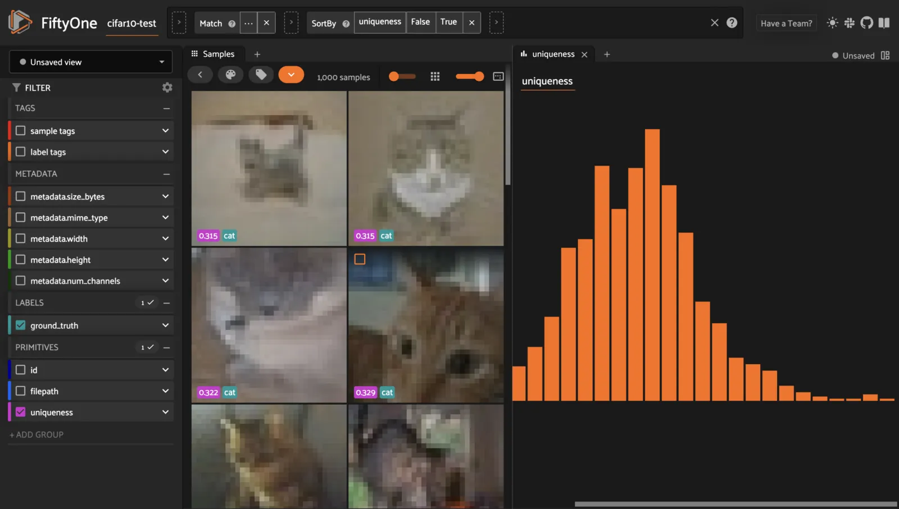

# FiftyOne Basics [¶](\#fiftyone-basics "Permalink to this headline")

This page provides a brief overview of FiftyOne’s basic concepts.

## Datasets [¶](\#datasets "Permalink to this headline")

The [`Dataset`](../api/fiftyone.core.dataset.html#fiftyone.core.dataset.Dataset "fiftyone.core.dataset.Dataset") class is the core data structure in FiftyOne, allowing you to
represent your data and manipulate it through the Python library and the
[FiftyOne App](app.md#fiftyone-app).

FiftyOne Datasets allow you to easily [load](dataset_creation/index.md#loading-datasets),
[modify](using_datasets.md#using-datasets), [visualize](app.md#fiftyone-app), and
[evaluate](evaluation.md#evaluating-models) your data along with any related labels
(classifications, detections, etc). They provide a consistent interface for
loading images, videos, annotations, and model predictions into a format that
can be visualized in the [FiftyOne App](app.md#fiftyone-app), synced with your
annotation source, and shared with others.

If you have your own collection of data, loading it as a [`Dataset`](../api/fiftyone.core.dataset.html#fiftyone.core.dataset.Dataset "fiftyone.core.dataset.Dataset") will allow
you to easily search and sort your samples. You can use FiftyOne to identify
unique samples as well as possible mistakes in your labels.

If you are training a model, its predictions and associated data such as
embeddings and logits can be loaded into your [`Dataset`](../api/fiftyone.core.dataset.html#fiftyone.core.dataset.Dataset "fiftyone.core.dataset.Dataset"). The FiftyOne App makes
it easy to visually debug what your model has learned, even for complex label
types like polygons and segmentation masks. With this knowledge, you can update
your [`Dataset`](../api/fiftyone.core.dataset.html#fiftyone.core.dataset.Dataset "fiftyone.core.dataset.Dataset") to include more representative samples and samples that your
model found difficult into your training set.

Note

Check out [creating FiftyOne datasets](dataset_creation/index.md#loading-datasets) for more
information about loading your data into FiftyOne.

A [`Dataset`](../api/fiftyone.core.dataset.html#fiftyone.core.dataset.Dataset "fiftyone.core.dataset.Dataset") is composed of multiple [`Sample`](../api/fiftyone.core.sample.html#fiftyone.core.sample.Sample "fiftyone.core.sample.Sample") objects which contain [`Field`](../api/fiftyone.core.fields.html#fiftyone.core.fields.Field "fiftyone.core.fields.Field")
attributes, all of which can be dynamically created, modified and deleted.
FiftyOne uses a lightweight non-relational database to store datasets, so you
can easily scale to datasets of any size without worrying about RAM
constraints on your machine.

Datasets are ordered collections of samples. When a [`Sample`](../api/fiftyone.core.sample.html#fiftyone.core.sample.Sample "fiftyone.core.sample.Sample") is added to a
[`Dataset`](../api/fiftyone.core.dataset.html#fiftyone.core.dataset.Dataset "fiftyone.core.dataset.Dataset"), it is assigned a unique ID that can be used to retrieve the sample
from the dataset.

Slicing and other batch operations on datasets are done through the use of
[dataset views](using_views.md#using-views). A [`DatasetView`](../api/fiftyone.core.view.html#fiftyone.core.view.DatasetView "fiftyone.core.view.DatasetView") provides a view into the
[`Dataset`](../api/fiftyone.core.dataset.html#fiftyone.core.dataset.Dataset "fiftyone.core.dataset.Dataset"), which can be filtered, sorted, sampled, etc. along various axes to
obtain a desired subset of the samples.

[Learn more about using datasets](using_datasets.md#using-datasets)

```python
import fiftyone as fo

# Create an empty dataset
dataset = fo.Dataset("test-dataset")

print(dataset)

```

```python
Name:           test-dataset
Media type:     None
Num samples:    0
Persistent:     False
Tags:           []
Sample fields:
    id:               fiftyone.core.fields.ObjectIdField
    filepath:         fiftyone.core.fields.StringField
    tags:             fiftyone.core.fields.ListField(fiftyone.core.fields.StringField)
    metadata:         fiftyone.core.fields.EmbeddedDocumentField(fiftyone.core.metadata.Metadata)
    created_at:       fiftyone.core.fields.DateTimeField
    last_modified_at: fiftyone.core.fields.DateTimeField

```

## Samples [¶](\#samples "Permalink to this headline")

Samples are the atomic elements of a [`Dataset`](../api/fiftyone.core.dataset.html#fiftyone.core.dataset.Dataset "fiftyone.core.dataset.Dataset") that store all the information
related to a given piece of data (e.g., an image or video).

All [`Sample`](../api/fiftyone.core.sample.html#fiftyone.core.sample.Sample "fiftyone.core.sample.Sample") instances store the path to their source data on disk in their
`filepath` field. Any number of fields can be dynamically added to samples to
store additional custom information about the sample.

[Learn more about using samples](using_datasets.md#using-samples)

```python
import fiftyone as fo

# An image sample
sample = fo.Sample(filepath="/path/to/image.png")

# A video sample
sample = fo.Sample(filepath="/path/to/video.mp4")

```

## Fields [¶](\#fields "Permalink to this headline")

Fields are attributes of [`Sample`](../api/fiftyone.core.sample.html#fiftyone.core.sample.Sample "fiftyone.core.sample.Sample") instances that store customizable information
about the samples. Thinking of a [`Dataset`](../api/fiftyone.core.dataset.html#fiftyone.core.dataset.Dataset "fiftyone.core.dataset.Dataset") as a table where each row is a
[`Sample`](../api/fiftyone.core.sample.html#fiftyone.core.sample.Sample "fiftyone.core.sample.Sample"), each column of the table is a [`Field`](../api/fiftyone.core.fields.html#fiftyone.core.fields.Field "fiftyone.core.fields.Field").

All samples must have their `filepath` field populated, which points to the
source data for the sample on disk. By default, samples are also given `id`,
`media_type`, `tags`, `metadata`, `created_at`, and `last_modified_at` fields
that store common information:

```python
import fiftyone as fo

sample = fo.Sample(filepath="/path/to/image.png")

print(sample)

```

```python
<Sample: {
    'id': None,
    'media_type': 'image',
    'filepath': 'path/to/image.png',
    'tags': [],
    'metadata': None,
    'created_at': None,
    'last_modified_at': None,
}>

```

Custom fields can contain any Python primitive data type:

- [`BooleanField`](../api/fiftyone.core.fields.html#fiftyone.core.fields.BooleanField "fiftyone.core.fields.BooleanField"): contains Python `bool` instances

- [`IntField`](../api/fiftyone.core.fields.html#fiftyone.core.fields.IntField "fiftyone.core.fields.IntField"): contains Python `int` instances

- [`FloatField`](../api/fiftyone.core.fields.html#fiftyone.core.fields.FloatField "fiftyone.core.fields.FloatField"): contains Python `float` instances

- [`StringField`](../api/fiftyone.core.fields.html#fiftyone.core.fields.StringField "fiftyone.core.fields.StringField"): contains Python `str` instances

- [`DateField`](../api/fiftyone.core.fields.html#fiftyone.core.fields.DateField "fiftyone.core.fields.DateField"): contains Python `date` instances

- [`DateTimeField`](../api/fiftyone.core.fields.html#fiftyone.core.fields.DateTimeField "fiftyone.core.fields.DateTimeField"): contains Python `datetime` instances

- [`ListField`](../api/fiftyone.core.fields.html#fiftyone.core.fields.ListField "fiftyone.core.fields.ListField"): contains Python `list` instances

- [`DictField`](../api/fiftyone.core.fields.html#fiftyone.core.fields.DictField "fiftyone.core.fields.DictField"): contains Python `dict` instances

The elements of list and dict fields may be homogeneous or heterogeneous, and
may even contain nested lists and dicts. Fields can also contain more complex
data types like [labels](using_datasets.md#using-labels).

Fields can be dynamically created, modified, and deleted. When a new [`Field`](../api/fiftyone.core.fields.html#fiftyone.core.fields.Field "fiftyone.core.fields.Field") is
assigned to a [`Sample`](../api/fiftyone.core.sample.html#fiftyone.core.sample.Sample "fiftyone.core.sample.Sample") in a [`Dataset`](../api/fiftyone.core.dataset.html#fiftyone.core.dataset.Dataset "fiftyone.core.dataset.Dataset"), or a [`Sample`](../api/fiftyone.core.sample.html#fiftyone.core.sample.Sample "fiftyone.core.sample.Sample") with new fields is added
to a [`Dataset`](../api/fiftyone.core.dataset.html#fiftyone.core.dataset.Dataset "fiftyone.core.dataset.Dataset"), the appropriate fields are automatically added to the dataset’s
schema and thus accessible on all other samples in the dataset.

Note

If a [`Field`](../api/fiftyone.core.fields.html#fiftyone.core.fields.Field "fiftyone.core.fields.Field") has not been set on a particular [`Sample`](../api/fiftyone.core.sample.html#fiftyone.core.sample.Sample "fiftyone.core.sample.Sample") in a [`Dataset`](../api/fiftyone.core.dataset.html#fiftyone.core.dataset.Dataset "fiftyone.core.dataset.Dataset"), its
value will be `None`.

```python
import fiftyone as fo

sample = fo.Sample(filepath="/path/to/image.png")

sample["quality"] = 89.7
sample["keypoints"] = [[31, 27], [63, 72]]
sample["geo_json"] = {
    "type": "Feature",
    "geometry": {"type": "Point", "coordinates": [125.6, 10.1]},
    "properties": {"name": "camera"},
}

dataset = fo.Dataset("fields-test")
dataset.add_sample(sample)

print(dataset)

```

```python
Name:           fields-test
Media type:     image
Num samples:    1
Persistent:     False
Tags:           []
Sample fields:
    id:               fiftyone.core.fields.ObjectIdField
    filepath:         fiftyone.core.fields.StringField
    tags:             fiftyone.core.fields.ListField(fiftyone.core.fields.StringField)
    metadata:         fiftyone.core.fields.EmbeddedDocumentField(fiftyone.core.metadata.ImageMetadata)
    created_at:       fiftyone.core.fields.DateTimeField
    last_modified_at: fiftyone.core.fields.DateTimeField
    quality:          fiftyone.core.fields.FloatField
    keypoints:        fiftyone.core.fields.ListField
    geo_json:         fiftyone.core.fields.DictField

```

[Learn more about sample fields](using_datasets.md#using-fields)

## Media type [¶](\#media-type "Permalink to this headline")

When a [`Sample`](../api/fiftyone.core.sample.html#fiftyone.core.sample.Sample "fiftyone.core.sample.Sample") is created, its media type is inferred from the `filepath` to
the source media and exposed via the `media_type` attribute of the sample.

[Learn more about media types](using_datasets.md#using-media-type)

## Tags [¶](\#tags "Permalink to this headline")

All [`Sample`](../api/fiftyone.core.sample.html#fiftyone.core.sample.Sample "fiftyone.core.sample.Sample") instances have a `tags` attribute, which stores a list of strings
that can be used flexibly to store information about a sample.

A typical use case is to tag the dataset split ( `test`, `train`, `validation`)
to which the [`Sample`](../api/fiftyone.core.sample.html#fiftyone.core.sample.Sample "fiftyone.core.sample.Sample") belongs. However, you are free to use tags however you
like.

[See more information about using tags](using_datasets.md#using-tags)

```python
import fiftyone as fo

sample = fo.Sample(filepath="/path/to/image.png", tags=["train"])
sample.tags.append("my_favorite_samples")

print(sample.tags)
# ["train", "my_favorite_samples"]

```

## Metadata [¶](\#metadata "Permalink to this headline")

All [`Sample`](../api/fiftyone.core.sample.html#fiftyone.core.sample.Sample "fiftyone.core.sample.Sample") instances have a `metadata` attribute that stores type-specific
metadata about the source media of the sample.

[Learn more about adding metadata to your samples](using_datasets.md#using-metadata)

```python
import fiftyone as fo

sample = fo.Sample(filepath="/path/to/image.png")

dataset = fo.Dataset()
dataset.add_sample(sample)

# Populate the `metadata` field of all samples in the dataset
dataset.compute_metadata()

print(dataset.first())

```

```python
<Sample: {
    'id': '60302b9dca4a8b5f74e84f16',
    'media_type': 'image',
    'filepath': '/path/to/image.png',
    'tags': [],
    'metadata': <ImageMetadata: {
        'size_bytes': 544559,
        'mime_type': 'image/png',
        'width': 698,
        'height': 664,
        'num_channels': 3,
    }>,
    'created_at': datetime.datetime(2024, 7, 22, 5, 16, 10, 701907),
    'last_modified_at': datetime.datetime(2024, 7, 22, 5, 16, 10, 701907),
}>

```

## Labels [¶](\#labels "Permalink to this headline")

Labels store semantic information about the sample, such as ground annotations
or model predictions.

FiftyOne provides label classes for many common tasks:

- [Regression](using_datasets.md#regression): a regression value

- [Classification](using_datasets.md#classification): a classification label

- [Classifications](using_datasets.md#multilabel-classification): a list of classifications
(typically for multilabel tasks)

- [Detections](using_datasets.md#object-detection): a list of object detections (with
optional instance masks)

- [Polylines](using_datasets.md#polylines): a list of polylines or polygons in an image

- [Cuboids](using_datasets.md#cuboids): a list of 2D cuboids in an image

- [Rotated bounding boxes](using_datasets.md#rotated-bounding-boxes): a list of rotated
boxes in an image

- [Keypoints](using_datasets.md#keypoints): a list of keypoints in an image

- [Segmentation](using_datasets.md#semantic-segmentation): a semantic segmentation mask for
an image

- [Heatmap](using_datasets.md#heatmaps): an intensity heatmap for an image

- [Temporal detection](using_datasets.md#temporal-detection): events with a temporal frame
support in a video

- [3D detections](using_datasets.md#d-detections): a list of 3D detections in a scene

- [3D polylines](using_datasets.md#d-polylines): a list of 3D polylines or polygons in a
scene

- [GeoLocation](using_datasets.md#geolocation): geolocation point(s), line(s), or
polygon(s)

Using FiftyOne’s [`Label`](../api/fiftyone.core.labels.html#fiftyone.core.labels.Label "fiftyone.core.labels.Label") types enables you to visualize your labels in the
[the App](app.md#fiftyone-app).

[Learn more about storing labels in your samples](using_datasets.md#using-labels)

```python
import fiftyone as fo

sample = fo.Sample(filepath="/path/to/image.png")

sample["weather"] = fo.Classification(label="sunny")
sample["animals"] = fo.Detections(
    detections=[\
        fo.Detection(label="cat", bounding_box=[0.5, 0.5, 0.4, 0.3]),\
        fo.Detection(label="dog", bounding_box=[0.2, 0.2, 0.2, 0.4]),\
    ]
)

print(sample)

```

```python
<Sample: {
    'id': None,
    'media_type': 'image',
    'filepath': 'path/to/image.png',
    'tags': [],
    'metadata': None,
    'created_at': None,
    'last_modified_at': None,
    'weather': <Classification: {'label': 'sunny', 'confidence': None, 'logits': None}>,
    'animals': <Detections: {
        'detections': [\
            <Detection: {\
                'label': 'cat',\
                'bounding_box': [0.5, 0.5, 0.4, 0.3],\
                'confidence': None,\
                'attributes': {},\
            }>,\
            <Detection: {\
                'label': 'dog',\
                'bounding_box': [0.2, 0.2, 0.2, 0.4],\
                'confidence': None,\
                'attributes': {},\
            }>,\
        ],
    }>,
}>

```

## DatasetViews [¶](\#datasetviews "Permalink to this headline")

Dataset views are a powerful tool for exploring your datasets. You can use
[`DatasetView`](../api/fiftyone.core.view.html#fiftyone.core.view.DatasetView "fiftyone.core.view.DatasetView") instances to search, filter, sort, and manipulate subsets of your
datasets to perform the analysis that you need.

[Get a full walkthrough of dataset views](using_views.md)

```python
import fiftyone as fo
import fiftyone.zoo as foz
import fiftyone.brain as fob
from fiftyone import ViewField as F

dataset = foz.load_zoo_dataset("cifar10", split="test")

cats = dataset.match(F("ground_truth.label") == "cat")
fob.compute_uniqueness(cats)

similar_cats = cats.sort_by("uniqueness", reverse=False)

session = fo.launch_app(view=similar_cats)

```



## Aggregations [¶](\#aggregations "Permalink to this headline")

Dataset views allow you to search for samples in your datasets and filter
their contents. Complementary to this, one is often interested in computing
aggregate statistics about a dataset or view, such as label counts,
distributions, and ranges.

FiftyOne provides a powerful [aggregations framework](using_aggregations.md#using-aggregations)
that provides a highly-efficient approach to computing statistics about your
data.

[Learn more about using aggregations](using_aggregations.md)

```python
import fiftyone as fo
import fiftyone.zoo as foz
from fiftyone import ViewField as F

dataset = foz.load_zoo_dataset("quickstart")

# Compute a histogram of the predicted labels in the `predictions` field
print(dataset.count_values("predictions.detections.label"))
# {'bicycle': 13, 'hot dog': 8, ..., 'skis': 52}

# Compute the range of confidences of `cat` predictions in the dataset
print(
    dataset
    .filter_labels("predictions", F("label") == "cat")
    .bounds("predictions.detections.confidence")
)
# (0.05223553627729416, 0.9965479969978333)

```
