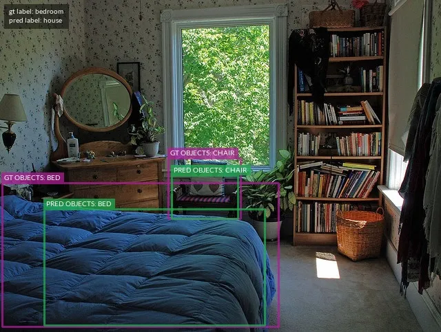
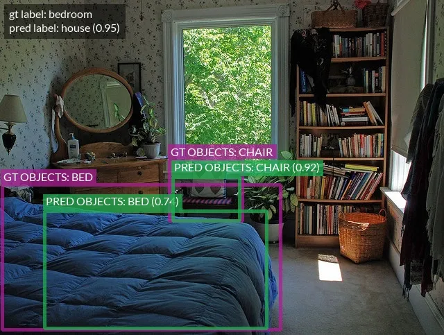

# Drawing Labels on Samples [¶](\#drawing-labels-on-samples "Permalink to this headline")

FiftyOne provides native support for rendering annotated versions of image and
video samples with [label fields](using_datasets.md#using-labels) overlaid on the source
media.

## Basic recipe [¶](\#basic-recipe "Permalink to this headline")

The interface for drawing labels on samples is exposed via the Python library
and the CLI. You can easily annotate one or more
[label fields](using_datasets.md#using-labels) on entire datasets or arbitrary subsets of
your datasets that you have identified by constructing a [`DatasetView`](../api/fiftyone.core.view.html#fiftyone.core.view.DatasetView "fiftyone.core.view.DatasetView").

## Examples [¶](\#examples "Permalink to this headline")

### Drawing labels on images [¶](\#drawing-labels-on-images "Permalink to this headline")

The following snippet renders the ground truth and predicted labels on a few
samples from the [quickstart dataset](../data/dataset_zoo/datasets.md#dataset-zoo-quickstart):

```python
import fiftyone as fo
import fiftyone.zoo as foz

dataset = foz.load_zoo_dataset("quickstart", max_samples=10)

anno_image_paths = dataset.draw_labels(
    "/tmp/quickstart/draw-labels",
    label_fields=None,                  # all label fields
    # label_fields=["predictions"],     # only predictions
)
print(anno_image_paths)

```

### Drawing labels on videos [¶](\#drawing-labels-on-videos "Permalink to this headline")

The following snippet renders both sample-level and frame-level labels on a
few videos from the
[quickstart-video dataset](../data/dataset_zoo/datasets.md#dataset-zoo-quickstart-video):

```python
import fiftyone as fo
import fiftyone.zoo as foz

dataset = foz.load_zoo_dataset("quickstart-video", max_samples=2).clone()

# Add some temporal detections
sample1 = dataset.first()
sample1["events"] = fo.TemporalDetections(
    detections=[\
        fo.TemporalDetection(label="first", support=[31, 60]),\
        fo.TemporalDetection(label="second", support=[90, 120]),\
    ]
)
sample1.save()

sample2 = dataset.last()
sample2["events"] = fo.TemporalDetections(
    detections=[\
        fo.TemporalDetection(label="first", support=[16, 45]),\
        fo.TemporalDetection(label="second", support=[75, 104]),\
    ]
)
sample2.save()

anno_video_paths = dataset.draw_labels(
    "/tmp/quickstart-video/draw-labels",
    label_fields=None,                      # all sample and frame labels
    # label_fields=["events"],              # only sample-level labels
    # label_fields=["frames.detections"],   # only frame-level labels
)
print(anno_video_paths)

```

## Individual samples [¶](\#individual-samples "Permalink to this headline")

You can also render annotated versions of individual samples directly by using
the various methods exposed in the [`fiftyone.utils.annotations`](../api/fiftyone.utils.annotations.html#module-fiftyone.utils.annotations "fiftyone.utils.annotations") module.

For example, you can render an annotated version of an image sample with
[`Classification`](../api/fiftyone.core.labels.html#fiftyone.core.labels.Classification "fiftyone.core.labels.Classification") and [`Detections`](../api/fiftyone.core.labels.html#fiftyone.core.labels.Detections "fiftyone.core.labels.Detections") labels overlaid via
[`draw_labeled_image()`](../api/fiftyone.utils.annotations.html#fiftyone.utils.annotations.draw_labeled_image "fiftyone.utils.annotations.draw_labeled_image"):

```python
import fiftyone as fo
import fiftyone.utils.annotations as foua

# Example data
sample = fo.Sample(
    filepath="~/fiftyone/coco-2017/validation/data/000000000632.jpg",
    gt_label=fo.Classification(label="bedroom"),
    pred_label=fo.Classification(label="house", confidence=0.95),
    gt_objects=fo.Detections(
        detections=[\
            fo.Detection(\
                label="bed",\
                bounding_box=[0.00510938, 0.55248447, 0.62692188, 0.43115942],\
            ),\
            fo.Detection(\
                label="chair",\
                bounding_box=[0.38253125, 0.47712215, 0.16362500, 0.18155280],\
            ),\
        ]
    ),
    pred_objects=fo.Detections(
        detections=[\
            fo.Detection(\
                label="bed",\
                bounding_box=[0.10, 0.63, 0.50, 0.35],\
                confidence=0.74,\
            ),\
            fo.Detection(\
                label="chair",\
                bounding_box=[0.39, 0.53, 0.15, 0.13],\
                confidence=0.92,\
            ),\
        ]
    ),
)

# The path to write the annotated image
outpath = "/path/for/image-annotated.jpg"

# Render the annotated image
foua.draw_labeled_image(sample, outpath)

```



Similarly, you can draw an annotated version of a video sample with its frame
labels overlaid via
[`draw_labeled_video()`](../api/fiftyone.utils.annotations.html#fiftyone.utils.annotations.draw_labeled_video "fiftyone.utils.annotations.draw_labeled_video").

## Customizing label rendering [¶](\#customizing-label-rendering "Permalink to this headline")

You can customize the look-and-feel of the labels rendered by FiftyOne by
providing a custom [`DrawConfig`](../api/fiftyone.utils.annotations.html#fiftyone.utils.annotations.DrawConfig "fiftyone.utils.annotations.DrawConfig")
to the relevant drawing method, such as
[`SampleCollection.draw_labels()`](../api/fiftyone.core.collections.html#fiftyone.core.collections.SampleCollection.draw_labels "fiftyone.core.collections.SampleCollection.draw_labels")
or the underlying methods in the [`fiftyone.utils.annotations`](../api/fiftyone.utils.annotations.html#module-fiftyone.utils.annotations "fiftyone.utils.annotations") module.

Consult the [`DrawConfig`](../api/fiftyone.utils.annotations.html#fiftyone.utils.annotations.DrawConfig "fiftyone.utils.annotations.DrawConfig") docs
for a complete description of the available parameters.

For example, the snippet below increases the font size and line thickness of
the labels in the example above and includes the confidence of the predictions:

```python
# Continuing from example above...

# Customize annotation rendering
config = foua.DrawConfig(
    {
        "font_size": 24,
        "bbox_linewidth": 5,
        "show_all_confidences": True,
        "per_object_label_colors": False,
    }
)

# Render the annotated image
foua.draw_labeled_image(sample, outpath, config=config)

```



