# Evaluating Models [¶](\#evaluating-models "Permalink to this headline")

FiftyOne provides a variety of builtin methods for evaluating your model
predictions, including regressions, classifications, detections, polygons,
instance and semantic segmentations, on both image and video datasets.

When you evaluate a model in FiftyOne, you get access to the standard aggregate
metrics such as classification reports, confusion matrices, and PR curves
for your model. In addition, FiftyOne can also record fine-grained statistics
like accuracy and false positive counts at the sample-level, which you can
interactively explore in the App to diagnose
the strengths and weaknesses of your models on individual data samples.

Sample-level analysis often leads to critical insights that will help you
improve your datasets and models. For example, viewing the samples with the
most false positive predictions can reveal errors in your annotation schema.
Or, viewing the cluster of samples with the lowest accuracy can reveal gaps in
your training dataset that you need to address in order to improve your model’s
performance. A key goal of FiftyOne is to help you uncover these insights on
your data!

Note

Check out the [tutorials page](../tutorials/index.md#tutorials) for in-depth walkthroughs
of evaluating various types of models with FiftyOne.

## Overview [¶](\#overview "Permalink to this headline")

FiftyOne’s evaluation methods are conveniently exposed as methods on all
[`Dataset`](../api/fiftyone.core.dataset.html#fiftyone.core.dataset.Dataset "fiftyone.core.dataset.Dataset") and [`DatasetView`](../api/fiftyone.core.view.html#fiftyone.core.view.DatasetView "fiftyone.core.view.DatasetView") objects, which means that you can evaluate entire
datasets or specific views into them via the same syntax.

Let’s illustrate the basic workflow by loading the
[quickstart dataset](../data/dataset_zoo/datasets.md#dataset-zoo-quickstart) and analyzing the object
detections in its `predictions` field using the
[`evaluate_detections()`](../api/fiftyone.core.collections.html#fiftyone.core.collections.SampleCollection.evaluate_detections "fiftyone.core.collections.SampleCollection.evaluate_detections")
method:

```python
import fiftyone as fo
import fiftyone.zoo as foz

dataset = foz.load_zoo_dataset("quickstart")

# Evaluate the objects in the `predictions` field with respect to the
# objects in the `ground_truth` field
results = dataset.evaluate_detections(
    "predictions",
    gt_field="ground_truth",
    eval_key="eval",
)

session = fo.launch_app(dataset)

```

### Model Evaluation panel **NEW** [¶](\#model-evaluation-panel-sub-new "Permalink to this headline")

When you load a dataset in the App that contains one or more
[evaluations](#evaluating-models), you can open the
[Model Evaluation panel](app.md#app-model-evaluation-panel) to visualize and
interactively explore the evaluation results in the App:

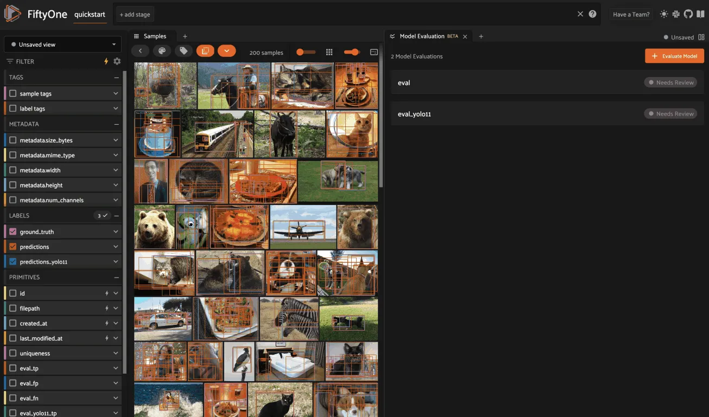

### Per-class metrics [¶](\#per-class-metrics "Permalink to this headline")

You can also retrieve and interact with evaluation results via the SDK.

Running an evaluation returns an instance of a task-specific subclass of
[`EvaluationResults`](../api/fiftyone.core.evaluation.html#fiftyone.core.evaluation.EvaluationResults "fiftyone.core.evaluation.EvaluationResults") that provides a handful of methods for generating aggregate
statistics about your dataset.

```python
# Get the 10 most common classes in the dataset
counts = dataset.count_values("ground_truth.detections.label")
classes = sorted(counts, key=counts.get, reverse=True)[:10]

# Print a classification report for the top-10 classes
results.print_report(classes=classes)

```

```python
               precision    recall  f1-score   support

       person       0.45      0.74      0.56       783
         kite       0.55      0.72      0.62       156
          car       0.12      0.54      0.20        61
         bird       0.63      0.67      0.65       126
       carrot       0.06      0.49      0.11        47
         boat       0.05      0.24      0.08        37
    surfboard       0.10      0.43      0.17        30
traffic light       0.22      0.54      0.31        24
     airplane       0.29      0.67      0.40        24
      giraffe       0.26      0.65      0.37        23

    micro avg       0.32      0.68      0.44      1311
    macro avg       0.27      0.57      0.35      1311
 weighted avg       0.42      0.68      0.51      1311

```

Note

For details on micro, macro, and weighted averaging, see the
[sklearn.metrics documentation](https://scikit-learn.org/stable/modules/generated/sklearn.metrics.precision_recall_fscore_support.html#sklearn.metrics.precision_recall_fscore_support).

### Per-sample metrics [¶](\#per-sample-metrics "Permalink to this headline")

In addition to standard aggregate metrics, when you pass an `eval_key`
parameter to the evaluation routine, FiftyOne will populate helpful
task-specific information about your model’s predictions on each sample, such
as false negative/positive counts and per-sample accuracies.

Continuing with our example, let’s use [dataset views](using_views.md#using-views) and
the [FiftyOne App](app.md#fiftyone-app) to leverage these sample metrics to
investigate the samples with the most false positive predictions in the
dataset:

```python
import fiftyone as fo
from fiftyone import ViewField as F

# Create a view that has samples with the most false positives first, and
# only includes false positive boxes in the `predictions` field
view = (
    dataset
    .sort_by("eval_fp", reverse=True)
    .filter_labels("predictions", F("eval") == "fp")
)

# Visualize results in the App
session = fo.launch_app(view=view)

```


Notice anything wrong? The sample with the most false positives is a plate of
carrots where the entire plate has been boxed as a single example in the ground
truth while the model is generating predictions for individual carrots!

If you’re familiar with [COCO format](https://cocodataset.org/#format-data)
(which is recognized by
[`evaluate_detections()`](../api/fiftyone.core.collections.html#fiftyone.core.collections.SampleCollection.evaluate_detections "fiftyone.core.collections.SampleCollection.evaluate_detections")
by default), you’ll notice that the issue here is that the `iscrowd`
attribute of this ground truth annotation has been incorrectly set to `0`.
Resolving mistakes like these will provide a much more accurate picture of the
real performance of a model.

### Confusion matrices [¶](\#confusion-matrices "Permalink to this headline")

Note

The easiest way to work with confusion matrices in FiftyOne is via the
[Model Evaluation panel](app.md#app-model-evaluation-panel)!

When you use evaluation methods such as
[`evaluate_detections()`](../api/fiftyone.core.collections.html#fiftyone.core.collections.SampleCollection.evaluate_detections "fiftyone.core.collections.SampleCollection.evaluate_detections")
that support confusion matrices, you can use the
[`plot_confusion_matrix()`](../api/fiftyone.utils.eval.detection.html#fiftyone.utils.eval.detection.DetectionResults.plot_confusion_matrix "fiftyone.utils.eval.detection.DetectionResults.plot_confusion_matrix")
method to render responsive plots that can be attached to App instances to
interactively explore specific cases of your model’s performance:

```python
# Plot confusion matrix
plot = results.plot_confusion_matrix(classes=classes)
plot.show()

# Connect to session
session.plots.attach(plot)

```

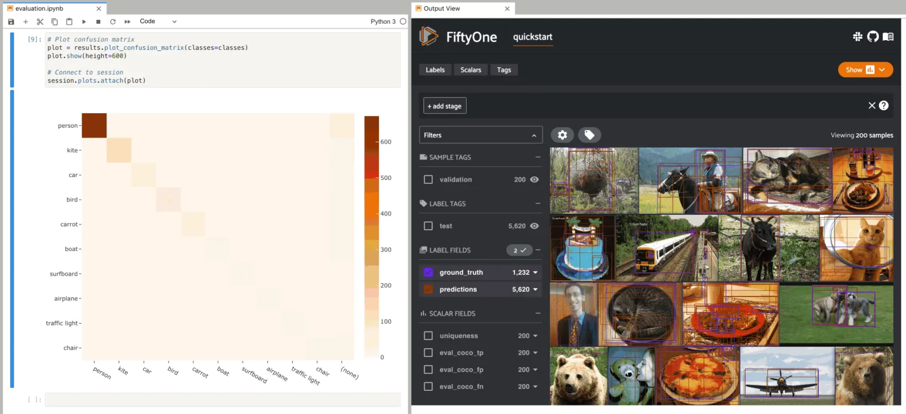

In this setup, you can click on individual cells of the confusion matrix to
select the corresponding ground truth and/or predicted objects in the App. For
example, if you click on a diagonal cell of the confusion matrix, you will
see the true positive examples of that class in the App.

Likewise, whenever you modify the Session’s view, either in the App or by
programmatically setting
[`session.view`](../api/fiftyone.core.session.html#fiftyone.core.session.Session.view "fiftyone.core.session.Session.view"), the confusion matrix
is automatically updated to show the cell counts for only those objects that
are included in the current view.

### Managing evaluations [¶](\#managing-evaluations "Permalink to this headline")

When you run an evaluation with an `eval_key` argument, the evaluation is
recorded on the dataset and you can retrieve information about it later, rename
it, delete it (along with any modifications to your dataset that were performed
by it), and [retrieve the view](#load-evaluation-view) that you evaluated
on using the following methods on your dataset:

- [`list_evaluations()`](../api/fiftyone.core.collections.html#fiftyone.core.collections.SampleCollection.list_evaluations "fiftyone.core.collections.SampleCollection.list_evaluations")

- [`get_evaluation_info()`](../api/fiftyone.core.collections.html#fiftyone.core.collections.SampleCollection.get_evaluation_info "fiftyone.core.collections.SampleCollection.get_evaluation_info")

- [`load_evaluation_results()`](../api/fiftyone.core.collections.html#fiftyone.core.collections.SampleCollection.load_evaluation_results "fiftyone.core.collections.SampleCollection.load_evaluation_results")

- [`load_evaluation_view()`](../api/fiftyone.core.collections.html#fiftyone.core.collections.SampleCollection.load_evaluation_view "fiftyone.core.collections.SampleCollection.load_evaluation_view")

- [`rename_evaluation()`](../api/fiftyone.core.collections.html#fiftyone.core.collections.SampleCollection.rename_evaluation "fiftyone.core.collections.SampleCollection.rename_evaluation")

- [`delete_evaluation()`](../api/fiftyone.core.collections.html#fiftyone.core.collections.SampleCollection.delete_evaluation "fiftyone.core.collections.SampleCollection.delete_evaluation")

The example below demonstrates the basic interface:

```python
# List evaluations you've run on a dataset
dataset.list_evaluations()
# ['eval']

# Print information about an evaluation
print(dataset.get_evaluation_info("eval"))

# Load existing evaluation results and use them
results = dataset.load_evaluation_results("eval")
results.print_report()

# Rename the evaluation
# This will automatically rename any evaluation fields on your dataset
dataset.rename_evaluation("eval", "still_eval")

# Delete the evaluation
# This will remove any evaluation data that was populated on your dataset
dataset.delete_evaluation("still_eval")

```

The sections below discuss evaluating various types of predictions in more
detail.

## Regressions [¶](\#regressions "Permalink to this headline")

You can use the
[`evaluate_regressions()`](../api/fiftyone.core.collections.html#fiftyone.core.collections.SampleCollection.evaluate_regressions "fiftyone.core.collections.SampleCollection.evaluate_regressions")
method to evaluate the predictions of a regression model stored in a
[`Regression`](../api/fiftyone.core.labels.html#fiftyone.core.labels.Regression "fiftyone.core.labels.Regression") field of your dataset.

Invoking
[`evaluate_regressions()`](../api/fiftyone.core.collections.html#fiftyone.core.collections.SampleCollection.evaluate_regressions "fiftyone.core.collections.SampleCollection.evaluate_regressions")
returns a [`RegressionResults`](../api/fiftyone.utils.eval.regression.html#fiftyone.utils.eval.regression.RegressionResults "fiftyone.utils.eval.regression.RegressionResults") instance that provides a variety of methods for
evaluating your model.

In addition, when you specify an `eval_key` parameter, helpful fields will be
populated on each sample that you can leverage via the
[FiftyOne App](app.md#fiftyone-app) to interactively explore the strengths and
weaknesses of your model on individual samples.

### Simple evaluation (default) [¶](\#simple-evaluation-default "Permalink to this headline")

By default,
[`evaluate_regressions()`](../api/fiftyone.core.collections.html#fiftyone.core.collections.SampleCollection.evaluate_regressions "fiftyone.core.collections.SampleCollection.evaluate_regressions")
will evaluate each prediction by directly comparing its `value` to the
associated ground truth value.

You can explicitly request that simple evaluation be used by setting the
`method` parameter to `"simple"`.

When you specify an `eval_key` parameter, a float `eval_key` field will be
populated on each sample that records the error of that sample’s prediction
with respect to its ground truth value. By default, the squared error will be
computed, but you can customize this via the optional `metric` argument to
[`evaluate_regressions()`](../api/fiftyone.core.collections.html#fiftyone.core.collections.SampleCollection.evaluate_regressions "fiftyone.core.collections.SampleCollection.evaluate_regressions"),
which can take any value supported by
[`SimpleEvaluationConfig`](../api/fiftyone.utils.eval.regression.html#fiftyone.utils.eval.regression.SimpleEvaluationConfig "fiftyone.utils.eval.regression.SimpleEvaluationConfig").

The example below demonstrates simple evaluation on the
[quickstart dataset](../data/dataset_zoo/datasets.md#dataset-zoo-quickstart) with some fake regression
data added to it to demonstrate the workflow:

```python
import random
import numpy as np

import fiftyone as fo
import fiftyone.zoo as foz
from fiftyone import ViewField as F

dataset = foz.load_zoo_dataset("quickstart").select_fields().clone()

# Populate some fake regression + weather data
for idx, sample in enumerate(dataset, 1):
    ytrue = random.random() * idx
    ypred = ytrue + np.random.randn() * np.sqrt(ytrue)
    confidence = random.random()
    sample["ground_truth"] = fo.Regression(value=ytrue)
    sample["predictions"] = fo.Regression(value=ypred, confidence=confidence)
    sample["weather"] = random.choice(["sunny", "cloudy", "rainy"])
    sample.save()

print(dataset)

# Evaluate the predictions in the `predictions` field with respect to the
# values in the `ground_truth` field
results = dataset.evaluate_regressions(
    "predictions",
    gt_field="ground_truth",
    eval_key="eval",
)

# Print some standard regression evaluation metrics
results.print_metrics()

# Plot a scatterplot of the results colored by `weather` and scaled by
# `confidence`
plot = results.plot_results(labels="weather", sizes="predictions.confidence")
plot.show()

# Launch the App to explore
session = fo.launch_app(dataset)

# Show the samples with the smallest regression error
session.view = dataset.sort_by("eval")

# Show the samples with the largest regression error
session.view = dataset.sort_by("eval", reverse=True)

```

```python
mean squared error        59.69
root mean squared error   7.73
mean absolute error       5.48
median absolute error     3.57
r2 score                  0.97
explained variance score  0.97
max error                 31.77
support                   200

```

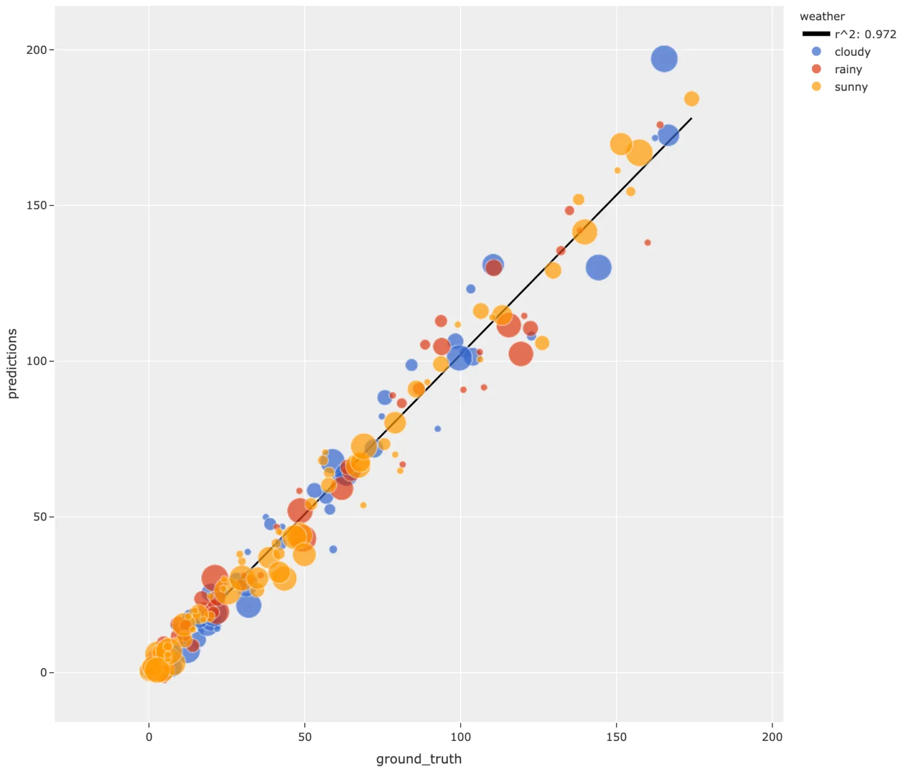

Note

Did you know? You can
[attach regression plots to the App](plots.md#regression-plots) and
interactively explore them by selecting scatter points and/or modifying
your view in the App.

## Classifications [¶](\#classifications "Permalink to this headline")

You can use the
[`evaluate_classifications()`](../api/fiftyone.core.collections.html#fiftyone.core.collections.SampleCollection.evaluate_classifications "fiftyone.core.collections.SampleCollection.evaluate_classifications")
method to evaluate the predictions of a classifier stored in a
[`Classification`](../api/fiftyone.core.labels.html#fiftyone.core.labels.Classification "fiftyone.core.labels.Classification") field of your dataset.

By default, the classifications will be treated as a generic multiclass
classification task, but you can specify other evaluation strategies such as
top-k accuracy or binary evaluation via the `method` parameter.

Invoking
[`evaluate_classifications()`](../api/fiftyone.core.collections.html#fiftyone.core.collections.SampleCollection.evaluate_classifications "fiftyone.core.collections.SampleCollection.evaluate_classifications")
returns a [`ClassificationResults`](../api/fiftyone.utils.eval.classification.html#fiftyone.utils.eval.classification.ClassificationResults "fiftyone.utils.eval.classification.ClassificationResults") instance that provides a variety of methods
for generating various aggregate evaluation reports about your model.

In addition, when you specify an `eval_key` parameter, a number of helpful
fields will be populated on each sample that you can leverage via the
[FiftyOne App](app.md#fiftyone-app) to interactively explore the strengths and
weaknesses of your model on individual samples.

### Simple evaluation (default) [¶](\#id4 "Permalink to this headline")

By default,
[`evaluate_classifications()`](../api/fiftyone.core.collections.html#fiftyone.core.collections.SampleCollection.evaluate_classifications "fiftyone.core.collections.SampleCollection.evaluate_classifications")
will treat your classifications as generic multiclass predictions, and it will
evaluate each prediction by directly comparing its `label` to the associated
ground truth prediction.

You can explicitly request that simple evaluation be used by setting the
`method` parameter to `"simple"`.

When you specify an `eval_key` parameter, a boolean `eval_key` field will
be populated on each sample that records whether that sample’s prediction is
correct.

The example below demonstrates simple evaluation on the
[CIFAR-10 dataset](../data/dataset_zoo/datasets.md#dataset-zoo-cifar10) with some fake predictions added
to it to demonstrate the workflow:

```python
import random

import fiftyone as fo
import fiftyone.zoo as foz
from fiftyone import ViewField as F

dataset = foz.load_zoo_dataset(
    "cifar10",
    split="test",
    max_samples=1000,
    shuffle=True,
)

#
# Create some test predictions by copying the ground truth labels into a
# new `predictions` field with 10% of the labels perturbed at random
#

classes = dataset.distinct("ground_truth.label")

def jitter(val):
    if random.random() < 0.10:
        return random.choice(classes)

    return val

predictions = [\
    fo.Classification(label=jitter(gt.label), confidence=random.random())\
    for gt in dataset.values("ground_truth")\
]

dataset.set_values("predictions", predictions)

print(dataset)

# Evaluate the predictions in the `predictions` field with respect to the
# labels in the `ground_truth` field
results = dataset.evaluate_classifications(
    "predictions",
    gt_field="ground_truth",
    eval_key="eval_simple",
)

# Print a classification report
results.print_report()

# Plot a confusion matrix
plot = results.plot_confusion_matrix()
plot.show()

# Launch the App to explore
session = fo.launch_app(dataset)

# View only the incorrect predictions in the App
session.view = dataset.match(F("eval_simple") == False)

```

```python
              precision    recall  f1-score   support

    airplane       0.91      0.90      0.91       118
  automobile       0.93      0.90      0.91       101
        bird       0.93      0.87      0.90       103
         cat       0.92      0.91      0.92        94
        deer       0.88      0.92      0.90       116
         dog       0.85      0.84      0.84        86
        frog       0.85      0.92      0.88        84
       horse       0.88      0.91      0.89        96
        ship       0.93      0.95      0.94        97
       truck       0.92      0.89      0.90       105

    accuracy                           0.90      1000
   macro avg       0.90      0.90      0.90      1000
weighted avg       0.90      0.90      0.90      1000

```

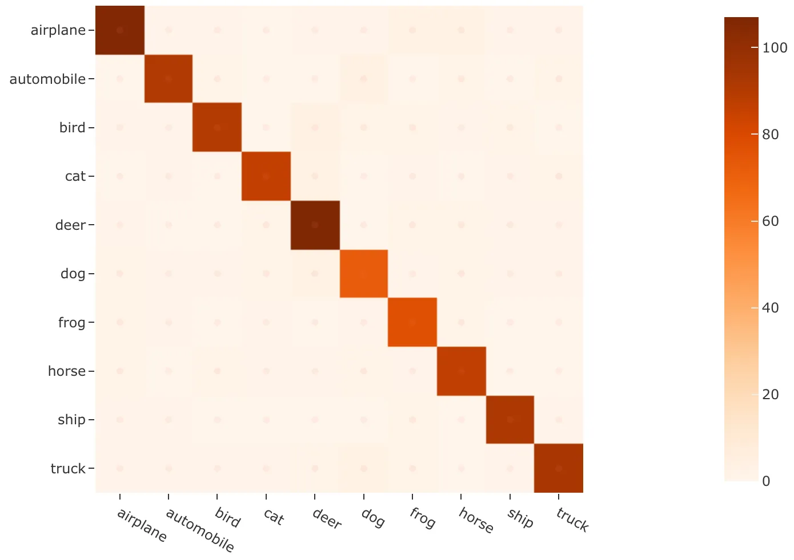

Note

The easiest way to analyze models in FiftyOne is via the
[Model Evaluation panel](app.md#app-model-evaluation-panel)!

### Top-k evaluation [¶](\#top-k-evaluation "Permalink to this headline")

Set the `method` parameter of
[`evaluate_classifications()`](../api/fiftyone.core.collections.html#fiftyone.core.collections.SampleCollection.evaluate_classifications "fiftyone.core.collections.SampleCollection.evaluate_classifications")
to `top-k` in order to use top-k matching to evaluate your classifications.

Under this strategy, predictions are deemed to be correct if the corresponding
ground truth label is within the top `k` predictions.

When you specify an `eval_key` parameter, a boolean `eval_key` field will
be populated on each sample that records whether that sample’s prediction is
correct.

Note

In order to use top-k evaluation, you must populate the `logits` field
of your predictions, and you must provide the list of corresponding class
labels via the `classes` parameter of
[`evaluate_classifications()`](../api/fiftyone.core.collections.html#fiftyone.core.collections.SampleCollection.evaluate_classifications "fiftyone.core.collections.SampleCollection.evaluate_classifications").

Did you know? Many models from the [Model Zoo](../models/model_zoo/index.md#model-zoo)
provide support for storing logits for their predictions!

The example below demonstrates top-k evaluation on a
[small ImageNet sample](../data/dataset_zoo/datasets.md#dataset-zoo-imagenet-sample) with predictions
from a pre-trained model from the [Model Zoo](../models/model_zoo/index.md#model-zoo):

```python
import fiftyone as fo
import fiftyone.zoo as foz
from fiftyone import ViewField as F

dataset = foz.load_zoo_dataset(
    "imagenet-sample", dataset_name="top-k-eval-demo"
)

# We need the list of class labels corresponding to the logits
logits_classes = dataset.default_classes

# Add predictions (with logits) to 25 random samples
predictions_view = dataset.take(25, seed=51)
model = foz.load_zoo_model("resnet50-imagenet-torch")
predictions_view.apply_model(model, "predictions", store_logits=True)

print(predictions_view)

# Evaluate the predictions in the `predictions` field with respect to the
# labels in the `ground_truth` field using top-5 accuracy
results = predictions_view.evaluate_classifications(
    "predictions",
    gt_field="ground_truth",
    eval_key="eval_top_k",
    method="top-k",
    classes=logits_classes,
    k=5,
)

# Get the 10 most common classes in the view
counts = predictions_view.count_values("ground_truth.label")
classes = sorted(counts, key=counts.get, reverse=True)[:10]

# Print a classification report for the top-10 classes
results.print_report(classes=classes)

# Launch the App to explore
session = fo.launch_app(dataset)

# View only the incorrect predictions for the 10 most common classes
session.view = (
    predictions_view
    .match(F("ground_truth.label").is_in(classes))
    .match(F("eval_top_k") == False)
)

```

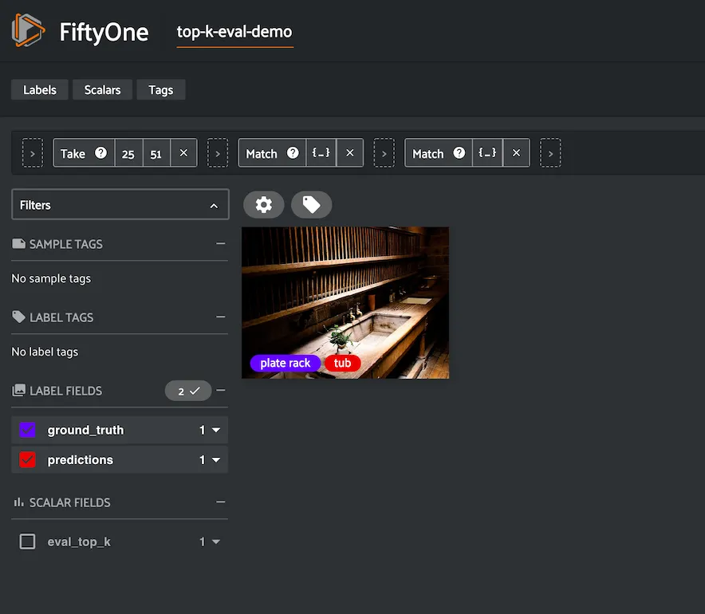

Note

The easiest way to analyze models in FiftyOne is via the
[Model Evaluation panel](app.md#app-model-evaluation-panel)!

### Binary evaluation [¶](\#binary-evaluation "Permalink to this headline")

If your classifier is binary, set the `method` parameter of
[`evaluate_classifications()`](../api/fiftyone.core.collections.html#fiftyone.core.collections.SampleCollection.evaluate_classifications "fiftyone.core.collections.SampleCollection.evaluate_classifications")
to `"binary"` in order to access binary-specific evaluation information such
as precision-recall curves for your model.

When you specify an `eval_key` parameter, a string `eval_key` field will
be populated on each sample that records whether the sample is a true positive,
false positive, true negative, or false negative.

Note

In order to use binary evaluation, you must provide the
`(neg_label, pos_label)` for your model via the `classes` parameter of
[`evaluate_classifications()`](../api/fiftyone.core.collections.html#fiftyone.core.collections.SampleCollection.evaluate_classifications "fiftyone.core.collections.SampleCollection.evaluate_classifications").

The example below demonstrates binary evaluation on the
[CIFAR-10 dataset](../data/dataset_zoo/datasets.md#dataset-zoo-cifar10) with some fake binary predictions
added to it to demonstrate the workflow:

```python
import random

import fiftyone as fo
import fiftyone.zoo as foz

# Load a small sample from the ImageNet dataset
dataset = foz.load_zoo_dataset(
    "cifar10",
    split="test",
    max_samples=1000,
    shuffle=True,
)

#
# Binarize the ground truth labels to `cat` and `other`, and add
# predictions that are correct proportionally to their confidence
#

classes = ["other", "cat"]

for sample in dataset:
    gt_label = "cat" if sample.ground_truth.label == "cat" else "other"

    confidence = random.random()
    if random.random() > confidence:
        pred_label = "cat" if gt_label == "other" else "other"
    else:
        pred_label = gt_label

    sample.ground_truth.label = gt_label
    sample["predictions"] = fo.Classification(
        label=pred_label, confidence=confidence
    )

    sample.save()

print(dataset)

# Evaluate the predictions in the `predictions` field with respect to the
# labels in the `ground_truth` field
results = dataset.evaluate_classifications(
    "predictions",
    gt_field="ground_truth",
    eval_key="eval_binary",
    method="binary",
    classes=classes,
)

# Print a classification report
results.print_report()

# Plot a PR curve
plot = results.plot_pr_curve()
plot.show()

```

```python
              precision    recall  f1-score   support

       other       0.90      0.48      0.63       906
         cat       0.09      0.50      0.15        94

    accuracy                           0.48      1000
   macro avg       0.50      0.49      0.39      1000
weighted avg       0.83      0.48      0.59      1000

```

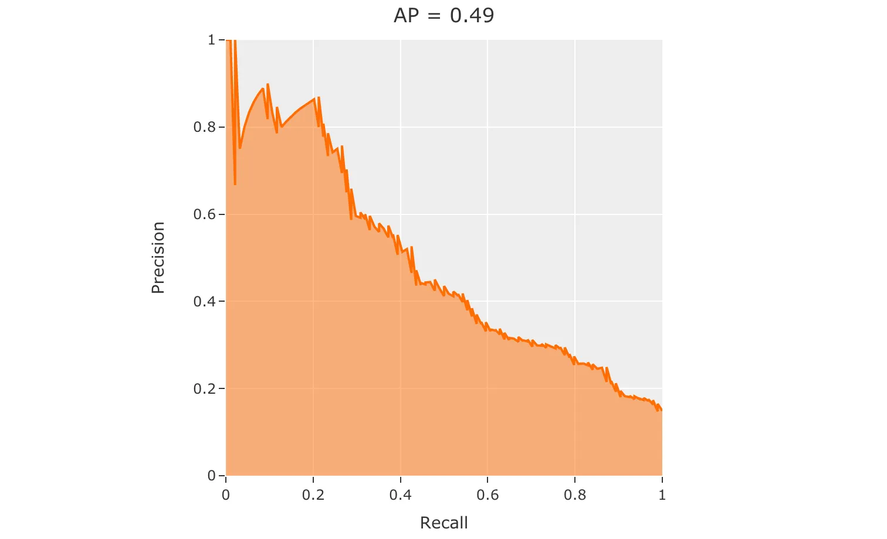

Note

The easiest way to analyze models in FiftyOne is via the
[Model Evaluation panel](app.md#app-model-evaluation-panel)!

## Detections [¶](\#detections "Permalink to this headline")

You can use the
[`evaluate_detections()`](../api/fiftyone.core.collections.html#fiftyone.core.collections.SampleCollection.evaluate_detections "fiftyone.core.collections.SampleCollection.evaluate_detections")
method to evaluate the predictions of an object detection model stored in a
[`Detections`](../api/fiftyone.core.labels.html#fiftyone.core.labels.Detections "fiftyone.core.labels.Detections"), [`Polylines`](../api/fiftyone.core.labels.html#fiftyone.core.labels.Polylines "fiftyone.core.labels.Polylines"), or [`Keypoints`](../api/fiftyone.core.labels.html#fiftyone.core.labels.Keypoints "fiftyone.core.labels.Keypoints") field of your dataset or of a
temporal detection model stored in a [`TemporalDetections`](../api/fiftyone.core.labels.html#fiftyone.core.labels.TemporalDetections "fiftyone.core.labels.TemporalDetections") field of your
dataset.

Invoking
[`evaluate_detections()`](../api/fiftyone.core.collections.html#fiftyone.core.collections.SampleCollection.evaluate_detections "fiftyone.core.collections.SampleCollection.evaluate_detections")
returns a [`DetectionResults`](../api/fiftyone.utils.eval.detection.html#fiftyone.utils.eval.detection.DetectionResults "fiftyone.utils.eval.detection.DetectionResults") instance that provides a variety of methods for
generating various aggregate evaluation reports about your model.

In addition, when you specify an `eval_key` parameter, a number of helpful
fields will be populated on each sample and its predicted/ground truth
objects that you can leverage via the [FiftyOne App](app.md#fiftyone-app) to
interactively explore the strengths and weaknesses of your model on individual
samples.

Note

FiftyOne uses the [COCO-style](#evaluating-detections-coco) evaluation
by default, but
[Open Images-style](#evaluating-detections-open-images) evaluation is
also natively supported.

### Supported types [¶](\#supported-types "Permalink to this headline")

The [`evaluate_detections()`](../api/fiftyone.core.collections.html#fiftyone.core.collections.SampleCollection.evaluate_detections "fiftyone.core.collections.SampleCollection.evaluate_detections")
method supports all of the following task types:

- [Object detection](using_datasets.md#object-detection)

- [Instance segmentations](using_datasets.md#instance-segmentation)

- [Polygon detection](using_datasets.md#polylines)

- [Keypoints](using_datasets.md#keypoints)

- [Temporal detections](using_datasets.md#temporal-detection)

- [3D detections](using_datasets.md#d-detections)

The only difference between each task type is in how the IoU between objects is
calculated:

- For object detections, IoUs are computed between each pair of bounding boxes

- For instance segmentations and polygons, IoUs are computed between the
polygonal shapes rather than their rectangular bounding boxes

- For keypoint tasks,
[object keypoint similarity](https://cocodataset.org/#keypoints-eval)
is computed for each pair of objects, using the extent of the ground truth
keypoints as a proxy for the area of the object’s bounding box, and
assuming uniform falloff (κκ)

- For temporal detections, IoU is computed between the 1D support of two
temporal segments

For object detection tasks, the ground truth and predicted objects should be
stored in [`Detections`](../api/fiftyone.core.labels.html#fiftyone.core.labels.Detections "fiftyone.core.labels.Detections") format.

For instance segmentation tasks, the ground truth and predicted objects should
be stored in [`Detections`](../api/fiftyone.core.labels.html#fiftyone.core.labels.Detections "fiftyone.core.labels.Detections") format, and each [`Detection`](../api/fiftyone.core.labels.html#fiftyone.core.labels.Detection "fiftyone.core.labels.Detection") instance should have its
[`mask`](../api/fiftyone.core.labels.html#fiftyone.core.labels.Detection.mask "fiftyone.core.labels.Detection.mask") attribute populated to
define the extent of the object within its bounding box.

Note

In order to use instance masks for IoU calculations, pass `use_masks=True`
to [`evaluate_detections()`](../api/fiftyone.core.collections.html#fiftyone.core.collections.SampleCollection.evaluate_detections "fiftyone.core.collections.SampleCollection.evaluate_detections").

For polygon detection tasks, the ground truth and predicted objects should be
stored in [`Polylines`](../api/fiftyone.core.labels.html#fiftyone.core.labels.Polylines "fiftyone.core.labels.Polylines") format with their
[`filled`](../api/fiftyone.core.labels.html#fiftyone.core.labels.Polyline.filled "fiftyone.core.labels.Polyline.filled") attribute set to
`True` to indicate that they represent closed polygons (as opposed to
polylines).

Note

If you are evaluating polygons but would rather use bounding boxes rather
than the actual polygonal geometries for IoU calculations, you can pass
`use_boxes=True` to
[`evaluate_detections()`](../api/fiftyone.core.collections.html#fiftyone.core.collections.SampleCollection.evaluate_detections "fiftyone.core.collections.SampleCollection.evaluate_detections").

For keypoint tasks, each [`Keypoint`](../api/fiftyone.core.labels.html#fiftyone.core.labels.Keypoint "fiftyone.core.labels.Keypoint") instance must contain point arrays of equal
length and semantic ordering.

Note

If a particular point is missing or not visible for a [`Keypoint`](../api/fiftyone.core.labels.html#fiftyone.core.labels.Keypoint "fiftyone.core.labels.Keypoint") instance,
use nan values for its coordinates. [See here](using_datasets.md#keypoints) for more
information about structuring keypoints.

For temporal detection tasks, the ground truth and predicted objects should be
stored in [`TemporalDetections`](../api/fiftyone.core.labels.html#fiftyone.core.labels.TemporalDetections "fiftyone.core.labels.TemporalDetections") format.

### Evaluation patches views [¶](\#evaluation-patches-views "Permalink to this headline")

Once you have run
[`evaluate_detections()`](../api/fiftyone.core.collections.html#fiftyone.core.collections.SampleCollection.evaluate_detections "fiftyone.core.collections.SampleCollection.evaluate_detections")
on a dataset, you can use
[`to_evaluation_patches()`](../api/fiftyone.core.collections.html#fiftyone.core.collections.SampleCollection.to_evaluation_patches "fiftyone.core.collections.SampleCollection.to_evaluation_patches")
to transform the dataset (or a view into it) into a new view that contains one
sample for each true positive, false positive, and false negative example.

True positive examples will result in samples with both their ground truth and
predicted fields populated, while false positive/negative examples will only
have one of their corresponding predicted/ground truth fields populated,
respectively.

If multiple predictions are matched to a ground truth object (e.g., if the
evaluation protocol includes a crowd attribute), then all matched predictions
will be stored in the single sample along with the ground truth object.

Evaluation patches views also have top-level `type` and `iou` fields
populated based on the evaluation results for that example, as well as a
`sample_id` field recording the sample ID of the example, and a `crowd`
field if the evaluation protocol defines a crowd attribute.

Note

Evaluation patches views generate patches for **only** the contents of the
current view, which may differ from the view on which the `eval_key`
evaluation was performed. This may exclude some labels that were evaluated
and/or include labels that were not evaluated.

If you would like to see patches for the exact view on which an
evaluation was performed, first call
[`load_evaluation_view()`](../api/fiftyone.core.collections.html#fiftyone.core.collections.SampleCollection.load_evaluation_view "fiftyone.core.collections.SampleCollection.load_evaluation_view")
to load the view and then convert to patches.

The example below demonstrates loading an evaluation patches view for the
results of an evaluation on the
[quickstart dataset](../data/dataset_zoo/datasets.md#dataset-zoo-quickstart):

```python
import fiftyone as fo
import fiftyone.zoo as foz

dataset = foz.load_zoo_dataset("quickstart")

# Evaluate `predictions` w.r.t. labels in `ground_truth` field
dataset.evaluate_detections(
    "predictions", gt_field="ground_truth", eval_key="eval"
)

session = fo.launch_app(dataset)

# Convert to evaluation patches
eval_patches = dataset.to_evaluation_patches("eval")
print(eval_patches)

print(eval_patches.count_values("type"))
# {'fn': 246, 'fp': 4131, 'tp': 986}

# View patches in the App
session.view = eval_patches

```

```python
Dataset:     quickstart
Media type:  image
Num patches: 5363
Patch fields:
    filepath:     fiftyone.core.fields.StringField
    tags:         fiftyone.core.fields.ListField(fiftyone.core.fields.StringField)
    metadata:     fiftyone.core.fields.EmbeddedDocumentField(fiftyone.core.metadata.ImageMetadata)
    predictions:  fiftyone.core.fields.EmbeddedDocumentField(fiftyone.core.labels.Detections)
    ground_truth: fiftyone.core.fields.EmbeddedDocumentField(fiftyone.core.labels.Detections)
    sample_id:    fiftyone.core.fields.StringField
    type:         fiftyone.core.fields.StringField
    iou:          fiftyone.core.fields.FloatField
    crowd:        fiftyone.core.fields.BooleanField
View stages:
    1. ToEvaluationPatches(eval_key='eval', config=None)

```

Note

Did you know? You can convert to evaluation patches view directly
[from the App](app.md#app-evaluation-patches)!

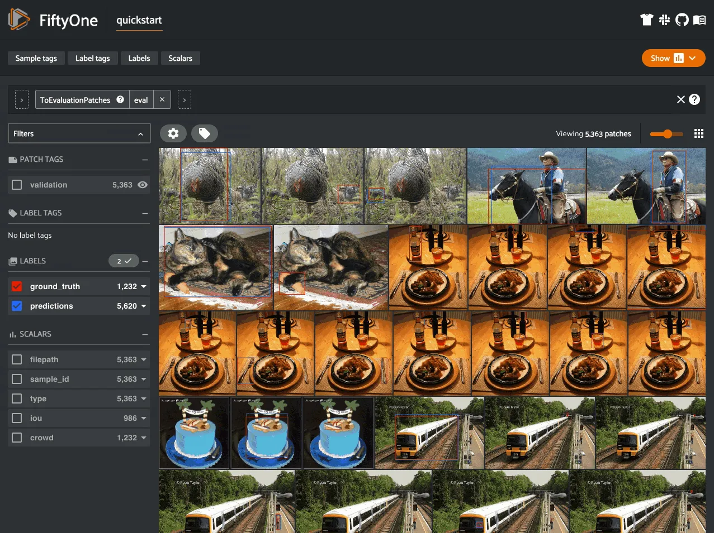

Evaluation patches views are just like any other
[dataset view](using_views.md#using-views) in the sense that:

- You can append view stages via the [App view bar](app.md#app-create-view) or
[views API](using_views.md#using-views)

- Any modifications to ground truth or predicted label tags that you make via
the App’s [tagging menu](app.md#app-tagging) or via API methods like
[`tag_labels()`](../api/fiftyone.core.collections.html#fiftyone.core.collections.SampleCollection.tag_labels "fiftyone.core.collections.SampleCollection.tag_labels")
and [`untag_labels()`](../api/fiftyone.core.collections.html#fiftyone.core.collections.SampleCollection.untag_labels "fiftyone.core.collections.SampleCollection.untag_labels")
will be reflected on the source dataset

- Any modifications to the predicted or ground truth [`Label`](../api/fiftyone.core.labels.html#fiftyone.core.labels.Label "fiftyone.core.labels.Label") elements in the
patches view that you make by iterating over the contents of the view or
calling
[`set_values()`](../api/fiftyone.core.collections.html#fiftyone.core.collections.SampleCollection.set_values "fiftyone.core.collections.SampleCollection.set_values")
will be reflected on the source dataset

- Calling [`save()`](../api/fiftyone.core.patches.html#fiftyone.core.patches.EvaluationPatchesView.save "fiftyone.core.patches.EvaluationPatchesView.save")
on an evaluation patches view (typically one that contains additional view
stages that filter or modify its contents) will sync any [`Label`](../api/fiftyone.core.labels.html#fiftyone.core.labels.Label "fiftyone.core.labels.Label") edits or
deletions with the source dataset

However, because evaluation patches views only contain a subset of the contents
of a [`Sample`](../api/fiftyone.core.sample.html#fiftyone.core.sample.Sample "fiftyone.core.sample.Sample") from the source dataset, there are some differences in behavior
compared to non-patch views:

- Tagging or untagging patches themselves (as opposed to their labels) will
not affect the tags of the underlying [`Sample`](../api/fiftyone.core.sample.html#fiftyone.core.sample.Sample "fiftyone.core.sample.Sample")

- Any new fields that you add to an evaluation patches view will not be added
to the source dataset

### COCO-style evaluation (default spatial) [¶](\#coco-style-evaluation-default-spatial "Permalink to this headline")

By default,
[`evaluate_detections()`](../api/fiftyone.core.collections.html#fiftyone.core.collections.SampleCollection.evaluate_detections "fiftyone.core.collections.SampleCollection.evaluate_detections")
will use [COCO-style evaluation](https://cocodataset.org/#detection-eval) to
analyze predictions when the specified label fields are [`Detections`](../api/fiftyone.core.labels.html#fiftyone.core.labels.Detections "fiftyone.core.labels.Detections") or
[`Polylines`](../api/fiftyone.core.labels.html#fiftyone.core.labels.Polylines "fiftyone.core.labels.Polylines").

You can also explicitly request that COCO-style evaluation be used by setting
the `method` parameter to `"coco"`.

Note

FiftyOne’s implementation of COCO-style evaluation matches the reference
implementation available via
[pycocotools](https://github.com/cocodataset/cocoapi).

#### Overview [¶](\#id5 "Permalink to this headline")

When running COCO-style evaluation using
[`evaluate_detections()`](../api/fiftyone.core.collections.html#fiftyone.core.collections.SampleCollection.evaluate_detections "fiftyone.core.collections.SampleCollection.evaluate_detections"):

- Predicted and ground truth objects are matched using a specified IoU
threshold (default = 0.50). This threshold can be customized via the
`iou` parameter

- By default, only objects with the same `label` will be matched. Classwise
matching can be disabled via the `classwise` parameter

- Ground truth objects can have an `iscrowd` attribute that indicates
whether the annotation contains a crowd of objects. Multiple predictions
can be matched to crowd ground truth objects. The name of this attribute
can be customized by passing the optional `iscrowd` attribute of
[`COCOEvaluationConfig`](../api/fiftyone.utils.eval.coco.html#fiftyone.utils.eval.coco.COCOEvaluationConfig "fiftyone.utils.eval.coco.COCOEvaluationConfig") to
[`evaluate_detections()`](../api/fiftyone.core.collections.html#fiftyone.core.collections.SampleCollection.evaluate_detections "fiftyone.core.collections.SampleCollection.evaluate_detections")

When you specify an `eval_key` parameter, a number of helpful fields will be
populated on each sample and its predicted/ground truth objects:

- True positive (TP), false positive (FP), and false negative (FN) counts
for the each sample are saved in top-level fields of each sample:

```python
TP: sample.<eval_key>_tp
FP: sample.<eval_key>_fp
FN: sample.<eval_key>_fn

```

- The fields listed below are populated on each individual object instance;
these fields tabulate the TP/FP/FN status of the object, the ID of the
matching object (if any), and the matching IoU:

```python
TP/FP/FN: object.<eval_key>
        ID: object.<eval_key>_id
       IoU: object.<eval_key>_iou

```

Note

See [`COCOEvaluationConfig`](../api/fiftyone.utils.eval.coco.html#fiftyone.utils.eval.coco.COCOEvaluationConfig "fiftyone.utils.eval.coco.COCOEvaluationConfig") for complete descriptions of the optional
keyword arguments that you can pass to
[`evaluate_detections()`](../api/fiftyone.core.collections.html#fiftyone.core.collections.SampleCollection.evaluate_detections "fiftyone.core.collections.SampleCollection.evaluate_detections")
when running COCO-style evaluation.

#### Example evaluation [¶](\#example-evaluation "Permalink to this headline")

The example below demonstrates COCO-style detection evaluation on the
[quickstart dataset](../data/dataset_zoo/datasets.md#dataset-zoo-quickstart):

```python
import fiftyone as fo
import fiftyone.zoo as foz
from fiftyone import ViewField as F

dataset = foz.load_zoo_dataset("quickstart")
print(dataset)

# Evaluate the objects in the `predictions` field with respect to the
# objects in the `ground_truth` field
results = dataset.evaluate_detections(
    "predictions",
    gt_field="ground_truth",
    eval_key="eval",
)

# Get the 10 most common classes in the dataset
counts = dataset.count_values("ground_truth.detections.label")
classes = sorted(counts, key=counts.get, reverse=True)[:10]

# Print a classification report for the top-10 classes
results.print_report(classes=classes)

# Print some statistics about the total TP/FP/FN counts
print("TP: %d" % dataset.sum("eval_tp"))
print("FP: %d" % dataset.sum("eval_fp"))
print("FN: %d" % dataset.sum("eval_fn"))

# Create a view that has samples with the most false positives first, and
# only includes false positive boxes in the `predictions` field
view = (
    dataset
    .sort_by("eval_fp", reverse=True)
    .filter_labels("predictions", F("eval") == "fp")
)

# Visualize results in the App
session = fo.launch_app(view=view)

```

```python
               precision    recall  f1-score   support

       person       0.45      0.74      0.56       783
         kite       0.55      0.72      0.62       156
          car       0.12      0.54      0.20        61
         bird       0.63      0.67      0.65       126
       carrot       0.06      0.49      0.11        47
         boat       0.05      0.24      0.08        37
    surfboard       0.10      0.43      0.17        30
     airplane       0.29      0.67      0.40        24
traffic light       0.22      0.54      0.31        24
        bench       0.10      0.30      0.15        23

    micro avg       0.32      0.68      0.43      1311
    macro avg       0.26      0.54      0.32      1311
 weighted avg       0.42      0.68      0.50      1311

```


Note

The easiest way to analyze models in FiftyOne is via the
[Model Evaluation panel](app.md#app-model-evaluation-panel)!

#### mAP, mAR and PR curves [¶](\#map-mar-and-pr-curves "Permalink to this headline")

You can compute mean average precision (mAP), mean average recall (mAR), and
precision-recall (PR) curves for your predictions by passing the
`compute_mAP=True` flag to
[`evaluate_detections()`](../api/fiftyone.core.collections.html#fiftyone.core.collections.SampleCollection.evaluate_detections "fiftyone.core.collections.SampleCollection.evaluate_detections"):

Note

All mAP and mAR calculations are performed according to the
[COCO evaluation protocol](https://cocodataset.org/#detection-eval).

```python
import fiftyone as fo
import fiftyone.zoo as foz

dataset = foz.load_zoo_dataset("quickstart")
print(dataset)

# Performs an IoU sweep so that mAP, mAR, and PR curves can be computed
results = dataset.evaluate_detections(
    "predictions",
    gt_field="ground_truth",
    compute_mAP=True,
)

print(results.mAP())
# 0.3957

print(results.mAR())
# 0.5210

plot = results.plot_pr_curves(classes=["person", "kite", "car"])
plot.show()

```

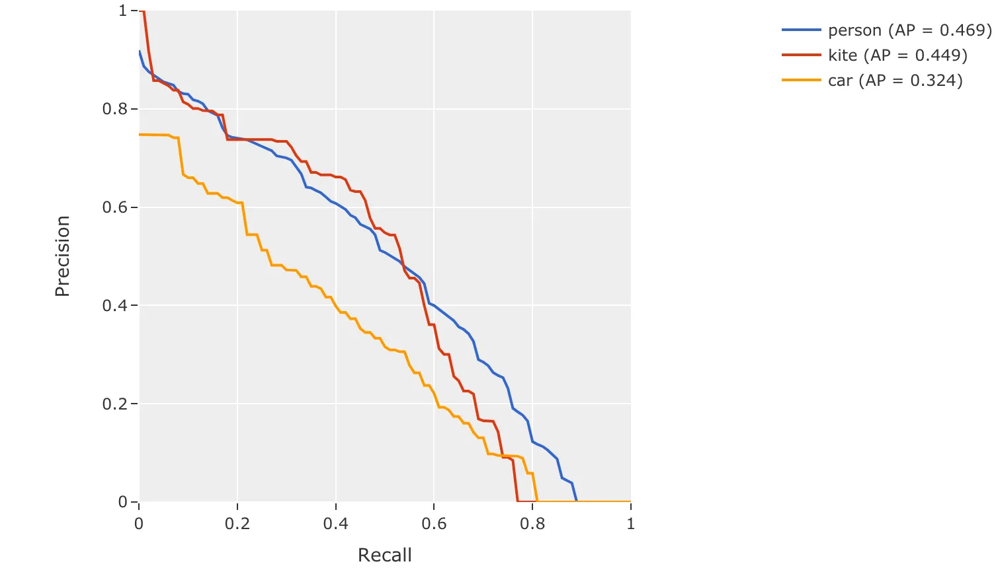

#### Confusion matrices [¶](\#id6 "Permalink to this headline")

You can also easily generate [confusion matrices](#confusion-matrices) for
the results of COCO-style evaluations.

In order for the confusion matrix to capture anything other than false
positive/negative counts, you will likely want to set the
[`classwise`](../api/fiftyone.utils.eval.coco.html#fiftyone.utils.eval.coco.COCOEvaluationConfig "fiftyone.utils.eval.coco.COCOEvaluationConfig") parameter
to `False` during evaluation so that predicted objects can be matched with
ground truth objects of different classes.

```python
import fiftyone as fo
import fiftyone.zoo as foz

dataset = foz.load_zoo_dataset("quickstart")

# Perform evaluation, allowing objects to be matched between classes
results = dataset.evaluate_detections(
    "predictions", gt_field="ground_truth", classwise=False
)

# Generate a confusion matrix for the specified classes
plot = results.plot_confusion_matrix(classes=["car", "truck", "motorcycle"])
plot.show()

```

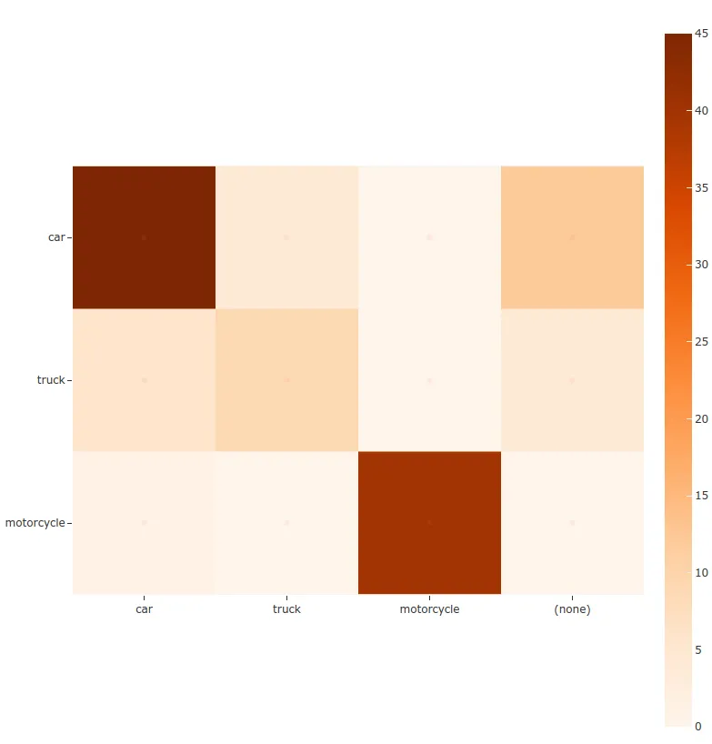

### Open Images-style evaluation [¶](\#open-images-style-evaluation "Permalink to this headline")

The [`evaluate_detections()`](../api/fiftyone.core.collections.html#fiftyone.core.collections.SampleCollection.evaluate_detections "fiftyone.core.collections.SampleCollection.evaluate_detections")
method also supports
[Open Images-style evaluation](https://storage.googleapis.com/openimages/web/evaluation.html).

In order to run Open Images-style evaluation, simply set the `method`
parameter to `"open-images"`.

Note

FiftyOne’s implementation of Open Images-style evaluation matches the
reference implementation available via the
[TF Object Detection API](https://github.com/tensorflow/models/tree/master/research/object_detection).

#### Overview [¶](\#id8 "Permalink to this headline")

Open Images-style evaluation provides additional features not found in
[COCO-style evaluation](#evaluating-detections-coco) that you may find
useful when evaluating your custom datasets.

The two primary differences are:

- **Non-exhaustive image labeling:** positive and negative sample-level
[`Classifications`](../api/fiftyone.core.labels.html#fiftyone.core.labels.Classifications "fiftyone.core.labels.Classifications") fields can be provided to indicate which object classes
were considered when annotating the image. Predicted objects whose classes
are not included in the sample-level labels for a sample are ignored.
The names of these fields can be specified via the `pos_label_field` and
`neg_label_field` parameters

- **Class hierarchies:** If your dataset includes a
[class hierarchy](https://storage.googleapis.com/openimages/2018_04/bbox_labels_600_hierarchy_visualizer/circle.html),
you can configure this evaluation protocol to automatically expand ground
truth and/or predicted leaf classes so that all levels of the hierarchy can
be [correctly evaluated](https://storage.googleapis.com/openimages/web/evaluation.html).
You can provide a label hierarchy via the `hierarchy` parameter. By
default, if you provide a hierarchy, then image-level label fields and
ground truth detections will be expanded to incorporate parent classes
(child classes for negative image-level labels). You can disable this
feature by setting the `expand_gt_hierarchy` parameter to `False`.
Alternatively, you can expand predictions by setting the
`expand_pred_hierarchy` parameter to `True`

In addition, note that:

- Like [VOC-style evaluation](http://host.robots.ox.ac.uk/pascal/VOC/voc2010/devkit_doc_08-May-2010.pdf),
only one IoU (default = 0.5) is used to calculate mAP. You can customize
this value via the `iou` parameter

- When dealing with crowd objects, Open Images-style evaluation dictates that
if a crowd is matched with multiple predictions, each counts as one true
positive when computing mAP

When you specify an `eval_key` parameter, a number of helpful fields will be
populated on each sample and its predicted/ground truth objects:

- True positive (TP), false positive (FP), and false negative (FN) counts
for the each sample are saved in top-level fields of each sample:

```python
TP: sample.<eval_key>_tp
FP: sample.<eval_key>_fp
FN: sample.<eval_key>_fn

```

- The fields listed below are populated on each individual [`Detection`](../api/fiftyone.core.labels.html#fiftyone.core.labels.Detection "fiftyone.core.labels.Detection")
instance; these fields tabulate the TP/FP/FN status of the object, the ID
of the matching object (if any), and the matching IoU:

```python
TP/FP/FN: object.<eval_key>
        ID: object.<eval_key>_id
       IoU: object.<eval_key>_iou

```

Note

See [`OpenImagesEvaluationConfig`](../api/fiftyone.utils.eval.openimages.html#fiftyone.utils.eval.openimages.OpenImagesEvaluationConfig "fiftyone.utils.eval.openimages.OpenImagesEvaluationConfig") for complete descriptions of the optional
keyword arguments that you can pass to
[`evaluate_detections()`](../api/fiftyone.core.collections.html#fiftyone.core.collections.SampleCollection.evaluate_detections "fiftyone.core.collections.SampleCollection.evaluate_detections")
when running Open Images-style evaluation.

#### Example evaluation [¶](\#id9 "Permalink to this headline")

The example below demonstrates Open Images-style detection evaluation on the
[quickstart dataset](../data/dataset_zoo/datasets.md#dataset-zoo-quickstart):

```python
import fiftyone as fo
import fiftyone.zoo as foz
from fiftyone import ViewField as F

dataset = foz.load_zoo_dataset("quickstart")
print(dataset)

# Evaluate the objects in the `predictions` field with respect to the
# objects in the `ground_truth` field
results = dataset.evaluate_detections(
    "predictions",
    gt_field="ground_truth",
    method="open-images",
    eval_key="eval",
)

# Get the 10 most common classes in the dataset
counts = dataset.count_values("ground_truth.detections.label")
classes = sorted(counts, key=counts.get, reverse=True)[:10]

# Print a classification report for the top-10 classes
results.print_report(classes=classes)

# Print some statistics about the total TP/FP/FN counts
print("TP: %d" % dataset.sum("eval_tp"))
print("FP: %d" % dataset.sum("eval_fp"))
print("FN: %d" % dataset.sum("eval_fn"))

# Create a view that has samples with the most false positives first, and
# only includes false positive boxes in the `predictions` field
view = (
    dataset
    .sort_by("eval_fp", reverse=True)
    .filter_labels("predictions", F("eval") == "fp")
)

# Visualize results in the App
session = fo.launch_app(view=view)

```

```python
               precision    recall  f1-score   support

       person       0.25      0.86      0.39       378
         kite       0.27      0.75      0.40        75
          car       0.18      0.80      0.29        61
         bird       0.20      0.51      0.28        51
       carrot       0.09      0.74      0.16        47
         boat       0.09      0.46      0.16        37
    surfboard       0.17      0.73      0.28        30
     airplane       0.36      0.83      0.50        24
traffic light       0.32      0.79      0.45        24
      giraffe       0.36      0.91      0.52        23

    micro avg       0.21      0.79      0.34       750
    macro avg       0.23      0.74      0.34       750
 weighted avg       0.23      0.79      0.36       750

```

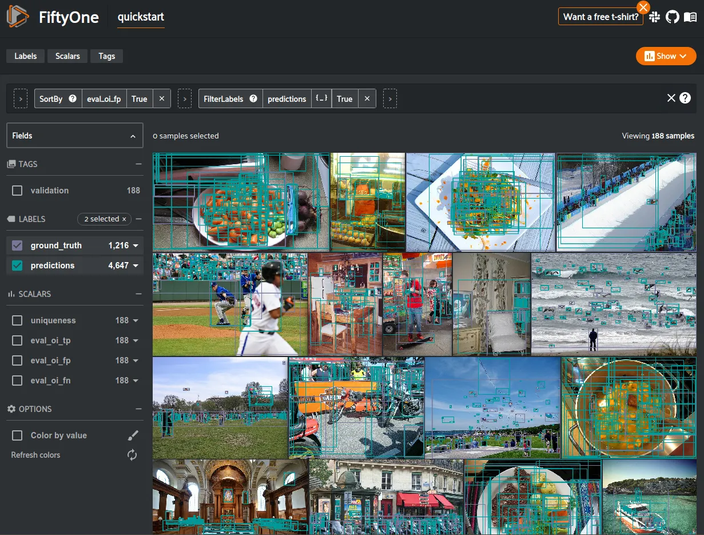

Note

The easiest way to analyze models in FiftyOne is via the
[Model Evaluation panel](app.md#app-model-evaluation-panel)!

#### mAP and PR curves [¶](\#map-and-pr-curves "Permalink to this headline")

You can easily compute mean average precision (mAP) and precision-recall (PR)
curves using the results object returned by
[`evaluate_detections()`](../api/fiftyone.core.collections.html#fiftyone.core.collections.SampleCollection.evaluate_detections "fiftyone.core.collections.SampleCollection.evaluate_detections"):

Note

FiftyOne’s implementation of Open Images-style evaluation matches the
reference implementation available via the
[TF Object Detection API](https://github.com/tensorflow/models/tree/master/research/object_detection).

```python
import fiftyone as fo
import fiftyone.zoo as foz

dataset = foz.load_zoo_dataset("quickstart")
print(dataset)

results = dataset.evaluate_detections(
    "predictions",
    gt_field="ground_truth",
    method="open-images",
)

print(results.mAP())
# 0.599

plot = results.plot_pr_curves(classes=["person", "dog", "car"])
plot.show()

```

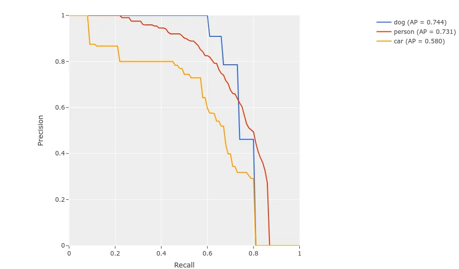

#### Confusion matrices [¶](\#id11 "Permalink to this headline")

You can also easily generate [confusion matrices](#confusion-matrices) for
the results of Open Images-style evaluations.

In order for the confusion matrix to capture anything other than false
positive/negative counts, you will likely want to set the
[`classwise`](../api/fiftyone.utils.eval.openimages.html#fiftyone.utils.eval.openimages.OpenImagesEvaluationConfig "fiftyone.utils.eval.openimages.OpenImagesEvaluationConfig")
parameter to `False` during evaluation so that predicted objects can be
matched with ground truth objects of different classes.

```python
import fiftyone as fo
import fiftyone.zoo as foz

dataset = foz.load_zoo_dataset("quickstart")

# Perform evaluation, allowing objects to be matched between classes
results = dataset.evaluate_detections(
    "predictions",
    gt_field="ground_truth",
    method="open-images",
    classwise=False,
)

# Generate a confusion matrix for the specified classes
plot = results.plot_confusion_matrix(classes=["car", "truck", "motorcycle"])
plot.show()

```

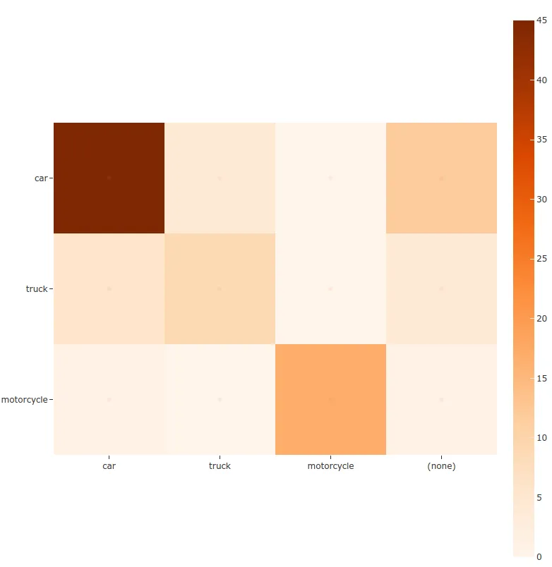

### ActivityNet-style evaluation (default temporal) [¶](\#activitynet-style-evaluation-default-temporal "Permalink to this headline")

By default,
[`evaluate_detections()`](../api/fiftyone.core.collections.html#fiftyone.core.collections.SampleCollection.evaluate_detections "fiftyone.core.collections.SampleCollection.evaluate_detections")
will use
[ActivityNet-style temporal detection evaluation](https://github.com/activitynet/ActivityNet/tree/master/Evaluation).
to analyze predictions when the specified label fields are [`TemporalDetections`](../api/fiftyone.core.labels.html#fiftyone.core.labels.TemporalDetections "fiftyone.core.labels.TemporalDetections").

You can also explicitly request that ActivityNet-style evaluation be used by setting
the `method` parameter to `"activitynet"`.

Note

FiftyOne’s implementation of ActivityNet-style evaluation matches the
reference implementation available via the
[ActivityNet API](https://github.com/activitynet/ActivityNet/tree/master/Evaluation).

#### Overview [¶](\#id12 "Permalink to this headline")

When running ActivityNet-style evaluation using
[`evaluate_detections()`](../api/fiftyone.core.collections.html#fiftyone.core.collections.SampleCollection.evaluate_detections "fiftyone.core.collections.SampleCollection.evaluate_detections"):

- Predicted and ground truth segments are matched using a specified IoU
threshold (default = 0.50). This threshold can be customized via the
`iou` parameter

- By default, only segments with the same `label` will be matched.
Classwise matching can be disabled by passing `classwise=False`

- mAP is computed by averaging over the same range of IoU values
[used by COCO](../integrations/coco.md#coco-map)

When you specify an `eval_key` parameter, a number of helpful fields will be
populated on each sample and its predicted/ground truth segments:

- True positive (TP), false positive (FP), and false negative (FN) counts
for the each sample are saved in top-level fields of each sample:

```python
TP: sample.<eval_key>_tp
FP: sample.<eval_key>_fp
FN: sample.<eval_key>_fn

```

- The fields listed below are populated on each individual temporal detection
segment; these fields tabulate the TP/FP/FN status of the segment, the ID
of the matching segment (if any), and the matching IoU:

```python
TP/FP/FN: segment.<eval_key>
        ID: segment.<eval_key>_id
       IoU: segment.<eval_key>_iou

```

Note

See [`ActivityNetEvaluationConfig`](../api/fiftyone.utils.eval.activitynet.html#fiftyone.utils.eval.activitynet.ActivityNetEvaluationConfig "fiftyone.utils.eval.activitynet.ActivityNetEvaluationConfig") for complete descriptions of the optional
keyword arguments that you can pass to
[`evaluate_detections()`](../api/fiftyone.core.collections.html#fiftyone.core.collections.SampleCollection.evaluate_detections "fiftyone.core.collections.SampleCollection.evaluate_detections")
when running ActivityNet-style evaluation.

#### Example evaluation [¶](\#id13 "Permalink to this headline")

The example below demonstrates ActivityNet-style temporal detection evaluation
on the [ActivityNet 200 dataset](../data/dataset_zoo/datasets.md#dataset-zoo-activitynet-200):

```python
import fiftyone as fo
import fiftyone.zoo as foz
from fiftyone import ViewField as F

import random

# Load subset of ActivityNet 200
classes = ["Bathing dog", "Walking the dog"]
dataset = foz.load_zoo_dataset(
    "activitynet-200",
    split="validation",
    classes=classes,
    max_samples=10,
)
print(dataset)

# Generate some fake predictions for this example
random.seed(51)
dataset.clone_sample_field("ground_truth", "predictions")
for sample in dataset:
    for det in sample.predictions.detections:
        det.support[0] += random.randint(-10,10)
        det.support[1] += random.randint(-10,10)
        det.support[0] = max(det.support[0], 1)
        det.support[1] = max(det.support[1], det.support[0] + 1)
        det.confidence = random.random()
        det.label = random.choice(classes)

    sample.save()

# Evaluate the segments in the `predictions` field with respect to the
# segments in the `ground_truth` field
results = dataset.evaluate_detections(
    "predictions",
    gt_field="ground_truth",
    eval_key="eval",
)

# Print a classification report for the classes
results.print_report(classes=classes)

# Print some statistics about the total TP/FP/FN counts
print("TP: %d" % dataset.sum("eval_tp"))
print("FP: %d" % dataset.sum("eval_fp"))
print("FN: %d" % dataset.sum("eval_fn"))

# Create a view that has samples with the most false positives first, and
# only includes false positive segments in the `predictions` field
view = (
    dataset
    .sort_by("eval_fp", reverse=True)
    .filter_labels("predictions", F("eval") == "fp")
)

# Visualize results in the App
session = fo.launch_app(view=view)

```

```python
                 precision    recall  f1-score   support

    Bathing dog       0.50      0.40      0.44         5
Walking the dog       0.50      0.60      0.55         5

      micro avg       0.50      0.50      0.50        10
      macro avg       0.50      0.50      0.49        10
   weighted avg       0.50      0.50      0.49        10

```

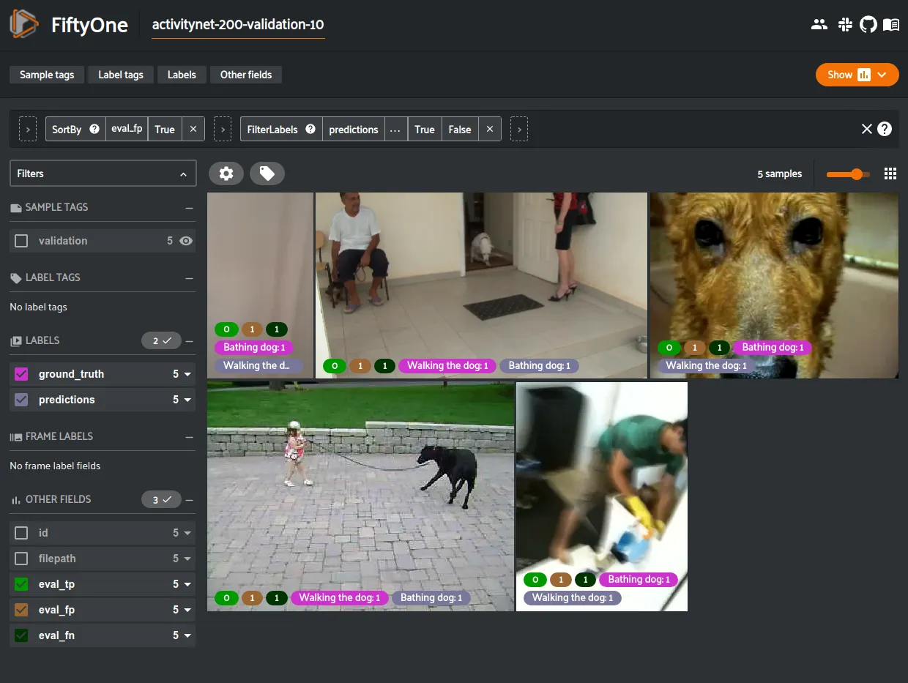

Note

The easiest way to analyze models in FiftyOne is via the
[Model Evaluation panel](app.md#app-model-evaluation-panel)!

#### mAP and PR curves [¶](\#id14 "Permalink to this headline")

You can compute mean average precision (mAP) and precision-recall (PR) curves
for your segments by passing the `compute_mAP=True` flag to
[`evaluate_detections()`](../api/fiftyone.core.collections.html#fiftyone.core.collections.SampleCollection.evaluate_detections "fiftyone.core.collections.SampleCollection.evaluate_detections"):

Note

All mAP calculations are performed according to the
[ActivityNet evaluation protocol](https://github.com/activitynet/ActivityNet/tree/master/Evaluation).

```python
import random

import fiftyone as fo
import fiftyone.zoo as foz

# Load subset of ActivityNet 200
classes = ["Bathing dog", "Walking the dog"]
dataset = foz.load_zoo_dataset(
    "activitynet-200",
    split="validation",
    classes=classes,
    max_samples=10,
)
print(dataset)

# Generate some fake predictions for this example
random.seed(51)
dataset.clone_sample_field("ground_truth", "predictions")
for sample in dataset:
    for det in sample.predictions.detections:
        det.support[0] += random.randint(-10,10)
        det.support[1] += random.randint(-10,10)
        det.support[0] = max(det.support[0], 1)
        det.support[1] = max(det.support[1], det.support[0] + 1)
        det.confidence = random.random()
        det.label = random.choice(classes)

    sample.save()

# Performs an IoU sweep so that mAP and PR curves can be computed
results = dataset.evaluate_detections(
    "predictions",
    gt_field="ground_truth",
    eval_key="eval",
    compute_mAP=True,
)

print(results.mAP())
# 0.367

plot = results.plot_pr_curves(classes=classes)
plot.show()

```

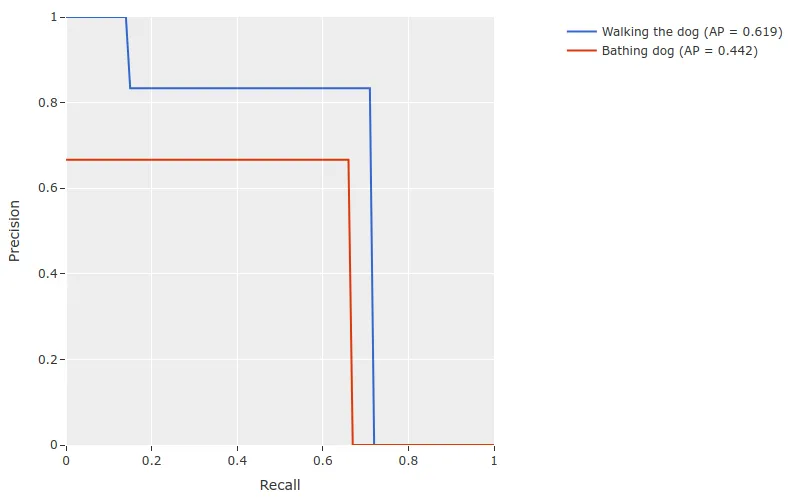

#### Confusion matrices [¶](\#id15 "Permalink to this headline")

You can also easily generate [confusion matrices](#confusion-matrices) for
the results of ActivityNet-style evaluations.

In order for the confusion matrix to capture anything other than false
positive/negative counts, you will likely want to set the
`classwise`
parameter to `False` during evaluation so that predicted segments can be
matched with ground truth segments of different classes.

```python
import random

import fiftyone as fo
import fiftyone.zoo as foz

# Load subset of ActivityNet 200
classes = ["Bathing dog", "Grooming dog", "Grooming horse", "Walking the dog"]
dataset = foz.load_zoo_dataset(
    "activitynet-200",
    split="validation",
    classes=classes,
    max_samples=20,
)
print(dataset)

# Generate some fake predictions for this example
random.seed(51)
dataset.clone_sample_field("ground_truth", "predictions")
for sample in dataset:
    for det in sample.predictions.detections:
        det.support[0] += random.randint(-10,10)
        det.support[1] += random.randint(-10,10)
        det.support[0] = max(det.support[0], 1)
        det.support[1] = max(det.support[1], det.support[0] + 1)
        det.confidence = random.random()
        det.label = random.choice(classes)

    sample.save()

# Perform evaluation, allowing objects to be matched between classes
results = dataset.evaluate_detections(
    "predictions", gt_field="ground_truth", classwise=False
)

# Generate a confusion matrix for the specified classes
plot = results.plot_confusion_matrix(classes=classes)
plot.show()

```

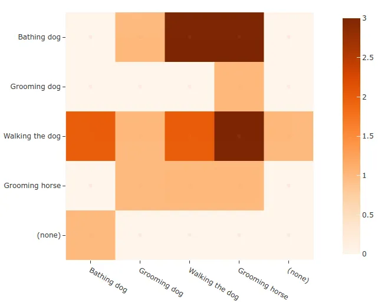

## Semantic segmentations [¶](\#semantic-segmentations "Permalink to this headline")

You can use the
[`evaluate_segmentations()`](../api/fiftyone.core.collections.html#fiftyone.core.collections.SampleCollection.evaluate_segmentations "fiftyone.core.collections.SampleCollection.evaluate_segmentations")
method to evaluate the predictions of a semantic segmentation model stored in a
[`Segmentation`](../api/fiftyone.core.labels.html#fiftyone.core.labels.Segmentation "fiftyone.core.labels.Segmentation") field of your dataset.

By default, the full segmentation masks will be evaluated at a pixel level, but
you can specify other evaluation strategies such as evaluating only boundary
pixels (see below for details).

Invoking
[`evaluate_segmentations()`](../api/fiftyone.core.collections.html#fiftyone.core.collections.SampleCollection.evaluate_segmentations "fiftyone.core.collections.SampleCollection.evaluate_segmentations")
returns a [`SegmentationResults`](../api/fiftyone.utils.eval.segmentation.html#fiftyone.utils.eval.segmentation.SegmentationResults "fiftyone.utils.eval.segmentation.SegmentationResults") instance that provides a variety of methods for
generating various aggregate evaluation reports about your model.

In addition, when you specify an `eval_key` parameter, a number of helpful
fields will be populated on each sample that you can leverage via the
[FiftyOne App](app.md#fiftyone-app) to interactively explore the strengths and
weaknesses of your model on individual samples.

Note

You can [store mask targets](using_datasets.md#storing-mask-targets) for your
[`Segmentation`](../api/fiftyone.core.labels.html#fiftyone.core.labels.Segmentation "fiftyone.core.labels.Segmentation") fields on your dataset so that you can view semantic labels
in the App and avoid having to manually specify the set of mask targets
each time you run
[`evaluate_segmentations()`](../api/fiftyone.core.collections.html#fiftyone.core.collections.SampleCollection.evaluate_segmentations "fiftyone.core.collections.SampleCollection.evaluate_segmentations")
on a dataset.

### Simple evaluation (default) [¶](\#id16 "Permalink to this headline")

By default,
[`evaluate_segmentations()`](../api/fiftyone.core.collections.html#fiftyone.core.collections.SampleCollection.evaluate_detections "fiftyone.core.collections.SampleCollection.evaluate_detections")
will perform pixelwise evaluation of the segmentation masks, treating each
pixel as a multiclass classification.

Here are some things to keep in mind:

- If the size of a predicted mask does not match the ground truth mask, it is
resized to match the ground truth.

- You can specify the optional `bandwidth` parameter to evaluate only along
the contours of the ground truth masks. By default, the entire masks are
evaluated.

You can explicitly request that this strategy be used by setting the `method`
parameter to `"simple"`.

When you specify an `eval_key` parameter, the accuracy, precision, and recall
of each sample is recorded in top-level fields of each sample:

```python
 Accuracy: sample.<eval_key>_accuracy
Precision: sample.<eval_key>_precision
   Recall: sample.<eval_key>_recall

```

Note

The mask values `0` and `#000000` are treated as a background class
for the purposes of computing evaluation metrics like precision and
recall.

The example below demonstrates segmentation evaluation by comparing the
masks generated by two DeepLabv3 models (with
[ResNet50](../models/model_zoo/models.md#model-zoo-deeplabv3-resnet50-coco-torch) and
[ResNet101](../models/model_zoo/models.md#model-zoo-deeplabv3-resnet101-coco-torch) backbones):

```python
import fiftyone as fo
import fiftyone.zoo as foz

# Load a few samples from COCO-2017
dataset = foz.load_zoo_dataset(
    "quickstart",
    dataset_name="segmentation-eval-demo",
    max_samples=10,
    shuffle=True,
)

# The models are trained on the VOC classes
CLASSES = (
    "background,aeroplane,bicycle,bird,boat,bottle,bus,car,cat,chair,cow," +
    "diningtable,dog,horse,motorbike,person,pottedplant,sheep,sofa,train," +
    "tvmonitor"
)
dataset.default_mask_targets = {
    idx: label for idx, label in enumerate(CLASSES.split(","))
}

# Add DeepLabv3-ResNet101 predictions to dataset
model = foz.load_zoo_model("deeplabv3-resnet101-coco-torch")
dataset.apply_model(model, "resnet101")

# Add DeepLabv3-ResNet50 predictions to dataset
model = foz.load_zoo_model("deeplabv3-resnet50-coco-torch")
dataset.apply_model(model, "resnet50")

print(dataset)

# Evaluate the masks w/ ResNet50 backbone, treating the masks w/ ResNet101
# backbone as "ground truth"
results = dataset.evaluate_segmentations(
    "resnet50",
    gt_field="resnet101",
    eval_key="eval_simple",
)

# Get a sense for the per-sample variation in likeness
print("Accuracy range: (%f, %f)" % dataset.bounds("eval_simple_accuracy"))
print("Precision range: (%f, %f)" % dataset.bounds("eval_simple_precision"))
print("Recall range: (%f, %f)" % dataset.bounds("eval_simple_recall"))

# Print a classification report
results.print_report()

# Visualize results in the App
session = fo.launch_app(dataset)

```


Note

The easiest way to analyze models in FiftyOne is via the
[Model Evaluation panel](app.md#app-model-evaluation-panel)!

## Advanced usage [¶](\#advanced-usage "Permalink to this headline")

### Evaluating views into your dataset [¶](\#evaluating-views-into-your-dataset "Permalink to this headline")

All evaluation methods are exposed on [`DatasetView`](../api/fiftyone.core.view.html#fiftyone.core.view.DatasetView "fiftyone.core.view.DatasetView") objects, which means that
you can define arbitrarily complex views into your datasets and run evaluation
on those.

For example, the snippet below evaluates only the medium-sized objects in a
dataset:

```python
import fiftyone as fo
import fiftyone.zoo as foz
from fiftyone import ViewField as F

dataset = foz.load_zoo_dataset("quickstart", dataset_name="eval-demo")
dataset.compute_metadata()

# Create an expression that will match objects whose bounding boxes have
# areas between 32^2 and 96^2 pixels
bbox_area = (
    F("$metadata.width") * F("bounding_box")[2] *
    F("$metadata.height") * F("bounding_box")[3]
)
medium_boxes = (32 ** 2 < bbox_area) & (bbox_area < 96 ** 2)

# Create a view that contains only medium-sized objects
medium_view = (
    dataset
    .filter_labels("ground_truth", medium_boxes)
    .filter_labels("predictions", medium_boxes)
)

print(medium_view)

# Evaluate the medium-sized objects
results = medium_view.evaluate_detections(
    "predictions",
    gt_field="ground_truth",
    eval_key="eval_medium",
)

# Print some aggregate metrics
print(results.metrics())

# View results in the App
session = fo.launch_app(view=medium_view)

```

Note

If you run evaluation on a complex view, don’t worry, you can always
[load the view later](#load-evaluation-view)!

### Loading a previous evaluation result [¶](\#loading-a-previous-evaluation-result "Permalink to this headline")

You can view a list of evaluation keys for evaluations that you have previously
run on a dataset via
[`list_evaluations()`](../api/fiftyone.core.collections.html#fiftyone.core.collections.SampleCollection.list_evaluations "fiftyone.core.collections.SampleCollection.list_evaluations").

Evaluation keys are stored at the dataset-level, but if a particular evaluation
was run on a view into your dataset, you can use
[`load_evaluation_view()`](../api/fiftyone.core.collections.html#fiftyone.core.collections.SampleCollection.load_evaluation_view "fiftyone.core.collections.SampleCollection.load_evaluation_view")
to retrieve the exact view on which you evaluated:

```python
import fiftyone as fo

dataset = fo.load_dataset(...)

# List available evaluations
dataset.list_evaluations()
# ["my_eval1", "my_eval2", ...]

# Load the view into the dataset on which `my_eval1` was run
eval1_view = dataset.load_evaluation_view("my_eval1")

```

Note

If you have run multiple evaluations on a dataset, you can use the
`select_fields` parameter of the
[`load_evaluation_view()`](../api/fiftyone.core.collections.html#fiftyone.core.collections.SampleCollection.load_evaluation_view "fiftyone.core.collections.SampleCollection.load_evaluation_view")
method to hide any fields that were populated by other evaluation runs,
allowing you to, for example, focus on a specific set of evaluation results
in the App:

```python
import fiftyone as fo

dataset = fo.load_dataset(...)

# Load a view that contains the results of evaluation `my_eval1` and
# hides all other evaluation data
eval1_view = dataset.load_evaluation_view("my_eval1", select_fields=True)

session = fo.launch_app(view=eval1_view)

```

### Evaluating videos [¶](\#evaluating-videos "Permalink to this headline")

All evaluation methods can be applied to frame-level labels in addition to
sample-level labels.

You can evaluate frame-level labels of a video dataset by adding the `frames`
prefix to the relevant prediction and ground truth frame fields.

Note

When evaluating frame-level labels, helpful statistics are tabulated at
both the sample- and frame-levels of your dataset. Refer to the
documentation of the relevant evaluation method for more details.

The example below demonstrates evaluating (mocked) frame-level detections on
the [quickstart-video dataset](../data/dataset_zoo/datasets.md#dataset-zoo-quickstart-video) from the
Dataset Zoo:

```python
import random

import fiftyone as fo
import fiftyone.zoo as foz

dataset = foz.load_zoo_dataset(
    "quickstart-video", dataset_name="video-eval-demo"
)

#
# Create some test predictions by copying the ground truth objects into a
# new `predictions` field of the frames with 10% of the labels perturbed at
# random
#

classes = dataset.distinct("frames.detections.detections.label")

def jitter(val):
    if random.random() < 0.10:
        return random.choice(classes)

    return val

predictions = []
for sample_gts in dataset.values("frames.detections"):
    sample_predictions = []
    for frame_gts in sample_gts:
        sample_predictions.append(
            fo.Detections(
                detections=[\
                    fo.Detection(\
                        label=jitter(gt.label),\
                        bounding_box=gt.bounding_box,\
                        confidence=random.random(),\
                    )\
                    for gt in frame_gts.detections\
                ]
            )
        )

    predictions.append(sample_predictions)

dataset.set_values("frames.predictions", predictions)

print(dataset)

# Evaluate the frame-level `predictions` against the frame-level
# `detections` objects
results = dataset.evaluate_detections(
    "frames.predictions",
    gt_field="frames.detections",
    eval_key="eval",
)

# Print a classification report
results.print_report()

```

```python
              precision    recall  f1-score   support

      person       0.76      0.93      0.84      1108
   road sign       0.90      0.94      0.92      2726
     vehicle       0.98      0.94      0.96      7511

   micro avg       0.94      0.94      0.94     11345
   macro avg       0.88      0.94      0.91     11345
weighted avg       0.94      0.94      0.94     11345

```

You can also view frame-level evaluation results as
[evaluation patches](#evaluation-patches) by first converting
[to frames](using_views.md#frame-views) and then [to patches](using_views.md#eval-patches-views)!

```python
# Convert to frame evaluation patches
frames = dataset.to_frames(sample_frames=True)
frame_eval_patches = frames.to_evaluation_patches("eval")
print(frame_eval_patches)

print(frame_eval_patches.count_values("type"))
# {'tp': 10578, 'fn': 767, 'fp': 767}

session = fo.launch_app(view=frame_eval_patches)

```

```python
Dataset:     video-eval-demo
Media type:  image
Num patches: 12112
Patch fields:
    id:               fiftyone.core.fields.ObjectIdField
    sample_id:        fiftyone.core.fields.ObjectIdField
    frame_id:         fiftyone.core.fields.ObjectIdField
    filepath:         fiftyone.core.fields.StringField
    frame_number:     fiftyone.core.fields.FrameNumberField
    tags:             fiftyone.core.fields.ListField(fiftyone.core.fields.StringField)
    metadata:         fiftyone.core.fields.EmbeddedDocumentField(fiftyone.core.metadata.ImageMetadata)
    created_at:       fiftyone.core.fields.DateTimeField
    last_modified_at: fiftyone.core.fields.DateTimeField
    predictions:      fiftyone.core.fields.EmbeddedDocumentField(fiftyone.core.labels.Detections)
    detections:       fiftyone.core.fields.EmbeddedDocumentField(fiftyone.core.labels.Detections)
    type:             fiftyone.core.fields.StringField
    iou:              fiftyone.core.fields.FloatField
    crowd:            fiftyone.core.fields.BooleanField
View stages:
    1. ToFrames(config=None)
    2. ToEvaluationPatches(eval_key='eval', config=None)

```

## Custom evaluation backends [¶](\#custom-evaluation-backends "Permalink to this headline")

If you would like to use an evaluation protocol that is not natively supported
by FiftyOne, you can follow the instructions below to implement an interface
for your protocol and then configure your environment so that FiftyOne’s
evaluation methods will use it.

## Evaluation config [¶](\#evaluation-config "Permalink to this headline")

FiftyOne provides an evaluation config that you can use to either temporarily
or permanently configure the behavior of the evaluation API.

### Viewing your config [¶](\#viewing-your-config "Permalink to this headline")

You can print your current evaluation config at any time via the Python library
and the CLI:

Note

If you have customized your evaluation config via any of the methods
described below, printing your config is a convenient way to ensure that
the changes you made have taken effect as you expected.

### Modifying your config [¶](\#modifying-your-config "Permalink to this headline")

You can modify your evaluation config in a variety of ways. The following
sections describe these options in detail.

#### Order of precedence [¶](\#order-of-precedence "Permalink to this headline")

The following order of precedence is used to assign values to your evaluation
config settings as runtime:

1. Config settings applied at runtime by directly editing
`fiftyone.evaluation_config`

2. `FIFTYONE_XXX` environment variables

3. Settings in your JSON config ( `~/.fiftyone/evaluation_config.json`)

4. The default config values

#### Editing your JSON config [¶](\#editing-your-json-config "Permalink to this headline")

You can permanently customize your evaluation config by creating a
`~/.fiftyone/evaluation_config.json` file on your machine. The JSON file may
contain any desired subset of config fields that you wish to customize.

For example, the following config JSON file declares a new `custom` detection
evaluation backend without changing any other default config settings:

```python
{
    "default_detection_backend": "custom",
    "detection_backends": {
        "custom": {
            "config_cls": "path.to.your.CustomDetectionEvaluationConfig"
        }
    }
}

```

When `fiftyone` is imported, any options from your JSON config are merged into
the default config, as per the order of precedence described above.

Note

You can customize the location from which your JSON config is read by
setting the `FIFTYONE_EVALUATION_CONFIG_PATH` environment variable.

#### Setting environment variables [¶](\#setting-environment-variables "Permalink to this headline")

Evaluation config settings may be customized on a per-session basis by setting
the `FIFTYONE_<TYPE>_XXX` environment variable(s) for the desired config
settings, where `<TYPE>` can be `REGRESSION`, `CLASSIFICATION`, `DETECTION`, or
`SEGMENTATION`.

The `FIFTYONE_DEFAULT_<TYPE>_BACKEND` environment variables allows you to
configure your default backend:

```python
export FIFTYONE_DEFAULT_DETECTION_BACKEND=coco

```

You can declare parameters for specific evaluation backends by setting
environment variables of the form `FIFTYONE_<TYPE>_<BACKEND>_<PARAMETER>`. Any
settings that you declare in this way will be passed as keyword arguments to
methods like
[`evaluate_detections()`](../api/fiftyone.core.collections.html#fiftyone.core.collections.SampleCollection.evaluate_detections "fiftyone.core.collections.SampleCollection.evaluate_detections")
whenever the corresponding backend is in use:

```python
export FIFTYONE_DETECTION_COCO_ISCROWD=is_crowd

```

The `FIFTYONE_<TYPE>_BACKENDS` environment variables can be set to a
`list,of,backends` that you want to expose in your session, which may exclude
native backends and/or declare additional custom backends whose parameters are
defined via additional config modifications of any kind:

```python
export FIFTYONE_DETECTION_BACKENDS=custom,coco,open-images

```

When declaring new backends, you can include `*` to append new backend(s)
without omitting or explicitly enumerating the builtin backends. For example,
you can add a `custom` detection evaluation backend as follows:

```python
export FIFTYONE_DETECTION_BACKENDS=*,custom
export FIFTYONE_DETECTION_CUSTOM_CONFIG_CLS=your.custom.DetectionEvaluationConfig

```

#### Modifying your config in code [¶](\#modifying-your-config-in-code "Permalink to this headline")

You can dynamically modify your evaluation config at runtime by directly
editing the `fiftyone.evaluation_config` object.

Any changes to your evaluation config applied via this manner will immediately
take effect in all subsequent calls to `fiftyone.evaluation_config` during your
current session.

```python
import fiftyone as fo

fo.evaluation_config.default_detection_backend = "custom"

```
