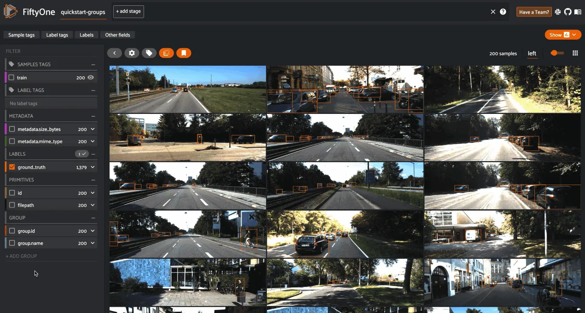
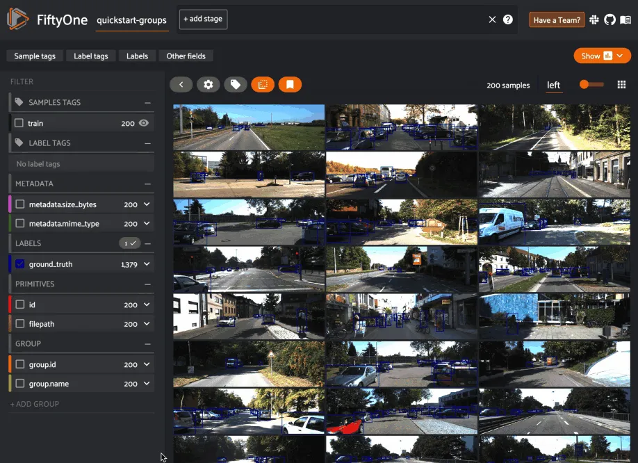
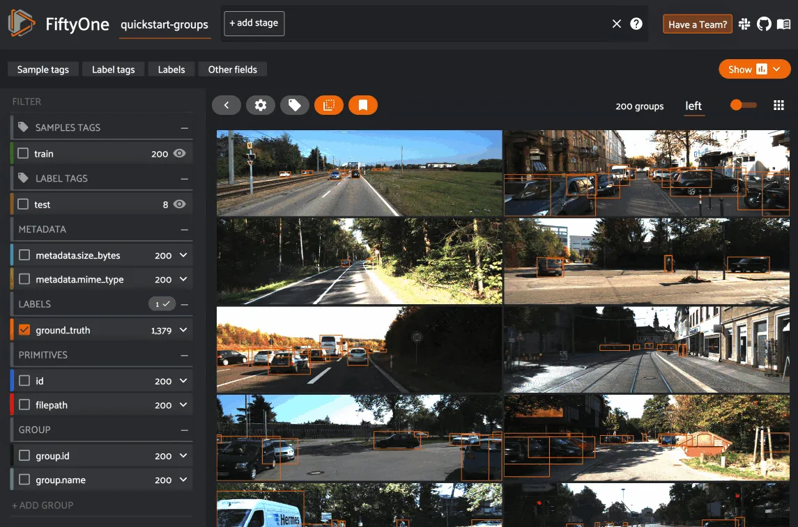

# Grouped datasets [¶](\#grouped-datasets "Permalink to this headline")

FiftyOne supports the creation of **grouped datasets**, which contain multiple
slices of samples of possibly different modalities (e.g.,
[image](using_datasets.md#dataset-media-type), [video](using_datasets.md#video-datasets), or
[3D scenes](using_datasets.md#d-datasets)) that are organized into groups.

Grouped datasets can be used to represent multiview scenes, where data for
multiple perspectives of the same scene can be stored, visualized, and queried
in ways that respect the relationships between the slices of data.



Note

Did you know? You can also create [dynamic group views](using_views.md#view-groups)
into your datasets based on a field or expression of interest.

## Overview [¶](\#overview "Permalink to this headline")

In this section, we’ll cover the basics of creating and working with grouped
datasets via Python.

Let’s start by creating some test data. We’ll use the quickstart dataset to
construct some mocked triples of left/center/right images:

```python
import fiftyone as fo
import fiftyone.utils.random as four
import fiftyone.zoo as foz

groups = ["left", "center", "right"]

d = foz.load_zoo_dataset("quickstart")
four.random_split(d, {g: 1 / len(groups) for g in groups})
filepaths = [d.match_tags(g).values("filepath") for g in groups]
filepaths = [dict(zip(groups, fps)) for fps in zip(*filepaths)]

print(filepaths[:2])

```

```python
[\
    {\
        'left': '~/fiftyone/quickstart/data/000880.jpg',\
        'center': '~/fiftyone/quickstart/data/002799.jpg',\
        'right': '~/fiftyone/quickstart/data/001599.jpg',\
    },\
    {\
        'left': '~/fiftyone/quickstart/data/003344.jpg',\
        'center': '~/fiftyone/quickstart/data/001057.jpg',\
        'right': '~/fiftyone/quickstart/data/001430.jpg',\
    },\
]

```

### Creating grouped datasets [¶](\#creating-grouped-datasets "Permalink to this headline")

To create a grouped dataset, simply use
[`add_group_field()`](../api/fiftyone.core.dataset.html#fiftyone.core.dataset.Dataset.add_group_field "fiftyone.core.dataset.Dataset.add_group_field") to
declare a [`Group`](../api/fiftyone.core.groups.html#fiftyone.core.groups.Group "fiftyone.core.groups.Group") field on your dataset before you add samples to it:

```python
dataset = fo.Dataset("groups-overview")
dataset.add_group_field("group", default="center")

```

The optional `default` parameter specifies the slice of samples that will be
returned via the API or visualized in the App’s grid view by default. If you
don’t specify a default, one will be inferred from the first sample you add to
the dataset.

Note

Datasets may contain only one [`Group`](../api/fiftyone.core.groups.html#fiftyone.core.groups.Group "fiftyone.core.groups.Group") field.

### Adding samples [¶](\#adding-samples "Permalink to this headline")

To populate a grouped dataset with samples, create a single [`Group`](../api/fiftyone.core.groups.html#fiftyone.core.groups.Group "fiftyone.core.groups.Group") instance
for each group of samples and use
[`Group.element()`](../api/fiftyone.core.groups.html#fiftyone.core.groups.Group.element "fiftyone.core.groups.Group.element") to generate values
for the group field of each [`Sample`](../api/fiftyone.core.sample.html#fiftyone.core.sample.Sample "fiftyone.core.sample.Sample") object in the group based on their slice’s
`name`. The [`Sample`](../api/fiftyone.core.sample.html#fiftyone.core.sample.Sample "fiftyone.core.sample.Sample") objects can then simply be added to the dataset as usual:

```python
samples = []
for fps in filepaths:
    group = fo.Group()
    for name, filepath in fps.items():
        sample = fo.Sample(filepath=filepath, group=group.element(name))
        samples.append(sample)

dataset.add_samples(samples)

print(dataset)

```

```python
Name:        groups-overview
Media type:  group
Group slice: center
Num groups:  66
Persistent:  False
Tags:        []
Sample fields:
    id:               fiftyone.core.fields.ObjectIdField
    filepath:         fiftyone.core.fields.StringField
    tags:             fiftyone.core.fields.ListField(fiftyone.core.fields.StringField)
    metadata:         fiftyone.core.fields.EmbeddedDocumentField(fiftyone.core.metadata.Metadata)
    created_at:       fiftyone.core.fields.DateTimeField
    last_modified_at: fiftyone.core.fields.DateTimeField
    group:            fiftyone.core.fields.EmbeddedDocumentField(fiftyone.core.groups.Group)

```

Note

Every sample in a grouped dataset must have its group field populated with
a [`Group`](../api/fiftyone.core.groups.html#fiftyone.core.groups.Group "fiftyone.core.groups.Group") element.

### Dataset properties [¶](\#dataset-properties "Permalink to this headline")

Grouped datasets have a `media_type` of `"group"`:

```python
print(dataset.media_type)
# group

```

The [`group_field`](../api/fiftyone.core.dataset.html#fiftyone.core.dataset.Dataset.group_field "fiftyone.core.dataset.Dataset.group_field") property
contains the name of the [`Group`](../api/fiftyone.core.groups.html#fiftyone.core.groups.Group "fiftyone.core.groups.Group") field storing the dataset’s group membership
information:

```python
print(dataset.group_field)
# group

```

The [`group_slices`](../api/fiftyone.core.dataset.html#fiftyone.core.dataset.Dataset.group_slices "fiftyone.core.dataset.Dataset.group_slices") property
contains the names of all group slices in the dataset:

```python
print(dataset.group_slices)
# ['left', 'center', 'right']

```

The [`group_media_types`](../api/fiftyone.core.dataset.html#fiftyone.core.dataset.Dataset.group_media_types "fiftyone.core.dataset.Dataset.group_media_types")
property is a dict mapping each slice name to its corresponding media type:

```python
print(dataset.group_media_types)
# {'left': 'image', 'center': 'image', 'right': 'image'}

```

The list of group slices and their corresponding media types are dynamically
expanded as you add samples to a grouped dataset.

Note

Grouped datasets may contain a mix of different modalities (e.g., images,
videos, and 3D scenes), but FiftyOne strictly enforces that each **slice**
of a grouped dataset must have a homogeneous media type.

For example, you would see an error if you tried to add a video sample to
the `left` slice of the above dataset, since it contains images.

The [`default_group_slice`](../api/fiftyone.core.dataset.html#fiftyone.core.dataset.Dataset.default_group_slice "fiftyone.core.dataset.Dataset.default_group_slice")
property stores the name of the default group slice:

```python
print(dataset.default_group_slice)
# center

```

The default group slice controls the slice of samples that will be returned via
the API—for example when you directly iterate over the dataset—or
visualized in the App’s grid view by default:

```python
print(dataset.first())

```

```python
<Sample: {
    'id': '62db2ce147e9efc3615cd450',
    'media_type': 'image',
    'filepath': '~/fiftyone/quickstart/data/003344.jpg',
    'tags': [],
    'metadata': None,
    'created_at': datetime.datetime(2024, 7, 22, 5, 16, 10, 701907),
    'last_modified_at': datetime.datetime(2024, 7, 22, 5, 16, 10, 701907),
    'group': <Group: {'id': '62db2ce147e9efc3615cd346', 'name': 'center'}>,
}>

```

You can change the _active group slice_ in your current session by setting the
[`group_slice`](../api/fiftyone.core.dataset.html#fiftyone.core.dataset.Dataset.group_slice "fiftyone.core.dataset.Dataset.group_slice") property:

```python
dataset.group_slice = "left"

print(dataset.first())

```

```python
<Sample: {
    'id': '62db2ce147e9efc3615cd44e',
    'media_type': 'image',
    'filepath': '~/fiftyone/quickstart/data/001599.jpg',
    'tags': [],
    'metadata': None,
    'created_at': datetime.datetime(2024, 7, 22, 5, 16, 10, 701907),
    'last_modified_at': datetime.datetime(2024, 7, 22, 5, 16, 10, 701907),
    'group': <Group: {'id': '62db2ce147e9efc3615cd346', 'name': 'left'}>,
}>

```

You can reset the active group slice to the default value by setting
[`group_slice`](../api/fiftyone.core.dataset.html#fiftyone.core.dataset.Dataset.group_slice "fiftyone.core.dataset.Dataset.group_slice") to `None`:

```python
# Resets to `default_group_slice`
dataset.group_slice = None

```

You can also change the default group slice at any time by setting the
[`default_group_slice`](../api/fiftyone.core.dataset.html#fiftyone.core.dataset.Dataset.default_group_slice "fiftyone.core.dataset.Dataset.default_group_slice")
property.

### Adding fields [¶](\#adding-fields "Permalink to this headline")

You are free to add arbitrary sample- and frame-level fields to your grouped
datasets just as you would with ungrouped datasets:

```python
sample = dataset.first()

sample["int_field"] = 51
sample["ground_truth"] = fo.Classification(label="outdoor")

sample.save()

```

You can also use methods like
[`set_values()`](../api/fiftyone.core.collections.html#fiftyone.core.collections.SampleCollection.set_values "fiftyone.core.collections.SampleCollection.set_values")
and [`save()`](../api/fiftyone.core.view.html#fiftyone.core.view.DatasetView.save "fiftyone.core.view.DatasetView.save") to perform bulk
edits to the [active slice](#groups-dataset-properties) of a grouped
dataset.

Note that all slices of a grouped dataset share the same schema, and hence
any fields you add to samples from a particular slice will be implicitly
declared on all samples from that slice and all other slices:

```python
print(dataset)

```

```python
Name:        groups-overview
Media type:  group
Group slice: center
Num groups:  66
Persistent:  False
Tags:        []
Sample fields:
    id:               fiftyone.core.fields.ObjectIdField
    filepath:         fiftyone.core.fields.StringField
    tags:             fiftyone.core.fields.ListField(fiftyone.core.fields.StringField)
    metadata:         fiftyone.core.fields.EmbeddedDocumentField(fiftyone.core.metadata.Metadata)
    created_at:       fiftyone.core.fields.DateTimeField
    last_modified_at: fiftyone.core.fields.DateTimeField
    group:            fiftyone.core.fields.EmbeddedDocumentField(fiftyone.core.groups.Group)
    int_field:        fiftyone.core.fields.IntField
    ground_truth:     fiftyone.core.fields.EmbeddedDocumentField(fiftyone.core.labels.Classification)

```

Note

Like ungrouped datasets, any fields in a grouped dataset’s schema that have
not been explicitly set on a [`Sample`](../api/fiftyone.core.sample.html#fiftyone.core.sample.Sample "fiftyone.core.sample.Sample") in the dataset will be `None`.

You can use methods like
[`clone_sample_field()`](../api/fiftyone.core.dataset.html#fiftyone.core.dataset.Dataset.clone_sample_field "fiftyone.core.dataset.Dataset.clone_sample_field"),
[`rename_sample_field()`](../api/fiftyone.core.dataset.html#fiftyone.core.dataset.Dataset.rename_sample_field "fiftyone.core.dataset.Dataset.rename_sample_field"),
[`delete_sample_field()`](../api/fiftyone.core.dataset.html#fiftyone.core.dataset.Dataset.delete_sample_field "fiftyone.core.dataset.Dataset.delete_sample_field"),
[`clear_sample_field()`](../api/fiftyone.core.dataset.html#fiftyone.core.dataset.Dataset.clear_sample_field "fiftyone.core.dataset.Dataset.clear_sample_field"),
and [`keep_fields()`](../api/fiftyone.core.view.html#fiftyone.core.view.DatasetView.keep_fields "fiftyone.core.view.DatasetView.keep_fields") to
perform batch edits to the fields across _all slices_ of a grouped dataset.

### Accessing samples [¶](\#accessing-samples "Permalink to this headline")

You can access a sample from any slice of grouped dataset via its ID or
filepath:

```python
# Grab a random sample across all slices
sample = dataset.select_group_slices().shuffle().first()

# Directly lookup same sample by ID
also_sample = dataset[sample.id]

```

In addition, you can also use
[`get_group()`](../api/fiftyone.core.dataset.html#fiftyone.core.dataset.Dataset.get_group "fiftyone.core.dataset.Dataset.get_group") to retrieve a
dict containing all samples in a group with a given ID:

```python
# Grab a random group ID
sample = dataset.shuffle().first()
group_id = sample.group.id

group = dataset.get_group(group_id)
print(group)

```

```python
{
    'left': <Sample: {
        'id': '62f810ba59e644568f229dac',
        'media_type': 'image',
        'filepath': '~/fiftyone/quickstart/data/001227.jpg',
        'tags': [],
        'metadata': None,
        'created_at': datetime.datetime(2024, 7, 22, 5, 16, 10, 701907),
        'last_modified_at': datetime.datetime(2024, 7, 22, 5, 16, 10, 701907),
        'group': <Group: {'id': '62f810ba59e644568f229c62', 'name': 'left'}>,
    }>,
    'center': <Sample: {
        'id': '62f810ba59e644568f229dad',
        'media_type': 'image',
        'filepath': '~/fiftyone/quickstart/data/004172.jpg',
        'tags': [],
        'metadata': None,
        'created_at': datetime.datetime(2024, 7, 22, 5, 16, 10, 701907),
        'last_modified_at': datetime.datetime(2024, 7, 22, 5, 16, 10, 701907),
        'group': <Group: {'id': '62f810ba59e644568f229c62', 'name': 'center'}>,
    }>,
    'right': <Sample: {
        'id': '62f810ba59e644568f229dae',
        'media_type': 'image',
        'filepath': '~/fiftyone/quickstart/data/000594.jpg',
        'tags': [],
        'metadata': None,
        'created_at': datetime.datetime(2024, 7, 22, 5, 16, 10, 701907),
        'last_modified_at': datetime.datetime(2024, 7, 22, 5, 16, 10, 701907),
        'group': <Group: {'id': '62f810ba59e644568f229c62', 'name': 'right'}>,
    }>,
}

```

### Deleting samples [¶](\#deleting-samples "Permalink to this headline")

Like ungrouped datasets, you can use
[`delete_samples()`](../api/fiftyone.core.dataset.html#fiftyone.core.dataset.Dataset.delete_samples "fiftyone.core.dataset.Dataset.delete_samples") to
delete individual sample(s) from a grouped dataset:

```python
# Grab a random sample across all slices
sample = dataset.select_group_slices().shuffle().first()

dataset.delete_samples(sample)

```

In addition, you can use
[`delete_groups()`](../api/fiftyone.core.dataset.html#fiftyone.core.dataset.Dataset.delete_groups "fiftyone.core.dataset.Dataset.delete_groups") to delete
all samples in a specific group(s):

```python
# Continuing from above, delete the rest of the group
group_id = sample.group.id

dataset.delete_groups(group_id)

```

You can also use methods like
[`clear()`](../api/fiftyone.core.view.html#fiftyone.core.view.DatasetView.clear "fiftyone.core.view.DatasetView.clear") and
[`keep()`](../api/fiftyone.core.view.html#fiftyone.core.view.DatasetView.keep "fiftyone.core.view.DatasetView.keep") to perform batch edits to
the groups in a grouped dataset.

### Iterating over grouped datasets [¶](\#iterating-over-grouped-datasets "Permalink to this headline")

When you directly iterate over a grouped dataset, you will get samples from the
dataset’s [active slice](#groups-dataset-properties):

```python
print(dataset.group_slice)
# center

for sample in dataset:
    pass

print(sample)

```

```python
<Sample: {
    'id': '62f10dbb68f4ed13eba7c5e7',
    'media_type': 'image',
    'filepath': '~/fiftyone/quickstart/data/001394.jpg',
    'tags': [],
    'metadata': None,
    'created_at': datetime.datetime(2024, 7, 22, 5, 16, 10, 701907),
    'last_modified_at': datetime.datetime(2024, 7, 22, 5, 16, 10, 701907),
    'group': <Group: {'id': '62f10dbb68f4ed13eba7c4a0', 'name': 'center'}>,
}>

```

Note

You can customize the dataset’s active slice by setting the
[`group_slice`](../api/fiftyone.core.dataset.html#fiftyone.core.dataset.Dataset.group_slice "fiftyone.core.dataset.Dataset.group_slice") property to
another slice name.

You can also use
[`iter_groups()`](../api/fiftyone.core.dataset.html#fiftyone.core.dataset.Dataset.iter_groups "fiftyone.core.dataset.Dataset.iter_groups") to iterate
over dicts containing all samples in each group:

```python
for group in dataset.iter_groups():
    pass

print(group)

```

```python
{
    'left': <Sample: {
        'id': '62f10dbb68f4ed13eba7c5e6',
        'media_type': 'image',
        'filepath': '~/fiftyone/quickstart/data/002538.jpg',
        'tags': [],
        'metadata': None,
        'created_at': datetime.datetime(2024, 7, 22, 5, 16, 10, 701907),
        'last_modified_at': datetime.datetime(2024, 7, 22, 5, 16, 10, 701907),
        'group': <Group: {'id': '62f10dbb68f4ed13eba7c4a0', 'name': 'left'}>,
    }>,
    'center': <Sample: {
        'id': '62f10dbb68f4ed13eba7c5e7',
        'media_type': 'image',
        'filepath': '~/fiftyone/quickstart/data/001394.jpg',
        'tags': [],
        'metadata': None,
        'created_at': datetime.datetime(2024, 7, 22, 5, 16, 10, 701907),
        'last_modified_at': datetime.datetime(2024, 7, 22, 5, 16, 10, 701907),
        'group': <Group: {'id': '62f10dbb68f4ed13eba7c4a0', 'name': 'center'}>,
    }>,
    'right': <Sample: {
        'id': '62f10dbb68f4ed13eba7c5e8',
        'media_type': 'image',
        'filepath': '~/fiftyone/quickstart/data/000020.jpg',
        'tags': [],
        'metadata': None,
        'created_at': datetime.datetime(2024, 7, 22, 5, 16, 10, 701907),
        'last_modified_at': datetime.datetime(2024, 7, 22, 5, 16, 10, 701907),
        'group': <Group: {'id': '62f10dbb68f4ed13eba7c4a0', 'name': 'right'}>,
    }>,
}

```

## Example datasets [¶](\#example-datasets "Permalink to this headline")

The [FiftyOne Dataset Zoo](../data/dataset_zoo/index.md#dataset-zoo) contains grouped datasets that
you can use out-of-the-box to test drive FiftyOne’s group-related features.

### Quickstart groups [¶](\#quickstart-groups "Permalink to this headline")

The fastest way to get started is by loading the
[quickstart-groups](../data/dataset_zoo/datasets.md#dataset-zoo-quickstart-groups) dataset, which
consists of 200 scenes from the train split of the KITTI dataset, each
containing left camera, right camera, point cloud, and 2D/3D object annotation
data:

```python
import fiftyone as fo
import fiftyone.zoo as foz

dataset = foz.load_zoo_dataset("quickstart-groups")

print(dataset.group_media_types)
# {'left': 'image', 'right': 'image', 'pcd': '3d'}

print(dataset)

```

```python
Name:        quickstart-groups
Media type:  group
Group slice: left
Num groups:  200
Persistent:  False
Tags:        []
Sample fields:
    id:               fiftyone.core.fields.ObjectIdField
    filepath:         fiftyone.core.fields.StringField
    tags:             fiftyone.core.fields.ListField(fiftyone.core.fields.StringField)
    metadata:         fiftyone.core.fields.EmbeddedDocumentField(fiftyone.core.metadata.Metadata)
    created_at:       fiftyone.core.fields.DateTimeField
    last_modified_at: fiftyone.core.fields.DateTimeField
    group:            fiftyone.core.fields.EmbeddedDocumentField(fiftyone.core.groups.Group)
    ground_truth:     fiftyone.core.fields.EmbeddedDocumentField(fiftyone.core.labels.Detections)

```

### KITTI multiview [¶](\#kitti-multiview "Permalink to this headline")

You can also load the full [kitti-multiview](../data/dataset_zoo/datasets.md#dataset-zoo-kitti-multiview)
dataset:

```python
import fiftyone as fo
import fiftyone.zoo as foz

dataset = foz.load_zoo_dataset("kitti-multiview", split="train")

```


### Toy dataset [¶](\#toy-dataset "Permalink to this headline")

The snippet below generates a toy dataset containing 3D cuboids filled with
points that demonstrates how
[3D detections are represented](using_datasets.md#d-detections):

```python
import fiftyone as fo
import numpy as np
import open3d as o3d

detections = []
point_cloud = []

for _ in range(10):
    dimensions = np.random.uniform([1, 1, 1], [3, 3, 3])
    location = np.random.uniform([-10, -10, 0], [10, 10, 10])
    rotation = np.random.uniform(-np.pi, np.pi, size=3)

    detection = fo.Detection(
        dimensions=list(dimensions),
        location=list(location),
        rotation=list(rotation),
    )
    detections.append(detection)

    R = o3d.geometry.get_rotation_matrix_from_xyz(rotation)
    points = np.random.uniform(-dimensions / 2, dimensions / 2, size=(1000, 3))
    points = points @ R.T + location[np.newaxis, :]
    point_cloud.extend(points)

pc = o3d.geometry.PointCloud()
pc.points = o3d.utility.Vector3dVector(np.array(point_cloud))
o3d.io.write_point_cloud("/tmp/toy.pcd", pc)

scene = fo.Scene()
scene.add(fo.PointCloud("point cloud", "/tmp/toy.pcd"))
scene.write("/tmp/toy.fo3d")

group = fo.Group()
samples = [\
    fo.Sample(\
        filepath="/tmp/toy.png",  # non-existent\
        group=group.element("image"),\
    ),\
    fo.Sample(\
        filepath="/tmp/toy.fo3d",\
        group=group.element("pcd"),\
        detections=fo.Detections(detections=detections),\
    )\
]

dataset = fo.Dataset()
dataset.add_samples(samples)

dataset.app_config.plugins["3d"] = {
    "defaultCameraPosition": {"x": 0, "y": 0, "z": 20}
}
dataset.save()

session = fo.launch_app(dataset)

```


## Grouped views [¶](\#grouped-views "Permalink to this headline")

You have the entire [dataset view language](using_views.md#using-views) at your disposal
to sort, slice, and search your grouped datasets!

### Basics [¶](\#basics "Permalink to this headline")

You can perform simple operations like shuffling and limiting grouped datasets:

```python
# Select 10 random groups from the dataset
view = dataset.shuffle().limit(10)

print(view)

```

```python
Dataset:     groups-overview
Media type:  group
Group slice: center
Num groups:  10
Group fields:
    id:               fiftyone.core.fields.ObjectIdField
    filepath:         fiftyone.core.fields.StringField
    tags:             fiftyone.core.fields.ListField(fiftyone.core.fields.StringField)
    metadata:         fiftyone.core.fields.EmbeddedDocumentField(fiftyone.core.metadata.Metadata)
    created_at:       fiftyone.core.fields.DateTimeField
    last_modified_at: fiftyone.core.fields.DateTimeField
    group:            fiftyone.core.fields.EmbeddedDocumentField(fiftyone.core.groups.Group)
View stages:
    1. Shuffle(seed=None)
    2. Limit(limit=10)

```

As you can see, the [basic properties](#groups-dataset-properties) of
grouped datasets carry over to views into them:

```python
print(view.media_type)
# group

print(view.group_slice)
# center

print(view.group_media_types)
# {'left': 'image', 'center': 'image', 'right': 'image'}

```

You can also perform all the usual operations on grouped views, such as
[accessing samples](#groups-accessing-samples), and
[iterating over them](#groups-iteration):

```python
for group in view.iter_groups():
    pass

sample = view.last()
print(sample)

group_id = sample.group.id
group = view.get_group(group_id)
print(group)

```

### Filtering [¶](\#filtering "Permalink to this headline")

You can write views that [match and filter](using_views.md#view-filtering) the contents
of grouped datasets:

```python
import fiftyone as fo
import fiftyone.zoo as foz
from fiftyone import ViewField as F

dataset = foz.load_zoo_dataset("quickstart-groups")

print(dataset.group_slice)
# left

# Filters based on the content in the 'left' slice
view = (
    dataset
    .match_tags("train")
    .filter_labels("ground_truth", F("label") == "Pedestrian")
)

```

Remember that, just as when [iterating over](#groups-iteration) grouped
datasets, any filtering operations will only be applied to the
[active slice](#groups-dataset-properties).

However, you can write views that reference specific slice(s) of a grouped
collection via the special `"groups.<slice>.field.name"` syntax:

```python
from fiftyone import ViewField as F

dataset.compute_metadata()

# Match groups whose `left` image has a height of at least 640 pixels and
# whose `right` image has a height of at most 480 pixels
view = dataset.match(
    (F("groups.left.metadata.height") >= 640)
    & (F("groups.right.metadata.height") <= 480)
)

print(view)

```

### Selecting groups [¶](\#selecting-groups "Permalink to this headline")

You can use
[`select_groups()`](../api/fiftyone.core.collections.html#fiftyone.core.collections.SampleCollection.select_groups "fiftyone.core.collections.SampleCollection.select_groups")
to create a view that contains certain group(s) of interest by their IDs:

```python
# Select two groups at random
view = dataset.take(2)

group_ids = view.values("group.id")

# Select the same groups (default: unordered)
same_groups = dataset.select_groups(group_ids)
assert set(view.values("id")) == set(same_groups.values("id"))

# Select the same groups (ordered)
same_order = dataset.select_groups(group_ids, ordered=True)
assert view.values("id") == same_order.values("id")

```

### Excluding groups [¶](\#excluding-groups "Permalink to this headline")

You can use
[`exclude_groups()`](../api/fiftyone.core.collections.html#fiftyone.core.collections.SampleCollection.exclude_groups "fiftyone.core.collections.SampleCollection.exclude_groups")
to create a view that excludes certain group(s) of interest by their IDs:

```python
# Exclude two groups at random
view = dataset.take(2)

group_ids = view.values("group.id")
other_groups = dataset.exclude_groups(group_ids)
assert len(set(group_ids) & set(other_groups.values("group.id"))) == 0

```

### Selecting slices [¶](\#selecting-slices "Permalink to this headline")

You can use
[`select_group_slices()`](../api/fiftyone.core.collections.html#fiftyone.core.collections.SampleCollection.select_group_slices "fiftyone.core.collections.SampleCollection.select_group_slices")
to create _non-grouped views_ that contain one or more slices of data from a
grouped dataset.

For example, you can create an image view that contains only the left camera
images from the grouped dataset:

```python
left_view = dataset.select_group_slices("left")
print(left_view)

```

```python
Dataset:     groups-overview
Media type:  image
Num samples: 108
Sample fields:
    id:               fiftyone.core.fields.ObjectIdField
    filepath:         fiftyone.core.fields.StringField
    tags:             fiftyone.core.fields.ListField(fiftyone.core.fields.StringField)
    metadata:         fiftyone.core.fields.EmbeddedDocumentField(fiftyone.core.metadata.Metadata)
    created_at:       fiftyone.core.fields.DateTimeField
    last_modified_at: fiftyone.core.fields.DateTimeField
    group:            fiftyone.core.fields.EmbeddedDocumentField(fiftyone.core.groups.Group)
View stages:
    1. SelectGroupSlices(slices='left')

```

or you could create an image collection containing the left and right camera
images:

```python
lr_view = dataset.select_group_slices(["left", "right"])
print(lr_view)

```

```python
Dataset:     groups-overview
Media type:  image
Num samples: 216
Sample fields:
    id:               fiftyone.core.fields.ObjectIdField
    filepath:         fiftyone.core.fields.StringField
    tags:             fiftyone.core.fields.ListField(fiftyone.core.fields.StringField)
    metadata:         fiftyone.core.fields.EmbeddedDocumentField(fiftyone.core.metadata.Metadata)
    created_at:       fiftyone.core.fields.DateTimeField
    last_modified_at: fiftyone.core.fields.DateTimeField
    group:            fiftyone.core.fields.EmbeddedDocumentField(fiftyone.core.groups.Group)
View stages:
    1. SelectGroupSlices(slices=['left', 'right'])

```

Note that the [`media_type`](../api/fiftyone.core.view.html#fiftyone.core.view.DatasetView.media_type "fiftyone.core.view.DatasetView.media_type") of
the above collections are `image`, not `group`. This means you can perform any
valid operation for image collections to these views, without worrying about
the fact that their data is sourced from a grouped dataset!

```python
image_view = dataset.shuffle().limit(10).select_group_slices("left")

another_view = image_view.match(F("metadata.width") >= 640)

# Add fields/tags, run evaluation, export, etc

```

Also note that any filtering that you apply prior to a
[`select_group_slices()`](../api/fiftyone.core.collections.html#fiftyone.core.collections.SampleCollection.select_group_slices "fiftyone.core.collections.SampleCollection.select_group_slices")
stage in a view is **not** automatically reflected by the output view, as the
stage looks up unfiltered slice data from the source collection:

```python
# Filter the active slice to locate groups of interest
match_view = dataset.filter_labels(...).match(...)

# Lookup all image slices for the matching groups
# This view contains *unfiltered* image slices
images_view = match_view.select_group_slices(media_type="image")

```

Instead, you can apply the same (or different) filtering _after_ the
[`select_group_slices()`](../api/fiftyone.core.collections.html#fiftyone.core.collections.SampleCollection.select_group_slices "fiftyone.core.collections.SampleCollection.select_group_slices")
stage:

```python
# Now apply filters to the flattened collection
match_images_view = images_view.filter_labels(...).match(...)

```

## Grouped aggregations [¶](\#grouped-aggregations "Permalink to this headline")

You can use the entire [aggregations framework](using_aggregations.md#using-aggregations) to
efficiently compute statistics on grouped datasets.

Remember that, just as when [iterating over](#groups-iteration) or
[writing views](#groups-views) into grouped datasets, aggregations will
only include samples from the [active slice](#groups-dataset-properties):

```python
import fiftyone as fo
import fiftyone.zoo as foz
from fiftyone import ViewField as F

dataset = foz.load_zoo_dataset("quickstart-groups")

# Expression that computes the area of a bounding box, in pixels
bbox_width = F("bounding_box")[2] * F("$metadata.width")
bbox_height = F("bounding_box")[3] * F("$metadata.height")
bbox_area = bbox_width * bbox_height

print(dataset.group_slice)
# left

print(dataset.count("ground_truth.detections"))
# 1438

print(dataset.mean("ground_truth.detections[]", expr=bbox_area))
# 8878.752327468706

```

You can customize the dataset’s active slice by setting the
[`group_slice`](../api/fiftyone.core.dataset.html#fiftyone.core.dataset.Dataset.group_slice "fiftyone.core.dataset.Dataset.group_slice") property to
another slice name:

```python
dataset.group_slice = "right"

print(dataset.count("ground_truth.detections"))
# 1438

print(dataset.bounds("ground_truth.detections[]", expr=bbox_area))
# 9457.586300995526

```

As usual, you can combine views and aggregations to refine your statistics to
any subset of the dataset:

```python
print(dataset.count_values("ground_truth.detections.label"))
# {'Pedestrian': 128, 'Car': 793, ...}

view1 = dataset.take(5)
print(view1.count_values("ground_truth.detections.label"))
# {'Pedestrian': 1, 'Car': 23, ...}

view2 = dataset.filter_labels("ground_truth", F("label") == "Pedestrian")
print(view2.count_values("ground_truth.detections.label"))
# {'Pedestrian': 128}

```

In particular, if you would like to compute statistics across multiple group
slices, you can [select them](#groups-selecting-slices)!

```python
print(dataset.count())  # 200
print(dataset.count("ground_truth.detections"))  # 1438

view3 = dataset.select_group_slices(["left", "right"])

print(view3.count())  # 400
print(view3.count("ground_truth.detections"))  # 2876

```

## Groups in the App [¶](\#groups-in-the-app "Permalink to this headline")

When you load a grouped dataset or view in [the App](app.md#fiftyone-app),
you’ll see the samples from the collection’s
[default group slice](#groups-dataset-properties) in the grid view by
default.

```python
import fiftyone as fo
import fiftyone.zoo as foz

dataset = foz.load_zoo_dataset("quickstart-groups")

session = fo.launch_app(dataset)

```

You can use the selector shown below to change which slice you are viewing:



Note

In order to view 3D scenes in the grid view, you must populate
[orthographic projection images](using_datasets.md#orthographic-projection-images).

When you open the expanded modal with a grouped dataset or view loaded in the
App, you’ll have access to all samples in the current group.

If the group contains image/video slices, the lefthand side of the modal will
contain a scrollable carousel that you can use to choose which sample to load
in the maximized image/video visualizer below.

If the group contains 3D slices, the righthand side of the modal will contain a
[3D visualizer](app.md#app-3d-visualizer):


By default, the filters sidebar shows statistics for **only** the group slice
that currently has focus in the grid/modal. In the grid view, the active slice
is denoted by the selector in the upper-right corner of the grid, and in the
modal, the active sample is denoted by the `pin icon` in the upper-left corner.

However, you can opt to show statistics across all slices of a grouped dataset
by selecting `group` mode under the App’s settings menu:



You can also use the App’s [dynamic groups](app.md#app-dynamic-groups) feature
to view _groups of groups_ organized by a field of your choice.

For example, if you have a grouped dataset whose group slices contain different
sensor modalities for each `frame_number` of a scene with a given `scene_id`,
you can use the dynamic grouping action to playback scenes in sequential order:


Note

Did you know? You can also create [dynamic group views](using_views.md#view-groups)
into your grouped datasets via Python.

## Importing groups [¶](\#importing-groups "Permalink to this headline")

The simplest way to import grouped datasets is to
[write a Python loop](#groups-adding-samples):

```python
samples = []
for fps in filepaths:
    group = fo.Group()
    for name, filepath in fps.items():
        sample = fo.Sample(filepath=filepath, group=group.element(name))
        samples.append(sample)

dataset.add_samples(samples)

print(dataset)

```

Remember that each group is represented by a [`Group`](../api/fiftyone.core.groups.html#fiftyone.core.groups.Group "fiftyone.core.groups.Group") instance, and each sample
in a group is denoted by its slice `name` using
[`Group.element()`](../api/fiftyone.core.groups.html#fiftyone.core.groups.Group.element "fiftyone.core.groups.Group.element"). The [`Sample`](../api/fiftyone.core.sample.html#fiftyone.core.sample.Sample "fiftyone.core.sample.Sample")
objects can then simply be added to the dataset as usual.

Alternatively, you can
[write your own importer](dataset_creation/datasets.md#writing-a-custom-dataset-importer) and then
import grouped datasets in your custom format using the syntax below:

```python
# Create an instance of your custom dataset importer
importer = CustomGroupDatasetImporter(...)

dataset = fo.Dataset.from_importer(importer)

```

## Exporting groups [¶](\#exporting-groups "Permalink to this headline")

If you need to export an entire grouped dataset (or a view into it), you can
use [FiftyOneDataset format](export_datasets.md#fiftyonedataset-export):

```python
view = dataset.shuffle().limit(10)

view.export(
    export_dir="/tmp/groups",
    dataset_type=fo.types.FiftyOneDataset,
)

dataset2 = fo.Dataset.from_dir(
    dataset_dir="/tmp/groups",
    dataset_type=fo.types.FiftyOneDataset,
)

```

You can also [select specific slice(s)](#groups-selecting-slices) and then
export the resulting ungrouped collection in
[all the usual ways](export_datasets.md#exporting-datasets):

```python
left_view = dataset.shuffle().limit(10).select_group_slices("left")

left_view.export(
    export_dir="/tmp/groups-left",
    dataset_type=fo.types.ImageDirectory,
)

```

Alternatively, you can
[write your own exporter](export_datasets.md#writing-a-custom-dataset-exporter) and then
export grouped datasets in your custom format using the syntax below:

```python
# Create an instance of your custom dataset exporter
exporter = CustomGroupDatasetExporter(...)

dataset_or_view.export(dataset_exporter=exporter, ...)

```
