# Interactive Plots [¶](\#interactive-plots "Permalink to this headline")

FiftyOne provides a powerful [`fiftyone.core.plots`](../api/fiftyone.core.plots.html#module-fiftyone.core.plots "fiftyone.core.plots") framework that contains
a variety of interactive plotting methods that enable you to visualize your
datasets and uncover patterns that are not apparent from inspecting either the
[raw media files](app.md#fiftyone-app) or
[aggregate statistics](using_aggregations.md#using-aggregations).

With FiftyOne, you can visualize geolocated data on maps, generate interactive
evaluation reports such as confusion matrices and PR curves, create dashboards
of custom statistics, and even generate low-dimensional representations of your
data that you can use to identify data clusters corresponding to model failure
modes, annotation gaps, and more.

What do we mean by **interactive plots**? First, FiftyOne plots are
[powered by Plotly](https://plotly.com/python), which means they are
responsive JavaScript-based plots that can be zoomed, panned, and lasso-ed.
Second, FiftyOne plots can be linked to the [FiftyOne App](app.md#fiftyone-app),
so that selecting points in a plot will automatically load the corresponding
samples/labels in the App (and vice versa) for you to visualize! Linking plots
to their source media is a paradigm that should play a critical part in any
visual dataset analysis pipeline.

The builtin plots provided by FiftyOne are chosen to help you analyze and
improve the quality of your datasets and models, with minimal customization
required on your part to get started. At the same time, data/model
interpretability is not a narrowly-defined space that can be fully automated.
That’s why FiftyOne’s plotting framework is highly customizable and extensible,
all by writing pure Python (no JavaScript knowledge required).

Note

Check out the [tutorials page](../tutorials/index.md#tutorials) for in-depth walkthroughs
that apply the available interactive plotting methods to perform
evaluation, identify model failure modes, recommend new samples for
annotation, and more!

## Overview [¶](\#overview "Permalink to this headline")

All [`Session`](../api/fiftyone.core.session.html#fiftyone.core.session.Session "fiftyone.core.session.Session") instances provide a
[`plots attribute`](../api/fiftyone.core.session.html#fiftyone.core.session.Session.plots "fiftyone.core.session.Session.plots") attribute that
you can use to attach [`ResponsivePlot`](../api/fiftyone.core.plots.base.html#fiftyone.core.plots.base.ResponsivePlot "fiftyone.core.plots.base.ResponsivePlot") instances to the FiftyOne App.

When [`ResponsivePlot`](../api/fiftyone.core.plots.base.html#fiftyone.core.plots.base.ResponsivePlot "fiftyone.core.plots.base.ResponsivePlot") instances are attached to a [`Session`](../api/fiftyone.core.session.html#fiftyone.core.session.Session "fiftyone.core.session.Session"), they are
automatically updated whenever
[`session.view`](../api/fiftyone.core.session.html#fiftyone.core.session.Session.view "fiftyone.core.session.Session.view") changes for any
reason, whether you modify your view in the App, or programmatically change it
by setting [`session.view`](../api/fiftyone.core.session.html#fiftyone.core.session.Session.view "fiftyone.core.session.Session.view"), or if
multiple plots are connected and another plot triggers a [`Session`](../api/fiftyone.core.session.html#fiftyone.core.session.Session "fiftyone.core.session.Session") update!

Note

Interactive plots are currently only supported in Jupyter notebooks. In the
meantime, you can still use FiftyOne’s plotting features in other
environments, but you must manually call
[`plot.show()`](../api/fiftyone.core.plots.base.html#fiftyone.core.plots.base.Plot.show "fiftyone.core.plots.base.Plot.show") to update the
state of a plot to match the state of a connected [`Session`](../api/fiftyone.core.session.html#fiftyone.core.session.Session "fiftyone.core.session.Session"), and any
callbacks that would normally be triggered in response to interacting with
a plot will not be triggered.

See [this section](#working-in-notebooks) for more information.

The two main classes of [`ResponsivePlot`](../api/fiftyone.core.plots.base.html#fiftyone.core.plots.base.ResponsivePlot "fiftyone.core.plots.base.ResponsivePlot") are explained next.

### Interactive plots [¶](\#id3 "Permalink to this headline")

[`InteractivePlot`](../api/fiftyone.core.plots.base.html#fiftyone.core.plots.base.InteractivePlot "fiftyone.core.plots.base.InteractivePlot") is a class of plots that are bidirectionally linked to a
[`Session`](../api/fiftyone.core.session.html#fiftyone.core.session.Session "fiftyone.core.session.Session") via the IDs of either samples or individual labels in the dataset.
When the user performs a selection in the plot, the
[`session.view`](../api/fiftyone.core.session.html#fiftyone.core.session.Session.view "fiftyone.core.session.Session.view") is automatically
updated to select the corresponding samples/labels, and, conversely, when
[`session.view`](../api/fiftyone.core.session.html#fiftyone.core.session.Session.view "fiftyone.core.session.Session.view") changes, the contents
of the current view is automatically selected in the plot.

Examples of [`InteractivePlot`](../api/fiftyone.core.plots.base.html#fiftyone.core.plots.base.InteractivePlot "fiftyone.core.plots.base.InteractivePlot") types include
[scatterplots](#embeddings-plots),
[location scatterplots](#geolocation-plots), and
[interactive heatmaps](#confusion-matrix-plots).

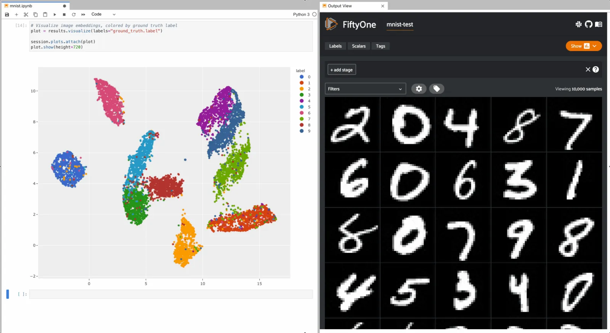

### View plots [¶](\#view-plots "Permalink to this headline")

[`ViewPlot`](../api/fiftyone.core.plots.base.html#fiftyone.core.plots.base.ViewPlot "fiftyone.core.plots.base.ViewPlot") is a class of plots whose state is automatically updated whenever
the current [`session.view`](../api/fiftyone.core.session.html#fiftyone.core.session.Session.view "fiftyone.core.session.Session.view") changes.
View plots can be used to construct [dynamic dashboards](#id11) that
update to reflect the contents of your current view.

More view plot types are being continually added to the library over time.
Current varieties include [`CategoricalHistogram`](../api/fiftyone.core.plots.views.html#fiftyone.core.plots.views.CategoricalHistogram "fiftyone.core.plots.views.CategoricalHistogram"), [`NumericalHistogram`](../api/fiftyone.core.plots.views.html#fiftyone.core.plots.views.NumericalHistogram "fiftyone.core.plots.views.NumericalHistogram"), and
[`ViewGrid`](../api/fiftyone.core.plots.views.html#fiftyone.core.plots.views.ViewGrid "fiftyone.core.plots.views.ViewGrid").

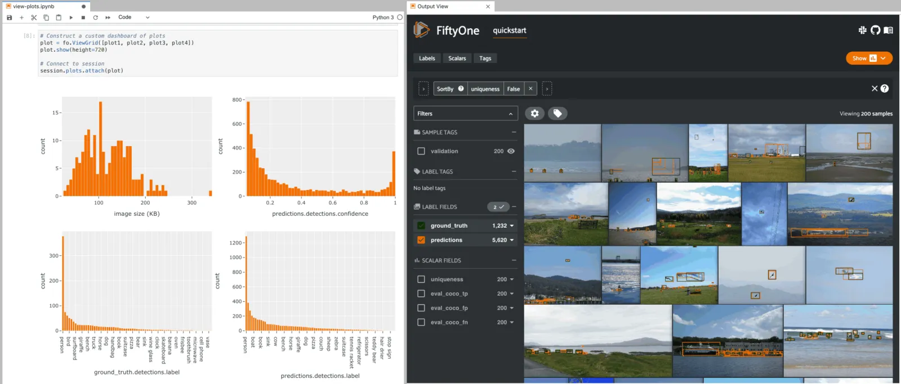

## Working in notebooks [¶](\#working-in-notebooks "Permalink to this headline")

The recommended way to work with FiftyOne’s interactive plots is in
[Jupyter notebooks](https://jupyter.org) or
[JupyterLab](https://jupyterlab.readthedocs.io/en/stable).

In these environments, you can leverage the full power of plots by
[attaching them to the FiftyOne App](#attaching-plots) and bidirectionally
interacting with the plots and the App to identify interesting subsets of your
data.

Note

Support for interactive plots in non-notebook contexts and in
[Google Colab](https://colab.research.google.com) and
[Databricks](https://docs.databricks.com/en/notebooks/index.html)
is coming soon! In the meantime, you can still use FiftyOne’s plotting
features in these environments, but you must manually call
[`plot.show()`](../api/fiftyone.core.plots.base.html#fiftyone.core.plots.base.Plot.show "fiftyone.core.plots.base.Plot.show") to update the
state of a plot to match the state of a connected [`Session`](../api/fiftyone.core.session.html#fiftyone.core.session.Session "fiftyone.core.session.Session"), and any
callbacks that would normally be triggered in response to interacting with
a plot will not be triggered.

You can get setup to work in a Jupyter environment by running the commands
below for your environment:

If you wish to use the `matplotlib` backend for any interactive plots, refer
to [this section](#matplotlib-in-notebooks) for setup instructions.

## Visualizing embeddings [¶](\#visualizing-embeddings "Permalink to this headline")

The [FiftyOne Brain](brain.md#fiftyone-brain) provides a powerful
`compute_visualization()` method
that can be used to generate low-dimensional representations of the
samples/object patches in a dataset that can be visualized using interactive
FiftyOne plots.

To learn more about the available embedding methods, dimensionality reduction
techniques, and their applications to dataset analysis, refer to
[this page](brain.md#brain-embeddings-visualization). In this section, we’ll just
cover the basic mechanics of creating scatterplots and interacting with them.

Note

The visualizations in this section are rendered under the hood via the
[`scatterplot()`](../api/fiftyone.core.plots.base.html#fiftyone.core.plots.base.scatterplot "fiftyone.core.plots.base.scatterplot") method, which
you can directly use to generate interactive plots for arbitrary 2D or 3D
representations of your data.

### Standalone plots [¶](\#standalone-plots "Permalink to this headline")

Let’s use
`compute_visualization()` to
generate a 2D visualization of the images in the test split of the
[MNIST dataset](../data/dataset_zoo/datasets.md#dataset-zoo-mnist) and then visualize it using the
`results.visualize()`
method of the returned results object, where each point is colored by its
ground truth label:

```python
import cv2
import numpy as np

import fiftyone as fo
import fiftyone.brain as fob
import fiftyone.zoo as foz

dataset = foz.load_zoo_dataset("mnist", split="test")

# Construct a `num_samples x num_pixels` array of images
images = np.array([\
    cv2.imread(f, cv2.IMREAD_UNCHANGED).ravel()\
    for f in dataset.values("filepath")\
])

# Compute 2D embeddings
results = fob.compute_visualization(dataset, embeddings=images, seed=51)

# Visualize embeddings, colored by ground truth label
plot = results.visualize(labels="ground_truth.label")
plot.show(height=720)

```

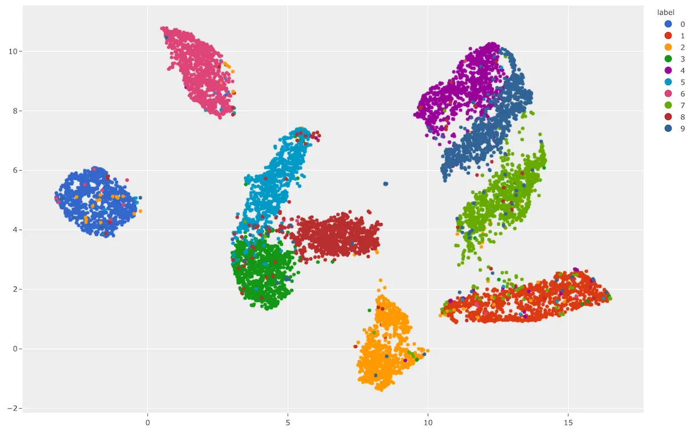

As you can see, the 2D embeddings are naturally clustered according to their
ground truth label!

### Interactive plots [¶](\#id5 "Permalink to this headline")

The full power of
`compute_visualization()` comes
when you associate the scatterpoints with the samples or objects in a [`Dataset`](../api/fiftyone.core.dataset.html#fiftyone.core.dataset.Dataset "fiftyone.core.dataset.Dataset")
and then attach it to a [`Session`](../api/fiftyone.core.session.html#fiftyone.core.session.Session "fiftyone.core.session.Session").

The example below demonstrates setting up an interactive scatterplot for the
test split of the [MNIST dataset](../data/dataset_zoo/datasets.md#dataset-zoo-mnist) that is
[attached to the App](#attaching-plots).

In this setup, the scatterplot renders each sample using its corresponding 2D
embedding generated by
`compute_visualization()`, colored
by the sample’s ground truth label.

Since the `labels` argument to
`results.visualize()`
is categorical, each class is rendered as its own trace and you can click on
the legend entries to show/hide individual classes, or double-click to
show/hide all other classes.

When points are lasso-ed in the plot, the corresponding
samples are automatically selected in the session’s current
[`view`](../api/fiftyone.core.session.html#fiftyone.core.session.Session.view "fiftyone.core.session.Session.view"). Likewise, whenever you
modify the session’s view, either in the App or by programmatically setting
[`session.view`](../api/fiftyone.core.session.html#fiftyone.core.session.Session.view "fiftyone.core.session.Session.view"), the corresponding
locations will be selected in the scatterplot.

Each block in the example code below denotes a separate cell in a Jupyter
notebook:

```python
import cv2
import numpy as np

import fiftyone as fo
import fiftyone.brain as fob
import fiftyone.zoo as foz

dataset = foz.load_zoo_dataset("mnist", split="test")

# Construct a `num_samples x num_pixels` array of images
images = np.array([\
    cv2.imread(f, cv2.IMREAD_UNCHANGED).ravel()\
    for f in dataset.values("filepath")\
])

# Compute 2D embeddings
results = fob.compute_visualization(dataset, embeddings=images, seed=51)

session = fo.launch_app(dataset)

```

```python
# Visualize embeddings, colored by ground truth label
plot = results.visualize(labels="ground_truth.label")
plot.show(height=720)

session.plots.attach(plot)

```

To give a taste of the possible interactions, let’s hide all zero digit images
and select the other digits near the zero cluster; this isolates the non-zero
digit images in the App that are likely to be confused as zeros:


Alternatively, let’s hide all classes except the zero digits, and then select
the zero digits that are _not_ in the zero cluster; this isolates the zero
digit images in the App that are likely to be confused as other digits:

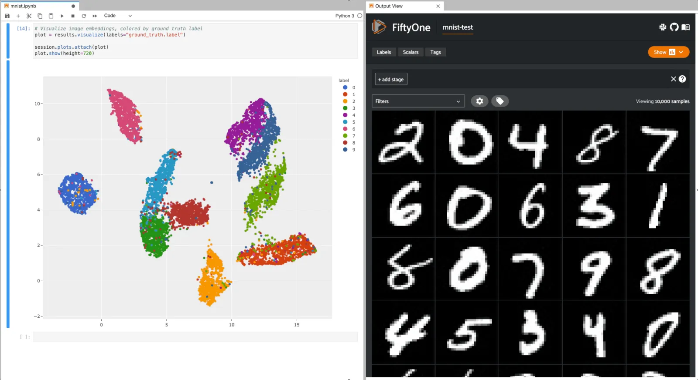

## Geolocation plots [¶](\#geolocation-plots "Permalink to this headline")

You can use
[`location_scatterplot()`](../api/fiftyone.core.plots.base.html#fiftyone.core.plots.base.location_scatterplot "fiftyone.core.plots.base.location_scatterplot")
to generate interactive plots of datasets with geolocation data.

You can store arbitrary location data in
[GeoJSON](https://en.wikipedia.org/wiki/GeoJSON) format on your datasets
using the [`GeoLocation`](../api/fiftyone.core.labels.html#fiftyone.core.labels.GeoLocation "fiftyone.core.labels.GeoLocation") and [`GeoLocations`](../api/fiftyone.core.labels.html#fiftyone.core.labels.GeoLocations "fiftyone.core.labels.GeoLocations") label types. See
[this section](using_datasets.md#geolocation) for more information.

The
[`location_scatterplot()`](../api/fiftyone.core.plots.base.html#fiftyone.core.plots.base.location_scatterplot "fiftyone.core.plots.base.location_scatterplot")
method only supports simple `[longitude, latitude]` coordinate points, which
can be stored in the `point` attribute of a [`GeoLocation`](../api/fiftyone.core.labels.html#fiftyone.core.labels.GeoLocation "fiftyone.core.labels.GeoLocation") field.

Note

Did you know? You can create
[location-based views](using_views.md#geolocation-views) that filter your data by
their location!

### Standalone plots [¶](\#id7 "Permalink to this headline")

In the simplest case, you can use this method to generate a location
scatterplot for a list of `[longitude, latitude]` coordinates, using the
optional `labels` and `sizes` parameters to control the color and sizes
of each point, respectively.

The example below demonstrates this usage using the
[quickstart-geo](../data/dataset_zoo/datasets.md#dataset-zoo-quickstart-geo) dataset from the zoo, which
contains [`GeoLocation`](../api/fiftyone.core.labels.html#fiftyone.core.labels.GeoLocation "fiftyone.core.labels.GeoLocation") data in its `location` field:

```python
import fiftyone as fo
import fiftyone.brain as fob
import fiftyone.zoo as foz
from fiftyone import ViewField as F

dataset = foz.load_zoo_dataset("quickstart-geo")
fob.compute_uniqueness(dataset)

# A list of ``[longitude, latitude]`` coordinates
locations = dataset.values("location.point.coordinates")

# Scalar `uniqueness` values for each sample
uniqueness = dataset.values("uniqueness")

# The number of ground truth objects in each sample
num_objects = dataset.values(F("ground_truth.detections").length())

# Create scatterplot
plot = fo.location_scatterplot(
    locations=locations,
    labels=uniqueness,      # color points by their `uniqueness` values
    sizes=num_objects,      # scale point sizes by number of objects
    labels_title="uniqueness",
    sizes_title="objects",
)
plot.show()

```


You can also change the style to `style="density"` in order to view the data
as a density plot:

```python
# Create density plot
plot = fo.location_scatterplot(
    locations=locations,
    labels=uniqueness,      # color points by their `uniqueness` values
    sizes=num_objects,      # scale influence by number of objects
    style="density",
    radius=10,
)
plot.show()

```

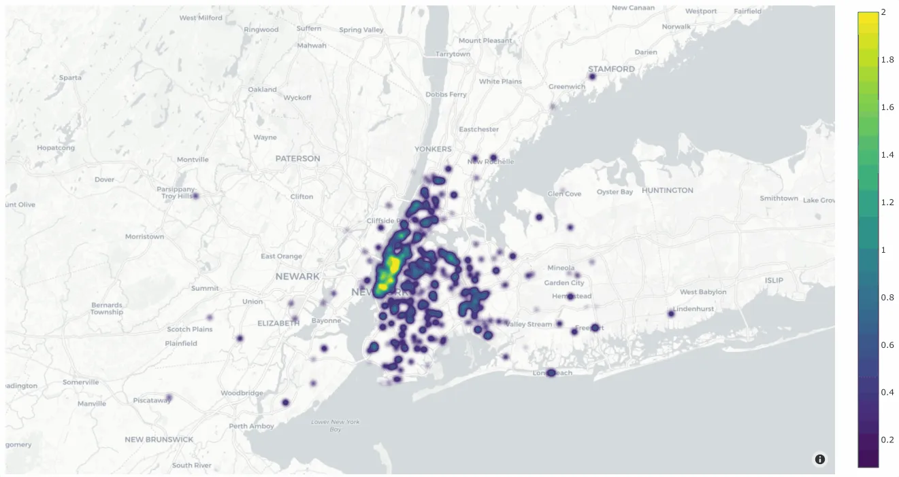

### Interactive plots [¶](\#id8 "Permalink to this headline")

The real power of
[`location_scatterplot()`](../api/fiftyone.core.plots.base.html#fiftyone.core.plots.base.location_scatterplot "fiftyone.core.plots.base.location_scatterplot")
comes when you associate the location coordinates with the samples in a
[`Dataset`](../api/fiftyone.core.dataset.html#fiftyone.core.dataset.Dataset "fiftyone.core.dataset.Dataset") and then attach it to a [`Session`](../api/fiftyone.core.session.html#fiftyone.core.session.Session "fiftyone.core.session.Session").

The example below demonstrates setting up an interactive location scatterplot
for the [quickstart-geo](../data/dataset_zoo/datasets.md#dataset-zoo-quickstart-geo) dataset that is
[attached to the App](#attaching-plots).

In this setup, the location plot renders each sample using its corresponding
`[longitude, latitude]` coordinates from the dataset’s only [`GeoLocation`](../api/fiftyone.core.labels.html#fiftyone.core.labels.GeoLocation "fiftyone.core.labels.GeoLocation")
field, `location`. When points are lasso-ed in the plot, the corresponding
samples are automatically selected in the session’s current
[`view`](../api/fiftyone.core.session.html#fiftyone.core.session.Session.view "fiftyone.core.session.Session.view"). Likewise, whenever you
modify the Session’s view, either in the App or by programmatically setting
[`session.view`](../api/fiftyone.core.session.html#fiftyone.core.session.Session.view "fiftyone.core.session.Session.view"), the corresponding
locations will be selected in the scatterplot.

Each block in the example code below denotes a separate cell in a Jupyter
notebook:

```python
import fiftyone as fo
import fiftyone.brain as fob
import fiftyone.zoo as foz

dataset = foz.load_zoo_dataset("quickstart-geo")
fob.compute_uniqueness(dataset)

session = fo.launch_app(dataset)

```

```python
from fiftyone import ViewField as F

# Computes the number of ground truth objects in each sample
num_objects = F("ground_truth.detections").length()

# Create the scatterplot
plot = fo.location_scatterplot(
    samples=dataset,
    labels="uniqueness",    # color points by their `uniqueness` values
    sizes=num_objects,      # scale point sizes by number of objects
    sizes_title="objects",
)
plot.show(height=720)

session.plots.attach(plot)

```

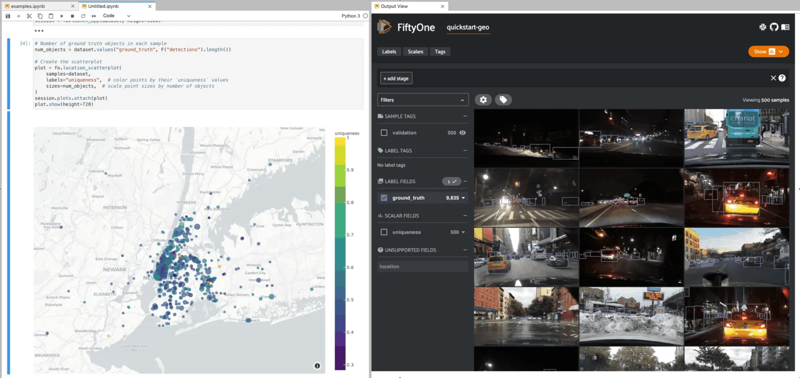

## Regression plots [¶](\#regression-plots "Permalink to this headline")

When you use evaluation methods such as
[`evaluate_regressions()`](../api/fiftyone.core.collections.html#fiftyone.core.collections.SampleCollection.evaluate_regressions "fiftyone.core.collections.SampleCollection.evaluate_regressions")
to evaluate model predictions, the regression plots that you can generate by
calling the [`plot_results()`](../api/fiftyone.utils.eval.regression.html#fiftyone.utils.eval.regression.RegressionResults.plot_results "fiftyone.utils.eval.regression.RegressionResults.plot_results")
method are responsive plots that can be attached to App instances to
interactively explore specific cases of your model’s performance.

Note

See [this page](evaluation.md#evaluating-regressions) for an in-depth guide to using
FiftyOne to evaluate regression models.

The example below demonstrates using an interactive regression plot to explore
the results of some fake regression data on the
[quickstart](../data/dataset_zoo/datasets.md#dataset-zoo-quickstart) dataset.

In this setup, you can lasso scatter points to select the corresponding samples
in the App.

Likewise, whenever you modify the Session’s view, either in the App or by
programmatically setting
[`session.view`](../api/fiftyone.core.session.html#fiftyone.core.session.Session.view "fiftyone.core.session.Session.view"), the regression plot
is automatically updated to select the scatter points that are included in the
current view.

Each block in the example code below denotes a separate cell in a Jupyter
notebook:

```python
import random
import numpy as np

import fiftyone as fo
import fiftyone.zoo as foz
from fiftyone import ViewField as F

dataset = foz.load_zoo_dataset("quickstart").select_fields().clone()

# Populate some fake regression + weather data
for idx, sample in enumerate(dataset, 1):
    ytrue = random.random() * idx
    ypred = ytrue + np.random.randn() * np.sqrt(ytrue)
    confidence = random.random()
    sample["ground_truth"] = fo.Regression(value=ytrue)
    sample["predictions"] = fo.Regression(value=ypred, confidence=confidence)
    sample["weather"] = random.choice(["sunny", "cloudy", "rainy"])
    sample.save()

# Evaluate the predictions in the `predictions` field with respect to the
# values in the `ground_truth` field
results = dataset.evaluate_regressions(
    "predictions",
    gt_field="ground_truth",
    eval_key="eval",
)

session = fo.launch_app(dataset)

```

```python
# Plot a scatterplot of the results colored by `weather` and scaled by
# `confidence`
plot = results.plot_results(labels="weather", sizes="predictions.confidence")
plot.show()

session.plots.attach(plot)

```

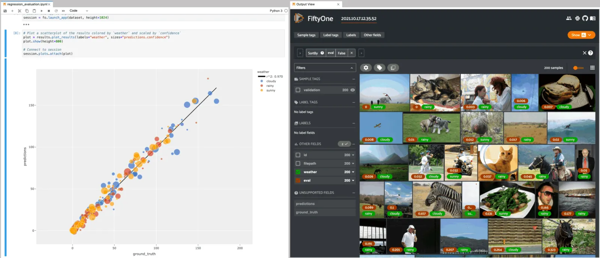

## Line plots [¶](\#line-plots "Permalink to this headline")

You can use [`lines()`](../api/fiftyone.core.plots.base.html#fiftyone.core.plots.base.lines "fiftyone.core.plots.base.lines") to generate
interactive line plots whose points represent data associated with the samples,
frames, or labels of a dataset. These plots can then be attached to App
instances to interactively explore specific slices of your dataset based on
their corresponding line data.

The example below demonstrates using an interactive lines plot to view the
frames of the [quickstart-video](../data/dataset_zoo/datasets.md#dataset-zoo-quickstart-video) dataset
that contain the most vehicles. In this setup, you can lasso scatter points to
select the corresponding frames in a [frames view](using_views.md#frame-views) in the
App.

Each block in the example code below denotes a separate cell in a Jupyter
notebook:

```python
import fiftyone as fo
import fiftyone.zoo as foz
from fiftyone import ViewField as F

dataset = foz.load_zoo_dataset("quickstart-video").clone()

# Ensure dataset has sampled frames available so we can use frame selection
dataset.to_frames(sample_frames=True)

session = fo.launch_app(dataset)

```

```python
view = dataset.filter_labels("frames.detections", F("label") == "vehicle")

# Plot the number of vehicles in each frame of a video dataset
plot = fo.lines(
    x="frames.frame_number",
    y=F("frames.detections.detections").length(),
    labels="id",
    samples=view,
    xaxis_title="frame number",
    yaxis_title="num vehicles",
)
plot.show()

# When points are selected in the plot, load the corresponding frames in
# frames views in the App
plot.selection_mode = "frames"

session.plots.attach(plot)

```

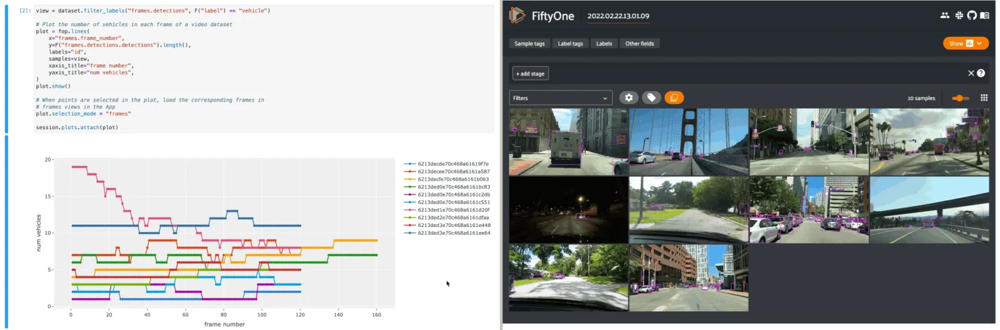

## Confusion matrices [¶](\#confusion-matrices "Permalink to this headline")

When you use evaluation methods such as
[`evaluate_classifications()`](../api/fiftyone.core.collections.html#fiftyone.core.collections.SampleCollection.evaluate_classifications "fiftyone.core.collections.SampleCollection.evaluate_classifications")
and
[`evaluate_detections()`](../api/fiftyone.core.collections.html#fiftyone.core.collections.SampleCollection.evaluate_detections "fiftyone.core.collections.SampleCollection.evaluate_detections")
to evaluate model predictions, the confusion matrices that you can generate
by calling the
[`plot_confusion_matrix()`](../api/fiftyone.utils.eval.classification.html#fiftyone.utils.eval.classification.ClassificationResults.plot_confusion_matrix "fiftyone.utils.eval.classification.ClassificationResults.plot_confusion_matrix")
method are responsive plots that can be attached to App instances to
interactively explore specific cases of your model’s performance.

Note

See [this page](evaluation.md#evaluating-models) for an in-depth guide to using
FiftyOne to evaluate models.

The example below demonstrates using an interactive confusion matrix to explore
the results of an evaluation on the `predictions` field of the
[quickstart](../data/dataset_zoo/datasets.md#dataset-zoo-quickstart) dataset.

In this setup, you can click on individual cells of the confusion matrix to
select the corresponding ground truth and/or predicted [`Detections`](../api/fiftyone.core.labels.html#fiftyone.core.labels.Detections "fiftyone.core.labels.Detections") in the App.
For example, if you click on a diagonal cell of the confusion matrix, you will
see the true positive examples of that class in the App.

Likewise, whenever you modify the Session’s view, either in the App or by
programmatically setting
[`session.view`](../api/fiftyone.core.session.html#fiftyone.core.session.Session.view "fiftyone.core.session.Session.view"), the confusion matrix
is automatically updated to show the cell counts for only those detections that
are included in the current view.

Each block in the example code below denotes a separate cell in a Jupyter
notebook:

```python
import fiftyone as fo
import fiftyone.zoo as foz
from fiftyone import ViewField as F

dataset = foz.load_zoo_dataset("quickstart")

# Evaluate detections in the `predictions` field
results = dataset.evaluate_detections("predictions", gt_field="ground_truth")

# The top-10 most common classes
counts = dataset.count_values("ground_truth.detections.label")
classes = sorted(counts, key=counts.get, reverse=True)[:10]

session = fo.launch_app(dataset)

```

```python
# Plot confusion matrix
plot = results.plot_confusion_matrix(classes=classes)
plot.show(height=600)

session.plots.attach(plot)

```

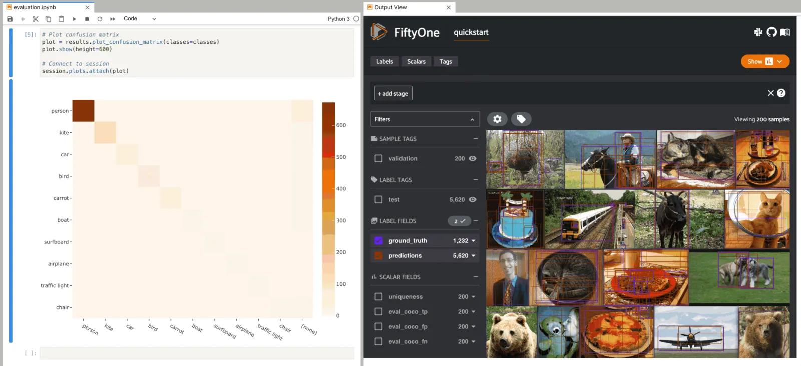

When you pass an `eval_key` to
[`evaluate_detections()`](../api/fiftyone.core.collections.html#fiftyone.core.collections.SampleCollection.evaluate_detections "fiftyone.core.collections.SampleCollection.evaluate_detections"),
confusion matrices attached to App instances have a different default behavior:
when you select cell(s), the corresponding
[evaluation patches](evaluation.md#evaluation-patches) for the run are shown in the
App. This allows you to visualize each TP, FP, and FN example in a fine-grained
manner:

```python
results = dataset.evaluate_detections(
    "predictions", gt_field="ground_truth", eval_key="eval"
)

```

```python
# Since these results have an `eval_key`, selecting cells in this plot will
# load evaluation patch views
plot = results.plot_confusion_matrix(classes=classes)
plot.show(height=600)

session.plots.attach(plot)

```

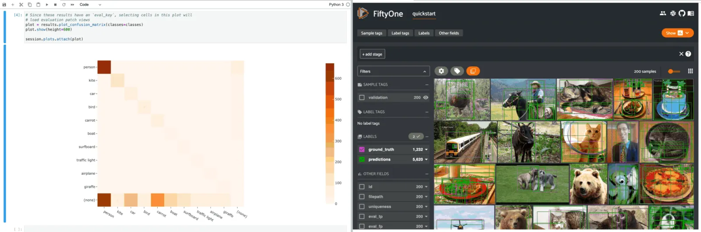

If you prefer a different selection behavior, you can simply change the plot’s
[selection mode](#plot-selection-modes).

## View plots [¶](\#id11 "Permalink to this headline")

[`ViewPlot`](../api/fiftyone.core.plots.base.html#fiftyone.core.plots.base.ViewPlot "fiftyone.core.plots.base.ViewPlot") is a class of plots whose state is automatically updated whenever
the current [`session.view`](../api/fiftyone.core.session.html#fiftyone.core.session.Session.view "fiftyone.core.session.Session.view") changes.

Current varieties of view plots include [`CategoricalHistogram`](../api/fiftyone.core.plots.views.html#fiftyone.core.plots.views.CategoricalHistogram "fiftyone.core.plots.views.CategoricalHistogram"),
[`NumericalHistogram`](../api/fiftyone.core.plots.views.html#fiftyone.core.plots.views.NumericalHistogram "fiftyone.core.plots.views.NumericalHistogram"), and [`ViewGrid`](../api/fiftyone.core.plots.views.html#fiftyone.core.plots.views.ViewGrid "fiftyone.core.plots.views.ViewGrid").

Note

New [`ViewPlot`](../api/fiftyone.core.plots.base.html#fiftyone.core.plots.base.ViewPlot "fiftyone.core.plots.base.ViewPlot") subclasses will be continually added over time, and it is
also straightforward to implement your own custom view plots. Contributions
are welcome at [https://github.com/voxel51/fiftyone](https://github.com/voxel51/fiftyone)!

The example below demonstrates the use of [`ViewGrid`](../api/fiftyone.core.plots.views.html#fiftyone.core.plots.views.ViewGrid "fiftyone.core.plots.views.ViewGrid") to construct a dashboard
of histograms of various aspects of a dataset, which can then be attached to a
[`Session`](../api/fiftyone.core.session.html#fiftyone.core.session.Session "fiftyone.core.session.Session") in order to automatically see how the statistics change when the
session’s [`view`](../api/fiftyone.core.session.html#fiftyone.core.session.Session.view "fiftyone.core.session.Session.view") is modified.

Each block in the example code below denotes a separate cell in a Jupyter
notebook:

```python
import fiftyone as fo
import fiftyone.zoo as foz
from fiftyone import ViewField as F

dataset = foz.load_zoo_dataset("quickstart")
dataset.compute_metadata()

# Define some interesting plots
plot1 = fo.NumericalHistogram(F("metadata.size_bytes") / 1024, bins=50, xlabel="image size (KB)")
plot2 = fo.NumericalHistogram("predictions.detections.confidence", bins=50, range=[0, 1])
plot3 = fo.CategoricalHistogram("ground_truth.detections.label", order="frequency")
plot4 = fo.CategoricalHistogram("predictions.detections.label", order="frequency")

session = fo.launch_app(dataset)

```

```python
# Construct a custom dashboard of plots
plot = fo.ViewGrid([plot1, plot2, plot3, plot4], init_view=dataset)
plot.show(height=720)

session.plots.attach(plot)

```


## Attaching plots to the App [¶](\#attaching-plots-to-the-app "Permalink to this headline")

All [`Session`](../api/fiftyone.core.session.html#fiftyone.core.session.Session "fiftyone.core.session.Session") instances provide a
[`plots`](../api/fiftyone.core.session.html#fiftyone.core.session.Session.plots "fiftyone.core.session.Session.plots") attribute that you can use
to attach [`ResponsivePlot`](../api/fiftyone.core.plots.base.html#fiftyone.core.plots.base.ResponsivePlot "fiftyone.core.plots.base.ResponsivePlot") instances to the FiftyOne App.

When [`ResponsivePlot`](../api/fiftyone.core.plots.base.html#fiftyone.core.plots.base.ResponsivePlot "fiftyone.core.plots.base.ResponsivePlot") instances are attached to a [`Session`](../api/fiftyone.core.session.html#fiftyone.core.session.Session "fiftyone.core.session.Session"), they are
automatically updated whenever
[`session.view`](../api/fiftyone.core.session.html#fiftyone.core.session.Session.view "fiftyone.core.session.Session.view") changes for any
reason, whether you modify your view in the App, or programmatically change it
by setting [`session.view`](../api/fiftyone.core.session.html#fiftyone.core.session.Session.view "fiftyone.core.session.Session.view"), or if
multiple plots are connected and another plot triggers a [`Session`](../api/fiftyone.core.session.html#fiftyone.core.session.Session "fiftyone.core.session.Session") update!

Note

Interactive plots are currently only supported in Jupyter notebooks. In the
meantime, you can still use FiftyOne’s plotting features in other
environments, but you must manually call
[`plot.show()`](../api/fiftyone.core.plots.base.html#fiftyone.core.plots.base.Plot.show "fiftyone.core.plots.base.Plot.show") to update the
state of a plot to match the state of a connected [`Session`](../api/fiftyone.core.session.html#fiftyone.core.session.Session "fiftyone.core.session.Session"), and any
callbacks that would normally be triggered in response to interacting with
a plot will not be triggered.

See [this section](#working-in-notebooks) for more information.

### Attaching a plot [¶](\#attaching-a-plot "Permalink to this headline")

The code below demonstrates the basic pattern of connecting a [`ResponsivePlot`](../api/fiftyone.core.plots.base.html#fiftyone.core.plots.base.ResponsivePlot "fiftyone.core.plots.base.ResponsivePlot")
to a [`Session`](../api/fiftyone.core.session.html#fiftyone.core.session.Session "fiftyone.core.session.Session"):

```python
import fiftyone as fo
import fiftyone.zoo as foz

dataset = foz.load_zoo_dataset("quickstart-geo")

session = fo.launch_app(dataset)

# Create a responsive location plot
plot = fo.location_scatterplot(samples=dataset)
plot.show()  # show the plot

# Attach the plot to the session
# Updates will automatically occur when the plot/session are updated
session.plots.attach(plot)

```

You can view details about the plots attached to a [`Session`](../api/fiftyone.core.session.html#fiftyone.core.session.Session "fiftyone.core.session.Session") by printing it:

```python
print(session)

```

```python
Dataset:          quickstart-geo
Media type:       image
Num samples:      500
Selected samples: 0
Selected labels:  0
Session URL:      http://localhost:5151/
Connected plots:
    plot1: fiftyone.core.plots.plotly.InteractiveScatter

```

By default, plots are given sequential names `plot1`, `plot2`, etc., but
you can customize their names via the optional `name` parameter of
[`session.plots.attach()`](../api/fiftyone.core.plots.manager.html#fiftyone.core.plots.manager.PlotManager.attach "fiftyone.core.plots.manager.PlotManager.attach").

You can retrieve a [`ResponsivePlot`](../api/fiftyone.core.plots.base.html#fiftyone.core.plots.base.ResponsivePlot "fiftyone.core.plots.base.ResponsivePlot") instance from its connected session by its
name:

```python
same_plot = session.plots["plot1"]
same_plot is plot  # True

```

### Connecting and disconnecting plots [¶](\#connecting-and-disconnecting-plots "Permalink to this headline")

By default, when plots are attached to a [`Session`](../api/fiftyone.core.session.html#fiftyone.core.session.Session "fiftyone.core.session.Session"), they are _connected_, which
means that any necessary state updates will happen automatically. If you wish
to temporarily suspend updates for an individual plot, you can use
[`plot.disconnect()`](../api/fiftyone.core.plots.base.html#fiftyone.core.plots.base.ResponsivePlot.disconnect "fiftyone.core.plots.base.ResponsivePlot.disconnect"):

```python
# Disconnect an individual plot
# Plot updates will no longer update the session, and vice versa
plot.disconnect()

# Note that `plot1` is now disconnected
print(session)

```

```python
Dataset:          quickstart-geo
Media type:       image
Num samples:      500
Selected samples: 0
Selected labels:  0
Session URL:      http://localhost:5151/
Disconnected plots:
    plot1: fiftyone.core.plots.plotly.InteractiveScatter

```

You can reconnect a plot by calling
[`plot.connect()`](../api/fiftyone.core.plots.base.html#fiftyone.core.plots.base.ResponsivePlot.connect "fiftyone.core.plots.base.ResponsivePlot.connect"):

```python
# Reconnect an individual plot
plot.connect()

# Note that `plot1` is connected again
print(session)

```

```python
Dataset:          quickstart-geo
Media type:       image
Num samples:      500
Selected samples: 0
Selected labels:  0
Session URL:      http://localhost:5151/
Connected plots:
    plot1: fiftyone.core.plots.plotly.InteractiveScatter

```

You can disconnect and reconnect all plots currently attached to a [`Session`](../api/fiftyone.core.session.html#fiftyone.core.session.Session "fiftyone.core.session.Session")
via
[`session.plots.disconnect()`](../api/fiftyone.core.plots.manager.html#fiftyone.core.plots.manager.PlotManager.disconnect "fiftyone.core.plots.manager.PlotManager.disconnect")
and
[`session.plots.connect()`](../api/fiftyone.core.plots.manager.html#fiftyone.core.plots.manager.PlotManager.connect "fiftyone.core.plots.manager.PlotManager.connect"),
respectively.

### Detaching plots [¶](\#detaching-plots "Permalink to this headline")

If you would like to permanently detach a plot from a [`Session`](../api/fiftyone.core.session.html#fiftyone.core.session.Session "fiftyone.core.session.Session"), use
[`session.plots.pop()`](../api/fiftyone.core.plots.manager.html#fiftyone.core.plots.manager.PlotManager.pop "fiftyone.core.plots.manager.PlotManager.pop") or
[`session.plots.remove()`](../api/fiftyone.core.plots.manager.html#fiftyone.core.plots.manager.PlotManager.remove "fiftyone.core.plots.manager.PlotManager.remove"):

```python
# Detach plot from its session
plot = session.plots.pop("plot1")

# Note that `plot1` no longer appears
print(session)

```

```python
Dataset:          quickstart-geo
Media type:       image
Num samples:      500
Selected samples: 0
Selected labels:  0
Session URL:      http://localhost:5151/

```

### Freezing plots [¶](\#freezing-plots "Permalink to this headline")

Working with interactive plots in notebooks is an amazingly productive
experience. However, when you find something particularly interesting that you
want to save, or you want to share a notebook with a colleague without requiring
them to rerun all of the cells to reproduce your results, you may want to
_freeze_ your responsive plots.

You can conveniently freeze your currently active App instance and any attached
plots by calling
[`session.freeze()`](../api/fiftyone.core.session.html#fiftyone.core.session.Session.freeze "fiftyone.core.session.Session.freeze"):

```python
# Replace current App instance and all attached plots with static images
session.freeze()

```

After calling this method, your current App instance and all connected plots
will be replaced by static images that will be visible when you save + reopen
your notebook later.

You can also freeze an individual plot by calling
[`plot.freeze()`](../api/fiftyone.core.plots.base.html#fiftyone.core.plots.base.ResponsivePlot.freeze "fiftyone.core.plots.base.ResponsivePlot.freeze"):

```python
# Replace a plot with a static image
plot.freeze()

```

You can “revive” frozen App and plot instances by simply rerunning the notebook
cells in which they were defined and shown.

Note

[`session.freeze()`](../api/fiftyone.core.session.html#fiftyone.core.session.Session.freeze "fiftyone.core.session.Session.freeze") and
[`plot.freeze()`](../api/fiftyone.core.plots.base.html#fiftyone.core.plots.base.ResponsivePlot.freeze "fiftyone.core.plots.base.ResponsivePlot.freeze") are
only applicable when working in notebook contexts.

## Saving plots [¶](\#saving-plots "Permalink to this headline")

You can use [`plot.save()`](../api/fiftyone.core.plots.base.html#fiftyone.core.plots.base.Plot.save "fiftyone.core.plots.base.Plot.save") to save
any [`InteractivePlot`](../api/fiftyone.core.plots.base.html#fiftyone.core.plots.base.InteractivePlot "fiftyone.core.plots.base.InteractivePlot") or [`ViewPlot`](../api/fiftyone.core.plots.base.html#fiftyone.core.plots.base.ViewPlot "fiftyone.core.plots.base.ViewPlot") as a static image or HTML.

Consult the documentation of your plot’s
[`save()`](../api/fiftyone.core.plots.base.html#fiftyone.core.plots.base.Plot.save "fiftyone.core.plots.base.Plot.save") method for details on
configuring the export.

For example, you can save a [histogram view plot](#id11):

```python
import fiftyone as fo
import fiftyone.zoo as foz

dataset = foz.load_zoo_dataset("quickstart")

plot = fo.CategoricalHistogram(
    "ground_truth.detections.label",
    order="frequency",
    log=True,
    init_view=dataset,
)

plot.save("./histogram.jpg", scale=2.0)

```

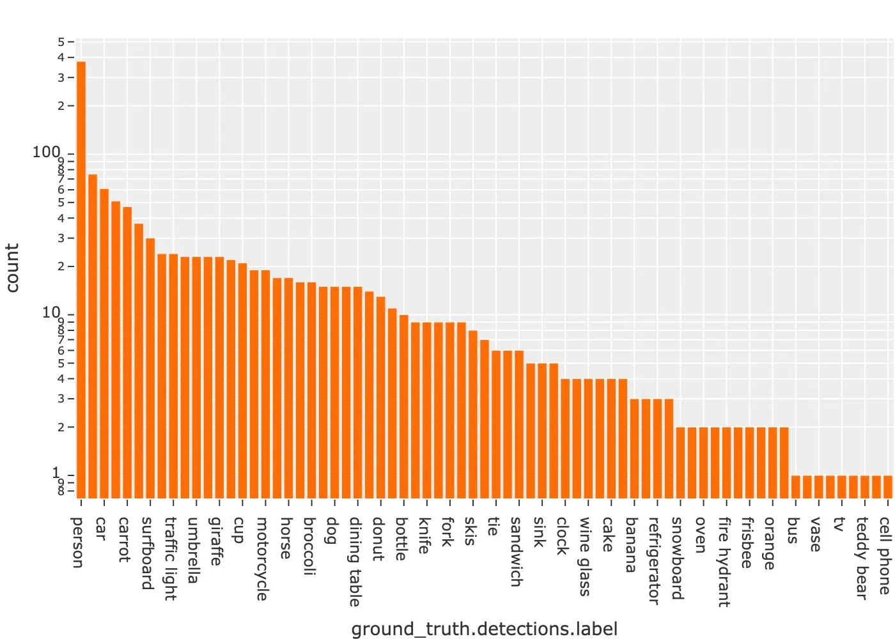

Or you can save an [embedding scatterplot](#embeddings-plots):

```python
import fiftyone.brain as fob

results = fob.compute_visualization(dataset)

plot = results.visualize(labels="uniqueness", axis_equal=True)
plot.save("./embeddings.png", height=300, width=800)

```

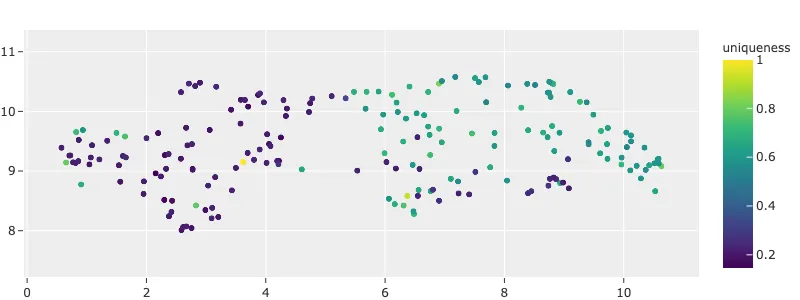

You can also save plots generated using the
[matplotlib backend](#plotting-backend):

```python
plot = results.visualize(
    labels="uniqueness",
    backend="matplotlib",
    ax_equal=True,
    marker_size=5,
)
plot.save("./embeddings-matplotlib.png", dpi=200)

```

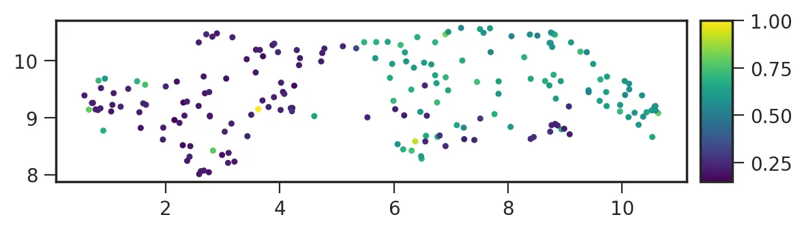

## Advanced usage [¶](\#advanced-usage "Permalink to this headline")

### Customizing plot layouts [¶](\#customizing-plot-layouts "Permalink to this headline")

The [`plot.show()`](../api/fiftyone.core.plots.base.html#fiftyone.core.plots.base.Plot.show "fiftyone.core.plots.base.Plot.show") method used to
display plots in FiftyOne supports optional keyword arguments that you can use
to customize the look-and-feel of plots.

In general, consult the documentation of the relevant
[`plot.show()`](../api/fiftyone.core.plots.base.html#fiftyone.core.plots.base.Plot.show "fiftyone.core.plots.base.Plot.show") method for details on
the supported parameters.

If you are using the default [plotly backend](#plotting-backend),
[`plot.show()`](../api/fiftyone.core.plots.base.html#fiftyone.core.plots.base.Plot.show "fiftyone.core.plots.base.Plot.show") will accept any valid
keyword arguments for [`plotly.graph_objects.Figure.update_layout()`](https://plotly.com/python-api-reference/generated/plotly.graph_objects.html#plotly.graph_objects.Figure.update_layout "(in )").

The examples below demonstrate some common layout customizations that you may
wish to perform:

```python
# Increase the default height of the figure, in pixels
plot.show(height=720)

# Equivalent of `axis("equal")` in matplotlib
plot.show(yaxis_scaleanchor="x")

```

Note

Refer to the
[plotly layout documentation](https://plotly.com/python/reference/layout)
for a full list of the supported options.

### Plot selection modes [¶](\#plot-selection-modes "Permalink to this headline")

When working with [scatterplots](#embeddings-plots) and
[interactive heatmaps](#confusion-matrix-plots) that are linked to frames
or labels, you may prefer to see different views loaded in the App when you
make a selection in the plot. For example, you may want to see the
corresponding objects in a [patches view](using_views.md#object-patches-views), or you
may wish to see the samples containing the objects but with all other labels
also visible.

You can use the
[`selection_mode`](../api/fiftyone.core.plots.base.html#fiftyone.core.plots.base.InteractivePlot.selection_mode "fiftyone.core.plots.base.InteractivePlot.selection_mode")
property of [`InteractivePlot`](../api/fiftyone.core.plots.base.html#fiftyone.core.plots.base.InteractivePlot "fiftyone.core.plots.base.InteractivePlot") instances to change the behavior of App updates
when selections are made in [connected plots](#attaching-plots).

When a plot is linked to frames, the available
[`selection_mode`](../api/fiftyone.core.plots.base.html#fiftyone.core.plots.base.InteractivePlot.selection_mode "fiftyone.core.plots.base.InteractivePlot.selection_mode")
options are:

- `"select"` ( _default_): show video samples with labels only for the
selected frames

- `"match"`: show unfiltered video samples containing at least one selected
frame

- `"frames"`: show only the selected frames in a frames view


When a plot is linked to labels, the available
[`selection_mode`](../api/fiftyone.core.plots.base.html#fiftyone.core.plots.base.InteractivePlot.selection_mode "fiftyone.core.plots.base.InteractivePlot.selection_mode")
options are:

- `"patches"` ( _default_): show the selected labels in a patches view

- `"select"`: show only the selected labels

- `"match"`: show unfiltered samples containing at least one selected label


For example, by default, clicking on cells in a confusion matrix for a
[detection evaluation](evaluation.md#evaluating-detections-coco) will show the
corresponding ground truth and predicted objects in an
[evaluation patches view](evaluation.md#evaluation-patches) view in the App. Run the
code blocks below in Jupyter notebook cells to see this:

```python
import fiftyone as fo
import fiftyone.zoo as foz
from fiftyone import ViewField as F

dataset = foz.load_zoo_dataset("quickstart")

results = dataset.evaluate_detections(
    "predictions", gt_field="ground_truth", eval_key="eval"
)

# Get the 10 most common classes in the dataset
counts = dataset.count_values("ground_truth.detections.label")
classes = sorted(counts, key=counts.get, reverse=True)[:10]

session = fo.launch_app(dataset)

```

```python
plot = results.plot_confusion_matrix(classes=classes)
plot.show(height=600)

session.plots.attach(plot, name="eval")

```

However, you can change this behavior by updating the
[`selection_mode`](../api/fiftyone.core.plots.base.html#fiftyone.core.plots.base.InteractivePlot.selection_mode "fiftyone.core.plots.base.InteractivePlot.selection_mode")
property of the plot like so:

```python
# Selecting cells will now show unfiltered samples containing selected objects
plot.selection_mode = "match"

```

```python
# Selecting cells will now show filtered samples containing only selected objects
plot.selection_mode = "select"

```

Similarly, selecting scatter points in an
[object embeddings visualization](brain.md#brain-embeddings-visualization) will
show the corresponding objects in the App as a
[patches view](using_views.md#object-patches-views):

```python
# Continuing from the code above
session.freeze()

```

```python
import fiftyone.brain as fob

results = fob.compute_visualization(
    dataset, patches_field="ground_truth", brain_key="gt_viz"
)

# Restrict visualization to the 10 most common classes
view = dataset.filter_labels("ground_truth", F("label").is_in(classes))
results.use_view(view)

session.show()

```

```python
plot = results.visualize(labels="ground_truth.detections.label")
plot.show(height=800)

session.plots.attach(plot, name="gt_viz")

```

However, you can change this behavior by updating the
[`selection_mode`](../api/fiftyone.core.plots.base.html#fiftyone.core.plots.base.InteractivePlot.selection_mode "fiftyone.core.plots.base.InteractivePlot.selection_mode")
property of the plot:

```python
# Selecting points will now show unfiltered samples containing selected objects
plot.selection_mode = "match"

```

```python
# Selecting points will now show filtered samples containing only selected objects
plot.selection_mode = "select"

```

Note

The App will immediately update when you set the
[`selection_mode`](../api/fiftyone.core.plots.base.html#fiftyone.core.plots.base.InteractivePlot.selection_mode "fiftyone.core.plots.base.InteractivePlot.selection_mode")
property of an [`InteractivePlot`](../api/fiftyone.core.plots.base.html#fiftyone.core.plots.base.InteractivePlot "fiftyone.core.plots.base.InteractivePlot") connected to the App.

### Plotting backend [¶](\#plotting-backend "Permalink to this headline")

Most plotting methods in the [`fiftyone.core.plots()`](../api/fiftyone.core.plots.html "fiftyone.core.plots") module provide an
optional `backend` parameter that you can use to control the plotting backend
used to render plots.

The default plotting backend is `plotly`, which is highly recommended due to
its better performance, look-and-feel, and greater support for interactivity.

However, most plot types also support the `matplotlib` backend. If you chose
this backend, plots will be rendered as matplotlib figures. Many
matplotlib-powered plot types support interactivity, but you must
[enable this behavior](#matplotlib-in-notebooks):

```python
import fiftyone as fo
import fiftyone.zoo as foz
from fiftyone import ViewField as F

dataset = foz.load_zoo_dataset("quickstart")
results = dataset.evaluate_detections("predictions", gt_field="ground_truth")

# Get the 10 most common classes in the dataset
counts = dataset.count_values("ground_truth.detections.label")
classes = sorted(counts, key=counts.get, reverse=True)[:10]

```

```python
# Use the default plotly backend
plot = results.plot_confusion_matrix(classes=classes)
plot.show(height=512)

```

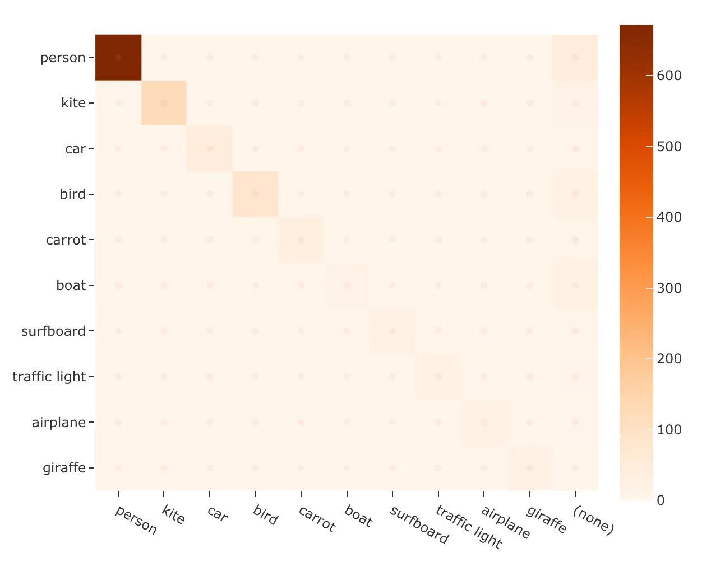

```python
import matplotlib.pyplot as plt

# Use the matplotlib backend instead
figure = results.plot_confusion_matrix(
    classes=classes, backend="matplotlib", figsize=(10, 10)
)
plt.show(block=False)

```

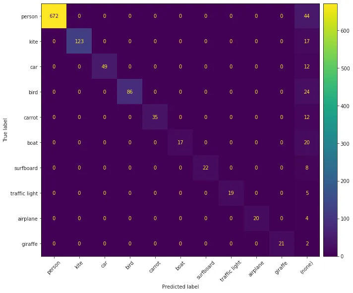

### Interactive matplotlib plots [¶](\#interactive-matplotlib-plots "Permalink to this headline")

If you are using the [matplotlib backend](#plotting-backend), many
FiftyOne plots still support interactivity in notebooks, but you must enable
this behavior by running the appropriate magic command in your notebook
_before_ you generate your first plot.

If you forget or choose not to run a magic command, the plots will still
display, but they will not be interactive.

Follow the instructions for your environment below to enable interactive
matplotlib plots:

