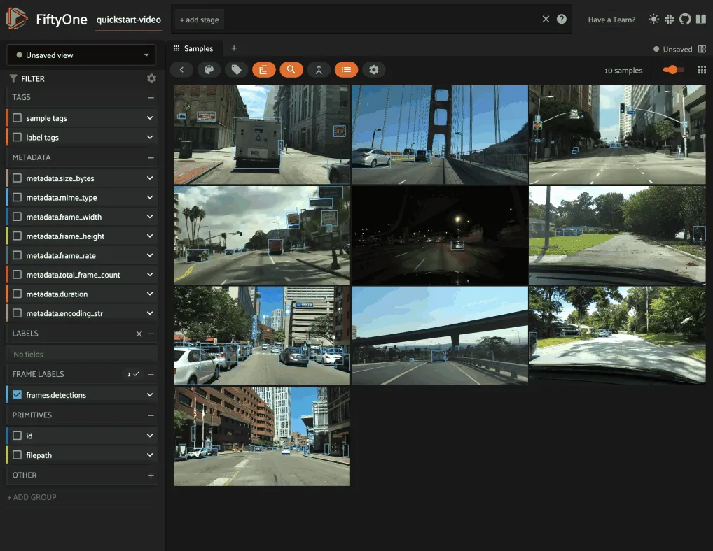
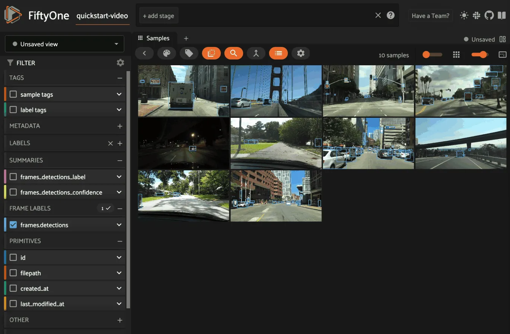
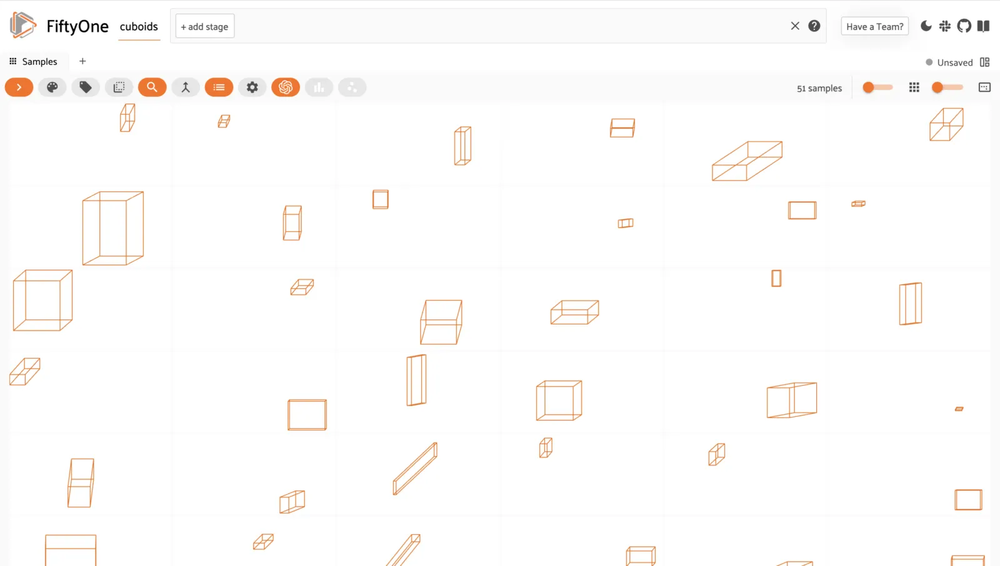
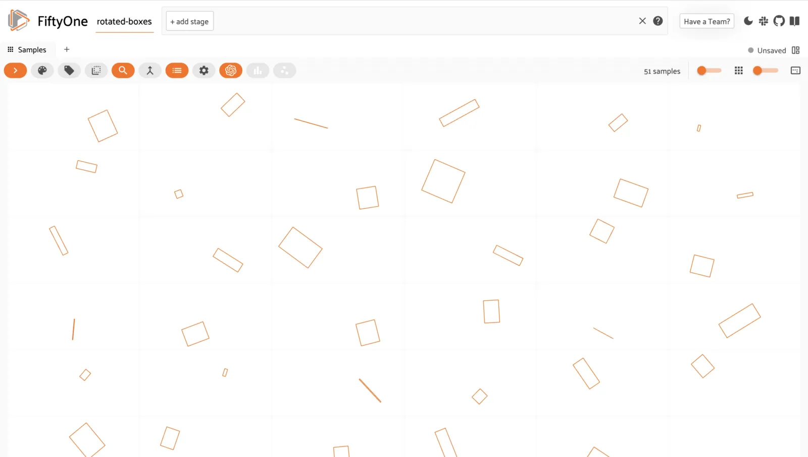
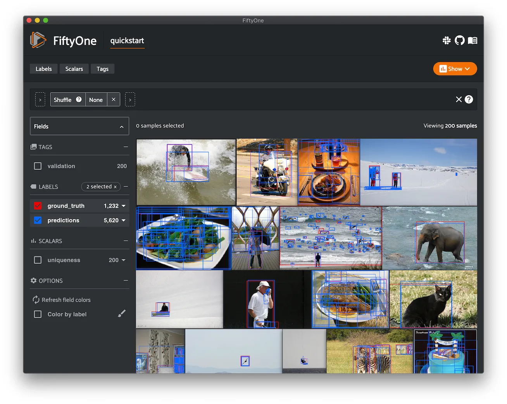
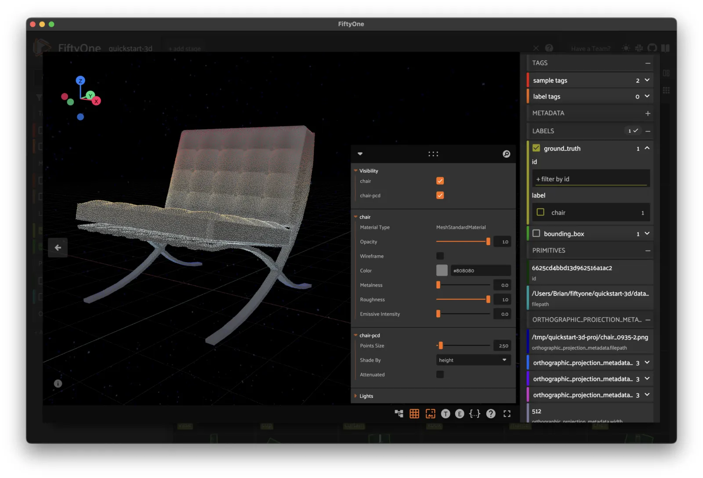
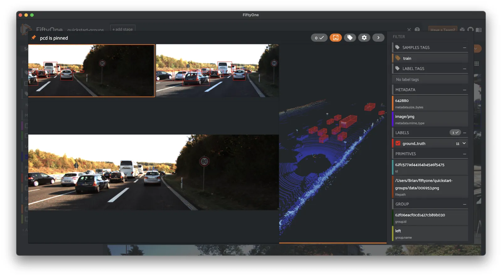

# Using FiftyOne Datasets [¶](\#using-fiftyone-datasets "Permalink to this headline")

After a [`Dataset`](../api/fiftyone.core.dataset.html#fiftyone.core.dataset.Dataset "fiftyone.core.dataset.Dataset") has been loaded or created, FiftyOne provides powerful
functionality to inspect, search, and modify it from a [`Dataset`](../api/fiftyone.core.dataset.html#fiftyone.core.dataset.Dataset "fiftyone.core.dataset.Dataset")-wide down to
a [`Sample`](../api/fiftyone.core.sample.html#fiftyone.core.sample.Sample "fiftyone.core.sample.Sample") level.

The following sections provide details of how to use various aspects of a
FiftyOne [`Dataset`](../api/fiftyone.core.dataset.html#fiftyone.core.dataset.Dataset "fiftyone.core.dataset.Dataset").

## Datasets [¶](\#datasets "Permalink to this headline")

Instantiating a [`Dataset`](../api/fiftyone.core.dataset.html#fiftyone.core.dataset.Dataset "fiftyone.core.dataset.Dataset") object creates a new dataset.

```python
import fiftyone as fo

dataset1 = fo.Dataset("my_first_dataset")
dataset2 = fo.Dataset("my_second_dataset")
dataset3 = fo.Dataset()  # generates a default unique name

```

Check to see what datasets exist at any time via [`list_datasets()`](../api/fiftyone.core.dataset.html#fiftyone.core.dataset.list_datasets "fiftyone.core.dataset.list_datasets"):

```python
print(fo.list_datasets())
# ['my_first_dataset', 'my_second_dataset', '2020.08.04.12.36.29']

```

Load a dataset using
[`load_dataset()`](../api/fiftyone.core.dataset.html#fiftyone.core.dataset.load_dataset "fiftyone.core.dataset.load_dataset").
Dataset objects are singletons. Cool!

```python
_dataset2 = fo.load_dataset("my_second_dataset")
_dataset2 is dataset2  # True

```

If you try to load a dataset via `Dataset(...)` or create a new dataset via
[`load_dataset()`](../api/fiftyone.core.dataset.html#fiftyone.core.dataset.load_dataset "fiftyone.core.dataset.load_dataset") you’re going to
have a bad time:

```python
_dataset2 = fo.Dataset("my_second_dataset")
# Dataset 'my_second_dataset' already exists; use `fiftyone.load_dataset()`
# to load an existing dataset

dataset4 = fo.load_dataset("my_fourth_dataset")
# DoesNotExistError: Dataset 'my_fourth_dataset' not found

```

### Dataset media type [¶](\#dataset-media-type "Permalink to this headline")

The media type of a dataset is determined by the
[media type](#using-media-type) of the [`Sample`](../api/fiftyone.core.sample.html#fiftyone.core.sample.Sample "fiftyone.core.sample.Sample") objects that it contains.

The [`media_type`](../api/fiftyone.core.dataset.html#fiftyone.core.dataset.Dataset.media_type "fiftyone.core.dataset.Dataset.media_type") property of a
dataset is set based on the first sample added to it:

```python
import fiftyone as fo

dataset = fo.Dataset()

print(dataset.media_type)
# None

sample = fo.Sample(filepath="/path/to/image.png")
dataset.add_sample(sample)

print(dataset.media_type)
# "image"

```

Note that datasets are homogeneous; they must contain samples of the same media
type (except for [grouped datasets](groups.md#groups)):

```python
sample = fo.Sample(filepath="/path/to/video.mp4")
dataset.add_sample(sample)
# MediaTypeError: Sample media type 'video' does not match dataset media type 'image'

```

The following media types are available:

| Media type | Description |
| --- | --- |
| `image` | Datasets that contain<br>[images](#image-datasets) |
| `video` | Datasets that contain<br>[videos](#video-datasets) |
| `3d` | Datasets that contain<br>[3D scenes](#d-datasets) |
| `point-cloud` | Datasets that contain<br>[point clouds](#point-cloud-datasets) |
| `group` | Datasets that contain<br>[grouped data slices](groups.md#groups) |

### Dataset persistence [¶](\#dataset-persistence "Permalink to this headline")

By default, datasets are non-persistent. Non-persistent datasets are deleted
from the database each time the database is shut down. Note that FiftyOne does
not store the raw data in datasets directly (only the labels), so your source
files on disk are untouched.

To make a dataset persistent, set its
[`persistent`](../api/fiftyone.core.dataset.html#fiftyone.core.dataset.Dataset.persistent "fiftyone.core.dataset.Dataset.persistent") property to
`True`:

```python
# Make the dataset persistent
dataset1.persistent = True

```

Without closing your current Python shell, open a new shell and run:

```python
import fiftyone as fo

# Verify that both persistent and non-persistent datasets still exist
print(fo.list_datasets())
# ['my_first_dataset', 'my_second_dataset', '2020.08.04.12.36.29']

```

All three datasets are still available, since the database connection has not
been terminated.

However, if you exit all processes with `fiftyone` imported, then open a new
shell and run the command again:

```python
import fiftyone as fo

# Verify that non-persistent datasets have been deleted
print(fo.list_datasets())
# ['my_first_dataset']

```

you’ll see that the `my_second_dataset` and `2020.08.04.12.36.29` datasets have
been deleted because they were not persistent.

### Dataset version [¶](\#dataset-version "Permalink to this headline")

The version of the `fiftyone` package for which a dataset is formatted is
stored in the [`version`](../api/fiftyone.core.dataset.html#fiftyone.core.dataset.Dataset.version "fiftyone.core.dataset.Dataset.version") property
of the dataset.

If you upgrade your `fiftyone` package and then load a dataset that was created
with an older version of the package, it will be automatically migrated to the
new package version (if necessary) the first time you load it.

### Dataset tags [¶](\#dataset-tags "Permalink to this headline")

All [`Dataset`](../api/fiftyone.core.dataset.html#fiftyone.core.dataset.Dataset "fiftyone.core.dataset.Dataset") instances have a
[`tags`](../api/fiftyone.core.dataset.html#fiftyone.core.dataset.Dataset.tags "fiftyone.core.dataset.Dataset.tags") property that you can use to
store an arbitrary list of string tags.

```python
import fiftyone as fo

dataset = fo.Dataset()

# Add some tags
dataset.tags = ["test", "projectA"]

# Edit the tags
dataset.tags.pop()
dataset.tags.append("projectB")
dataset.save()  # must save after edits

```

Note

You must call
[`dataset.save()`](../api/fiftyone.core.dataset.html#fiftyone.core.dataset.Dataset.save "fiftyone.core.dataset.Dataset.save") after updating
the dataset’s [`tags`](../api/fiftyone.core.dataset.html#fiftyone.core.dataset.Dataset.tags "fiftyone.core.dataset.Dataset.tags") property
in-place to save the changes to the database.

### Dataset stats [¶](\#dataset-stats "Permalink to this headline")

You can use the [`stats()`](../api/fiftyone.core.dataset.html#fiftyone.core.dataset.Dataset.stats "fiftyone.core.dataset.Dataset.stats") method on
a dataset to obtain information about the size of the dataset on disk,
including its metadata in the database and optionally the size of the physical
media on disk:

```python
import fiftyone as fo
import fiftyone.zoo as foz

dataset = foz.load_zoo_dataset("quickstart")

fo.pprint(dataset.stats(include_media=True))

```

```python
{
    'samples_count': 200,
    'samples_bytes': 1290762,
    'samples_size': '1.2MB',
    'media_bytes': 24412374,
    'media_size': '23.3MB',
    'total_bytes': 25703136,
    'total_size': '24.5MB',
}

```

You can also invoke
[`stats()`](../api/fiftyone.core.collections.html#fiftyone.core.collections.SampleCollection.stats "fiftyone.core.collections.SampleCollection.stats") on a
[dataset view](using_views.md#using-views) to retrieve stats for a specific subset of
the dataset:

```python
view = dataset[:10].select_fields("ground_truth")

fo.pprint(view.stats(include_media=True))

```

```python
{
    'samples_count': 10,
    'samples_bytes': 10141,
    'samples_size': '9.9KB',
    'media_bytes': 1726296,
    'media_size': '1.6MB',
    'total_bytes': 1736437,
    'total_size': '1.7MB',
}

```

### Storing info [¶](\#storing-info "Permalink to this headline")

All [`Dataset`](../api/fiftyone.core.dataset.html#fiftyone.core.dataset.Dataset "fiftyone.core.dataset.Dataset") instances have an
[`info`](../api/fiftyone.core.dataset.html#fiftyone.core.dataset.Dataset.info "fiftyone.core.dataset.Dataset.info") property, which contains a
dictionary that you can use to store any JSON-serializable information you wish
about your dataset.

Datasets can also store more specific types of ancillary information such as
[class lists](#storing-classes) and
[mask targets](#storing-mask-targets).

```python
import fiftyone as fo

dataset = fo.Dataset()

# Store a class list in the dataset's info
dataset.info = {
    "dataset_source": "https://...",
    "author": "...",
}

# Edit existing info
dataset.info["owner"] = "..."
dataset.save()  # must save after edits

```

Note

You must call
[`dataset.save()`](../api/fiftyone.core.dataset.html#fiftyone.core.dataset.Dataset.save "fiftyone.core.dataset.Dataset.save") after updating
the dataset’s [`info`](../api/fiftyone.core.dataset.html#fiftyone.core.dataset.Dataset.info "fiftyone.core.dataset.Dataset.info") property
in-place to save the changes to the database.

### Dataset App config [¶](\#dataset-app-config "Permalink to this headline")

All [`Dataset`](../api/fiftyone.core.dataset.html#fiftyone.core.dataset.Dataset "fiftyone.core.dataset.Dataset") instances have an
[`app_config`](../api/fiftyone.core.dataset.html#fiftyone.core.dataset.Dataset.app_config "fiftyone.core.dataset.Dataset.app_config") property that
contains a [`DatasetAppConfig`](../api/fiftyone.core.odm.dataset.html#fiftyone.core.odm.dataset.DatasetAppConfig "fiftyone.core.odm.dataset.DatasetAppConfig") that you can use to store dataset-specific
settings that customize how the dataset is visualized in the
[FiftyOne App](app.md#fiftyone-app).

```python
import fiftyone as fo
import fiftyone.zoo as foz

dataset = foz.load_zoo_dataset("quickstart")
session = fo.launch_app(dataset)

# View the dataset's current App config
print(dataset.app_config)

```

#### Multiple media fields [¶](\#multiple-media-fields "Permalink to this headline")

You can declare [multiple media fields](app.md#app-multiple-media-fields) on a
dataset and configure which field is used by various components of the App by
default:

```python
import fiftyone.utils.image as foui

# Generate some thumbnail images
foui.transform_images(
    dataset,
    size=(-1, 32),
    output_field="thumbnail_path",
    output_dir="/tmp/thumbnails",
)

# Configure when to use each field
dataset.app_config.media_fields = ["filepath", "thumbnail_path"]
dataset.app_config.grid_media_field = "thumbnail_path"
dataset.save()  # must save after edits

session.refresh()

```

You can set `media_fallback=True` if you want the App to fallback to the
`filepath` field if an alternate media field is missing for a particular
sample in the grid and/or modal:

```python
# Fallback to `filepath` if an alternate media field is missing
dataset.app_config.media_fallback = True
dataset.save()

```

#### Custom color scheme [¶](\#custom-color-scheme "Permalink to this headline")

You can store a [custom color scheme](app.md#app-color-schemes) on a dataset
that should be used by default whenever the dataset is loaded in the App:

```python
dataset.evaluate_detections(
    "predictions", gt_field="ground_truth", eval_key="eval"
)

# Store a custom color scheme
dataset.app_config.color_scheme = fo.ColorScheme(
    color_pool=["#ff0000", "#00ff00", "#0000ff", "pink", "yellowgreen"],
    color_by="value",
    fields=[\
        {\
            "path": "ground_truth",\
            "colorByAttribute": "eval",\
            "valueColors": [\
                {"value": "fn", "color": "#0000ff"},  # false negatives: blue\
                {"value": "tp", "color": "#00ff00"},  # true positives: green\
            ]\
        },\
        {\
            "path": "predictions",\
            "colorByAttribute": "eval",\
            "valueColors": [\
                {"value": "fp", "color": "#ff0000"},  # false positives: red\
                {"value": "tp", "color": "#00ff00"},  # true positives: green\
            ]\
        }\
    ]
)
dataset.save()  # must save after edits

# Setting `color_scheme` to None forces the dataset's default color scheme
# to be loaded
session.color_scheme = None

```

Note

Refer to the [`ColorScheme`](../api/fiftyone.core.odm.dataset.html#fiftyone.core.odm.dataset.ColorScheme "fiftyone.core.odm.dataset.ColorScheme") class for documentation of the available
customization options.

Note

Did you know? You can also configure color schemes
[directly in the App](app.md#app-color-schemes)!

#### Sidebar groups [¶](\#sidebar-groups "Permalink to this headline")

You can configure the organization and default expansion state of the
[sidebar’s field groups](app.md#app-sidebar-groups):

```python
# Get the default sidebar groups for the dataset
sidebar_groups = fo.DatasetAppConfig.default_sidebar_groups(dataset)

# Collapse the `metadata` section by default
print(sidebar_groups[2].name)  # metadata
sidebar_groups[2].expanded = False

# Modify the dataset's App config
dataset.app_config.sidebar_groups = sidebar_groups
dataset.save()  # must save after edits

session.refresh()

```

#### Disable frame filtering [¶](\#disable-frame-filtering "Permalink to this headline")

Filtering by frame-level fields of video datasets in the App’s grid view can be
expensive when the dataset is large.

You can disable frame filtering for a video dataset as follows:

```python
import fiftyone as fo
import fiftyone.zoo as foz

dataset = foz.load_zoo_dataset("quickstart-video")

dataset.app_config.disable_frame_filtering = True
dataset.save()  # must save after edits

session = fo.launch_app(dataset)

```

Note

Did you know? You can also globally disable frame filtering for all video
datasets via your [App config](config.md#configuring-fiftyone-app).

#### Resetting a dataset’s App config [¶](\#resetting-a-dataset-s-app-config "Permalink to this headline")

You can conveniently reset any property of a dataset’s App config by setting it
to `None`:

```python
# Reset the dataset's color scheme
dataset.app_config.color_scheme = None
dataset.save()  # must save after edits

print(dataset.app_config)

session.refresh()

```

or you can reset the entire App config by setting the
[`app_config`](../api/fiftyone.core.dataset.html#fiftyone.core.dataset.Dataset.app_config "fiftyone.core.dataset.Dataset.app_config") property to
`None`:

```python
# Reset App config
dataset.app_config = None
print(dataset.app_config)

session = fo.launch_app(dataset)

```

Note

Check out [this section](app.md#app-config) for more information about
customizing the behavior of the App.

### Storing class lists [¶](\#storing-class-lists "Permalink to this headline")

All [`Dataset`](../api/fiftyone.core.dataset.html#fiftyone.core.dataset.Dataset "fiftyone.core.dataset.Dataset") instances have
[`classes`](../api/fiftyone.core.dataset.html#fiftyone.core.dataset.Dataset.classes "fiftyone.core.dataset.Dataset.classes") and
[`default_classes`](../api/fiftyone.core.dataset.html#fiftyone.core.dataset.Dataset.default_classes "fiftyone.core.dataset.Dataset.default_classes")
properties that you can use to store the lists of possible classes for your
annotations/models.

The [`classes`](../api/fiftyone.core.dataset.html#fiftyone.core.dataset.Dataset.classes "fiftyone.core.dataset.Dataset.classes") property is a
dictionary mapping field names to class lists for a single [`Label`](../api/fiftyone.core.labels.html#fiftyone.core.labels.Label "fiftyone.core.labels.Label") field of the
dataset.

If all [`Label`](../api/fiftyone.core.labels.html#fiftyone.core.labels.Label "fiftyone.core.labels.Label") fields in your dataset have the same semantics, you can store a
single class list in the store a single target dictionary in the
[`default_classes`](../api/fiftyone.core.dataset.html#fiftyone.core.dataset.Dataset.default_classes "fiftyone.core.dataset.Dataset.default_classes")
property of your dataset.

You can also pass your class lists to methods such as
[`evaluate_classifications()`](../api/fiftyone.core.collections.html#fiftyone.core.collections.SampleCollection.evaluate_classifications "fiftyone.core.collections.SampleCollection.evaluate_classifications"),
[`evaluate_detections()`](../api/fiftyone.core.collections.html#fiftyone.core.collections.SampleCollection.evaluate_detections "fiftyone.core.collections.SampleCollection.evaluate_detections"),
and [`export()`](../api/fiftyone.core.collections.html#fiftyone.core.collections.SampleCollection.export "fiftyone.core.collections.SampleCollection.export") that
require knowledge of the possible classes in a dataset or field(s).

```python
import fiftyone as fo

dataset = fo.Dataset()

# Set default classes
dataset.default_classes = ["cat", "dog"]

# Edit the default classes
dataset.default_classes.append("other")
dataset.save()  # must save after edits

# Set classes for the `ground_truth` and `predictions` fields
dataset.classes = {
    "ground_truth": ["cat", "dog"],
    "predictions": ["cat", "dog", "other"],
}

# Edit a field's classes
dataset.classes["ground_truth"].append("other")
dataset.save()  # must save after edits

```

Note

You must call
[`dataset.save()`](../api/fiftyone.core.dataset.html#fiftyone.core.dataset.Dataset.save "fiftyone.core.dataset.Dataset.save") after updating
the dataset’s [`classes`](../api/fiftyone.core.dataset.html#fiftyone.core.dataset.Dataset.classes "fiftyone.core.dataset.Dataset.classes") and
[`default_classes`](../api/fiftyone.core.dataset.html#fiftyone.core.dataset.Dataset.default_classes "fiftyone.core.dataset.Dataset.default_classes")
properties in-place to save the changes to the database.

### Storing mask targets [¶](\#storing-mask-targets "Permalink to this headline")

All [`Dataset`](../api/fiftyone.core.dataset.html#fiftyone.core.dataset.Dataset "fiftyone.core.dataset.Dataset") instances have
[`mask_targets`](../api/fiftyone.core.dataset.html#fiftyone.core.dataset.Dataset.mask_targets "fiftyone.core.dataset.Dataset.mask_targets") and
[`default_mask_targets`](../api/fiftyone.core.dataset.html#fiftyone.core.dataset.Dataset.default_mask_targets "fiftyone.core.dataset.Dataset.default_mask_targets")
properties that you can use to store label strings for the pixel values of
[`Segmentation`](../api/fiftyone.core.labels.html#fiftyone.core.labels.Segmentation "fiftyone.core.labels.Segmentation") field masks.

The [`mask_targets`](../api/fiftyone.core.dataset.html#fiftyone.core.dataset.Dataset.mask_targets "fiftyone.core.dataset.Dataset.mask_targets") property
is a dictionary mapping field names to target dicts, each of which is a
dictionary defining the mapping between pixel values (2D masks) or RGB hex
strings (3D masks) and label strings for the [`Segmentation`](../api/fiftyone.core.labels.html#fiftyone.core.labels.Segmentation "fiftyone.core.labels.Segmentation") masks in the
specified field of the dataset.

If all [`Segmentation`](../api/fiftyone.core.labels.html#fiftyone.core.labels.Segmentation "fiftyone.core.labels.Segmentation") fields in your dataset have the same semantics, you can
store a single target dictionary in the
[`default_mask_targets`](../api/fiftyone.core.dataset.html#fiftyone.core.dataset.Dataset.default_mask_targets "fiftyone.core.dataset.Dataset.default_mask_targets")
property of your dataset.

When you load datasets with [`Segmentation`](../api/fiftyone.core.labels.html#fiftyone.core.labels.Segmentation "fiftyone.core.labels.Segmentation") fields in the App that have
corresponding mask targets, the label strings will appear in the App’s tooltip
when you hover over pixels.

You can also pass your mask targets to methods such as
[`evaluate_segmentations()`](../api/fiftyone.core.collections.html#fiftyone.core.collections.SampleCollection.evaluate_segmentations "fiftyone.core.collections.SampleCollection.evaluate_segmentations")
and [`export()`](../api/fiftyone.core.collections.html#fiftyone.core.collections.SampleCollection.export "fiftyone.core.collections.SampleCollection.export") that
require knowledge of the mask targets for a dataset or field(s).

If you are working with 2D segmentation masks, specify target keys as integers:

```python
import fiftyone as fo

dataset = fo.Dataset()

# Set default mask targets
dataset.default_mask_targets = {1: "cat", 2: "dog"}

# Edit the default mask targets
dataset.default_mask_targets[255] = "other"
dataset.save()  # must save after edits

# Set mask targets for the `ground_truth` and `predictions` fields
dataset.mask_targets = {
    "ground_truth": {1: "cat", 2: "dog"},
    "predictions": {1: "cat", 2: "dog", 255: "other"},
}

# Edit an existing mask target
dataset.mask_targets["ground_truth"][255] = "other"
dataset.save()  # must save after edits

```

If you are working with RGB segmentation masks, specify target keys as RGB hex
strings:

```python
import fiftyone as fo

dataset = fo.Dataset()

# Set default mask targets
dataset.default_mask_targets = {"#499CEF": "cat", "#6D04FF": "dog"}

# Edit the default mask targets
dataset.default_mask_targets["#FF6D04"] = "person"
dataset.save()  # must save after edits

# Set mask targets for the `ground_truth` and `predictions` fields
dataset.mask_targets = {
    "ground_truth": {"#499CEF": "cat", "#6D04FF": "dog"},
    "predictions": {
        "#499CEF": "cat", "#6D04FF": "dog", "#FF6D04": "person"
    },
}

# Edit an existing mask target
dataset.mask_targets["ground_truth"]["#FF6D04"] = "person"
dataset.save()  # must save after edits

```

Note

You must call
[`dataset.save()`](../api/fiftyone.core.dataset.html#fiftyone.core.dataset.Dataset.save "fiftyone.core.dataset.Dataset.save") after updating
the dataset’s
[`mask_targets`](../api/fiftyone.core.dataset.html#fiftyone.core.dataset.Dataset.mask_targets "fiftyone.core.dataset.Dataset.mask_targets") and
[`default_mask_targets`](../api/fiftyone.core.dataset.html#fiftyone.core.dataset.Dataset.default_mask_targets "fiftyone.core.dataset.Dataset.default_mask_targets")
properties in-place to save the changes to the database.

### Storing keypoint skeletons [¶](\#storing-keypoint-skeletons "Permalink to this headline")

All [`Dataset`](../api/fiftyone.core.dataset.html#fiftyone.core.dataset.Dataset "fiftyone.core.dataset.Dataset") instances have
[`skeletons`](../api/fiftyone.core.dataset.html#fiftyone.core.dataset.Dataset.skeletons "fiftyone.core.dataset.Dataset.skeletons") and
[`default_skeleton`](../api/fiftyone.core.dataset.html#fiftyone.core.dataset.Dataset.default_skeleton "fiftyone.core.dataset.Dataset.default_skeleton")
properties that you can use to store keypoint skeletons for [`Keypoint`](../api/fiftyone.core.labels.html#fiftyone.core.labels.Keypoint "fiftyone.core.labels.Keypoint") field(s)
of a dataset.

The [`skeletons`](../api/fiftyone.core.dataset.html#fiftyone.core.dataset.Dataset.skeletons "fiftyone.core.dataset.Dataset.skeletons") property is a
dictionary mapping field names to [`KeypointSkeleton`](../api/fiftyone.core.odm.dataset.html#fiftyone.core.odm.dataset.KeypointSkeleton "fiftyone.core.odm.dataset.KeypointSkeleton") instances, each of which
defines the keypoint label strings and edge connectivity for the [`Keypoint`](../api/fiftyone.core.labels.html#fiftyone.core.labels.Keypoint "fiftyone.core.labels.Keypoint")
instances in the specified field of the dataset.

If all [`Keypoint`](../api/fiftyone.core.labels.html#fiftyone.core.labels.Keypoint "fiftyone.core.labels.Keypoint") fields in your dataset have the same semantics, you can store
a single [`KeypointSkeleton`](../api/fiftyone.core.odm.dataset.html#fiftyone.core.odm.dataset.KeypointSkeleton "fiftyone.core.odm.dataset.KeypointSkeleton") in the
[`default_skeleton`](../api/fiftyone.core.dataset.html#fiftyone.core.dataset.Dataset.default_skeleton "fiftyone.core.dataset.Dataset.default_skeleton")
property of your dataset.

When you load datasets with [`Keypoint`](../api/fiftyone.core.labels.html#fiftyone.core.labels.Keypoint "fiftyone.core.labels.Keypoint") fields in the App that have
corresponding skeletons, the skeletons will automatically be rendered and label
strings will appear in the App’s tooltip when you hover over the keypoints.

Keypoint skeletons can be associated with [`Keypoint`](../api/fiftyone.core.labels.html#fiftyone.core.labels.Keypoint "fiftyone.core.labels.Keypoint") or [`Keypoints`](../api/fiftyone.core.labels.html#fiftyone.core.labels.Keypoints "fiftyone.core.labels.Keypoints") fields
whose [`points`](../api/fiftyone.core.labels.html#fiftyone.core.labels.Keypoint.points "fiftyone.core.labels.Keypoint.points") attributes all
contain a fixed number of semantically ordered points.

The [`edges`](../api/fiftyone.core.odm.dataset.html#fiftyone.core.odm.dataset.KeypointSkeleton.edges "fiftyone.core.odm.dataset.KeypointSkeleton.edges") argument
contains lists of integer indexes that define the connectivity of the points in
the skeleton, and the optional
[`labels`](../api/fiftyone.core.odm.dataset.html#fiftyone.core.odm.dataset.KeypointSkeleton.labels "fiftyone.core.odm.dataset.KeypointSkeleton.labels") argument
defines the label strings for each node in the skeleton.

For example, the skeleton below is defined by edges between the following
nodes:

```python
left hand <-> left shoulder <-> right shoulder <-> right hand
left eye <-> right eye <-> mouth

```

```python
import fiftyone as fo

dataset = fo.Dataset()

# Set keypoint skeleton for the `ground_truth` field
dataset.skeletons = {
    "ground_truth": fo.KeypointSkeleton(
        labels=[\
            "left hand" "left shoulder", "right shoulder", "right hand",\
            "left eye", "right eye", "mouth",\
        ],
        edges=[[0, 1, 2, 3], [4, 5, 6]],
    )
}

# Edit an existing skeleton
dataset.skeletons["ground_truth"].labels[-1] = "lips"
dataset.save()  # must save after edits

```

Note

When using keypoint skeletons, each [`Keypoint`](../api/fiftyone.core.labels.html#fiftyone.core.labels.Keypoint "fiftyone.core.labels.Keypoint") instance’s
[`points`](../api/fiftyone.core.labels.html#fiftyone.core.labels.Keypoint.points "fiftyone.core.labels.Keypoint.points") list must always
respect the indexing defined by the field’s [`KeypointSkeleton`](../api/fiftyone.core.odm.dataset.html#fiftyone.core.odm.dataset.KeypointSkeleton "fiftyone.core.odm.dataset.KeypointSkeleton").

If a particular keypoint is occluded or missing for an object, use
`[float("nan"), float("nan")]` in its
[`points`](../api/fiftyone.core.labels.html#fiftyone.core.labels.Keypoint.points "fiftyone.core.labels.Keypoint.points") list.

Note

You must call
[`dataset.save()`](../api/fiftyone.core.dataset.html#fiftyone.core.dataset.Dataset.save "fiftyone.core.dataset.Dataset.save") after updating
the dataset’s
[`skeletons`](../api/fiftyone.core.dataset.html#fiftyone.core.dataset.Dataset.skeletons "fiftyone.core.dataset.Dataset.skeletons") and
[`default_skeleton`](../api/fiftyone.core.dataset.html#fiftyone.core.dataset.Dataset.default_skeleton "fiftyone.core.dataset.Dataset.default_skeleton")
properties in-place to save the changes to the database.

### Deleting a dataset [¶](\#deleting-a-dataset "Permalink to this headline")

Delete a dataset explicitly via
[`Dataset.delete()`](../api/fiftyone.core.dataset.html#fiftyone.core.dataset.Dataset.delete "fiftyone.core.dataset.Dataset.delete"). Once a dataset
is deleted, any existing reference in memory will be in a volatile state.
[`Dataset.name`](../api/fiftyone.core.dataset.html#fiftyone.core.dataset.Dataset "fiftyone.core.dataset.Dataset") and
[`Dataset.deleted`](../api/fiftyone.core.dataset.html#fiftyone.core.dataset.Dataset "fiftyone.core.dataset.Dataset") will still be valid
attributes, but calling any other attribute or method will raise a
`DoesNotExistError`.

```python
dataset = fo.load_dataset("my_first_dataset")
dataset.delete()

print(fo.list_datasets())
# []

print(dataset.name)
# my_first_dataset

print(dataset.deleted)
# True

print(dataset.persistent)
# DoesNotExistError: Dataset 'my_first_dataset' is deleted

```

## Samples [¶](\#samples "Permalink to this headline")

An individual [`Sample`](../api/fiftyone.core.sample.html#fiftyone.core.sample.Sample "fiftyone.core.sample.Sample") is always initialized with a `filepath` to the
corresponding data on disk.

```python
# An image sample
sample = fo.Sample(filepath="/path/to/image.png")

# A video sample
another_sample = fo.Sample(filepath="/path/to/video.mp4")

```

Note

Creating a new [`Sample`](../api/fiftyone.core.sample.html#fiftyone.core.sample.Sample "fiftyone.core.sample.Sample") does not load the source data into memory. Source
data is read only as needed by the App.

### Adding samples to a dataset [¶](\#adding-samples-to-a-dataset "Permalink to this headline")

A [`Sample`](../api/fiftyone.core.sample.html#fiftyone.core.sample.Sample "fiftyone.core.sample.Sample") can easily be added to an existing [`Dataset`](../api/fiftyone.core.dataset.html#fiftyone.core.dataset.Dataset "fiftyone.core.dataset.Dataset"):

```python
dataset = fo.Dataset("example_dataset")
dataset.add_sample(sample)

```

When a sample is added to a dataset, the relevant attributes of the [`Sample`](../api/fiftyone.core.sample.html#fiftyone.core.sample.Sample "fiftyone.core.sample.Sample")
are automatically updated:

```python
print(sample.in_dataset)
# True

print(sample.dataset_name)
# example_dataset

```

Every sample in a dataset is given a unique ID when it is added:

```python
print(sample.id)
# 5ee0ebd72ceafe13e7741c42

```

Multiple samples can be efficiently added to a dataset in batches:

```python
print(len(dataset))
# 1

dataset.add_samples(
    [\
        fo.Sample(filepath="/path/to/image1.jpg"),\
        fo.Sample(filepath="/path/to/image2.jpg"),\
        fo.Sample(filepath="/path/to/image3.jpg"),\
    ]
)

print(len(dataset))
# 4

```

### Accessing samples in a dataset [¶](\#accessing-samples-in-a-dataset "Permalink to this headline")

FiftyOne provides multiple ways to access a [`Sample`](../api/fiftyone.core.sample.html#fiftyone.core.sample.Sample "fiftyone.core.sample.Sample") in a [`Dataset`](../api/fiftyone.core.dataset.html#fiftyone.core.dataset.Dataset "fiftyone.core.dataset.Dataset").

You can iterate over the samples in a dataset:

```python
for sample in dataset:
    print(sample)

```

Use [`first()`](../api/fiftyone.core.dataset.html#fiftyone.core.dataset.Dataset.first "fiftyone.core.dataset.Dataset.first") and
[`last()`](../api/fiftyone.core.dataset.html#fiftyone.core.dataset.Dataset.last "fiftyone.core.dataset.Dataset.last") to retrieve the first and
last samples in a dataset, respectively:

```python
first_sample = dataset.first()
last_sample = dataset.last()

```

Samples can be accessed directly from datasets by their IDs or their filepaths.
[`Sample`](../api/fiftyone.core.sample.html#fiftyone.core.sample.Sample "fiftyone.core.sample.Sample") objects are singletons, so the same [`Sample`](../api/fiftyone.core.sample.html#fiftyone.core.sample.Sample "fiftyone.core.sample.Sample") instance is returned
whenever accessing the sample from the [`Dataset`](../api/fiftyone.core.dataset.html#fiftyone.core.dataset.Dataset "fiftyone.core.dataset.Dataset"):

```python
same_sample = dataset[sample.id]
print(same_sample is sample)
# True

also_same_sample = dataset[sample.filepath]
print(also_same_sample is sample)
# True

```

You can use [dataset views](using_views.md#using-views) to perform more sophisticated
operations on samples like searching, filtering, sorting, and slicing.

Note

Accessing a sample by its integer index in a [`Dataset`](../api/fiftyone.core.dataset.html#fiftyone.core.dataset.Dataset "fiftyone.core.dataset.Dataset") is not allowed. The
best practice is to lookup individual samples by ID or filepath, or use
array slicing to extract a range of samples, and iterate over samples in a
view.

```python
dataset[0]
# KeyError: Accessing dataset samples by numeric index is not supported.
# Use sample IDs, filepaths, slices, boolean arrays, or a boolean ViewExpression instead

```

### Deleting samples from a dataset [¶](\#deleting-samples-from-a-dataset "Permalink to this headline")

Samples can be removed from a [`Dataset`](../api/fiftyone.core.dataset.html#fiftyone.core.dataset.Dataset "fiftyone.core.dataset.Dataset") through their ID, either one at a time
or in batches via
[`delete_samples()`](../api/fiftyone.core.dataset.html#fiftyone.core.dataset.Dataset.delete_samples "fiftyone.core.dataset.Dataset.delete_samples"):

```python
dataset.delete_samples(sample_id)

# equivalent to above
del dataset[sample_id]

dataset.delete_samples([sample_id1, sample_id2])

```

Samples can also be removed from a [`Dataset`](../api/fiftyone.core.dataset.html#fiftyone.core.dataset.Dataset "fiftyone.core.dataset.Dataset") by passing [`Sample`](../api/fiftyone.core.sample.html#fiftyone.core.sample.Sample "fiftyone.core.sample.Sample") instance(s)
or [`DatasetView`](../api/fiftyone.core.view.html#fiftyone.core.view.DatasetView "fiftyone.core.view.DatasetView") instances:

```python
# Remove a random sample
sample = dataset.take(1).first()
dataset.delete_samples(sample)

# Remove 10 random samples
view = dataset.take(10)
dataset.delete_samples(view)

```

If a [`Sample`](../api/fiftyone.core.sample.html#fiftyone.core.sample.Sample "fiftyone.core.sample.Sample") object in memory is deleted from a dataset, it will revert to
a [`Sample`](../api/fiftyone.core.sample.html#fiftyone.core.sample.Sample "fiftyone.core.sample.Sample") that has not been added to a [`Dataset`](../api/fiftyone.core.dataset.html#fiftyone.core.dataset.Dataset "fiftyone.core.dataset.Dataset"):

```python
print(sample.in_dataset)
# False

print(sample.dataset_name)
# None

print(sample.id)
# None

```

## Fields [¶](\#fields "Permalink to this headline")

A [`Field`](../api/fiftyone.core.fields.html#fiftyone.core.fields.Field "fiftyone.core.fields.Field") is an attribute of a [`Sample`](../api/fiftyone.core.sample.html#fiftyone.core.sample.Sample "fiftyone.core.sample.Sample") that stores information about the
sample.

Fields can be dynamically created, modified, and deleted from samples on a
per-sample basis. When a new [`Field`](../api/fiftyone.core.fields.html#fiftyone.core.fields.Field "fiftyone.core.fields.Field") is assigned to a [`Sample`](../api/fiftyone.core.sample.html#fiftyone.core.sample.Sample "fiftyone.core.sample.Sample") in a [`Dataset`](../api/fiftyone.core.dataset.html#fiftyone.core.dataset.Dataset "fiftyone.core.dataset.Dataset"),
it is automatically added to the dataset’s schema and thus accessible on all
other samples in the dataset.

If a field exists on a dataset but has not been set on a particular sample, its
value will be `None`.

### Default sample fields [¶](\#default-sample-fields "Permalink to this headline")

By default, all [`Sample`](../api/fiftyone.core.sample.html#fiftyone.core.sample.Sample "fiftyone.core.sample.Sample") instances have the following fields:

| Field | Type | Default | Description |
| --- | --- | --- | --- |
| `id` | string | `None` | The ID of the sample in its parent dataset, which<br>is generated automatically when the sample is<br>added to a dataset, or `None` if the sample does<br>not belong to a dataset |
| `filepath` | string | **REQUIRED** | The path to the source data on disk. Must be<br>provided at sample creation time |
| `media_type` | string | N/A | The media type of the sample. Computed<br>automatically from the provided `filepath` |
| `tags` | list | `[]` | A list of string tags for the sample |
| `metadata` | [`Metadata`](../api/fiftyone.core.metadata.html#fiftyone.core.metadata.Metadata "fiftyone.core.metadata.Metadata") | `None` | Type-specific metadata about the source data |
| `created_at` | datetime | `None` | The datetime that the sample was added to its<br>parent dataset, which is generated automatically,<br>or `None` if the sample does not belong to a<br>dataset |
| `last_modified_at` | datetime | `None` | The datetime that the sample was last modified,<br>which is updated automatically, or `None` if the<br>sample does not belong to a dataset |

Note

The `created_at` and `last_modified_at` fields are
[read-only](#read-only-fields) and are automatically populated/updated
when you add samples to datasets and modify them, respectively.

```python
import fiftyone as fo

sample = fo.Sample(filepath="/path/to/image.png")

print(sample)

```

```python
<Sample: {
    'id': None,
    'media_type': 'image',
    'filepath': '/path/to/image.png',
    'tags': [],
    'metadata': None,
    'created_at': None,
    'last_modified_at': None,
}>

```

### Accessing fields of a sample [¶](\#accessing-fields-of-a-sample "Permalink to this headline")

The names of available fields can be checked on any individual [`Sample`](../api/fiftyone.core.sample.html#fiftyone.core.sample.Sample "fiftyone.core.sample.Sample"):

```python
sample.field_names
# ('id', 'filepath', 'tags', 'metadata', 'created_at', 'last_modified_at')

```

The value of a [`Field`](../api/fiftyone.core.fields.html#fiftyone.core.fields.Field "fiftyone.core.fields.Field") for a given [`Sample`](../api/fiftyone.core.sample.html#fiftyone.core.sample.Sample "fiftyone.core.sample.Sample") can be accessed either by either
attribute or item access:

```python
sample.filepath
sample["filepath"]  # equivalent

```

### Field schemas [¶](\#field-schemas "Permalink to this headline")

You can use
[`get_field_schema()`](../api/fiftyone.core.dataset.html#fiftyone.core.dataset.Dataset.get_field_schema "fiftyone.core.dataset.Dataset.get_field_schema") to
retrieve detailed information about the schema of the samples in a dataset:

```python
dataset = fo.Dataset("a_dataset")
dataset.add_sample(sample)

dataset.get_field_schema()

```

```python
OrderedDict([\
    ('id', <fiftyone.core.fields.ObjectIdField at 0x7fbaa862b358>),\
    ('filepath', <fiftyone.core.fields.StringField at 0x11c77ae10>),\
    ('tags', <fiftyone.core.fields.ListField at 0x11c790828>),\
    ('metadata', <fiftyone.core.fields.EmbeddedDocumentField at 0x11c7907b8>),\
    ('created_at', <fiftyone.core.fields.DateTimeField at 0x7fea48361af0>),\
    ('last_modified_at', <fiftyone.core.fields.DateTimeField at 0x7fea48361b20>)]),
])

```

You can also view helpful information about a dataset, including its schema, by
printing it:

```python
print(dataset)

```

```python
Name:           a_dataset
Media type:     image
Num samples:    1
Persistent:     False
Tags:           []
Sample fields:
    id:               fiftyone.core.fields.ObjectIdField
    filepath:         fiftyone.core.fields.StringField
    tags:             fiftyone.core.fields.ListField(fiftyone.core.fields.StringField)
    metadata:         fiftyone.core.fields.EmbeddedDocumentField(fiftyone.core.metadata.ImageMetadata)
    created_at:       fiftyone.core.fields.DateTimeField
    last_modified_at: fiftyone.core.fields.DateTimeField

```

Note

Did you know? You can [store metadata](#storing-field-metadata) such
as descriptions on your dataset’s fields!

### Adding fields to a sample [¶](\#adding-fields-to-a-sample "Permalink to this headline")

New fields can be added to a [`Sample`](../api/fiftyone.core.sample.html#fiftyone.core.sample.Sample "fiftyone.core.sample.Sample") using item assignment:

```python
sample["integer_field"] = 51
sample.save()

```

If the [`Sample`](../api/fiftyone.core.sample.html#fiftyone.core.sample.Sample "fiftyone.core.sample.Sample") belongs to a [`Dataset`](../api/fiftyone.core.dataset.html#fiftyone.core.dataset.Dataset "fiftyone.core.dataset.Dataset"), the dataset’s schema will automatically
be updated to reflect the new field:

```python
print(dataset)

```

```python
Name:           a_dataset
Media type:     image
Num samples:    1
Persistent:     False
Tags:           []
Sample fields:
    id:               fiftyone.core.fields.ObjectIdField
    filepath:         fiftyone.core.fields.StringField
    tags:             fiftyone.core.fields.ListField(fiftyone.core.fields.StringField)
    metadata:         fiftyone.core.fields.EmbeddedDocumentField(fiftyone.core.metadata.ImageMetadata)
    created_at:       fiftyone.core.fields.DateTimeField
    last_modified_at: fiftyone.core.fields.DateTimeField
    integer_field:    fiftyone.core.fields.IntField

```

A [`Field`](../api/fiftyone.core.fields.html#fiftyone.core.fields.Field "fiftyone.core.fields.Field") can be any primitive type, such as `bool`, `int`, `float`, `str`,
`date`, `datetime`, `list`, `dict`, or more complex data structures
[like label types](#using-labels):

```python
sample["animal"] = fo.Classification(label="alligator")
sample.save()

```

Whenever a new field is added to a sample in a dataset, the field is available
on every other sample in the dataset with the value `None`.

Fields must have the same type (or `None`) across all samples in the dataset.
Setting a field to an inappropriate type raises an error:

```python
sample2.integer_field = "a string"
sample2.save()
# ValidationError: a string could not be converted to int

```

Note

You must call [`sample.save()`](../api/fiftyone.core.sample.html#fiftyone.core.sample.Sample.save "fiftyone.core.sample.Sample.save") in
order to persist changes to the database when editing samples that are in
datasets.

### Adding fields to a dataset [¶](\#adding-fields-to-a-dataset "Permalink to this headline")

You can also use
[`add_sample_field()`](../api/fiftyone.core.dataset.html#fiftyone.core.dataset.Dataset.add_sample_field "fiftyone.core.dataset.Dataset.add_sample_field") to
declare new sample fields directly on datasets without explicitly populating
any values on its samples:

```python
import fiftyone as fo

sample = fo.Sample(
    filepath="image.jpg",
    ground_truth=fo.Classification(label="cat"),
)

dataset = fo.Dataset()
dataset.add_sample(sample)

# Declare new primitive fields
dataset.add_sample_field("scene_id", fo.StringField)
dataset.add_sample_field("quality", fo.FloatField)

# Declare untyped list fields
dataset.add_sample_field("more_tags", fo.ListField)
dataset.add_sample_field("info", fo.ListField)

# Declare a typed list field
dataset.add_sample_field("also_tags", fo.ListField, subfield=fo.StringField)

# Declare a new Label field
dataset.add_sample_field(
    "predictions",
    fo.EmbeddedDocumentField,
    embedded_doc_type=fo.Classification,
)

print(dataset.get_field_schema())

```

```python
{
    'id': <fiftyone.core.fields.ObjectIdField object at 0x7f9280803910>,
    'filepath': <fiftyone.core.fields.StringField object at 0x7f92d273e0d0>,
    'tags': <fiftyone.core.fields.ListField object at 0x7f92d2654f70>,
    'metadata': <fiftyone.core.fields.EmbeddedDocumentField object at 0x7f9280803d90>,
    'created_at': <fiftyone.core.fields.DateTimeField object at 0x7fea48361af0>,
    'last_modified_at': <fiftyone.core.fields.DateTimeField object at 0x7fea48361b20>,
    'ground_truth': <fiftyone.core.fields.EmbeddedDocumentField object at 0x7f92d2605190>,
    'scene_id': <fiftyone.core.fields.StringField object at 0x7f9280803490>,
    'quality': <fiftyone.core.fields.FloatField object at 0x7f92d2605bb0>,
    'more_tags': <fiftyone.core.fields.ListField object at 0x7f92d08e4550>,
    'info': <fiftyone.core.fields.ListField object at 0x7f92d264f9a0>,
    'also_tags': <fiftyone.core.fields.ListField object at 0x7f92d264ff70>,
    'predictions': <fiftyone.core.fields.EmbeddedDocumentField object at 0x7f92d2605640>,
}

```

Whenever a new field is added to a dataset, the field is immediately available
on all samples in the dataset with the value `None`:

```python
print(sample)

```

```python
<Sample: {
    'id': '642d8848f291652133df8d3a',
    'media_type': 'image',
    'filepath': '/Users/Brian/dev/fiftyone/image.jpg',
    'tags': [],
    'metadata': None,
    'created_at': datetime.datetime(2024, 7, 22, 5, 0, 25, 372399),
    'last_modified_at': datetime.datetime(2024, 7, 22, 5, 0, 25, 372399),
    'ground_truth': <Classification: {
        'id': '642d8848f291652133df8d38',
        'tags': [],
        'label': 'cat',
        'confidence': None,
        'logits': None,
    }>,
    'scene_id': None,
    'quality': None,
    'more_tags': None,
    'info': None,
    'also_tags': None,
    'predictions': None,
}>

```

You can also declare nested fields on existing embedded documents using dot
notation:

```python
# Declare a new attribute on a `Classification` field
dataset.add_sample_field("predictions.breed", fo.StringField)

```

Note

See [this section](#dynamic-attributes) for more options for
dynamically expanding the schema of nested lists and embedded documents.

You can use [`get_field()`](../api/fiftyone.core.dataset.html#fiftyone.core.dataset.Dataset.get_field "fiftyone.core.dataset.Dataset.get_field") to
retrieve a [`Field`](../api/fiftyone.core.fields.html#fiftyone.core.fields.Field "fiftyone.core.fields.Field") instance by its name or `embedded.field.name`. And, if the
field contains an embedded document, you can call
[`get_field_schema()`](../api/fiftyone.core.fields.html#fiftyone.core.fields.EmbeddedDocumentField.get_field_schema "fiftyone.core.fields.EmbeddedDocumentField.get_field_schema")
to recursively inspect its nested fields:

```python
field = dataset.get_field("predictions")
print(field.document_type)
# <class 'fiftyone.core.labels.Classification'>

print(set(field.get_field_schema().keys()))
# {'logits', 'confidence', 'breed', 'tags', 'label', 'id'}

# Directly retrieve a nested field
field = dataset.get_field("predictions.breed")
print(type(field))
# <class 'fiftyone.core.fields.StringField'>

```

If your dataset contains a [`ListField`](../api/fiftyone.core.fields.html#fiftyone.core.fields.ListField "fiftyone.core.fields.ListField") with no value type declared, you can add
the type later by appending `[]` to the field path:

```python
field = dataset.get_field("more_tags")
print(field.field)  # None

# Declare the subfield types of an existing untyped list field
dataset.add_sample_field("more_tags[]", fo.StringField)

field = dataset.get_field("more_tags")
print(field.field)  # StringField

# List fields can also contain embedded documents
dataset.add_sample_field(
    "info[]",
    fo.EmbeddedDocumentField,
    embedded_doc_type=fo.DynamicEmbeddedDocument,
)

field = dataset.get_field("info")
print(field.field)  # EmbeddedDocumentField
print(field.field.document_type)  # DynamicEmbeddedDocument

```

Note

Declaring the value type of list fields is required if you want to filter
by the list’s values [in the App](app.md#app-filtering).

### Editing sample fields [¶](\#editing-sample-fields "Permalink to this headline")

You can make any edits you wish to the fields of an existing [`Sample`](../api/fiftyone.core.sample.html#fiftyone.core.sample.Sample "fiftyone.core.sample.Sample"):

```python
sample = fo.Sample(
    filepath="/path/to/image.jpg",
    ground_truth=fo.Detections(
        detections=[\
            fo.Detection(label="CAT", bounding_box=[0.1, 0.1, 0.4, 0.4]),\
            fo.Detection(label="dog", bounding_box=[0.5, 0.5, 0.4, 0.4]),\
        ]
    )
)

detections = sample.ground_truth.detections

# Edit an existing detection
detections[0].label = "cat"

# Add a new detection
new_detection = fo.Detection(label="animals", bounding_box=[0, 0, 1, 1])
detections.append(new_detection)

print(sample)

sample.save()  # if the sample is in a dataset

```

Note

You must call [`sample.save()`](../api/fiftyone.core.sample.html#fiftyone.core.sample.Sample.save "fiftyone.core.sample.Sample.save") in
order to persist changes to the database when editing samples that are in
datasets.

A common workflow is to iterate over a dataset
[or view](using_views.md#editing-view-fields) and edit each sample:

```python
for sample in dataset:
    sample["new_field"] = ...
    sample.save()

```

The [`iter_samples()`](../api/fiftyone.core.dataset.html#fiftyone.core.dataset.Dataset.iter_samples "fiftyone.core.dataset.Dataset.iter_samples") method
is an equivalent way to iterate over a dataset that provides a
`progress=True` option that prints a progress bar tracking the status of the
iteration:

```python
# Prints a progress bar tracking the status of the iteration
for sample in dataset.iter_samples(progress=True):
    sample["new_field"] = ...
    sample.save()

```

The [`iter_samples()`](../api/fiftyone.core.dataset.html#fiftyone.core.dataset.Dataset.iter_samples "fiftyone.core.dataset.Dataset.iter_samples") method
also provides an `autosave=True` option that causes all changes to samples
emitted by the iterator to be automatically saved using efficient batch
updates:

```python
# Automatically saves sample edits in efficient batches
for sample in dataset.iter_samples(autosave=True):
    sample["new_field"] = ...

```

Using `autosave=True` can significantly improve performance when editing
large datasets. See [this section](#batch-updates) for more information
on batch update patterns.

### Removing fields from a sample [¶](\#removing-fields-from-a-sample "Permalink to this headline")

A field can be deleted from a [`Sample`](../api/fiftyone.core.sample.html#fiftyone.core.sample.Sample "fiftyone.core.sample.Sample") using `del`:

```python
del sample["integer_field"]

```

If the [`Sample`](../api/fiftyone.core.sample.html#fiftyone.core.sample.Sample "fiftyone.core.sample.Sample") is not yet in a dataset, deleting a field will remove it from
the sample. If the [`Sample`](../api/fiftyone.core.sample.html#fiftyone.core.sample.Sample "fiftyone.core.sample.Sample") is in a dataset, the field’s value will be `None`.

Fields can also be deleted at the [`Dataset`](../api/fiftyone.core.dataset.html#fiftyone.core.dataset.Dataset "fiftyone.core.dataset.Dataset") level, in which case they are
removed from every [`Sample`](../api/fiftyone.core.sample.html#fiftyone.core.sample.Sample "fiftyone.core.sample.Sample") in the dataset:

```python
dataset.delete_sample_field("integer_field")

sample.integer_field
# AttributeError: Sample has no field 'integer_field'

```

### Storing field metadata [¶](\#storing-field-metadata "Permalink to this headline")

You can store metadata such as descriptions and other info on the fields of
your dataset.

One approach is to manually declare the field with
[`add_sample_field()`](../api/fiftyone.core.dataset.html#fiftyone.core.dataset.Dataset.add_sample_field "fiftyone.core.dataset.Dataset.add_sample_field")
with the appropriate metadata provided:

```python
import fiftyone as fo

dataset = fo.Dataset()
dataset.add_sample_field(
    "int_field", fo.IntField, description="An integer field"
)

field = dataset.get_field("int_field")
print(field.description)  # An integer field

```

You can also use
[`get_field()`](../api/fiftyone.core.collections.html#fiftyone.core.collections.SampleCollection.get_field "fiftyone.core.collections.SampleCollection.get_field") to
retrieve a field and update it’s metadata at any time:

```python
import fiftyone as fo
import fiftyone.zoo as foz

dataset = foz.load_zoo_dataset("quickstart")
dataset.add_dynamic_sample_fields()

field = dataset.get_field("ground_truth")
field.description = "Ground truth annotations"
field.info = {"url": "https://fiftyone.ai"}
field.save()  # must save after edits

field = dataset.get_field("ground_truth.detections.area")
field.description = "Area of the box, in pixels^2"
field.info = {"url": "https://fiftyone.ai"}
field.save()  # must save after edits

dataset.reload()

field = dataset.get_field("ground_truth")
print(field.description)  # Ground truth annotations
print(field.info)  # {'url': 'https://fiftyone.ai'}

field = dataset.get_field("ground_truth.detections.area")
print(field.description)  # Area of the box, in pixels^2
print(field.info)  # {'url': 'https://fiftyone.ai'}

```

Note

You must call
[`field.save()`](../api/fiftyone.core.fields.html#fiftyone.core.fields.Field.save "fiftyone.core.fields.Field.save") after updating
a fields’s [`description`](../api/fiftyone.core.fields.html#fiftyone.core.fields.Field.description "fiftyone.core.fields.Field.description")
and [`info`](../api/fiftyone.core.fields.html#fiftyone.core.fields.Field.info "fiftyone.core.fields.Field.info") attributes in-place to
save the changes to the database.

Note

Did you know? You can view field metadata directly in the App by hovering
over fields or attributes [in the sidebar](app.md#app-fields-sidebar)!

### Read-only fields [¶](\#read-only-fields "Permalink to this headline")

Certain [default sample fields](#default-sample-fields) like `created_at`
and `last_modified_at` are read-only and thus cannot be manually edited:

```python
from datetime import datetime
import fiftyone as fo

sample = fo.Sample(filepath="/path/to/image.jpg")

dataset = fo.Dataset()
dataset.add_sample(sample)

sample.created_at = datetime.utcnow()
# ValueError: Cannot edit read-only field 'created_at'

sample.last_modified_at = datetime.utcnow()
# ValueError: Cannot edit read-only field 'last_modified_at'

```

You can also manually mark additional fields or embedded fields as read-only
at any time:

```python
import fiftyone as fo
import fiftyone.zoo as foz

dataset = foz.load_zoo_dataset("quickstart")

# Declare a new read-only field
dataset.add_sample_field("uuid", fo.StringField, read_only=True)

# Mark 'filepath' as read-only
field = dataset.get_field("filepath")
field.read_only = True
field.save()  # must save after edits

# Mark a nested field as read-only
field = dataset.get_field("ground_truth.detections.label")
field.read_only = True
field.save()  # must save after edits

sample = dataset.first()

sample.filepath = "no.jpg"
# ValueError: Cannot edit read-only field 'filepath'

sample.ground_truth.detections[0].label = "no"
sample.save()
# ValueError: Cannot edit read-only field 'ground_truth.detections.label'

```

Note

You must call
[`field.save()`](../api/fiftyone.core.fields.html#fiftyone.core.fields.Field.save "fiftyone.core.fields.Field.save") after updating
a fields’s [`read_only`](../api/fiftyone.core.fields.html#fiftyone.core.fields.Field.read_only "fiftyone.core.fields.Field.read_only")
attributes in-place to save the changes to the database.

Note that read-only fields do not interfere with the ability to add/delete
samples from datasets:

```python
sample = fo.Sample(filepath="/path/to/image.jpg", uuid="1234")
dataset.add_sample(sample)

dataset.delete_samples(sample)

```

Any fields that you’ve manually marked as read-only may be reverted to
editable at any time:

```python
sample = dataset.first()

# Revert 'filepath' to editable
field = dataset.get_field("filepath")
field.read_only = False
field.save()  # must save after edits

# Revert nested field to editable
field = dataset.get_field("ground_truth.detections.label")
field.read_only = False
field.save()  # must save after edits

sample.filepath = "yes.jpg"
sample.ground_truth.detections[0].label = "yes"
sample.save()

```

### Summary fields [¶](\#summary-fields "Permalink to this headline")

Summary fields allow you to efficiently perform queries on large datasets where
directly querying the underlying field is prohibitively slow due to the number
of objects/frames in the field.

For example, suppose you’re working on a
[video dataset](#video-datasets) with frame-level objects, and you’re
interested in finding videos that contain specific classes of interest, eg
`person`, in at least one frame:

```python
import fiftyone as fo
import fiftyone.zoo as foz
from fiftyone import ViewField as F

dataset = foz.load_zoo_dataset("quickstart-video")
dataset.set_field("frames.detections.detections.confidence", F.rand()).save()

session = fo.launch_app(dataset)

```



One approach is to directly query the frame-level field ( `frames.detections`
in this case) in the App’s sidebar. However, when the dataset is large, such
queries are inefficient, as they cannot unlock
[query performance](app.md#app-optimizing-query-performance) and thus require
full collection scans over all frames to retrieve the relevant samples.

A more efficient approach is to first use
[`create_summary_field()`](../api/fiftyone.core.dataset.html#fiftyone.core.dataset.Dataset.create_summary_field "fiftyone.core.dataset.Dataset.create_summary_field")
to summarize the relevant input field path(s):

```python
# Generate a summary field for object labels
field_name = dataset.create_summary_field("frames.detections.detections.label")

# The name of the summary field that was created
print(field_name)
# 'frames_detections_label'

# Generate a summary field for [min, max] confidences
dataset.create_summary_field("frames.detections.detections.confidence")

```

Summary fields can be generated for sample-level and frame-level fields, and
the input fields can be either categorical or numeric:

As the above examples illustrate, summary fields allow you to encode various
types of information at the sample-level that you can directly query to find
samples that contain specific values.

Moreover, summary fields are [indexed](app.md#app-optimizing-query-performance)
by default and the App can natively leverage these indexes to provide
performant filtering:



Note

Summary fields are automatically added to a `summaries` [sidebar group](#dataset-app-config-sidebar-groups) in the App for
easy access and organization.

They are also [read-only](#read-only-fields) by default, as they are
implicitly derived from the contents of their source field and are not
intended to be directly modified.

You can use
[`list_summary_fields()`](../api/fiftyone.core.dataset.html#fiftyone.core.dataset.Dataset.list_summary_fields "fiftyone.core.dataset.Dataset.list_summary_fields")
to list the names of the summary fields on your dataset:

```python
print(dataset.list_summary_fields())
# ['frames_detections_label', 'frames_detections_confidence', ...]

```

Since a summary field is derived from the contents of another field, it must be
updated whenever there have been modifications to its source field. You can use
[`check_summary_fields()`](../api/fiftyone.core.dataset.html#fiftyone.core.dataset.Dataset.check_summary_fields "fiftyone.core.dataset.Dataset.check_summary_fields")
to check for summary fields that _may_ need to be updated:

```python
# Newly created summary fields don't needed updating
print(dataset.check_summary_fields())
# []

# Modify the dataset
label_upper = F("label").upper()
dataset.set_field("frames.detections.detections.label", label_upper).save()

# Summary fields now (may) need updating
print(dataset.check_summary_fields())
# ['frames_detections_label', 'frames_detections_confidence', ...]

```

Note

Note that inclusion in
[`check_summary_fields()`](../api/fiftyone.core.dataset.html#fiftyone.core.dataset.Dataset.check_summary_fields "fiftyone.core.dataset.Dataset.check_summary_fields")
is only a heuristic, as any sample modifications _may not_ have affected
the summary’s source field.

Use [`update_summary_field()`](../api/fiftyone.core.dataset.html#fiftyone.core.dataset.Dataset.update_summary_field "fiftyone.core.dataset.Dataset.update_summary_field")
to regenerate a summary field based on the current values of its source field:

```python
dataset.update_summary_field("frames_detections_label")

```

Finally, use
[`delete_summary_field()`](../api/fiftyone.core.dataset.html#fiftyone.core.dataset.Dataset.delete_summary_field "fiftyone.core.dataset.Dataset.delete_summary_field")
or [`delete_summary_fields()`](../api/fiftyone.core.dataset.html#fiftyone.core.dataset.Dataset.delete_summary_fields "fiftyone.core.dataset.Dataset.delete_summary_fields")
to delete existing summary field(s) that you no longer need:

```python
dataset.delete_summary_field("frames_detections_label")

```

## Media type [¶](\#media-type "Permalink to this headline")

When a [`Sample`](../api/fiftyone.core.sample.html#fiftyone.core.sample.Sample "fiftyone.core.sample.Sample") is created, its media type is inferred from the `filepath` to
the source media and available via the `media_type` attribute of the sample,
which is read-only.

Media type is inferred from the
[MIME type](https://en.wikipedia.org/wiki/Media_type) of the file on disk,
as per the table below:

| MIME type/extension | `media_type` | Description |
| --- | --- | --- |
| `image/*` | `image` | Image sample |
| `video/*` | `video` | Video sample |
| `*.fo3d` | `3d` | 3D sample |
| `*.pcd` | `point-cloud` | Point cloud sample |
| other | `-` | Generic sample |

Note

The `filepath` of a sample can be changed after the sample is created, but
the new filepath must have the same media type. In other words,
`media_type` is immutable.

## Tags [¶](\#tags "Permalink to this headline")

All [`Sample`](../api/fiftyone.core.sample.html#fiftyone.core.sample.Sample "fiftyone.core.sample.Sample") instances have a `tags` field, which is a string list. By default,
this list is empty, but you can use it to store information like dataset splits
or application-specific issues like low quality images:

```python
dataset = fo.Dataset("tagged_dataset")

dataset.add_samples(
    [\
        fo.Sample(filepath="/path/to/image1.png", tags=["train"]),\
        fo.Sample(filepath="/path/to/image2.png", tags=["test", "low_quality"]),\
    ]
)

print(dataset.distinct("tags"))
# ["test", "low_quality", "train"]

```

Note

Did you know? You can add, edit, and filter by sample tags
[directly in the App](app.md#app-tagging).

The `tags` field can be used like a standard Python list:

```python
sample = dataset.first()
sample.tags.append("new_tag")
sample.save()

```

Note

You must call [`sample.save()`](../api/fiftyone.core.sample.html#fiftyone.core.sample.Sample.save "fiftyone.core.sample.Sample.save") in
order to persist changes to the database when editing samples that are in
datasets.

Datasets and views provide helpful methods such as
[`count_sample_tags()`](../api/fiftyone.core.collections.html#fiftyone.core.collections.SampleCollection.count_sample_tags "fiftyone.core.collections.SampleCollection.count_sample_tags"),
[`tag_samples()`](../api/fiftyone.core.collections.html#fiftyone.core.collections.SampleCollection.tag_samples "fiftyone.core.collections.SampleCollection.tag_samples"),
[`untag_samples()`](../api/fiftyone.core.collections.html#fiftyone.core.collections.SampleCollection.untag_samples "fiftyone.core.collections.SampleCollection.untag_samples"),
and
[`match_tags()`](../api/fiftyone.core.collections.html#fiftyone.core.collections.SampleCollection.match_tags "fiftyone.core.collections.SampleCollection.match_tags")
that you can use to perform batch queries and edits to sample tags:

```python
import fiftyone as fo
import fiftyone.zoo as foz

dataset = foz.load_zoo_dataset("quickstart").clone()
print(dataset.count_sample_tags())  # {'validation': 200}

# Tag samples in a view
test_view = dataset.limit(100)
test_view.untag_samples("validation")
test_view.tag_samples("test")
print(dataset.count_sample_tags())  # {'validation': 100, 'test': 100}

# Create a view containing samples with a specific tag
validation_view = dataset.match_tags("validation")
print(len(validation_view))  # 100

```

## Metadata [¶](\#metadata "Permalink to this headline")

All [`Sample`](../api/fiftyone.core.sample.html#fiftyone.core.sample.Sample "fiftyone.core.sample.Sample") instances have a `metadata` field, which can optionally be
populated with a [`Metadata`](../api/fiftyone.core.metadata.html#fiftyone.core.metadata.Metadata "fiftyone.core.metadata.Metadata") instance that stores data type-specific metadata
about the raw data in the sample. The [FiftyOne App](app.md#fiftyone-app) and
the [FiftyOne Brain](brain.md#fiftyone-brain) will use this provided metadata in
some workflows when it is available.

## Dates and datetimes [¶](\#dates-and-datetimes "Permalink to this headline")

You can store date information in FiftyOne datasets by populating fields with
`date` or `datetime` values:

```python
from datetime import date, datetime
import fiftyone as fo

dataset = fo.Dataset()
dataset.add_samples(
    [\
        fo.Sample(\
            filepath="image1.png",\
            acquisition_time=datetime(2021, 8, 24, 21, 18, 7),\
            acquisition_date=date(2021, 8, 24),\
        ),\
        fo.Sample(\
            filepath="image2.png",\
            acquisition_time=datetime.utcnow(),\
            acquisition_date=date.today(),\
        ),\
    ]
)

print(dataset)
print(dataset.head())

```

Note

Did you know? You can [create dataset views](using_views.md#date-views) with
date-based queries!

Internally, FiftyOne stores all dates as UTC timestamps, but you can provide
any valid `datetime` object when setting a [`DateTimeField`](../api/fiftyone.core.fields.html#fiftyone.core.fields.DateTimeField "fiftyone.core.fields.DateTimeField") of a sample,
including timezone-aware datetimes, which are internally converted to UTC
format for safekeeping.

```python
# A datetime in your local timezone
now = datetime.utcnow().astimezone()

sample = fo.Sample(filepath="image.png", acquisition_time=now)

dataset = fo.Dataset()
dataset.add_sample(sample)

# Samples are singletons, so we reload so `sample` will contain values as
# loaded from the database
dataset.reload()

sample.acquisition_time.tzinfo  # None

```

By default, when you access a datetime field of a sample in a dataset, it is
retrieved as a naive `datetime` instance expressed in UTC format.

However, if you prefer, you can
[configure FiftyOne](config.md#configuring-timezone) to load datetime fields as
timezone-aware `datetime` instances in a timezone of your choice.

Warning

FiftyOne assumes that all `datetime` instances with no explicit timezone
are stored in UTC format.

Therefore, never use `datetime.datetime.now()` when populating a datetime
field of a FiftyOne dataset! Instead, use `datetime.datetime.utcnow()`.

## Labels [¶](\#labels "Permalink to this headline")

The [`Label`](../api/fiftyone.core.labels.html#fiftyone.core.labels.Label "fiftyone.core.labels.Label") class hierarchy is used to store semantic information about ground
truth or predicted labels in a sample.

Although such information can be stored in custom sample fields
(e.g, in a [`DictField`](../api/fiftyone.core.fields.html#fiftyone.core.fields.DictField "fiftyone.core.fields.DictField")), it is recommended that you store label information in
[`Label`](../api/fiftyone.core.labels.html#fiftyone.core.labels.Label "fiftyone.core.labels.Label") instances so that the [FiftyOne App](app.md#fiftyone-app) and the
[FiftyOne Brain](brain.md#fiftyone-brain) can visualize and compute on your
labels.

Note

All [`Label`](../api/fiftyone.core.labels.html#fiftyone.core.labels.Label "fiftyone.core.labels.Label") instances are dynamic! You can add custom fields to your
labels to store custom information:

```python
# Provide some default fields
label = fo.Classification(label="cat", confidence=0.98)

# Add custom fields
label["int"] = 5
label["float"] = 51.0
label["list"] = [1, 2, 3]
label["bool"] = True
label["dict"] = {"key": ["list", "of", "values"]}

```

You can also [declare dynamic attributes](#dynamic-attributes) on your
dataset’s schema, which allows you to enforce type constraints, filter by
these custom attributes [in the App](app.md#app-filtering), and more.

FiftyOne provides a dedicated [`Label`](../api/fiftyone.core.labels.html#fiftyone.core.labels.Label "fiftyone.core.labels.Label") subclass for many common tasks. The
subsections below describe them.

### Regression [¶](\#regression "Permalink to this headline")

The [`Regression`](../api/fiftyone.core.labels.html#fiftyone.core.labels.Regression "fiftyone.core.labels.Regression") class represents a numeric regression value for an image. The
value itself is stored in the
[`value`](../api/fiftyone.core.labels.html#fiftyone.core.labels.Regression.value "fiftyone.core.labels.Regression.value") attribute of the
[`Regression`](../api/fiftyone.core.labels.html#fiftyone.core.labels.Regression "fiftyone.core.labels.Regression") object. This may be a ground truth value or a model prediction.

The optional
[`confidence`](../api/fiftyone.core.labels.html#fiftyone.core.labels.Regression.confidence "fiftyone.core.labels.Regression.confidence") attribute can
be used to store a score associated with the model prediction and can be
visualized in the App or used, for example, when
[evaluating regressions](evaluation.md#evaluating-regressions).

```python
import fiftyone as fo

sample = fo.Sample(filepath="/path/to/image.png")

sample["ground_truth"] = fo.Regression(value=51.0)
sample["prediction"] = fo.Classification(value=42.0, confidence=0.9)

print(sample)

```

```python
<Sample: {
    'id': None,
    'media_type': 'image',
    'filepath': '/path/to/image.png',
    'tags': [],
    'metadata': None,
    'created_at': None,
    'last_modified_at': None,
    'ground_truth': <Regression: {
        'id': '616c4bef36297ec40a26d112',
        'tags': [],
        'value': 51.0,
        'confidence': None,
    }>,
    'prediction': <Classification: {
        'id': '616c4bef36297ec40a26d113',
        'tags': [],
        'label': None,
        'confidence': 0.9,
        'logits': None,
        'value': 42.0,
    }>,
}>

```

### Classification [¶](\#classification "Permalink to this headline")

The [`Classification`](../api/fiftyone.core.labels.html#fiftyone.core.labels.Classification "fiftyone.core.labels.Classification") class represents a classification label for an image. The
label itself is stored in the
[`label`](../api/fiftyone.core.labels.html#fiftyone.core.labels.Classification.label "fiftyone.core.labels.Classification.label") attribute of the
[`Classification`](../api/fiftyone.core.labels.html#fiftyone.core.labels.Classification "fiftyone.core.labels.Classification") object. This may be a ground truth label or a model
prediction.

The optional
[`confidence`](../api/fiftyone.core.labels.html#fiftyone.core.labels.Classification.confidence "fiftyone.core.labels.Classification.confidence") and
[`logits`](../api/fiftyone.core.labels.html#fiftyone.core.labels.Classification.logits "fiftyone.core.labels.Classification.logits") attributes may be
used to store metadata about the model prediction. These additional fields can
be visualized in the App or used by Brain methods, e.g., when
[computing label mistakes](brain.md#brain-label-mistakes).

```python
import fiftyone as fo

sample = fo.Sample(filepath="/path/to/image.png")

sample["ground_truth"] = fo.Classification(label="sunny")
sample["prediction"] = fo.Classification(label="sunny", confidence=0.9)

print(sample)

```

```python
<Sample: {
    'id': None,
    'media_type': 'image',
    'filepath': '/path/to/image.png',
    'tags': [],
    'metadata': None,
    'created_at': None,
    'last_modified_at': None,
    'ground_truth': <Classification: {
        'id': '5f8708db2018186b6ef66821',
        'label': 'sunny',
        'confidence': None,
        'logits': None,
    }>,
    'prediction': <Classification: {
        'id': '5f8708db2018186b6ef66822',
        'label': 'sunny',
        'confidence': 0.9,
        'logits': None,
    }>,
}>

```

Note

Did you know? You can [store class lists](#storing-classes) for your
models on your datasets.

### Multilabel classification [¶](\#multilabel-classification "Permalink to this headline")

The [`Classifications`](../api/fiftyone.core.labels.html#fiftyone.core.labels.Classifications "fiftyone.core.labels.Classifications") class represents a list of classification labels for an
image. The typical use case is to represent multilabel annotations/predictions
for an image, where multiple labels from a model may apply to a given image.
The labels are stored in a
[`classifications`](../api/fiftyone.core.labels.html#fiftyone.core.labels.Classifications.classifications "fiftyone.core.labels.Classifications.classifications")
attribute of the object, which contains a list of [`Classification`](../api/fiftyone.core.labels.html#fiftyone.core.labels.Classification "fiftyone.core.labels.Classification") instances.

Metadata about individual labels can be stored in the [`Classification`](../api/fiftyone.core.labels.html#fiftyone.core.labels.Classification "fiftyone.core.labels.Classification")
instances as usual; additionally, you can optionally store logits for the
overarching model (if applicable) in the
[`logits`](../api/fiftyone.core.labels.html#fiftyone.core.labels.Classifications.logits "fiftyone.core.labels.Classifications.logits") attribute of the
[`Classifications`](../api/fiftyone.core.labels.html#fiftyone.core.labels.Classifications "fiftyone.core.labels.Classifications") object.

```python
import fiftyone as fo

sample = fo.Sample(filepath="/path/to/image.png")

sample["ground_truth"] = fo.Classifications(
    classifications=[\
        fo.Classification(label="animal"),\
        fo.Classification(label="cat"),\
        fo.Classification(label="tabby"),\
    ]
)
sample["prediction"] = fo.Classifications(
    classifications=[\
        fo.Classification(label="animal", confidence=0.99),\
        fo.Classification(label="cat", confidence=0.98),\
        fo.Classification(label="tabby", confidence=0.72),\
    ]
)

print(sample)

```

```python
<Sample: {
    'id': None,
    'media_type': 'image',
    'filepath': '/path/to/image.png',
    'tags': [],
    'metadata': None,
    'created_at': None,
    'last_modified_at': None,
    'ground_truth': <Classifications: {
        'classifications': [\
            <Classification: {\
                'id': '5f8708f62018186b6ef66823',\
                'label': 'animal',\
                'confidence': None,\
                'logits': None,\
            }>,\
            <Classification: {\
                'id': '5f8708f62018186b6ef66824',\
                'label': 'cat',\
                'confidence': None,\
                'logits': None,\
            }>,\
            <Classification: {\
                'id': '5f8708f62018186b6ef66825',\
                'label': 'tabby',\
                'confidence': None,\
                'logits': None,\
            }>,\
        ],
        'logits': None,
    }>,
    'prediction': <Classifications: {
        'classifications': [\
            <Classification: {\
                'id': '5f8708f62018186b6ef66826',\
                'label': 'animal',\
                'confidence': 0.99,\
                'logits': None,\
            }>,\
            <Classification: {\
                'id': '5f8708f62018186b6ef66827',\
                'label': 'cat',\
                'confidence': 0.98,\
                'logits': None,\
            }>,\
            <Classification: {\
                'id': '5f8708f62018186b6ef66828',\
                'label': 'tabby',\
                'confidence': 0.72,\
                'logits': None,\
            }>,\
        ],
        'logits': None,
    }>,
}>

```

Note

Did you know? You can [store class lists](#storing-classes) for your
models on your datasets.

### Object detection [¶](\#object-detection "Permalink to this headline")

The [`Detections`](../api/fiftyone.core.labels.html#fiftyone.core.labels.Detections "fiftyone.core.labels.Detections") class represents a list of object detections in an image. The
detections are stored in the
[`detections`](../api/fiftyone.core.labels.html#fiftyone.core.labels.Detections.detections "fiftyone.core.labels.Detections.detections") attribute of
the [`Detections`](../api/fiftyone.core.labels.html#fiftyone.core.labels.Detections "fiftyone.core.labels.Detections") object.

Each individual object detection is represented by a [`Detection`](../api/fiftyone.core.labels.html#fiftyone.core.labels.Detection "fiftyone.core.labels.Detection") object. The
string label of the object should be stored in the
[`label`](../api/fiftyone.core.labels.html#fiftyone.core.labels.Detection.label "fiftyone.core.labels.Detection.label") attribute, and the
bounding box for the object should be stored in the
[`bounding_box`](../api/fiftyone.core.labels.html#fiftyone.core.labels.Detection.bounding_box "fiftyone.core.labels.Detection.bounding_box") attribute.

Note

FiftyOne stores box coordinates as floats in `[0, 1]` relative to the
dimensions of the image. Bounding boxes are represented by a length-4 list
in the format:

```python
[<top-left-x>, <top-left-y>, <width>, <height>]

```

Note

Did you know? FiftyOne also supports [3D detections](#d-detections)!

In the case of model predictions, an optional confidence score for each
detection can be stored in the
[`confidence`](../api/fiftyone.core.labels.html#fiftyone.core.labels.Detection.confidence "fiftyone.core.labels.Detection.confidence") attribute.

```python
import fiftyone as fo

sample = fo.Sample(filepath="/path/to/image.png")

sample["ground_truth"] = fo.Detections(
    detections=[fo.Detection(label="cat", bounding_box=[0.5, 0.5, 0.4, 0.3])]
)
sample["prediction"] = fo.Detections(
    detections=[\
        fo.Detection(\
            label="cat",\
            bounding_box=[0.480, 0.513, 0.397, 0.288],\
            confidence=0.96,\
        ),\
    ]
)

print(sample)

```

```python
<Sample: {
    'id': None,
    'media_type': 'image',
    'filepath': '/path/to/image.png',
    'tags': [],
    'metadata': None,
    'created_at': None,
    'last_modified_at': None,
    'ground_truth': <Detections: {
        'detections': [\
            <Detection: {\
                'id': '5f8709172018186b6ef66829',\
                'attributes': {},\
                'label': 'cat',\
                'bounding_box': [0.5, 0.5, 0.4, 0.3],\
                'mask': None,\
                'confidence': None,\
                'index': None,\
            }>,\
        ],
    }>,
    'prediction': <Detections: {
        'detections': [\
            <Detection: {\
                'id': '5f8709172018186b6ef6682a',\
                'attributes': {},\
                'label': 'cat',\
                'bounding_box': [0.48, 0.513, 0.397, 0.288],\
                'mask': None,\
                'confidence': 0.96,\
                'index': None,\
            }>,\
        ],
    }>,
}>

```

Note

Did you know? You can [store class lists](#storing-classes) for your
models on your datasets.

Like all [`Label`](../api/fiftyone.core.labels.html#fiftyone.core.labels.Label "fiftyone.core.labels.Label") types, you can also add custom attributes to your detections
by dynamically adding new fields to each [`Detection`](../api/fiftyone.core.labels.html#fiftyone.core.labels.Detection "fiftyone.core.labels.Detection") instance:

```python
import fiftyone as fo

detection = fo.Detection(
    label="cat",
    bounding_box=[0.5, 0.5, 0.4, 0.3],
    age=51,  # custom attribute
    mood="salty",  # custom attribute
)

print(detection)

```

```python
<Detection: {
    'id': '60f7458c467d81f41c200551',
    'attributes': {},
    'tags': [],
    'label': 'cat',
    'bounding_box': [0.5, 0.5, 0.4, 0.3],
    'mask': None,
    'confidence': None,
    'index': None,
    'age': 51,
    'mood': 'salty',
}>

```

Note

Did you know? You can view custom attributes in the
[App tooltip](app.md#app-sample-view) by hovering over the objects.

### Instance segmentations [¶](\#instance-segmentations "Permalink to this headline")

Object detections stored in [`Detections`](../api/fiftyone.core.labels.html#fiftyone.core.labels.Detections "fiftyone.core.labels.Detections") may also have instance segmentation
masks.

These masks can be stored in one of two ways: either directly in the database
via the [`mask`](../api/fiftyone.core.labels.html#fiftyone.core.labels.Detection.mask "fiftyone.core.labels.Detection.mask") attribute, or on
disk referenced by the
[`mask_path`](../api/fiftyone.core.labels.html#fiftyone.core.labels.Detection.mask_path "fiftyone.core.labels.Detection.mask_path") attribute.

Masks stored directly in the database must be 2D numpy arrays
containing either booleans or 0/1 integers that encode the extent of the
instance mask within the
[`bounding_box`](../api/fiftyone.core.labels.html#fiftyone.core.labels.Detection.bounding_box "fiftyone.core.labels.Detection.bounding_box") of the
object.

For masks stored on disk, the
[`mask_path`](../api/fiftyone.core.labels.html#fiftyone.core.labels.Detection.mask_path "fiftyone.core.labels.Detection.mask_path") attribute should
contain the file path to the mask image. We recommend storing masks as
single-channel PNG images, where a pixel value of 0 indicates the
background (rendered as transparent in the App), and any other
value indicates the object.

Masks can be of any size; they are stretched as necessary to fill the
object’s bounding box when visualizing in the App.

```python
import numpy as np
from PIL import Image

import fiftyone as fo

# Example instance mask
mask = ((np.random.randn(32, 32) > 0) * 255).astype(np.uint8)
mask_path = "/path/to/mask.png"
Image.fromarray(mask).save(mask_path)

sample = fo.Sample(filepath="/path/to/image.png")

sample["prediction"] = fo.Detections(
    detections=[\
        fo.Detection(\
            label="cat",\
            bounding_box=[0.480, 0.513, 0.397, 0.288],\
            mask_path=mask_path,\
            confidence=0.96,\
        ),\
    ]
)

print(sample)

```

```python
<Sample: {
    'id': None,
    'media_type': 'image',
    'filepath': '/path/to/image.png',
    'tags': [],
    'metadata': None,
    'created_at': None,
    'last_modified_at': None,
    'prediction': <Detections: {
        'detections': [\
            <Detection: {\
                'id': '5f8709282018186b6ef6682b',\
                'attributes': {},\
                'tags': [],\
                'label': 'cat',\
                'bounding_box': [0.48, 0.513, 0.397, 0.288],\
                'mask': None,\
                'mask_path': '/path/to/mask.png',\
                'confidence': 0.96,\
                'index': None,\
            }>,\
        ],
    }>,
}>

```

Like all [`Label`](../api/fiftyone.core.labels.html#fiftyone.core.labels.Label "fiftyone.core.labels.Label") types, you can also add custom attributes to your instance
segmentations by dynamically adding new fields to each [`Detection`](../api/fiftyone.core.labels.html#fiftyone.core.labels.Detection "fiftyone.core.labels.Detection") instance:

```python
import numpy as np
import fiftyone as fo

detection = fo.Detection(
    label="cat",
    bounding_box=[0.5, 0.5, 0.4, 0.3],
    mask_path="/path/to/mask.png",
    age=51,  # custom attribute
    mood="salty",  # custom attribute
)

print(detection)

```

```python
<Detection: {
    'id': '60f74568467d81f41c200550',
    'attributes': {},
    'tags': [],
    'label': 'cat',
    'bounding_box': [0.5, 0.5, 0.4, 0.3],
    'mask_path': '/path/to/mask.png',
    'confidence': None,
    'index': None,
    'age': 51,
    'mood': 'salty',
}>

```

Note

Did you know? You can view custom attributes in the
[App tooltip](app.md#app-sample-view) by hovering over the objects.

### Polylines and polygons [¶](\#polylines-and-polygons "Permalink to this headline")

The [`Polylines`](../api/fiftyone.core.labels.html#fiftyone.core.labels.Polylines "fiftyone.core.labels.Polylines") class represents a list of
[polylines](https://en.wikipedia.org/wiki/Polygonal_chain) or
[polygons](https://en.wikipedia.org/wiki/Polygon) in an image. The polylines
are stored in the
[`polylines`](../api/fiftyone.core.labels.html#fiftyone.core.labels.Polylines.polylines "fiftyone.core.labels.Polylines.polylines") attribute of the
[`Polylines`](../api/fiftyone.core.labels.html#fiftyone.core.labels.Polylines "fiftyone.core.labels.Polylines") object.

Each individual polyline is represented by a [`Polyline`](../api/fiftyone.core.labels.html#fiftyone.core.labels.Polyline "fiftyone.core.labels.Polyline") object, which
represents a set of one or more semantically related shapes in an image. The
[`points`](../api/fiftyone.core.labels.html#fiftyone.core.labels.Polyline.points "fiftyone.core.labels.Polyline.points") attribute contains a
list of lists of `(x, y)` coordinates defining the vertices of each shape
in the polyline. If the polyline represents a closed curve, you can set the
[`closed`](../api/fiftyone.core.labels.html#fiftyone.core.labels.Polyline.closed "fiftyone.core.labels.Polyline.closed") attribute to `True` to
indicate that a line segment should be drawn from the last vertex to the first
vertex of each shape in the polyline. If the shapes should be filled when
rendering them, you can set the
[`filled`](../api/fiftyone.core.labels.html#fiftyone.core.labels.Polyline.filled "fiftyone.core.labels.Polyline.filled") attribute to `True`.
Polylines can also have string labels, which are stored in their
[`label`](../api/fiftyone.core.labels.html#fiftyone.core.labels.Polyline.label "fiftyone.core.labels.Polyline.label") attribute.

Note

FiftyOne stores vertex coordinates as floats in `[0, 1]` relative to the
dimensions of the image.

Note

Did you know? FiftyOne also supports [3D polylines](#d-polylines)!

```python
import fiftyone as fo

sample = fo.Sample(filepath="/path/to/image.png")

# A simple polyline
polyline1 = fo.Polyline(
    points=[[(0.3, 0.3), (0.7, 0.3), (0.7, 0.3)]],
    closed=False,
    filled=False,
)

# A closed, filled polygon with a label
polyline2 = fo.Polyline(
    label="triangle",
    points=[[(0.1, 0.1), (0.3, 0.1), (0.3, 0.3)]],
    closed=True,
    filled=True,
)

sample["polylines"] = fo.Polylines(polylines=[polyline1, polyline2])

print(sample)

```

```python
<Sample: {
    'id': None,
    'media_type': 'image',
    'filepath': '/path/to/image.png',
    'tags': [],
    'metadata': None,
    'created_at': None,
    'last_modified_at': None,
    'polylines': <Polylines: {
        'polylines': [\
            <Polyline: {\
                'id': '5f87094e2018186b6ef6682e',\
                'attributes': {},\
                'label': None,\
                'points': [[(0.3, 0.3), (0.7, 0.3), (0.7, 0.3)]],\
                'index': None,\
                'closed': False,\
                'filled': False,\
            }>,\
            <Polyline: {\
                'id': '5f87094e2018186b6ef6682f',\
                'attributes': {},\
                'label': 'triangle',\
                'points': [[(0.1, 0.1), (0.3, 0.1), (0.3, 0.3)]],\
                'index': None,\
                'closed': True,\
                'filled': True,\
            }>,\
        ],
    }>,
}>

```

Like all [`Label`](../api/fiftyone.core.labels.html#fiftyone.core.labels.Label "fiftyone.core.labels.Label") types, you can also add custom attributes to your polylines by
dynamically adding new fields to each [`Polyline`](../api/fiftyone.core.labels.html#fiftyone.core.labels.Polyline "fiftyone.core.labels.Polyline") instance:

```python
import fiftyone as fo

polyline = fo.Polyline(
    label="triangle",
    points=[[(0.1, 0.1), (0.3, 0.1), (0.3, 0.3)]],
    closed=True,
    filled=True,
    kind="right",  # custom attribute
)

print(polyline)

```

```python
<Polyline: {
    'id': '60f746b4467d81f41c200555',
    'attributes': {},
    'tags': [],
    'label': 'triangle',
    'points': [[(0.1, 0.1), (0.3, 0.1), (0.3, 0.3)]],
    'confidence': None,
    'index': None,
    'closed': True,
    'filled': True,
    'kind': 'right',
}>

```

Note

Did you know? You can view custom attributes in the
[App tooltip](app.md#app-sample-view) by hovering over the objects.

### Cuboids [¶](\#cuboids "Permalink to this headline")

You can store and visualize cuboids in FiftyOne using the
[`Polyline.from_cuboid()`](../api/fiftyone.core.labels.html#fiftyone.core.labels.Polyline.from_cuboid "fiftyone.core.labels.Polyline.from_cuboid")
method.

The method accepts a list of 8 `(x, y)` points describing the vertices of the
cuboid in the format depicted below:

```python
   7--------6
  /|       /|
 / |      / |
3--------2  |
|  4-----|--5
| /      | /
|/       |/
0--------1

```

Note

FiftyOne stores vertex coordinates as floats in `[0, 1]` relative to the
dimensions of the image.

```python
import cv2
import numpy as np
import fiftyone as fo

def random_cuboid(frame_size):
    width, height = frame_size
    x0, y0 = np.array([width, height]) * ([0, 0.2] + 0.8 * np.random.rand(2))
    dx, dy = (min(0.8 * width - x0, y0 - 0.2 * height)) * np.random.rand(2)
    x1, y1 = x0 + dx, y0 - dy
    w, h = (min(width - x1, y1)) * np.random.rand(2)
    front = [(x0, y0), (x0 + w, y0), (x0 + w, y0 - h), (x0, y0 - h)]
    back = [(x1, y1), (x1 + w, y1), (x1 + w, y1 - h), (x1, y1 - h)]
    vertices = front + back
    return fo.Polyline.from_cuboid(
        vertices, frame_size=frame_size, label="cuboid"
    )

frame_size = (256, 128)

filepath = "/tmp/image.png"
size = (frame_size[1], frame_size[0], 3)
cv2.imwrite(filepath, np.full(size, 255, dtype=np.uint8))

dataset = fo.Dataset("cuboids")
dataset.add_samples(
    [\
        fo.Sample(filepath=filepath, cuboid=random_cuboid(frame_size))\
        for _ in range(51)]
)

session = fo.launch_app(dataset)

```



Like all [`Label`](../api/fiftyone.core.labels.html#fiftyone.core.labels.Label "fiftyone.core.labels.Label") types, you can also add custom attributes to your cuboids by
dynamically adding new fields to each [`Polyline`](../api/fiftyone.core.labels.html#fiftyone.core.labels.Polyline "fiftyone.core.labels.Polyline") instance:

```python
polyline = fo.Polyline.from_cuboid(
    vertics, frame_size=frame_size,
    label="vehicle",
    filled=True,
    type="sedan",  # custom attribute
)

```

Note

Did you know? You can view custom attributes in the
[App tooltip](app.md#app-sample-view) by hovering over the objects.

### Rotated bounding boxes [¶](\#rotated-bounding-boxes "Permalink to this headline")

You can store and visualize rotated bounding boxes in FiftyOne using the
[`Polyline.from_rotated_box()`](../api/fiftyone.core.labels.html#fiftyone.core.labels.Polyline.from_rotated_box "fiftyone.core.labels.Polyline.from_rotated_box")
method, which accepts rotated boxes described by their center coordinates,
width/height, and counter-clockwise rotation, in radians.

Note

FiftyOne stores vertex coordinates as floats in `[0, 1]` relative to the
dimensions of the image.

```python
import cv2
import numpy as np
import fiftyone as fo

def random_rotated_box(frame_size):
    width, height = frame_size
    xc, yc = np.array([width, height]) * (0.2 + 0.6 * np.random.rand(2))
    w, h = 1.5 * (min(xc, yc, width - xc, height - yc)) * np.random.rand(2)
    theta = 2 * np.pi * np.random.rand()
    return fo.Polyline.from_rotated_box(
        xc, yc, w, h, theta, frame_size=frame_size, label="box"
    )

frame_size = (256, 128)

filepath = "/tmp/image.png"
size = (frame_size[1], frame_size[0], 3)
cv2.imwrite(filepath, np.full(size, 255, dtype=np.uint8))

dataset = fo.Dataset("rotated-boxes")
dataset.add_samples(
    [\
        fo.Sample(filepath=filepath, box=random_rotated_box(frame_size))\
        for _ in range(51)\
    ]
)

session = fo.launch_app(dataset)

```



Like all [`Label`](../api/fiftyone.core.labels.html#fiftyone.core.labels.Label "fiftyone.core.labels.Label") types, you can also add custom attributes to your rotated
bounding boxes by dynamically adding new fields to each [`Polyline`](../api/fiftyone.core.labels.html#fiftyone.core.labels.Polyline "fiftyone.core.labels.Polyline") instance:

```python
polyline = fo.Polyline.from_rotated_box(
    xc, yc, width, height, theta, frame_size=frame_size,
    label="cat",
    mood="surly",  # custom attribute
)

```

Note

Did you know? You can view custom attributes in the
[App tooltip](app.md#app-sample-view) by hovering over the objects.

### Keypoints [¶](\#keypoints "Permalink to this headline")

The [`Keypoints`](../api/fiftyone.core.labels.html#fiftyone.core.labels.Keypoints "fiftyone.core.labels.Keypoints") class represents a collection of keypoint groups in an image.
The keypoint groups are stored in the
[`keypoints`](../api/fiftyone.core.labels.html#fiftyone.core.labels.Keypoints.keypoints "fiftyone.core.labels.Keypoints.keypoints") attribute of the
[`Keypoints`](../api/fiftyone.core.labels.html#fiftyone.core.labels.Keypoints "fiftyone.core.labels.Keypoints") object. Each element of this list is a [`Keypoint`](../api/fiftyone.core.labels.html#fiftyone.core.labels.Keypoint "fiftyone.core.labels.Keypoint") object whose
[`points`](../api/fiftyone.core.labels.html#fiftyone.core.labels.Keypoint.points "fiftyone.core.labels.Keypoint.points") attribute contains a
list of `(x, y)` coordinates defining a group of semantically related
keypoints in the image.

For example, if you are working with a person model that outputs 18 keypoints
( `left eye`, `right eye`, `nose`, etc.) per person, then each [`Keypoint`](../api/fiftyone.core.labels.html#fiftyone.core.labels.Keypoint "fiftyone.core.labels.Keypoint")
instance would represent one person, and a [`Keypoints`](../api/fiftyone.core.labels.html#fiftyone.core.labels.Keypoints "fiftyone.core.labels.Keypoints") instance would represent
the list of people in the image.

Note

FiftyOne stores keypoint coordinates as floats in `[0, 1]` relative to the
dimensions of the image.

Each [`Keypoint`](../api/fiftyone.core.labels.html#fiftyone.core.labels.Keypoint "fiftyone.core.labels.Keypoint") object can have a string label, which is stored in its
[`label`](../api/fiftyone.core.labels.html#fiftyone.core.labels.Keypoint.label "fiftyone.core.labels.Keypoint.label") attribute, and it can
optionally have a list of per-point confidences in `[0, 1]` in its
[`confidence`](../api/fiftyone.core.labels.html#fiftyone.core.labels.Keypoint.confidence "fiftyone.core.labels.Keypoint.confidence") attribute:

```python
import fiftyone as fo

sample = fo.Sample(filepath="/path/to/image.png")

sample["keypoints"] = fo.Keypoints(
    keypoints=[\
        fo.Keypoint(\
            label="square",\
            points=[(0.3, 0.3), (0.7, 0.3), (0.7, 0.7), (0.3, 0.7)],\
            confidence=[0.6, 0.7, 0.8, 0.9],\
        )\
    ]
)

print(sample)

```

```python
<Sample: {
    'id': None,
    'media_type': 'image',
    'filepath': '/path/to/image.png',
    'tags': [],
    'metadata': None,
    'created_at': None,
    'last_modified_at': None,
    'keypoints': <Keypoints: {
        'keypoints': [\
            <Keypoint: {\
                'id': '5f8709702018186b6ef66831',\
                'attributes': {},\
                'label': 'square',\
                'points': [(0.3, 0.3), (0.7, 0.3), (0.7, 0.7), (0.3, 0.7)],\
                'confidence': [0.6, 0.7, 0.8, 0.9],\
                'index': None,\
            }>,\
        ],
    }>,
}>

```

Like all [`Label`](../api/fiftyone.core.labels.html#fiftyone.core.labels.Label "fiftyone.core.labels.Label") types, you can also add custom attributes to your keypoints by
dynamically adding new fields to each [`Keypoint`](../api/fiftyone.core.labels.html#fiftyone.core.labels.Keypoint "fiftyone.core.labels.Keypoint") instance. As a special case,
if you add a custom list attribute to a [`Keypoint`](../api/fiftyone.core.labels.html#fiftyone.core.labels.Keypoint "fiftyone.core.labels.Keypoint") instance whose length
matches the number of points, these values will be interpreted as per-point
attributes and rendered as such in the App:

```python
import fiftyone as fo

keypoint = fo.Keypoint(
    label="rectangle",
    kind="square",  # custom object attribute
    points=[(0.3, 0.3), (0.7, 0.3), (0.7, 0.7), (0.3, 0.7)],
    confidence=[0.6, 0.7, 0.8, 0.9],
    occluded=[False, False, True, False],  # custom per-point attributes
)

print(keypoint)

```

```python
<Keypoint: {
    'id': '60f74723467d81f41c200556',
    'attributes': {},
    'tags': [],
    'label': 'rectangle',
    'points': [(0.3, 0.3), (0.7, 0.3), (0.7, 0.7), (0.3, 0.7)],
    'confidence': [0.6, 0.7, 0.8, 0.9],
    'index': None,
    'kind': 'square',
    'occluded': [False, False, True, False],
}>

```

If your keypoints have semantic meanings, you can
[store keypoint skeletons](#storing-keypoint-skeletons) on your dataset to
encode the meanings.

If you are working with keypoint skeletons and a particular point is missing or
not visible for an instance, use nan values for its coordinates:

```python
keypoint = fo.Keypoint(
    label="rectangle",
    points=[\
        (0.3, 0.3),\
        (float("nan"), float("nan")),  # use nan to encode missing points\
        (0.7, 0.7),\
        (0.3, 0.7),\
    ],
)

```

Note

Did you know? When you view datasets with
[keypoint skeletons](#storing-keypoint-skeletons) in the App, label
strings and edges will be drawn when you visualize the keypoint fields.

### Semantic segmentation [¶](\#semantic-segmentation "Permalink to this headline")

The [`Segmentation`](../api/fiftyone.core.labels.html#fiftyone.core.labels.Segmentation "fiftyone.core.labels.Segmentation") class represents a semantic segmentation mask for an image
with integer values encoding the semantic labels for each pixel in the image.

The mask can either be stored on disk and referenced via the
[`mask_path`](../api/fiftyone.core.labels.html#fiftyone.core.labels.Segmentation.mask_path "fiftyone.core.labels.Segmentation.mask_path") attribute or
stored directly in the database via the
[`mask`](../api/fiftyone.core.labels.html#fiftyone.core.labels.Segmentation.mask "fiftyone.core.labels.Segmentation.mask") attribute.

Note

It is recommended to store segmentations on disk and reference them via the
[`mask_path`](../api/fiftyone.core.labels.html#fiftyone.core.labels.Segmentation.mask_path "fiftyone.core.labels.Segmentation.mask_path") attribute,
for efficiency.

Note that [`mask_path`](../api/fiftyone.core.labels.html#fiftyone.core.labels.Segmentation.mask_path "fiftyone.core.labels.Segmentation.mask_path")
must contain the **absolute path** to the mask on disk in order to use the
dataset from different current working directories in the future.

Segmentation masks can be stored in either of these formats:

- 2D 8-bit or 16-bit images or numpy arrays

- 3D 8-bit RGB images or numpy arrays


Segmentation masks can have any size; they are stretched as necessary to fit
the image’s extent when visualizing in the App.

```python
import cv2
import numpy as np

import fiftyone as fo

# Example segmentation mask
mask_path = "/tmp/segmentation.png"
mask = np.random.randint(10, size=(128, 128), dtype=np.uint8)
cv2.imwrite(mask_path, mask)

sample = fo.Sample(filepath="/path/to/image.png")
sample["segmentation1"] = fo.Segmentation(mask_path=mask_path)
sample["segmentation2"] = fo.Segmentation(mask=mask)

print(sample)

```

```python
<Sample: {
    'id': None,
    'media_type': 'image',
    'filepath': '/path/to/image.png',
    'tags': [],
    'metadata': None,
    'created_at': None,
    'last_modified_at': None,
    'segmentation1': <Segmentation: {
        'id': '6371d72425de9907b93b2a6b',
        'tags': [],
        'mask': None,
        'mask_path': '/tmp/segmentation.png',
    }>,
    'segmentation2': <Segmentation: {
        'id': '6371d72425de9907b93b2a6c',
        'tags': [],
        'mask': array([[8, 5, 5, ..., 9, 8, 5],\
               [0, 7, 8, ..., 3, 4, 4],\
               [5, 0, 2, ..., 0, 3, 4],\
               ...,\
               [4, 4, 4, ..., 3, 6, 6],\
               [0, 9, 8, ..., 8, 0, 8],\
               [0, 6, 8, ..., 2, 9, 1]], dtype=uint8),
        'mask_path': None,
    }>,
}>

```

When you load datasets with [`Segmentation`](../api/fiftyone.core.labels.html#fiftyone.core.labels.Segmentation "fiftyone.core.labels.Segmentation") fields containing 2D masks in the
App, each pixel value is rendered as a different color (if possible) from the
App’s color pool. When you view RGB segmentation masks in the App, the mask
colors are always used.

Note

Did you know? You can [store semantic labels](#storing-mask-targets)
for your segmentation fields on your dataset. Then, when you view the
dataset in the App, label strings will appear in the App’s tooltip when you
hover over pixels.

Note

The pixel value `0` and RGB value `#000000` are reserved “background”
classes that are always rendered as invisible in the App.

If [mask targets](#storing-mask-targets) are provided, all observed
values not present in the targets are also rendered as invisible in the
App.

### Heatmaps [¶](\#heatmaps "Permalink to this headline")

The [`Heatmap`](../api/fiftyone.core.labels.html#fiftyone.core.labels.Heatmap "fiftyone.core.labels.Heatmap") class represents a continuous-valued heatmap for an image.

The map can either be stored on disk and referenced via the
[`map_path`](../api/fiftyone.core.labels.html#fiftyone.core.labels.Heatmap.map_path "fiftyone.core.labels.Heatmap.map_path") attribute or stored
directly in the database via the [`map`](../api/fiftyone.core.labels.html#fiftyone.core.labels.Heatmap.map "fiftyone.core.labels.Heatmap.map")
attribute. When using the
[`map_path`](../api/fiftyone.core.labels.html#fiftyone.core.labels.Heatmap.map_path "fiftyone.core.labels.Heatmap.map_path") attribute, heatmaps
may be 8-bit or 16-bit grayscale images. When using the
[`map`](../api/fiftyone.core.labels.html#fiftyone.core.labels.Heatmap.map "fiftyone.core.labels.Heatmap.map") attribute, heatmaps should be 2D
numpy arrays. By default, the map values are assumed to be in `[0, 1]` for
floating point arrays and `[0, 255]` for integer-valued arrays, but you can
specify a custom `[min, max]` range for a map by setting its optional
[`range`](../api/fiftyone.core.labels.html#fiftyone.core.labels.Heatmap.range "fiftyone.core.labels.Heatmap.range") attribute.

Heatmaps can have any size; they are stretched as necessary to fit the
image’s extent when visualizing in the App.

Note

It is recommended to store heatmaps on disk and reference them via the
[`map_path`](../api/fiftyone.core.labels.html#fiftyone.core.labels.Heatmap.map_path "fiftyone.core.labels.Heatmap.map_path") attribute, for
efficiency.

Note that [`map_path`](../api/fiftyone.core.labels.html#fiftyone.core.labels.Heatmap.map_path "fiftyone.core.labels.Heatmap.map_path")
must contain the **absolute path** to the map on disk in order to use the
dataset from different current working directories in the future.

```python
import cv2
import numpy as np

import fiftyone as fo

# Example heatmap
map_path = "/tmp/heatmap.png"
map = np.random.randint(256, size=(128, 128), dtype=np.uint8)
cv2.imwrite(map_path, map)

sample = fo.Sample(filepath="/path/to/image.png")
sample["heatmap1"] = fo.Heatmap(map_path=map_path)
sample["heatmap2"] = fo.Heatmap(map=map)

print(sample)

```

```python
<Sample: {
    'id': None,
    'media_type': 'image',
    'filepath': '/path/to/image.png',
    'tags': [],
    'metadata': None,
    'created_at': None,
    'last_modified_at': None,
    'heatmap1': <Heatmap: {
        'id': '6371d9e425de9907b93b2a6f',
        'tags': [],
        'map': None,
        'map_path': '/tmp/heatmap.png',
        'range': None,
    }>,
    'heatmap2': <Heatmap: {
        'id': '6371d9e425de9907b93b2a70',
        'tags': [],
        'map': array([[179, 249, 119, ...,  94, 213,  68],\
               [190, 202, 209, ..., 162,  16,  39],\
               [252, 251, 181, ..., 221, 118, 231],\
               ...,\
               [ 12,  91, 201, ...,  14,  95,  88],\
               [164, 118, 171, ...,  21, 170,   5],\
               [232, 156, 218, ..., 224,  97,  65]], dtype=uint8),
        'map_path': None,
        'range': None,
    }>,
}>

```

When visualizing heatmaps [in the App](app.md#fiftyone-app), when the App is
in color-by-field mode, heatmaps are rendered in their field’s color with
opacity proportional to the magnitude of the heatmap’s values. For example, for
a heatmap whose [`range`](../api/fiftyone.core.labels.html#fiftyone.core.labels.Heatmap.range "fiftyone.core.labels.Heatmap.range") is
`[-10, 10]`, pixels with the value +9 will be rendered with 90% opacity, and
pixels with the value -3 will be rendered with 30% opacity.

When the App is in color-by-value mode, heatmaps are rendered using the
colormap defined by the `colorscale` of your
[App config](config.md#configuring-fiftyone-app), which can be:

- The string name of any colorscale
[recognized by Plotly](https://plotly.com/python/colorscales)

- A manually-defined colorscale like the following:


```python
[\
      [0.000, "rgb(165,0,38)"],\
      [0.111, "rgb(215,48,39)"],\
      [0.222, "rgb(244,109,67)"],\
      [0.333, "rgb(253,174,97)"],\
      [0.444, "rgb(254,224,144)"],\
      [0.555, "rgb(224,243,248)"],\
      [0.666, "rgb(171,217,233)"],\
      [0.777, "rgb(116,173,209)"],\
      [0.888, "rgb(69,117,180)"],\
      [1.000, "rgb(49,54,149)"],\
]

```


The example code below demonstrates the possibilities that heatmaps provide by
overlaying random gaussian kernels with positive or negative sign on an image
dataset and configuring the App’s colorscale in various ways on-the-fly:

```python
import os
import numpy as np
import fiftyone as fo
import fiftyone.zoo as foz

def random_kernel(metadata):
    h = metadata.height // 2
    w = metadata.width // 2
    sign = np.sign(np.random.randn())
    x, y = np.meshgrid(np.linspace(-1, 1, w), np.linspace(-1, 1, h))
    x0, y0 = np.random.random(2) - 0.5
    kernel = sign * np.exp(-np.sqrt((x - x0) ** 2 + (y - y0) ** 2))
    return fo.Heatmap(map=kernel, range=[-1, 1])

dataset = foz.load_zoo_dataset("quickstart").select_fields().clone()
dataset.compute_metadata()

for sample in dataset:
    heatmap = random_kernel(sample.metadata)

    # Convert to on-disk
    map_path = os.path.join("/tmp/heatmaps", os.path.basename(sample.filepath))
    heatmap.export_map(map_path, update=True)

    sample["heatmap"] = heatmap
    sample.save()

session = fo.launch_app(dataset)

```

```python
# Select `Settings -> Color by value` in the App
# Heatmaps will now be rendered using your default colorscale (printed below)
print(session.config.colorscale)

```

```python
# Switch to a different named colorscale
session.config.colorscale = "RdBu"
session.refresh()

```

```python
# Switch to a custom colorscale
session.config.colorscale = [\
    [0.00, "rgb(166,206,227)"],\
    [0.25, "rgb(31,120,180)"],\
    [0.45, "rgb(178,223,138)"],\
    [0.65, "rgb(51,160,44)"],\
    [0.85, "rgb(251,154,153)"],\
    [1.00, "rgb(227,26,28)"],\
]
session.refresh()

```

Note

Did you know? You customize your App config in various ways, from
environment variables to directly editing a [`Session`](../api/fiftyone.core.session.html#fiftyone.core.session.Session "fiftyone.core.session.Session") object’s config.
See [this page](config.md#configuring-fiftyone-app) for more details.

### Temporal detection [¶](\#temporal-detection "Permalink to this headline")

The [`TemporalDetection`](../api/fiftyone.core.labels.html#fiftyone.core.labels.TemporalDetection "fiftyone.core.labels.TemporalDetection") class represents an event occurring during a specified
range of frames in a video.

The [`label`](../api/fiftyone.core.labels.html#fiftyone.core.labels.TemporalDetection.label "fiftyone.core.labels.TemporalDetection.label") attribute
stores the detection label, and the
[`support`](../api/fiftyone.core.labels.html#fiftyone.core.labels.TemporalDetection.support "fiftyone.core.labels.TemporalDetection.support") attribute
stores the `[first, last]` frame range of the detection in the video.

The optional
[`confidence`](../api/fiftyone.core.labels.html#fiftyone.core.labels.TemporalDetection.confidence "fiftyone.core.labels.TemporalDetection.confidence")
attribute can be used to store a model prediction score, and you can add
[custom attributes](#using-labels) as well, which can be visualized in the
App.

```python
import fiftyone as fo

sample = fo.Sample(filepath="/path/to/video.mp4")
sample["events"] = fo.TemporalDetection(label="meeting", support=[10, 20])

print(sample)

```

```python
<Sample: {
    'id': None,
    'media_type': 'video',
    'filepath': '/path/to/video.mp4',
    'tags': [],
    'metadata': None,
    'created_at': None,
    'last_modified_at': None,
    'events': <TemporalDetection: {
        'id': '61321c8ea36cb17df655f44f',
        'tags': [],
        'label': 'meeting',
        'support': [10, 20],
        'confidence': None,
    }>,
    'frames': <Frames: 0>,
}>

```

If your temporal detection data is represented as timestamps in seconds, you
can use the
[`from_timestamps()`](../api/fiftyone.core.labels.html#fiftyone.core.labels.TemporalDetection.from_timestamps "fiftyone.core.labels.TemporalDetection.from_timestamps")
factory method to perform the necessary conversion to frames automatically
based on the sample’s [video metadata](#using-metadata):

```python
import fiftyone as fo
import fiftyone.zoo as foz

# Download a video to work with
dataset = foz.load_zoo_dataset("quickstart-video", max_samples=1)
filepath = dataset.first().filepath

sample = fo.Sample(filepath=filepath)
sample.compute_metadata()

sample["events"] = fo.TemporalDetection.from_timestamps(
    [1, 2], label="meeting", sample=sample
)

print(sample)

```

```python
<Sample: {
    'id': None,
    'media_type': 'video',
    'filepath': '~/fiftyone/quickstart-video/data/Ulcb3AjxM5g_053-1.mp4',
    'tags': [],
    'metadata': <VideoMetadata: {
        'size_bytes': 1758809,
        'mime_type': 'video/mp4',
        'frame_width': 1920,
        'frame_height': 1080,
        'frame_rate': 29.97002997002997,
        'total_frame_count': 120,
        'duration': 4.004,
        'encoding_str': 'avc1',
    }>,
    'created_at': None,
    'last_modified_at': None,
    'events': <TemporalDetection: {
        'id': '61321e498d5f587970b29183',
        'tags': [],
        'label': 'meeting',
        'support': [31, 60],
        'confidence': None,
    }>,
    'frames': <Frames: 0>,
}>

```

The [`TemporalDetections`](../api/fiftyone.core.labels.html#fiftyone.core.labels.TemporalDetections "fiftyone.core.labels.TemporalDetections") class holds a list of temporal detections for a
sample:

```python
import fiftyone as fo

sample = fo.Sample(filepath="/path/to/video.mp4")
sample["events"] = fo.TemporalDetections(
    detections=[\
        fo.TemporalDetection(label="meeting", support=[10, 20]),\
        fo.TemporalDetection(label="party", support=[30, 60]),\
    ]
)

print(sample)

```

```python
<Sample: {
    'id': None,
    'media_type': 'video',
    'filepath': '/path/to/video.mp4',
    'tags': [],
    'metadata': None,
    'created_at': None,
    'last_modified_at': None,
    'events': <TemporalDetections: {
        'detections': [\
            <TemporalDetection: {\
                'id': '61321ed78d5f587970b29184',\
                'tags': [],\
                'label': 'meeting',\
                'support': [10, 20],\
                'confidence': None,\
            }>,\
            <TemporalDetection: {\
                'id': '61321ed78d5f587970b29185',\
                'tags': [],\
                'label': 'party',\
                'support': [30, 60],\
                'confidence': None,\
            }>,\
        ],
    }>,
    'frames': <Frames: 0>,
}>

```

Note

Did you know? You can [store class lists](#storing-classes) for your
models on your datasets.

### 3D detections [¶](\#d-detections "Permalink to this headline")

The App’s [3D visualizer](app.md#app-3d-visualizer) supports rendering 3D object
detections represented as [`Detection`](../api/fiftyone.core.labels.html#fiftyone.core.labels.Detection "fiftyone.core.labels.Detection") instances with their `label`, `location`,
`dimensions`, and `rotation` attributes populated as shown below:

```python
import fiftyone as fo

# Object label
label = "vehicle"

# Object center `[x, y, z]` in scene coordinates
location = [0.47, 1.49, 69.44]

# Object dimensions `[x, y, z]` in scene units
dimensions = [2.85, 2.63, 12.34]

# Object rotation `[x, y, z]` around its center, in `[-pi, pi]`
rotation = [0, -1.56, 0]

# A 3D object detection
detection = fo.Detection(
    label=label,
    location=location,
    dimensions=dimensions,
    rotation=rotation,
)

```

Note

Did you know? You can view custom attributes in the
[App tooltip](app.md#app-sample-view) by hovering over the objects.

### 3D polylines [¶](\#d-polylines "Permalink to this headline")

The App’s [3D visualizer](app.md#app-3d-visualizer) supports rendering 3D
polylines represented as [`Polyline`](../api/fiftyone.core.labels.html#fiftyone.core.labels.Polyline "fiftyone.core.labels.Polyline") instances with their `label` and `points3d`
attributes populated as shown below:

```python
import fiftyone as fo

# Object label
label = "lane"

# A list of lists of `[x, y, z]` points in scene coordinates describing
# the vertices of each shape in the polyline
points3d = [[[-5, -99, -2], [-8, 99, -2]], [[4, -99, -2], [1, 99, -2]]]

# A set of semantically related 3D polylines
polyline = fo.Polyline(label=label, points3d=points3d)

```

Note

Did you know? You can view custom attributes in the
[App tooltip](app.md#app-sample-view) by hovering over the objects.

### Geolocation [¶](\#geolocation "Permalink to this headline")

The [`GeoLocation`](../api/fiftyone.core.labels.html#fiftyone.core.labels.GeoLocation "fiftyone.core.labels.GeoLocation") class can store single pieces of location data in its
properties:

- [`point`](../api/fiftyone.core.labels.html#fiftyone.core.labels.GeoLocation.point "fiftyone.core.labels.GeoLocation.point"): a
`[longitude, latitude]` point

- [`line`](../api/fiftyone.core.labels.html#fiftyone.core.labels.GeoLocation.line "fiftyone.core.labels.GeoLocation.line"): a line of longitude
and latitude coordinates stored in the following format:


```python
[[lon1, lat1], [lon2, lat2], ...]

```

- [`polygon`](../api/fiftyone.core.labels.html#fiftyone.core.labels.GeoLocation.polygon "fiftyone.core.labels.GeoLocation.polygon"): a polygon of
longitude and latitude coordinates stored in the format below, where the
first element describes the boundary of the polygon and any remaining
entries describe holes:


```python
[\
      [[lon1, lat1], [lon2, lat2], ...],\
      [[lon1, lat1], [lon2, lat2], ...],\
      ...\
]

```


Note

All geolocation coordinates are stored in `[longitude, latitude]`
format.

If you have multiple geometries of each type that you wish to store on a single
sample, then you can use the [`GeoLocations`](../api/fiftyone.core.labels.html#fiftyone.core.labels.GeoLocations "fiftyone.core.labels.GeoLocations") class and its appropriate
properties to do so.

```python
import fiftyone as fo

sample = fo.Sample(filepath="/path/to/image.png")

sample["location"] = fo.GeoLocation(
    point=[-73.9855, 40.7580],
    polygon=[\
        [\
            [-73.949701, 40.834487],\
            [-73.896611, 40.815076],\
            [-73.998083, 40.696534],\
            [-74.031751, 40.715273],\
            [-73.949701, 40.834487],\
        ]\
    ],
)

print(sample)

```

```python
<Sample: {
    'id': None,
    'media_type': 'image',
    'filepath': '/path/to/image.png',
    'tags': [],
    'metadata': None,
    'created_at': None,
    'last_modified_at': None,
    'location': <GeoLocation: {
        'id': '60481f3936dc48428091e926',
        'tags': [],
        'point': [-73.9855, 40.758],
        'line': None,
        'polygon': [\
            [\
                [-73.949701, 40.834487],\
                [-73.896611, 40.815076],\
                [-73.998083, 40.696534],\
                [-74.031751, 40.715273],\
                [-73.949701, 40.834487],\
            ],\
        ],
    }>,
}>

```

Note

Did you know? You can create
[location-based views](using_views.md#geolocation-views) that filter your data by
their location!

All location data is stored in
[GeoJSON format](https://en.wikipedia.org/wiki/GeoJSON) in the database. You
can easily retrieve the raw GeoJSON data for a slice of your dataset using the
[values()](using_aggregations.md#aggregations-values) aggregation:

```python
import fiftyone as fo
import fiftyone.zoo as foz

dataset = foz.load_zoo_dataset("quickstart-geo")

values = dataset.take(5).values("location.point", _raw=True)
print(values)

```

```python
[{'type': 'Point', 'coordinates': [-73.9592175465766, 40.71052995514191]},\
 {'type': 'Point', 'coordinates': [-73.97748118760413, 40.74660360881843]},\
 {'type': 'Point', 'coordinates': [-73.9508690871987, 40.766631164626]},\
 {'type': 'Point', 'coordinates': [-73.96569416502996, 40.75449283200206]},\
 {'type': 'Point', 'coordinates': [-73.97397106211423, 40.67925541341504]}]

```

### Label tags [¶](\#label-tags "Permalink to this headline")

All [`Label`](../api/fiftyone.core.labels.html#fiftyone.core.labels.Label "fiftyone.core.labels.Label") instances have a `tags` field, which is a string list. By default,
this list is empty, but you can use it to store application-specific
information like whether the label is incorrect:

```python
detection = fo.Detection(label="cat", bounding_box=[0, 0, 1, 1])

detection.tags.append("mistake")

print(detection.tags)
# ["mistake"]

```

Note

Did you know? You can add, edit, and filter by label tags
[directly in the App](app.md#app-tagging).

Datasets and views provide helpful methods such as
[`count_label_tags()`](../api/fiftyone.core.collections.html#fiftyone.core.collections.SampleCollection.count_label_tags "fiftyone.core.collections.SampleCollection.count_label_tags"),
[`tag_labels()`](../api/fiftyone.core.collections.html#fiftyone.core.collections.SampleCollection.tag_labels "fiftyone.core.collections.SampleCollection.tag_labels"),
[`untag_labels()`](../api/fiftyone.core.collections.html#fiftyone.core.collections.SampleCollection.untag_labels "fiftyone.core.collections.SampleCollection.untag_labels"),
[`match_labels()`](../api/fiftyone.core.collections.html#fiftyone.core.collections.SampleCollection.match_labels "fiftyone.core.collections.SampleCollection.match_labels"),
and
[`select_labels()`](../api/fiftyone.core.collections.html#fiftyone.core.collections.SampleCollection.select_labels "fiftyone.core.collections.SampleCollection.select_labels")
that you can use to perform batch queries and edits to label tags:

```python
import fiftyone as fo
import fiftyone.zoo as foz
from fiftyone import ViewField as F

dataset = foz.load_zoo_dataset("quickstart").clone()

# Tag all low confidence prediction
view = dataset.filter_labels("predictions", F("confidence") < 0.1)
view.tag_labels("potential_mistake", label_fields="predictions")
print(dataset.count_label_tags())  # {'potential_mistake': 1555}

# Create a view containing only tagged labels
view = dataset.select_labels(tags="potential_mistake", fields="predictions")
print(len(view))  # 173
print(view.count("predictions.detections"))  # 1555

# Create a view containing only samples with at least one tagged label
view = dataset.match_labels(tags="potential_mistake", fields="predictions")
print(len(view))  # 173
print(view.count("predictions.detections"))  # 5151

dataset.untag_labels("potential_mistake", label_fields="predictions")
print(dataset.count_label_tags())  # {}

```

### Label attributes [¶](\#label-attributes "Permalink to this headline")

The [`Detection`](../api/fiftyone.core.labels.html#fiftyone.core.labels.Detection "fiftyone.core.labels.Detection"), [`Polyline`](../api/fiftyone.core.labels.html#fiftyone.core.labels.Polyline "fiftyone.core.labels.Polyline"), and [`Keypoint`](../api/fiftyone.core.labels.html#fiftyone.core.labels.Keypoint "fiftyone.core.labels.Keypoint") label types have an optional
[`attributes`](../api/fiftyone.core.labels.html#fiftyone.core.labels.Detection.attributes "fiftyone.core.labels.Detection.attributes") field that you
can use to store custom attributes on the object.

The [`attributes`](../api/fiftyone.core.labels.html#fiftyone.core.labels.Detection.attributes "fiftyone.core.labels.Detection.attributes") field is a
dictionary mapping attribute names to [`Attribute`](../api/fiftyone.core.labels.html#fiftyone.core.labels.Attribute "fiftyone.core.labels.Attribute") instances, which contain the
[`value`](../api/fiftyone.core.labels.html#fiftyone.core.labels.Attribute.value "fiftyone.core.labels.Attribute.value") of the attribute and any
associated metadata.

Warning

The [`attributes`](../api/fiftyone.core.labels.html#fiftyone.core.labels.Detection.attributes "fiftyone.core.labels.Detection.attributes") field
will be removed in an upcoming release.

Instead, [add custom attributes directly](#using-labels) to your
[`Label`](../api/fiftyone.core.labels.html#fiftyone.core.labels.Label "fiftyone.core.labels.Label") objects:

```python
detection = fo.Detection(label="cat", bounding_box=[0.1, 0.1, 0.8, 0.8])
detection["custom_attribute"] = 51

# Equivalent
detection = fo.Detection(
    label="cat",
    bounding_box=[0.1, 0.1, 0.8, 0.8],
    custom_attribute=51,
)

```

There are [`Attribute`](../api/fiftyone.core.labels.html#fiftyone.core.labels.Attribute "fiftyone.core.labels.Attribute") subclasses for various types of attributes you may want
to store. Use the appropriate subclass when possible so that FiftyOne knows the
schema of the attributes that you’re storing.

| Attribute class | Value type | Description |
| --- | --- | --- |
| [`BooleanAttribute`](../api/fiftyone.core.labels.html#fiftyone.core.labels.BooleanAttribute "fiftyone.core.labels.BooleanAttribute") | `bool` | A boolean attribute |
| [`CategoricalAttribute`](../api/fiftyone.core.labels.html#fiftyone.core.labels.CategoricalAttribute "fiftyone.core.labels.CategoricalAttribute") | `string` | A categorical attribute |
| [`NumericAttribute`](../api/fiftyone.core.labels.html#fiftyone.core.labels.NumericAttribute "fiftyone.core.labels.NumericAttribute") | `float` | A numeric attribute |
| [`ListAttribute`](../api/fiftyone.core.labels.html#fiftyone.core.labels.ListAttribute "fiftyone.core.labels.ListAttribute") | `list` | A list attribute |
| [`Attribute`](../api/fiftyone.core.labels.html#fiftyone.core.labels.Attribute "fiftyone.core.labels.Attribute") | arbitrary | A generic attribute of any type |

```python
import fiftyone as fo

sample = fo.Sample(filepath="/path/to/image.png")

sample["ground_truth"] = fo.Detections(
    detections=[\
        fo.Detection(\
            label="cat",\
            bounding_box=[0.5, 0.5, 0.4, 0.3],\
            attributes={\
                "age": fo.NumericAttribute(value=51),\
                "mood": fo.CategoricalAttribute(value="salty"),\
            },\
        ),\
    ]
)
sample["prediction"] = fo.Detections(
    detections=[\
        fo.Detection(\
            label="cat",\
            bounding_box=[0.480, 0.513, 0.397, 0.288],\
            confidence=0.96,\
            attributes={\
                "age": fo.NumericAttribute(value=51),\
                "mood": fo.CategoricalAttribute(\
                    value="surly", confidence=0.95\
                ),\
            },\
        ),\
    ]
)

print(sample)

```

```python
<Sample: {
    'id': None,
    'media_type': 'image',
    'filepath': '/path/to/image.png',
    'tags': [],
    'metadata': None,
    'created_at': None,
    'last_modified_at': None,
    'ground_truth': <Detections: {
        'detections': [\
            <Detection: {\
                'id': '60f738e7467d81f41c20054c',\
                'attributes': {\
                    'age': <NumericAttribute: {'value': 51}>,\
                    'mood': <CategoricalAttribute: {\
                        'value': 'salty', 'confidence': None, 'logits': None\
                    }>,\
                },\
                'tags': [],\
                'label': 'cat',\
                'bounding_box': [0.5, 0.5, 0.4, 0.3],\
                'mask': None,\
                'confidence': None,\
                'index': None,\
            }>,\
        ],
    }>,
    'prediction': <Detections: {
        'detections': [\
            <Detection: {\
                'id': '60f738e7467d81f41c20054d',\
                'attributes': {\
                    'age': <NumericAttribute: {'value': 51}>,\
                    'mood': <CategoricalAttribute: {\
                        'value': 'surly', 'confidence': 0.95, 'logits': None\
                    }>,\
                },\
                'tags': [],\
                'label': 'cat',\
                'bounding_box': [0.48, 0.513, 0.397, 0.288],\
                'mask': None,\
                'confidence': 0.96,\
                'index': None,\
            }>,\
        ],
    }>,
}>

```

Note

Did you know? You can view attribute values in the
[App tooltip](app.md#app-sample-view) by hovering over the objects.

### Converting label types [¶](\#converting-label-types "Permalink to this headline")

FiftyOne provides a number of utility methods to convert between different
representations of certain label types, such as converting between
[instance segmentations](#instance-segmentation),
[semantic segmentations](#semantic-segmentation),
and [polylines](#polylines).

Let’s load some instance segmentations from the COCO dataset to see this in
action:

```python
import fiftyone as fo
import fiftyone.zoo as foz

dataset = foz.load_zoo_dataset(
    "coco-2017",
    split="validation",
    label_types=["segmentations"],
    classes=["cat", "dog"],
    label_field="instances",
    max_samples=25,
    only_matching=True,
)

sample = dataset.first()
detections = sample["instances"]

```

For example, you can use
[`Detections.to_polylines()`](../api/fiftyone.core.labels.html#fiftyone.core.labels.Detections.to_polylines "fiftyone.core.labels.Detections.to_polylines")
to convert instance segmentations to polylines:

```python
# Convert `Detections` to `Polylines`
polylines = detections.to_polylines(tolerance=2)
print(polylines)

```

Or you can use
[`Detections.to_segmentation()`](../api/fiftyone.core.labels.html#fiftyone.core.labels.Detections.to_segmentation "fiftyone.core.labels.Detections.to_segmentation")
to convert instance segmentations to semantic segmentation masks:

```python
metadata = fo.ImageMetadata.build_for(sample.filepath)

# Convert `Detections` to `Segmentation`
segmentation = detections.to_segmentation(
    frame_size=(metadata.width, metadata.height),
    mask_targets={1: "cat", 2: "dog"},
)

# Export the segmentation to disk
segmentation.export_mask("/tmp/mask.png", update=True)

print(segmentation)

```

Methods such as
[`Segmentation.to_detections()`](../api/fiftyone.core.labels.html#fiftyone.core.labels.Segmentation.to_detections "fiftyone.core.labels.Segmentation.to_detections")
and [`Segmentation.to_polylines()`](../api/fiftyone.core.labels.html#fiftyone.core.labels.Segmentation.to_polylines "fiftyone.core.labels.Segmentation.to_polylines")
also exist to transform semantic segmentations back into individual shapes.

In addition, the [`fiftyone.utils.labels`](../api/fiftyone.utils.labels.html#module-fiftyone.utils.labels "fiftyone.utils.labels") module contains a variety of
utility methods for converting entire collections’ labels between common
formats:

```python
import fiftyone.utils.labels as foul

# Convert instance segmentations to semantic segmentations stored on disk
foul.objects_to_segmentations(
    dataset,
    "instances",
    "segmentations",
    output_dir="/tmp/segmentations",
    mask_targets={1: "cat", 2: "dog"},
)

# Convert instance segmentations to polylines format
foul.instances_to_polylines(dataset, "instances", "polylines", tolerance=2)

# Convert semantic segmentations to instance segmentations
foul.segmentations_to_detections(
    dataset,
    "segmentations",
    "instances2",
    mask_targets={1: "cat", 2: "dog"},
    mask_types="thing",  # give each connected region a separate instance
)

print(dataset)

```

```python
Name:        coco-2017-validation-25
Media type:  image
Num samples: 25
Persistent:  False
Tags:        []
Sample fields:
    id:               fiftyone.core.fields.ObjectIdField
    filepath:         fiftyone.core.fields.StringField
    tags:             fiftyone.core.fields.ListField(fiftyone.core.fields.StringField)
    metadata:         fiftyone.core.fields.EmbeddedDocumentField(fiftyone.core.metadata.ImageMetadata)
    created_at:       fiftyone.core.fields.DateTimeField
    last_modified_at: fiftyone.core.fields.DateTimeField
    instances:        fiftyone.core.fields.EmbeddedDocumentField(fiftyone.core.labels.Detections)
    segmentations:    fiftyone.core.fields.EmbeddedDocumentField(fiftyone.core.labels.Segmentation)
    polylines:        fiftyone.core.fields.EmbeddedDocumentField(fiftyone.core.labels.Polylines)
    instances2:       fiftyone.core.fields.EmbeddedDocumentField(fiftyone.core.labels.Detections)

```

Note that, if your goal is to export the labels to disk, FiftyOne can
[automatically coerce](export_datasets.md#export-label-coercion) the labels into the correct
format based on the type of the `label_field` and the `dataset_type` that you
specify for the export without explicitly storing the transformed labels as a
new field on your dataset:

```python
# Export the instance segmentations in the `instances` field as semantic
# segmentation images on disk
dataset.export(
    label_field="instances",
    dataset_type=fo.types.ImageSegmentationDirectory,
    labels_path="/tmp/masks",
    mask_targets={1: "cat", 2: "dog"},
)

```

## Dynamic attributes [¶](\#dynamic-attributes "Permalink to this headline")

Any field(s) of your FiftyOne datasets that contain [`DynamicEmbeddedDocument`](../api/fiftyone.core.odm.embedded_document.html#fiftyone.core.odm.embedded_document.DynamicEmbeddedDocument "fiftyone.core.odm.embedded_document.DynamicEmbeddedDocument")
values can have arbitrary custom attributes added to their instances.

For example, all [Label classes](#using-labels) and
[Metadata classes](#using-metadata) are dynamic, so you can add custom
attributes to them as follows:

```python
# Provide some default attributes
label = fo.Classification(label="cat", confidence=0.98)

# Add custom attributes
label["int"] = 5
label["float"] = 51.0
label["list"] = [1, 2, 3]
label["bool"] = True
label["dict"] = {"key": ["list", "of", "values"]}

```

By default, dynamic attributes are not included in a
[dataset’s schema](#field-schemas), which means that these attributes may
contain arbitrary heterogeneous values across the dataset’s samples.

However, FiftyOne provides methods that you can use to formally declare custom
dynamic attributes, which allows you to enforce type constraints, filter by
these custom attributes [in the App](app.md#app-filtering), and more.

You can use
[`get_dynamic_field_schema()`](../api/fiftyone.core.dataset.html#fiftyone.core.dataset.Dataset.get_dynamic_field_schema "fiftyone.core.dataset.Dataset.get_dynamic_field_schema")
to detect the names and type(s) of any undeclared dynamic embedded document
attributes on a dataset:

```python
import fiftyone as fo
import fiftyone.zoo as foz

dataset = foz.load_zoo_dataset("quickstart")

print(dataset.get_dynamic_field_schema())

```

```python
{
    'ground_truth.detections.iscrowd': <fiftyone.core.fields.FloatField>,
    'ground_truth.detections.area': <fiftyone.core.fields.FloatField>,
}

```

You can then use
[`add_sample_field()`](../api/fiftyone.core.dataset.html#fiftyone.core.dataset.Dataset.add_sample_field "fiftyone.core.dataset.Dataset.add_sample_field") to
declare a specific dynamic embedded document attribute:

```python
dataset.add_sample_field("ground_truth.detections.iscrowd", fo.FloatField)

```

or you can use the
[`add_dynamic_sample_fields()`](../api/fiftyone.core.dataset.html#fiftyone.core.dataset.Dataset.add_dynamic_sample_fields "fiftyone.core.dataset.Dataset.add_dynamic_sample_fields")
method to declare all dynamic embedded document attribute(s) that contain
values of a single type:

```python
dataset.add_dynamic_sample_fields()

```

Note

Pass the `add_mixed=True` option to
[`add_dynamic_sample_fields()`](../api/fiftyone.core.dataset.html#fiftyone.core.dataset.Dataset.add_dynamic_sample_fields "fiftyone.core.dataset.Dataset.add_dynamic_sample_fields")
if you wish to declare all dynamic attributes that contain mixed values
using a generic [`Field`](../api/fiftyone.core.fields.html#fiftyone.core.fields.Field "fiftyone.core.fields.Field") type.

You can provide the optional `flat=True` option to
[`get_field_schema()`](../api/fiftyone.core.dataset.html#fiftyone.core.dataset.Dataset.get_field_schema "fiftyone.core.dataset.Dataset.get_field_schema") to
retrieve a flattened version of a dataset’s schema that includes all embedded
document attributes as top-level keys:

```python
print(dataset.get_field_schema(flat=True))

```

```python
{
    'id': <fiftyone.core.fields.ObjectIdField>,
    'filepath': <fiftyone.core.fields.StringField>,
    'tags': <fiftyone.core.fields.ListField>,
    'metadata': <fiftyone.core.fields.EmbeddedDocumentField>,
    'metadata.size_bytes': <fiftyone.core.fields.IntField>,
    'metadata.mime_type': <fiftyone.core.fields.StringField>,
    'metadata.width': <fiftyone.core.fields.IntField>,
    'metadata.height': <fiftyone.core.fields.IntField>,
    'metadata.num_channels': <fiftyone.core.fields.IntField>,
    'created_at': <fiftyone.core.fields.DateTimeField object at 0x7fea584bc730>,
    'last_modified_at': <fiftyone.core.fields.DateTimeField object at 0x7fea584bc280>,
    'ground_truth': <fiftyone.core.fields.EmbeddedDocumentField>,
    'ground_truth.detections': <fiftyone.core.fields.ListField>,
    'ground_truth.detections.id': <fiftyone.core.fields.ObjectIdField>,
    'ground_truth.detections.tags': <fiftyone.core.fields.ListField>,
    ...
    'ground_truth.detections.iscrowd': <fiftyone.core.fields.FloatField>,
    'ground_truth.detections.area': <fiftyone.core.fields.FloatField>,
    ...
}

```

By default, dynamic attributes are not declared on a dataset’s schema when
samples are added to it:

```python
import fiftyone as fo

sample = fo.Sample(
    filepath="/path/to/image.jpg",
    ground_truth=fo.Detections(
        detections=[\
            fo.Detection(\
                label="cat",\
                bounding_box=[0.1, 0.1, 0.4, 0.4],\
                mood="surly",\
            ),\
            fo.Detection(\
                label="dog",\
                bounding_box=[0.5, 0.5, 0.4, 0.4],\
                mood="happy",\
            )\
        ]
    )
)

dataset = fo.Dataset()
dataset.add_sample(sample)

schema = dataset.get_field_schema(flat=True)

assert "ground_truth.detections.mood" not in schema

```

However, methods such as
[`add_sample()`](../api/fiftyone.core.dataset.html#fiftyone.core.dataset.Dataset.add_sample "fiftyone.core.dataset.Dataset.add_sample"),
[`add_samples()`](../api/fiftyone.core.dataset.html#fiftyone.core.dataset.Dataset.add_samples "fiftyone.core.dataset.Dataset.add_samples"),
[`add_dir()`](../api/fiftyone.core.dataset.html#fiftyone.core.dataset.Dataset.add_dir "fiftyone.core.dataset.Dataset.add_dir"),
[`from_dir()`](../api/fiftyone.core.dataset.html#fiftyone.core.dataset.Dataset.from_dir "fiftyone.core.dataset.Dataset.from_dir"), and
[`merge_samples()`](../api/fiftyone.core.dataset.html#fiftyone.core.dataset.Dataset.merge_samples "fiftyone.core.dataset.Dataset.merge_samples")
provide an optional `dynamic=True` option that you can provide to automatically
declare any dynamic embedded document attributes encountered while importing
data:

```python
dataset = fo.Dataset()

dataset.add_sample(sample, dynamic=True)
schema = dataset.get_field_schema(flat=True)

assert "ground_truth.detections.mood" in schema

```

Note that, when declaring dynamic attributes on non-empty datasets, you must
ensure that the attribute’s type is consistent with any existing values in that
field, e.g., by first running
[`get_dynamic_field_schema()`](../api/fiftyone.core.dataset.html#fiftyone.core.dataset.Dataset.get_dynamic_field_schema "fiftyone.core.dataset.Dataset.get_dynamic_field_schema")
to check the existing type(s). Methods like
[`add_sample_field()`](../api/fiftyone.core.dataset.html#fiftyone.core.dataset.Dataset.add_sample_field "fiftyone.core.dataset.Dataset.add_sample_field")
and
[`add_samples(..., dynamic=True)`](../api/fiftyone.core.dataset.html#fiftyone.core.dataset.Dataset.add_samples "fiftyone.core.dataset.Dataset.add_samples")
do not validate newly declared field’s types against existing field values:

```python
import fiftyone as fo

sample1 = fo.Sample(
    filepath="/path/to/image1.jpg",
    ground_truth=fo.Classification(
        label="cat",
        mood="surly",
        age="bad-value",
    ),
)

sample2 = fo.Sample(
    filepath="/path/to/image2.jpg",
    ground_truth=fo.Classification(
        label="dog",
        mood="happy",
        age=5,
    ),
)

dataset = fo.Dataset()

dataset.add_sample(sample1)

# Either of these are problematic
dataset.add_sample(sample2, dynamic=True)
dataset.add_sample_field("ground_truth.age", fo.IntField)

sample1.reload()  # ValidationError: bad-value could not be converted to int

```

If you declare a dynamic attribute with a type that is not compatible with
existing values in that field, you will need to remove that field from the
dataset’s schema using
[`remove_dynamic_sample_field()`](../api/fiftyone.core.dataset.html#fiftyone.core.dataset.Dataset.remove_dynamic_sample_field "fiftyone.core.dataset.Dataset.remove_dynamic_sample_field")
in order for the dataset to be usable again:

```python
# Removes dynamic field from dataset's schema without deleting the values
dataset.remove_dynamic_sample_field("ground_truth.age")

```

You can use
[`select_fields()`](../api/fiftyone.core.collections.html#fiftyone.core.collections.SampleCollection.select_fields "fiftyone.core.collections.SampleCollection.select_fields")
and
[`exclude_fields()`](../api/fiftyone.core.collections.html#fiftyone.core.collections.SampleCollection.exclude_fields "fiftyone.core.collections.SampleCollection.exclude_fields")
to create [views](using_views.md#using-views) that select/exclude specific dynamic
attributes from your dataset and its schema:

```python
dataset.add_sample_field("ground_truth.age", fo.Field)
sample = dataset.first()

assert "ground_truth.age" in dataset.get_field_schema(flat=True)
assert sample.ground_truth.has_field("age")

# Omits the `age` attribute from the `ground_truth` field
view = dataset.exclude_fields("ground_truth.age")
sample = view.first()

assert "ground_truth.age" not in view.get_field_schema(flat=True)
assert not sample.ground_truth.has_field("age")

# Only include `mood` (and default) attributes of the `ground_truth` field
view = dataset.select_fields("ground_truth.mood")
sample = view.first()

assert "ground_truth.age" not in view.get_field_schema(flat=True)
assert not sample.ground_truth.has_field("age")

```

## Custom embedded documents [¶](\#custom-embedded-documents "Permalink to this headline")

If you work with collections of related fields that you would like to organize
under a single top-level field, you can achieve this by defining and using
custom [`EmbeddedDocument`](../api/fiftyone.core.odm.embedded_document.html#fiftyone.core.odm.embedded_document.EmbeddedDocument "fiftyone.core.odm.embedded_document.EmbeddedDocument") and [`DynamicEmbeddedDocument`](../api/fiftyone.core.odm.embedded_document.html#fiftyone.core.odm.embedded_document.DynamicEmbeddedDocument "fiftyone.core.odm.embedded_document.DynamicEmbeddedDocument") classes to populate
your datasetes.

Using custom embedded document classes enables you to access your data using
the same object-oriented interface enjoyed by FiftyOne’s
[builtin label types](#using-labels).

The [`EmbeddedDocument`](../api/fiftyone.core.odm.embedded_document.html#fiftyone.core.odm.embedded_document.EmbeddedDocument "fiftyone.core.odm.embedded_document.EmbeddedDocument") class represents a fixed collection of fields with
predefined types and optional default values, while the
[`DynamicEmbeddedDocument`](../api/fiftyone.core.odm.embedded_document.html#fiftyone.core.odm.embedded_document.DynamicEmbeddedDocument "fiftyone.core.odm.embedded_document.DynamicEmbeddedDocument") class supports predefined fields but also allows
users to populate arbitrary custom fields at runtime, like FiftyOne’s
[builtin label types](#using-labels).

### Defining custom documents on-the-fly [¶](\#defining-custom-documents-on-the-fly "Permalink to this headline")

The simplest way to define custom embedded documents on your datasets is to
declare empty [`DynamicEmbeddedDocument`](../api/fiftyone.core.odm.embedded_document.html#fiftyone.core.odm.embedded_document.DynamicEmbeddedDocument "fiftyone.core.odm.embedded_document.DynamicEmbeddedDocument") field(s) and then incrementally
populate new [dynamic attributes](#dynamic-attributes) as needed.

To illustrate, let’s start by defining an empty embedded document field:

```python
import fiftyone as fo

dataset = fo.Dataset()

# Define an empty embedded document field
dataset.add_sample_field(
    "camera_info",
    fo.EmbeddedDocumentField,
    embedded_doc_type=fo.DynamicEmbeddedDocument,
)

```

From here, there are a variety of ways to add new embedded attributes to the
field.

You can explicitly declare new fields using
[`add_sample_field()`](../api/fiftyone.core.dataset.html#fiftyone.core.dataset.Dataset.add_sample_field "fiftyone.core.dataset.Dataset.add_sample_field"):

```python
# Declare a new `camera_id` attribute
dataset.add_sample_field("camera_info.camera_id", fo.StringField)

assert "camera_info.camera_id" in dataset.get_field_schema(flat=True)

```

or you can implicitly declare new fields using
[`add_samples()`](../api/fiftyone.core.dataset.html#fiftyone.core.dataset.Dataset.add_samples "fiftyone.core.dataset.Dataset.add_samples") with the
`dynamic=True` flag:

```python
# Includes a new `quality` attribute
sample1 = fo.Sample(
    filepath="/path/to/image1.jpg",
    camera_info=fo.DynamicEmbeddedDocument(
        camera_id="123456789",
        quality=51.0,
    ),
)

sample2 = fo.Sample(
    filepath="/path/to/image2.jpg",
    camera_info=fo.DynamicEmbeddedDocument(camera_id="123456789"),
)

# Automatically declares new dynamic attributes as they are encountered
dataset.add_samples([sample1, sample2], dynamic=True)

assert "camera_info.quality" in dataset.get_field_schema(flat=True)

```

or you can implicitly declare new fields using
[`set_values()`](../api/fiftyone.core.collections.html#fiftyone.core.collections.SampleCollection.set_values "fiftyone.core.collections.SampleCollection.set_values")
with the `dynamic=True` flag:

```python
# Populate a new `description` attribute on each sample in the dataset
dataset.set_values("camera_info.description", ["foo", "bar"], dynamic=True)

assert "camera_info.description" in dataset.get_field_schema(flat=True)

```

### Defining custom documents in modules [¶](\#defining-custom-documents-in-modules "Permalink to this headline")

You can also define custom embedded document classes in Python modules and
packages that you maintain, using the appropriate types from the
[`fiftyone.core.fields`](../api/fiftyone.core.fields.html#module-fiftyone.core.fields "fiftyone.core.fields") module to declare your fields and their types,
defaults, etc.

The benefit of this approach over the on-the-fly definition from the previous
section is that you can provide extra metadata such as whether fields are
`required` or should have `default` values if they are not explicitly set
during creation.

Warning

In order to work with datasets containing custom embedded documents defined
using this approach, you must configure your `module_path` in
_all environments_ where you intend to work with the datasets that use
these classes, not just the environment where you create the dataset.

To avoid this requirement, consider defining custom documents
[on-the-fly](#defining-custom-documents-on-the-fly) instead.

For example, suppose you add the following embedded document classes to a
`foo.bar` module:

```python
from datetime import datetime

import fiftyone as fo

class CameraInfo(fo.EmbeddedDocument):
    camera_id = fo.StringField(required=True)
    quality = fo.FloatField()
    description = fo.StringField()

class LabelMetadata(fo.DynamicEmbeddedDocument):
    created_at = fo.DateTimeField(default=datetime.utcnow)
    model_name = fo.StringField()

```

and then `foo.bar` to FiftyOne’s `module_path` config setting (see
[this page](config.md#configuring-fiftyone) for more ways to register this):

```python
export FIFTYONE_MODULE_PATH=foo.bar

# Verify module path
fiftyone config

```

You’re now free to use your custom embedded document classes as you please,
whether this be top-level sample fields or nested fields:

```python
import fiftyone as fo
import foo.bar as fb

sample = fo.Sample(
    filepath="/path/to/image.png",
    camera_info=fb.CameraInfo(
        camera_id="123456789",
        quality=99.0,
    ),
    weather=fo.Classification(
        label="sunny",
        confidence=0.95,
        metadata=fb.LabelMetadata(
            model_name="resnet50",
            description="A dynamic field",
        )
    ),
)

dataset = fo.Dataset()
dataset.add_sample(sample)

dataset.name = "test"
dataset.persistent = True

```

As long as `foo.bar` is on your `module_path`, this dataset can be loaded in
future sessions and manipulated as usual:

```python
import fiftyone as fo

dataset = fo.load_dataset("test")
print(dataset.first())

```

```python
<Sample: {
    'id': '6217b696d181786cff360740',
    'media_type': 'image',
    'filepath': '/path/to/image.png',
    'tags': [],
    'metadata': None,
    'created_at': datetime.datetime(2024, 7, 22, 5, 16, 10, 701907),
    'last_modified_at': datetime.datetime(2024, 7, 22, 5, 16, 10, 701907),
    'camera_info': <CameraInfo: {
        'camera_id': '123456789',
        'quality': 99.0,
        'description': None,
    }>,
    'weather': <Classification: {
        'id': '6217b696d181786cff36073e',
        'tags': [],
        'label': 'sunny',
        'confidence': 0.95,
        'logits': None,
        'metadata': <LabelMetadata: {
            'created_at': datetime.datetime(2022, 2, 24, 16, 47, 18, 10000),
            'model_name': 'resnet50',
            'description': 'A dynamic field',
        }>,
    }>,
}>

```

## Image datasets [¶](\#image-datasets "Permalink to this headline")

Any [`Sample`](../api/fiftyone.core.sample.html#fiftyone.core.sample.Sample "fiftyone.core.sample.Sample") whose `filepath` is a file with MIME type `image/*` is recognized
as a image sample, and datasets composed of image samples have media type
`image`:

```python
import fiftyone as fo

sample = fo.Sample(filepath="/path/to/image.png")

dataset = fo.Dataset()
dataset.add_sample(sample)

print(dataset.media_type)  # image
print(sample)

```

```python
<Sample: {
    'id': '6655ca275e20e244f2c8fe31',
    'media_type': 'image',
    'filepath': '/path/to/image.png',
    'tags': [],
    'metadata': None,
    'created_at': datetime.datetime(2024, 7, 22, 5, 15, 8, 122038),
    'last_modified_at': datetime.datetime(2024, 7, 22, 5, 15, 8, 122038),
}>

```

### Example image dataset [¶](\#example-image-dataset "Permalink to this headline")

To get started exploring image datasets, try loading the
[quickstart dataset](../data/dataset_zoo/datasets.md#dataset-zoo-quickstart) from the zoo:

```python
import fiftyone as fo
import fiftyone.zoo as foz

dataset = foz.load_zoo_dataset("quickstart")

print(dataset.count("ground_truth.detections"))  # 1232
print(dataset.count("predictions.detections"))  # 5620
print(dataset.count_values("ground_truth.detections.label"))
# {'dog': 15, 'airplane': 24, 'dining table': 15, 'hot dog': 5, ...}

session = fo.launch_app(dataset)

```



## Video datasets [¶](\#video-datasets "Permalink to this headline")

Any [`Sample`](../api/fiftyone.core.sample.html#fiftyone.core.sample.Sample "fiftyone.core.sample.Sample") whose `filepath` is a file with MIME type `video/*` is recognized
as a video sample, and datasets composed of video samples have media type
`video`:

```python
import fiftyone as fo

sample = fo.Sample(filepath="/path/to/video.mp4")

dataset = fo.Dataset()
dataset.add_sample(sample)

print(dataset.media_type)  # video
print(sample)

```

```python
<Sample: {
    'id': '6403ccef0a3af5bc780b5a10',
    'media_type': 'video',
    'filepath': '/path/to/video.mp4',
    'tags': [],
    'metadata': None,
    'created_at': datetime.datetime(2024, 7, 22, 5, 3, 17, 229263),
    'last_modified_at': datetime.datetime(2024, 7, 22, 5, 3, 17, 229263),
    'frames': <Frames: 0>,
}>

```

All video samples have a reserved `frames` attribute in which you can store
frame-level labels and other custom annotations for the video. The `frames`
attribute is a dictionary whose keys are frame numbers and whose values are
[`Frame`](../api/fiftyone.core.frame.html#fiftyone.core.frame.Frame "fiftyone.core.frame.Frame") instances that hold all of the [`Label`](../api/fiftyone.core.labels.html#fiftyone.core.labels.Label "fiftyone.core.labels.Label") instances and other
primitive-type fields for the frame.

Note

FiftyOne uses 1-based indexing for video frame numbers.

You can add, modify, and delete [labels of any type](#using-labels) as
well as primitive fields such as integers, strings, and booleans using the same
dynamic attribute syntax that you use to
[interact with samples](#adding-sample-fields):

```python
frame = fo.Frame(
    quality=97.12,
    weather=fo.Classification(label="sunny"),
    objects=fo.Detections(
        detections=[\
            fo.Detection(label="cat", bounding_box=[0.1, 0.1, 0.2, 0.2]),\
            fo.Detection(label="dog", bounding_box=[0.7, 0.7, 0.2, 0.2]),\
        ]
    )
)

# Add labels to the first frame of the video
sample.frames[1] = frame
sample.save()

```

Note

You must call [`sample.save()`](../api/fiftyone.core.sample.html#fiftyone.core.sample.Sample.save "fiftyone.core.sample.Sample.save") in
order to persist changes to the database when editing video samples and/or
their frames that are in datasets.

```python
<Sample: {
    'id': '6403ccef0a3af5bc780b5a10',
    'media_type': 'video',
    'filepath': '/path/to/video.mp4',
    'tags': [],
    'metadata': None,
    'created_at': datetime.datetime(2024, 7, 22, 5, 3, 17, 229263),
    'last_modified_at': datetime.datetime(2024, 7, 22, 5, 3, 17, 229263),
    'frames': <Frames: 1>,    <-- `frames` now contains 1 frame of labels
}>

```

Note

The `frames` attribute of video samples behaves like a defaultdict; a new
[`Frame`](../api/fiftyone.core.frame.html#fiftyone.core.frame.Frame "fiftyone.core.frame.Frame") will be created if the frame number does not exist when you access
it.

You can iterate over the frames in a video sample using the expected syntax:

```python
for frame_number, frame in sample.frames.items():
    print(frame)

```

```python
<Frame: {
    'id': '6403cd972a54cee076f88bd2',
    'frame_number': 1,
    'created_at': datetime.datetime(2024, 7, 22, 5, 3, 40, 839000),
    'last_modified_at': datetime.datetime(2024, 7, 22, 5, 3, 40, 839000),
    'quality': 97.12,
    'weather': <Classification: {
        'id': '609078d54653b0094e9baa52',
        'tags': [],
        'label': 'sunny',
        'confidence': None,
        'logits': None,
    }>,
    'objects': <Detections: {
        'detections': [\
            <Detection: {\
                'id': '609078d54653b0094e9baa53',\
                'attributes': {},\
                'tags': [],\
                'label': 'cat',\
                'bounding_box': [0.1, 0.1, 0.2, 0.2],\
                'mask': None,\
                'confidence': None,\
                'index': None,\
            }>,\
            <Detection: {\
                'id': '609078d54653b0094e9baa54',\
                'attributes': {},\
                'tags': [],\
                'label': 'dog',\
                'bounding_box': [0.7, 0.7, 0.2, 0.2],\
                'mask': None,\
                'confidence': None,\
                'index': None,\
            }>,\
        ],
    }>,
}>

```

Notice that the dataset’s summary indicates that the dataset has media type
`video` and includes the schema of any frame fields you add:

```python
print(dataset)

```

```python
Name:           2021.05.03.18.30.20
Media type:     video
Num samples:    1
Persistent:     False
Tags:           []
Sample fields:
    id:               fiftyone.core.fields.ObjectIdField
    filepath:         fiftyone.core.fields.StringField
    tags:             fiftyone.core.fields.ListField(fiftyone.core.fields.StringField)
    metadata:         fiftyone.core.fields.EmbeddedDocumentField(fiftyone.core.metadata.VideoMetadata)
    created_at:       fiftyone.core.fields.DateTimeField
    last_modified_at: fiftyone.core.fields.DateTimeField
Frame fields:
    id:               fiftyone.core.fields.ObjectIdField
    frame_number:     fiftyone.core.fields.FrameNumberField
    created_at:       fiftyone.core.fields.DateTimeField
    last_modified_at: fiftyone.core.fields.DateTimeField
    quality:          fiftyone.core.fields.FloatField
    weather:          fiftyone.core.fields.EmbeddedDocumentField(fiftyone.core.labels.Classification)
    objects:          fiftyone.core.fields.EmbeddedDocumentField(fiftyone.core.labels.Detections)

```

You can retrieve detailed information about the schema of the frames of a
video [`Dataset`](../api/fiftyone.core.dataset.html#fiftyone.core.dataset.Dataset "fiftyone.core.dataset.Dataset") using
[`dataset.get_frame_field_schema()`](../api/fiftyone.core.dataset.html#fiftyone.core.dataset.Dataset.get_frame_field_schema "fiftyone.core.dataset.Dataset.get_frame_field_schema").

The samples in video datasets can be accessed
[like usual](#accessing-samples-in-a-dataset), and the sample’s frame
labels can be modified by updating the `frames` attribute of a [`Sample`](../api/fiftyone.core.sample.html#fiftyone.core.sample.Sample "fiftyone.core.sample.Sample"):

```python
sample = dataset.first()
for frame_number, frame in sample.frames.items():
    frame["frame_str"] = str(frame_number)
    del frame["weather"]
    del frame["objects"]

sample.save()

print(sample.frames[1])

```

```python
<Frame: {
    'id': '6403cd972a54cee076f88bd2',
    'frame_number': 1,
    'created_at': datetime.datetime(2024, 7, 22, 5, 3, 40, 839000),
    'last_modified_at': datetime.datetime(2024, 7, 22, 5, 4, 49, 430051),
    'quality': 97.12,
    'weather': None,
    'objects': None,
    'frame_str': '1',
}>

```

Note

You must call [`sample.save()`](../api/fiftyone.core.sample.html#fiftyone.core.sample.Sample.save "fiftyone.core.sample.Sample.save") in
order to persist changes to the database when editing video samples and/or
their frames that are in datasets.

[See this page](dataset_creation/index.md#loading-custom-datasets) for more information about
building labeled video samples.

### Example video dataset [¶](\#example-video-dataset "Permalink to this headline")

To get started exploring video datasets, try loading the
[quickstart-video dataset](../data/dataset_zoo/datasets.md#dataset-zoo-quickstart-video) from the zoo:

```python
import fiftyone as fo
import fiftyone.zoo as foz

dataset = foz.load_zoo_dataset("quickstart-video")

print(dataset.count("frames"))  # 1279
print(dataset.count("frames.detections.detections"))  # 11345
print(dataset.count_values("frames.detections.detections.label"))
# {'vehicle': 7511, 'road sign': 2726, 'person': 1108}

session = fo.launch_app(dataset)

```


## 3D datasets [¶](\#d-datasets "Permalink to this headline")

Any [`Sample`](../api/fiftyone.core.sample.html#fiftyone.core.sample.Sample "fiftyone.core.sample.Sample") whose `filepath` is a file with extension `.fo3d` is
recognized as a 3D sample, and datasets composed of 3D
samples have media type `3d`.

An FO3D file encapsulates a 3D scene constructed using the
[`Scene`](../api/fiftyone.core.threed.html#fiftyone.core.threed.Scene "fiftyone.core.threed.Scene") class, which provides methods
to add, remove, and manipulate 3D objects in the scene. A scene is
internally represented as a n-ary tree of 3D objects, where each
object is a node in the tree. A 3D object is either a
[3D mesh](#d-meshes), [point cloud](#d-point-clouds),
or a [3D shape geometry](#d-shapes).

A scene may be explicitly initialized with additional attributes, such as
[`camera`](../api/fiftyone.core.threed.camera.html#module-fiftyone.core.threed.camera "fiftyone.core.threed.camera"),
[`lights`](../api/fiftyone.core.threed.lights.html#module-fiftyone.core.threed.lights "fiftyone.core.threed.lights"), and
[`background`](../api/fiftyone.core.threed.html#fiftyone.core.threed.SceneBackground "fiftyone.core.threed.SceneBackground"). By default, a
scene is created with neutral lighting, and a perspective camera whose
`up` is set to `Y` axis in a right-handed coordinate system.

After a scene is constructed, it should be written to the disk using the
[`scene.write()`](../api/fiftyone.core.threed.html#fiftyone.core.threed.Scene.write "fiftyone.core.threed.Scene.write") method, which
serializes the scene into an FO3D file.

```python
import fiftyone as fo

scene = fo.Scene()
scene.camera = fo.PerspectiveCamera(up="Z")

mesh = fo.GltfMesh("mesh", "mesh.glb")
mesh.rotation = fo.Euler(90, 0, 0, degrees=True)

sphere1 = fo.SphereGeometry("sphere1", radius=2.0)
sphere1.position = [-1, 0, 0]
sphere1.default_material.color = "red"

sphere2 = fo.SphereGeometry("sphere2", radius=2.0)
sphere2.position = [-1, 0, 0]
sphere2.default_material.color = "blue"

scene.add(mesh, sphere1, sphere2)

scene.write("/path/to/scene.fo3d")

sample = fo.Sample(filepath="/path/to/scene.fo3d")

dataset = fo.Dataset()
dataset.add_sample(sample)

print(dataset.media_type)  # 3d

```

To modify an exising scene, load it via
[`Scene.from_fo3d()`](../api/fiftyone.core.threed.html#fiftyone.core.threed.Scene.from_fo3d "fiftyone.core.threed.Scene.from_fo3d"), perform any
necessary updates, and then re-write it to disk:

```python
import fiftyone as fo

scene = fo.Scene.from_fo3d("/path/to/scene.fo3d")

for node in scene.traverse():
    if isinstance(node, fo.SphereGeometry):
        node.visible = False

scene.write("/path/to/scene.fo3d")

```

### 3D meshes [¶](\#d-meshes "Permalink to this headline")

A 3D mesh is a collection of vertices, edges, and faces that define the shape
of a 3D object. Whereas some mesh formats store only the geometry of the mesh,
others also store the material properties and textures of the mesh. If a
mesh file contains material properties and textures, FiftyOne will
automatically load and display them. You may also
assign default material for your meshes by setting the
`default_material`
attribute of the mesh. In the absence of any material information,
meshes are assigned a
[`MeshStandardMaterial`](../api/fiftyone.core.threed.html#fiftyone.core.threed.MeshStandardMaterial "fiftyone.core.threed.MeshStandardMaterial")
with reasonable defaults that can also be dynamically configured from the app.
Please refer to [`material_3d`](../api/fiftyone.core.threed.material_3d.html#module-fiftyone.core.threed.material_3d "fiftyone.core.threed.material_3d") for more
details.

FiftyOne currently supports
[`GLTF`](../api/fiftyone.core.threed.html#fiftyone.core.threed.GltfMesh "fiftyone.core.threed.GltfMesh"),
[`OBJ`](../api/fiftyone.core.threed.html#fiftyone.core.threed.ObjMesh "fiftyone.core.threed.ObjMesh"),
[`PLY`](../api/fiftyone.core.threed.html#fiftyone.core.threed.PlyMesh "fiftyone.core.threed.PlyMesh"),
[`STL`](../api/fiftyone.core.threed.html#fiftyone.core.threed.StlMesh "fiftyone.core.threed.StlMesh"), and
[`FBX 7.x+`](../api/fiftyone.core.threed.html#fiftyone.core.threed.FbxMesh "fiftyone.core.threed.FbxMesh") mesh formats.

Note

We recommend the [`GLTF`](../api/fiftyone.core.threed.html#fiftyone.core.threed.GltfMesh "fiftyone.core.threed.GltfMesh") format for
3D meshes where possible, as it is the most compact, efficient, and
web-friendly format for storing and transmitting 3D models.

```python
import fiftyone as fo

scene = fo.Scene()

mesh1 = fo.GltfMesh("mesh1", "mesh.glb")
mesh1.rotation = fo.Euler(90, 0, 0, degrees=True)

mesh2 = fo.ObjMesh("mesh2", "mesh.obj")
mesh3 = fo.PlyMesh("mesh3", "mesh.ply")
mesh4 = fo.StlMesh("mesh4", "mesh.stl")
mesh5 = fo.FbxMesh("mesh5", "mesh.fbx")

scene.add(mesh1, mesh2, mesh3, mesh4, mesh5)

scene.write("/path/to/scene.fo3d")

```

### 3D point clouds [¶](\#d-point-clouds "Permalink to this headline")

FiftyOne supports the
[PCD](https://pointclouds.org/documentation/tutorials/pcd_file_format.html)
point cloud format. A code snippet to create a PCD object that can be added
to a FiftyOne 3D scene is shown below:

```python
import fiftyone as fo

pcd = fo.PointCloud("my-pcd", "point-cloud.pcd")
pcd.default_material.shading_mode = "custom"
pcd.default_material.custom_color = "red"
pcd.default_material.point_size = 2

scene = fo.Scene()
scene.add(pcd)

scene.write("/path/to/scene.fo3d")

```

You can customize the appearance of a point cloud by setting the
`default_material` attribute of the point cloud object, or dynamically from
the app. Please refer to the
[`PointCloudMaterial`](../api/fiftyone.core.threed.html#fiftyone.core.threed.PointCloudMaterial "fiftyone.core.threed.PointCloudMaterial")
class for more details.

Note

If your scene contains multiple point clouds, you can control which point
cloud is included in
[orthographic projections](#orthographic-projection-images) by
initializing it with `flag_for_projection=True`.

Here’s how a typical PCD file is structured:

```python
import numpy as np
import open3d as o3d

points = np.array([(x1, y1, z1), (x2, y2, z2), ...])
colors = np.array([(r1, g1, b1), (r2, g2, b2), ...])

pcd = o3d.geometry.PointCloud()
pcd.points = o3d.utility.Vector3dVector(points)
pcd.colors = o3d.utility.Vector3dVector(colors)

o3d.io.write_point_cloud("/path/to/point-cloud.pcd", pcd)

```

Note

When working with modalities such as LIDAR, intensity data is assumed to be
encoded in the `r` channel of the `rgb` field of the
[PCD files](https://pointclouds.org/documentation/tutorials/pcd_file_format.html).

When coloring by intensity [in the App](app.md#app-3d-visualizer), the
intensity values are automatically scaled to use the full dynamic range of
the colorscale.

### 3D shapes [¶](\#d-shapes "Permalink to this headline")

FiftyOne provides a set of primitive 3D shape geometries that can be added to
a 3D scene. The following 3D shape geometries are supported:

- Box: [`BoxGeometry`](../api/fiftyone.core.threed.html#fiftyone.core.threed.BoxGeometry "fiftyone.core.threed.BoxGeometry")

- Sphere: [`SphereGeometry`](../api/fiftyone.core.threed.html#fiftyone.core.threed.SphereGeometry "fiftyone.core.threed.SphereGeometry")

- Cylinder: [`CylinderGeometry`](../api/fiftyone.core.threed.html#fiftyone.core.threed.CylinderGeometry "fiftyone.core.threed.CylinderGeometry")

- Plane: [`PlaneGeometry`](../api/fiftyone.core.threed.html#fiftyone.core.threed.PlaneGeometry "fiftyone.core.threed.PlaneGeometry")


Similar to meshes and point clouds, shapes can be manipulated by setting their
position, rotation, and scale. Their appearance can be customized either by
setting the `default_material` attribute of the shape object, or dynamically
from the app.

```python
import fiftyone as fo

scene = fo.Scene()

box = fo.BoxGeometry("box", width=0.5, height=0.5, depth=0.5)
box.position = [0, 0, 1]
box.default_material.color = "red"

sphere = fo.SphereGeometry("sphere", radius=2.0)
sphere.position = [-1, 0, 0]
sphere.default_material.color = "blue"

cylinder = fo.CylinderGeometry("cylinder", radius_top=0.5, height=1)
cylinder.position = [0, 1, 0]

plane = fo.PlaneGeometry("plane", width=2, height=2)
plane.rotation = fo.Euler(90, 0, 0, degrees=True)

scene.add(box, sphere, cylinder, plane)

scene.write("/path/to/scene.fo3d")

```

### 3D annotations [¶](\#d-annotations "Permalink to this headline")

3D samples may contain any type and number of custom fields, including
[3D detections](#d-detections) and [3D polylines](#d-polylines),
which are natively visualizable by the App’s
[3D visualizer](app.md#app-3d-visualizer).

Because 3D annotations are stored in dedicated fields of datasets rather than
being embedded in FO3D files, they can be queried and filtered via
[dataset views](using_views.md#view-filtering) and [in the App](app.md#app-filtering)
just like other primitive/label fields.

```python
import fiftyone as fo

scene = fo.Scene()
scene.add(fo.GltfMesh("mesh", "mesh.gltf"))
scene.write("/path/to/scene.fo3d")

detection = fo.Detection(
    label="vehicle",
    location=[0.47, 1.49, 69.44],
    dimensions=[2.85, 2.63, 12.34],
    rotation=[0, -1.56, 0],
)

sample = fo.Sample(
    filepath="/path/to/scene.fo3d",
    ground_truth=fo.Detections(detections=[detection]),
)

```

### Orthographic projection images [¶](\#orthographic-projection-images "Permalink to this headline")

In order to visualize 3D datasets in the App’s grid view, you can use
[`compute_orthographic_projection_images()`](../api/fiftyone.utils.utils3d.html#fiftyone.utils.utils3d.compute_orthographic_projection_images "fiftyone.utils.utils3d.compute_orthographic_projection_images")
to generate orthographic projection images of each scene:

```python
import fiftyone as fo
import fiftyone.utils.utils3d as fou3d
import fiftyone.zoo as foz

# Load an example 3D dataset
dataset = foz.load_zoo_dataset("quickstart-3d")

# This dataset already has orthographic projections populated, but let's
# recompute them to demonstrate the idea
fou3d.compute_orthographic_projection_images(
    dataset,
    (-1, 512),  # (width, height) of each image; -1 means aspect-preserving
    bounds=((-50, -50, -50), (50, 50, 50)),
    projection_normal=(0, -1, 0),
    output_dir="/tmp/quickstart-3d-proj",
    shading_mode="height",
)

session = fo.launch_app(dataset)

```

Note that the method also supports [grouped datasets](groups.md#groups) that
contain 3D slice(s):

```python
import fiftyone as fo
import fiftyone.utils.utils3d as fou3d
import fiftyone.zoo as foz

# Load an example group dataset that contains a 3D slice
dataset = foz.load_zoo_dataset("quickstart-groups")

# Populate orthographic projections
fou3d.compute_orthographic_projection_images(dataset, (-1, 512), "/tmp/proj")

dataset.group_slice = "pcd"
session = fo.launch_app(dataset)

```

Note

Orthographic projection images currently only include point clouds, not
meshes or 3D shapes.

If a scene contains multiple [point clouds](#d-point-clouds), you can
control which point cloud to project by initializing it with
`flag_for_projection=True`.

The above method populates an [`OrthographicProjectionMetadata`](../api/fiftyone.utils.utils3d.html#fiftyone.utils.utils3d.OrthographicProjectionMetadata "fiftyone.utils.utils3d.OrthographicProjectionMetadata") field on each
sample that contains the path to its projection image and other necessary
information to properly
[visualize it in the App](app.md#app-3d-orthographic-projections).

Refer to the
[`compute_orthographic_projection_images()`](../api/fiftyone.utils.utils3d.html#fiftyone.utils.utils3d.compute_orthographic_projection_images "fiftyone.utils.utils3d.compute_orthographic_projection_images")
documentation for available parameters to customize the projections.

### Example 3D datasets [¶](\#example-3d-datasets "Permalink to this headline")

To get started exploring 3D datasets, try loading the
[quickstart-3d dataset](../data/dataset_zoo/datasets.md#dataset-zoo-quickstart-3d) from the zoo:

```python
import fiftyone as fo
import fiftyone.zoo as foz

dataset = foz.load_zoo_dataset("quickstart-3d")

print(dataset.count_values("ground_truth.label"))
# {'bottle': 5, 'stairs': 5, 'keyboard': 5, 'car': 5, ...}

session = fo.launch_app(dataset)

```



Also check out the
[quickstart-groups dataset](../data/dataset_zoo/datasets.md#dataset-zoo-quickstart-groups), which
contains a point cloud slice:

```python
import fiftyone as fo
import fiftyone.utils.utils3d as fou3d
import fiftyone.zoo as foz

dataset = foz.load_zoo_dataset("quickstart-groups")

# Populate orthographic projections
fou3d.compute_orthographic_projection_images(dataset, (-1, 512), "/tmp/proj")

print(dataset.count("ground_truth.detections"))  # 1100
print(dataset.count_values("ground_truth.detections.label"))
# {'Pedestrian': 133, 'Car': 774, ...}

dataset.group_slice = "pcd"
session = fo.launch_app(dataset)

```



## Point cloud datasets [¶](\#point-cloud-datasets "Permalink to this headline")

Warning

The `point-cloud` media type has been deprecated in favor of the
[3D media type](#d-datasets).

While we’ll keep supporting the `point-cloud` media type for backward
compatibility, we recommend using the `3d` media type for new datasets.

Any [`Sample`](../api/fiftyone.core.sample.html#fiftyone.core.sample.Sample "fiftyone.core.sample.Sample") whose `filepath` is a
[PCD file](https://pointclouds.org/documentation/tutorials/pcd_file_format.html)
with extension `.pcd` is recognized as a point cloud sample, and datasets
composed of point cloud samples have media type `point-cloud`:

```python
import fiftyone as fo

sample = fo.Sample(filepath="/path/to/point-cloud.pcd")

dataset = fo.Dataset()
dataset.add_sample(sample)

print(dataset.media_type)  # point-cloud
print(sample)

```

```python
<Sample: {
    'id': '6403ce64c8957c42bc8f9e67',
    'media_type': 'point-cloud',
    'filepath': '/path/to/point-cloud.pcd',
    'tags': [],
    'metadata': None,
    'created_at': datetime.datetime(2024, 7, 22, 5, 16, 10, 701907),
    'last_modified_at': datetime.datetime(2024, 7, 22, 5, 16, 10, 701907),
}>

```

Point cloud samples may contain any type and number of custom fields, including
[3D detections](#d-detections) and [3D polylines](#d-polylines),
which are natively visualizable by the App’s
[3D visualizer](app.md#app-3d-visualizer).

## DatasetViews [¶](\#datasetviews "Permalink to this headline")

Previous sections have demonstrated how to add and interact with [`Dataset`](../api/fiftyone.core.dataset.html#fiftyone.core.dataset.Dataset "fiftyone.core.dataset.Dataset")
components like samples, fields, and labels. The true power of FiftyOne lies in
the ability to search, sort, filter, and explore the contents of a [`Dataset`](../api/fiftyone.core.dataset.html#fiftyone.core.dataset.Dataset "fiftyone.core.dataset.Dataset").

Behind this power is the [`DatasetView`](../api/fiftyone.core.view.html#fiftyone.core.view.DatasetView "fiftyone.core.view.DatasetView"). Whenever an operation
like [`match()`](../api/fiftyone.core.view.html#fiftyone.core.view.DatasetView.match "fiftyone.core.view.DatasetView.match") or
[`sort_by()`](../api/fiftyone.core.view.html#fiftyone.core.view.DatasetView.sort_by "fiftyone.core.view.DatasetView.sort_by") is applied to a
dataset, a [`DatasetView`](../api/fiftyone.core.view.html#fiftyone.core.view.DatasetView "fiftyone.core.view.DatasetView") is returned. As the name implies, a [`DatasetView`](../api/fiftyone.core.view.html#fiftyone.core.view.DatasetView "fiftyone.core.view.DatasetView")
is a _view_ into the data in your [`Dataset`](../api/fiftyone.core.dataset.html#fiftyone.core.dataset.Dataset "fiftyone.core.dataset.Dataset") that was produced by a series of
operations that manipulated your data in different ways.

A [`DatasetView`](../api/fiftyone.core.view.html#fiftyone.core.view.DatasetView "fiftyone.core.view.DatasetView") is composed of [`SampleView`](../api/fiftyone.core.sample.html#fiftyone.core.sample.SampleView "fiftyone.core.sample.SampleView") objects for a subset of the samples
in your dataset. For example, a view may contain only samples with a given tag,
or samples whose labels meet a certain criteria.

In turn, each [`SampleView`](../api/fiftyone.core.sample.html#fiftyone.core.sample.SampleView "fiftyone.core.sample.SampleView") represents a view into the content of the underlying
[`Sample`](../api/fiftyone.core.sample.html#fiftyone.core.sample.Sample "fiftyone.core.sample.Sample") in the dataset. For example, a [`SampleView`](../api/fiftyone.core.sample.html#fiftyone.core.sample.SampleView "fiftyone.core.sample.SampleView") may represent the contents
of a sample with [`Detections`](../api/fiftyone.core.labels.html#fiftyone.core.labels.Detections "fiftyone.core.labels.Detections") below a specified threshold filtered out.

[Learn more about DatasetViews](using_views.md)

```python
import fiftyone as fo
import fiftyone.zoo as foz
from fiftyone import ViewField as F

dataset = foz.load_zoo_dataset("quickstart")
dataset.compute_metadata()

# Create a view containing the 5 samples from the validation split whose
# images are >= 48 KB that have the most predictions with confidence > 0.9
complex_view = (
    dataset
    .match_tags("validation")
    .match(F("metadata.size_bytes") >= 48 * 1024)  # >= 48 KB
    .filter_labels("predictions", F("confidence") > 0.9)
    .sort_by(F("predictions.detections").length(), reverse=True)
    .limit(5)
)

# Check to see how many predictions there are in each matching sample
print(complex_view.values(F("predictions.detections").length()))
# [29, 20, 17, 15, 15]

```

## Merging datasets [¶](\#merging-datasets "Permalink to this headline")

The [`Dataset`](../api/fiftyone.core.dataset.html#fiftyone.core.dataset.Dataset "fiftyone.core.dataset.Dataset") class provides a powerful
[`merge_samples()`](../api/fiftyone.core.dataset.html#fiftyone.core.dataset.Dataset.merge_samples "fiftyone.core.dataset.Dataset.merge_samples") method
that you can use to merge the contents of another [`Dataset`](../api/fiftyone.core.dataset.html#fiftyone.core.dataset.Dataset "fiftyone.core.dataset.Dataset") or [`DatasetView`](../api/fiftyone.core.view.html#fiftyone.core.view.DatasetView "fiftyone.core.view.DatasetView")
into an existing dataset.

By default, samples with the same absolute `filepath` are merged, and top-level
fields from the provided samples are merged in, overwriting any existing values
for those fields, with the exception of list fields (e.g.,
[tags](#using-tags)) and label list fields (e.g.,
[Detections](#object-detection)), in which case the elements of the lists
themselves are merged. In the case of label list fields, labels with the same
`id` in both collections are updated rather than duplicated.

The [`merge_samples()`](../api/fiftyone.core.dataset.html#fiftyone.core.dataset.Dataset.merge_samples "fiftyone.core.dataset.Dataset.merge_samples")
method can be configured in numerous ways, including:

- Which field to use as a merge key, or an arbitrary function defining the
merge key

- Whether existing samples should be modified or skipped

- Whether new samples should be added or omitted

- Whether new fields can be added to the dataset schema

- Whether list fields should be treated as ordinary fields and merged as a
whole rather than merging their elements

- Whether to merge only specific fields, or all but certain fields

- Mapping input fields to different field names of this dataset


For example, the following snippet demonstrates merging a new field into an
existing dataset:

```python
import fiftyone as fo
import fiftyone.zoo as foz

dataset1 = foz.load_zoo_dataset("quickstart")

# Create a dataset containing only ground truth objects
dataset2 = dataset1.select_fields("ground_truth").clone()

# Create a view containing only the predictions
predictions_view = dataset1.select_fields("predictions")

# Merge the predictions
dataset2.merge_samples(predictions_view)

print(dataset1.count("ground_truth.detections"))  # 1232
print(dataset2.count("ground_truth.detections"))  # 1232

print(dataset1.count("predictions.detections"))  # 5620
print(dataset2.count("predictions.detections"))  # 5620

```

Note that the argument to
[`merge_samples()`](../api/fiftyone.core.dataset.html#fiftyone.core.dataset.Dataset.merge_samples "fiftyone.core.dataset.Dataset.merge_samples") can be a
[`DatasetView`](../api/fiftyone.core.view.html#fiftyone.core.view.DatasetView "fiftyone.core.view.DatasetView"), which means that you can perform possibly-complex
[transformations](using_views.md#using-views) to the source dataset to select the
desired content to merge.

Consider the following variation of the above snippet, which demonstrates a
workflow where [`Detections`](../api/fiftyone.core.labels.html#fiftyone.core.labels.Detections "fiftyone.core.labels.Detections") from another dataset are merged into a dataset with
existing [`Detections`](../api/fiftyone.core.labels.html#fiftyone.core.labels.Detections "fiftyone.core.labels.Detections") in the same field:

```python
from fiftyone import ViewField as F

# Create a new dataset that only contains predictions with confidence >= 0.9
dataset3 = (
    dataset1
    .select_fields("predictions")
    .filter_labels("predictions", F("confidence") > 0.9)
).clone()

# Create a view that contains only the remaining predictions
low_conf_view = dataset1.filter_labels("predictions", F("confidence") < 0.9)

# Merge the low confidence predictions back in
dataset3.merge_samples(low_conf_view, fields="predictions")

print(dataset1.count("predictions.detections"))  # 5620
print(dataset3.count("predictions.detections"))  # 5620

```

Finally, the example below demonstrates the use of a custom merge key to define
which samples to merge:

```python
import os

# Create a dataset with 100 samples of ground truth labels
dataset4 = dataset1[50:150].select_fields("ground_truth").clone()

# Create a view with 50 overlapping samples of predictions
predictions_view = dataset1[:100].select_fields("predictions")

# Merge predictions into dataset, using base filename as merge key and
# never inserting new samples
dataset4.merge_samples(
    predictions_view,
    key_fcn=lambda sample: os.path.basename(sample.filepath),
    insert_new=False,
)

print(len(dataset4))  # 100
print(len(dataset4.exists("predictions")))  # 50

```

Note

Did you know? You can use
[`merge_dir()`](../api/fiftyone.core.dataset.html#fiftyone.core.dataset.Dataset.merge_dir "fiftyone.core.dataset.Dataset.merge_dir") to directly
merge the contents of a dataset on disk into an existing FiftyOne
dataset without first
[loading it](dataset_creation/datasets.md#loading-datasets-from-disk) into a temporary dataset and
then using
[`merge_samples()`](../api/fiftyone.core.dataset.html#fiftyone.core.dataset.Dataset.merge_samples "fiftyone.core.dataset.Dataset.merge_samples") to
perform the merge.

## Cloning datasets [¶](\#cloning-datasets "Permalink to this headline")

You can use [`clone()`](../api/fiftyone.core.dataset.html#fiftyone.core.dataset.Dataset.clone "fiftyone.core.dataset.Dataset.clone") to create a
copy of a dataset:

```python
import fiftyone as fo
import fiftyone.zoo as foz

dataset = foz.load_zoo_dataset("quickstart")

dataset2 = dataset.clone()
dataset2.add_sample_field("new_field", fo.StringField)

# The source dataset is unaffected
assert "new_field" not in dataset.get_field_schema()

```

Dataset clones contain deep copies of all samples and dataset-level information
in the source dataset. The source _media files_, however, are not copied.

Note

Did you know? You can also
[clone specific subsets](using_views.md#saving-and-cloning-views) of your datasets.

## Batch updates [¶](\#batch-updates "Permalink to this headline")

You are always free to perform any necessary modifications to a [`Dataset`](../api/fiftyone.core.dataset.html#fiftyone.core.dataset.Dataset "fiftyone.core.dataset.Dataset") by
iterating over it via a Python loop and explicitly
[performing the edits](#editing-sample-fields) that you require.

However, the [`Dataset`](../api/fiftyone.core.dataset.html#fiftyone.core.dataset.Dataset "fiftyone.core.dataset.Dataset") class provides a number of methods that allow you to
efficiently perform various common batch actions to your entire dataset.

### Cloning, renaming, clearing, and deleting fields [¶](\#cloning-renaming-clearing-and-deleting-fields "Permalink to this headline")

You can use the
[`clone_sample_field()`](../api/fiftyone.core.dataset.html#fiftyone.core.dataset.Dataset.clone_sample_field "fiftyone.core.dataset.Dataset.clone_sample_field"),
[`rename_sample_field()`](../api/fiftyone.core.dataset.html#fiftyone.core.dataset.Dataset.rename_sample_field "fiftyone.core.dataset.Dataset.rename_sample_field"),
[`clear_sample_field()`](../api/fiftyone.core.dataset.html#fiftyone.core.dataset.Dataset.clear_sample_field "fiftyone.core.dataset.Dataset.clear_sample_field"),
and
[`delete_sample_field()`](../api/fiftyone.core.dataset.html#fiftyone.core.dataset.Dataset.delete_sample_field "fiftyone.core.dataset.Dataset.delete_sample_field")
methods to efficiently perform common actions on the sample fields of a
[`Dataset`](../api/fiftyone.core.dataset.html#fiftyone.core.dataset.Dataset "fiftyone.core.dataset.Dataset"):

```python
import fiftyone as fo
import fiftyone.zoo as foz
from fiftyone import ViewField as F

dataset = foz.load_zoo_dataset("quickstart")

# Clone an existing field
dataset.clone_sample_field("predictions", "also_predictions")
print("also_predictions" in dataset.get_field_schema())  # True

# Rename a field
dataset.rename_sample_field("also_predictions", "still_predictions")
print("still_predictions" in dataset.get_field_schema())  # True

# Clear a field (sets all values to None)
dataset.clear_sample_field("still_predictions")
print(dataset.count_values("still_predictions"))  # {None: 200}

# Delete a field
dataset.delete_sample_field("still_predictions")

```

You can also use
[dot notation](https://docs.mongodb.com/manual/core/document/#dot-notation)
to manipulate the fields or subfields of embedded documents in your dataset:

```python
sample = dataset.first()

# Clone an existing embedded field
dataset.clone_sample_field(
    "predictions.detections.label",
    "predictions.detections.also_label",
)
print(sample.predictions.detections[0]["also_label"])  # "bird"

# Rename an embedded field
dataset.rename_sample_field(
    "predictions.detections.also_label",
    "predictions.detections.still_label",
)
print(sample.predictions.detections[0]["still_label"])  # "bird"

# Clear an embedded field (sets all values to None)
dataset.clear_sample_field("predictions.detections.still_label")
print(sample.predictions.detections[0]["still_label"])  # None

# Delete an embedded field
dataset.delete_sample_field("predictions.detections.still_label")

```

### Efficient batch edits [¶](\#efficient-batch-edits "Permalink to this headline")

You are always free to perform arbitrary edits to a [`Dataset`](../api/fiftyone.core.dataset.html#fiftyone.core.dataset.Dataset "fiftyone.core.dataset.Dataset") by iterating over
its contents and editing the samples directly:

```python
import random

import fiftyone as fo
import fiftyone.zoo as foz
from fiftyone import ViewField as F

dataset = foz.load_zoo_dataset("quickstart")

# Populate a new field on each sample in the dataset
for sample in dataset:
    sample["random"] = random.random()
    sample.save()

print(dataset.count("random"))  # 200
print(dataset.bounds("random")) # (0.0007, 0.9987)

```

However, the above pattern can be inefficient for large datasets because each
[`sample.save()`](../api/fiftyone.core.sample.html#fiftyone.core.sample.Sample.save "fiftyone.core.sample.Sample.save") call makes a new
connection to the database.

The [`iter_samples()`](../api/fiftyone.core.dataset.html#fiftyone.core.dataset.Dataset.iter_samples "fiftyone.core.dataset.Dataset.iter_samples") method
provides an `autosave=True` option that causes all changes to samples
emitted by the iterator to be automatically saved using an efficient batch
update strategy:

```python
# Automatically saves sample edits in efficient batches
for sample in dataset.select_fields().iter_samples(autosave=True):
    sample["random"] = random.random()

```

Note

As the above snippet shows, you should also optimize your iteration by
[selecting only](using_views.md#efficient-iteration-views) the required fields.

You can configure the default batching strategy that is used via your
[FiftyOne config](config.md#configuring-fiftyone), or you can configure the
batching strategy on a per-method call basis by passing the optional
`batch_size` and `batching_strategy` arguments to
[`iter_samples()`](../api/fiftyone.core.dataset.html#fiftyone.core.dataset.Dataset.iter_samples "fiftyone.core.dataset.Dataset.iter_samples").

You can also use the
[`save_context()`](../api/fiftyone.core.collections.html#fiftyone.core.collections.SampleCollection.save_context "fiftyone.core.collections.SampleCollection.save_context")
method to perform batched edits using the pattern below:

```python
# Use a context to save sample edits in efficient batches
with dataset.save_context() as context:
    for sample in dataset.select_fields():
        sample["random"] = random.random()
        context.save(sample)

```

The benefit of the above approach versus passing `autosave=True` to
[`iter_samples()`](../api/fiftyone.core.dataset.html#fiftyone.core.dataset.Dataset.iter_samples "fiftyone.core.dataset.Dataset.iter_samples") is that
[`context.save()`](../api/fiftyone.core.collections.html#fiftyone.core.collections.SaveContext.save "fiftyone.core.collections.SaveContext.save") allows you
to be explicit about which samples you are editing, which avoids unnecessary
computations if your loop only edits certain samples.

### Setting values [¶](\#setting-values "Permalink to this headline")

Another strategy for performing efficient batch edits is to use
[`set_values()`](../api/fiftyone.core.collections.html#fiftyone.core.collections.SampleCollection.set_values "fiftyone.core.collections.SampleCollection.set_values") to
set a field (or embedded field) on each sample in the dataset in a single
batch operation:

```python
# Delete the field we added earlier
dataset.delete_sample_field("random")

# Equivalent way to populate the field on each sample in the dataset
values = [random.random() for _ in range(len(dataset))]
dataset.set_values("random", values)

print(dataset.count("random"))  # 50
print(dataset.bounds("random")) # (0.0041, 0.9973)

```

Note

When possible, using
[`set_values()`](../api/fiftyone.core.collections.html#fiftyone.core.collections.SampleCollection.set_values "fiftyone.core.collections.SampleCollection.set_values")
is often more efficient than performing the equivalent operation via an
explicit iteration over the [`Dataset`](../api/fiftyone.core.dataset.html#fiftyone.core.dataset.Dataset "fiftyone.core.dataset.Dataset") because it avoids the need to read
[`Sample`](../api/fiftyone.core.sample.html#fiftyone.core.sample.Sample "fiftyone.core.sample.Sample") instances into memory and sequentially save them.

Similarly, you can edit nested sample fields of a [`Dataset`](../api/fiftyone.core.dataset.html#fiftyone.core.dataset.Dataset "fiftyone.core.dataset.Dataset") by iterating over
the dataset and editing the necessary data:

```python
# Add a tag to all low confidence predictions in the dataset
for sample in dataset:
    for detection in sample["predictions"].detections:
        if detection.confidence < 0.06:
            detection.tags.append("low_confidence")

    sample.save()

print(dataset.count_label_tags())
# {'low_confidence': 447}

```

However, an equivalent and often more efficient approach is to use
[`values()`](../api/fiftyone.core.collections.html#fiftyone.core.collections.SampleCollection.values "fiftyone.core.collections.SampleCollection.values") to
extract the slice of data you wish to modify and then use
[`set_values()`](../api/fiftyone.core.collections.html#fiftyone.core.collections.SampleCollection.set_values "fiftyone.core.collections.SampleCollection.set_values") to
save the updated data in a single batch operation:

```python
# Remove the tags we added in the previous variation
dataset.untag_labels("low_confidence")

# Load all predicted detections
# This is a list of lists of `Detection` instances for each sample
detections = dataset.values("predictions.detections")

# Add a tag to all low confidence detections
for sample_detections in detections:
    for detection in sample_detections:
        if detection.confidence < 0.06:
            detection.tags.append("low_confidence")

# Save the updated predictions
dataset.set_values("predictions.detections", detections)

print(dataset.count_label_tags())
# {'low_confidence': 447}

```

### Setting label values [¶](\#setting-label-values "Permalink to this headline")

Often when working with [`Label`](../api/fiftyone.core.labels.html#fiftyone.core.labels.Label "fiftyone.core.labels.Label") fields, the edits you want to make may be
naturally represented as a mapping between label IDs and corresponding
attribute values to set on each [`Label`](../api/fiftyone.core.labels.html#fiftyone.core.labels.Label "fiftyone.core.labels.Label") instance. In such cases, you can use
[`set_label_values()`](../api/fiftyone.core.collections.html#fiftyone.core.collections.SampleCollection.set_label_values "fiftyone.core.collections.SampleCollection.set_label_values")
to conveniently perform the updates:

```python
# Grab some random label IDs
view = dataset.take(5, seed=51)
label_ids = view.values("predictions.detections.id", unwind=True)

# Populate a `random` attribute on all labels
values = {_id: True for _id in label_ids}
dataset.set_label_values("predictions.detections.random", values)

print(dataset.count_values("predictions.detections.random"))
# {True: 111, None: 5509}

```

