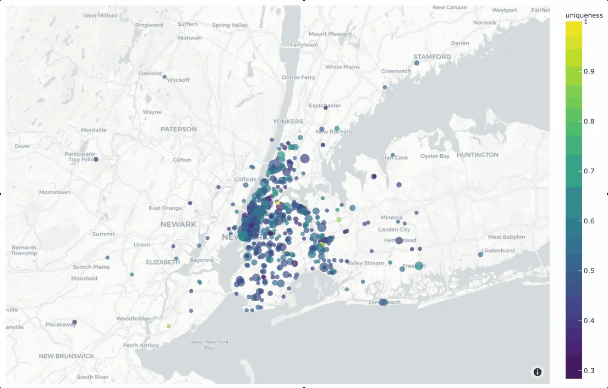
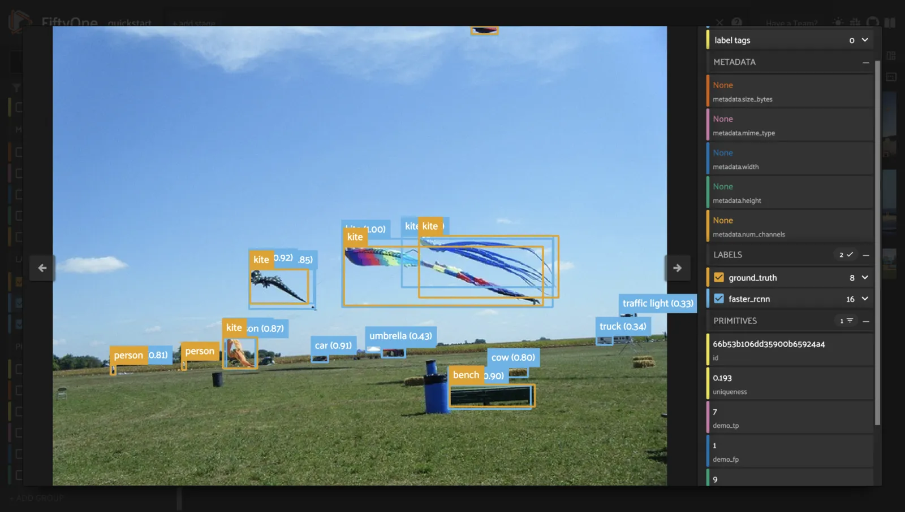
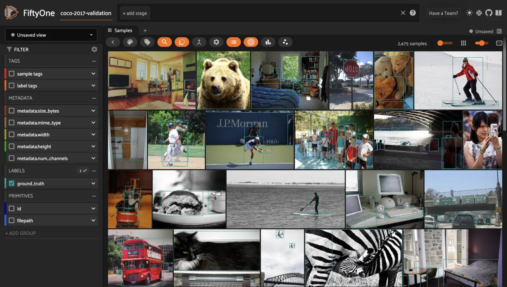

# FiftyOne [¶](\#fiftyone "Permalink to this headline")

**The open-source tool for building high-quality datasets and computer vision models**

Nothing hinders the success of machine learning systems more than poor quality
data. And without the right tools, improving a model can be time-consuming and
inefficient.

FiftyOne supercharges your machine learning workflows by enabling you to
visualize datasets and interpret models faster and more effectively.

Improving data quality and understanding your model’s failure modes are the
most impactful ways to boost the performance of your model.

FiftyOne provides the building blocks for optimizing your dataset analysis
pipeline. Use it to get hands-on with your data, including visualizing complex
labels, evaluating your models, exploring scenarios of interest, identifying
failure modes, finding annotation mistakes, and much more!

[Install FiftyOne!]( getting_started/basic/install.md)

FiftyOne integrates naturally with your favorite tools. Click on a logo to
learn how:

<div class="grid-3-col grid-images" markdown="1">

[](how_do_i/recipes/adding_detections.ipynb "PyTorch")

[](integrations/huggingface.md "Hugging Face")

[](integrations/ultralytics.md "Ultralytics")

[](integrations/super_gradients.md "SuperGradients")

[](how_do_i/recipes/adding_detections.ipynb "TensorFlow")

[](tutorials/detectron2.ipynb "Detectron2")

[](integrations/qdrant.md "Qdrant")

[](integrations/redis.md "Redis")

[](integrations/pinecone.md "Pinecone")

[](integrations/mongodb.md "MongoDB")

[](integrations/elasticsearch.md "Elasticsearch")

[](integrations/milvus.md "Milvus")

[](integrations/lancedb.md "LanceDB")

[](integrations/activitynet.md "ActivityNet")

[](integrations/coco.md "COCO")

[](integrations/open_images.md "Open Images")

[](fiftyone_concepts/running_environments/#notebooks "Jupyter")

[](fiftyone_concepts/running_environments.md#notebooks "Google Colab")

[](fiftyone_concepts/plots.md "Plotly")

[](integrations/cvat.md "CVAT")

[](integrations/labelstudio.md "Label Studio")

[](integrations/v7.md "V7")

[](https://github.com/segments-ai/segments-voxel51-plugin "Segments")

[](integrations/labelbox.md "Labelbox")

[](api/fiftyone.utils.scale.html "Scale AI")

[](teams/installation.md#google-cloud-storage "Google Cloud")

[](teams/installation.md#amazon-s3 "Amazon Web Services")

[](teams/installation.md#microsoft-azure "Azure")

</div><!--End LOGOS -->

Note

FiftyOne is growing!
[Sign up for the mailing list](https://share.hsforms.com/1zpJ60ggaQtOoVeBqIZdaaA2ykyk)
to learn about new features as they come out.

## Core Capabilities [¶](\#core-capabilities "Permalink to this headline")

### Curating datasets

Surveys show that machine learning engineers spend over half of their time wrangling data, but it doesn't have to be that way. Use FiftyOne's powerful dataset import and manipulation capabilities to manage your data with ease.

[Learn how to load data into FiftyOne](fiftyone_concepts/dataset_creation/index.md)


### Evaluating models

Aggregate metrics alone don’t give you the full picture of your ML models. In practice, the limiting factor on your model’s performance is often data quality issues that you need to see to address. FiftyOne makes it easy to do just that.

[See how to evaluate models with FiftyOne](tutorials/evaluate_detections.ipynb)


### Visualizing embeddings

Are you using embeddings to analyze your data and models? Use FiftyOne's embeddings visualization capabilities to reveal hidden structure in you data, mine hard samples, pre-annotate data, recommend new samples for annotation, and more.

[Experience the power of embeddings](tutorials/image_embeddings.ipynb)


### Working with geolocation

Many datasets have location metadata, but visualizing location-based datasets has traditionally required closed source or cloud-based tools. FiftyOne provides native support for storing, visualizing, and querying datasets by location.

[Visualize your location data](fiftyone_concepts/plots.md#geolocation-plots)



### Finding annotation mistakes

Annotations mistakes create an artificial ceiling on the performance of your model. However, finding these mistakes by hand is not feasible! Use FiftyOne to automatically identify possible label mistakes in your datasets.

[Check out the label mistakes tutorial](tutorials/classification_mistakes.ipynb)


### Removing redundant images

During model training, the best results will be seen when training on unique data. Use FiftyOne to automatically remove duplicate or near-duplicate images from your datasets and curate diverse training datasets from your raw data.

[Try the image uniqueness tutorial](tutorials/uniqueness.ipynb)


## Core Concepts [¶](\#core-concepts "Permalink to this headline")

### FiftyOne Library [¶](\#fiftyone-library "Permalink to this headline")

FiftyOne’s core library provides a structured yet dynamic representation to
explore your datasets. You can efficiently query and manipulate your dataset by
adding custom tags, model predictions and more.

[Explore the library](fiftyone_concepts/basics.md)

```python
import fiftyone as fo

dataset = fo.Dataset("my_dataset")

sample = fo.Sample(filepath="/path/to/image.png")
sample.tags.append("train")
sample["custom_field"] = 51

dataset.add_sample(sample)

view = dataset.match_tags("train").sort_by("custom_field").limit(10)

for sample in view:
    print(sample)

```

Note

FiftyOne is designed to be lightweight and flexible, making it easy to load
your datasets. FiftyOne supports loading datasets in a variety of common
formats out-of-the-box, and it also provides the extensibility to load
datasets in custom formats.

Check out [loading datasets](fiftyone_concepts/dataset_creation/index.md) to see
how to load your data into FiftyOne.

### FiftyOne App [¶](\#fiftyone-app "Permalink to this headline")

The FiftyOne App is a graphical user interface that makes it easy to explore
and rapidly gain intuition into your datasets. You can visualize labels like
bounding boxes and segmentations overlaid on the samples; sort, query and
slice your dataset into any subset of interest; and more.

[See more of the App](fiftyone_concepts/app.md)



### FiftyOne Brain [¶](\#fiftyone-brain "Permalink to this headline")

The FiftyOne Brain is a library of powerful machine learning-powered
capabilities that provide insights into your datasets and recommend ways to
modify your datasets that will lead to measurably better performance of your
models.

[Learn more about the Brain](fiftyone_concepts/brain.md)

```python
import fiftyone.brain as fob

fob.compute_uniqueness(dataset)
rank_view = dataset.sort_by("uniqueness")

```

### FiftyOne Plugins [¶](\#fiftyone-plugins "Permalink to this headline")

FiftyOne provides a powerful plugin framework that allows for extending and
customizing the functionality of the tool to suit your specific needs.

With plugins, you can add new functionality to the FiftyOne App, create
integrations with other tools and APIs, render custom panels, and add custom
buttons to menus.

With [FiftyOne Teams](teams/teams_plugins.md#teams-delegated-operations), you can even write
plugins that allow users to execute long-running tasks from within the App that
run on a connected compute cluster.

[Install some plugins!](plugins/index.md)


### Dataset Zoo [¶](\#dataset-zoo "Permalink to this headline")

The FiftyOne Dataset Zoo provides a powerful interface for downloading datasets
and loading them into FiftyOne.

It provides native access to dozens of popular benchmark datasets, and it als
supports downloading arbitrary public or private datasets whose
download/preparation methods are provided via GitHub repositories or URLs.

[Check out the Dataset Zoo](data/dataset_zoo/index.md)

```python
import fiftyone as fo
import fiftyone.zoo as foz

dataset = foz.load_zoo_dataset("coco-2017", split="validation")

session = fo.launch_app(dataset)

```



### Model Zoo [¶](\#model-zoo "Permalink to this headline")

The FiftyOne Model Zoo provides a powerful interface for downloading models and
applying them to your FiftyOne datasets.

It provides native access to hundreds of pre-trained models, and it also
supports downloading arbitrary public or private models whose definitions are
provided via GitHub repositories or URLs.

[Check out the Model Zoo](models/model_zoo/index.md)

```python
import fiftyone as fo
import fiftyone.zoo as foz

dataset = foz.load_zoo_dataset(
    "coco-2017",
    split="validation",
    max_samples=50,
    shuffle=True,
)

model = foz.load_zoo_model(
    "clip-vit-base32-torch",
    text_prompt="A photo of a",
    classes=["person", "dog", "cat", "bird", "car", "tree", "chair"],
)

dataset.apply_model(model, label_field="zero_shot_predictions")

session = fo.launch_app(dataset)

```

## What’s Next? [¶](\#what-s-next "Permalink to this headline")

Where should you go from here? You could…

- [Install FiftyOne](getting_started/basic/install.md#installing-fiftyone)

- Try one of the [tutorials](tutorials/index.md) that demonstrate the unique
capabilities of FiftyOne

- Explore [recipes](how_do_i/recipes/index.md) for integrating FiftyOne into
your current ML workflows

- Check out the [cheat sheets](how_do_i/cheat_sheets/index.md) for topics you may
want to master quickly

- Consult the [user guide](fiftyone_concepts/index.md) for detailed instructions on
how to accomplish various tasks with FiftyOne


## Need Support? [¶](\#need-support "Permalink to this headline")

If you run into any issues with FiftyOne or have any burning questions, feel
free to [connect with us on Discord](https://community.voxel51.com) or reach out to
us at [support@voxel51.com](mailto:support%40voxel51.com).

