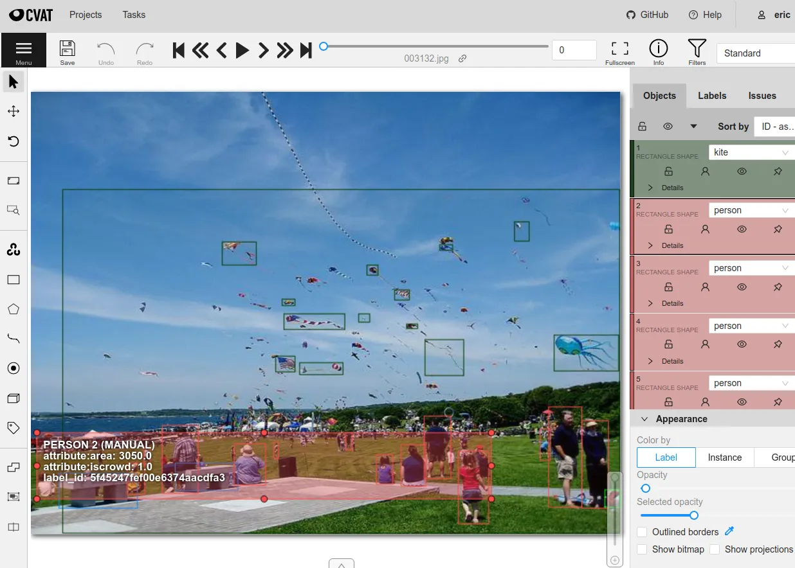
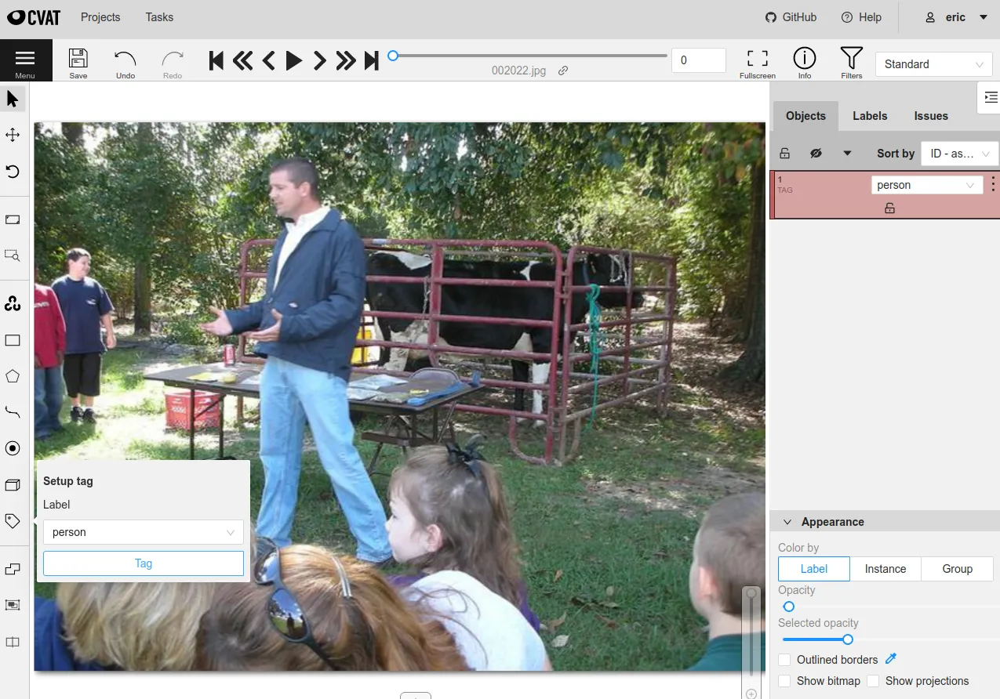
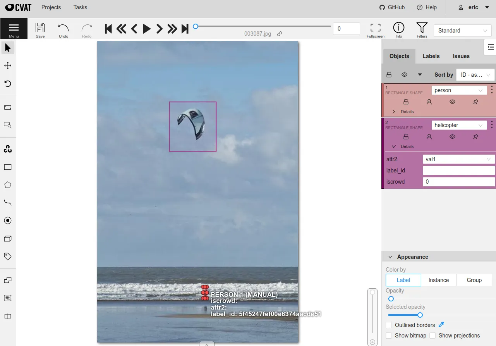
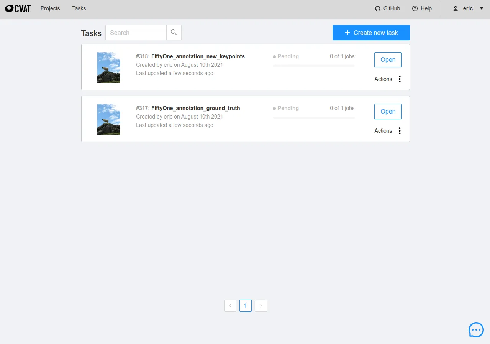
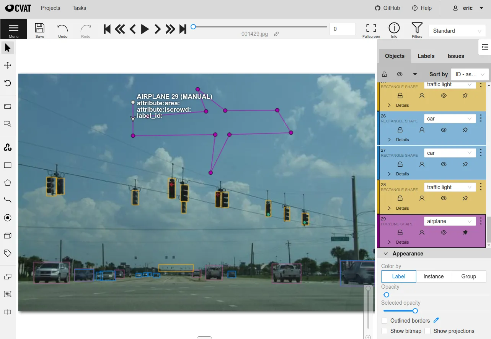
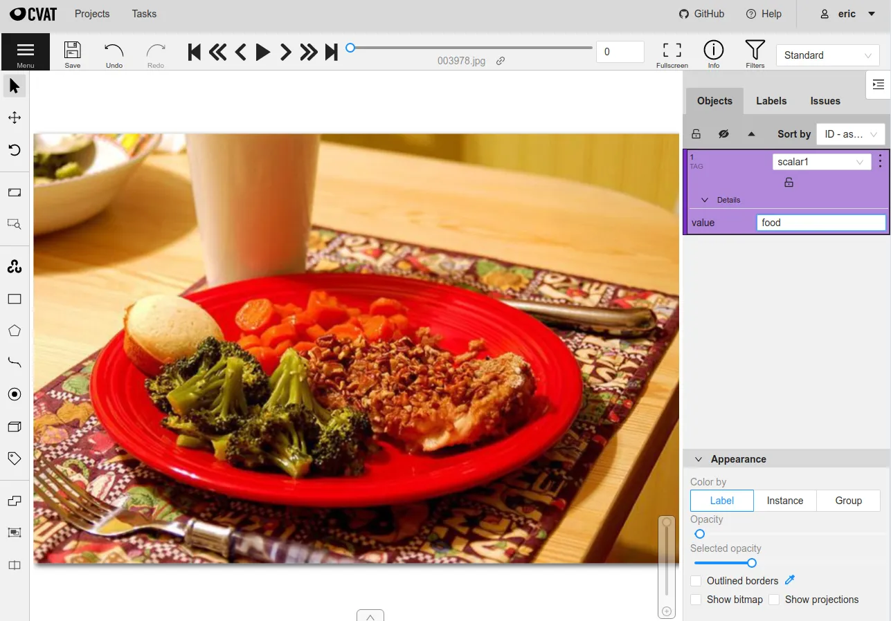
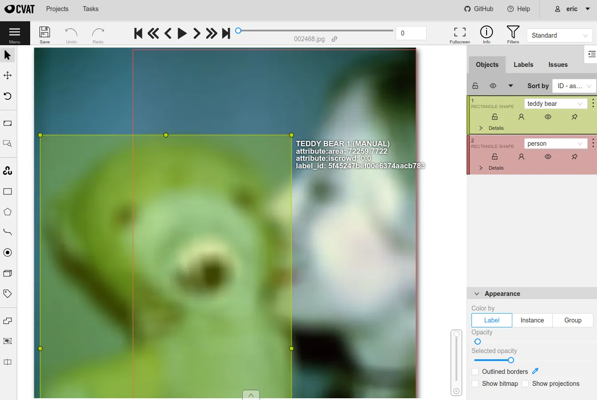
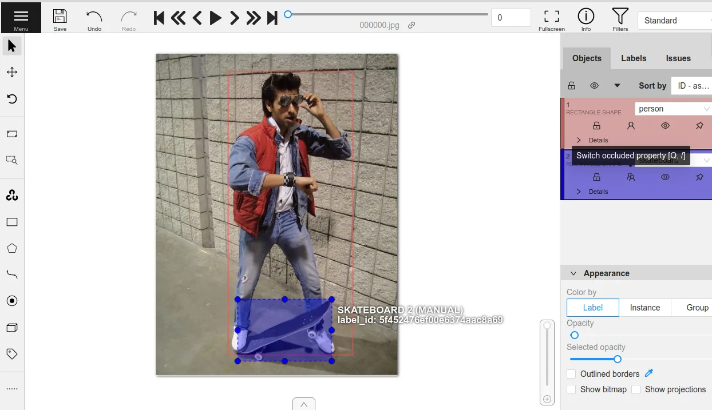
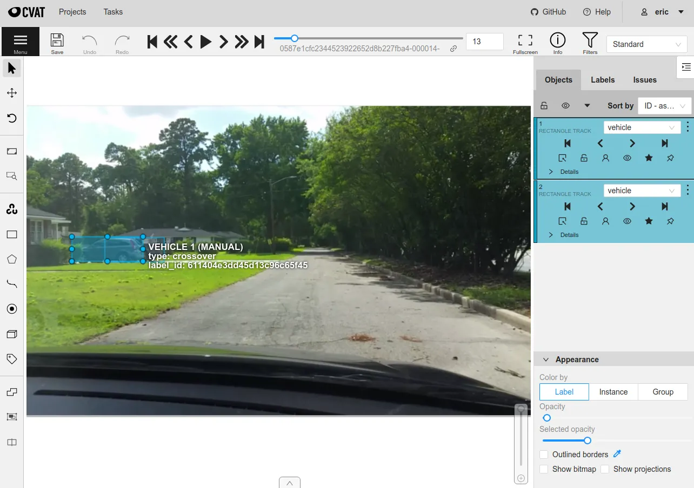

# CVAT Integration [¶](\#cvat-integration "Permalink to this headline")

[CVAT](https://github.com/opencv/cvat) is one of the most popular
open-source image and video annotation tools available, and we’ve made it easy
to upload your data directly from FiftyOne to CVAT to add or edit labels.

You can use CVAT either through the hosted server at
[app.cvat.ai](https://app.cvat.ai) or through a
[self-hosted server](https://opencv.github.io/cvat/docs/administration/basics/installation/).
In either case, FiftyOne provides [simple setup](#cvat-setup) instructions
that you can use to specify the necessary account credentials and server
endpoint to use.

Note

Did you know? You can request, manage, and import annotations from within
the FiftyOne App by installing the
[@voxel51/annotation](https://github.com/voxel51/fiftyone-plugins/tree/main/plugins/annotation)
plugin!

CVAT provides three levels of abstraction for annotation workflows: projects,
tasks, and jobs. A job contains one or more images and can be assigned to a
specific annotator or reviewer. A task defines the label schema to use for
annotation and contains one or more jobs. A project can optionally be created
to group multiple tasks together under a shared label schema.

FiftyOne provides an API to create tasks and jobs, upload data, define label
schemas, and download annotations using CVAT, all programmatically in Python.
All of the following label types are supported, for both image and video
datasets:

- [Classifications](../fiftyone_concepts/using_datasets.md#classification)

- [Detections](../fiftyone_concepts/using_datasets.md#object-detection)

- [Instance segmentations](../fiftyone_concepts/using_datasets.md#instance-segmentation)

- [Polygons and polylines](../fiftyone_concepts/using_datasets.md#polylines)

- [Keypoints](../fiftyone_concepts/using_datasets.md#keypoints)

- [Scalar fields](../fiftyone_concepts/using_datasets.md#adding-sample-fields)

- [Semantic segmentation](../fiftyone_concepts/using_datasets.md#semantic-segmentation)



Note

Check out [this tutorial](../tutorials/cvat_annotation.md) to see how
you can use FiftyOne to upload your data to CVAT to create, delete, and fix
annotations.

## Basic recipe [¶](\#basic-recipe "Permalink to this headline")

The basic workflow to use CVAT to add or edit labels on your FiftyOne datasets
is as follows:

1. Load a [labeled or unlabeled dataset](../fiftyone_concepts/dataset_creation/index.md#loading-datasets) into FiftyOne

2. Explore the dataset using the [App](../fiftyone_concepts/app.md#fiftyone-app) or
[dataset views](../fiftyone_concepts/using_views.md#using-views) to locate either unlabeled samples that
you wish to annotate or labeled samples whose annotations you want to edit

3. Use the
[`annotate()`](../api/fiftyone.core.collections.html#fiftyone.core.collections.SampleCollection.annotate "fiftyone.core.collections.SampleCollection.annotate")
method on your dataset or view to upload the samples and optionally their
existing labels to CVAT

4. In CVAT, perform the necessary annotation work

5. Back in FiftyOne, load your dataset and use the
[`load_annotations()`](../api/fiftyone.core.collections.html#fiftyone.core.collections.SampleCollection.load_annotations "fiftyone.core.collections.SampleCollection.load_annotations")
method to merge the annotations back into your FiftyOne dataset

6. If desired, delete the CVAT tasks and the record of the annotation run from
your FiftyOne dataset

The example below demonstrates this workflow.

Note

You must create an account at [app.cvat.ai](https://app.cvat.ai) in order to
run this example.

Note that you can store your credentials as described in
[this section](#cvat-setup) to avoid entering them manually each time
you interact with CVAT.

First, we create the annotation tasks in CVAT:

```python
import fiftyone as fo
import fiftyone.zoo as foz
from fiftyone import ViewField as F

# Step 1: Load your data into FiftyOne

dataset = foz.load_zoo_dataset(
    "quickstart", dataset_name="cvat-annotation-example"
)
dataset.persistent = True

dataset.evaluate_detections(
    "predictions", gt_field="ground_truth", eval_key="eval"
)

# Step 2: Locate a subset of your data requiring annotation

# Create a view that contains only high confidence false positive model
# predictions, with samples containing the most false positives first
most_fp_view = (
    dataset
    .filter_labels("predictions", (F("confidence") > 0.8) & (F("eval") == "fp"))
    .sort_by(F("predictions.detections").length(), reverse=True)
)

# Let's edit the ground truth annotations for the sample with the most
# high confidence false positives
sample_id = most_fp_view.first().id
view = dataset.select(sample_id)

# Step 3: Send samples to CVAT

# A unique identifier for this run
anno_key = "cvat_basic_recipe"

view.annotate(
    anno_key,
    label_field="ground_truth",
    attributes=["iscrowd"],
    launch_editor=True,
)
print(dataset.get_annotation_info(anno_key))

# Step 4: Perform annotation in CVAT and save the tasks

```

Then, once the annotation work is complete, we merge the annotations back into
FiftyOne:

```python
import fiftyone as fo

anno_key = "cvat_basic_recipe"

# Step 5: Merge annotations back into FiftyOne dataset

dataset = fo.load_dataset("cvat-annotation-example")
dataset.load_annotations(anno_key)

# Load the view that was annotated in the App
view = dataset.load_annotation_view(anno_key)
session = fo.launch_app(view=view)

# Step 6: Cleanup

# Delete tasks from CVAT
results = dataset.load_annotation_results(anno_key)
results.cleanup()

# Delete run record (not the labels) from FiftyOne
dataset.delete_annotation_run(anno_key)

```

Note

Skip to [this section](#cvat-examples) to see a variety of common CVAT
annotation patterns.

## Setup [¶](\#setup "Permalink to this headline")

FiftyOne supports both [app.cvat.ai](https://app.cvat.ai) and
[self-hosted servers](https://opencv.github.io/cvat/docs/administration/basics/installation/).

The easiest way to get started is to use the default server
[app.cvat.ai](https://app.cvat.ai), which simply requires creating an account and
then providing your authentication credentials as shown below.

Note

CVAT is the default annotation backend used by FiftyOne. However, if you
have changed your default backend, you can opt-in to using CVAT on a
one-off basis by passing the optional `backend` parameter to
[`annotate()`](../api/fiftyone.core.collections.html#fiftyone.core.collections.SampleCollection.annotate "fiftyone.core.collections.SampleCollection.annotate"):

```python
view.annotate(anno_key, backend="cvat", ...)

```

Refer to [these instructions](../fiftyone_concepts/annotation.md#annotation-setup) to see how to
permanently change your default backend.

### Authentication [¶](\#authentication "Permalink to this headline")

In order to connect to a CVAT server, you must provide your login credentials,
which can be done in a variety of ways.

**Environment variables (recommended)**

The recommended way to configure your CVAT login credentials is to store them
in the `FIFTYONE_CVAT_USERNAME` and `FIFTYONE_CVAT_PASSWORD` environment
variables. These are automatically accessed by FiftyOne whenever a connection
to CVAT is made.

```python
export FIFTYONE_CVAT_USERNAME=...
export FIFTYONE_CVAT_PASSWORD=...
export FIFTYONE_CVAT_EMAIL=...  # if applicable

```

**FiftyOne annotation config**

You can also store your credentials in your
[annotation config](../fiftyone_concepts/annotation.md#annotation-config) located at
`~/.fiftyone/annotation_config.json`:

```python
{
    "backends": {
        "cvat": {
            ...
            "username": ...,
            "password": ...,
            "email": ...  # if applicable
        }
    }
}

```

Note that this file will not exist until you create it.

Warning

Storing your username and password in plain text on disk is generally not
recommended. Consider using environment variables instead.

**Keyword arguments**

You can manually provide your login credentials as keyword arguments each time
you call methods like
[`annotate()`](../api/fiftyone.core.collections.html#fiftyone.core.collections.SampleCollection.annotate "fiftyone.core.collections.SampleCollection.annotate") and
[`load_annotations()`](../api/fiftyone.core.collections.html#fiftyone.core.collections.SampleCollection.load_annotations "fiftyone.core.collections.SampleCollection.load_annotations")
that require connections to CVAT:

```python
view.annotate(anno_key, ..., username=..., password=...)

```

**Command line prompt**

If you have not stored your login credentials via another method, you will be
prompted to enter them interactively in your shell each time you call a method
that requires a connection to CVAT:

```python
view.annotate(anno_key, label_field="ground_truth", launch_editor=True)

```

```python
Please enter your login credentials.
You can avoid this in the future by setting your `FIFTYONE_CVAT_USERNAME` and `FIFTYONE_CVAT_PASSWORD` environment variables.
Username: ...
Password: ...

```

### Self-hosted servers [¶](\#cvat-self-hosted-server "Permalink to this headline")

If you wish to use a
[self-hosted server](https://opencv.github.io/cvat/docs/administration/basics/installation/),
you can configure the URL of your server in any of the following ways:

- Set the `FIFTYONE_CVAT_URL` environment variable:

```python
export FIFTYONE_CVAT_URL=http://localhost:8080

```

- Store the `url` of your server in your
[annotation config](../fiftyone_concepts/annotation.md#annotation-config) at
`~/.fiftyone/annotation_config.json`:

```python
{
    "backends": {
        "cvat": {
            "url": "http://localhost:8080",
            ...
        }
    }
}

```

- Pass the `url` parameter manually each time you call
[`annotate()`](../api/fiftyone.core.collections.html#fiftyone.core.collections.SampleCollection.annotate "fiftyone.core.collections.SampleCollection.annotate"):

```python
view.annotate(anno_key, ..., url="http://localhost:8080")

```

If your self-hosted server requires additional headers in order to make HTTP
requests, you can provide them in either of the following ways:

- Store your custom headers in a `headers` key of your
[annotation config](../fiftyone_concepts/annotation.md#annotation-config) at
`~/.fiftyone/annotation_config.json`:

```python
{
    "backends": {
        "cvat": {
            ...
            "headers": {
                "<name>": "<value>",
                ...
            }
        }
    }
}

```

- Pass the `headers` parameter manually each time you call
[`annotate()`](../api/fiftyone.core.collections.html#fiftyone.core.collections.SampleCollection.annotate "fiftyone.core.collections.SampleCollection.annotate")
and
[`load_annotations()`](../api/fiftyone.core.collections.html#fiftyone.core.collections.SampleCollection.load_annotations "fiftyone.core.collections.SampleCollection.load_annotations"):

```python
view.annotate(anno_key, ... headers=...)
view.load_annotations(anno_key, ... headers=...)

```

## Requesting annotations [¶](\#requesting-annotations "Permalink to this headline")

Use the
[`annotate()`](../api/fiftyone.core.collections.html#fiftyone.core.collections.SampleCollection.annotate "fiftyone.core.collections.SampleCollection.annotate") method
to send the samples and optionally existing labels in a [`Dataset`](../api/fiftyone.core.dataset.html#fiftyone.core.dataset.Dataset "fiftyone.core.dataset.Dataset") or
[`DatasetView`](../api/fiftyone.core.view.html#fiftyone.core.view.DatasetView "fiftyone.core.view.DatasetView") to CVAT for annotation.

The basic syntax is:

```python
anno_key = "..."
view.annotate(anno_key, ...)

```

The `anno_key` argument defines a unique identifier for the annotation run, and
you will provide it to methods like
[`load_annotations()`](../api/fiftyone.core.collections.html#fiftyone.core.collections.SampleCollection.load_annotations "fiftyone.core.collections.SampleCollection.load_annotations"),
[`get_annotation_info()`](../api/fiftyone.core.collections.html#fiftyone.core.collections.SampleCollection.load_annotations "fiftyone.core.collections.SampleCollection.load_annotations"),
[`load_annotation_results()`](../api/fiftyone.core.collections.html#fiftyone.core.collections.SampleCollection.load_annotation_results "fiftyone.core.collections.SampleCollection.load_annotation_results"),
[`rename_annotation_run()`](../api/fiftyone.core.collections.html#fiftyone.core.collections.SampleCollection.rename_annotation_run "fiftyone.core.collections.SampleCollection.rename_annotation_run"), and
[`delete_annotation_run()`](../api/fiftyone.core.collections.html#fiftyone.core.collections.SampleCollection.delete_annotation_run "fiftyone.core.collections.SampleCollection.delete_annotation_run")
to manage the run in the future.

Warning

FiftyOne assumes that all labels in an annotation run can fit in memory.

If you are annotating very large scale video datasets with dense frame
labels, you may violate this assumption. Instead, consider breaking the
work into multiple smaller annotation runs that each contain limited
subsets of the samples you wish to annotate.

You can use [`Dataset.stats()`](../api/fiftyone.core.dataset.html#fiftyone.core.dataset.Dataset.stats "fiftyone.core.dataset.Dataset.stats")
to get a sense for the total size of the labels in a dataset as a rule of
thumb to estimate the size of a candidate annotation run.

In addition,
[`annotate()`](../api/fiftyone.core.collections.html#fiftyone.core.collections.SampleCollection.annotate "fiftyone.core.collections.SampleCollection.annotate")
provides various parameters that you can use to customize the annotation tasks
that you wish to be performed.

The following parameters are supported by all annotation backends:

- **backend** ( _None_): the annotation backend to use. Use `"cvat"` for the
CVAT backend. The supported values are
`fiftyone.annotation_config.backends.keys()` and the default is
`fiftyone.annotation_config.default_backend`

- **media\_field** ( _“filepath”_): the sample field containing the path to the
source media to upload

- **launch\_editor** ( _False_): whether to launch the annotation backend’s
editor after uploading the samples

The following parameters allow you to configure the labeling schema to use for
your annotation tasks. See [this section](#cvat-label-schema) for more
details:

- **label\_schema** ( _None_): a dictionary defining the label schema to use.
If this argument is provided, it takes precedence over `label_field` and
`label_type`

- **label\_field** ( _None_): a string indicating a new or existing label field
to annotate

- **label\_type** ( _None_): a string indicating the type of labels to
annotate. The possible label types are:

  - `"classification"`: a single classification stored in
    [`Classification`](../api/fiftyone.core.labels.html#fiftyone.core.labels.Classification "fiftyone.core.labels.Classification") fields

  - `"classifications"`: multilabel classifications stored in
    [`Classifications`](../api/fiftyone.core.labels.html#fiftyone.core.labels.Classifications "fiftyone.core.labels.Classifications") fields

  - `"detections"`: object detections stored in [`Detections`](../api/fiftyone.core.labels.html#fiftyone.core.labels.Detections "fiftyone.core.labels.Detections") fields

  - `"instances"`: instance segmentations stored in [`Detections`](../api/fiftyone.core.labels.html#fiftyone.core.labels.Detections "fiftyone.core.labels.Detections") fields
    with their [`mask`](../api/fiftyone.core.labels.html#fiftyone.core.labels.Detection.mask "fiftyone.core.labels.Detection.mask")
    attributes populated

  - `"polylines"`: polylines stored in [`Polylines`](../api/fiftyone.core.labels.html#fiftyone.core.labels.Polylines "fiftyone.core.labels.Polylines") fields with their
    [`filled`](../api/fiftyone.core.labels.html#fiftyone.core.labels.Polyline.filled "fiftyone.core.labels.Polyline.filled") attributes set to
    `False`

  - `"polygons"`: polygons stored in [`Polylines`](../api/fiftyone.core.labels.html#fiftyone.core.labels.Polylines "fiftyone.core.labels.Polylines") fields with their
    [`filled`](../api/fiftyone.core.labels.html#fiftyone.core.labels.Polyline.filled "fiftyone.core.labels.Polyline.filled") attributes set to
    `True`

  - `"keypoints"`: keypoints stored in [`Keypoints`](../api/fiftyone.core.labels.html#fiftyone.core.labels.Keypoints "fiftyone.core.labels.Keypoints") fields

  - `"segmentation"`: semantic segmentations stored in [`Segmentation`](../api/fiftyone.core.labels.html#fiftyone.core.labels.Segmentation "fiftyone.core.labels.Segmentation")
    fields

  - `"scalar"`: scalar labels stored in [`IntField`](../api/fiftyone.core.fields.html#fiftyone.core.fields.IntField "fiftyone.core.fields.IntField"), [`FloatField`](../api/fiftyone.core.fields.html#fiftyone.core.fields.FloatField "fiftyone.core.fields.FloatField"),
    [`StringField`](../api/fiftyone.core.fields.html#fiftyone.core.fields.StringField "fiftyone.core.fields.StringField"), or [`BooleanField`](../api/fiftyone.core.fields.html#fiftyone.core.fields.BooleanField "fiftyone.core.fields.BooleanField") fields

All new label fields must have their type specified via this argument or in
`label_schema`

- **classes** ( _None_): a list of strings indicating the class options for
`label_field` or all fields in `label_schema` without classes specified.
All new label fields must have a class list provided via one of the
supported methods. For existing label fields, if classes are not provided
by this argument nor `label_schema`, the observed labels on your dataset
are used

- **attributes** ( _True_): specifies the label attributes of each label field
to include (other than their `label`, which is always included) in the
annotation export. Can be any of the following:

  - `True`: export all label attributes

  - `False`: don’t export any custom label attributes

  - a list of label attributes to export

  - a dict mapping attribute names to dicts specifying the `type`,
    `values`, and `default` for each attribute

If a `label_schema` is also provided, this parameter determines which
attributes are included for all fields that do not explicitly define their
per-field attributes (in addition to any per-class attributes)

- **mask\_targets** ( _None_): a dict mapping pixel values to semantic label
strings. Only applicable when annotating semantic segmentations

- **allow\_additions** ( _True_): whether to allow new labels to be added. Only
applicable when editing existing label fields

- **allow\_deletions** ( _True_): whether to allow labels to be deleted. Only
applicable when editing existing label fields

- **allow\_label\_edits** ( _True_): whether to allow the `label` attribute of
existing labels to be modified. Only applicable when editing existing
fields with `label` attributes

- **allow\_index\_edits** ( _True_): whether to allow the `index` attribute
of existing video tracks to be modified. Only applicable when editing
existing frame fields with `index` attributes

- **allow\_spatial\_edits** ( _True_): whether to allow edits to the spatial
properties (bounding boxes, vertices, keypoints, masks, etc) of labels.
Only applicable when editing existing spatial label fields

In addition, the following CVAT-specific parameters from
[`CVATBackendConfig`](../api/fiftyone.utils.cvat.html#fiftyone.utils.cvat.CVATBackendConfig "fiftyone.utils.cvat.CVATBackendConfig") can also be
provided:

- **task\_size** ( _None_): an optional maximum number of images to upload per
task. Videos are always uploaded one per task

- **segment\_size** ( _None_): the maximum number of images to upload per job.
Not applicable to videos

- **image\_quality** ( _75_): an int in `[0, 100]` determining the image
quality to upload to CVAT

- **use\_cache** ( _True_): whether to use a cache when uploading data. Using a
cache reduces task creation time as data will be processed on-the-fly and
stored in the cache when requested

- **use\_zip\_chunks** ( _True_): when annotating videos, whether to upload
video frames in smaller chunks. Setting this option to `False` may result
in reduced video quality in CVAT due to size limitations on ZIP files that
can be uploaded to CVAT

- **chunk\_size** ( _None_): the number of frames to upload per ZIP chunk

- **task\_assignee** ( _None_): the username to assign the generated tasks.
This argument can be a list of usernames when annotating videos as each
video is uploaded to a separate task

- **job\_assignees** ( _None_): a list of usernames to assign jobs

- **job\_reviewers** ( _None_): a list of usernames to assign job reviews. Only
available in CVAT v1 servers

- **project\_name** ( _None_): an optional project name to which to upload the
created CVAT task. If a project with this name exists, it will be used,
otherwise a new project is created. By default, no project is used

- **project\_id** ( _None_): an optional ID of an existing CVAT project to
which to upload the annotation tasks. By default, no project is used

- **task\_name** (None): an optional task name to use for the created CVAT task

- **occluded\_attr** ( _None_): an optional attribute name containing existing
occluded values and/or in which to store downloaded occluded values for all
objects in the annotation run

- **group\_id\_attr** ( _None_): an optional attribute name containing existing
group ids and/or in which to store downloaded group ids for all objects in
the annotation run

- **issue\_tracker** ( _None_): URL(s) of an issue tracker to link to the
created task(s). This argument can be a list of URLs when annotating videos
or when using `task_size` and generating multiple tasks

- **organization** ( _None_): the name of the organization to use when sending
requests to CVAT

- **frame\_start** ( _None_): nonnegative integer(s) defining the first frame
of videos to upload when creating video tasks. Supported values are:

  - `integer`: the first frame to upload for each video

  - `list`: a list of first frame integers corresponding to videos in the
    given samples

  - `dict`: a dictionary mapping sample filepaths to first frame integers
    to use for the corresponding videos
- **frame\_stop** ( _None_): nonnegative integer(s) defining the last frame of
videos to upload when creating video tasks. Supported values are:

  - `integer`: the last frame to upload for each video

  - `list`: a list of last frame integers corresponding to videos in the
    given samples

  - `dict`: a dictionary mapping sample filepaths to last frame integers to
    use for the corresponding videos
- **frame\_step** ( _None_): positive integer(s) defining which frames to
sample when creating video tasks. Supported values are:

  - `integer`: the frame step to apply to each video task

  - `list`: a list of frame step integers corresponding to videos in the
    given samples

  - `dict`: a dictionary mapping sample filepaths to frame step integers to
    use for the corresponding videos

Note that this argument cannot be provided when uploading existing tracks

### Label schema [¶](\#label-schema "Permalink to this headline")

The `label_schema`, `label_field`, `label_type`, `classes`, `attributes`, and
`mask_targets` parameters to
[`annotate()`](../api/fiftyone.core.collections.html#fiftyone.core.collections.SampleCollection.annotate "fiftyone.core.collections.SampleCollection.annotate") allow
you to define the annotation schema that you wish to be used.

The label schema may define new label field(s) that you wish to populate, and
it may also include existing label field(s), in which case you can add, delete,
or edit the existing labels on your FiftyOne dataset.

The `label_schema` argument is the most flexible way to define how to construct
tasks in CVAT. In its most verbose form, it is a dictionary that defines the
label type, annotation type, possible classes, and possible attributes for each
label field:

```python
anno_key = "..."

label_schema = {
    "new_field": {
        "type": "classifications",
        "classes": ["class1", "class2"],
        "attributes": {
            "attr1": {
                "type": "select",
                "values": ["val1", "val2"],
                "default": "val1",
            },
            "attr2": {
                "type": "radio",
                "values": [True, False],
                "default": False,
            }
        },
    },
    "existing_field": {
        "classes": ["class3", "class4"],
        "attributes": {
            "attr3": {
                "type": "text",
            }
        }
    },
}

dataset.annotate(anno_key, label_schema=label_schema)

```

You can also define class-specific attributes by setting elements of the
`classes` list to dicts that specify groups of `classes` and their
corresponding `attributes`. For example, in the configuration below, `attr1`
only applies to `class1` and `class2` while `attr2` applies to all classes:

```python
anno_key = "..."

label_schema = {
    "new_field": {
        "type": "detections",
        "classes": [\
            {\
                "classes": ["class1", "class2"],\
                "attributes": {\
                    "attr1": {\
                        "type": "select",\
                        "values": ["val1", "val2"],\
                        "default": "val1",\
                    }\
                 }\
            },\
            "class3",\
            "class4",\
        ],
        "attributes": {
            "attr2": {
                "type": "radio",
                "values": [True, False],
                "default": False,
            }
        },
    },
}

dataset.annotate(anno_key, label_schema=label_schema)

```

Alternatively, if you are only editing or creating a single label field, you
can use the `label_field`, `label_type`, `classes`, `attributes`, and
`mask_targets` parameters to specify the components of the label schema
individually:

```python
anno_key = "..."

label_field = "new_field",
label_type = "classifications"
classes = ["class1", "class2"]

# These are optional
attributes = {
    "attr1": {
        "type": "select",
        "values": ["val1", "val2"],
        "default": "val1",
    },
    "attr2": {
        "type": "radio",
        "values": [True, False],
        "default": False,
    }
}

dataset.annotate(
    anno_key,
    label_field=label_field,
    label_type=label_type,
    classes=classes,
    attributes=attributes,
)

```

When you are annotating existing label fields, you can omit some of these
parameters from
[`annotate()`](../api/fiftyone.core.collections.html#fiftyone.core.collections.SampleCollection.annotate "fiftyone.core.collections.SampleCollection.annotate"), as
FiftyOne can infer the appropriate values to use:

- **label\_type**: if omitted, the [`Label`](../api/fiftyone.core.labels.html#fiftyone.core.labels.Label "fiftyone.core.labels.Label") type of the field will be used to
infer the appropriate value for this parameter

- **classes**: if omitted for a non-semantic segmentation field, the observed
labels on your dataset will be used to construct a classes list

### Label attributes [¶](\#label-attributes "Permalink to this headline")

The `attributes` parameter allows you to configure whether
[custom attributes](../fiftyone_concepts/using_datasets.md#using-labels) beyond the default `label` attribute
are included in the annotation tasks.

When adding new label fields for which you want to include attributes, you must
use the dictionary syntax demonstrated below to define the schema of each
attribute that you wish to label:

```python
anno_key = "..."

attributes = {
    "is_truncated": {
        "type": "radio",
        "values": [True, False],
        "default": False,
    },
    "gender": {
        "type": "select",
        "values": ["male", "female"],
    },
    "caption": {
        "type": "text",
    }
}

view.annotate(
    anno_key,
    label_field="new_field",
    label_type="detections",
    classes=["dog", "cat", "person"],
    attributes=attributes,
)

```

You can always omit this parameter if you do not require attributes beyond the
default `label`.

For CVAT, the following `type` values are supported:

- `text`: a free-form text box. In this case, `default` is optional and
`values` is unused

- `select`: a selection dropdown. In this case, `values` is required and
`default` is optional

- `radio`: a radio button list UI. In this case, `values` is required and
`default` is optional

- `checkbox`: a boolean checkbox UI. In this case, `default` is optional and
`values` is unused

- `occluded`: CVAT’s builtin occlusion toggle icon. This widget type can only
be specified for at most one attribute, which must be a boolean

- `group_id`: CVAT’s grouping capabilities. This attribute type can only
be specified for at most one attribute, which must be an integer

When you are annotating existing label fields, the `attributes` parameter can
take additional values:

- `True` (default): export all custom attributes observed on the existing
labels, using their observed values to determine the appropriate UI type
and possible values, if applicable

- `False`: do not include any custom attributes in the export

- a list of custom attributes to include in the export

- a full dictionary syntax described above

Note that only scalar-valued label attributes are supported. Other attribute
types like lists, dictionaries, and arrays will be omitted.

### Restricting additions, deletions, and edits [¶](\#restricting-additions-deletions-and-edits "Permalink to this headline")

When you create annotation runs that involve editing existing label fields, you
can optionally specify that certain changes are not allowed by passing the
following flags to
[`annotate()`](../api/fiftyone.core.collections.html#fiftyone.core.collections.SampleCollection.annotate "fiftyone.core.collections.SampleCollection.annotate"):

- **allow\_additions** ( _True_): whether to allow new labels to be added

- **allow\_deletions** ( _True_): whether to allow labels to be deleted

- **allow\_label\_edits** ( _True_): whether to allow the `label` attribute to
be modified

- **allow\_index\_edits** ( _True_): whether to allow the `index` attribute of
video tracks to be modified

- **allow\_spatial\_edits** ( _True_): whether to allow edits to the spatial
properties (bounding boxes, vertices, keypoints, etc) of labels

If you are using the `label_schema` parameter to provide a full annotation
schema to
[`annotate()`](../api/fiftyone.core.collections.html#fiftyone.core.collections.SampleCollection.annotate "fiftyone.core.collections.SampleCollection.annotate"), you
can also directly include the above flags in the configuration dicts for any
existing label field(s) you wish.

For example, suppose you have an existing `ground_truth` field that contains
objects of various types and you would like to add new `sex` and `age`
attributes to all people in this field while also strictly enforcing that no
objects can be added, deleted, or have their labels or bounding boxes modified.
You can configure an annotation run for this as follows:

```python
anno_key = "..."

attributes = {
    "sex": {
        "type": "select",
        "values": ["male", "female"],
    },
    "age": {
        "type": "text",
    },
}

view.annotate(
    anno_key,
    label_field="ground_truth",
    classes=["person"],
    attributes=attributes,
    allow_additions=False,
    allow_deletions=False,
    allow_label_edits=False,
    allow_spatial_edits=False,
)

```

You can also include a `read_only=True` parameter when uploading existing
label attributes to specify that the attribute’s value should be uploaded to
the annotation backend for informational purposes, but any edits to the
attribute’s value should not be imported back into FiftyOne.

For example, if you have vehicles with their `make` attribute populated and you
want to populate a new `model` attribute based on this information without
allowing changes to the vehicle’s `make`, you can configure an annotation run
for this as follows:

```python
anno_key = "..."

attributes = {
    "make": {
        "type": "text",
        "read_only": True,
    },
    "model": {
        "type": "text",
    },
}

view.annotate(
    anno_key,
    label_field="ground_truth",
    classes=["vehicle"],
    attributes=attributes,
)

```

Note that, if you use CVAT projects to organize your annotation tasks, the
above restrictions must be manually re-specified in your call to
[`annotate()`](../api/fiftyone.core.collections.html#fiftyone.core.collections.SampleCollection.annotate "fiftyone.core.collections.SampleCollection.annotate") for
each annotation task that you add to an existing project, since CVAT does not
provide support for these settings natively.

Warning

The CVAT backend does not support restrictions to additions, deletions,
spatial edits, and read-only attributes in its editing interface.

However, any restrictions that you specify via the above parameters will
still be enforced when you call
[`load_annotations()`](../api/fiftyone.core.collections.html#fiftyone.core.collections.SampleCollection.load_annotations "fiftyone.core.collections.SampleCollection.load_annotations")
to merge the annotations back into FiftyOne.

**IMPORTANT**: When uploading existing labels to CVAT, the `id` of the
labels in FiftyOne are stored in a `label_id` attribute of the CVAT shapes.
If a `label_id` is modified in CVAT, then FiftyOne may not be able to merge
the annotation with its existing [`Label`](../api/fiftyone.core.labels.html#fiftyone.core.labels.Label "fiftyone.core.labels.Label") instance; it must instead delete
the existing label and create a new [`Label`](../api/fiftyone.core.labels.html#fiftyone.core.labels.Label "fiftyone.core.labels.Label") with the shape’s contents. In
such cases, if `allow_additions` and/or `allow_deletions` were set to
`False` on the annotation schema, this can result in CVAT edits being
rejected. See [this section](#cvat-limitations) for details.

### Labeling videos [¶](\#labeling-videos "Permalink to this headline")

When annotating spatiotemporal objects in videos, you have a few additional
options at your fingertips.

First, each object attribute specification can include a `mutable` property
that controls whether the attribute’s value can change between frames for each
object:

```python
anno_key = "..."

attributes = {
    "type": {
        "type": "select",
        "values": ["sedan", "suv", "truck"],
        "mutable": False,
    },
    "visible_license_plate": {
        "type": "radio",
        "values": [True, False],
        "default": False,
        "mutable": True,
    },
}

view.annotate(
    anno_key,
    label_field="frames.new_field",
    label_type="detections",
    classes=["vehicle"],
    attributes=attributes,
)

```

The meaning of the `mutable` attribute is defined as follows:

- `True` (default): the attribute is dynamic and can have a different value
for every frame in which the object track appears

- `False`: the attribute is static and is the same for every frame in which
the object track appears

In addition, note that when you
[download annotation runs](#cvat-loading-annotations) that include track
annotations, the downloaded label corresponding to each keyframe of an object
track will have its `keyframe=True` attribute set to denote that it was a
keyframe.

Similarly, when you create an annotation run on a video dataset that involves
editing existing video tracks, if at least one existing label has its
`keyframe=True` attribute populated, then the available keyframe information
will be uploaded to CVAT.

Note

See [this section](#cvat-annotating-videos) for video annotation
examples!

Warning

When uploading existing labels to CVAT, the `id` of the labels in FiftyOne
are stored in a `label_id` attribute of the CVAT shapes.

**IMPORTANT**: If a `label_id` is modified in CVAT, then FiftyOne may not
be able to merge the annotation with its existing [`Label`](../api/fiftyone.core.labels.html#fiftyone.core.labels.Label "fiftyone.core.labels.Label") instance; in such
cases, it must instead delete the existing label and create a new [`Label`](../api/fiftyone.core.labels.html#fiftyone.core.labels.Label "fiftyone.core.labels.Label")
with the shape’s contents. See [this section](#cvat-limitations) for
details.

### CVAT limitations [¶](\#cvat-limitations "Permalink to this headline")

When uploading existing labels to CVAT, FiftyOne uses two sources of provenance
to associate [`Label`](../api/fiftyone.core.labels.html#fiftyone.core.labels.Label "fiftyone.core.labels.Label") instances in FiftyOne with their corresponding CVAT
shapes:

- The `id` of each [`Label`](../api/fiftyone.core.labels.html#fiftyone.core.labels.Label "fiftyone.core.labels.Label") is stored in a `label_id` attribute of the CVAT
shape. When importing annotations from CVAT back into FiftyOne, if the
`label_id` of a shape matches the ID of a label that was included in the
annotation run, the shape will be merged into the existing [`Label`](../api/fiftyone.core.labels.html#fiftyone.core.labels.Label "fiftyone.core.labels.Label")

- FiftyOne also maintains a mapping between [`Label`](../api/fiftyone.core.labels.html#fiftyone.core.labels.Label "fiftyone.core.labels.Label") IDs and the internal
CVAT shape IDs that are created when the CVAT tasks are created. If, during
download, a CVAT shape whose `label_id` has been deleted or otherwise
modified and doesn’t match an existing label ID _but does have_ a
recognized CVAT ID is encountered, this shape will be merged into the
existing [`Label`](../api/fiftyone.core.labels.html#fiftyone.core.labels.Label "fiftyone.core.labels.Label")

Unfortunately,
[CVAT does not guarantee](https://github.com/opencv/cvat/issues/893#issuecomment-578020576)
that its internal IDs are immutable. Thus, if both the `label_id` attribute and
(unknown to the user) the internal CVAT ID of a shape are both modified,
merging the shape with its source [`Label`](../api/fiftyone.core.labels.html#fiftyone.core.labels.Label "fiftyone.core.labels.Label") is impossible.

CVAT automatically clears/edits all attributes of a shape, including the
`label_id` attribute, in the following cases:

- When using a label schema with
[per-class attributes](#cvat-label-schema), all attributes of a shape
are cleared whenever the class label of the shape is changed to a class
whose attribute schema differs from the previous class. The recommended
workaround in this case is to manually copy the `label_id` before changing
the class and then pasting it back to ensure that the ID doesn’t change.

- When splitting or merging video tracks, CVAT may clear or duplicate the
shape’s attributes during the process. If this results in missing or
duplicate `label_id` values, then, although FiftyOne will gracefully
proceed with the import, provenance has still been lost and thus existing
[`Label`](../api/fiftyone.core.labels.html#fiftyone.core.labels.Label "fiftyone.core.labels.Label") instances whose IDs no longer exist must be deleted and replaced
with newly created [`Label`](../api/fiftyone.core.labels.html#fiftyone.core.labels.Label "fiftyone.core.labels.Label") instances.

The primary issues that can arise due to modified/deleted `label_id` attributes
are:

- If the original [`Label`](../api/fiftyone.core.labels.html#fiftyone.core.labels.Label "fiftyone.core.labels.Label") in FiftyOne contained additional attributes that
weren’t included in the CVAT annotation run, then those attributes will be
lost whenever loading annotations requires deleting the existing label and
creating a new one.

- When working with annotation schemas that specify
[edit restrictions](#cvat-restricting-edits), CVAT edits that cause
`label_id` changes may need to be rejected. For example, if
`allow_additions` and `allow_deletions` are set to `False` and editing a
CVAT shape’s class label causes its attributes to be cleared, then this
change will be rejected by FiftyOne because it would require both deleting
an existing label and creating a new one.

Note

**Pro tip**: If you are editing existing labels and only uploading a subset
of their attributes to CVAT,
[restricting label deletions](#cvat-restricting-edits) by setting
`allow_deletions=False` provides a helpful guarantee that no labels will be
deleted if label provenance snafus occur in CVAT.

Note

**Pro tip**: When working with annotation schemas that include
[per-class attributes](#cvat-label-schema), be sure that any class
label changes that you would reasonably make all share the same attribute
schemas so that unwanted `label_id` changes are not caused by CVAT.

If a schema-altering class change must occur, remember to manually copy the
`label_id` before making the change and then paste it back to ensure that
the ID doesn’t change.

## Loading annotations [¶](\#loading-annotations "Permalink to this headline")

After your annotations tasks in the annotation backend are complete, you can
use the
[`load_annotations()`](../api/fiftyone.core.collections.html#fiftyone.core.collections.SampleCollection.load_annotations "fiftyone.core.collections.SampleCollection.load_annotations")
method to download them and merge them back into your FiftyOne dataset.

```python
view.load_annotations(anno_key)

```

The `anno_key` parameter is the unique identifier for the annotation run that
you provided when calling
[`annotate()`](../api/fiftyone.core.collections.html#fiftyone.core.collections.SampleCollection.annotate "fiftyone.core.collections.SampleCollection.annotate"). You
can use
[`list_annotation_runs()`](../api/fiftyone.core.collections.html#fiftyone.core.collections.SampleCollection.list_annotation_runs "fiftyone.core.collections.SampleCollection.list_annotation_runs")
to see the available keys on a dataset.

Note

By default, calling
[`load_annotations()`](../api/fiftyone.core.collections.html#fiftyone.core.collections.SampleCollection.load_annotations "fiftyone.core.collections.SampleCollection.load_annotations")
will not delete any information for the run from the annotation backend.

However, you can pass `cleanup=True` to delete all information associated
with the run from the backend after the annotations are downloaded.

You can use the optional `dest_field` parameter to override the task’s
label schema and instead load annotations into different field name(s) of your
dataset. This can be useful, for example, when editing existing annotations, if
you would like to do a before/after comparison of the edits that you import. If
the annotation run involves multiple fields, `dest_field` should be a
dictionary mapping label schema field names to destination field names.

Note that CVAT cannot explicitly prevent annotators from creating labels that
don’t obey the run’s label schema. However, you can pass the optional
`unexpected` parameter to
[`load_annotations()`](../api/fiftyone.core.collections.html#fiftyone.core.collections.SampleCollection.load_annotations "fiftyone.core.collections.SampleCollection.load_annotations")
to configure how to deal with any such unexpected labels that are found. The
supported values are:

- `"prompt"` ( **default**): present an interactive prompt to direct/discard
unexpected labels

- `"ignore"`: automatically ignore any unexpected labels

- `"keep"`: automatically keep all unexpected labels in a field whose name
matches the the label type

- `"return"`: return a dict containing all unexpected labels, if any

See [this section](#cvat-unexpected-annotations) for more details.

## Managing annotation runs [¶](\#managing-annotation-runs "Permalink to this headline")

FiftyOne provides a variety of methods that you can use to manage in-progress
or completed annotation runs.

For example, you can call
[`list_annotation_runs()`](../api/fiftyone.core.collections.html#fiftyone.core.collections.SampleCollection.list_annotation_runs "fiftyone.core.collections.SampleCollection.list_annotation_runs")
to see the available annotation keys on a dataset:

```python
dataset.list_annotation_runs()

```

Or, you can use
[`get_annotation_info()`](../api/fiftyone.core.collections.html#fiftyone.core.collections.SampleCollection.get_annotation_info "fiftyone.core.collections.SampleCollection.get_annotation_info")
to retrieve information about the configuration of an annotation run:

```python
info = dataset.get_annotation_info(anno_key)
print(info)

```

Use [`load_annotation_results()`](../api/fiftyone.core.collections.html#fiftyone.core.collections.SampleCollection.load_annotation_results "fiftyone.core.collections.SampleCollection.load_annotation_results")
to load the [`AnnotationResults`](../api/fiftyone.utils.annotations.html#fiftyone.utils.annotations.AnnotationResults "fiftyone.utils.annotations.AnnotationResults")
instance for an annotation run.

All results objects provide a [`cleanup()`](../api/fiftyone.utils.annotations.html#fiftyone.utils.annotations.AnnotationResults.cleanup "fiftyone.utils.annotations.AnnotationResults.cleanup")
method that you can use to delete all information associated with a run from
the annotation backend.

```python
results = dataset.load_annotation_results(anno_key)
results.cleanup()

```

In addition, the
[`AnnotationResults`](../api/fiftyone.utils.annotations.html#fiftyone.utils.annotations.AnnotationResults "fiftyone.utils.annotations.AnnotationResults")
subclasses for each backend may provide additional utilities such as support
for programmatically monitoring the status of the annotation tasks in the run.

You can use
[`rename_annotation_run()`](../api/fiftyone.core.collections.html#fiftyone.core.collections.SampleCollection.rename_annotation_run "fiftyone.core.collections.SampleCollection.rename_annotation_run")
to rename the annotation key associated with an existing annotation run:

```python
dataset.rename_annotation_run(anno_key, new_anno_key)

```

Finally, you can use
[`delete_annotation_run()`](../api/fiftyone.core.collections.html#fiftyone.core.collections.SampleCollection.delete_annotation_run "fiftyone.core.collections.SampleCollection.delete_annotation_run")
to delete the record of an annotation run from your FiftyOne dataset:

```python
dataset.delete_annotation_run(anno_key)

```

Note

Calling
[`delete_annotation_run()`](../api/fiftyone.core.collections.html#fiftyone.core.collections.SampleCollection.delete_annotation_run "fiftyone.core.collections.SampleCollection.delete_annotation_run")
only deletes the **record** of the annotation run from your FiftyOne
dataset; it will not delete any annotations loaded onto your dataset via
[`load_annotations()`](../api/fiftyone.core.collections.html#fiftyone.core.collections.SampleCollection.load_annotations "fiftyone.core.collections.SampleCollection.load_annotations"),
nor will it delete any associated information from the annotation backend.

## Examples [¶](\#examples "Permalink to this headline")

This section demonstrates how to perform some common annotation workflows on a
FiftyOne dataset using the CVAT backend.

Note

All of the examples below assume you have configured your CVAT server and
credentials as described in [this section](#cvat-setup).

### Adding new label fields [¶](\#adding-new-label-fields "Permalink to this headline")

In order to annotate a new label field, you can provide the `label_field`,
`label_type`, and `classes` parameters to
[`annotate()`](../api/fiftyone.core.collections.html#fiftyone.core.collections.SampleCollection.annotate "fiftyone.core.collections.SampleCollection.annotate") to
define the annotation schema for the field:

```python
import fiftyone as fo
import fiftyone.zoo as foz

dataset = foz.load_zoo_dataset("quickstart")
view = dataset.take(1)

anno_key = "cvat_new_field"

view.annotate(
    anno_key,
    label_field="new_classifications",
    label_type="classifications",
    classes=["dog", "cat", "person"],
    launch_editor=True,
)
print(dataset.get_annotation_info(anno_key))

# Create annotations in CVAT

dataset.load_annotations(anno_key, cleanup=True)
dataset.delete_annotation_run(anno_key)

```

Alternatively, you can use the `label_schema` argument to define the same
labeling task:

```python
import fiftyone as fo
import fiftyone.zoo as foz

dataset = foz.load_zoo_dataset("quickstart")
view = dataset.take(1)

anno_key = "cvat_new_field"

label_schema = {
    "new_classifications": {
        "type": "classifications",
        "classes": ["dog", "cat", "person"],
    }
}

view.annotate(anno_key, label_schema=label_schema, launch_editor=True)
print(dataset.get_annotation_info(anno_key))

# Create annotations in CVAT

dataset.load_annotations(anno_key, cleanup=True)
dataset.delete_annotation_run(anno_key)

```



### Editing existing labels [¶](\#editing-existing-labels "Permalink to this headline")

A common use case is to fix annotation mistakes that you discovered in your
datasets through FiftyOne.

You can easily edit the labels in an existing field of your FiftyOne dataset
by simply passing the name of the field via the `label_field` parameter of
[`annotate()`](../api/fiftyone.core.collections.html#fiftyone.core.collections.SampleCollection.annotate "fiftyone.core.collections.SampleCollection.annotate"):

```python
import fiftyone as fo
import fiftyone.zoo as foz

dataset = foz.load_zoo_dataset("quickstart")
view = dataset.take(1)

anno_key = "cvat_existing_field"

view.annotate(anno_key, label_field="ground_truth", launch_editor=True)
print(dataset.get_annotation_info(anno_key))

# Modify/add/delete bounding boxes and their attributes in CVAT

dataset.load_annotations(anno_key, cleanup=True)
dataset.delete_annotation_run(anno_key)

```


The above code snippet will infer the possible classes and label attributes
from your FiftyOne dataset. However, the `classes` and `attributes` parameters
can be used to annotate new classes and/or attributes:

```python
import fiftyone as fo
import fiftyone.zoo as foz

dataset = foz.load_zoo_dataset("quickstart")
view = dataset.take(1)

anno_key = "cvat_existing_field"

# The list of possible `label` values
classes = ["person", "dog", "cat", "helicopter"]

# Details for the existing `iscrowd` attribute are automatically inferred
# A new `attr2` attribute is also added
attributes = {
    "iscrowd": {},
    "attr2": {
        "type": "select",
        "values": ["val1", "val2"],
    }
}

view.annotate(
    anno_key,
    label_field="ground_truth",
    classes=classes,
    attributes=attributes,
    launch_editor=True,
)
print(dataset.get_annotation_info(anno_key))

# Modify/add/delete bounding boxes and their attributes in CVAT

dataset.load_annotations(anno_key, cleanup=True)
dataset.delete_annotation_run(anno_key)

```



Warning

When uploading existing labels to CVAT, the `id` of the labels in FiftyOne
are stored in a `label_id` attribute of the CVAT shapes.

**IMPORTANT**: If a `label_id` is modified in CVAT, then FiftyOne may not
be able to merge the annotation with its existing [`Label`](../api/fiftyone.core.labels.html#fiftyone.core.labels.Label "fiftyone.core.labels.Label") instance; in such
cases, it must instead delete the existing label and create a new [`Label`](../api/fiftyone.core.labels.html#fiftyone.core.labels.Label "fiftyone.core.labels.Label")
with the shape’s contents. See [this section](#cvat-limitations) for
details.

### Restricting label edits [¶](\#restricting-label-edits "Permalink to this headline")

You can use the `allow_additions`, `allow_deletions`, `allow_label_edits`,
`allow_index_edits`, and `allow_spatial_edits` parameters to configure whether
certain types of edits are allowed in your annotation run. See
[this section](#cvat-restricting-edits) for more information about the
available options.

For example, suppose you have an existing `ground_truth` field that contains
objects of various types and you would like to add new `sex` and `age`
attributes to all people in this field while also strictly enforcing that no
objects can be added, deleted, or have their labels or bounding boxes modified.
You can configure an annotation run for this as follows:

```python
import fiftyone as fo
import fiftyone.zoo as foz
from fiftyone import ViewField as F

dataset = foz.load_zoo_dataset("quickstart")

# Grab a sample that contains a person
view = (
    dataset
    .match_labels(filter=F("label") == "person", fields="ground_truth")
    .limit(1)
)

anno_key = "cvat_edit_restrictions"

# The new attributes that we want to populate
attributes = {
    "sex": {
        "type": "select",
        "values": ["male", "female"],
    },
    "age": {
        "type": "text",
    },
}

view.annotate(
    anno_key,
    label_field="ground_truth",
    classes=["person"],
    attributes=attributes,
    allow_additions=False,
    allow_deletions=False,
    allow_label_edits=False,
    allow_spatial_edits=False,
    launch_editor=True,
)
print(dataset.get_annotation_info(anno_key))

# Populate attributes in CVAT

dataset.load_annotations(anno_key, cleanup=True)
dataset.delete_annotation_run(anno_key)

```

Similarly, you can include a `read_only=True` parameter when uploading existing
label attributes to specify that the attribute’s value should be uploaded to
the annotation backend for informational purposes, but any edits to the
attribute’s value should not be imported back into FiftyOne.

For example, the snippet below uploads the vehicle tracks in a video dataset
along with their existing `type` attributes and requests that a new `make`
attribute be populated without allowing edits to the vehicle’s `type`:

```python
import fiftyone as fo
import fiftyone.zoo as foz

dataset = foz.load_zoo_dataset("quickstart-video")
view = dataset.take(1)

anno_key = "cvat_read_only_attrs"

# Upload existing `type` attribute as read-only and add new `make` attribute
attributes = {
    "type": {
        "type": "text",
        "read_only": True,
    },
    "make": {
        "type": "text",
        "mutable": False,
    },
}

view.annotate(
    anno_key,
    label_field="frames.detections",
    classes=["vehicle"],
    attributes=attributes,
    launch_editor=True,
)
print(dataset.get_annotation_info(anno_key))

# Populate make attributes in CVAT

dataset.load_annotations(anno_key, cleanup=True)
dataset.delete_annotation_run(anno_key)

```

Warning

The CVAT backend does not support restrictions to additions, deletions,
spatial edits, and read-only attributes in its editing interface.

However, any restrictions that you specify via the above parameters will
still be enforced when you call
[`load_annotations()`](../api/fiftyone.core.collections.html#fiftyone.core.collections.SampleCollection.load_annotations "fiftyone.core.collections.SampleCollection.load_annotations")
to merge the annotations back into FiftyOne.

**IMPORTANT**: When uploading existing labels to CVAT, the `id` of the
labels in FiftyOne are stored in a `label_id` attribute of the CVAT shapes.
If a `label_id` is modified in CVAT, then FiftyOne may not be able to merge
the annotation with its existing [`Label`](../api/fiftyone.core.labels.html#fiftyone.core.labels.Label "fiftyone.core.labels.Label") instance; it must instead delete
the existing label and create a new [`Label`](../api/fiftyone.core.labels.html#fiftyone.core.labels.Label "fiftyone.core.labels.Label") with the shape’s contents. In
such cases, if `allow_additions` and/or `allow_deletions` were set to
`False` on the annotation schema, this can result in CVAT edits being
rejected. See [this section](#cvat-limitations) for details.

### Annotating multiple fields [¶](\#annotating-multiple-fields "Permalink to this headline")

The `label_schema` argument allows you to define an annotation task that
involves multiple fields:

```python
import fiftyone as fo
import fiftyone.zoo as foz

dataset = foz.load_zoo_dataset("quickstart")
view = dataset.take(1)

anno_key = "cvat_multiple_fields"

# The details for existing `ground_truth` field are inferred
# A new field `new_keypoints` is also added
label_schema = {
    "ground_truth": {},
    "new_keypoints": {
        "type": "keypoints",
        "classes": ["person", "cat", "dog", "food"],
        "attributes": {
            "is_truncated": {
                "type": "select",
                "values": [True, False],
            }
        }
    }
}

view.annotate(anno_key, label_schema=label_schema, launch_editor=True)
print(dataset.get_annotation_info(anno_key))

# Add annotations in CVAT...

dataset.load_annotations(anno_key, cleanup=True)
dataset.delete_annotation_run(anno_key)

```

Note

CVAT annotation schemas do not have a notion of label fields. Therefore,
if you define an annotation schema that involves the same class label in
multiple fields, the name of the label field will be appended to the class
in CVAT in order to distinguish the class labels.



### Unexpected annotations [¶](\#unexpected-annotations "Permalink to this headline")

The [`annotate()`](../api/fiftyone.core.collections.html#fiftyone.core.collections.SampleCollection.annotate "fiftyone.core.collections.SampleCollection.annotate")
method allows you to define the annotation schema that should be followed in
CVAT. However, CVAT does not explicitly allow for restricting the label types
that can be created, so it is possible that your annotators may accidentally
violate a task’s intended schema.

You can pass the optional `unexpected` parameter to
[`load_annotations()`](../api/fiftyone.core.collections.html#fiftyone.core.collections.SampleCollection.load_annotations "fiftyone.core.collections.SampleCollection.load_annotations")
to configure how to deal with any such unexpected labels that are found. The
supported values are:

- `"prompt"` ( **default**): present an interactive prompt to direct/discard
unexpected labels

- `"keep"`: automatically keep all unexpected labels in a field whose name
matches the the label type

- `"ignore"`: automatically ignore any unexpected labels

- `"return"`: return a dict containing all unexpected labels, if any

For example, suppose you upload a [`Detections`](../api/fiftyone.core.labels.html#fiftyone.core.labels.Detections "fiftyone.core.labels.Detections") field to CVAT for editing, but
then polyline annotations are added instead. When
[`load_annotations()`](../api/fiftyone.core.collections.html#fiftyone.core.collections.SampleCollection.load_annotations "fiftyone.core.collections.SampleCollection.load_annotations")
is called, the default behavior is to present a command prompt asking you what
field(s) (if any) to store these unexpected labels in:

```python
import fiftyone as fo
import fiftyone.zoo as foz

dataset = foz.load_zoo_dataset("quickstart")
view = dataset.take(1)

anno_key = "cvat_unexpected"

view.annotate(anno_key, label_field="ground_truth", launch_editor=True)
print(dataset.get_annotation_info(anno_key))

# Add some polyline annotations in CVAT (wrong type!)

# You will be prompted for a field in which to store the polylines
dataset.load_annotations(anno_key, cleanup=True)
dataset.delete_annotation_run(anno_key)

```



### Creating projects [¶](\#creating-projects "Permalink to this headline")

You can use the optional `project_name` parameter to specify the name of a
CVAT project to which to upload the task(s) for an annotation run. If a project
with the given name already exists, the task will be uploaded to the existing
project and will automatically inherit its annotation schema. Otherwise, a new
project with the schema you define will be created.

A typical use case for this parameter is video annotation, since in CVAT every
video must be annotated in a separate task. Creating a project allows all of
the tasks to be organized together in one place.

As with tasks, you can delete the project associated with an annotation run by
passing the `cleanup=True` option to
[`load_annotations()`](../api/fiftyone.core.collections.html#fiftyone.core.collections.SampleCollection.load_annotations "fiftyone.core.collections.SampleCollection.load_annotations").

```python
import fiftyone as fo
import fiftyone.zoo as foz

dataset = foz.load_zoo_dataset("quickstart-video")
view = dataset.take(3)

anno_key = "cvat_create_project"

view.annotate(
    anno_key,
    label_field="frames.detections",
    project_name="fiftyone_project_example",
    launch_editor=True,
)
print(dataset.get_annotation_info(anno_key))

# Annotate videos in CVAT...

dataset.load_annotations(anno_key, cleanup=True)
dataset.delete_annotation_run(anno_key)

```

### Uploading to existing projects [¶](\#uploading-to-existing-projects "Permalink to this headline")

The `project_name` and `project_id` parameters can both be used to specify an
existing CVAT project to which to upload the task(s) for an annotation run.
In this case, the schema of the project is automatically applied to your
annotation tasks.

A typical use case for this workflow is when you use the same annotation schema
for multiple datasets, since this allows you to organize the tasks under one
CVAT project and avoid the need to re-specify the label schema in FiftyOne.

Note

When uploading to existing projects, because the annotation schema is
inherited from the CVAT project definition, any class/attribute
specifications that you attempt to provide via arguments such as
`label_schema`, `classes`, and `attributes` to
[`annotate()`](../api/fiftyone.core.collections.html#fiftyone.core.collections.SampleCollection.annotate "fiftyone.core.collections.SampleCollection.annotate")
will be ignored.

You can, however, use the `label_schema` and `label_field` arguments for
the limited purpose of specifying the name of existing label field(s) to
upload or the name and type of new field(s) in which you want to store the
annotations that will be created. If no label fields are provided, then you
will receive command line prompt(s) at import time to provide label
field(s) in which to store the annotations.

Warning

Since the `label_schema` and `attribute` arguments are ignored, any occluded or
group id attributes defined there will also be ignored. In order to connect
occluded or group id attributes, use the `occluded_attr` and
`group_id_attr` arguments directly.

```python
import fiftyone as fo
import fiftyone.zoo as foz

dataset = foz.load_zoo_dataset("quickstart").clone()
view = dataset.take(3)

project_name = "fiftyone_project_example"

#
# Upload existing `ground_truth` labels to a new CVAT project
# The label schema is automatically inferred from the existing labels
#

view.annotate(
    "create_project",
    label_field="ground_truth",
    project_name=project_name,
    launch_editor=True,
)

#
# Now upload the `predictions` labels to the same CVAT project
# Here the label schema of the existing CVAT project is automatically used
#

anno_key = "cvat_existing_project"
view.annotate(
    anno_key,
    label_field="predictions",
    project_name=project_name,
    launch_editor=True,
)
print(dataset.get_annotation_info(anno_key))

# Annotate in CVAT...

dataset.load_annotations(anno_key, cleanup=True)
dataset.delete_annotation_run(anno_key)

#
# Now add a task with unspecified label fields to the same CVAT project
# In this case you will be prompted for field names at download time
#

anno_key = "cvat_new_fields"
view.annotate(
    anno_key,
    project_name=project_name,
    launch_editor=True,
)
print(dataset.get_annotation_info(anno_key))

# Annotate in CVAT...

dataset.load_annotations(anno_key, cleanup=True)
dataset.delete_annotation_run(anno_key)

```

### Assigning users [¶](\#assigning-users "Permalink to this headline")

When using the CVAT backend, you can provide the following optional parameters
to [`annotate()`](../api/fiftyone.core.collections.html#fiftyone.core.collections.SampleCollection.annotate "fiftyone.core.collections.SampleCollection.annotate") to
specify which users will be assigned to the created tasks:

- `segment_size`: the maximum number of images to include in a single job

- `task_assignee`: a username to assign the generated tasks. This argument
can be a list of usernames when annotating videos as each
video is uploaded to a separate task

- `job_assignees`: a list of usernames to assign jobs

- `job_reviewers`: a list of usernames to assign job reviews. Only available
in CVAT v1 servers

If the number of jobs exceeds the number of assignees or reviewers, the jobs
will be assigned using a round-robin strategy.

```python
import fiftyone as fo
import fiftyone.zoo as foz

dataset = foz.load_zoo_dataset("quickstart")
view = dataset.take(5)

anno_key = "cvat_assign_users"

task_assignee = "username1"
job_assignees = ["username2", "username3"]

# If using a CVAT v1 server
# job_reviewers = ["username4", "username5", "username6", "username7"]

# Load "ground_truth" field into one task
# Create another task for "keypoints" field
label_schema = {
    "ground_truth": {},
    "keypoints": {
        "type": "keypoints",
        "classes": ["person"],
    }
}

view.annotate(
    anno_key,
    label_schema=label_schema,
    segment_size=2,
    task_assignee=task_assignee,
    job_assignees=job_assignees,
    launch_editor=True,
)
print(dataset.get_annotation_info(anno_key))

# Cleanup
results = dataset.load_annotation_results(anno_key)
results.cleanup()
dataset.delete_annotation_run(anno_key)

```

### Large annotation runs [¶](\#large-annotation-runs "Permalink to this headline")

The CVAT API imposes a limit on the size of all requests. By default, all
images are uploaded to a single CVAT task, which can result in errors when
uploading annotation runs for large sample collections.

Note

The CVAT maintainers made
[an update](https://github.com/opencv/cvat/pull/3692)
to resolve this issue natively, but if you still encounter issues, try
the following workflow to circumvent the issue.

You can use the `task_size` parameter to break image annotation runs into
multiple CVAT tasks, each with a specified maximum number of images. Note that
we recommend providing a `project_name` whenever you use the `task_size`
parameter so that the created tasks will be grouped together.

The `task_size` parameter can also be used in conjunction with the
`segment_size` parameter to configure both the number of images per task as
well as the number of images per job within each task.

```python
import fiftyone as fo
import fiftyone.zoo as foz

dataset = foz.load_zoo_dataset("quickstart", max_samples=20).clone()

anno_key = "batch_upload"

results = dataset.annotate(
    anno_key,
    label_field="ground_truth",
    task_size=6,  # 6 images per task
    segment_size=2,  # 2 images per job
    project_name="batch_example",
    launch_editor=True,
)

# Annotate in CVAT...

dataset.load_annotations(anno_key, cleanup=True)

```

Note

The `task_size` parameter only applies to image datasets, since videos are
always uploaded one per task.

### Scalar labels [¶](\#scalar-labels "Permalink to this headline")

[`Label`](../api/fiftyone.core.labels.html#fiftyone.core.labels.Label "fiftyone.core.labels.Label") fields are the preferred way to store information for common tasks
such as classification and detection in your FiftyOne datasets. However, you
can also store CVAT annotations in scalar fields of type `float`, `int`, `str`,
or `bool` .

When storing annotations in scalar fields, the `label_field` parameter is still
used to define the name of the field, but the `classes` argument is now
optional and the `attributes` argument is unused.

If `classes` are provided, you will be able to select from these values in
CVAT; otherwise, the CVAT tag will show the `label_field` name and you must
enter the appropriate scalar in the `value` attribute of the tag.

```python
import fiftyone as fo
import fiftyone.zoo as foz

dataset = foz.load_zoo_dataset("quickstart")
view = dataset.take(1)

anno_key = "cvat_scalar_fields"

# Create two scalar fields, one with classes and one without
label_schema = {
    "scalar1": {
        "type": "scalar",
    },
    "scalar2": {
        "type": "scalar",
        "classes": ["class1", "class2", "class3"],
    }
}

view.annotate(anno_key, label_schema=label_schema, launch_editor=True)
print(dataset.get_annotation_info(anno_key))

# Cleanup (without downloading results)
results = dataset.load_annotation_results(anno_key)
results.cleanup()
dataset.delete_annotation_run(anno_key)

```



### Uploading alternate media [¶](\#uploading-alternate-media "Permalink to this headline")

In some cases, you may want to upload media files other than those stored in
the `filepath` field of your dataset’s samples for annotation. For example,
you may have a dataset with personal information like faces or license plates
that must be anonymized before uploading for annotation.

The recommended approach in this case is to store the alternative media files
for each sample on disk and record these paths in a new field of your FiftyOne
dataset. You can then specify this field via the `media_field` parameter of
[`annotate()`](../api/fiftyone.core.collections.html#fiftyone.core.collections.SampleCollection.annotate "fiftyone.core.collections.SampleCollection.annotate").

For example, let’s upload some blurred images to CVAT for annotation:

```python
import os
import cv2

import fiftyone as fo
import fiftyone.zoo as foz

dataset = foz.load_zoo_dataset("quickstart")
view = dataset.take(1)

alt_dir = "/tmp/blurred"
if not os.path.exists(alt_dir):
    os.makedirs(alt_dir)

# Blur images
for sample in view:
    filepath = sample.filepath
    alt_filepath = os.path.join(alt_dir, os.path.basename(filepath))

    img = cv2.imread(filepath)
    cv2.imwrite(alt_filepath, cv2.blur(img, (20, 20)))

    sample["alt_filepath"] = alt_filepath
    sample.save()

anno_key = "cvat_alt_media"

view.annotate(
    anno_key,
    label_field="ground_truth",
    media_field="alt_filepath",
    launch_editor=True,
)
print(dataset.get_annotation_info(anno_key))

# Create annotations in CVAT

dataset.load_annotations(anno_key, cleanup=True)
dataset.delete_annotation_run(anno_key)

```



### Using CVAT’s occlusion widget [¶](\#using-cvat-s-occlusion-widget "Permalink to this headline")

The CVAT UI provides a variety of builtin widgets on each label you create that
control properties like occluded, hidden, locked, and pinned.

You can configure CVAT annotation runs so that the state of the occlusion
widget is read/written to a FiftyOne label attribute of your choice by
specifying the attribute’s type as `occluded` in your label schema.

In addition, if you are editing existing labels using the `attributes=True`
syntax (the default) to infer the label schema for an existing field, if a
boolean attribute with the name `"occluded"` is found, it will automatically be
linked to the occlusion widget.

Note

You can only specify the `occluded` type for at most one attribute of each
label field/class in your label schema, and, if you are editing existing
labels, the attribute that you choose must contain boolean values.

```python
import fiftyone as fo
import fiftyone.zoo as foz

dataset = foz.load_zoo_dataset("quickstart").clone()
view = dataset.take(1)

anno_key = "cvat_occluded_widget"

# Populate a new `occluded` attribute on the existing `ground_truth` labels
# using CVAT's occluded widget
label_schema = {
    "ground_truth": {
        "attributes": {
            "occluded": {
                "type": "occluded",
            }
        }
    }
}

view.annotate(anno_key, label_schema=label_schema, launch_editor=True)
print(dataset.get_annotation_info(anno_key))

# Mark occlusions in CVAT...

dataset.load_annotations(anno_key, cleanup=True)
dataset.delete_annotation_run(anno_key)

```

You can also use the `occluded_attr` parameter to sync the state of CVAT’s
occlusion widget with a specified attribute of all spatial fields that are being
annotated that did not explicitly have an occluded attribute defined in the
label schema.

This parameter is especially useful when working with existing CVAT projects,
since CVAT project schemas are not able to retain information about occluded
attributes between annotation runs.

```python
import fiftyone as fo
import fiftyone.zoo as foz

dataset = foz.load_zoo_dataset("quickstart").clone()
view = dataset.take(1)

anno_key = "cvat_occluded_widget_project"
project_name = "example_occluded_widget"
label_field = "ground_truth"

# Create project
view.annotate("new_proj", label_field=label_field, project_name=project_name)

# Upload to existing project
view.annotate(
    anno_key,
    label_field=label_field,
    occluded_attr="is_occluded",
    project_name=project_name,
    launch_editor=True,
)
print(dataset.get_annotation_info(anno_key))

# Mark occlusions in CVAT...

dataset.load_annotations(anno_key, cleanup=True)
dataset.delete_annotation_run(anno_key)

```



### Using CVAT groups [¶](\#using-cvat-groups "Permalink to this headline")

The CVAT UI provides a way to group objects together both visually and though
a group id in the API.

You can configure CVAT annotation runs so that the state of the group id is
read/written to a FiftyOne label attribute of your choice by
specifying the attribute’s type as `group_id` in your label schema.

In addition, if you are editing existing labels using the `attributes=True`
syntax (the default) to infer the label schema for an existing field, if a
boolean attribute with the name `"group_id"` is found, it will automatically be
linked to CVAT groups.

Note

You can only specify the `group_id` type for at most one attribute of each
label field/class in your label schema, and, if you are editing existing
labels, the attribute that you choose must contain integer values.

```python
import fiftyone as fo
import fiftyone.zoo as foz

dataset = foz.load_zoo_dataset("quickstart").clone()
view = dataset.take(1)

anno_key = "cvat_group_id"

# Populate a new `group_id` attribute on the existing `ground_truth` labels
label_schema = {
    "ground_truth": {
        "attributes": {
            "group_id": {
                "type": "group_id",
            }
        }
    }
}

view.annotate(anno_key, label_schema=label_schema, launch_editor=True)
print(dataset.get_annotation_info(anno_key))

# Mark groups in CVAT...

dataset.load_annotations(anno_key, cleanup=True)
dataset.delete_annotation_run(anno_key)

```

You can also use the `group_id_attr` parameter to sync the state of CVAT’s
group ids with a specified attribute of all spatial fields that are being
annotated that did not explicitly have a group id attribute defined in the
label schema.

This parameter is especially useful when working with existing CVAT projects,
since CVAT project schemas are not able to retain information about group id
attributes between annotation runs.

```python
import fiftyone as fo
import fiftyone.zoo as foz

dataset = foz.load_zoo_dataset("quickstart").clone()
view = dataset.take(1)

anno_key = "cvat_group_id_project"
project_name = "example_group_id"
label_field = "ground_truth"

# Create project
view.annotate("new_proj", label_field=label_field, project_name=project_name)

# Upload to existing project
view.annotate(
    anno_key,
    label_field=label_field,
    group_id_attr="group_id_value",
    project_name=project_name,
    launch_editor=True,
)
print(dataset.get_annotation_info(anno_key))

# Mark groups in CVAT...

dataset.load_annotations(anno_key, cleanup=True)
dataset.delete_annotation_run(anno_key)

```

### Changing destination field [¶](\#changing-destination-field "Permalink to this headline")

When annotating an existing label field, it can be useful to load the
annotations into a different field than the one used to upload annotations. The
`dest_field` parameter can be used for this purpose when calling
[`load_annotations()`](../api/fiftyone.core.collections.html#fiftyone.core.collections.SampleCollection.load_annotations "fiftyone.core.collections.SampleCollection.load_annotations").

If your annotation run involves a single label field, set `dest_field`
to the name of the (new or existing) field you wish to load annotations into.

If your annotation run involves multiple fields, `dest_field` should be
a dictionary mapping existing field names in your run’s label schema to updated
destination fields.

```python
import fiftyone as fo
import fiftyone.zoo as foz

dataset = foz.load_zoo_dataset("quickstart").clone()
view = dataset.take(1)

anno_key = "dest_field"
label_field = "ground_truth"

# Upload from `ground_truth` field
view.annotate(
    anno_key,
    label_field=label_field,
)
print(dataset.get_annotation_info(anno_key))

# Load into `test_field`
dest_field = "test_field"

# If your run involves multiple fields, use this syntax instead
# dest_field = {"ground_truth": "test_field", ...}

dataset.load_annotations(
    anno_key,
    cleanup=True,
    dest_field=dest_field,
)
dataset.delete_annotation_run(anno_key)

```

### Using frame start, stop, step [¶](\#using-frame-start-stop-step "Permalink to this headline")

When annotating videos, you can use the arguments `frame_start`, `frame_stop`,
and `frame_step` to annotate subsampled clips of your videos rather than
loading every frame into CVAT. These arguments are only supported for video
tasks and accept either integer values to use for each video task that is
created, a list of values that will be applied to video tasks in a round-robin
strategy, or a dictionary of values mapping the video filepath to the
corresponding integer value.

Note: Uploading existing annotation tracks while using the `frame_step`
argument is not currently supported.

```python
import fiftyone as fo
import fiftyone.zoo as foz

dataset = foz.load_zoo_dataset("quickstart-video", max_samples=2).clone()
sample_fps = dataset.values("filepath")

# Start video 1 at frame 10 and video 2 at frame 5
frame_start = {sample_fps[0]: 10, sample_fps[1]: 5}

# For video 1, load every frame after the start
# For video 2, load every 10th frame
frame_step = [1, 10]

# Stop all videos at frame 100
frame_stop = 100

anno_key = "frame_args"
label_field = "frames.new_detections"
label_type = "detections"
classes = ["person", "vehicle"]

# Annotate a new detections field
dataset.annotate(
    anno_key,
    label_field=label_field,
    label_type=label_type,
    classes=classes,
    frame_start=frame_start,
    frame_stop=frame_stop,
    frame_step=frame_step,
)
print(dataset.get_annotation_info(anno_key))

# Annotate in CVAT

dataset.load_annotations(
    anno_key,
    cleanup=True,
)
dataset.delete_annotation_run(anno_key)

```

## Annotating videos [¶](\#annotating-videos "Permalink to this headline")

You can add or edit annotations for video datasets using the CVAT backend
through the
[`annotate()`](../api/fiftyone.core.collections.html#fiftyone.core.collections.SampleCollection.annotate "fiftyone.core.collections.SampleCollection.annotate")
method.

All CVAT label types except `tags` provide an option to annotate **tracks** in
videos, which captures the identity of a single object as it moves through the
video. When you import video tracks into FiftyOne, the `index` attribute of
each label will contain the integer number of its track, and any labels that
are keyframes will have their `keyframe=True` attribute set.

Note that CVAT does not provide a straightforward way to annotate sample-level
classification labels for videos. Instead, we recommend that you use
frame-level fields to record classifications for your video datasets.

Note

CVAT only allows one video per task, so calling
[`annotate()`](../api/fiftyone.core.collections.html#fiftyone.core.collections.SampleCollection.annotate "fiftyone.core.collections.SampleCollection.annotate")
on a video dataset will result multiple tasks per label field.

### Adding new frame labels [¶](\#adding-new-frame-labels "Permalink to this headline")

The example below demonstrates how to configure a video annotation task that
populates a new frame-level field of a video dataset with vehicle detection
tracks with an immutable `type` attribute that denotes the type of each
vehicle:

Note

Prepend `"frames."` to reference frame-level fields when calling
[`annotate()`](../api/fiftyone.core.collections.html#fiftyone.core.collections.SampleCollection.annotate "fiftyone.core.collections.SampleCollection.annotate").

```python
import fiftyone as fo
import fiftyone.zoo as foz

dataset = foz.load_zoo_dataset("quickstart-video").clone()
dataset.delete_frame_field("detections")  # delete existing labels

view = dataset.limit(1)

anno_key = "video"

# Create annotation task
view.annotate(
    anno_key,
    label_field="frames.detections",
    label_type="detections",
    classes=["vehicle"],
    attributes={
        "type": {
            "type": "select",
            "values": ["sedan", "suv", "truck", "other"],
            "mutable": False,
        }
    },
    launch_editor=True,
)

# Add annotations in CVAT...

# Download annotations
dataset.load_annotations(anno_key)

# Load the view that was annotated in the App
view = dataset.load_annotation_view(anno_key)
session = fo.launch_app(view=view)

# Cleanup
results = dataset.load_annotation_results(anno_key)
results.cleanup()
dataset.delete_annotation_run(anno_key)

```



### Editing frame-level label tracks [¶](\#editing-frame-level-label-tracks "Permalink to this headline")

You can also edit existing frame-level labels of video datasets in CVAT.

Note

If at least one existing label has its `keyframe=True` attribute set, only
the keyframe labels will be uploaded to CVAT, which provides a better
editing experience when performing spatial or time-varying attribute edits.

If no keyframe information is available, every existing label must be
marked as a keyframe in CVAT.

The example below edits the existing detections of a video dataset. Note that,
since the dataset’s labels do not have keyframe markings, we artificially tag
every 10th frame as a keyframe to provide a better editing experience in CVAT:

```python
import fiftyone as fo
import fiftyone.zoo as foz

dataset = foz.load_zoo_dataset("quickstart-video").clone()

view = dataset.take(1)

# Mark some keyframes
sample = view.first()
num_frames = len(sample.frames)
keyframes = set(range(1, num_frames, 10)).union({1, num_frames})
for frame_number in keyframes:
    frame = sample.frames[frame_number]
    for det in frame.detections.detections:
        det.keyframe = True

sample.save()

anno_key = "cvat_video"

# Send frame-level detections to CVAT
view.annotate(
    anno_key,
    label_field="frames.detections",
    launch_editor=True,
)
print(dataset.get_annotation_info(anno_key))

# Edit annotations in CVAT...

# Merge edits back in
dataset.load_annotations(anno_key)

# Load the view that was annotated in the App
view = dataset.load_annotation_view(anno_key)
session = fo.launch_app(view=view)

# Cleanup
results = dataset.load_annotation_results(anno_key)
results.cleanup()
dataset.delete_annotation_run(anno_key)

```

Warning

When uploading existing labels to CVAT, the `id` of the labels in FiftyOne
are stored in a `label_id` attribute of the CVAT shapes.

**IMPORTANT**: If a `label_id` is modified in CVAT, then FiftyOne may not
be able to merge the annotation with its existing [`Label`](../api/fiftyone.core.labels.html#fiftyone.core.labels.Label "fiftyone.core.labels.Label") instance; in such
cases, it must instead delete the existing label and create a new [`Label`](../api/fiftyone.core.labels.html#fiftyone.core.labels.Label "fiftyone.core.labels.Label")
with the shape’s contents. See [this section](#cvat-limitations) for
details.

## Importing existing tasks [¶](\#importing-existing-tasks "Permalink to this headline")

FiftyOne’s CVAT integration is designed to manage the full annotation workflow,
from task creation to annotation import.

However, if you have created CVAT tasks outside of FiftyOne, you can use the
[`import_annotations()`](../api/fiftyone.utils.cvat.html#fiftyone.utils.cvat.import_annotations "fiftyone.utils.cvat.import_annotations") utility
to import individual task(s) or an entire project into a FiftyOne dataset.

```python
import os

import fiftyone as fo
import fiftyone.utils.cvat as fouc
import fiftyone.zoo as foz

dataset = foz.load_zoo_dataset("quickstart", max_samples=3).clone()

# Create a pre-existing CVAT project
results = dataset.annotate(
    "example_import",
    label_field="ground_truth",
    project_name="example_import",
)

#
# In the simplest case, you can download both the annotations and the media
# from CVAT
#

dataset = fo.Dataset()
fouc.import_annotations(
    dataset,
    project_name=project_name,
    data_path="/tmp/cvat_import",
    download_media=True,
)

session = fo.launch_app(dataset)

#
# If you already have the media stored locally, you can instead provide a
# mapping between filenames in the pre-existing CVAT project and the
# locations of the media locally on disk for the FiftyOne dataset
#
# Since we're using a CVAT task uploaded via FiftyOne, the mapping is a bit
# weird
#

data_map = {
    "%06d_%s" % (idx, os.path.basename(p)): p
    for idx, p in enumerate(dataset.values("filepath"))
}

dataset = fo.Dataset()
fouc.import_annotations(
    dataset,
    project_name=project_name,
    data_path=data_map,
)

session = fo.launch_app(dataset)

```

Note

Another strategy for importing existing CVAT annotations into FiftyOne is
to simply export the annotations from the CVAT UI and then import them via
the [CVATImageDataset](../fiftyone_concepts/dataset_creation/datasets.md#cvatimagedataset-import) or
[CVATVideoDataset](../fiftyone_concepts/dataset_creation/datasets.md#cvatvideodataset-import) types.

## Additional utilities [¶](\#additional-utilities "Permalink to this headline")

You can perform additional CVAT-specific operations to monitor the progress
of an annotation task initiated by
[`annotate()`](../api/fiftyone.core.collections.html#fiftyone.core.collections.SampleCollection.annotate "fiftyone.core.collections.SampleCollection.annotate") via
the returned
[`CVATAnnotationResults`](../api/fiftyone.utils.cvat.html#fiftyone.utils.cvat.CVATAnnotationResults "fiftyone.utils.cvat.CVATAnnotationResults")
instance.

The sections below highlight some common actions that you may want to perform.

### Using the CVAT API [¶](\#using-the-cvat-api "Permalink to this headline")

You can use the
[`connect_to_api()`](../api/fiftyone.utils.annotations.html#fiftyone.utils.annotations.connect_to_api "fiftyone.utils.annotations.connect_to_api")
to retrieve a
[`CVATAnnotationAPI`](../api/fiftyone.utils.cvat.html#fiftyone.utils.cvat.CVATAnnotationAPI "fiftyone.utils.cvat.CVATAnnotationAPI") instance,
which is a wrapper around the
[CVAT REST API](https://opencv.github.io/cvat/docs/administration/basics/rest_api_guide/)
that provides convenient methods for performing common actions on your CVAT
tasks:

```python
import fiftyone as fo
import fiftyone.zoo as foz
import fiftyone.utils.annotations as foua

dataset = foz.load_zoo_dataset("quickstart")
view = dataset.take(1)

anno_key = "cvat_api"

view.annotate(anno_key, label_field="ground_truth")

api = foua.connect_to_api()

# The context manager is optional and simply ensures that TCP connections
# are always closed
with api:
    # Launch CVAT in your browser
    api.launch_editor(api.base_url)

    # Get info about all tasks currently on the CVAT server
    response = api.get(api.tasks_url).json()

```

### Viewing task statuses [¶](\#viewing-task-statuses "Permalink to this headline")

You can use the
[`get_status()`](../api/fiftyone.utils.cvat.html#fiftyone.utils.cvat.CVATAnnotationResults.get_status "fiftyone.utils.cvat.CVATAnnotationResults.get_status") and
[`print_status()`](../api/fiftyone.utils.cvat.html#fiftyone.utils.cvat.CVATAnnotationResults.print_status "fiftyone.utils.cvat.CVATAnnotationResults.print_status")
methods to get information about the current status of the task(s) and job(s)
for that annotation run:

```python
import fiftyone as fo
import fiftyone.zoo as foz

dataset = foz.load_zoo_dataset("quickstart")
view = dataset.take(3)

anno_key = "cvat_status"

view.annotate(
    anno_key,
    label_field="ground_truth",
    segment_size=2,
    task_assignee="user1",
    job_assignees=["user1"],
    job_reviewers=["user2", "user3"],
)

results = dataset.load_annotation_results(anno_key)
results.print_status()

results.cleanup()
dataset.delete_annotation_run(anno_key)

```

```python
Status for label field 'ground_truth':

    Task 331 (FiftyOne_quickstart_ground_truth):
        Status: annotation
        Assignee: user1
        Last updated: 2021-08-11T15:09:02.680181Z
        URL: http://localhost:8080/tasks/331

        Job 369:
            Status: annotation
            Assignee: user1
            Reviewer: user2

        Job 370:
            Status: annotation
            Assignee: user1
            Reviewer: user3

```

Note

**Pro tip**: If you are iterating over many annotation runs, you can use
[`connect_to_api()`](../api/fiftyone.utils.annotations.html#fiftyone.utils.annotations.connect_to_api "fiftyone.utils.annotations.connect_to_api") and
[`use_api()`](../api/fiftyone.utils.cvat.html#fiftyone.utils.cvat.CVATAnnotationResults.use_api "fiftyone.utils.cvat.CVATAnnotationResults.use_api") as
shown below to reuse a single
[`CVATAnnotationAPI`](../api/fiftyone.utils.cvat.html#fiftyone.utils.cvat.CVATAnnotationAPI "fiftyone.utils.cvat.CVATAnnotationAPI") instance
and avoid reauthenticating with CVAT for each run:

```python
import fiftyone.utils.annotations as foua

api = foua.connect_to_api()

for anno_key in dataset.list_annotation_runs():
    results = dataset.load_annotation_results(anno_key)
    results.use_api(api)
    results.print_status()

```

### Deleting tasks [¶](\#deleting-tasks "Permalink to this headline")

You can use the
[`delete_task()`](../api/fiftyone.utils.cvat.html#fiftyone.utils.cvat.CVATAnnotationAPI.delete_task "fiftyone.utils.cvat.CVATAnnotationAPI.delete_task")
method to delete specific CVAT tasks associated with an annotation run:

```python
import fiftyone as fo
import fiftyone.zoo as foz

dataset = foz.load_zoo_dataset("quickstart")
view = dataset.take(1)

anno_key = "cvat_delete_tasks"

view.annotate(anno_key, label_field="ground_truth")

results = dataset.load_annotation_results(anno_key)
api = results.connect_to_api()

print(results.task_ids)
# [372]

api.delete_task(372)

```
