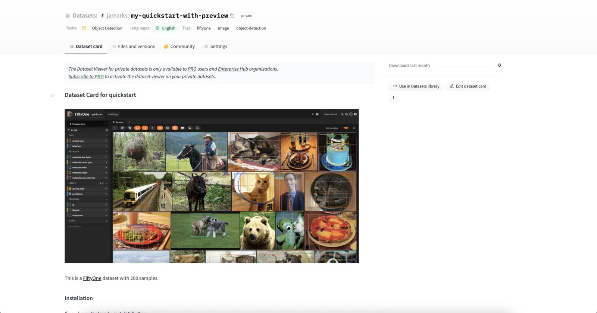
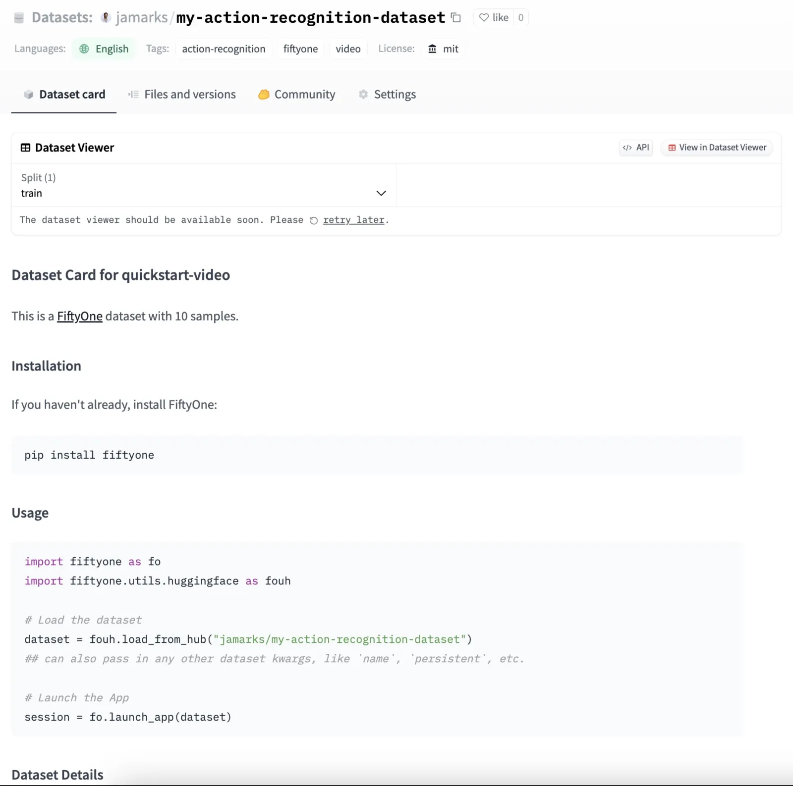

# Hugging Face Integration [¶](\#hugging-face-integration "Permalink to this headline")

FiftyOne integrates natively with Hugging Face’s
[Transformers](https://huggingface.co/docs/transformers) library, so
you can load, fine-tune, and run inference with your favorite Transformers
models on your FiftyOne datasets with just a few lines of code!

FiftyOne also integrates with the
[Hugging Face Hub](https://huggingface.co/docs/hub/index), so you can push
datasets to and load datasets from the Hub with ease.

## Transformers Library [¶](\#transformers-library "Permalink to this headline")

### Setup [¶](\#setup "Permalink to this headline")

To get started with
[Transformers](https://huggingface.co/docs/transformers), just install the
`transformers` package:

```python
pip install -U transformers

```

### Inference [¶](\#inference "Permalink to this headline")

All
[Transformers models](https://huggingface.co/docs/transformers/index#supported-models-and-frameworks)
that support image classification, object detection, semantic segmentation, or
monocular depth estimation tasks can be passed directly to your FiftyOne dataset’s
[`apply_model()`](../api/fiftyone.core.collections.html#fiftyone.core.collections.SampleCollection.apply_model "fiftyone.core.collections.SampleCollection.apply_model")
method.

The examples below show how to run inference with various Transformers models
on the following sample dataset:

```python
import fiftyone as fo
import fiftyone.zoo as foz

dataset = foz.load_zoo_dataset("quickstart", max_samples=25)
dataset.select_fields().keep_fields()

```

#### Image classification [¶](\#image-classification "Permalink to this headline")

You can pass `transformers` classification models directly to FiftyOne
dataset’s
[`apply_model()`](../api/fiftyone.core.collections.html#fiftyone.core.collections.SampleCollection.apply_model "fiftyone.core.collections.SampleCollection.apply_model")
method:

```python
# BeiT
from transformers import BeitForImageClassification
model = BeitForImageClassification.from_pretrained(
    "microsoft/beit-base-patch16-224"
)

# DeiT
from transformers import DeiTForImageClassification
model = DeiTForImageClassification.from_pretrained(
    "facebook/deit-base-distilled-patch16-224"
)

# DINOv2
from transformers import Dinov2ForImageClassification
model = Dinov2ForImageClassification.from_pretrained(
    "facebook/dinov2-small-imagenet1k-1-layer"
)

# MobileNetV2
from transformers import MobileNetV2ForImageClassification
model = MobileNetV2ForImageClassification.from_pretrained(
    "google/mobilenet_v2_1.0_224"
)

# Swin Transformer
from transformers import SwinForImageClassification
model = SwinForImageClassification.from_pretrained(
    "microsoft/swin-tiny-patch4-window7-224"
)

# ViT
from transformers import ViTForImageClassification
model = ViTForImageClassification.from_pretrained(
    "google/vit-base-patch16-224"
)

# ViT-Hybrid
from transformers import ViTHybridForImageClassification
model = ViTHybridForImageClassification.from_pretrained(
    "google/vit-hybrid-base-bit-384"
)

# Any auto model
from transformers import AutoModelForImageClassification
model = AutoModelForImageClassification.from_pretrained(
    "facebook/levit-128S"
)

```

```python
dataset.apply_model(model, label_field="classif_predictions")

session = fo.launch_app(dataset)

```

Alternatively, you can manually run inference with the `transformers` model and
then use the
[`to_classification()`](../api/fiftyone.utils.transformers.html#fiftyone.utils.transformers.to_classification "fiftyone.utils.transformers.to_classification")
utility to convert the predictions to [FiftyOne format](../fiftyone_concepts/using_datasets.md#classification):

```python
from PIL import Image
import torch
import fiftyone.utils.transformers as fout

from transformers import ViTHybridForImageClassification, AutoProcessor
transformers_model = ViTHybridForImageClassification.from_pretrained(
    "google/vit-hybrid-base-bit-384"
)
processor = AutoProcessor.from_pretrained("google/vit-hybrid-base-bit-384")
id2label = transformers_model.config.id2label

for sample in dataset.iter_samples(progress=True):
    image = Image.open(sample.filepath)
    inputs = processor(image, return_tensors="pt")
    with torch.no_grad():
        result = transformers_model(**inputs)

    sample["classif_predictions"] = fout.to_classification(result, id2label)
    sample.save()

```

Finally, you can load `transformers` models directly from the
[FiftyOne Model Zoo](../models/model_zoo/index.md#model-zoo)!

To load a `transformers` classification model from the zoo, specify
`"classification-transformer-torch"` as the first argument, and pass in the
model’s name or path as a keyword argument:

```python
import fiftyone.zoo as foz

model = foz.load_zoo_model(
    "classification-transformer-torch",
    name_or_path="facebook/levit-128S",  # HF model name or path
)

dataset.apply_model(model, label_field="levit")

session = fo.launch_app(dataset)

```

#### Object detection [¶](\#object-detection "Permalink to this headline")

You can pass `transformers` detection models directly to your FiftyOne
dataset’s
[`apply_model()`](../api/fiftyone.core.collections.html#fiftyone.core.collections.SampleCollection.apply_model "fiftyone.core.collections.SampleCollection.apply_model")
method:

```python
# DETA
from transformers import DetaForObjectDetection
model = DetaForObjectDetection.from_pretrained(
    "jozhang97/deta-swin-large"
)

# DETR
from transformers import DetrForObjectDetection
model = DetrForObjectDetection.from_pretrained(
    "facebook/detr-resnet-50"
)

# DeformableDETR
from transformers import DeformableDetrForObjectDetection
model = DeformableDetrForObjectDetection.from_pretrained(
    "SenseTime/deformable-detr"
)

# Table Transformer
from transformers import TableTransformerForObjectDetection
model = TableTransformerForObjectDetection.from_pretrained(
    "microsoft/table-transformer-detection"
)

# YOLOS
from transformers import YolosForObjectDetection
model = YolosForObjectDetection.from_pretrained(
    "hustvl/yolos-tiny"
)

# Any auto model
from transformers import AutoModelForObjectDetection
model = AutoModelForObjectDetection.from_pretrained(
    "microsoft/conditional-detr-resnet-50"
)

```

```python
dataset.apply_model(model, label_field="det_predictions")

session = fo.launch_app(dataset)

```

Alternatively, you can manually run inference with the `transformers` model and
then use the
[`to_detections()`](../api/fiftyone.utils.transformers.html#fiftyone.utils.transformers.to_detections "fiftyone.utils.transformers.to_detections") utility to
convert the predictions to [FiftyOne format](../fiftyone_concepts/using_datasets.md#object-detection):

```python
from PIL import Image
import torch

import fiftyone.utils.transformers as fout

from transformers import AutoModelForObjectDetection, AutoProcessor
transformers_model = AutoModelForObjectDetection.from_pretrained(
    "microsoft/conditional-detr-resnet-50"
)
processor = AutoProcessor.from_pretrained(
    "microsoft/conditional-detr-resnet-50"
)
id2label = transformers_model.config.id2label

for sample in dataset.iter_samples(progress=True):
    image = Image.open(sample.filepath)
    inputs = processor(image, return_tensors="pt")
    with torch.no_grad():
        outputs = transformers_model(**inputs)

    target_sizes = torch.tensor([image.size[::-1]])
    result = processor.post_process_object_detection(
        outputs, target_sizes=target_sizes
    )
    sample["det_predictions"] = fout.to_detections(
        result, id2label, [image.size]
    )
    sample.save()

```

Finally, you can load `transformers` models directly from the
[FiftyOne Model Zoo](../models/model_zoo/index.md#model-zoo)!

To load a `transformers` detection model from the zoo, specify
`"detection-transformer-torch"` as the first argument, and pass in the model’s
name or path as a keyword argument:

```python
import fiftyone.zoo as foz

model = foz.load_zoo_model(
    "detection-transformer-torch",
    name_or_path="facebook/detr-resnet-50",  # HF model name or path
)

dataset.apply_model(model, label_field="detr")

session = fo.launch_app(dataset)

```

#### Semantic segmentation [¶](\#semantic-segmentation "Permalink to this headline")

You can pass a `transformers` semantic segmentation model directly to your
FiftyOne dataset’s
[`apply_model()`](../api/fiftyone.core.collections.html#fiftyone.core.collections.SampleCollection.apply_model "fiftyone.core.collections.SampleCollection.apply_model")
method:

```python
# Mask2Former
from transformers import Mask2FormerForUniversalSegmentation
model = Mask2FormerForUniversalSegmentation.from_pretrained(
    "facebook/mask2former-swin-small-coco-instance"
)

# Mask2Former
from transformers import MaskFormerForInstanceSegmentation
model = MaskFormerForInstanceSegmentation.from_pretrained(
    "facebook/maskformer-swin-base-ade"
)

# Segformer
from transformers import SegformerForSemanticSegmentation
model = SegformerForSemanticSegmentation.from_pretrained(
    "nvidia/segformer-b0-finetuned-ade-512-512"
)

# Any auto model
from transformers import AutoModelForSemanticSegmentation
model = AutoModelForSemanticSegmentation.from_pretrained(
    "Intel/dpt-large-ade"
)

```

```python
dataset.apply_model(model, label_field="seg_predictions")
dataset.default_mask_targets = model.config.id2label

session = fo.launch_app(dataset)

```

Alternatively, you can manually run inference with the `transformers` model and
then use the
[`to_segmentation()`](../api/fiftyone.utils.transformers.html#fiftyone.utils.transformers.to_segmentation "fiftyone.utils.transformers.to_segmentation") utility
to convert the predictions to [FiftyOne format](../fiftyone_concepts/using_datasets.md#semantic-segmentation):

```python
from PIL import Image
import fiftyone.utils.transformers as fout

from transformers import AutoModelForSemanticSegmentation, AutoProcessor
transformers_model = AutoModelForSemanticSegmentation.from_pretrained(
    "Intel/dpt-large-ade"
)
processor = AutoProcessor.from_pretrained("Intel/dpt-large-ade")

for sample in dataset.iter_samples(progress=True):
    image = Image.open(sample.filepath)
    inputs = processor(image, return_tensors="pt")
    target_size = [image.size[::-1]]
    with torch.no_grad():
        output = transformers_model(**inputs)

    result = processor.post_process_semantic_segmentation(
        output, target_sizes=target_size
    )
    sample["seg_predictions"] = fout.to_segmentation(result)
    sample.save()

```

Finally, you can load `transformers` models directly from the
[FiftyOne Model Zoo](../models/model_zoo/index.md#model-zoo)!

To load a `transformers` semantic segmentation model from the zoo, specify
`"segmentation-transformer-torch"` as the first argument, and pass in the
model’s name or path as a keyword argument:

```python
import fiftyone.zoo as foz

model = foz.load_zoo_model(
    "segmentation-transformer-torch",
    name_or_path="nvidia/segformer-b0-finetuned-ade-512-512",
)

dataset.apply_model(model, label_field="segformer")

session = fo.launch_app(dataset)

```

#### Monocular depth estimation [¶](\#monocular-depth-estimation "Permalink to this headline")

You can pass a `transformers` monocular depth estimation model directly to your
FiftyOne dataset’s [`apply_model()`](../api/fiftyone.core.collections.html#fiftyone.core.collections.SampleCollection.apply_model "fiftyone.core.collections.SampleCollection.apply_model")
method:

```python
# DPT
from transformers import DPTForDepthEstimation
model = DPTForDepthEstimation.from_pretrained("Intel/dpt-large")

# GLPN
from transformers import GLPNForDepthEstimation
model = GLPNForDepthEstimation.from_pretrained("vinvino02/glpn-kitti")

# Depth Anything
from transformers import AutoModelForDepthEstimation
model = AutoModelForDepthEstimation.from_pretrained("LiheYoung/depth-anything-small-hf")

# Depth Anything-V2
from transformers import AutoModelForDepthEstimation
model = AutoModelForDepthEstimation.from_pretrained("depth-anything/Depth-Anything-V2-Small-hf")

```

```python
dataset.apply_model(model, label_field="depth_predictions")

session = fo.launch_app(dataset)

```

Alternatively, you can load `transformers` depth estimation models directly from
the [FiftyOne Model Zoo](../models/model_zoo/index.md#model-zoo)!

To load a `transformers` depth estimation model from the zoo, specify
`"depth-estimation-transformer-torch"` as the first argument, and pass in the
model’s name or path as a keyword argument:

```python
import fiftyone.zoo as foz

model = foz.load_zoo_model(
    "depth-estimation-transformer-torch",
    name_or_path="Intel/dpt-hybrid-midas",
)

dataset.apply_model(model, label_field="dpt_hybrid_midas")

session = fo.launch_app(dataset)

```

#### Zero-shot classification [¶](\#zero-shot-classification "Permalink to this headline")

Zero-shot image classification models from `transformers` can be loaded
directly from the [FiftyOne Model Zoo](../models/model_zoo/index.md#model-zoo)!

To load a `transformers` zero-shot classification model from the zoo, specify
`"zero-shot-classification-transformer-torch"` as the first argument, and pass
in the model’s name or path as a keyword argument:

```python
import fiftyone.zoo as foz

model = foz.load_zoo_model(
    "zero-shot-classification-transformer-torch",
    name_or_path="BAAI/AltCLIP",  # HF model name or path
    classes=["cat", "dog", "bird", "fish", "turtle"],  # optional
)

```

Once loaded, you can pass the model directly to your FiftyOne dataset’s
[`apply_model()`](../api/fiftyone.core.collections.html#fiftyone.core.collections.SampleCollection.apply_model "fiftyone.core.collections.SampleCollection.apply_model")
method:

```python
dataset.apply_model(model, label_field="altclip")

session = fo.launch_app(dataset)

```

You can also generate embeddings for the samples in your dataset with zero shot
models as follows:

```python
import fiftyone.zoo as foz

model = foz.load_zoo_model(
    "zero-shot-classification-transformer-torch",
    name_or_path="BAAI/AltCLIP",  # HF model name or path
)

dataset.compute_embeddings(model, embeddings_field="altclip_embeddings")

session = fo.launch_app(dataset)

```

You can also change the label classes of zero shot models any time by setting
the `classes` attribute of the model:

```python
model.classes = ["cat", "dog", "bird", "fish", "turtle"]

dataset.apply_model(model, label_field="altclip")

session = fo.launch_app(dataset)

```

The
[`convert_transformers_model()`](../api/fiftyone.utils.transformers.html#fiftyone.utils.transformers.convert_transformers_model "fiftyone.utils.transformers.convert_transformers_model")
utility also allows you to manually convert a zero-shot `transformers` model to
FiftyOne format:

```python
import fiftyone.utils.transformers as fout

from transformers import CLIPSegModel
transformers_model = CLIPSegModel.from_pretrained(
    "CIDAS/clipseg-rd64-refined"
)

model = fout.convert_transformers_model(
    transformers_model,
    task="image-classification",  # or "semantic-segmentation"
)

```

Note

Some zero-shot models are compatible with multiple tasks, so it is
recommended that you specify the task type when converting the model.

#### Zero-shot object detection [¶](\#zero-shot-object-detection "Permalink to this headline")

Zero-shot object detection models from `transformers` can be loaded directly
from the [FiftyOne Model Zoo](../models/model_zoo/index.md#model-zoo)!

To load a `transformers` zero-shot object detection model from the zoo, specify
`"zero-shot-detection-transformer-torch"` as the first argument, and pass
in the model’s name or path as a keyword argument. You can optionally pass in a
list of label classes as a keyword argument `classes`:

```python
import fiftyone.zoo as foz

model = foz.load_zoo_model(
    "zero-shot-detection-transformer-torch",
    name_or_path="google/owlvit-base-patch32",  # HF model name or path
    classes=["cat", "dog", "bird", "fish", "turtle"],  # optional
)

```

The
[`convert_transformers_model()`](../api/fiftyone.utils.transformers.html#fiftyone.utils.transformers.convert_transformers_model "fiftyone.utils.transformers.convert_transformers_model")
utility also allows you to manually convert a zero-shot `transformers` model to
FiftyOne format:

```python
import fiftyone.utils.transformers as fout

from transformers import OwlViTForObjectDetection
transformers_model = OwlViTForObjectDetection.from_pretrained(
    "google/owlvit-base-patch32"
)

model = fout.convert_transformers_model(
    transformers_model,
    task="object-detection",
)

```

Note

Some zero-shot models are compatible with multiple tasks, so it is
recommended that you specify the task type when converting the model.

As of `transformers>=4.40.0` and `fiftyone>=0.24.0`, you can also use
[Grounding DINO](https://huggingface.co/docs/transformers/main/en/model_doc/grounding-dino)
models for zero-shot object detection:

```python
import fiftyone.zoo as foz

model = foz.load_zoo_model(
    "zero-shot-detection-transformer-torch",
    name_or_path="IDEA-Research/grounding-dino-tiny",
    classes=["cat"],
)

dataset.apply_model(model, label_field="cats", confidence_thresh=0.2)

```

Note

The `confidence_thresh` parameter is optional and can be used to filter out
predictions with confidence scores below the specified threshold. You may
need to adjust this value based on the model and dataset you are working.
Also note that whereas OwlViT models accept multiple classes, Grounding DINO
models only accept a single class.

#### Batch inference [¶](\#batch-inference "Permalink to this headline")

When using
[`apply_model()`](../api/fiftyone.core.collections.html#fiftyone.core.collections.SampleCollection.apply_model "fiftyone.core.collections.SampleCollection.apply_model"),
you can request batch inference by passing the optional `batch_size` parameter:

```python
dataset.apply_model(model, label_field="det_predictions", batch_size=16)

```

The manual inference loops can be also executed using batch inference via the
pattern below:

```python
from fiftyone.core.utils import iter_batches
import fiftyone.utils.transformers as fout

# Load a detection model and its corresponding processor
from transformers import YolosForObjectDetection, AutoProcessor
transformers_model = YolosForObjectDetection.from_pretrained(
    "hustvl/yolos-tiny"
)
processor = AutoProcessor.from_pretrained("hustvl/yolos-tiny")
id2label = transformers_model.config.id2label

filepaths = dataset.values("filepath")
batch_size = 16

predictions = []
for paths in iter_batches(filepaths, batch_size):
    images = [Image.open(p) for p in paths]
    image_sizes = [i.size for i in images]
    target_sizes = torch.tensor([image.size[::-1] for image in images])
    inputs = processor(images, return_tensors="pt")
    with torch.no_grad():
        outputs = transformers_model(**inputs)

    results = processor.post_process_object_detection(
        outputs, target_sizes=target_sizes
    )
    predictions.extend(fout.to_detections(results, id2label, image_sizes))

dataset.set_values("det_predictions", predictions)

```

Note

See [this section](../fiftyone_concepts/using_datasets.md#batch-updates) for more information about
performing batch updates to your FiftyOne datasets.

### Embeddings [¶](\#embeddings "Permalink to this headline")

Any `transformers` model that supports image classification or object detection
tasks — zero-shot or otherwise — can be used to compute embeddings for your
samples.

Note

For zero-shot models, FiftyOne will use the `transformers` model’s
`get_image_features()` method to extract embeddings.

For non-zero-shot models, regardless of whether you use a classification,
detection, or base model, FiftyOne will extract embeddings from the
`last_hidden_state` of the model’s base encoder.

#### Image embeddings [¶](\#image-embeddings "Permalink to this headline")

To compute embeddings for images, you can pass the `transformers` model
directly to your FiftyOne dataset’s
[`compute_embeddings()`](../api/fiftyone.core.collections.html#fiftyone.core.collections.SampleCollection.compute_embeddings "fiftyone.core.collections.SampleCollection.compute_embeddings")
method:

```python
# Embeddings from base model
from transformers import BeitModel
model = BeitModel.from_pretrained(
    "microsoft/beit-base-patch16-224-pt22k"
)

# Embeddings from classification model
from transformers import BeitForImageClassification
model = BeitForImageClassification.from_pretrained(
    "microsoft/beit-base-patch16-224"
)

# Embeddings from detection model
from transformers import DetaForObjectDetection
model = DetaForObjectDetection.from_pretrained(
    "jozhang97/deta-swin-large-o365"
)

# Embeddings from zero-shot classification model
from transformers import AltCLIPModel
model = AltCLIPModel.from_pretrained(
    "BAAI/AltCLIP"
)

# Embeddings from zero-shot detection model
from transformers import OwlViTForObjectDetection
model = OwlViTForObjectDetection.from_pretrained(
    "google/owlvit-base-patch32"
)

```

```python
import fiftyone as fo
import fiftyone.zoo as foz

dataset = foz.load_zoo_dataset("quickstart", max_samples=25)
dataset.select_fields().keep_fields()

dataset.compute_embeddings(model, embeddings_field="embeddings")

```

Alternatively, you can use the
[`convert_transformers_model()`](../api/fiftyone.utils.transformers.html#fiftyone.utils.transformers.convert_transformers_model "fiftyone.utils.transformers.convert_transformers_model")
utility to convert a `transformers` model to FiftyOne format, which allows you
to check the model’s
[`has_embeddings`](../api/fiftyone.core.models.html#fiftyone.core.models.Model.has_embeddings "fiftyone.core.models.Model.has_embeddings") property to
see if the model can be used to generate embeddings:

```python
import numpy as np
from PIL import Image
import fiftyone.utils.transformers as fout

from transformers import BeitModel
transformers_model = BeitModel.from_pretrained(
    "microsoft/beit-base-patch16-224-pt22k"
)

model = fout.convert_transformers_model(transformers_model)
print(model.has_embeddings)  # True

# Embed an image directly
image = Image.open(dataset.first().filepath)
embedding = model.embed(np.array(image))

```

#### Text embeddings [¶](\#text-embeddings "Permalink to this headline")

Zero-shot image classification and object detection models from `transformers`
can also be used to compute embeddings for text:

```python
import fiftyone as fo
import fiftyone.zoo as foz

dataset = foz.load_zoo_dataset("quickstart", max_samples=25)
dataset.select_fields().keep_fields()

model = foz.load_zoo_model(
    "zero-shot-classification-transformer-torch",
    name_or_path="BAAI/AltCLIP",
)

embedding = model.embed_prompt("a photo of a dog")

```

You can check whether a model supports text embeddings by checking the
[`can_embed_prompts`](../api/fiftyone.utils.transformers.html#fiftyone.utils.transformers.ZeroShotTransformerPromptMixin.embed_prompts "fiftyone.utils.transformers.ZeroShotTransformerPromptMixin.embed_prompts")
property:

```python
import fiftyone.zoo as foz

# A zero-shot model that supports text embeddings
model = foz.load_zoo_model(
    "zero-shot-classification-transformer-torch",
    name_or_path="BAAI/AltCLIP",
)
print(model.can_embed_prompts)  # True

# A classification model that does not support text embeddings
model = foz.load_zoo_model(
    "classification-transformer-torch",
    name_or_path="microsoft/beit-base-patch16-224",
)
print(model.can_embed_prompts)  # False

```

#### Batch embeddings [¶](\#batch-embeddings "Permalink to this headline")

You can request batch inference by passing the optional `batch_size` parameter
to
[`compute_embeddings()`](../api/fiftyone.core.collections.html#fiftyone.core.collections.SampleCollection.compute_embeddings "fiftyone.core.collections.SampleCollection.compute_embeddings"):

```python
dataset.compute_embeddings(model, embeddings_field="embeddings", batch_size=16)

```

#### Patch embeddings [¶](\#patch-embeddings "Permalink to this headline")

You can compute embeddings for image patches by passing `transformers` models
directly to your FiftyOne dataset’s
[`compute_patch_embeddings()`](../api/fiftyone.core.collections.html#fiftyone.core.collections.SampleCollection.compute_patch_embeddings "fiftyone.core.collections.SampleCollection.compute_patch_embeddings")
method:

```python
import fiftyone as fo
import fiftyone.zoo as foz
import fiftyone.utils.transformers as fout

dataset = foz.load_zoo_dataset("quickstart", max_samples=25)

from transformers import BeitModel
model = BeitModel.from_pretrained(
    "microsoft/beit-base-patch16-224-pt22k"
)

dataset.compute_patch_embeddings(
    model,
    patches_field="ground_truth",
    embeddings_field="embeddings",
)

```

### Brain methods [¶](\#brain-methods "Permalink to this headline")

Because `transformers` models can be used to compute embeddings, they can be
passed to [Brain methods](../fiftyone_concepts/brain.md#fiftyone-brain) like
`compute_similarity()` and
`compute_visualization()`:

```python
import fiftyone as fo
import fiftyone.brain as fob
import fiftyone.zoo as foz

dataset = foz.load_zoo_dataset("quickstart", max_samples=25)

# Classification model
from transformers import BeitModel
transformers_model = BeitModel.from_pretrained(
    "microsoft/beit-base-patch16-224-pt22k"
)

# Detection model
from transformers import DetaForObjectDetection
transformers_model = DetaForObjectDetection.from_pretrained(
    "jozhang97/deta-swin-large"
)

# Zero-shot classification model
from transformers import AutoModelForImageClassification
transformers_model = AutoModelForImageClassification.from_pretrained(
    "BAAI/AltCLIP"
)

# Zero-shot detection model
from transformers import OwlViTForObjectDetection
transformers_model = OwlViTForObjectDetection.from_pretrained(
    "google/owlvit-base-patch32"
)

```

```python
# Option 1: directly pass `transformers` model
fob.compute_similarity(dataset, model=transformers_model, brain_key="sim1")
fob.compute_visualization(dataset, model=transformers_model, brain_key="vis1")

```

```python
# Option 2: pass pre-computed embeddings
dataset.compute_embeddings(transformers_model, embeddings_field="embeddings")

fob.compute_similarity(dataset, embeddings="embeddings", brain_key="sim2")
fob.compute_visualization(dataset, embeddings="embeddings", brain_key="vis2")

```

Because `transformers` zero-shot models can be used to embed text, they can
also be used to construct similarity indexes on your datasets which support
natural language queries.

To use this functionality, you must pass the model by **name** into the brain
method, along with any necessary keyword arguments that must be passed to
[`load_zoo_model()`](../api/fiftyone.zoo.html#fiftyone.zoo.load_zoo_model "fiftyone.zoo.load_zoo_model") to load the correct
model:

```python
import fiftyone as fo
import fiftyone.brain as fob
import fiftyone.zoo as foz

dataset = foz.load_zoo_dataset("quickstart", max_samples=25)

fob.compute_similarity(
    dataset,
    brain_key="zero_shot_sim",
    model="zero-shot-classification-transformer-torch",
    name_or_path="BAAI/AltCLIP",
)

view = dataset.sort_by_similarity("A photo of a dog", k=25)

session = fo.launch_app(view)

```

## Hugging Face Hub [¶](\#huggingface-hub "Permalink to this headline")

FiftyOne integrates with the
[Hugging Face Hub](https://huggingface.co/docs/hub/index) to allow you to
push datasets to and load datasets from the Hub with ease. This integration
simplifies the process of sharing datasets with the machine learning and
computer vision community, and allows you to easily access and work with many
of the most popular vision and multimodal datasets available!

### Setup [¶](\#huggingface-hub-setup "Permalink to this headline")

To push datasets to and load datasets from the
[Hugging Face Hub](https://huggingface.co/docs/hub/index), you will need the
[Hugging Face Hub Python client](https://github.com/huggingface/huggingface_hub),
which you can install via PyPI:

```python
pip install "huggingface_hub>=0.20.0"

```

To push a dataset to the Hub, and in some cases, to access a dataset on
the hub, you will need to have a
[Hugging Face Hub account](https://huggingface.co/join).

Hugging Face handles authentication via tokens, which you can obtain by
logging into your account and navigating to the
[Access Tokens](https://huggingface.co/settings/tokens) section of your
profile. At the bottom of this page, you can create a new token with write or
read access to the Hub. Once you have your token, you can set it as an
environment variable:

```python
export HF_TOKEN="<your-token-here>"

```

### Pushing datasets to the Hub [¶](\#pushing-datasets-to-the-hub "Permalink to this headline")

If you are working with a dataset in FiftyOne and you want to quickly share it
with others, you can do so via the
[`push_to_hub()`](../api/fiftyone.utils.huggingface.html#fiftyone.utils.huggingface.push_to_hub "fiftyone.utils.huggingface.push_to_hub")
function, which takes two positional arguments:

- the FiftyOne sample collection (a [`Dataset`](../api/fiftyone.core.dataset.html#fiftyone.core.dataset.Dataset "fiftyone.core.dataset.Dataset") or [`DatasetView`](../api/fiftyone.core.view.html#fiftyone.core.view.DatasetView "fiftyone.core.view.DatasetView"))

- the `repo_name`, which will be combined with your Hugging Face username or
organization name to construct the `repo_id` where the sample collection
will be uploaded.

As you will see, this simple function allows you to push datasets and filtered
views containing images, videos, point clouds, and other multimodal data to the
Hugging Face Hub, providing you with incredible flexibility in the process.

#### Basic usage [¶](\#basic-usage "Permalink to this headline")

The basic recipe for pushing a FiftyOne dataset to the Hub is just two lines of
code. As a starting point, let’s use the example
[Quickstart dataset](../data/dataset_zoo/datasets.md#dataset-zoo-quickstart) dataset from the
[FiftyOne Dataset Zoo](../data/dataset_zoo/index.md#dataset-zoo):

```python
import fiftyone as fo
import fiftyone.zoo as foz

dataset = foz.load_zoo_dataset("quickstart")

```

To push the dataset to the Hugging Face Hub, all you need to do is call
[`push_to_hub()`](../api/fiftyone.utils.huggingface.html#fiftyone.utils.huggingface.push_to_hub "fiftyone.utils.huggingface.push_to_hub") with the dataset
and the desired `repo_name`:

```python
from fiftyone.utils.huggingface import push_to_hub

push_to_hub(dataset, "my-quickstart-dataset")

```

When you run this code, a few things happen:

- The dataset and its media files are exported to a temporary directory and
uploaded to the specified Hugging Face repo.

- A `fiftyone.yml` config file for the dataset is generated and uploaded to
the repo, which contains all of the necessary information so that the dataset
can be loaded with
[`load_from_hub()`](../api/fiftyone.utils.huggingface.html#fiftyone.utils.huggingface.load_from_hub "fiftyone.utils.huggingface.load_from_hub").

- A Hugging Face
[Dataset Card](https://huggingface.co/docs/hub/en/datasets-cards)
for the dataset is auto-generated, providing tags, metadata, license info,
and a code snippet illustrating how to load the dataset from the hub.

Your dataset will be available on the Hub at the following URL:

```python
https://huggingface.co/datasets/<your-username-or-org-name>/my-quickstart-dataset

```

Pushing a [`DatasetView`](../api/fiftyone.core.view.html#fiftyone.core.view.DatasetView "fiftyone.core.view.DatasetView") to the Hub works in exactly the same way. For example,
if you want to push a filtered view of the `quickstart` dataset containing only
predictions with high confidence, you can do so by creating the view as usual,
and then passing that in to
[`push_to_hub()`](../api/fiftyone.utils.huggingface.html#fiftyone.utils.huggingface.push_to_hub "fiftyone.utils.huggingface.push_to_hub"):

```python
from fiftyone.utils.huggingface import push_to_hub

# Create view with high confidence predictions
view = dataset.filter_labels("predictions", F("confidence") > 0.95)

# Push view to the Hub as a new dataset
push_to_hub(view, "my-quickstart-high-conf")

```

When you do so, note that the view is exported as a new dataset, and other
details from the original dataset are not included.

FiftyOne is a _visual_ toolkit, so when you push a dataset to the Hub, you can
optionally include a preview (image, gif, or video) of the dataset, that will be
displayed on the dataset page. To do this, you can pass the `preview_path`
argument to [`push_to_hub()`](../api/fiftyone.utils.huggingface.html#fiftyone.utils.huggingface.push_to_hub "fiftyone.utils.huggingface.push_to_hub"), with
either a relative or absolute path to the preview file on your local machine:

```python
import fiftyone as fo
import fiftyone.zoo as foz

from fiftyone.utils.huggingface import push_to_hub

dataset = foz.load_zoo_dataset("quickstart")

session = fo.launch_app(dataset)

# Screenshot and save the preview image to a file...

push_to_hub(
    dataset,
    "my-quickstart-with-preview",
    preview_path="/path/to/preview.jpg"
)

```

The preview file will be uploaded to the Hub along with the dataset, and will be
displayed on the dataset card!



#### Pushing large datasets [¶](\#pushing-large-datasets "Permalink to this headline")

Large datasets with many samples require a bit more care when pushing to the
Hub. Hugging Face limits the number of files that can be uploaded in a single
directory to 10000, so if your dataset contains more than 10000 samples, the
data will need to be split into multiple directories. FiftyOne handles this
automatically when pushing large datasets to the Hub, but you can manually
configure the number of samples per directory by passing the `chunk_size`
argument to [`push_to_hub()`](../api/fiftyone.utils.huggingface.html#fiftyone.utils.huggingface.push_to_hub "fiftyone.utils.huggingface.push_to_hub"):

```python
from fiftyone.utils.huggingface import push_to_hub

# Limit to 100 images per directory
push_to_hub(dataset, "my-large-dataset", chunk_size=100)

```

Note

The `chunk_size` argument is currently only supported when exporting in
[FiftyOneDataset format](../fiftyone_concepts/export_datasets.md#fiftyonedataset-export) (the default).

#### Advanced usage [¶](\#advanced-usage "Permalink to this headline")

The [`push_to_hub()`](../api/fiftyone.utils.huggingface.html#fiftyone.utils.huggingface.push_to_hub "fiftyone.utils.huggingface.push_to_hub") function
provides a number of optional arguments that allow you to customize how your
dataset is pushed to the Hub, including whether the dataset is public or private,
what license it is released under, and more.

FiftyOne’s [`push_to_hub()`](../api/fiftyone.utils.huggingface.html#fiftyone.utils.huggingface.push_to_hub "fiftyone.utils.huggingface.push_to_hub")
function supports the Hugging Face Hub API arguments `private` and `exist_ok`.

- **private** _(bool)_: Whether the dataset should be private. If `True`, the
dataset will be private and only accessible to you. If `False`, the dataset
will be public and accessible to anyone with the link. Defaults to `False`.

- **exist\_ok** _(bool)_: Whether to overwrite an existing dataset with the same

`repo_name`. If `True`, the existing dataset will be overwritten. If `False`,
an error will be raised if a dataset with the same `repo_name` already
exists. Defaults to `False`.

For example, to push a dataset to the Hub as private, you can do the following:

```python
from fiftyone.utils.huggingface import push_to_hub

push_to_hub(dataset, "my-private-dataset", private=True)

```

You can also specify the `tags`, `license`, and `description` of the dataset,
all of which will propagate to the `fiftyone.yml` config file and the Hugging
Face Dataset Card. For example, to push a video action recognition dataset with
an MIT license and a description, you can do the following:

```python
import fiftyone as fo
import fiftyone.zoo as foz
from fiftyone.utils.huggingface import push_to_hub

dataset = foz.load_zoo_dataset("quickstart-video")

push_to_hub(
    dataset,
    "my-action-recognition-dataset",
    tags=["video", "action-recognition"],
    license="mit",
    description="A dataset of videos for action recognition tasks",
)

```

The pushed dataset will be available on the Hub and the dataset page will look
like this:



Note

The `tags` argument can be a string or a list of strings. The tag `fiftyone`
is automatically added to all datasets pushed with FiftyOne, communicating
that the dataset was created with FiftyOne and can be loaded with the
[`load_from_hub()`](../api/fiftyone.utils.huggingface.html#fiftyone.utils.huggingface.load_from_hub "fiftyone.utils.huggingface.load_from_hub") function.

The license is specified as a string. For a list of supported licenses, see the
[Hugging Face Hub documentation](https://huggingface.co/docs/hub/en/repositories-licenses).

The `description` argument can be used for whatever you like. When the dataset
is loaded from the Hub, this description will be accessible via the dataset’s
[`description`](../api/fiftyone.core.dataset.html#fiftyone.core.dataset.Dataset.description "fiftyone.core.dataset.Dataset.description") property.

Additionally, you can specify the “format” of the uploaded dataset. By default,
the format is the standard [FiftyOneDataset](../fiftyone_concepts/dataset_creation/datasets.md#fiftyonedataset-import) format,
but you can also specify the data is uploaded in any of these
[common formats](../fiftyone_concepts/dataset_creation/datasets.md#supported-import-formats). For example, to push the
quickstart dataset in [COCO](../fiftyone_concepts/dataset_creation/datasets.md#cocodetectiondataset-import) format, with a
Creative Commons Attribution 4.0 license, you can do the following:

```python
import fiftyone as fo
import fiftyone.zoo as foz
from fiftyone.utils.huggingface import push_to_hub
import fiftyone.types as fot

dataset = foz.load_zoo_dataset("quickstart")
dataset_type = fot.dataset_types.COCODetectionDataset

push_to_hub(
    dataset,
    "quickstart-coco",
    dataset_type=dataset_type,
    license="cc-by-4.0",
    label_fields="*",  # convert all label fields, not just ground truth
)

```

Note

The `label_fields` argument is used to specify which label fields to convert
to the specified dataset type. By default when using some dataset formats,
only the `ground_truth` label field is converted. If you want to convert all
label fields, you can set `label_fields="*"`. If you want to convert specific
label fields, you can pass a list of field names.

Additionally, you can specify the minimum version of FiftyOne required to load
the dataset by passing the `min_fiftyone_version` argument. This is useful when
the dataset utilizes features that are only available in versions above a certain
release. For example, to specify that the dataset requires `fiftyone>=0.23.0`:

```python
import fiftyone as fo
import fiftyone.zoo as foz
from fiftyone.utils.huggingface import push_to_hub

dataset = foz.load_zoo_dataset("quickstart")

push_to_hub(
    dataset,
    "quickstart-min-version",
    min_fiftyone_version="0.23.0",
)

```

### Loading datasets from the Hub [¶](\#loading-datasets-from-the-hub "Permalink to this headline")

To load a dataset from the Hugging Face Hub, you can use the
[`load_from_hub()`](../api/fiftyone.utils.huggingface.html#fiftyone.utils.huggingface.load_from_hub "fiftyone.utils.huggingface.load_from_hub") function.
This function supports loading datasets in any of the
[common formats](../fiftyone_concepts/dataset_creation/datasets.md#supported-import-formats) supported by FiftyOne, as well
as image-based datasets stored via [Parquet](https://parquet.apache.org/) files,
as is common with datasets from the
[datasets](https://huggingface.co/docs/datasets/en/index) library which have
been uploaded to the Hugging Face Hub. Below, we will walk through all of the
ways you can load datasets from the Hub.

In its simplest usage, the
[`load_from_hub()`](../api/fiftyone.utils.huggingface.html#fiftyone.utils.huggingface.load_from_hub "fiftyone.utils.huggingface.load_from_hub") function
only requires the `repo_id` of the dataset you want to load. For example, to
load the [private dataset](#huggingface-hub-push-dataset-advanced) that we
pushed to the Hub earlier, you can do the following:

```python
from fiftyone.utils.huggingface import load_from_hub

dataset = load_from_hub("<username-or-org>/my-private-dataset")

```

Note

As long as you have an environment variable `HF_TOKEN` set with your Hugging
Face token (with read access), you can load private or gated datasets that you have
access to from the Hub.

#### Loading datasets from repo configs [¶](\#loading-datasets-from-repo-configs "Permalink to this headline")

When you push a dataset to the Hub using
[`push_to_hub()`](../api/fiftyone.utils.huggingface.html#fiftyone.utils.huggingface.push_to_hub "fiftyone.utils.huggingface.push_to_hub"), a `fiftyone.yml`
config file is generated and uploaded to the repo. This file contains all of the
information necessary to load the dataset from the Hugging Face Hub. More
generally, any repo on the Hugging Face Hub that contains a `fiftyone.yml` or
`fiftyone.yaml` file (assuming the file is correctly formatted) can be loaded
using the [`load_from_hub()`](../api/fiftyone.utils.huggingface.html#fiftyone.utils.huggingface.load_from_hub "fiftyone.utils.huggingface.load_from_hub")
function by passing the `repo_id` of the dataset, without needing to specify any
additional arguments.

For example, to load the `quickstart` dataset that we pushed to the Hub earlier,

```python
from fiftyone.utils.huggingface import load_from_hub

dataset = load_from_hub("<username>/my-quickstart-dataset")

```

where `<username>` is your Hugging Face username or organization name.

#### Loading datasets from local configs [¶](\#loading-datasets-from-local-configs "Permalink to this headline")

If the repo was uploaded to the Hugging Face Hub via FiftyOne’s
[`push_to_hub()`](../api/fiftyone.utils.huggingface.html#fiftyone.utils.huggingface.push_to_hub "fiftyone.utils.huggingface.push_to_hub") function, then
the `fiftyone.yml` config file will be generated and uploaded to the repo.
However, some common datasets like
[mnist](https://huggingface.co/datasets/ylecun/mnist) were uploaded to the Hub
using the `datasets` library and do not contain a `fiftyone.yml` or
`fiftyone.yaml` file. If you know how the dataset is structured, you can load
the dataset by passing the path to a local yaml config file that describes the
dataset via the `config_file` keyword argument.

For example, to load the `mnist` dataset from the Hub, you might have a local
yaml config file like this:

```python
format: ParquetFilesDataset
classification_fields: label

```

To load the dataset from the Hub, you can pass the `repo_id` of the dataset and
the path to the local yaml config file:

```python
from fiftyone.utils.huggingface import load_from_hub

dataset = load_from_hub(
    "ylecun/mnist",
    config_file="/path/to/mnist.yml",
)

```

For a comprehensive list of the supported fields in the yaml config file, see
[Supported config fields](#huggingface-hub-load-dataset-config-kwargs).

#### Loading datasets with config kwargs [¶](\#loading-datasets-with-config-kwargs "Permalink to this headline")

In addition to loading datasets from repo configs and local configs, you can
also load datasets from the Hub by passing the necessary config arguments
directly to [`load_from_hub()`](../api/fiftyone.utils.huggingface.html#fiftyone.utils.huggingface.load_from_hub "fiftyone.utils.huggingface.load_from_hub").
This is useful when you want to load a dataset from the Hub that does not have
a `fiftyone.yml` or `fiftyone.yaml` file, and the structure of the dataset is
simple enough that you can specify the necessary arguments directly.

For example, to load the `mnist` dataset from the Hub, you can pass the `format`
and `classification_fields` arguments directly:

```python
from fiftyone.utils.huggingface import load_from_hub

dataset = load_from_hub(
    "ylecun/mnist",
    format="ParquetFilesDataset",
    classification_fields="label",
)

```

This will tell FiftyOne that the data is stored in Parquet files, and that the
`label` field should be treated as a classification field, to be converted into
a [`Classification`](../api/fiftyone.core.labels.html#fiftyone.core.labels.Classification "fiftyone.core.labels.Classification") label field in the dataset.

#### Supported config fields [¶](\#supported-config-fields "Permalink to this headline")

Whether you are loading a dataset from a repo config, a local config file, or
passing the config arguments directly, you can specify a number of fields.

Broadly speaking, these fields fall into three categories: format specification,
media field specification, and label field specification.

Let’s look at these categories in more detail:

**Format specification**:

- **format** _(str)_: The format of the dataset. This can be any of the
[common formats](../fiftyone_concepts/dataset_creation/datasets.md#supported-import-formats) supported by FiftyOne — just
pass the name of the format as a string. For example, to load a dataset in the
[COCO](../fiftyone_concepts/dataset_creation/datasets.md#cocodetectiondataset-import) format, you can pass
`format="COCODetectionDataset"`. To specify that the dataset is stored in
Parquet files, you can pass `format="ParquetFilesDataset"` (or simply
`format="parquet"` for short). This is the only required field.

- **name** _(str)_: The name of the FiftyOne [`Dataset`](../api/fiftyone.core.dataset.html#fiftyone.core.dataset.Dataset "fiftyone.core.dataset.Dataset") to be created. If the
`repo_id` is cumbersome, this can be used to specify a simpler default name.
For example, for this [sheep dataset](https://huggingface.co/datasets/keremberke/aerial-sheep-object-detection)
rather than using the `repo_id` `keremberke/aerial-sheep-object-detection`, you
can specify `name="sheep-detection"`.

- **subsets** _(str or list)_: The subset or subsets of the Hugging Face
dataset that are _compatible_ with this config, and are _available_ to be
loaded. In Hugging Face, the “dataset” in a repo can contain multiple
“subsets”, which may or may not have the same schema. Take the
[Street View House Numbers](https://huggingface.co/datasets/ufldl-stanford/svhn) dataset for
example. This dataset has two subsets: `"cropped_digits"` and `"full_numbers"`.
The `cropped_digits` subset contains classification labels, while the
`full_numbers` subset contains detection labels. A single config would not be
able to specify the schema for both subsets, so you can specify the subset you
want to load (or if you are the dataset author, which subset you want to _allow_
people to load in this way) with the `subsets` field. For example, to load the
`cropped_digits` subset of the SVHN dataset, you can pass
`subsets="cropped_digits"`. Note that this is not a required field, and by
default all subsets are loaded. Also note that subsets are distinct from splits
in the dataset, which are handled by the `splits` field (see below).

- **splits** _(str or list)_: The split or splits of the Hugging Face dataset that
are _compatible_ with this config, and are _available_ to be loaded. As is
standard for machine learning, many datasets are split into training, validation,
and test sets. The specific names of these splits may vary from dataset to
dataset, but [`load_from_hub()`](../api/fiftyone.utils.huggingface.html#fiftyone.utils.huggingface.load_from_hub "fiftyone.utils.huggingface.load_from_hub")
identifies the names of all splits and by default, will assume that all of
these splits are to be loaded. If you only want to load a specific split or
splits, you can specify them with the `splits` field. For example, to load the
training split of the [CIFAR10](https://huggingface.co/datasets//uoft-cs/cifar10)
dataset, you can pass `splits="train"`. If you want to load multiple splits,
you can pass them as a list, e.g., `splits=["train", "test"]`. Note that this
is not a required field, and by default all splits are loaded.

**Media field specification**:

While not all Parquet datasets contain media fields, all FiftyOne [`Sample`](../api/fiftyone.core.sample.html#fiftyone.core.sample.Sample "fiftyone.core.sample.Sample") objects
must be connected to at least one media file. The following fields can be used
to configure the media fields in the Hugging Face dataset that should be converted
to FiftyOne media fields:

- **filepath** _(str)_: In FiftyOne, `filepath` is
[a default field](https://docs.voxel51.com/user_guide/using_datasets.html#fields)
that is used to store the path to the primary media file for each sample in
the dataset. For Hugging Face parquet datasets, primary media fields for image
datasets are typically stored in the `image` columns, so this is where
FiftyOne’s [`load_from_hub()`](../api/fiftyone.utils.huggingface.html#fiftyone.utils.huggingface.load_from_hub "fiftyone.utils.huggingface.load_from_hub")
looks by default. If the primary media field is stored in a different column,
you can specify the column name with the key `filepath`. For example, the
[COYO-700M dataset](https://huggingface.co/datasets/kakaobrain/coyo-700m)
has the primary media field referenced in the `url` column. Specifying
`filepath="url"` will tell FiftyOne to look in the `url` column for the
primary media file path. Images will be downloaded from the corresponding URLs
and saved to disk.

- **thumbnail\_path** _(str)_: The field containing the path to a thumbnail image
for each sample in the dataset, if such a field exists. If a `thumbnail_path`
is specified, this media file will be shown in the sample grid in the FiftyOne
App. This can be useful for quickly visualizing the dataset when the primary
media field contains large (e.g., high-resolution) images. For more information
on thumbnail images, see [this section](../fiftyone_concepts/app.md#app-multiple-media-fields).

- **additional\_media\_fields** _(dict)_: If each sample has multiple associated media
files that you may want to visualize in the FiftyOne App, you can specify
these non-default media fields in the `additional_media_fields` dictionary,
where the keys are the column names in the Hugging Face dataset and the values
are the names of the fields in the FiftyOne [`Dataset`](../api/fiftyone.core.dataset.html#fiftyone.core.dataset.Dataset "fiftyone.core.dataset.Dataset") that will store the
paths. Note that this is _not_ the same as [grouped datasets](../fiftyone_concepts/groups.md#groups).

**Label field specification**:

FiftyOne’s Hugging Face Hub integration currently supports converting labels of
type [`Classification`](../api/fiftyone.core.labels.html#fiftyone.core.labels.Classification "fiftyone.core.labels.Classification"), [`Detections`](../api/fiftyone.core.labels.html#fiftyone.core.labels.Detections "fiftyone.core.labels.Detections"), and [`Segmentation`](../api/fiftyone.core.labels.html#fiftyone.core.labels.Segmentation "fiftyone.core.labels.Segmentation") from Hugging Face
Parquet datasets to FiftyOne label fields. The following fields can be used to
specify the label fields in the Hugging Face dataset that should be converted to
FiftyOne label fields:

- **classification\_fields** _(str or list)_: The column or columns in the Hugging
Face dataset that should be converted to FiftyOne [`Classification`](../api/fiftyone.core.labels.html#fiftyone.core.labels.Classification "fiftyone.core.labels.Classification") label fields.
contain classification labels. For example, if the dataset contains a `label`
field that contains classification labels, you can specify
`classification_fields="label"`. If the dataset contains multiple
classification fields, you can specify them as a list, e.g.,
`classification_fields=["label1", "label2"]`. This is not a required field,
and if the dataset does not contain classification labels, you can omit it.

- **detection\_fields** _(str or list)_: The column or columns in the Hugging Face
dataset that should be converted to FiftyOne [`Detections`](../api/fiftyone.core.labels.html#fiftyone.core.labels.Detections "fiftyone.core.labels.Detections") label fields. If the
dataset contains detection labels, you can specify the column name or names
here. For example, if the dataset contains a `detections` field that contains
detection labels, you can specify `detection_fields="detections"`. If the
dataset contains multiple detection fields, you can specify them as a list,
e.g., `detection_fields=["detections1", "detections2"]`. This is not a required
field, and if the dataset does not contain detection labels, you can omit it.

- **mask\_fields** _(str or list)_: The column or columns in the Hugging Face dataset
that should be converted to FiftyOne [`Segmentation`](../api/fiftyone.core.labels.html#fiftyone.core.labels.Segmentation "fiftyone.core.labels.Segmentation") label fields. The column
in the Hugging Face dataset must contain an image or the URL for an image that
can be used as a segmentation mask. If necessary, the images will be downloaded
and saved to disk. If the dataset contains mask labels, you can specify the
column name or names here. For example, if the dataset contains a `masks` field
that contains mask labels, you can specify `mask_fields="masks"`. This is not
a required field, and if the dataset does not contain mask labels, you can
omit it.

#### Configuring the download process [¶](\#configuring-the-download-process "Permalink to this headline")

When loading datasets from the Hugging Face Hub, FiftyOne will download the
_all_ of the data specified by the `repo_id` and the config. If no splits or
subsets are listed in the config, this means that all samples across all splits
and subsets will be downloaded. This can be a time-consuming process, especially
for large datasets, and sometimes you may only want to download a fixed number
of samples to get started exploring the dataset.

FiftyOne’s [`load_from_hub()`](../api/fiftyone.utils.huggingface.html#fiftyone.utils.huggingface.load_from_hub "fiftyone.utils.huggingface.load_from_hub")
function supports a variety of arguments that allow you to control the download
process, from the maximum number of samples to be downloaded to the batch size
to use when making requests to the Datasets Server. Here are the supported
arguments:

- **max\_samples** _(int)_: The number of samples to download from the dataset.
If not specified, all samples will be downloaded.

- **batch\_size** _(int)_: The batch size to use when making requests to the
Datasets Server. Defaults to 100, which is the max batch size allowed by the
Datasets Server.

- **num\_workers** _(int)_: The number of worker to use when downloading
media files. If not specified, the number of workers will be resolved by
looking at your [FiftyOne Config](../fiftyone_concepts/config.md#configuring-fiftyone).

- **splits** _(str or list)_: The split or splits of the Hugging Face dataset
that you want to download. This overrides the `splits` field in the config.

- **subsets** _(str or list)_: The subset or subsets of the Hugging Face dataset
that you want to download. This overrides the `subsets` field in the config.

- **overwrite** _(bool)_: Whether to overwrite existing an existing dataset
with the same name. If `True`, the existing dataset will be overwritten. If
`False`, an error will be raised if a dataset with the same name already
exists. Defaults to `False`.

- **persistent** _(bool)_: Whether to persist the dataset to the underlying
database after it is loaded. If `True`, the dataset will be available for
loading in future FiftyOne sessions by passing the dataset’s name into
FiftyOne’s
`load_dataset()` function.
Defaults to `False`.

- **revision** _(str)_: The revision (specified by a commit hash to the Hugging
Face repo) of the dataset to load. If not specified, the latest revision will
be loaded.

#### Basic examples [¶](\#basic-examples "Permalink to this headline")

Okay, so [`load_from_hub()`](../api/fiftyone.utils.huggingface.html#fiftyone.utils.huggingface.load_from_hub "fiftyone.utils.huggingface.load_from_hub") is
_very_ powerful, and can be used in a _ton_ of ways. All of this flexibility
can be a bit overwhelming, so let’s walk through a few examples to show you how
easy it is in practice to load datasets from the Hugging Face Hub.

Note

To make these downloads as fast as possible, we recommend setting the
`max_samples` argument to a reasonable number, like 1000, to get a feel for
the dataset. If you like what you see, you can always download more samples!

**Classification Datasets**

Let’s start by loading the
[MNIST](https://huggingface.co/datasets/ylecun/mnist) dataset into FiftyOne. All you
need to do is pass the `repo_id` of the dataset — in this case `"ylecun/mnist"` — to
[`load_from_hub()`](../api/fiftyone.utils.huggingface.html#fiftyone.utils.huggingface.load_from_hub "fiftyone.utils.huggingface.load_from_hub"), specify the
format as `"parquet"`, and specify the `classification_fields` as `"label"`:

```python
from fiftyone.utils.huggingface import load_from_hub

dataset = load_from_hub(
    "ylecun/mnist",
    format="parquet",
    classification_fields="label",
    max_samples=1000,
)

session = fo.launch_app(dataset)

```

The same exact syntax works for the [CIFAR-10](https://huggingface.co/datasets/cifar10)
and [FashionMNIST](https://huggingface.co/datasets/zalando-datasets/fashion_mnist) datasets,
which are also available on the Hub. In fact, you can load any of the following
classification datasets from the Hub using the same syntax, just by changing the
`repo_id`:

- [CIFAR-10](https://huggingface.co/datasets/uoft-cs/cifar10) (use `"uoft-cs/cifar10"`)

- [ImageNet](https://huggingface.co/datasets/ILSVRC/imagenet-1k) (use `"ILSVRC/imagenet-1k"`)

- [FashionMNIST](https://huggingface.co/datasets/zalando-datasets/fashion_mnist) (use `"zalando-datasets/fashion_mnist"`)

- [Tiny ImageNet](https://huggingface.co/datasets/zh-plus/tiny-imagenet) (use `"zh-plus/tiny-imagenet"`)

- [Food-101](https://huggingface.co/datasets/ethz/food101) (use `"ethz/food101"`)

- [Dog Food](https://huggingface.co/datasets/sasha/dog-food) (use `"sasha/dog-food"`)

- [ImageNet-Sketch](https://huggingface.co/datasets/songweig/imagenet_sketch) (use `"songweig/imagenet_sketch"`)

- [Oxford Flowers](https://huggingface.co/datasets/nelorth/oxford-flowers) (use `"nelorth/oxford-flowers"`)

- [Cats vs. Dogs](https://huggingface.co/datasets/microsoft/cats_vs_dogs) (use `"microsoft/cats_vs_dogs"`)

- [ObjectNet-1.0](https://huggingface.co/datasets/timm/objectnet) (use `"timm/objectnet"`)

A very similar syntax can be used to load classification datasets that contain
_multiple_ classification fields, such as
[CIFAR-100](https://huggingface.co/datasets/uoft-cs/cifar100) and the
[WikiArt](https://huggingface.co/datasets/huggan/wikiart) dataset. For example,
to load the CIFAR-100 dataset, you can specify the `classification_fields` as
`["coarse_label", "fine_label"]`:

```python
from fiftyone.utils.huggingface import load_from_hub

dataset = load_from_hub(
    "uoft-cs/cifar100",
    format="parquet",
    classification_fields=["coarse_label", "fine_label"],
    max_samples=1000,
)

session = fo.launch_app(dataset)

```

To load the [WikiArt](https://huggingface.co/datasets/huggan/wikiart) dataset,
you can specify the `classification_fields` as `["artist", "genre", "style"]`:

```python
from fiftyone.utils.huggingface import load_from_hub

dataset = load_from_hub(
    "huggan/wikiart",
    format="parquet",
    classification_fields=["artist", "genre", "style"],
    max_samples=1000,
)

session = fo.launch_app(dataset)

```

As touched upon earlier, you can also load a classification _subset_ of a
dataset. For example, to load the `cropped_digits` subset of the
[Street View House Numbers](https://huggingface.co/datasets/svhn) dataset:

```python
from fiftyone.utils.huggingface import load_from_hub

dataset = load_from_hub(
    "ufldl-stanford/svhn",
    format="parquet",
    classification_fields="label",
    subsets="cropped_digits",
    max_samples=1000,
)

session = fo.launch_app(dataset)

```

**Detection Datasets**

Loading detection datasets from the Hub is just as easy. For example, to load
the [MS COCO](https://huggingface.co/datasets/detection-datasets/coco)
dataset, you can specify the `detection_fields` as `"objects"`, which is the
standard column name for detection features in Hugging Face datasets:

```python
from fiftyone.utils.huggingface import load_from_hub

dataset = load_from_hub(
    "detection-datasets/coco",
    format="parquet",
    detection_fields="objects",
    max_samples=1000,
)

session = fo.launch_app(dataset)

```

The same syntax works for many other popular detection datasets on the Hub,
including:

- [CPPE - 5](https://huggingface.co/datasets/rishitdagli/cppe-5) (use `"rishitdagli/cppe-5"`)

- [WIDER FACE](https://huggingface.co/datasets/CUHK-CSE/wider_face) (use `"CUHK-CSE/wider_face"`)

- [License Plate Object Detection](https://huggingface.co/datasets/keremberke/license-plate-object-detection)
(use `"keremberke/license-plate-object-detection"`)

- [Aerial Sheep Object Detection](https://huggingface.co/datasets/keremberke/aerial-sheep-object-detection)
(use `"keremberke/aerial-sheep-object-detection"`)

Some detection datasets have their detections stored under a column with a
different name. For example, the `full_numbers` subset of the
[Street View House Numbers](https://huggingface.co/datasets/ufldl-stanford/svhn) dataset
stores its detections under the column `digits`. To load this subset, you can
specify the `detection_fields` as `"digits"`:

```python
from fiftyone.utils.huggingface import load_from_hub

dataset = load_from_hub(
    "ufldl-stanford/svhn",
    format="parquet",
    detection_fields="digits",
    subsets="full_numbers",
    max_samples=1000,
)

session = fo.launch_app(dataset)

```

Note

Not _all_ detection datasets on the Hub are stored in a format that is
currently supported by FiftyOne. For instance, the
[Fashionpedia](https://huggingface.co/datasets/detection-datasets/fashionpedia)
dataset has detections stored in Pascal VOC format, which is not the [standard\\
Hugging Face format](https://huggingface.co/docs/transformers/en/tasks/object_detection).

**Segmentation Datasets**

Loading segmentation datasets from the Hub is also a breeze. For example, to
load the “instance\_segmentation” subset from
[SceneParse150](https://huggingface.co/datasets/zhoubolei/scene_parse_150), all you
need to do is specify the `mask_fields` as `"annotation"`:

```python
from fiftyone.utils.huggingface import load_from_hub

dataset = load_from_hub(
    "zhoubolei/scene_parse150",
    format="parquet",
    subsets="instance_segmentation",
    mask_fields="annotation",
    max_samples=1000,
)

session = fo.launch_app(dataset)

```

Many other segmentation datasets on the Hub can be loaded in the same way, such
as [ADE 20K Tiny](https://huggingface.co/datasets/nateraw/ade20k-tiny):

```python
from fiftyone.utils.huggingface import load_from_hub

dataset = load_from_hub(
    "nateraw/ade20k-tiny",
    format="parquet",
    mask_fields="label",
)

# only 20 samples in the dataset

session = fo.launch_app(dataset)

```

In other cases, because there are now _multiple_ image columns — one for the
sample image and one for the mask — the naming convention for the dataset might
be different, and you may need to explicitly specify the `filepath`. For
example, to load the
[Sidewalk Semantic](https://huggingface.co/datasets/segments/sidewalk-semantic)
dataset:

```python
from fiftyone.utils.huggingface import load_from_hub

# Note: you need access to the dataset to load it!

dataset = load_from_hub(
    "segments/sidewalk-semantic",
    format="parquet",
    filepath="pixel_values",
    mask_fields="label",
    max_samples=1000,
)

session = fo.launch_app(dataset)

```

Note

Once you have the dataset loaded into FiftyOne, you may want to set the
dataset’s mask targets to specify the names of
the classes represented in the segmentation masks.

**Unlabelled Image Datasets**

Some datasets on the Hub contain images and metadata in the form of features,
but do not explicitly contain classification, detection, or segmentation labels.
This is common for text-to-image tasks, as well as captioning and visual question
answering tasks. These datasets can also be converted and loaded into FiftyOne!
Once the dataset is loaded into FiftyOne, you can process the data and generate
labels for whatever tasks you are interested in.

Let’s look at a few examples:

For [DiffusionDB](https://huggingface.co/datasets/poloclub/diffusiondb), you
can load the dataset as follows:

```python
from fiftyone.utils.huggingface import load_from_hub

dataset = load_from_hub(
    "poloclub/diffusiondb",
    format="parquet",
    max_samples=1000,
)

session = fo.launch_app(dataset)

```

Here are some other popular datasets on the Hub that can be loaded following the
same syntax:

- [Nouns](https://huggingface.co/datasets/m1guelpf/nouns): (use `"m1guelpf/nouns"`)

- [New Yorker Caption Contest](https://huggingface.co/datasets/jmhessel/newyorker_caption_contest):
(use `"jmhessel/newyorker_caption_contest"`)

- [Captcha Dataset](https://huggingface.co/datasets/project-sloth/captcha-images):
(use `"project-sloth/captcha-images"`)

- [MathVista](https://huggingface.co/datasets/AI4Math/MathVista): (use `"AI4Math/MathVista"`)

- [TextVQA](https://huggingface.co/datasets/TextVQA): (use `"textvqa"`)

- [VQA-RAD](https://huggingface.co/datasets/flaviagiammarino/vqa-rad): (use `"flaviagiammarino/vqa-rad"`)

- [ScienceQA](https://huggingface.co/datasets/derek-thomas/ScienceQA): (use `"derek-thomas/ScienceQA"`)

- [PathVQA](https://huggingface.co/datasets/flaviagiammarino/path-vqa): (use `"flaviagiammarino/path-vqa"`)

Many other popular datasets on the Hub can be loaded in the same way, with slight
modifications to `filepath` or other arguments as needed. Here are a few examples:

For [COYO-700M](https://huggingface.co/datasets/kakaobrain/coyo-700m), we just
need to specify the `filepath` as `"url"`:

```python
from fiftyone.utils.huggingface import load_from_hub

dataset = load_from_hub(
    "kakaobrain/coyo-700m",
    format="parquet",
    filepath="url",
    max_samples=1000,
)

session = fo.launch_app(dataset)

```

For [RedCaps](https://huggingface.co/datasets/kdexd/red_caps), we instead use
`"image_url"` as the `filepath`:

```python
from fiftyone.utils.huggingface import load_from_hub

dataset = load_from_hub(
    "kdexd/red_caps",
    format="parquet",
    filepath="image_url",
    max_samples=1000,
)

session = fo.launch_app(dataset)

```

For [MMMU](https://huggingface.co/datasets/MMMU/MMMU)
(A Massive Multi-discipline Multimodal Understanding and Reasoning Benchmark for
Expert AGI), we use `"image_1"` as the `filepath`:

```python
from fiftyone.utils.huggingface import load_from_hub

dataset = load_from_hub(
    "MMMU/MMMU",
    format="parquet",
    filepath="image_1",
    max_samples=1000,
)

session = fo.launch_app(dataset)

```

#### Advanced examples [¶](\#advanced-examples "Permalink to this headline")

The [`load_from_hub()`](../api/fiftyone.utils.huggingface.html#fiftyone.utils.huggingface.load_from_hub "fiftyone.utils.huggingface.load_from_hub") function
also allows us to load datasets in much more complex formats, as well as with
more advanced configurations. Let’s walk through a few examples to show you how
to leverage the full power of FiftyOne’s Hugging Face Hub integration.

**Loading Datasets from Revisions**

When you load a dataset from the Hugging Face Hub, you are loading the latest
revision of the dataset. However, you can also load a specific revision of the
dataset by specifying the `revision` argument. For example, to load the last
revision of DiffusionDB before NSFW scores were added, you can specify this via:

```python
from fiftyone.utils.huggingface import load_from_hub

dataset = load_from_hub(
    "poloclub/diffusiondb",
    format="parquet",
    subset="2m_random_1k", ## just one of the subsets
    max_samples=1000,
    revision="5fa48ba66a44822d82d024d195fbe918e6c42ca6",
)

session = fo.launch_app(dataset)

```

**Loading Datasets with Multiple Media Fields**

Some datasets on the Hub contain multiple media fields for each sample. Take
[MagicBrush](https://huggingface.co/datasets/magicbrush) for example, which
contains a `"source_img"` and a `"target_img"` for each sample, in addition
to a segmentation mask denoting the area of the source image to be modified. To
load this dataset, you can specify the `filepath` as `"source_img"` and the
target image via `additional_media_fields`. Because this is getting a bit more
complex, we’ll create a local yaml config file to specify the dataset format:

```python
format: ParquetFilesDataset
name: magicbrush
filepath: source_img
additional_media_fields:
    target_img: target_img
mask_fields: mask_img

```

Now, you can load the dataset using the local yaml config file:

```python
from fiftyone.utils.huggingface import load_from_hub

dataset = load_from_hub(
    "osunlp/MagicBrush",
    config_file="/path/to/magicbrush.yml",
    max_samples=1000,
)

session = fo.launch_app(dataset)

```

**Customizing the Download Process**

When loading datasets from the Hub, you can customize the download process by
specifying the `batch_size`, `num_workers`, and `overwrite` arguments. For
example, to download the `full_numbers` subset of the [Street View House Numbers](https://huggingface.co/datasets/ufldl-stanford/svhn) dataset with a batch size of 50 and 4
workers, you can do the following:

```python
from fiftyone.utils.huggingface import load_from_hub

dataset = load_from_hub(
    "ufldl-stanford/svhn",
    format="parquet",
    detection_fields="digits",
    subsets="full_numbers",
    max_samples=1000,
    batch_size=50,
    num_workers=4,
)

session = fo.launch_app(dataset)

```

**Loading Private or Gated Datasets**

Like public datasets, you can also load private or gated datasets from the Hub,
as long as you have the necessary permissions. If your Hugging Face token is
set as an environment variable `HF_TOKEN`, this is as simple as specifying the
`repo_id` of the dataset. If you don’t have your token set, or you need to use
a specific token for a specific dataset, you can specify the `token` argument.
You can do so following this recipe:

```python
from fiftyone.utils.huggingface import load_from_hub

dataset = load_from_hub(
    "my-private-dataset-repo-id",
    token="<my-secret-token>",
    ...
)

session = fo.launch_app(dataset)

```
