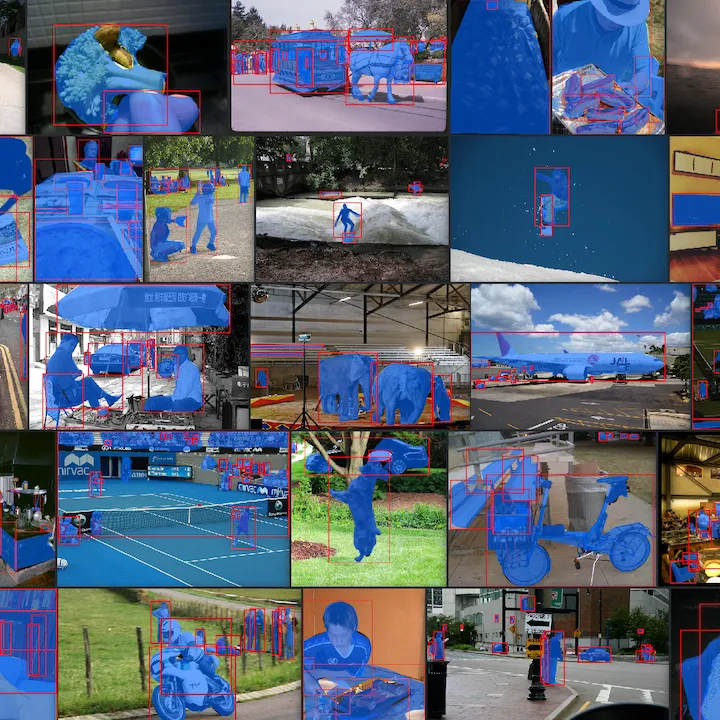

# FiftyOne Integrations [¶](\#fiftyone-integrations "Permalink to this headline")

FiftyOne integrates naturally with other ML tools that you know and love. Click
on the cards below to see how!

* * *

#### COCO Dataset

See how FiftyOne makes downloading, visualizing, and evaluating on the COCO dataset (or your own COCO-formatted data) a breeze.

Datasets,Model-Evaluation

#### Open Images Dataset

See why FiftyOne is a recommended tool for downloading, visualizing, and evaluating on Google's Open Images Dataset.

Datasets,Model-Evaluation

#### ActivityNet Dataset

See how to use FiftyOne to download, visualize, and evaluate on the ActivityNet dataset with ease.

Datasets,Model-Evaluation

#### CVAT

Use our CVAT integration to easily annotate and edit your FiftyOne datasets.

Annotation

#### Label Studio

Annotate and edit your FiftyOne datasets in Label Studio through our integration.

Annotation

#### V7

Use our V7 integration to easily annotate and edit your FiftyOne datasets.

Annotation

#### Labelbox

Use our Labelbox integration to get your FiftyOne datasets annotated.

Annotation

#### Qdrant

Use our Qdrant integration to enable vector search and query your FiftyOne datasets at scale.

Brain,Embeddings,Vector-Search

#### Redis

Use our Redis vector search integration to index your FiftyOne datasets and perform embeddings queries at scale.

Brain,Embeddings,Vector-Search

#### Pinecone

Use our Pinecone integration to index your FiftyOne datasets and perform embeddings queries at scale.

Brain,Embeddings,Vector-Search

#### MongoDB

Use our MongoDB vector search integration to index your FiftyOne datasets and perform embeddings queries at scale.

Brain,Embeddings,Vector-Search

#### Elasticsearch

Use our Elasticsearch integration to enable vector search and query your FiftyOne datasets at scale.

Brain,Embeddings,Vector-Search

#### Milvus

Use our Milvus integration to index your FiftyOne datasets and perform embeddings queries at scale.

Brain,Embeddings,Vector-Search

#### LanceDB

Use our LancedDB integration to index your datasets and perform embeddings queries at scale without the need for a cloud service.

Brain,Embeddings,Vector-Search

#### Hugging Face

Use our Hugging Face Transformers integration to run inference on your FiftyOne datasets with just a few lines of code.

Model-Training,Model-Evaluation,Models,Brain,Embeddings

#### Ultralytics

Load, fine-tune, and run inference with Ultralytics models on your FiftyOne datasets with just a few lines of code.

Model-Training,Model-Evaluation,Models

#### Albumentations

Use our Albumentations integration to test out data augmentation transformations in real-time on your FiftyOne datasets.

Datasets,Model-Training

#### SuperGradients

Use our SuperGradients integration to run inference with YOLO-NAS models on your FiftyOne datasets with just a few lines of code.

Model-Training,Model-Evaluation,Models

#### OpenCLIP

Use our OpenCLIP integration to run inference with CLIP models on your FiftyOne datasets with just a few lines of code.

Brain,Embeddings,Model-Evaluation,Models

#### PyTorch Hub

Did you know? You can load any model from the PyTorch Hub and run inference on your FiftyOne datasets with just a few lines of code.

Model-Training,Model-Evaluation,Models

