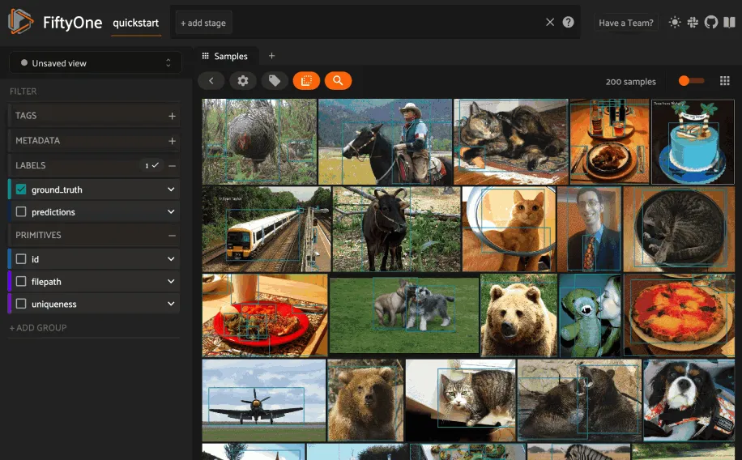

# Milvus Integration [¶](\#milvus-integration "Permalink to this headline")

[Milvus](https://milvus.io/) is one of the most popular vector databases
available, and we’ve made it easy to use Milvus’s vector search
capabilities on your computer vision data directly from FiftyOne!

Follow these [simple instructions](#milvus-setup) to get started using
Milvus + FiftyOne.

FiftyOne provides an API to create Milvus collections, upload vectors, and run
similarity queries, both [programmatically](#milvus-query) in Python and
via point-and-click in the App.

Note

Did you know? You can
[search by natural language](../fiftyone_concepts/brain.md#brain-similarity-text) using Milvus
similarity indexes!



## Basic recipe [¶](\#basic-recipe "Permalink to this headline")

The basic workflow to use Milvus to create a similarity index on your FiftyOne
datasets and use this to query your data is as follows:

1. Load a [dataset](../fiftyone_concepts/dataset_creation/index.md#loading-datasets) into FiftyOne

2. Compute embedding vectors for samples or patches in your dataset, or select
a model to use to generate embeddings

3. Use the `compute_similarity()`
methodto generate a Milvus similarity index for the samples or object
patches in a dataset by setting the parameter `backend="milvus"` and
specifying a `brain_key` of your choice

4. Use this Milvus similarity index to query your data with
[`sort_by_similarity()`](../api/fiftyone.core.collections.html#fiftyone.core.collections.SampleCollection.sort_by_similarity "fiftyone.core.collections.SampleCollection.sort_by_similarity")

5. If desired, delete the index


The example below demonstrates this workflow.

Note

You must [connect to a Milvus server](https://milvus.io/docs/install_standalone-docker.md)
and install the
[Milvus Python client](https://github.com/milvus-io/pymilvus)
to run this example:

```python
wget https://github.com/milvus-io/milvus/releases/download/v2.2.11/milvus-standalone-docker-compose.yml -O docker-compose.yml
sudo docker compose up -d

pip install pymilvus

```

Note that, if you are using a custom Milvus server, you can store your
credentials as described in [this section](#milvus-setup) to avoid
entering them manually each time you interact with your Milvus index.

First let’s load a dataset into FiftyOne and compute embeddings for the
samples:

```python
import fiftyone as fo
import fiftyone.brain as fob
import fiftyone.zoo as foz

# Step 1: Load your data into FiftyOne
dataset = foz.load_zoo_dataset("quickstart")

# Steps 2 and 3: Compute embeddings and create a similarity index
milvus_index = fob.compute_similarity(
    dataset,
    brain_key="milvus_index",
    backend="milvus",
)

```

Once the similarity index has been generated, we can query our data in FiftyOne
by specifying the `brain_key`:

```python
# Step 4: Query your data
query = dataset.first().id  # query by sample ID
view = dataset.sort_by_similarity(
    query,
    brain_key="milvus_index",
    k=10,  # limit to 10 most similar samples
)

# Step 5 (optional): Cleanup

# Delete the Milvus collection
milvus_index.cleanup()

# Delete run record from FiftyOne
dataset.delete_brain_run("milvus_index")

```

Note

Skip to [this section](#milvus-examples) to see a variety of common
Milvus query patterns.

## Setup [¶](\#setup "Permalink to this headline")

The easiest way to get started is to
[install Milvus standalone via Docker Compose](https://milvus.io/docs/install_standalone-docker.md):

```python
wget https://github.com/milvus-io/milvus/releases/download/v2.2.11/milvus-standalone-docker-compose.yml -O docker-compose.yml
sudo docker compose up -d

```

### Installing the Milvus client [¶](\#installing-the-milvus-client "Permalink to this headline")

In order to use the Milvus backend, you must also install the
[Milvus Python client](https://github.com/milvus-io/pymilvus):

```python
pip install pymilvus

```

### Using the Milvus backend [¶](\#using-the-milvus-backend "Permalink to this headline")

By default, calling
`compute_similarity()` or
[`sort_by_similarity()`](../api/fiftyone.core.collections.html#fiftyone.core.collections.SampleCollection.sort_by_similarity "fiftyone.core.collections.SampleCollection.sort_by_similarity")
will use an sklearn backend.

To use the Milvus backend, simply set the optional `backend` parameter of
`compute_similarity()` to
`"milvus"`:

```python
import fiftyone.brain as fob

fob.compute_similarity(..., backend="milvus", ...)

```

Alternatively, you can permanently configure FiftyOne to use the Milvus
backend by setting the following environment variable:

```python
export FIFTYONE_BRAIN_DEFAULT_SIMILARITY_BACKEND=milvus

```

or by setting the `default_similarity_backend` parameter of your
[brain config](../fiftyone_concepts/brain.md#brain-config) located at `~/.fiftyone/brain_config.json`:

```python
{
    "default_similarity_backend": "milvus"
}

```

### Authentication [¶](\#authentication "Permalink to this headline")

If you are using a custom Milvus server, you can provide your credentials in a
variety of ways.

**Environment variables (recommended)**

The recommended way to configure your Milvus credentials is to store them
in the environment variables shown below, which are automatically accessed by
FiftyOne whenever a connection to Milvus is made.

```python
export FIFTYONE_BRAIN_SIMILARITY_MILVUS_URI=XXXXXX
export FIFTYONE_BRAIN_SIMILARITY_MILVUS_USER=XXXXXX
export FIFTYONE_BRAIN_SIMILARITY_MILVUS_PASSWORD=XXXXXX

# also available if necessary
export FIFTYONE_BRAIN_SIMILARITY_MILVUS_SECURE=true
export FIFTYONE_BRAIN_SIMILARITY_MILVUS_TOKEN=XXXXXX
export FIFTYONE_BRAIN_SIMILARITY_MILVUS_DB_NAME=XXXXXX
export FIFTYONE_BRAIN_SIMILARITY_MILVUS_CLIENT_KEY_PATH=XXXXXX
export FIFTYONE_BRAIN_SIMILARITY_MILVUS_CLIENT_PEM_PATH=XXXXXX
export FIFTYONE_BRAIN_SIMILARITY_MILVUS_CA_PEM_PATH=XXXXXX
export FIFTYONE_BRAIN_SIMILARITY_MILVUS_SERVER_PEM_PATH=XXXXXX
export FIFTYONE_BRAIN_SIMILARITY_MILVUS_SERVER_NAME=XXXXXX

```

**FiftyOne Brain config**

You can also store your credentials in your [brain config](../fiftyone_concepts/brain.md#brain-config)
located at `~/.fiftyone/brain_config.json`:

```python
{
    "similarity_backends": {
        "milvus": {
            "uri": "XXXXXX",
            "user": "XXXXXX",
            "password": "XXXXXX",

            # also available if necessary
            "secure": true,
            "token": "XXXXXX",
            "db_name": "XXXXXX",
            "client_key_path": "XXXXXX",
            "client_pem_path": "XXXXXX",
            "ca_pem_path": "XXXXXX",
            "server_pem_path": "XXXXXX",
            "server_name": "XXXXXX"
        }
    }
}

```

Note that this file will not exist until you create it.

**Keyword arguments**

You can manually provide your Milvus credentials as keyword arguments each
time you call methods like
`compute_similarity()` that require
connections to Milvus:

```python
import fiftyone.brain as fob

milvus_index = fob.compute_similarity(
    ...
    backend="milvus",
    brain_key="milvus_index",
    uri="XXXXXX",
    user="XXXXXX",
    password="XXXXXX",

    # also available if necessary
    secure=True,
    token="XXXXXX",
    db_name="XXXXXX",
    client_key_path="XXXXXX",
    client_pem_path="XXXXXX",
    ca_pem_path="XXXXXX",
    server_pem_path="XXXXXX",
    server_name="XXXXXX",
)

```

Note that, when using this strategy, you must manually provide the credentials
when loading an index later via
[`load_brain_results()`](../api/fiftyone.core.collections.html#fiftyone.core.collections.SampleCollection.load_brain_results "fiftyone.core.collections.SampleCollection.load_brain_results"):

```python
milvus_index = dataset.load_brain_results(
    "milvus_index",
    uri="XXXXXX",
    user="XXXXXX",
    password="XXXXXX",

    # also available if necessary
    secure=True,
    token="XXXXXX",
    db_name="XXXXXX",
    client_key_path="XXXXXX",
    client_pem_path="XXXXXX",
    ca_pem_path="XXXXXX",
    server_pem_path="XXXXXX",
    server_name="XXXXXX",
)

```

### Milvus config parameters [¶](\#milvus-config-parameters "Permalink to this headline")

The Milvus backend supports a variety of query parameters that can be used to
customize your similarity queries. These parameters include:

- **collection\_name** ( _None_): the name of the Milvus collection to use or
create. If none is provided, a new collection will be created

- **metric** ( _“dotproduct”_): the embedding distance metric to use when
creating a new index. The supported values are
`("cosine", "dotproduct", "euclidean")`

- **consistency\_level** ( _“Session”_): the consistency level to use.
Supported values are `("Strong", "Session", "Bounded", "Eventually")`


For detailed information on these parameters, see the
[Milvus authentication documentation](https://milvus.io/docs/authenticate.md)
and [Milvus consistency levels documentation](https://milvus.io/docs/consistency.md#Consistency-levels).

You can specify these parameters via any of the strategies described in the
previous section. Here’s an example of a [brain config](../fiftyone_concepts/brain.md#brain-config)
that includes all of the available parameters:

```python
{
    "similarity_backends": {
        "milvus": {
            "collection_name": "your_collection",
            "metric": "dotproduct",
            "consistency_level": "Strong"
        }
    }
}

```

However, typically these parameters are directly passed to
`compute_similarity()` to configure
a specific new index:

```python
milvus_index = fob.compute_similarity(
    ...
    backend="milvus",
    brain_key="milvus_index",
    collection_name="your_collection",
    metric="dotproduct",
    consistency_level="Strong",
)

```

## Managing brain runs [¶](\#managing-brain-runs "Permalink to this headline")

FiftyOne provides a variety of methods that you can use to manage brain runs.

For example, you can call
[`list_brain_runs()`](../api/fiftyone.core.collections.html#fiftyone.core.collections.SampleCollection.list_brain_runs "fiftyone.core.collections.SampleCollection.list_brain_runs")
to see the available brain keys on a dataset:

```python
import fiftyone.brain as fob

# List all brain runs
dataset.list_brain_runs()

# Only list similarity runs
dataset.list_brain_runs(type=fob.Similarity)

# Only list specific similarity runs
dataset.list_brain_runs(
    type=fob.Similarity,
    patches_field="ground_truth",
    supports_prompts=True,
)

```

Or, you can use
[`get_brain_info()`](../api/fiftyone.core.collections.html#fiftyone.core.collections.SampleCollection.get_brain_info "fiftyone.core.collections.SampleCollection.get_brain_info")
to retrieve information about the configuration of a brain run:

```python
info = dataset.get_brain_info(brain_key)
print(info)

```

Use [`load_brain_results()`](../api/fiftyone.core.collections.html#fiftyone.core.collections.SampleCollection.load_brain_results "fiftyone.core.collections.SampleCollection.load_brain_results")
to load the `SimilarityIndex` instance for a brain run.

You can use
[`rename_brain_run()`](../api/fiftyone.core.collections.html#fiftyone.core.collections.SampleCollection.rename_brain_run "fiftyone.core.collections.SampleCollection.rename_brain_run")
to rename the brain key associated with an existing similarity results run:

```python
dataset.rename_brain_run(brain_key, new_brain_key)

```

Finally, you can use
[`delete_brain_run()`](../api/fiftyone.core.collections.html#fiftyone.core.collections.SampleCollection.delete_brain_run "fiftyone.core.collections.SampleCollection.delete_brain_run")
to delete the record of a similarity index computation from your FiftyOne
dataset:

```python
dataset.delete_brain_run(brain_key)

```

Note

Calling
[`delete_brain_run()`](../api/fiftyone.core.collections.html#fiftyone.core.collections.SampleCollection.delete_brain_run "fiftyone.core.collections.SampleCollection.delete_brain_run")
only deletes the **record** of the brain run from your FiftyOne dataset; it
will not delete any associated Milvus collection, which you can do as follows:

```python
# Delete the Milvus collection
milvus_index = dataset.load_brain_results(brain_key)
milvus_index.cleanup()

```

## Examples [¶](\#examples "Permalink to this headline")

This section demonstrates how to perform some common vector search workflows on
a FiftyOne dataset using the Milvus backend.

Note

All of the examples below assume you have configured your Milvus server
and connection as described in [this section](#milvus-setup).

### Create a similarity index [¶](\#create-a-similarity-index "Permalink to this headline")

In order to create a new Milvus similarity index, you need to specify either
the `embeddings` or `model` argument to
`compute_similarity()`. Here’s a few
possibilities:

```python
import fiftyone as fo
import fiftyone.brain as fob
import fiftyone.zoo as foz

dataset = foz.load_zoo_dataset("quickstart")
model_name = "clip-vit-base32-torch"
model = foz.load_zoo_model(model_name)
brain_key = "milvus_index"

# Option 1: Compute embeddings on the fly from model name
fob.compute_similarity(
    dataset,
    model=model_name,
    backend="milvus",
    brain_key=brain_key,
)

# Option 2: Compute embeddings on the fly from model instance
fob.compute_similarity(
    dataset,
    model=model,
    backend="milvus",
    brain_key=brain_key,
)

# Option 3: Pass precomputed embeddings as a numpy array
embeddings = dataset.compute_embeddings(model)
fob.compute_similarity(
    dataset,
    embeddings=embeddings,
    backend="milvus",
    brain_key=brain_key,
)

# Option 4: Pass precomputed embeddings by field name
dataset.compute_embeddings(model, embeddings_field="embeddings")
fob.compute_similarity(
    dataset,
    embeddings="embeddings",
    backend="milvus",
    brain_key=brain_key,
)

```

Note

You can customize the Milvus similarity index by passing any
[supported parameters](#milvus-config-parameters) as extra kwargs.

### Create a patch similarity index [¶](\#create-a-patch-similarity-index "Permalink to this headline")

You can also create a similarity index for
[object patches](../fiftyone_concepts/brain.md#brain-object-similarity) within your dataset by
specifying a `patches_field` argument to
`compute_similarity()`:

```python
import fiftyone as fo
import fiftyone.brain as fob
import fiftyone.zoo as foz

dataset = foz.load_zoo_dataset("quickstart")

fob.compute_similarity(
    dataset,
    patches_field="ground_truth",
    model="clip-vit-base32-torch",
    backend="milvus",
    brain_key="milvus_patches",
)

```

Note

You can customize the Milvus index by passing any
[supported parameters](#milvus-config-parameters) as extra kwargs.

### Connect to an existing collection [¶](\#connect-to-an-existing-collection "Permalink to this headline")

If you have already created a Milvus collection storing the embedding vectors
for the samples or patches in your dataset, you can connect to it by passing
the `collection_name` to
`compute_similarity()`:

```python
import fiftyone as fo
import fiftyone.brain as fob
import fiftyone.zoo as foz

dataset = foz.load_zoo_dataset("quickstart")

fob.compute_similarity(
    dataset,
    model="clip-vit-base32-torch",      # zoo model used (if applicable)
    embeddings=False,                   # don't compute embeddings
    collection_name="your_collection",  # the existing Milvus collection
    brain_key="milvus_index",
    backend="milvus",
)

```

### Add/remove embeddings from an index [¶](\#add-remove-embeddings-from-an-index "Permalink to this headline")

You can use
`add_to_index()`
and
`remove_from_index()`
to add and remove embeddings from an existing Milvus similarity index.

These methods can come in handy if you modify your FiftyOne dataset and need
to update the Milvus similarity index to reflect these changes:

```python
import numpy as np

import fiftyone as fo
import fiftyone.brain as fob
import fiftyone.zoo as foz

dataset = foz.load_zoo_dataset("quickstart")

milvus_index = fob.compute_similarity(
    dataset,
    model="clip-vit-base32-torch",
    brain_key="milvus_index",
    backend="milvus",
)
print(milvus_index.total_index_size)  # 200

view = dataset.take(10)
ids = view.values("id")

# Delete 10 samples from a dataset
dataset.delete_samples(view)

# Delete the corresponding vectors from the index
milvus_index.remove_from_index(sample_ids=ids)

# Add 20 samples to a dataset
samples = [fo.Sample(filepath="tmp%d.jpg" % i) for i in range(20)]
sample_ids = dataset.add_samples(samples)

# Add corresponding embeddings to the index
embeddings = np.random.rand(20, 512)
milvus_index.add_to_index(embeddings, sample_ids)

print(milvus_index.total_index_size)  # 210

```

### Retrieve embeddings from an index [¶](\#retrieve-embeddings-from-an-index "Permalink to this headline")

You can use
`get_embeddings()`
to retrieve embeddings from a Milvus index by ID:

```python
import fiftyone as fo
import fiftyone.brain as fob
import fiftyone.zoo as foz

dataset = foz.load_zoo_dataset("quickstart")

milvus_index = fob.compute_similarity(
    dataset,
    model="clip-vit-base32-torch",
    brain_key="milvus_index",
    backend="milvus",
)

# Retrieve embeddings for the entire dataset
ids = dataset.values("id")
embeddings, sample_ids, _ = milvus_index.get_embeddings(sample_ids=ids)
print(embeddings.shape)  # (200, 512)
print(sample_ids.shape)  # (200,)

# Retrieve embeddings for a view
ids = dataset.take(10).values("id")
embeddings, sample_ids, _ = milvus_index.get_embeddings(sample_ids=ids)
print(embeddings.shape)  # (10, 512)
print(sample_ids.shape)  # (10,)

```

### Querying a Milvus index [¶](\#querying-a-milvus-index "Permalink to this headline")

You can query a Milvus index by appending a
[`sort_by_similarity()`](../api/fiftyone.core.collections.html#fiftyone.core.collections.SampleCollection.sort_by_similarity "fiftyone.core.collections.SampleCollection.sort_by_similarity")
stage to any dataset or view. The query can be any of the following:

- An ID (sample or patch)

- A query vector of same dimension as the index

- A list of IDs (samples or patches)

- A text prompt (if [supported by the model](../fiftyone_concepts/brain.md#brain-similarity-text))


```python
import numpy as np

import fiftyone as fo
import fiftyone.brain as fob
import fiftyone.zoo as foz

dataset = foz.load_zoo_dataset("quickstart")

fob.compute_similarity(
    dataset,
    model="clip-vit-base32-torch",
    brain_key="milvus_index",
    backend="milvus",
)

# Query by vector
query = np.random.rand(512)  # matches the dimension of CLIP embeddings
view = dataset.sort_by_similarity(query, k=10, brain_key="milvus_index")

# Query by sample ID
query = dataset.first().id
view = dataset.sort_by_similarity(query, k=10, brain_key="milvus_index")

# Query by a list of IDs
query = [dataset.first().id, dataset.last().id]
view = dataset.sort_by_similarity(query, k=10, brain_key="milvus_index")

# Query by text prompt
query = "a photo of a dog"
view = dataset.sort_by_similarity(query, k=10, brain_key="milvus_index")

```

Note

Performing a similarity search on a [`DatasetView`](../api/fiftyone.core.view.html#fiftyone.core.view.DatasetView "fiftyone.core.view.DatasetView") will **only** return
results from the view; if the view contains samples that were not included
in the index, they will never be included in the result.

This means that you can index an entire [`Dataset`](../api/fiftyone.core.dataset.html#fiftyone.core.dataset.Dataset "fiftyone.core.dataset.Dataset") once and then perform
searches on subsets of the dataset by
[constructing views](../fiftyone_concepts/using_views.md#using-views) that contain the images of
interest.

### Accessing the Milvus client [¶](\#accessing-the-milvus-client "Permalink to this headline")

You can use the `collection` property of a Milvus index to directly access the
underlying Milvus collection and use its methods as desired:

```python
import fiftyone as fo
import fiftyone.brain as fob
import fiftyone.zoo as foz

dataset = foz.load_zoo_dataset("quickstart")

milvus_index = fob.compute_similarity(
    dataset,
    model="clip-vit-base32-torch",
    brain_key="milvus_index",
    backend="milvus",
)

print(milvus_index.collection)

# The Milvus SDK is already initialized for you as well
import pymilvus
print(pymilvus.utility.list_collections())

```

### Advanced usage [¶](\#advanced-usage "Permalink to this headline")

As [previously mentioned](#milvus-config-parameters), you can customize
your Milvus indexes by providing optional parameters to
`compute_similarity()`.

Here’s an example of creating a similarity index backed by a customized
Milvus similarity index. Just for fun, we’ll specify a custom collection name,
use euclidean distance, and populate the index for only a subset of our
dataset:

```python
import fiftyone as fo
import fiftyone.brain as fob
import fiftyone.zoo as foz

dataset = foz.load_zoo_dataset("quickstart")

# Create a custom Milvus index
milvus_index = fob.compute_similarity(
    dataset,
    model="clip-vit-base32-torch",
    embeddings=False,  # we'll add embeddings below
    metric="euclidean",
    brain_key="milvus_index",
    backend="milvus",
    collection_name="custom_milvus_collection",
)

# Add embeddings for a subset of the dataset
view = dataset.take(10)
embeddings, sample_ids, _ = milvus_index.compute_embeddings(view)
milvus_index.add_to_index(embeddings, sample_ids)

print(milvus_index.collection)

# The Milvus SDK is already initialized for you as well
import pymilvus
print(pymilvus.utility.list_collections())

```

