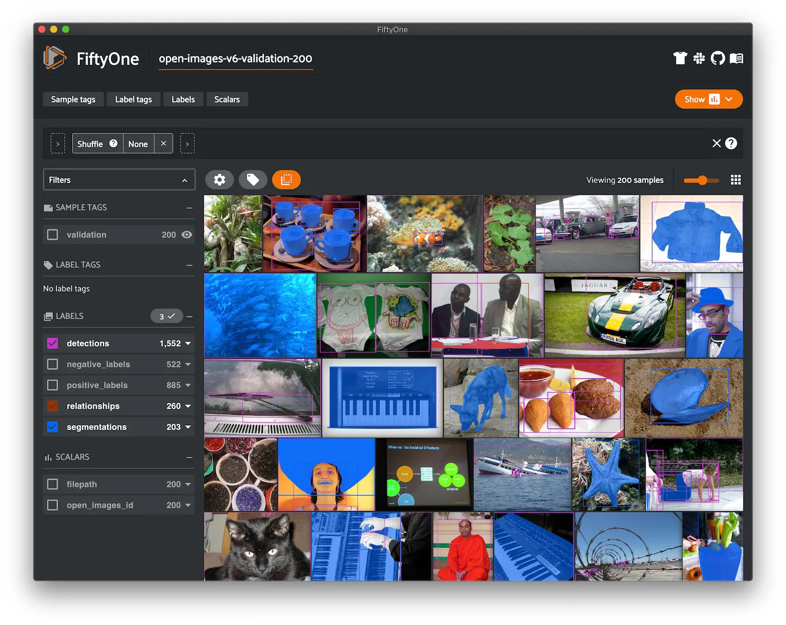
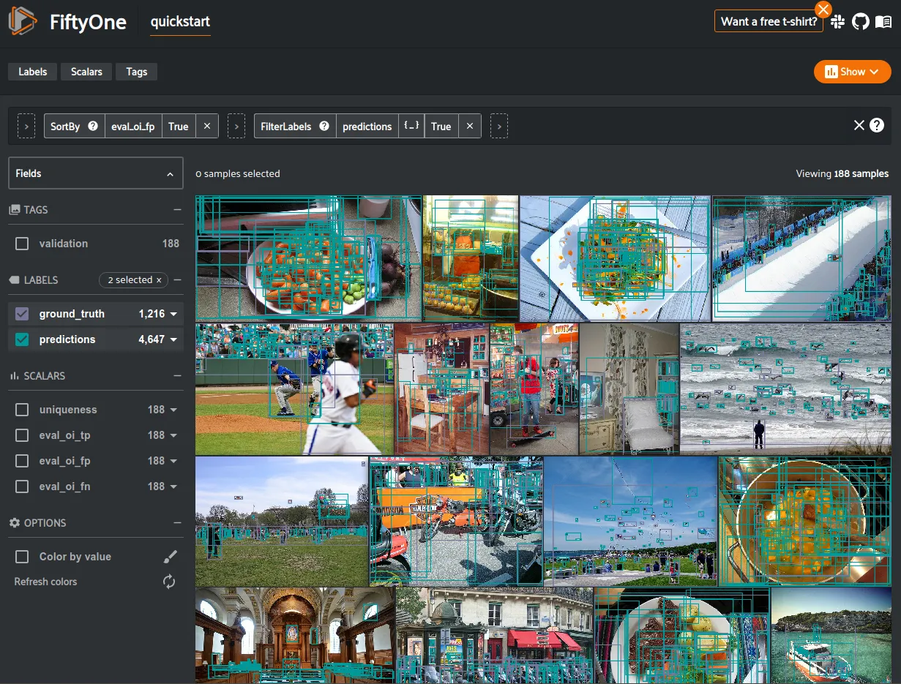
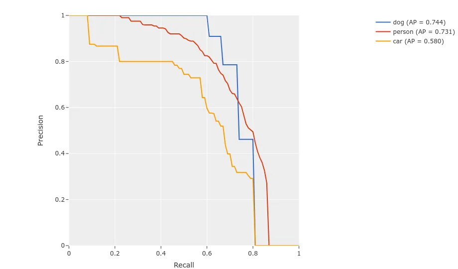

# Open Images Integration [¶](\#open-images-integration "Permalink to this headline")

We’ve collaborated with the team behind the
[Open Images Dataset](https://storage.googleapis.com/openimages/web/download.html)
to make it easy to download, visualize, and evaluate on the Open Images dataset
natively in FiftyOne!

Note

Check out [this tutorial](../tutorials/open_images.md) to see how you can
use FiftyOne to download and evaluate models on Open Images.



## Loading Open Images [¶](\#loading-open-images "Permalink to this headline")

The FiftyOne Dataset Zoo provides support for loading the
[Open Images V6](../data/dataset_zoo/datasets.md#dataset-zoo-open-images-v6) and
[Open Images V7](../data/dataset_zoo/datasets.md#dataset-zoo-open-images-v7) datasets.

Like all other zoo datasets, you can use
[`load_zoo_dataset()`](../api/fiftyone.zoo.datasets.html#fiftyone.zoo.datasets.load_zoo_dataset "fiftyone.zoo.datasets.load_zoo_dataset") to download
and load an Open Images V7 split into FiftyOne:

```python
import fiftyone as fo
import fiftyone.zoo as foz

# Download and load the validation split of Open Images V7
dataset = foz.load_zoo_dataset("open-images-v7", split="validation")

session = fo.launch_app(dataset)

```

Note

FiftyOne supports loading annotations for classification, detection,
segmentation, and visual relationship tasks for the 600 boxable classes
( [cf. dataset overview](https://storage.googleapis.com/openimages/web/factsfigures.html)).

By default, all label types are loaded, but you can customize this via the
optional `label_types` argument (see below for details).

In addition, FiftyOne provides parameters that can be used to efficiently
download specific subsets of the Open Images dataset, allowing you to quickly
explore different slices of the dataset without downloading the entire split.

When performing partial downloads, FiftyOne will use existing downloaded data
first if possible before resorting to downloading additional data from the web.

```python
import fiftyone as fo
import fiftyone.zoo as foz

#
# Load 50 random samples from the validation split of Open Images V7.
#
# Only the required images will be downloaded (if necessary).
# By default, all label types are loaded
#

dataset = foz.load_zoo_dataset(
    "open-images-v7",
    split="validation",
    max_samples=50,
    shuffle=True,
)

session = fo.launch_app(dataset)

#
# Load detections and classifications for 25 samples from the
# validation split of Open Images V6 that contain fedoras and pianos
#
# Images that contain all `label_types` and `classes` will be
# prioritized first, followed by images that contain at least one of
# the required `classes`. If there are not enough images matching
# `classes` in the split to meet `max_samples`, only the available
# images will be loaded.
#
# Images will only be downloaded if necessary
#

dataset = foz.load_zoo_dataset(
    "open-images-v6",
    split="validation",
    label_types=["detections", "classifications"],
    classes=["Fedora", "Piano"],
    max_samples=25,
)

session.dataset = dataset

#
# Load classifications and point labels for all samples from the
# validation split of Open Images V7 with class "Turtle" or "Tortoise".
#
# If there are not enough images matching classes` in the split to
# meet `max_samples`, only the available images will be loaded.
#
# Images will only be downloaded if necessary
#

dataset = foz.load_zoo_dataset(
    "open-images-v7",
    split="validation",
    label_types=["points", "classifications"],
    classes=["Turtle", "Tortoise"],
)

session.dataset = dataset

```

The following parameters are available to configure a partial download of Open
Images V6 or Open Images V7 by passing them to
[`load_zoo_dataset()`](../api/fiftyone.zoo.datasets.html#fiftyone.zoo.datasets.load_zoo_dataset "fiftyone.zoo.datasets.load_zoo_dataset"):

- **split** ( _None_) and **splits** ( _None_): a string or list of strings,
respectively, specifying the splits to load. Supported values are
`("train", "test", "validation")`. If neither is provided, all available
splits are loaded

- **label\_types** ( _None_): a label type or list of label types to load.
Supported values for Open Images V6 are
`("detections", "classifications", "relationships", "segmentations")`.
Open Images V7 also supports `"points"` labels. By default, all labels types are loaded

- **classes** ( _None_): a string or list of strings specifying required
classes to load. If provided, only samples containing at least one instance
of a specified class will be loaded. You can use
[`get_classes()`](../api/fiftyone.utils.openimages.html#fiftyone.utils.openimages.get_classes "fiftyone.utils.openimages.get_classes") and
[`get_segmentation_classes()`](../api/fiftyone.utils.openimages.html#fiftyone.utils.openimages.get_segmentation_classes "fiftyone.utils.openimages.get_segmentation_classes")
to see the available classes and segmentation classes, respectively

- **attrs** ( _None_): a string or list of strings specifying required
relationship attributes to load. This parameter is only applicable if
`label_types` contains `"relationships"`. If provided, only samples
containing at least one instance of a specified attribute will be loaded.
You can use
[`get_attributes()`](../api/fiftyone.utils.openimages.html#fiftyone.utils.openimages.get_attributes "fiftyone.utils.openimages.get_attributes")
to see the available attributes

- **image\_ids** ( _None_): a list of specific image IDs to load. The IDs can
be specified either as `<split>/<image-id>` or `<image-id>` strings.
Alternatively, you can provide the path to a TXT (newline-separated), JSON,
or CSV file containing the list of image IDs to load in either of the first
two formats

- **include\_id** ( _True_): whether to include the Open Images ID of each
sample in the loaded labels

- **only\_matching** ( _False_): whether to only load labels that match the
`classes` or `attrs` requirements that you provide (True), or to load
all labels for samples that match the requirements (False)

- **num\_workers** ( _None_): the number of processes to use when downloading
individual images. By default, `multiprocessing.cpu_count()` is used

- **shuffle** ( _False_): whether to randomly shuffle the order in which
samples are chosen for partial downloads

- **seed** ( _None_): a random seed to use when shuffling

- **max\_samples** ( _None_): a maximum number of samples to load per split. If
`label_types`, `classes`, and/or `attrs` are also specified, first
priority will be given to samples that contain all of the specified label
types, classes, and/or attributes, followed by samples that contain at
least one of the specified labels types or classes. The actual number of
samples loaded may be less than this maximum value if the dataset does not
contain sufficient samples matching your requirements

Note

See
[`OpenImagesV7Dataset`](../api/fiftyone.zoo.datasets.base.html#fiftyone.zoo.datasets.base.OpenImagesV6Dataset "fiftyone.zoo.datasets.base.OpenImagesV6Dataset")
,
[`OpenImagesV7Dataset`](../api/fiftyone.zoo.datasets.base.html#fiftyone.zoo.datasets.base.OpenImagesV7Dataset "fiftyone.zoo.datasets.base.OpenImagesV7Dataset")
and [`OpenImagesDatasetImporter`](../api/fiftyone.utils.openimages.html#fiftyone.utils.openimages.OpenImagesDatasetImporter "fiftyone.utils.openimages.OpenImagesDatasetImporter")
for complete descriptions of the optional keyword arguments that you can
pass to [`load_zoo_dataset()`](../api/fiftyone.zoo.datasets.html#fiftyone.zoo.datasets.load_zoo_dataset "fiftyone.zoo.datasets.load_zoo_dataset").

## Open Images-style evaluation [¶](\#open-images-style-evaluation "Permalink to this headline")

The [`evaluate_detections()`](../api/fiftyone.core.collections.html#fiftyone.core.collections.SampleCollection.evaluate_detections "fiftyone.core.collections.SampleCollection.evaluate_detections")
method provides builtin support for running
[Open Images-style evaluation](https://storage.googleapis.com/openimages/web/evaluation.html).

In order to run Open Images-style evaluation, simply set the `method`
parameter to `"open-images"`.

Note

FiftyOne’s implementation of Open Images-style evaluation matches the
reference implementation available via the
[TF Object Detection API](https://github.com/tensorflow/models/tree/master/research/object_detection).

### Overview [¶](\#overview "Permalink to this headline")

Open Images-style evaluation provides additional features not found in
[COCO-style evaluation](../fiftyone_concepts/evaluation.md#evaluating-detections-coco) that you may find
useful when evaluating your custom datasets.

The two primary differences are:

- **Non-exhaustive image labeling:** positive and negative sample-level
[`Classifications`](../api/fiftyone.core.labels.html#fiftyone.core.labels.Classifications "fiftyone.core.labels.Classifications") fields can be provided to indicate which object classes
were considered when annotating the image. Predicted objects whose classes
are not included in the sample-level labels for a sample are ignored.
The names of these fields can be specified via the `pos_label_field` and
`neg_label_field` parameters

- **Class hierarchies:** If your dataset includes a
[class hierarchy](https://storage.googleapis.com/openimages/2018_04/bbox_labels_600_hierarchy_visualizer/circle.html),
you can configure this evaluation protocol to automatically expand ground
truth and/or predicted leaf classes so that all levels of the hierarchy can
be [correctly evaluated](https://storage.googleapis.com/openimages/web/evaluation.html).
You can provide a label hierarchy via the `hierarchy` parameter. By
default, if you provide a hierarchy, then image-level label fields and
ground truth detections will be expanded to incorporate parent classes
(child classes for negative image-level labels). You can disable this
feature by setting the `expand_gt_hierarchy` parameter to `False`.
Alternatively, you can expand predictions by setting the
`expand_pred_hierarchy` parameter to `True`

In addition, note that:

- Like [VOC-style evaluation](http://host.robots.ox.ac.uk/pascal/VOC/voc2010/devkit_doc_08-May-2010.pdf),
only one IoU (default = 0.5) is used to calculate mAP. You can customize
this value via the `iou` parameter

- When dealing with crowd objects, Open Images-style evaluation dictates that
if a crowd is matched with multiple predictions, each counts as one true
positive when computing mAP

When you specify an `eval_key` parameter, a number of helpful fields will be
populated on each sample and its predicted/ground truth objects:

- True positive (TP), false positive (FP), and false negative (FN) counts
for the each sample are saved in top-level fields of each sample:

```python
TP: sample.<eval_key>_tp
FP: sample.<eval_key>_fp
FN: sample.<eval_key>_fn

```

- The fields listed below are populated on each individual object instance;
these fields tabulate the TP/FP/FN status of the object, the ID of the
matching object (if any), and the matching IoU:

```python
TP/FP/FN: object.<eval_key>
        ID: object.<eval_key>_id
       IoU: object.<eval_key>_iou

```

Note

See [`OpenImagesEvaluationConfig`](../api/fiftyone.utils.eval.openimages.html#fiftyone.utils.eval.openimages.OpenImagesEvaluationConfig "fiftyone.utils.eval.openimages.OpenImagesEvaluationConfig") for complete descriptions of the optional
keyword arguments that you can pass to
[`evaluate_detections()`](../api/fiftyone.core.collections.html#fiftyone.core.collections.SampleCollection.evaluate_detections "fiftyone.core.collections.SampleCollection.evaluate_detections")
when running Open Images-style evaluation.

### Example evaluation [¶](\#example-evaluation "Permalink to this headline")

The example below demonstrates Open Images-style detection evaluation on the
[quickstart dataset](../data/dataset_zoo/datasets.md#dataset-zoo-quickstart) from the Dataset Zoo:

```python
import fiftyone as fo
import fiftyone.zoo as foz
from fiftyone import ViewField as F

dataset = foz.load_zoo_dataset("quickstart")
print(dataset)

# Evaluate the objects in the `predictions` field with respect to the
# objects in the `ground_truth` field
results = dataset.evaluate_detections(
    "predictions",
    gt_field="ground_truth",
    method="open-images",
    eval_key="eval",
)

# Get the 10 most common classes in the dataset
counts = dataset.count_values("ground_truth.detections.label")
classes = sorted(counts, key=counts.get, reverse=True)[:10]

# Print a classification report for the top-10 classes
results.print_report(classes=classes)

# Print some statistics about the total TP/FP/FN counts
print("TP: %d" % dataset.sum("eval_tp"))
print("FP: %d" % dataset.sum("eval_fp"))
print("FN: %d" % dataset.sum("eval_fn"))

# Create a view that has samples with the most false positives first, and
# only includes false positive boxes in the `predictions` field
view = (
    dataset
    .sort_by("eval_fp", reverse=True)
    .filter_labels("predictions", F("eval") == "fp")
)

# Visualize results in the App
session = fo.launch_app(view=view)

```

```python
               precision    recall  f1-score   support

       person       0.25      0.86      0.39       378
         kite       0.27      0.75      0.40        75
          car       0.18      0.80      0.29        61
         bird       0.20      0.51      0.28        51
       carrot       0.09      0.74      0.16        47
         boat       0.09      0.46      0.16        37
    surfboard       0.17      0.73      0.28        30
     airplane       0.36      0.83      0.50        24
traffic light       0.32      0.79      0.45        24
      giraffe       0.36      0.91      0.52        23

    micro avg       0.21      0.79      0.34       750
    macro avg       0.23      0.74      0.34       750
 weighted avg       0.23      0.79      0.36       750

```



### mAP and PR curves [¶](\#map-and-pr-curves "Permalink to this headline")

You can easily compute mean average precision (mAP) and precision-recall (PR)
curves using the results object returned by
[`evaluate_detections()`](../api/fiftyone.core.collections.html#fiftyone.core.collections.SampleCollection.evaluate_detections "fiftyone.core.collections.SampleCollection.evaluate_detections"):

Note

FiftyOne’s implementation of Open Images-style evaluation matches the
reference implementation available via the
[TF Object Detection API](https://github.com/tensorflow/models/tree/master/research/object_detection).

```python
import fiftyone as fo
import fiftyone.zoo as foz

dataset = foz.load_zoo_dataset("quickstart")
print(dataset)

results = dataset.evaluate_detections(
    "predictions",
    gt_field="ground_truth",
    method="open-images",
)

print(results.mAP())
# 0.599

plot = results.plot_pr_curves(classes=["person", "dog", "car"])
plot.show()

```



### Confusion matrices [¶](\#confusion-matrices "Permalink to this headline")

You can also easily generate [confusion matrices](../fiftyone_concepts/evaluation.md#confusion-matrices) for
the results of Open Images-style evaluations.

In order for the confusion matrix to capture anything other than false
positive/negative counts, you will likely want to set the
[`classwise`](../api/fiftyone.utils.eval.openimages.html#fiftyone.utils.eval.openimages.OpenImagesEvaluationConfig "fiftyone.utils.eval.openimages.OpenImagesEvaluationConfig")
parameter to `False` during evaluation so that predicted objects can be
matched with ground truth objects of different classes.

```python
import fiftyone as fo
import fiftyone.zoo as foz

dataset = foz.load_zoo_dataset("quickstart")

# Perform evaluation, allowing objects to be matched between classes
results = dataset.evaluate_detections(
    "predictions",
    gt_field="ground_truth",
    method="open-images",
    classwise=False,
)

# Generate a confusion matrix for the specified classes
plot = results.plot_confusion_matrix(classes=["car", "truck", "motorcycle"])
plot.show()

```


Note

Did you know? [Confusion matrices](../fiftyone_concepts/evaluation.md#confusion-matrices) can be
attached to your [`Session`](../api/fiftyone.core.session.html#fiftyone.core.session.Session "fiftyone.core.session.Session") object and dynamically explored using FiftyOne’s
[interactive plotting features](../fiftyone_concepts/plots.md#interactive-plots)!

## Open Images Challenge [¶](\#open-images-challenge "Permalink to this headline")

Since FiftyOne’s implementation of Open Images-style evaluation matches the
reference implementation from the
[TF Object Detection API](https://github.com/tensorflow/models/tree/master/research/object_detection)
used in the
[Open Images detection challenges](https://storage.googleapis.com/openimages/web/evaluation.html).
you can use it to compute the official mAP for your model while also enjoying
the benefits of working in the FiftyOne ecosystem, including
[using views](../fiftyone_concepts/using_views.md#using-views) to manipulate your dataset and visually
exploring your model’s predictions in the [FiftyOne App](../fiftyone_concepts/app.md#fiftyone-app)!

In order to compute the official Open Images mAP for a model, your dataset
**must** include the appropriate positive and negative sample-level labels, and
you must provide the class hierarchy. Fortunately, when you load the Open
Images dataset
[from the FiftyOne Dataset Zoo](../data/dataset_zoo/datasets.md#dataset-zoo-open-images-v6), all of the
necessary information is automatically loaded for you!

The example snippet below loads the
[Open Images V6](../data/dataset_zoo/datasets.md#dataset-zoo-open-images-v6) dataset and runs the
official Open Images evaluation protocol on some mock model predictions:

```python
import random

import fiftyone as fo
import fiftyone.zoo as foz

# Load some samples from the Open Images V6 dataset from the zoo
dataset = foz.load_zoo_dataset(
    "open-images-v6",
    "validation",
    max_samples=100,
    label_types=["detections", "classifications"],
)

# Generate some fake predictions
for sample in dataset:
    predictions = sample["detections"].copy()
    for detection in predictions.detections:
        detection.confidence = random.random()

    sample["predictions"] = predictions
    sample.save()

# Evaluate your predictions via the official Open Images protocol
results = dataset.evaluate_detections(
    "predictions",
    gt_field="detections",
    method="open-images",
    pos_label_field="positive_labels",
    neg_label_field="negative_labels",
    hierarchy=dataset.info["hierarchy"],

)

# The official mAP for the results
print(results.mAP())

```

Most models trained on Open Images return the predictions for every class in
the hierarchy. However, if your model does not, then you can set the
[`expand_pred_hierarchy`](../api/fiftyone.utils.eval.openimages.html#fiftyone.utils.eval.openimages.OpenImagesEvaluationConfig "fiftyone.utils.eval.openimages.OpenImagesEvaluationConfig")
parameter to `False` to automatically generate predictions for parent classes
in the hierarchy for evaluation purposes.

Note

Check out [this recipe](../recipes/adding_detections.md) to learn how to
add your model’s predictions to a FiftyOne Dataset.

## mAP protocol [¶](\#map-protocol "Permalink to this headline")

The Open Images mAP protocol is similar to [COCO-style mAP](coco.md#coco-map),
with the primary differences being support for image-level labels, class
hierarchies, and differences in the way that objects are matched to crowds.

The steps to compute Open Images-style mAP are detailed below.

**Preprocessing**

- Filter ground truth and predicted objects by class
(unless `classwise=False`)

- Expand the ground truth predictions by duplicating every object and
positive image-level label and modifying the class to include all parent
classes in the class hierarchy. Negative image-level labels are expanded to
include all child classes in the hierarchy for every label in the image

- Sort predicted objects by confidence so that high confidence objects are
matched first

- Sort ground truth objects so that objects with `IsGroupOf=True` (the name
of this attribute can be customized via the `iscrowd` parameter) are
matched last

- Compute IoU between every ground truth and predicted object within the same
class (and between classes if `classwise=False`) in each image

- Compute IoU between predictions and crowd objects as the intersection of
both boxes divided by the area of the prediction only. A prediction fully
inside the crowd box has an IoU of 1

**Matching**

Once IoUs have been computed, predictions and ground truth objects are matched
to compute true positives, false positives, and false negatives:

- For each class, start with the highest confidence prediction, match it to
the ground truth object that it overlaps with the highest IoU. A prediction
only matches if the IoU is above the specified `iou` threshold
(default = 0.5)

- If a prediction matched to a non-crowd gt object, it will not match to a
crowd even if the IoU is higher

- Multiple predictions can match to the same crowd ground truth object, but
only one counts as a true positive, the others are ignored (unlike COCO).
If the crowd is not matched by any prediction, it is a false negative

- (Unlike COCO) If a prediction maximally overlaps with a non-crowd ground
truth object that has already been matched with a higher confidence
prediction, the prediction is marked as a false positive

- If `classwise=False`, predictions can only match to crowds if they are of
the same class

**Computing mAP**

- (Unlike COCO) Only one IoU threshold (default = 0.5) is used to compute mAP

- The next 6 steps are computed separately for each class:

- Construct an array of true positives and false positives, sorted by
confidence

- Compute the cumulative sum of this TP FP array

- Compute precision array by elementwise dividing the TP-FP-sum array by
the total number of predictions up to that point

- Compute recall array by elementwise dividing the TP-FP-sum array with the
total number of ground truth objects for the class

- Ensure that precision is a non-increasing array

- Add values `0` and `1` to precision and recall arrays

- (Unlike COCO) Precision values are not interpolated and all recall values
are used to compute AP. This means that every class will produce a
different number of precision and recall values depending on the number of
true and false positives existing for that class

- For every class that contains at least one ground truth object, compute the
AP by averaging the precision values. Then compute mAP by averaging the AP
values for each class
