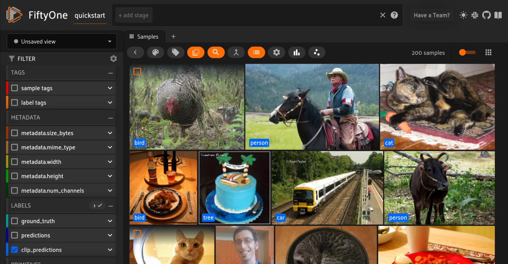
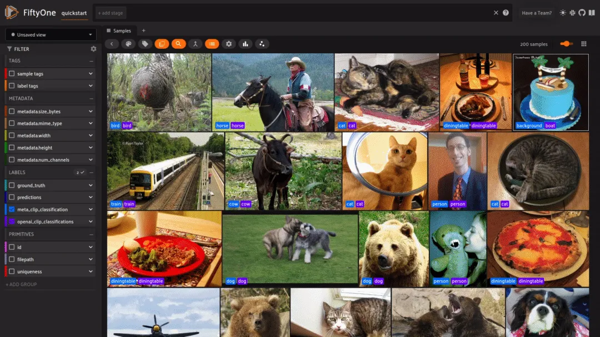

# OpenCLIP Integration [¶](\#openclip-integration "Permalink to this headline")

FiftyOne integrates natively with the
[OpenCLIP](https://github.com/mlfoundations/open_clip) library, an open
source implementation of OpenAI’s CLIP (Contrastive Language-Image
Pre-training) model that you can use to run inference on your FiftyOne datasets
with a few lines of code!

## Setup [¶](\#setup "Permalink to this headline")

To get started with OpenCLIP, install the `open_clip_torch` package:

```python
pip install open_clip_torch

# May also be needed
pip install timm --upgrade

```

## Model zoo [¶](\#model-zoo "Permalink to this headline")

You can load the original ViT-B-32 OpenAI pretrained model from the
[FiftyOne Model Zoo](../models/model_zoo/index.md#model-zoo) as follows:

```python
import fiftyone.zoo as foz

model = foz.load_zoo_model("open-clip-torch")

```

You can also specify different model architectures and pretrained weights by
passing in optional parameters. Pretrained models can be loaded directly from
OpenCLIP or from
[Hugging Face’s Model Hub](https://huggingface.co/docs/hub/models-the-hub):

```python
rn50 = foz.load_zoo_model(
    "open-clip-torch",
    clip_model="RN50",
    pretrained="cc12m",
)

meta_clip = foz.load_zoo_model(
    "open-clip-torch",
    clip_model="ViT-B-32-quickgelu",
    pretrained="metaclip_400m",
)

eva_clip = foz.load_zoo_model(
    "open-clip-torch",
    clip_model="EVA02-B-16",
    pretrained="merged2b_s8b_b131k",
)

clipa = foz.load_zoo_model(
    "open-clip-torch",
    clip_model="hf-hub:UCSC-VLAA/ViT-L-14-CLIPA-datacomp1B",
    pretrained="",
)

siglip = foz.load_zoo_model(
    "open-clip-torch",
    clip_model="hf-hub:timm/ViT-B-16-SigLIP",
    pretrained="",
)

```

## Inference [¶](\#inference "Permalink to this headline")

When running inference with OpenCLIP, you can specify a text prompt to help
guide the model towards a solution as well as only specify a certain number of
classes to output during zero shot classification.

Note

While OpenCLIP models are typically set to train mode by default, the FiftyOne
integration sets the model to eval mode before running inference.

For example we can run inference as such:

```python
import fiftyone as fo
import fiftyone.zoo as foz

dataset = foz.load_zoo_dataset("quickstart")

model = foz.load_zoo_model(
    "open-clip-torch",
    text_prompt="A photo of a",
    classes=["person", "dog", "cat", "bird", "car", "tree", "chair"],
)

dataset.apply_model(model, label_field="clip_predictions")

session = fo.launch_app(dataset)

```



## Embeddings [¶](\#embeddings "Permalink to this headline")

Another application of OpenCLIP is
[embeddings visualization](../fiftyone_concepts/brain.md#brain-embeddings-visualization).

For example, let’s compare the embeddings of the original OpenAI CLIP model to
MetaCLIP. We’ll also perform a quick zero shot classification to color the
embeddings:

```python
import fiftyone.brain as fob

meta_clip = foz.load_zoo_model(
    "open-clip-torch",
    clip_model="ViT-B-32-quickgelu",
    pretrained="metaclip_400m",
    text_prompt="A photo of a",
)

dataset.apply_model(meta_clip, label_field="meta_clip_classification")

fob.compute_visualization(
    dataset,
    model=meta_clip,
    brain_key="meta_clip",
)

openai_clip = foz.load_zoo_model(
    "open-clip-torch",
    text_prompt="A photo of a",
)

dataset.apply_model(openai_clip, label_field="openai_clip_classifications")

fob.compute_visualization(
    dataset,
    model=openai_clip,
    brain_key="openai_clip",
)

```

Here is the final result!



## Text similarity search [¶](\#text-similarity-search "Permalink to this headline")

OpenCLIP can also be used for
[text similarity search](../fiftyone_concepts/brain.md#brain-similarity-text).

To use a specific pretrained-checkpoint pair for text similarity search, pass
these in as a dictionary via the `model_kwargs` argument to
`compute_similarity()`.

For example, for MetaCLIP, we can do the following:

```python
import fiftyone as fo
import fiftyone.zoo as foz
import fiftyone.brain as fob

dataset = foz.load_zoo_dataset("quickstart")

model_kwargs = {
    "clip_model": "ViT-B-32-quickgelu",
    "pretrained": "metaclip_400m",
    "text_prompt": "A photo of a",
}

fob.compute_similarity(
    dataset,
    model="open-clip-torch",
    model_kwargs=model_kwargs,
    brain_key="sim_metaclip",
)

```

You can then search by text similarity in Python via the
[`sort_by_similarity()`](../api/fiftyone.core.collections.html#fiftyone.core.collections.SampleCollection.sort_by_similarity "fiftyone.core.collections.SampleCollection.sort_by_similarity")
stage as follows:

```python
query = "kites flying in the sky"

view = dataset.sort_by_similarity(query, k=25, brain_key="sim_metaclip")

```

Note

Did you know? You can also perform text similarity queries directly
[in the App](../fiftyone_concepts/app.md#app-text-similarity)!
