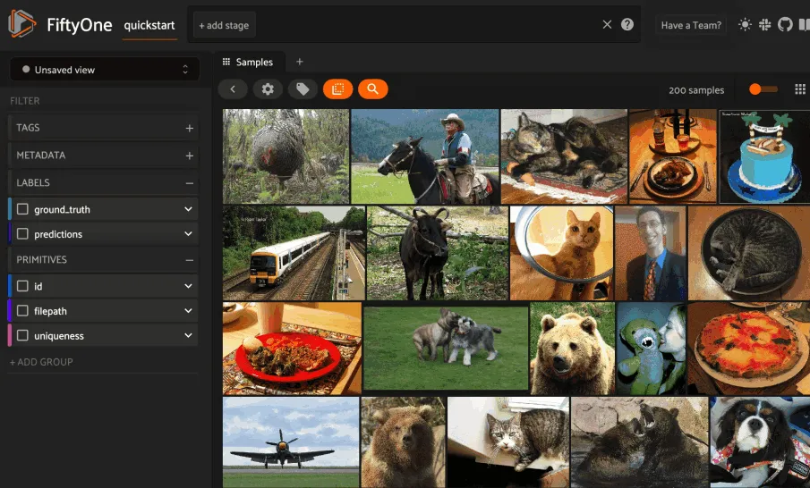

# Qdrant Integration [¶](\#qdrant-integration "Permalink to this headline")

[Qdrant](https://qdrant.tech) is one of the most popular vector search
engines available, and we’ve made it easy to use Qdrant’s vector search
capabilities on your computer vision data directly from FiftyOne!

Follow these [simple instructions](#qdrant-setup) to configure your Qdrant
server and get started using Qdrant + FiftyOne.

FiftyOne provides an API to create Qdrant collections, upload vectors, and run
similarity queries, both [programmatically](#qdrant-query) in Python and
via point-and-click in the App.

Note

Did you know? You can
[search by natural language](../fiftyone_concepts/brain.md#brain-similarity-text) using Qdrant
similarity indexes!



## Basic recipe [¶](\#basic-recipe "Permalink to this headline")

The basic workflow to use Qdrant to create a similarity index on your FiftyOne
datasets and use this to query your data is as follows:

1. Start a Qdrant service locally

2. Load a [dataset](../fiftyone_concepts/dataset_creation/index.md#loading-datasets) into FiftyOne

3. Compute embedding vectors for samples or patches in your dataset, or select
a model to use to generate embeddings

4. Use the `compute_similarity()`
method to generate a Qdrant similarity index for the samples or object
patches in a dataset by setting the parameter `backend="qdrant"` and
specifying a `brain_key` of your choice

5. Use this Qdrant similarity index to query your data with
[`sort_by_similarity()`](../api/fiftyone.core.collections.html#fiftyone.core.collections.SampleCollection.sort_by_similarity "fiftyone.core.collections.SampleCollection.sort_by_similarity")

6. If desired, delete the index


The example below demonstrates this workflow.

Note

You must [launch a Qdrant server](https://qdrant.tech) and install the
[Qdrant Python client](https://github.com/qdrant/qdrant_client) to run
this example:

```python
docker pull qdrant/qdrant
docker run -p 6333:6333 qdrant/qdrant

pip install qdrant-client

```

Note that, if you are using a custom Qdrant server, you can store your
credentials as described in [this section](#qdrant-setup) to avoid
entering them manually each time you interact with your Qdrant index.

First let’s load a dataset into FiftyOne and compute embeddings for the samples:

```python
import fiftyone as fo
import fiftyone.brain as fob
import fiftyone.zoo as foz

# Step 1: Load your data into FiftyOne
dataset = foz.load_zoo_dataset("quickstart")

# Steps 2 and 3: Compute embeddings and create a similarity index
qdrant_index = fob.compute_similarity(
    dataset,
    brain_key="qdrant_index",
    backend="qdrant",
)

```

Once the similarity index has been generated, we can query our data in FiftyOne
by specifying the `brain_key`:

```python
# Step 4: Query your data
query = dataset.first().id  # query by sample ID
view = dataset.sort_by_similarity(
    query,
    brain_key="qdrant_index",
    k=10,  # limit to 10 most similar samples
)

# Step 5 (optional): Cleanup

# Delete the Qdrant collection
qdrant_index.cleanup()

# Delete run record from FiftyOne
dataset.delete_brain_run("qdrant_index")

```

Note

Skip to [this section](#qdrant-examples) for a variety of common
Qdrant query patterns.

## Setup [¶](\#setup "Permalink to this headline")

The easiest way to get started with Qdrant is to
[install locally via Docker](https://qdrant.tech/documentation/install/):

```python
docker pull qdrant/qdrant
docker run -p 6333:6333 qdrant/qdrant

```

### Installing the Qdrant client [¶](\#installing-the-qdrant-client "Permalink to this headline")

In order to use the Qdrant backend, you must also install the
[Qdrant Python client](https://qdrant.tech/documentation/install/#python-client):

```python
pip install qdrant-client

```

### Using the Qdrant backend [¶](\#using-the-qdrant-backend "Permalink to this headline")

By default, calling
`compute_similarity()` or
[`sort_by_similarity()`](../api/fiftyone.core.collections.html#fiftyone.core.collections.SampleCollection.sort_by_similarity "fiftyone.core.collections.SampleCollection.sort_by_similarity")
will use an sklearn backend.

To use the Qdrant backend, simply set the optional `backend` parameter of
`compute_similarity()` to `"qdrant"`:

```python
import fiftyone.brain as fob

fob.compute_similarity(..., backend="qdrant", ...)

```

Alternatively, you can permanently configure FiftyOne to use the Qdrant backend
by setting the following environment variable:

```python
export FIFTYONE_BRAIN_DEFAULT_SIMILARITY_BACKEND=qdrant

```

or by setting the `default_similarity_backend` parameter of your
[brain config](../fiftyone_concepts/brain.md#brain-config) located at `~/.fiftyone/brain_config.json`:

```python
{
    "default_similarity_backend": "qdrant"
}

```

### Authentication [¶](\#authentication "Permalink to this headline")

If you are using a custom Qdrant server, you can provide your credentials in a
variety of ways.

**Environment variables (recommended)**

The recommended way to configure your Qdrant credentials is to store them in
the environment variables shown below, which are automatically accessed by
FiftyOne whenever a connection to Qdrant is made.

```python
export FIFTYONE_BRAIN_SIMILARITY_QDRANT_URL=localhost:6333
export FIFTYONE_BRAIN_SIMILARITY_QDRANT_API_KEY=XXXXXXXX
export FIFTYONE_BRAIN_SIMILARITY_QDRANT_GRPC_PORT=6334
export FIFTYONE_BRAIN_SIMILARITY_QDRANT_PREFER_GRPC=false

```

The `API_KEY`, `GRPC_PORT`, and `PREFER_GRPC` environment variables are optional.

**FiftyOne Brain config**

You can also store your credentials in your [brain config](../fiftyone_concepts/brain.md#brain-config)
located at `~/.fiftyone/brain_config.json`:

```python
{
    "similarity_backends": {
        "qdrant": {
            "url": "http://localhost:6333",
            "api_key": "XXXXXXXX",
            "grpc_port": 6334,
            "prefer_grpc": false
        }
    }
}

```

Note that this file will not exist until you create it.

**Keyword arguments**

You can manually provide credentials as keyword arguments each time you call
methods like `compute_similarity()`
that require connections to Qdrant:

```python
import fiftyone.brain as fob

qdrant_index = fob.compute_similarity(
    ...
    backend="qdrant",
    brain_key="qdrant_index",
    url="http://localhost:6333",
    api_key="XXXXXXXX",
    grpc_port=6334,
    prefer_grpc=False
)

```

Note that, when using this strategy, you must manually provide the credentials
when loading an index later via
[`load_brain_results()`](../api/fiftyone.core.collections.html#fiftyone.core.collections.SampleCollection.load_brain_results "fiftyone.core.collections.SampleCollection.load_brain_results"):

```python
qdrant_index = dataset.load_brain_results(
    "qdrant_index",
    url="http://localhost:6333",
    api_key="XXXXXXXX",
    grpc_port=6334,
    prefer_grpc=False
)

```

### Qdrant config parameters [¶](\#qdrant-config-parameters "Permalink to this headline")

The Qdrant backend supports a variety of query parameters that can be used to
customize your similarity queries. These parameters broadly fall into four
categories:

1. Basic vector database parameters

2. Hierarchical navigable small world (HNSW) parameters

3. Write-ahead-log (WAL) parameters

4. Performance/optimizers parameters


For detailed information on these parameters, see the
[Qdrant documentation](https://qdrant.tech/documentation/configuration).

You can specify these parameters via any of the strategies described in the
previous section. Here’s an example of a [brain config](../fiftyone_concepts/brain.md#brain-config)
that includes all of the available parameters:

```python
{
    "similarity_backends": {
        "qdrant": {
            "metric": "cosine",
            "replication_factor": null,
            "shard_number": null,
            "write_consistency_factor": null,
            "hnsw_config": {
                "m": 16,
                "ef_construct": 100,
                "full_scan_threshold": 10000,
                "max_indexing_threads": null,
                "on_disk": null,
                "payload_m": null
            },
            "optimizers_config": {
                "deleted_threshold": 0.2,
                "vacuum_min_vector_number": 1000,
                "default_segment_number": 0,
                "max_segment_size": null,
                "memmap_threshold": null,
                "indexing_threshold": 20000,
                "flush_interval_sec": 5,
                "max_optimization_threads": 1
            },
            "wal_config": {
                "wal_capacity_mb": 32,
                "wal_segments_ahead": 0
            }
        }
    }
}

```

However, typically these parameters are directly passed to
`compute_similarity()` to configure
a specific new index:

```python
qdrant_index = fob.compute_similarity(
    ...
    backend="qdrant",
    brain_key="qdrant_index",
    collection_name="your-collection-name",
    metric="cosine",
    replication_factor=1,
)

```

## Managing brain runs [¶](\#managing-brain-runs "Permalink to this headline")

FiftyOne provides a variety of methods that you can use to manage brain runs.

For example, you can call
[`list_brain_runs()`](../api/fiftyone.core.collections.html#fiftyone.core.collections.SampleCollection.list_brain_runs "fiftyone.core.collections.SampleCollection.list_brain_runs")
to see the available brain keys on a dataset:

```python
import fiftyone.brain as fob

# List all brain runs
dataset.list_brain_runs()

# Only list similarity runs
dataset.list_brain_runs(type=fob.Similarity)

# Only list specific similarity runs
dataset.list_brain_runs(
    type=fob.Similarity,
    patches_field="ground_truth",
    supports_prompts=True,
)

```

Or, you can use
[`get_brain_info()`](../api/fiftyone.core.collections.html#fiftyone.core.collections.SampleCollection.get_brain_info "fiftyone.core.collections.SampleCollection.get_brain_info")
to retrieve information about the configuration of a brain run:

```python
info = dataset.get_brain_info(brain_key)
print(info)

```

Use [`load_brain_results()`](../api/fiftyone.core.collections.html#fiftyone.core.collections.SampleCollection.load_brain_results "fiftyone.core.collections.SampleCollection.load_brain_results")
to load the `SimilarityIndex` instance for a brain run.

You can use
[`rename_brain_run()`](../api/fiftyone.core.collections.html#fiftyone.core.collections.SampleCollection.rename_brain_run "fiftyone.core.collections.SampleCollection.rename_brain_run")
to rename the brain key associated with an existing similarity results run:

```python
dataset.rename_brain_run(brain_key, new_brain_key)

```

Finally, you can use
[`delete_brain_run()`](../api/fiftyone.core.collections.html#fiftyone.core.collections.SampleCollection.delete_brain_run "fiftyone.core.collections.SampleCollection.delete_brain_run")
to delete the record of a similarity index computation from your FiftyOne
dataset:

```python
dataset.delete_brain_run(brain_key)

```

Note

Calling
[`delete_brain_run()`](../api/fiftyone.core.collections.html#fiftyone.core.collections.SampleCollection.delete_brain_run "fiftyone.core.collections.SampleCollection.delete_brain_run")
only deletes the **record** of the brain run from your FiftyOne dataset; it
will not delete any associated Qdrant collection, which you can do as
follows:

```python
# Delete the Qdrant collection
qdrant_index = dataset.load_brain_results(brain_key)
qdrant_index.cleanup()

```

## Examples [¶](\#examples "Permalink to this headline")

This section demonstrates how to perform some common vector search workflows on
a FiftyOne dataset using the Qdrant backend.

Note

All of the examples below assume you have configured your Qdrant server
as described in [this section](#qdrant-setup).

### Create a similarity index [¶](\#create-a-similarity-index "Permalink to this headline")

In order to create a new Qdrant similarity index, you need to specify either
the `embeddings` or `model` argument to
`compute_similarity()`. Here’s a few
possibilities:

```python
import fiftyone as fo
import fiftyone.brain as fob
import fiftyone.zoo as foz

dataset = foz.load_zoo_dataset("quickstart")
model_name = "clip-vit-base32-torch"
model = foz.load_zoo_model(model_name)
brain_key = "qdrant_index"

# Option 1: Compute embeddings on the fly from model name
fob.compute_similarity(
    dataset,
    model=model_name,
    backend="qdrant",
    brain_key=brain_key,
)

# Option 2: Compute embeddings on the fly from model instance
fob.compute_similarity(
    dataset,
    model=model,
    backend="qdrant",
    brain_key=brain_key,
)

# Option 3: Pass precomputed embeddings as a numpy array
embeddings = dataset.compute_embeddings(model)
fob.compute_similarity(
    dataset,
    embeddings=embeddings,
    backend="qdrant",
    brain_key=brain_key,
)

# Option 4: Pass precomputed embeddings by field name
dataset.compute_embeddings(model, embeddings_field="embeddings")
fob.compute_similarity(
    dataset,
    embeddings="embeddings",
    backend="qdrant",
    brain_key=brain_key,
)

```

Note

You can customize the Qdrant collection by passing any
[supported parameters](#qdrant-config-parameters) as extra kwargs.

### Create a patch similarity index [¶](\#create-a-patch-similarity-index "Permalink to this headline")

You can also create a similarity index for
[object patches](../fiftyone_concepts/brain.md#brain-object-similarity) within your dataset by
including the `patches_field` argument to
`compute_similarity()`:

```python
import fiftyone as fo
import fiftyone.brain as fob
import fiftyone.zoo as foz

dataset = foz.load_zoo_dataset("quickstart")

fob.compute_similarity(
    dataset,
    patches_field="ground_truth",
    model="clip-vit-base32-torch",
    backend="qdrant",
    brain_key="qdrant_patches",
)

```

Note

You can customize the Qdrant collection by passing any
[supported parameters](#qdrant-config-parameters) as extra kwargs.

### Connect to an existing index [¶](\#connect-to-an-existing-index "Permalink to this headline")

If you have already created a Qdrant collection storing the embedding vectors
for the samples or patches in your dataset, you can connect to it by passing
the `collection_name` to
`compute_similarity()`:

```python
import fiftyone as fo
import fiftyone.brain as fob
import fiftyone.zoo as foz

dataset = foz.load_zoo_dataset("quickstart")

fob.compute_similarity(
    dataset,
    model="clip-vit-base32-torch",      # zoo model used (if applicable)
    embeddings=False,                   # don't compute embeddings
    collection_name="your-collection",  # the existing Qdrant collection
    brain_key="qdrant_index",
    backend="qdrant",
)

```

### Add/remove embeddings from an index [¶](\#add-remove-embeddings-from-an-index "Permalink to this headline")

You can use
`add_to_index()`
and
`remove_from_index()`
to add and remove embeddings from an existing Qdrant index.

These methods can come in handy if you modify your FiftyOne dataset and need
to update the Qdrant index to reflect these changes:

```python
import numpy as np

import fiftyone as fo
import fiftyone.brain as fob
import fiftyone.zoo as foz

dataset = foz.load_zoo_dataset("quickstart")

qdrant_index = fob.compute_similarity(
    dataset,
    model="clip-vit-base32-torch",
    brain_key="qdrant_index",
    backend="qdrant",
)
print(qdrant_index.total_index_size)  # 200

view = dataset.take(10)
ids = view.values("id")

# Delete 10 samples from a dataset
dataset.delete_samples(view)

# Delete the corresponding vectors from the index
qdrant_index.remove_from_index(sample_ids=ids)

# Add 20 samples to a dataset
samples = [fo.Sample(filepath="tmp%d.jpg" % i) for i in range(20)]
sample_ids = dataset.add_samples(samples)

# Add corresponding embeddings to the index
embeddings = np.random.rand(20, 512)
qdrant_index.add_to_index(embeddings, sample_ids)

print(qdrant_index.total_index_size)  # 210

```

### Retrieve embeddings from an index [¶](\#retrieve-embeddings-from-an-index "Permalink to this headline")

You can use
`get_embeddings()`
to retrieve embeddings from a Qdrant index by ID:

```python
import fiftyone as fo
import fiftyone.brain as fob
import fiftyone.zoo as foz

dataset = foz.load_zoo_dataset("quickstart")

qdrant_index = fob.compute_similarity(
    dataset,
    model="clip-vit-base32-torch",
    brain_key="qdrant_index",
    backend="qdrant",
)

# Retrieve embeddings for the entire dataset
ids = dataset.values("id")
embeddings, sample_ids, _ = qdrant_index.get_embeddings(sample_ids=ids)
print(embeddings.shape)  # (200, 512)
print(sample_ids.shape)  # (200,)

# Retrieve embeddings for a view
ids = dataset.take(10).values("id")
embeddings, sample_ids, _ = qdrant_index.get_embeddings(sample_ids=ids)
print(embeddings.shape)  # (10, 512)
print(sample_ids.shape)  # (10,)

```

### Querying a Qdrant index [¶](\#querying-a-qdrant-index "Permalink to this headline")

You can query a Qdrant index by appending a
[`sort_by_similarity()`](../api/fiftyone.core.collections.html#fiftyone.core.collections.SampleCollection.sort_by_similarity "fiftyone.core.collections.SampleCollection.sort_by_similarity")
stage to any dataset or view. The query can be any of the following:

- An ID (sample or patch)

- A query vector of same dimension as the index

- A list of IDs (samples or patches)

- A text prompt (if [supported by the model](../fiftyone_concepts/brain.md#brain-similarity-text))


```python
import numpy as np

import fiftyone as fo
import fiftyone.brain as fob
import fiftyone.zoo as foz

dataset = foz.load_zoo_dataset("quickstart")

fob.compute_similarity(
    dataset,
    model="clip-vit-base32-torch",
    brain_key="qdrant_index",
    backend="qdrant",
)

# Query by vector
query = np.random.rand(512)  # matches the dimension of CLIP embeddings
view = dataset.sort_by_similarity(query, k=10, brain_key="qdrant_index")

# Query by sample ID
query = dataset.first().id
view = dataset.sort_by_similarity(query, k=10, brain_key="qdrant_index")

# Query by a list of IDs
query = [dataset.first().id, dataset.last().id]
view = dataset.sort_by_similarity(query, k=10, brain_key="qdrant_index")

# Query by text prompt
query = "a photo of a dog"
view = dataset.sort_by_similarity(query, k=10, brain_key="qdrant_index")

```

Note

Performing a similarity search on a [`DatasetView`](../api/fiftyone.core.view.html#fiftyone.core.view.DatasetView "fiftyone.core.view.DatasetView") will **only** return
results from the view; if the view contains samples that were not included
in the index, they will never be included in the result.

This means that you can index an entire [`Dataset`](../api/fiftyone.core.dataset.html#fiftyone.core.dataset.Dataset "fiftyone.core.dataset.Dataset") once and then perform
searches on subsets of the dataset by
[constructing views](../fiftyone_concepts/using_views.md#using-views) that contain the images of
interest.

### Accessing the Qdrant client [¶](\#accessing-the-qdrant-client "Permalink to this headline")

You can use the `client` property of a Qdrant index to directly access the
underlying Qdrant client instance and use its methods as desired:

```python
import fiftyone as fo
import fiftyone.brain as fob
import fiftyone.zoo as foz

dataset = foz.load_zoo_dataset("quickstart")

qdrant_index = fob.compute_similarity(
    dataset,
    model="clip-vit-base32-torch",
    brain_key="qdrant_index",
    backend="qdrant",
)

qdrant_client = qdrant_index.client
print(qdrant_client)
print(qdrant_client.get_collections())

```

### Advanced usage [¶](\#advanced-usage "Permalink to this headline")

As [previously mentioned](#qdrant-config-parameters), you can customize
your Qdrant collections by providing optional parameters to
`compute_similarity()`.

In particular, the `hnsw_config`, `wal_config`, and `optimizers_config`
parameters may impact the quality of your query results, as well as the time
and memory required to perform approximate nearest neighbor searches.
Additionally, you can specify parameters like `replication_factor` and
`shard_number` to further tune performance.

Here’s an example of creating a similarity index backed by a customized Qdrant
collection. Just for fun, we’ll specify a custom collection name, use dot
product similarity, and populate the index for only a subset of our dataset:

```python
import fiftyone as fo
import fiftyone.brain as fob
import fiftyone.zoo as foz

dataset = foz.load_zoo_dataset("quickstart")

# Create a custom Qdrant index
qdrant_index = fob.compute_similarity(
    dataset,
    model="clip-vit-base32-torch",
    embeddings=False,  # we'll add embeddings below
    metric="dotproduct",
    brain_key="qdrant_index",
    backend="qdrant",
    collection_name="custom-quickstart-index",
    replication_factor=2,
    shard_number=2,
)

# Add embeddings for a subset of the dataset
view = dataset.take(10)
embeddings, sample_ids, _ = qdrant_index.compute_embeddings(view)
qdrant_index.add_to_index(embeddings, sample_ids)

qdrant_client = qdrant_index.client
print(qdrant_client.get_collections())

```

