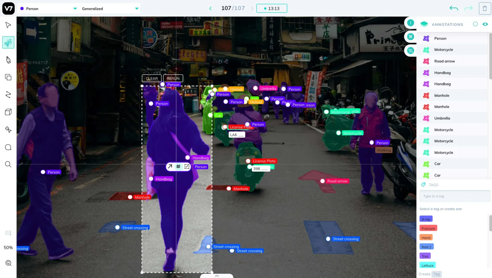

# V7 Integration [¶](\#v7-integration "Permalink to this headline")

[V7](https://www.v7labs.com) is one of the leading image and video annotation
tools available, and we’ve made it easy to upload your data directly from
FiftyOne to V7 for labeling.

Create a [V7 account](https://www.v7labs.com/sign-up) and follow
these [simple setup instructions](#v7-setup) to get up and running.

Note

Did you know? You can request, manage, and import annotations from within
the FiftyOne App by installing the
[@voxel51/annotation](https://github.com/voxel51/fiftyone-plugins/tree/main/plugins/annotation)
plugin!

FiftyOne provides an API to upload data, define label schemas,
and download annotations using V7, all programmatically in Python. All of the
following label types are supported, for both image and video datasets:

- [Classifications](../fiftyone_concepts/using_datasets.md#classification)

- [Detections](../fiftyone_concepts/using_datasets.md#object-detection)

- [Polygons](../fiftyone_concepts/using_datasets.md#polylines)

- [Keypoints](../fiftyone_concepts/using_datasets.md#keypoints)




## Basic recipe [¶](\#basic-recipe "Permalink to this headline")

The basic workflow to use V7 to add or edit labels on your FiftyOne datasets is
as follows:

1. Load a [labeled or unlabeled dataset](../fiftyone_concepts/dataset_creation/index.md#loading-datasets) into FiftyOne

2. Explore the dataset using the [App](../fiftyone_concepts/app.md#fiftyone-app) or
[dataset views](../fiftyone_concepts/using_views.md#using-views) to locate either unlabeled samples that
you wish to annotate or labeled samples whose annotations you want to edit

3. Use the
[`annotate()`](../api/fiftyone.core.collections.html#fiftyone.core.collections.SampleCollection.annotate "fiftyone.core.collections.SampleCollection.annotate")
method on your dataset or view to upload the samples and optionally their
existing labels to V7 by setting the parameter `backend="darwin"`

4. In V7, perform the necessary annotation work

5. Back in FiftyOne, load your dataset and use the
[`load_annotations()`](../api/fiftyone.core.collections.html#fiftyone.core.collections.SampleCollection.load_annotations "fiftyone.core.collections.SampleCollection.load_annotations")
method to merge the annotations back into your FiftyOne dataset

6. If desired, delete the V7 project and the record of the annotation run from
your FiftyOne dataset


The example below demonstrates this workflow.

Note

You must create an account at
[https://www.v7labs.com/sign-up](https://www.v7labs.com/sign-up) and
follow the simple setup instructions in
[this section](#v7-setup) in order to run this example.

First, we create the annotation tasks in V7:

```python
import fiftyone as fo
import fiftyone.zoo as foz
from fiftyone import ViewField as F

# Step 1: Load your data into FiftyOne

dataset = foz.load_zoo_dataset(
    "quickstart", dataset_name="v7-annotation-example"
)
dataset.persistent = True

dataset.evaluate_detections(
    "predictions", gt_field="ground_truth", eval_key="eval"
)

# Step 2: Locate a subset of your data requiring annotation

# Create a view that contains only high confidence false positive model
# predictions, with samples containing the most false positives first
most_fp_view = (
    dataset
    .filter_labels("predictions", (F("confidence") > 0.8) & (F("eval") == "fp"))
    .sort_by(F("predictions.detections").length(), reverse=True)
)

# Retrieve the sample with the most high confidence false positives
sample_id = most_fp_view.first().id
view = dataset.select(sample_id)

# Step 3: Send samples to V7

# A unique identifier for this run
anno_key = "v7_basic_recipe"

label_schema = {
    "new_ground_truth": {
        "type": "detections",
        "classes": dataset.distinct("ground_truth.detections.label"),
    },
}

view.annotate(
    anno_key,
    backend="darwin",
    label_schema=label_schema,
    launch_editor=True,
    dataset_slug=anno_key,
)
print(dataset.get_annotation_info(anno_key))

# Step 4: Perform annotation in V7 and save the tasks

```

Then, once the annotation work is complete, we merge the annotations back into
FiftyOne:

```python
import fiftyone as fo

anno_key = "v7_basic_recipe"

# Step 5: Merge annotations back into FiftyOne dataset

dataset = fo.load_dataset("v7-annotation-example")
dataset.load_annotations(anno_key)

# Load the view that was annotated in the App
view = dataset.load_annotation_view(anno_key)
session = fo.launch_app(view=view)

# Step 6: Cleanup

# Delete tasks from V7
results = dataset.load_annotation_results(anno_key)
results.cleanup()

# Delete run record (not the labels) from FiftyOne
dataset.delete_annotation_run(anno_key)

```

Note

See [this section](#v7-examples) to see a variety of common V7
annotation patterns.

## Setup [¶](\#setup "Permalink to this headline")

You can get started with V7 by
[creating an account](https://www.v7labs.com/sign-up) and downloading an
API key.

### Installing the V7 backend [¶](\#installing-the-v7-backend "Permalink to this headline")

In order to use the V7 backend, you must install the `darwin_fiftyone` Python
package:

```python
pip install darwin_fiftyone

```

and register the `darwin` backend with FiftyOne, which you can do either by
setting the following environment variables:

```python
export FIFTYONE_ANNOTATION_BACKENDS=*,darwin
export FIFTYONE_DARWIN_CONFIG_CLS=darwin_fiftyone.DarwinBackendConfig
export FIFTYONE_DARWIN_API_KEY=XXXXXXXXX

```

or by adding the following parameters to your
[annotation config](../fiftyone_concepts/annotation.md#annotation-config) located at
`~/.fiftyone/annotation_config.json`:

```python
{
    "backends": {
        "darwin": {
            "config_cls": "darwin_fiftyone.DarwinBackendConfig",
            "api_key": "XXXXXXXXX"
        }
    }
}

```

Note that this file may not exist if you haven’t previously customized your
annotation backends.

### Using the V7 backend [¶](\#using-the-v7-backend "Permalink to this headline")

By default, calling
[`annotate()`](../api/fiftyone.core.collections.html#fiftyone.core.collections.SampleCollection.annotate "fiftyone.core.collections.SampleCollection.annotate") will
use the [CVAT backend](cvat.md#cvat-integration).

To use the V7 backend, simply set the optional `backend` parameter of
[`annotate()`](../api/fiftyone.core.collections.html#fiftyone.core.collections.SampleCollection.annotate "fiftyone.core.collections.SampleCollection.annotate") to
`"darwin"`:

```python
view.annotate(anno_key, backend="darwin", ...)

```

Alternatively, you can permanently configure FiftyOne to use the V7 backend by
setting the `FIFTYONE_ANNOTATION_DEFAULT_BACKEND` environment variable:

```python
export FIFTYONE_ANNOTATION_DEFAULT_BACKEND=darwin

```

or by setting the `default_backend` parameter of your
[annotation config](../fiftyone_concepts/annotation.md#annotation-config) located at
`~/.fiftyone/annotation_config.json`:

```python
{
    "default_backend": "darwin"
}

```

### Authentication [¶](\#authentication "Permalink to this headline")

In order to connect to V7, you must provide your API key, which can be done in
a variety of ways.

**Environment variables (recommended)**

The recommended way to configure your V7 API key is to store it in the
`FIFTYONE_DARWIN_API_KEY` environment variable. This is automatically accessed
by FiftyOne whenever a connection to V7 is made.

```python
export FIFTYONE_DARWIN_API_KEY=...

```

**FiftyOne annotation config**

You can also store your credentials in your
[annotation config](../fiftyone_concepts/annotation.md#annotation-config) located at
`~/.fiftyone/annotation_config.json`:

```python
{
    "backends": {
        "darwin": {
            "api_key": ...,
        }
    }
}

```

Note that this file will not exist until you create it.

**Keyword arguments**

You can manually provide your API key as a keyword argument each time you call
methods like
[`annotate()`](../api/fiftyone.core.collections.html#fiftyone.core.collections.SampleCollection.annotate "fiftyone.core.collections.SampleCollection.annotate") and
[`load_annotations()`](../api/fiftyone.core.collections.html#fiftyone.core.collections.SampleCollection.load_annotations "fiftyone.core.collections.SampleCollection.load_annotations")
that require connections to V7:

```python
view.annotate(
    anno_key,
    backend="darwin",
    label_field="ground_truth",
    dataset_slug=anno_key,
    api_key=...,
)

```

## Requesting annotations [¶](\#requesting-annotations "Permalink to this headline")

Use the
[`annotate()`](../api/fiftyone.core.collections.html#fiftyone.core.collections.SampleCollection.annotate "fiftyone.core.collections.SampleCollection.annotate") method
to send the samples and optionally existing labels in a [`Dataset`](../api/fiftyone.core.dataset.html#fiftyone.core.dataset.Dataset "fiftyone.core.dataset.Dataset") or
[`DatasetView`](../api/fiftyone.core.view.html#fiftyone.core.view.DatasetView "fiftyone.core.view.DatasetView") to V7 for annotation.

The basic syntax is:

```python
anno_key = "..."
view.annotate(anno_key, backend="darwin", ...)

```

The `anno_key` argument defines a unique identifier for the annotation run, and
you will provide it to methods like
[`load_annotations()`](../api/fiftyone.core.collections.html#fiftyone.core.collections.SampleCollection.load_annotations "fiftyone.core.collections.SampleCollection.load_annotations"),
[`get_annotation_info()`](../api/fiftyone.core.collections.html#fiftyone.core.collections.SampleCollection.load_annotations "fiftyone.core.collections.SampleCollection.load_annotations"),
[`load_annotation_results()`](../api/fiftyone.core.collections.html#fiftyone.core.collections.SampleCollection.load_annotation_results "fiftyone.core.collections.SampleCollection.load_annotation_results"),
[`rename_annotation_run()`](../api/fiftyone.core.collections.html#fiftyone.core.collections.SampleCollection.rename_annotation_run "fiftyone.core.collections.SampleCollection.rename_annotation_run"), and
[`delete_annotation_run()`](../api/fiftyone.core.collections.html#fiftyone.core.collections.SampleCollection.delete_annotation_run "fiftyone.core.collections.SampleCollection.delete_annotation_run")
to manage the run in the future.

Note

Calling
[`annotate()`](../api/fiftyone.core.collections.html#fiftyone.core.collections.SampleCollection.annotate "fiftyone.core.collections.SampleCollection.annotate")
will upload the source media files to the V7 server.

In addition,
[`annotate()`](../api/fiftyone.core.collections.html#fiftyone.core.collections.SampleCollection.annotate "fiftyone.core.collections.SampleCollection.annotate")
provides various parameters that you can use to customize the annotation tasks
that you wish to be performed.

The following parameters are supported by all annotation backends:

- **backend** ( _None_): the annotation backend to use. Use `"darwin"` for
the V7 backend. The supported values are
`fiftyone.annotation_config.backends.keys()` and the default is
`fiftyone.annotation_config.default_backend`

- **media\_field** ( _“filepath”_): the sample field containing the path to the
source media to upload

- **launch\_editor** ( _False_): whether to launch the annotation backend’s
editor after uploading the samples


The following parameters allow you to configure the labeling schema to use for
your annotation tasks. See [this section](#v7-label-schema) for more
details:

- **label\_schema** ( _None_): a dictionary defining the label schema to use.
If this argument is provided, it takes precedence over `label_field` and
`label_type`

- **label\_field** ( _None_): a string indicating a new or existing label field
to annotate

- **label\_type** ( _None_): a string indicating the type of labels to
annotate. The possible label types are:


  - `"classification"`: a single classification stored in
    [`Classification`](../api/fiftyone.core.labels.html#fiftyone.core.labels.Classification "fiftyone.core.labels.Classification") fields

  - `"classifications"`: multilabel classifications stored in
    [`Classifications`](../api/fiftyone.core.labels.html#fiftyone.core.labels.Classifications "fiftyone.core.labels.Classifications") fields

  - `"detections"`: object detections stored in [`Detections`](../api/fiftyone.core.labels.html#fiftyone.core.labels.Detections "fiftyone.core.labels.Detections") fields

  - `"polygons"`: polygons stored in [`Polylines`](../api/fiftyone.core.labels.html#fiftyone.core.labels.Polylines "fiftyone.core.labels.Polylines") fields with their
    [`filled`](../api/fiftyone.core.labels.html#fiftyone.core.labels.Polyline.filled "fiftyone.core.labels.Polyline.filled") attributes set to
    `True`

  - `"keypoints"`: keypoints stored in [`Keypoints`](../api/fiftyone.core.labels.html#fiftyone.core.labels.Keypoints "fiftyone.core.labels.Keypoints") fields


All new label fields must have their type specified via this argument or in
`label_schema`

- **classes** ( _None_): a list of strings indicating the class options for
`label_field` or all fields in `label_schema` without classes specified.
All new label fields must have a class list provided via one of the
supported methods. For existing label fields, if classes are not provided
by this argument nor `label_schema`, the observed labels on your dataset
are used

- **allow\_additions** ( _True_): whether to allow new labels to be added. Only
applicable when editing existing label fields

- **allow\_deletions** ( _True_): whether to allow labels to be deleted. Only
applicable when editing existing label fields

- **allow\_label\_edits** ( _True_): whether to allow the `label` attribute of
existing labels to be modified. Only applicable when editing existing
fields with `label` attributes

- **allow\_spatial\_edits** ( _True_): whether to allow edits to the spatial
properties (bounding boxes, vertices, keypoints, etc) of labels.
Only applicable when editing existing spatial label fields


In addition, the following V7-specific parameters can also be provided:

- **dataset\_slug** ( _None_): the name of the dataset to use or create in
Darwin. This is currently mandatory

- **external\_storage** ( _None_): the sluggified name of a Darwin external
storage to use. If provided, indicates that all files should be treated as
external storage


### Label schema [¶](\#label-schema "Permalink to this headline")

The `label_schema`, `label_field`, `label_type`, and `classes` parameters to
[`annotate()`](../api/fiftyone.core.collections.html#fiftyone.core.collections.SampleCollection.annotate "fiftyone.core.collections.SampleCollection.annotate") allow
you to define the annotation schema that you wish to be used.

The label schema may define new label field(s) that you wish to populate, and
it may also include existing label field(s), in which case you can add, delete,
or edit the existing labels on your FiftyOne dataset.

The `label_schema` argument is the most flexible way to define how to construct
tasks in V7. In its most verbose form, it is a dictionary that defines
the label type, annotation type, and possible classes for each label field:

```python
anno_key = "..."

label_schema = {
    "new_field": {
        "type": "classifications",
        "classes": ["class1", "class2"],
    },
}

dataset.annotate(
    anno_key,
    backend="darwin",
    label_schema=label_schema,
    dataset_slug="dataset_slug",
)

```

Alternatively, if you are only editing or creating a single label field, you
can use the `label_field`, `label_type`, and `classes` parameters to specify
the components of the label schema individually:

```python
anno_key = "..."

label_field = "new_field",
label_type = "classifications"
classes = ["class1", "class2"]

dataset.annotate(
    anno_key,
    backend="darwin",
    label_field=label_field,
    label_type=label_type,
    classes=classes,
    dataset_slug="dataset_slug",
)

```

When you are annotating existing label fields, you can omit some of these
parameters from
[`annotate()`](../api/fiftyone.core.collections.html#fiftyone.core.collections.SampleCollection.annotate "fiftyone.core.collections.SampleCollection.annotate"), as
FiftyOne can infer the appropriate values to use:

- **label\_type**: if omitted, the [`Label`](../api/fiftyone.core.labels.html#fiftyone.core.labels.Label "fiftyone.core.labels.Label") type of the field will be used to
infer the appropriate value for this parameter

- **classes**: if omitted, the observed labels on your dataset will be used
to construct a classes list


Warning

Annotating multiple fields is not yet supported by the `darwin` backend.
Please check back soon!

### Label attributes [¶](\#label-attributes "Permalink to this headline")

Warning

Label attributes are not yet supported by the `darwin` backend. Please
check back soon!

## Loading annotations [¶](\#loading-annotations "Permalink to this headline")

After your annotations tasks in the annotation backend are complete, you can
use the
[`load_annotations()`](../api/fiftyone.core.collections.html#fiftyone.core.collections.SampleCollection.load_annotations "fiftyone.core.collections.SampleCollection.load_annotations")
method to download them and merge them back into your FiftyOne dataset.

```python
view.load_annotations(anno_key)

```

The `anno_key` parameter is the unique identifier for the annotation run that
you provided when calling
[`annotate()`](../api/fiftyone.core.collections.html#fiftyone.core.collections.SampleCollection.annotate "fiftyone.core.collections.SampleCollection.annotate"). You
can use
[`list_annotation_runs()`](../api/fiftyone.core.collections.html#fiftyone.core.collections.SampleCollection.list_annotation_runs "fiftyone.core.collections.SampleCollection.list_annotation_runs")
to see the available keys on a dataset.

Note

By default, calling
[`load_annotations()`](../api/fiftyone.core.collections.html#fiftyone.core.collections.SampleCollection.load_annotations "fiftyone.core.collections.SampleCollection.load_annotations")
will not delete any information for the run from the annotation backend.

However, you can pass `cleanup=True` to delete the V7 dataset associated
with the run after the annotations are downloaded.

Warning

The `dest_field` parameter of
[`load_annotations()`](../api/fiftyone.core.collections.html#fiftyone.core.collections.SampleCollection.load_annotations "fiftyone.core.collections.SampleCollection.load_annotations")
is not yet supported by the `darwin` backend. Check back soon!

## Managing annotation runs [¶](\#managing-annotation-runs "Permalink to this headline")

FiftyOne provides a variety of methods that you can use to manage in-progress
or completed annotation runs.

For example, you can call
[`list_annotation_runs()`](../api/fiftyone.core.collections.html#fiftyone.core.collections.SampleCollection.list_annotation_runs "fiftyone.core.collections.SampleCollection.list_annotation_runs")
to see the available annotation keys on a dataset:

```python
dataset.list_annotation_runs()

```

Or, you can use
[`get_annotation_info()`](../api/fiftyone.core.collections.html#fiftyone.core.collections.SampleCollection.get_annotation_info "fiftyone.core.collections.SampleCollection.get_annotation_info")
to retrieve information about the configuration of an annotation run:

```python
info = dataset.get_annotation_info(anno_key)
print(info)

```

Use [`load_annotation_results()`](../api/fiftyone.core.collections.html#fiftyone.core.collections.SampleCollection.load_annotation_results "fiftyone.core.collections.SampleCollection.load_annotation_results")
to load the [`AnnotationResults`](../api/fiftyone.utils.annotations.html#fiftyone.utils.annotations.AnnotationResults "fiftyone.utils.annotations.AnnotationResults")
instance for an annotation run.

All results objects provide a [`cleanup()`](../api/fiftyone.utils.annotations.html#fiftyone.utils.annotations.AnnotationResults.cleanup "fiftyone.utils.annotations.AnnotationResults.cleanup")
method that you can use to delete all information associated with a run from
the annotation backend.

```python
results = dataset.load_annotation_results(anno_key)
results.cleanup()

```

You can use
[`rename_annotation_run()`](../api/fiftyone.core.collections.html#fiftyone.core.collections.SampleCollection.rename_annotation_run "fiftyone.core.collections.SampleCollection.rename_annotation_run")
to rename the annotation key associated with an existing annotation run:

```python
dataset.rename_annotation_run(anno_key, new_anno_key)

```

Finally, you can use
[`delete_annotation_run()`](../api/fiftyone.core.collections.html#fiftyone.core.collections.SampleCollection.delete_annotation_run "fiftyone.core.collections.SampleCollection.delete_annotation_run")
to delete the record of an annotation run from your FiftyOne dataset:

```python
dataset.delete_annotation_run(anno_key)

```

Note

Calling
[`delete_annotation_run()`](../api/fiftyone.core.collections.html#fiftyone.core.collections.SampleCollection.delete_annotation_run "fiftyone.core.collections.SampleCollection.delete_annotation_run")
only deletes the **record** of the annotation run from your FiftyOne
dataset; it will not delete any annotations loaded onto your dataset via
[`load_annotations()`](../api/fiftyone.core.collections.html#fiftyone.core.collections.SampleCollection.load_annotations "fiftyone.core.collections.SampleCollection.load_annotations"),
nor will it delete any associated information from the annotation backend.

## Examples [¶](\#examples "Permalink to this headline")

This section demonstrates how to perform some common annotation workflows on a
FiftyOne dataset using the V7 backend.

Note

All of the examples below assume you have configured your V7 backend as
described in [this section](#v7-setup).

### Adding new label fields [¶](\#adding-new-label-fields "Permalink to this headline")

In order to annotate a new label field, you can provide the `label_field`,
`label_type`, and `classes` parameters to
[`annotate()`](../api/fiftyone.core.collections.html#fiftyone.core.collections.SampleCollection.annotate "fiftyone.core.collections.SampleCollection.annotate") to
define the annotation schema for the field:

```python
import fiftyone as fo
import fiftyone.zoo as foz

dataset = foz.load_zoo_dataset("quickstart")
view = dataset.take(1)

anno_key = "v7_new_field"

view.annotate(
    anno_key,
    backend="darwin",
    label_field="new_classifications",
    label_type="classifications",
    classes=["dog", "cat", "person"],
    dataset_slug=anno_key,
    launch_editor=True,
)
print(dataset.get_annotation_info(anno_key))

# Create annotations in V7

dataset.load_annotations(anno_key, cleanup=True)
dataset.delete_annotation_run(anno_key)

```

Alternatively, you can use the `label_schema` argument to define the same
labeling task:

```python
import fiftyone as fo
import fiftyone.zoo as foz

dataset = foz.load_zoo_dataset("quickstart")
view = dataset.take(1)

anno_key = "v7_new_field"

label_schema = {
    "new_classifications": {
        "type": "classifications",
        "classes": ["dog", "cat", "person"],
    }
}

view.annotate(
    anno_key,
    backend="darwin",
    label_schema=label_schema,
    dataset_slug=anno_key,
    launch_editor=True,
)
print(dataset.get_annotation_info(anno_key))

# Create annotations in V7

dataset.load_annotations(anno_key, cleanup=True)
dataset.delete_annotation_run(anno_key)

```

### Editing existing labels [¶](\#editing-existing-labels "Permalink to this headline")

A common use case is to fix annotation mistakes that you discovered in your
datasets through FiftyOne.

You can easily edit the labels in an existing field of your FiftyOne dataset
by simply passing the name of the field via the `label_field` parameter of
[`annotate()`](../api/fiftyone.core.collections.html#fiftyone.core.collections.SampleCollection.annotate "fiftyone.core.collections.SampleCollection.annotate"):

```python
import fiftyone as fo
import fiftyone.zoo as foz

dataset = foz.load_zoo_dataset("quickstart")
view = dataset.take(1)

anno_key = "v7_existing_field"

view.annotate(
    anno_key,
    backend="darwin",
    label_field="ground_truth",
    dataset_slug=anno_key,
    launch_editor=True,
)
print(dataset.get_annotation_info(anno_key))

# Modify/add/delete bounding boxes and their attributes in V7

dataset.load_annotations(anno_key, cleanup=True)
dataset.delete_annotation_run(anno_key)

```

