# Developing Plugins [¶](\#developing-plugins "Permalink to this headline")

This page describes how to write your own FiftyOne plugins.

Note

Check out the
[FiftyOne plugins](https://github.com/voxel51/fiftyone-plugins)
repository for a growing collection of plugins that you can use as examples
when developing your own.

## Design overview [¶](\#design-overview "Permalink to this headline")

Plugins are composed of one or more panels, operators, and components.

Together these building blocks enable you to build full-featured interactive
data applications that tailor FiftyOne to your specific use case and workflow.
Whether you’re working with images, videos, or other data types, a plugin can
help you streamline your machine learning workflows and co-develop your data
and models.

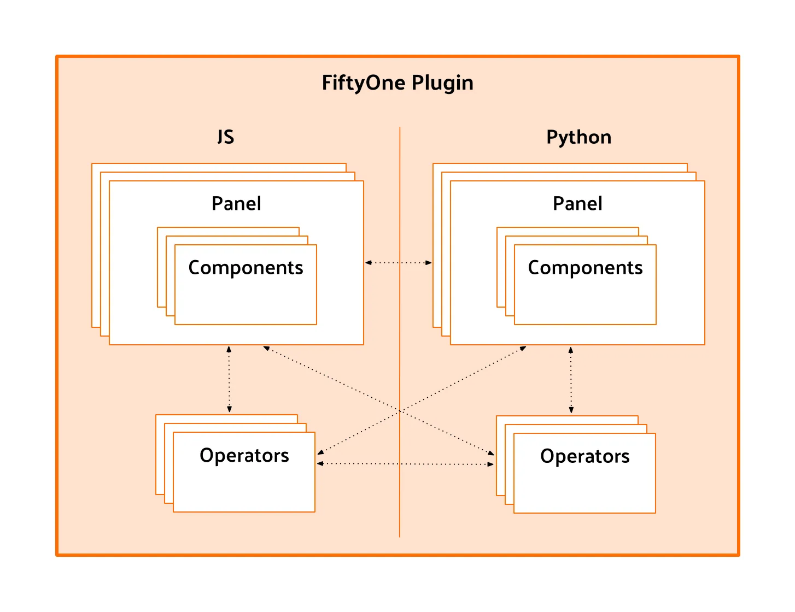

### Plugin types [¶](\#plugin-types "Permalink to this headline")

FiftyOne plugins can be written in Python or JavaScript (JS), or a combination
of both.

Python plugins are built using the `fiftyone` package, pip packages, and your
own Python. They can consist of panels and operators.

JS plugins are built using the `@fiftyone` TypeScript packages, npm packages,
and your own TypeScript. They can consist of panels, operators, and custom
components.

### Panels [¶](\#panels "Permalink to this headline")

Panels are miniature full-featured data applications that you can open in
[App spaces](../fiftyone_concepts/app.md#app-spaces) and interactively manipulate to explore your
dataset and update/respond to updates from other spaces that are currently open
in the App.

FiftyOne natively includes the following Panels:

- [Samples panel](../fiftyone_concepts/app.md#app-samples-panel): the media grid that loads by
default when you launch the App

- [Histograms panel](../fiftyone_concepts/app.md#app-histograms-panel): a dashboard of histograms
for the fields of your dataset

- [Embeddings panel](../fiftyone_concepts/app.md#app-embeddings-panel): a canvas for working with
[embeddings visualizations](../fiftyone_concepts/brain.md#brain-embeddings-visualization)

- [Map panel](../fiftyone_concepts/app.md#app-map-panel): visualizes the geolocation data of
datasets that have a [`GeoLocation`](../api/fiftyone.core.labels.html#fiftyone.core.labels.GeoLocation "fiftyone.core.labels.GeoLocation") field

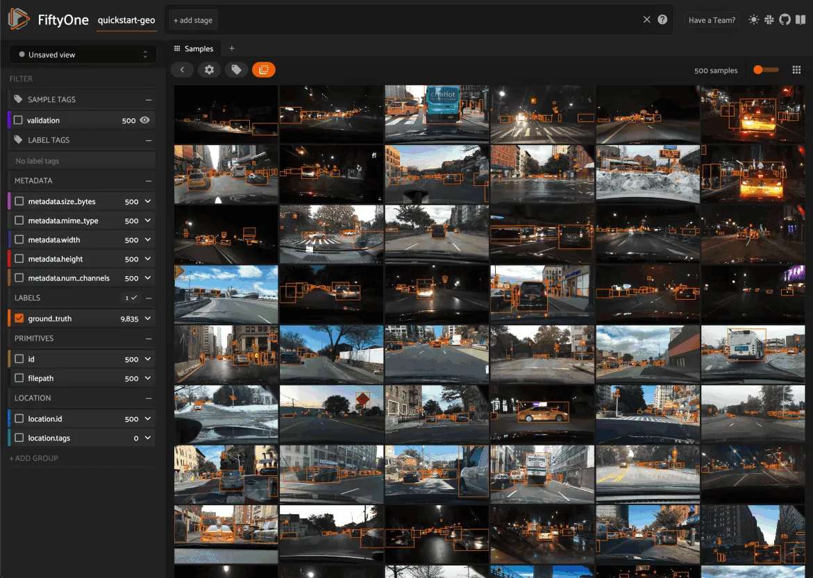

Note

Jump to [this section](#developing-panels) for more information about
developing panels.

### Operators [¶](\#operators "Permalink to this headline")

Operators are user-facing operations that allow you to interact with the data
in your dataset. They can range from simple actions like checking a checkbox to
more complex workflows such as requesting annotation of samples from a
configurable backend. Operators can even be composed of other operators or be
used to add functionality to custom panels.

FiftyOne comes with a number of builtin
`Python` and
[JavaScript](https://github.com/voxel51/fiftyone/blob/develop/app/packages/operators/src/built-in-operators.ts)
operators for common tasks that are intended for either user-facing or internal
plugin use.

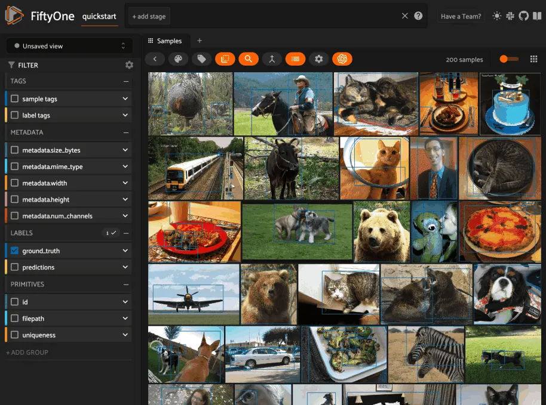

Note

Jump to [this section](#developing-operators) for more information
about developing operators.

### Components [¶](\#components "Permalink to this headline")

Components are responsible for rendering and event handling in plugins. They
provide the necessary functionality to display and interact with your plugin in
the FiftyOne App. Components also implement form inputs and output rendering
for operators, making it possible to customize the way an operator is rendered
in the FiftyOne App.

For example, FiftyOne comes with a wide variety of
[`builtin types`](../api/fiftyone.operators.types.html#module-fiftyone.operators.types "fiftyone.operators.types") that you can leverage to build
complex input and output forms for your operators.

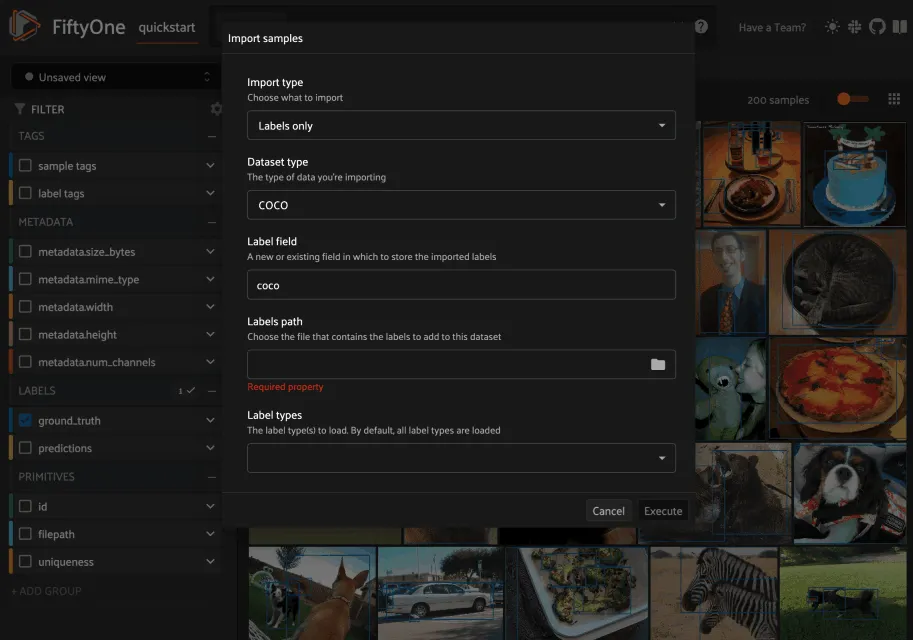

Note

Jump to [this section](#developing-js-plugins) for more information
about developing components.

## Development setup [¶](\#development-setup "Permalink to this headline")

In order to develop Python plugins, you can use either a release or source
install of FiftyOne:

```python
pip install fiftyone

```

In order to develop JS plugins, you will need a
[source install](https://github.com/voxel51/fiftyone#installing-from-source)
of FiftyOne and a vite config that links modules to your `fiftyone/app`
directory.

Note

For JS plugins we recommend forking the
[FiftyOne Hello World JS Example](https://github.com/voxel51/hello-world-plugin-js)
repository and following the conventions there to build your JS plugin.

## Anatomy of a plugin [¶](\#anatomy-of-a-plugin "Permalink to this headline")

FiftyOne recognizes plugins by searching for `fiftyone.yml` or `fiftyone.yaml`
files within your [plugins directory](using_plugins.md#plugins-directory).

Below is an example of a plugin directory with a typical Python plugin and JS
plugin:

```python
/path/to/your/plugins/dir/
    my-js-plugin/
        fiftyone.yml
        package.json
        dist/
            index.umd.js
    my-py-plugin/
        fiftyone.yml
        __init__.py
        requirements.txt

```

Note

If the source code for a plugin already exists on disk, you can make it
into a plugin using
[`create_plugin()`](../api/fiftyone.plugins.core.html#fiftyone.plugins.core.create_plugin "fiftyone.plugins.core.create_plugin") or the
[fiftyone plugins create](../cli/index.md#cli-fiftyone-plugins-create) CLI command.

This will copy the source code to the plugins directory and create a
`fiftyone.yml` file for you if one does not already exist. Alternatively,
you can manually copy the code into your plugins directory.

If your FiftyOne App is already running, you may need to restart the server
and refresh your browser to see new plugins.

### fiftyone.yml [¶](\#fiftyone-yml "Permalink to this headline")

All plugins must contain a `fiftyone.yml` or `fiftyone.yaml` file, which is
used to define the plugin’s metadata, declare any operators and panels that it
exposes, and declare any [secrets](using_plugins.md#plugins-secrets) that it may require.
The following fields are available:

| Field | Required? | Description |
| --- | --- | --- |
| `name` | **yes** | The name of the plugin |
| `type` |  | Declare that the directory defines a `plugin`. This can be omitted for<br>backwards compatibility, but it is recommended to specify this |
| `author` |  | The author of the plugin |
| `version` |  | The version of the plugin |
| `url` |  | The remote source (eg GitHub repository) where the directory containing<br>this file is hosted |
| `license` |  | The license under which the plugin is distributed |
| `description` |  | A brief description of the plugin |
| `fiftyone.version` |  | A semver version specifier (or `*`) describing the required<br>FiftyOne version for the plugin to work properly |
| `operators` |  | A list of operator names registered by the plugin, if any |
| `panels` |  | A list of panel names registered by the plugin, if any |
| `secrets` |  | A list of secret keys that may be used by the plugin, if any |

For example, the
[@voxel51/annotation](https://github.com/voxel51/fiftyone-plugins/blob/main/plugins/annotation/fiftyone.yml)
plugin’s `fiftyone.yml` looks like this:

```python
name: "@voxel51/annotation"
type: plugin
author: Voxel51
version: 1.0.0
url: https://github.com/voxel51/fiftyone-plugins/tree/main/plugins/annotation
license: Apache 2.0
description: Utilities for integrating FiftyOne with annotation tools
fiftyone:
  version: ">=0.22"
operators:
  - request_annotations
  - load_annotations
  - get_annotation_info
  - load_annotation_view
  - rename_annotation_run
  - delete_annotation_run
secrets:
  - FIFTYONE_CVAT_URL
  - FIFTYONE_CVAT_USERNAME
  - FIFTYONE_CVAT_PASSWORD
  - FIFTYONE_CVAT_EMAIL
  - FIFTYONE_LABELBOX_URL
  - FIFTYONE_LABELBOX_API_KEY
  - FIFTYONE_LABELSTUDIO_URL
  - FIFTYONE_LABELSTUDIO_API_KEY

```

Note

Although it is not strictly required, we highly recommend using the
`@user-or-org-name/plugin-name` naming convention when writing plugins.

### Python plugins [¶](\#python-plugins "Permalink to this headline")

Python plugins should define the following files:

- `__init__.py` **(required)**: entrypoint that defines the Python operators
and panels that the plugin defines

- `requirements.txt`: specifies the Python package requirements to run the
plugin

### JS plugins [¶](\#js-plugins "Permalink to this headline")

JS plugins should define the following files:

- `package.json`: a JSON file containing additional information about the
plugin, including the JS bundle file path

- `dist/index.umd.js`: a JS bundle file for the plugin

## Publishing plugins [¶](\#publishing-plugins "Permalink to this headline")

You can publish your FiftyOne plugins either privately or publicly by simply
uploading the source directory or a ZIP of it to GitHub or another file hosting
service.

Note

Want to share your plugin with the FiftyOne community? Make a pull request
into the [FiftyOne Plugins](https://github.com/voxel51/fiftyone-plugins)
repository to add it to the
[Community Plugins list](https://github.com/voxel51/fiftyone-plugins#community-plugins)!

Any users with access to the plugin’s hosted location can easily
[download it](using_plugins.md#plugins-download) via the
[fiftyone plugins download](../cli/index.md#cli-fiftyone-plugins-download) CLI command:

```python
# Download plugin(s) from a GitHub repository
fiftyone plugins download https://github.com/<user>/<repo>[/tree/branch]

# Download plugin(s) by specifying the GitHub repository details
fiftyone plugins download <user>/<repo>[/<ref>]

# Download specific plugins from a GitHub repository
fiftyone plugins download \\
    https://github.com/<user>/<repo>[/tree/branch] \\
    --plugin-names <name1> <name2> <name3>

```

Note

GitHub repositories may contain multiple plugins. By default, all plugins
that are found within the first three directory levels are installed, but
you can select specific ones if desired as shown above.

## Quick examples [¶](\#quick-examples "Permalink to this headline")

This section contains a few quick examples of plugins before we dive into the
full details of the plugin system.

Note

The best way to learn how to write plugins is to use and inspect existing
ones. Check out the
[FiftyOne plugins](https://github.com/voxel51/fiftyone-plugins)
repository for a growing collection of plugins that you can use as examples
when developing your own.

### Example plugin [¶](\#example-plugin "Permalink to this headline")

The
[Hello World plugin](https://github.com/voxel51/fiftyone-plugins/tree/main/plugins/hello-world)
defines both a JS Panel and a Python operator:

Here’s the plugin in action! The `Hello world` panel is available under the `+`
icon next to the Samples tab and the `count_samples` operator is available in
the operator browser:

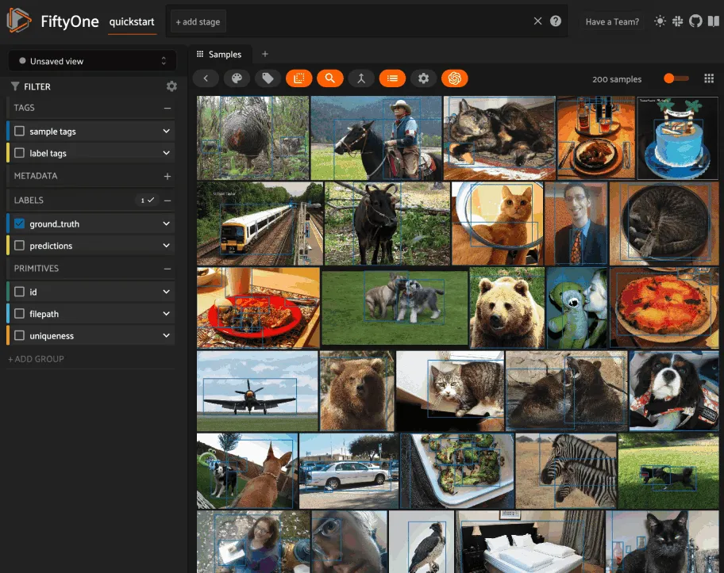

### Example Python operator [¶](\#example-python-operator "Permalink to this headline")

Here’s a simple [Python operator](#developing-operators) that accepts a
string input and then displays it to the user in the operator’s output modal.

```python
class SimpleInputExample(foo.Operator):
    @property
    def config(self):
        return foo.OperatorConfig(
            name="simple_input_example",
            label="Simple input example",
        )

    def resolve_input(self, ctx):
        inputs = types.Object()
        inputs.str("message", label="Message", required=True)
        header = "Simple input example"
        return types.Property(inputs, view=types.View(label=header))

    def execute(self, ctx):
        return {"message": ctx.params["message"]}

    def resolve_output(self, ctx):
        outputs = types.Object()
        outputs.str("message", label="Message")
        header = "Simple input example: Success!"
        return types.Property(outputs, view=types.View(label=header))

def register(p):
    p.register(SimpleInputExample)

```

In practice, operators would use the inputs to perform some operation on the
current dataset.

Note

Remember that you must also include the operator’s name in the plugin’s
[fiftyone.yml](#plugin-fiftyone-yml):

```python
operators:
  - simple_input_example

```

### Example Python panel [¶](\#example-python-panel "Permalink to this headline")

Here’s a simple [Python panel](#developing-panels) that renders a button
that shows a “Hello world!” notification when clicked:

```python
import fiftyone.operators as foo
import fiftyone.operators.types as types

class HelloWorldPanel(foo.Panel):
    @property
    def config(self):
        return foo.PanelConfig(
            name="hello_world_panel",
            label="Hello World Panel"
        )

    def on_load(self, ctx):
        ctx.panel.state.hello_message = "Hello world!"

    def say_hello(self, ctx):
        ctx.ops.notify(ctx.panel.state.hello_message)

    def render(self, ctx):
        panel = types.Object()
        panel.btn(
            "hello_btn",
            label="Say Hello",
            icon="emoji_people",
            on_click=self.say_hello,
            variant="contained",
        )

        panel_view = types.GridView(
            width=100, height=100, align_x="center", align_y="center"
        )
        return types.Property(panel, view=panel_view)

def register(p):
    p.register(HelloWorldPanel)

```

Note

Remember that you must also include the panel’s name in the plugin’s
[fiftyone.yml](#plugin-fiftyone-yml):

```python
panels:
  - hello_world_panel

```

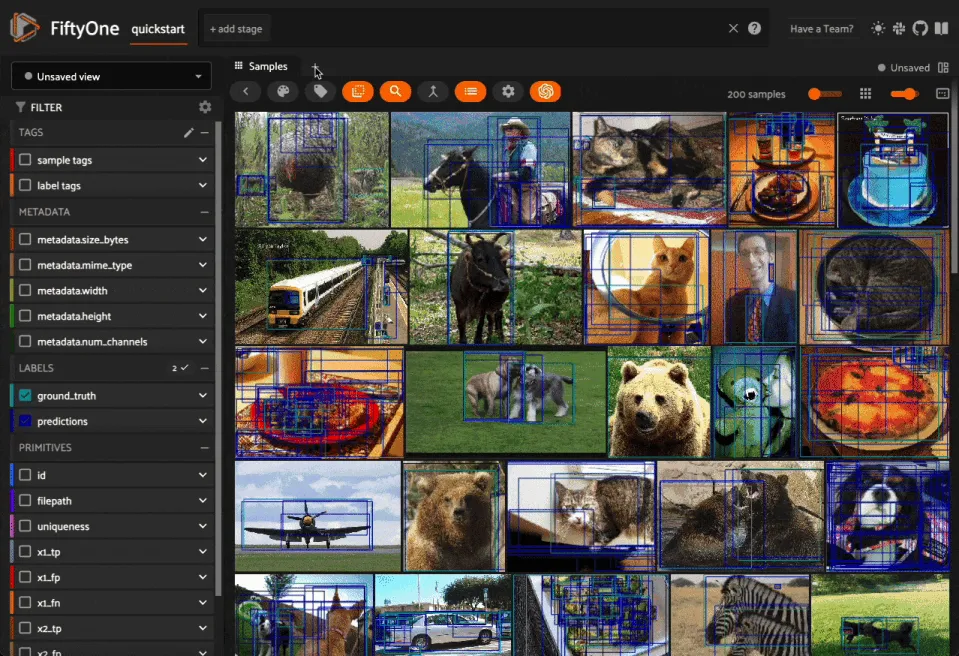

### Example JS operator [¶](\#example-js-operator "Permalink to this headline")

Here’s how to define a [JS operator](#developing-js-plugins) that sets the
currently selected samples in the App based on a list of sample IDs provided
via a `samples` parameter.

```python
import {Operator, OperatorConfig, types, registerOperator} from "@fiftyone/operators";
const PLUGIN_NAME = "@my/plugin";

class SetSelectedSamples extends Operator {
    get config(): OperatorConfig {
        return new OperatorConfig({
            name: "set_selected_samples",
            label: "Set selected samples",
            unlisted: true,
        });
    }
    useHooks(): {} {
        return {
            setSelected: fos.useSetSelected(),
        };
    }
    async execute({ hooks, params }: ExecutionContext) {
        hooks.setSelected(params.samples);
    }
}

registerOperator(SetSelectedSamples, PLUGIN_NAME);

```

Unlike Python operators, JS operators can use React hooks and the `@fiftyone/*`
packages by defining a `useHook()` method. Any values return in this method
will be available to the operator’s `execute()` method via `ctx.hooks`.

Note

Marking the operator as `unlisted` omits it from the
[operator browser](using_plugins.md#using-operators), which is useful when the
operator is intended only for internal use by other plugin components.

## Developing operators [¶](\#developing-operators "Permalink to this headline")

Operators allow you to define custom operations that accept parameters via
input properties, execute some actions based on them, and optionally return
outputs. They can be [executed](using_plugins.md#using-operators) by users in the App or
triggered internally by other operators.

Operators can be defined in either Python or JS, and FiftyOne comes with a
number of builtin `Python` and
[JS](https://github.com/voxel51/fiftyone/blob/develop/app/packages/operators/src/built-in-operators.ts)
operators for common tasks.

The [`fiftyone.operators.types`](../api/fiftyone.operators.types.html "fiftyone.operators.types") module and
[`@fiftyone/operators`](../api/fiftyone.operators.html "@fiftyone/operators") package define a rich
builtin type system that operator developers can use to define the input and
output properties of their operators without the need to build custom user
interfaces from scratch. These types handle all aspects of input collection,
validation, and component rendering for you.

Operators can be composed for coordination between Python and the FiftyOne App,
such as triggering a reload of samples/view to update the app with the changes
made by the operator. Operators can also be scheduled to run by an orchestrator
or triggered by other operators.

### Operator interface [¶](\#operator-interface "Permalink to this headline")

The code block below describes the Python interface for defining operators.
We’ll dive into each component of the interface in more detail in the
subsequent sections.

Note

The JS interface for defining operators is analogous. See this
[example JS operator](#example-js-operator) for details.

```python
import fiftyone.operators as foo
import fiftyone.operators.types as types

class ExampleOperator(foo.Operator):
    @property
    def config(self):
        return foo.OperatorConfig(
            # The operator's URI: f"{plugin_name}/{name}"
            name="example_operator",  # required

            # The display name of the operator
            label="Example operator",  # required

            # A description for the operator
            description="An example description"

            # Whether to re-execute resolve_input() after each user input
            dynamic=True/False,  # default False

            # Whether the operator's execute() method returns a generator
            # that should be iterated over until exhausted
            execute_as_generator=True/False,  # default False

            # Whether to hide this operator from the App's operator browser
            # Set this to True if the operator is only for internal use
            unlisted=True/False,  # default False

            # Whether the operator should be executed every time a new App
            # session starts
            on_startup=True/False,  # default False

            # Whether the operator should be executed every time a new
            # dataset is opened in the App
            on_dataset_open=True/False,  # default False

            # Custom icons to use
            # Can be a URL, a local path in the plugin directory, or the
            # name of a MUI icon: https://marella.me/material-icons/demo
            icon="/assets/icon.svg",
            light_icon="/assets/icon-light.svg",  # light theme only
            dark_icon="/assets/icon-dark.svg",  # dark theme only

            # Whether the operator supports immediate and/or delegated execution
            allow_immediate_execution=True/False,    # default True
            allow_delegated_execution=True/False,    # default False
            default_choice_to_delegated=True/False,  # default False
            resolve_execution_options_on_change=None,
        )

    def resolve_placement(self, ctx):
        """You can optionally implement this method to configure a button
        or icon in the App that triggers this operator.

        By default the operator only appears in the operator browser
        (unless it is unlisted).

        Returns:
            a `types.Placement`
        """
        return types.Placement(
            # Make operator appear in the actions row above the sample grid
            types.Places.SAMPLES_GRID_SECONDARY_ACTIONS,

            # Use a button as the operator's placement
            types.Button(
                # A label for placement button visible on hover
                label="Open Histograms Panel",

                # An icon for the button
                # The default is a button with the `label` displayed
                icon="/assets/icon.svg",

                # If False, don't show the operator's input prompt when we
                # do not require user input
                prompt=True/False  # False
            )
        )

    def resolve_input(self, ctx):
        """Implement this method to collect user inputs as parameters
        that are stored in `ctx.params`.

        Returns:
            a `types.Property` defining the form's components
        """
        inputs = types.Object()

        # Use the builtin `types` and the current `ctx.params` to define
        # the necessary user input data
        inputs.str("key", ...)

        # When `dynamic=True`, you'll often use the current `ctx` to
        # conditionally render different components
        if ctx.params["key"] == "value" and len(ctx.view) < 100:
            # do something
        else:
            # do something else

        return types.Property(inputs, view=types.View(label="Example operator"))

    def resolve_delegation(self, ctx):
        """Implement this method if you want to programmatically *force*
        this operation to be delegated or executed immediately.

        Returns:
            whether the operation should be delegated (True), run
            immediately (False), or None to defer to
            `resolve_execution_options()` to specify the available options
        """
        return len(ctx.view) > 1000  # delegate for larger views

    def resolve_execution_options(self, ctx):
        """Implement this method if you want to dynamically configure the
        execution options available to this operator based on the current
        `ctx`.

        Returns:
            an `ExecutionOptions` instance
        """
        should_delegate = len(ctx.view) > 1000  # delegate for larger views
        return foo.ExecutionOptions(
            allow_immediate_execution=True,
            allow_delegated_execution=True,
            default_choice_to_delegated=should_delegate,
        )

    def execute(self, ctx):
        """Executes the actual operation based on the hydrated `ctx`.
        All operators must implement this method.

        This method can optionally be implemented as `async`.

        Returns:
            an optional dict of results values
        """
        # Use ctx.params, ctx.dataset, ctx.view, etc to perform the
        # necessary computation
        value = ctx.params["key"]
        view = ctx.view
        n = len(view)

        # Use ctx.ops to trigger builtin operations
        ctx.ops.clear_selected_samples()
        ctx.ops.set_view(view=view)

        # Use ctx.trigger to call other operators as necessary
        ctx.trigger("operator_uri", params={"key": value})

        # If `execute_as_generator=True`, this method may yield multiple
        # messages
        for i, sample in enumerate(current_view, 1):
            # do some computation
            yield ctx.ops.set_progress(progress=i/n)

        yield ctx.ops.reload_dataset()

        return {"value": value, ...}

    def resolve_output(self, ctx):
        """Implement this method if your operator renders an output form
        to the user.

        Returns:
            a `types.Property` defining the components of the output form
        """
        outputs = types.Object()

        # Use the builtin `types` and the current `ctx.params` and
        # `ctx.results` as necessary to define the necessary output form
        outputs.define_property("value", ...)

        return types.Property(outputs, view=types.View(label="Example operator"))

def register(p):
    """Always implement this method and register() each operator that your
    plugin defines.
    """
    p.register(ExampleOperator)

```

Note

Remember that you must also include the operator’s name in the plugin’s
[fiftyone.yml](#plugin-fiftyone-yml):

```python
operators:
  - example_operator

```

### Operator config [¶](\#operator-config "Permalink to this headline")

Every operator must define a
[`config`](../api/fiftyone.operators.operator.html#fiftyone.operators.operator.Operator.config "fiftyone.operators.operator.Operator.config") property that
defines its name, display name, and other optional metadata about its
execution:

```python
@property
def config(self):
    return foo.OperatorConfig(
        # The operator's URI: f"{plugin_name}/{name}"
        name="example_operator",  # required

        # The display name of the operator
        label="Example operator",  # required

        # A description for the operator
        description="An example description"

        # Whether to re-execute resolve_input() after each user input
        dynamic=True/False,  # default False

        # Whether the operator's execute() method returns a generator
        # that should be iterated over until exhausted
        execute_as_generator=True/False,  # default False

        # Whether to hide this operator from the App's operator browser
        # Set this to True if the operator is only for internal use
        unlisted=True/False,  # default False

        # Whether the operator should be executed every time a new App
        # session starts
        on_startup=True/False,  # default False

        # Whether the operator should be executed every time a new dataset
        # is opened in the App
        on_dataset_open=True/False,  # default False

        # Custom icons to use
        # Can be a URL, a local path in the plugin directory, or the
        # name of a MUI icon: https://marella.me/material-icons/demo
        icon="/assets/icon.svg",
        light_icon="/assets/icon-light.svg",  # light theme only
        dark_icon="/assets/icon-dark.svg",  # dark theme only

        # Whether the operator supports immediate and/or delegated execution
        allow_immediate_execution=True/False,    # default True
        allow_delegated_execution=True/False,    # default False
        default_choice_to_delegated=True/False,  # default False
        resolve_execution_options_on_change=None,
    )

```

### Execution context [¶](\#execution-context "Permalink to this headline")

An `ExecutionContext` is
passed to each of the operator’s methods at runtime. This `ctx` contains static
information about the current state of the App (dataset, view, panel,
selection, etc) as well as dynamic information about the current parameters and
results.

An `ExecutionContext`
contains the following properties:

- `ctx.params`: a dict containing the operator’s current input parameter
values

- `ctx.dataset_name`: the name of the current dataset

- `ctx.dataset` \- the current [`Dataset`](../api/fiftyone.core.dataset.html#fiftyone.core.dataset.Dataset "fiftyone.core.dataset.Dataset") instance

- `ctx.view` \- the current [`DatasetView`](../api/fiftyone.core.view.html#fiftyone.core.view.DatasetView "fiftyone.core.view.DatasetView") instance

- `ctx.spaces` \- the current [Spaces layout](../fiftyone_concepts/app.md#app-spaces) in the App

- `ctx.current_sample` \- the ID of the active sample in the App modal, if any

- `ctx.selected` \- the list of currently selected samples in the App, if any

- `ctx.selected_labels` \- the list of currently selected labels in the App,
if any

- `ctx.extended_selection` \- the extended selection of the view, if any

- `ctx.group_slice` \- the active group slice in the App, if any

- `ctx.user_id` \- the ID of the user that invoked the operator, if known

- `ctx.user` \- an object of information about the user that invoked the
operator, if known, including the user’s `id`, `name`, `email`, `role`, and
`dataset_permission`

- `ctx.user_request_token` \- the request token authenticating the user
executing the operation, if known

- `ctx.panel_id` \- the ID of the panel that invoked the operator, if any

- `ctx.panel` \- a [`PanelRef`](../api/fiftyone.operators.panel.html#fiftyone.operators.panel.PanelRef "fiftyone.operators.panel.PanelRef")
instance that you can use to read and write the [state](#panel-state)
and [data](#panel-data) of the current panel, if the operator was
invoked from a panel

- `ctx.delegated` \- whether the operation was delegated

- `ctx.requesting_delegated_execution` \- whether delegated execution was
requested for the operation

- `ctx.delegation_target` \- the orchestrator to which the operation should be
delegated, if applicable

- `ctx.ops` \- an
[`Operations`](../api/fiftyone.operators.operations.html#fiftyone.operators.operations.Operations "fiftyone.operators.operations.Operations") instance
that you can use to trigger builtin operations on the current context

- `ctx.trigger` \- a method that you can use to trigger arbitrary operations
on the current context

- `ctx.secrets` \- a dict of [secrets](#operator-secrets) for the plugin,
if any

- `ctx.results` \- a dict containing the outputs of the `execute()` method, if
it has been called

- `ctx.hooks` **(JS only)** \- the return value of the operator’s `useHooks()`
method

### Operator inputs [¶](\#operator-inputs "Permalink to this headline")

Operators can optionally implement
[`resolve_input()`](../api/fiftyone.operators.operator.html#fiftyone.operators.operator.Operator.resolve_input "fiftyone.operators.operator.Operator.resolve_input")
to define user input forms that are presented to the user as a modal in the App
when the operator is invoked.

The basic objective of
[`resolve_input()`](../api/fiftyone.operators.operator.html#fiftyone.operators.operator.Operator.resolve_input "fiftyone.operators.operator.Operator.resolve_input")
is to populate the `ctx.params` dict with user-provided parameter values, which
are retrieved from the various subproperties of the
[`Property`](../api/fiftyone.operators.types.html#fiftyone.operators.types.Property "fiftyone.operators.types.Property") returned by the method
( `inputs` in the examples below).

The [`fiftyone.operators.types`](../api/fiftyone.operators.types.html#module-fiftyone.operators.types "fiftyone.operators.types") module defines a rich builtin type system
that you can use to define the necessary input properties. These types handle
all aspects of input collection, validation, and component rendering for you!

For example, here’s a simple example of collecting a single string input from
the user:

```python
def resolve_input(self, ctx):
    inputs = types.Object()
    inputs.str("message", label="Message", required=True)
    return types.Property(inputs, view=types.View(label="Static example"))

def execute(self, ctx):
    the_message = ctx.params["message"]

```

If the [operator’s config](#operator-config) declares `dynamic=True`, then
[`resolve_input()`](../api/fiftyone.operators.operator.html#fiftyone.operators.operator.Operator.resolve_input "fiftyone.operators.operator.Operator.resolve_input")
will be called after each user input, which allows you to construct dynamic
forms whose components may contextually change based on the already provided
values and any other aspects of the
[execution context](#operator-execution-context):

```python
import fiftyone.brain as fob

def resolve_input(self, ctx):
    inputs = types.Object()
    brain_keys = ctx.dataset.list_brain_runs()

    if not brain_keys:
        warning = types.Warning(label="This dataset has no brain runs")
        prop = inputs.view("warning", warning)
        prop.invalid = True  # so form's `Execute` button is disabled
        return

    choices = types.DropdownView()
    for brain_key in brain_keys:
        choices.add_choice(brain_key, label=brain_key)

    inputs.str(
        "brain_key",
        required=True,
        label="Brain key",
        description="Choose a brain key to use",
        view=choices,
    )

    brain_key = ctx.params.get("brain_key", None)
    if brain_key is None:
        return  # single `brain_key`

    info = ctx.dataset.get_brain_info(brain_key)

    if isinstance(info.config, fob.SimilarityConfig):
        # We found a similarity config; render some inputs specific to that
        inputs.bool(
            "upgrade",
            label"Compute visualization",
            description="Generate an embeddings visualization for this index?",
            view=types.CheckboxView(),
        )

    return types.Property(inputs, view=types.View(label="Dynamic example"))

```

Remember that properties automatically handle validation for you. So if you
configure a property as `required=True` but the user has not provided a value,
the property will automatically be marked as `invalid=True`. The operator’s
`Execute` button will be enabled if and only if all input properties are valid
(recursively searching nested objects).

Note

As the example above shows, you can manually set a property to invalid by
setting its `invalid` property.

Note

Avoid expensive computations in
[`resolve_input()`](../api/fiftyone.operators.operator.html#fiftyone.operators.operator.Operator.resolve_input "fiftyone.operators.operator.Operator.resolve_input")
or else the form may take too long to render, especially for dynamic inputs
where the method is called after every user input.

### Delegated execution [¶](\#delegated-execution "Permalink to this headline")

By default, operations are [executed](#operator-execution) immediately
after their inputs are provided in the App or they are triggered
programmatically.

However, many interesting operations like model inference, embeddings
computation, evaluation, and exports are computationally intensive and/or not
suitable for immediate execution.

In such cases, [delegated operations](using_plugins.md#delegated-operations) come to the
rescue by allowing users to schedule potentially long-running tasks that are
executed in the background while you continue to use the App.

Note

[FiftyOne Teams](../teams/teams_plugins.md#teams-delegated-operations) deployments come out of
the box with a connected compute cluster for executing delegated operations
at scale.

In FiftyOne Open Source, you can use delegated operations at small scale
by [running them locally](using_plugins.md#delegated-orchestrator-open-source).

There are a variety of options available for configuring whether a given
operation should be delegated or executed immediately.

#### Execution options [¶](\#execution-options "Permalink to this headline")

You can provide the optional properties described below in the
[operator’s config](#operator-config) to specify the available execution
modes for the operator:

```python
@property
def config(self):
    return foo.OperatorConfig(
        # Other parameters...

        # Whether to allow immediate execution
        allow_immediate_execution=True/False,    # default True

        # Whether to allow delegated execution
        allow_delegated_execution=True/False,    # default False

        # Whether the default execution mode should be delegated, if both
        # options are available
        default_choice_to_delegated=True/False,  # default False

        # Whether to resolve execution options dynamically when the
        # operator's inputs change. By default, this behavior will match
        # the operator's ``dynamic`` setting
        resolve_execution_options_on_change=True/False/None,  # default None
    )

```

When the operator’s input form is rendered in the App, the `Execute|Schedule`
button at the bottom of the modal will contextually show whether the operation
will be executed immediately, scheduled for delegated execution, or allow the
user to choose between the supported options if there are multiple:

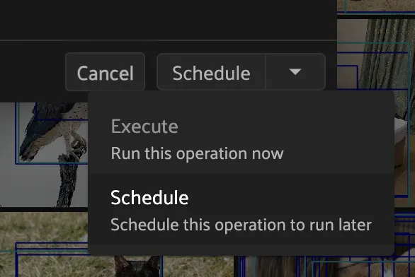

#### Dynamic execution options [¶](\#dynamic-execution-options "Permalink to this headline")

Operators may also implement
[`resolve_execution_options()`](../api/fiftyone.operators.operator.html#fiftyone.operators.operator.Operator.resolve_execution_options "fiftyone.operators.operator.Operator.resolve_execution_options")
to dynamically configure the available execution options based on the current
execution context:

```python
# Option 1: recommend delegation for larger views
def resolve_execution_options(self, ctx):
    should_delegate = len(ctx.view) > 1000
    return foo.ExecutionOptions(
        allow_immediate_execution=True,
        allow_delegated_execution=True,
        default_choice_to_delegated=should_delegate,
    )

# Option 2: force delegation for larger views
def resolve_execution_options(self, ctx):
    delegate = len(ctx.view) > 1000
    return foo.ExecutionOptions(
        allow_immediate_execution=not delegate,
        allow_delegated_execution=delegate,
    )

```

If implemented, this method will override any static execution parameters
included in the [operator’s config](#operator-config) as described in the
previous section.

#### Forced delegation [¶](\#forced-delegation "Permalink to this headline")

Operators can implement
[`resolve_delegation()`](../api/fiftyone.operators.operator.html#fiftyone.operators.operator.Operator.resolve_delegation "fiftyone.operators.operator.Operator.resolve_delegation")
to force a particular operation to be delegated (by returning `True`) or
executed immediately (by returning `False`) based on the current execution
context.

For example, you could decide whether to delegate execution based on the size
of the current view:

```python
def resolve_delegation(self, ctx):
    # Force delegation for large views and immediate execution for small views
    return len(ctx.view) > 1000

```

If [`resolve_delegation()`](../api/fiftyone.operators.operator.html#fiftyone.operators.operator.Operator.resolve_delegation "fiftyone.operators.operator.Operator.resolve_delegation")
is not implemented or returns `None`, then the choice of execution mode is
deferred to the prior mechanisms described above.

#### Reporting progress [¶](\#reporting-progress "Permalink to this headline")

Delegated operations can report their execution progress by calling
`set_progress()`
on their execution context from within
[`execute()`](../api/fiftyone.operators.operator.html#fiftyone.operators.operator.Operator.execute "fiftyone.operators.operator.Operator.execute"):

```python
import fiftyone as fo
import fiftyone.core.storage as fos
import fiftyone.core.utils as fou

def execute(self, ctx):
    images_dir = ctx.params["images_dir"]

    filepaths = fos.list_files(images_dir, abs_paths=True, recursive=True)

    num_added = 0
    num_total = len(filepaths)
    for batch in fou.iter_batches(filepaths, 100):
        samples = [fo.Sample(filepath=f) for f in batch]
        ctx.dataset.add_samples(samples)

        num_added += len(batch)
        ctx.set_progress(progress=num_added / num_total)

```

Note

[FiftyOne Teams](../teams/index.md#fiftyone-teams) users can view the current progress
of their delegated operations from the
[Runs page](../teams/teams_plugins.md#teams-managing-delegated-operations) of the Teams App!

For your convenience, all builtin methods of the FiftyOne SDK that support
rendering progress bars provide an optional `progress` method that you can use
trigger calls to
`set_progress()`
using the pattern show below:

```python
import fiftyone as fo

def execute(self, ctx):
    images_dir = ctx.params["images_dir"]

    # Custom logic that controls how progress is reported
    def set_progress(pb):
        if pb.complete:
            ctx.set_progress(progress=1, label="Operation complete")
        else:
            ctx.set_progress(progress=pb.progress)

    # Option 1: report progress every five seconds
    progress = fo.report_progress(set_progress, dt=5.0)

    # Option 2: report progress at 10 equally-spaced increments
    # progress = fo.report_progress(set_progress, n=10)

    ctx.dataset.add_images_dir(images_dir, progress=progress)

```

You can also use the builtin
`ProgressHandler` class to
automatically forward logging messages to
`set_progress()`
as `label` values using the pattern shown below:

```python
import logging
import fiftyone.operators as foo
import fiftyone.zoo as foz

def execute(self, ctx):
    name = ctx.params["name"]

    # Automatically report all `fiftyone` logging messages
    with foo.ProgressHandler(ctx, logger=logging.getLogger("fiftyone")):
        foz.load_zoo_dataset(name, persistent=True)

```

### Operator execution [¶](\#operator-execution "Permalink to this headline")

All operators must implement
[`execute()`](../api/fiftyone.operators.operator.html#fiftyone.operators.operator.Operator.execute "fiftyone.operators.operator.Operator.execute"), which is
where their main actions are performed.

The [`execute()`](../api/fiftyone.operators.operator.html#fiftyone.operators.operator.Operator.execute "fiftyone.operators.operator.Operator.execute") method
takes an [execution context](#operator-execution-context) as input whose
`ctx.params` dict has been hydrated with parameters provided either by the
user by filling out the operator’s [input form](#operator-inputs) or
directly provided by the operation that triggered it. The method can optionally
return a dict of results values that will be made available via `ctx.results`
when the operator’s [output form](#operator-outputs) is rendered.

#### Synchronous execution [¶](\#synchronous-execution "Permalink to this headline")

Your execution method is free to make use of the full power of the FiftyOne SDK
and any external dependencies that it needs.

For example, you might perform inference on a model:

```python
import fiftyone.zoo as foz

def execute(self, ctx):
    name = ctx.params["name"]
    label_field = ctx.params["label_field"]
    confidence_thresh = ctx.params.get("confidence_thresh", None)

    model = foz.load_zoo_model(name)
    ctx.view.apply_model(
        model, label_field=label_field, confidence_thresh=confidence_thresh
    )

    num_predictions = ctx.view.count(f"{label_field}.detections")
    return {"num_predictions": num_predictions}

```

Note

When an operator’s
[`execute()`](../api/fiftyone.operators.operator.html#fiftyone.operators.operator.Operator.execute "fiftyone.operators.operator.Operator.execute") method
throws an error it will be displayed to the user in the browser.

#### Asynchronous execution [¶](\#asynchronous-execution "Permalink to this headline")

The [`execute()`](../api/fiftyone.operators.operator.html#fiftyone.operators.operator.Operator.execute "fiftyone.operators.operator.Operator.execute") method
can also be `async`:

```python
import aiohttp

async def execute(self, ctx):
    # do something async
    async with aiohttp.ClientSession() as session:
        async with session.get(url) as resp:
            r = await resp.json()

```

#### Operator composition [¶](\#operator-composition "Permalink to this headline")

Many operators are designed to be composed with other operators to build up
more complex behaviors. You can trigger other operations from within an
operator’s [`execute()`](../api/fiftyone.operators.operator.html#fiftyone.operators.operator.Operator.execute "fiftyone.operators.operator.Operator.execute")
method via [`ctx.ops`](../api/fiftyone.operators.operations.html#fiftyone.operators.operations.Operations "fiftyone.operators.operations.Operations") and
`ctx.trigger`.

The [`ctx.ops`](../api/fiftyone.operators.operations.html#fiftyone.operators.operations.Operations "fiftyone.operators.operations.Operations") property of an
execution context exposes all builtin
`Python` and
[JavaScript](https://github.com/voxel51/fiftyone/blob/develop/app/packages/operators/src/built-in-operators.ts)
in a conveniently documented functional interface. For example, many operations
involve updating the current state of the App:

```python
def execute(self, ctx):
    # Dataset
    ctx.ops.open_dataset("...")
    ctx.ops.reload_dataset()

    # View/sidebar
    ctx.ops.set_view(name="...")  # saved view by name
    ctx.ops.set_view(view=view)  # arbitrary view
    ctx.ops.clear_view()
    ctx.ops.clear_sidebar_filters()

    # Selected samples
    ctx.ops.set_selected_samples([...]))
    ctx.ops.clear_selected_samples()

    # Selected labels
    ctx.ops.set_selected_labels([...])
    ctx.ops.clear_selected_labels()

    # Panels
    ctx.ops.open_panel("Embeddings")
    ctx.ops.close_panel("Embeddings")

```

The `ctx.trigger`
property is a lower-level function that allows you to invoke arbitrary
operations by providing their URI and parameters, including all builtin
operations as well as any operations installed via custom plugins. For example,
here’s how to trigger the same App-related operations from above:

```python
def execute(self, ctx):
    # Dataset
    ctx.trigger("open_dataset", params=dict(name="..."))
    ctx.trigger("reload_dataset")  # refreshes the App

    # View/sidebar
    ctx.trigger("set_view", params=dict(name="..."))  # saved view by name
    ctx.trigger("set_view", params=dict(view=view._serialize()))  # arbitrary view
    ctx.trigger("clear_view")
    ctx.trigger("clear_sidebar_filters")

    # Selected samples
    ctx.trigger("set_selected_samples", params=dict(samples=[...]))
    ctx.trigger("clear_selected_samples")

    # Selected labels
    ctx.trigger("set_selected_labels", params=dict(labels=[...]))
    ctx.trigger("clear_selected_labels")

    # Panels
    ctx.trigger("open_panel", params=dict(name="Embeddings"))
    ctx.trigger("close_panel", params=dict(name="Embeddings"))

```

#### Generator execution [¶](\#generator-execution "Permalink to this headline")

If your [operator’s config](#operator-config) declares that it is a
generator via `execute_as_generator=True`, then its
[`execute()`](../api/fiftyone.operators.operator.html#fiftyone.operators.operator.Operator.execute "fiftyone.operators.operator.Operator.execute") method should
`yield` calls to
[`ctx.ops`](../api/fiftyone.operators.operations.html#fiftyone.operators.operations.Operations "fiftyone.operators.operations.Operations") methods or
`ctx.trigger()`,
both of which trigger another operation and return a
[`GeneratedMessage`](../api/fiftyone.operators.message.html#fiftyone.operators.message.GeneratedMessage "fiftyone.operators.message.GeneratedMessage")
instance containing the result of the invocation.

For example, a common generator pattern is to use the builtin `set_progress`
operator to render a progress bar tracking the progress of an operation:

```python
def execute(self, ctx):
    # render a progress bar tracking the execution
    for i in range(n):
        # [process a chunk here]

        # Option 1: ctx.ops
        yield ctx.ops.set_progress(progress=i/n, label=f"Processed {i}/{n}")

        # Option 2: ctx.trigger
        yield ctx.trigger(
            "set_progress",
            dict(progress=i/n, label=f"Processed {i}/{n}"),
        )

```

Note

Check out the
[VoxelGPT plugin](https://github.com/voxel51/voxelgpt/blob/dfe23093485081fb889dbe18685587f4358a4438/__init__.py#L133)
for a more sophisticated example of using generator execution to stream an
LLM’s response to a panel.

### Accessing secrets [¶](\#accessing-secrets "Permalink to this headline")

Some plugins may require sensitive information such as API tokens and login
credentials in order to function. Any secrets that a plugin requires are
in its [fiftyone.yml](#plugin-fiftyone-yml).

For example, the
[@voxel51/annotation](https://github.com/voxel51/fiftyone-plugins/blob/main/plugins/annotation/fiftyone.yml)
plugin declares the following secrets:

```python
secrets:
  - FIFTYONE_CVAT_URL
  - FIFTYONE_CVAT_USERNAME
  - FIFTYONE_CVAT_PASSWORD
  - FIFTYONE_CVAT_EMAIL
  - FIFTYONE_LABELBOX_URL
  - FIFTYONE_LABELBOX_API_KEY
  - FIFTYONE_LABELSTUDIO_URL
  - FIFTYONE_LABELSTUDIO_API_KEY

```

As the naming convention implies, any necessary secrets are provided by users
by setting environment variables with the appropriate names. For example, if
you want to use the CVAT backend with the
[@voxel51/annotation](https://github.com/voxel51/fiftyone-plugins/blob/main/plugins/annotation/fiftyone.yml)
plugin, you would set:

```python
FIFTYONE_CVAT_URL=...
FIFTYONE_CVAT_USERNAME=...
FIFTYONE_CVAT_PASSWORD=...
FIFTYONE_CVAT_EMAIL=...

```

At runtime, the plugin’s [execution context](#operator-execution-context)
is automatically hydrated with any available secrets that are declared by the
plugin. Operators can access these secrets via the `ctx.secrets` dict:

```python
def execute(self, ctx):
   url = ctx.secrets["FIFTYONE_CVAT_URL"]
   username = ctx.secrets["FIFTYONE_CVAT_USERNAME"]
   password = ctx.secrets["FIFTYONE_CVAT_PASSWORD"]
   email = ctx.secrets["FIFTYONE_CVAT_EMAIL"]

```

### Operator outputs [¶](\#operator-outputs "Permalink to this headline")

Operators can optionally implement
[`resolve_output()`](../api/fiftyone.operators.operator.html#fiftyone.operators.operator.Operator.resolve_output "fiftyone.operators.operator.Operator.resolve_output")
to define read-only output forms that are presented to the user as a modal in
the App after the operator’s execution completes.

The basic objective of
[`resolve_output()`](../api/fiftyone.operators.operator.html#fiftyone.operators.operator.Operator.resolve_output "fiftyone.operators.operator.Operator.resolve_output")
is to define properties that describe how to render the values in `ctx.results`
for the user. As with input forms, you can use the
[`fiftyone.operators.types`](../api/fiftyone.operators.types.html#module-fiftyone.operators.types "fiftyone.operators.types") module to define the output properties.

For example, the output form below renders the number of samples ( `count`)
computed during the operator’s [execution](#operator-execution):

```python
def execute(self, ctx):
    # computation here...

    return {"count": count}

def resolve_output(self, ctx):
    outputs = types.Object()
    outputs.int(
        "count",
        label="Count",
        description=f"The number of samples in the current {target}",
    )
    return types.Property(outputs)

```

Note

All properties in output forms are implicitly rendered as read-only.

### Operator placement [¶](\#operator-placement "Permalink to this headline")

By default, operators are only accessible from the
[operator browser](using_plugins.md#using-operators). However, you can place a custom
button, icon, menu item, etc. in the App that will trigger the operator when
clicked in any location supported by the
[`types.Places`](../api/fiftyone.operators.types.html#fiftyone.operators.types.Places "fiftyone.operators.types.Places") enum.

For example, you can use:

- `types.Places.SAMPLES_GRID_ACTIONS`
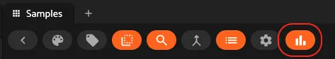
- `types.Places.SAMPLES_GRID_SECONDARY_ACTIONS`

- `types.Places.SAMPLES_VIEWER_ACTIONS`
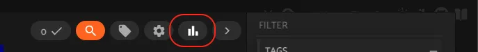
- `types.Places.EMBEDDINGS_ACTIONS`

- `types.Places.HISTOGRAM_ACTIONS`
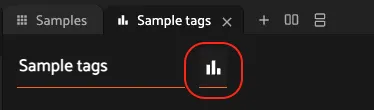
- `types.Places.MAP_ACTIONS`
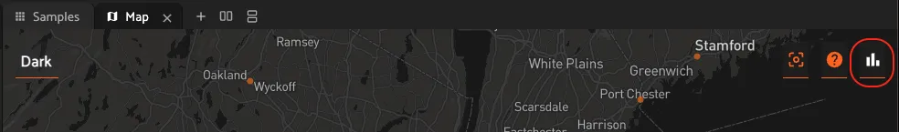

You can add a placement for an operator by implementing the
[`resolve_placement()`](../api/fiftyone.operators.operator.html#fiftyone.operators.operator.Operator.resolve_placement "fiftyone.operators.operator.Operator.resolve_placement")
method as demonstrated below:

## Developing panels [¶](\#developing-panels "Permalink to this headline")

Panels are miniature full-featured data applications that you can open in
[App spaces](../fiftyone_concepts/app.md#app-spaces) and interactively manipulate to explore your
dataset and update/respond to updates from other spaces that are currently open
in the App.

Panels can be defined in either Python or JS, and FiftyOne comes with a
number of [builtin panels](#plugins-design-panels) for common tasks.

Panels can be scoped to the App’s grid view or modal view via their
[config](#panel-config). Grid panels enable extensibility at the macro
level, allowing you to work with entire datasets or views, while modal panels
provide extensibility at the micro level, focusing on individual samples and
scenarios.

Panels, like [operators](#developing-operators), can make use of the
[`fiftyone.operators.types`](../api/fiftyone.operators.types.html#module-fiftyone.operators.types "fiftyone.operators.types") module and the
[`@fiftyone/operators`](../api/fiftyone.operators.html "@fiftyone/operators") package, which define a
rich builtin type system that panel developers can use to implement the layout
and associated events that define the panel.

Panels can trigger both Python and JS operators, either programmatically or
by interactively launching a prompt that users can fill out to provide the
necessary parameters for the operator’s execution. This powerful composability
allows panels to define interactive workflows that guide the user through
executing workflows on their data and then interactively exploring and
analyzing the results of the computation.

Panels can also interact with other components of the App, such as responding
to changes in (or programmatically updating) the current dataset, view, current
selection, or active sample in the modal.

### Panel interface [¶](\#panel-interface "Permalink to this headline")

The code block below describes the Python interface for defining panels.
We’ll dive into each component of the interface in more detail in the
subsequent sections.

Note

See [this section](#developing-js-plugins) for more information on
developing panels in JS.

```python
import fiftyone.operators as foo
import fiftyone.operators.types as types

class ExamplePanel(foo.Panel):
    @property
    def config(self):
        return foo.PanelConfig(
            # The panel's URI: f"{plugin_name}/{name}"
            name="example_panel",  # required

            # The display name of the panel in the "+" menu
            label="Example panel",  # required

            # Custom icons to use in the "+"" menu
            # Can be a URL, a local path in the plugin directory, or the
            # name of a MUI icon: https://marella.me/material-icons/demo
            icon="/assets/icon.svg",
            light_icon="developer_mode",  # light theme only
            dark_icon="developer_mode",  # dark theme only

            # Whether to allow multiple instances of the panel to be opened
            allow_multiple=False,

            # Whether the panel should be available in the grid, modal, or both
            # Possible values: "grid", "modal", "grid modal"
            surfaces="grid",  # default = "grid"

            # Markdown-formatted text that describes the panel. This is
            # rendered in a tooltip when the help icon in the panel
            # title is hovered over
            help_markdown="A description of the panel",
        )

    def render(self, ctx):
        """Implement this method to define your panel's layout and events.

        This method is called after every panel event is executed (panel
        load, button callback, context change event, etc).

        Returns:
            a `types.Property` defining the panel's components
        """
        panel = types.Object()

        brain_keys = ctx.panel.get_state("brain_keys", [])

        # Define a menu of actions for the panel
        menu = panel.menu("menu", variant="square", color="51")
        menu.enum(
            "brain_key",
            label="Choose a brain key",  # placeholder text
            values=brain_keys,
            on_change=self.on_change_brain_key,  # custom event callback
        )
        menu.btn(
            "learn_more",
            label="Learn more",  # tooltip text
            icon="help",  # material UI icon
            on_click=self.on_click_learn_more,  # custom event callback
        )

        # Define components that appear in the panel's main body
        panel.str("event", label="The last event", view=types.LabelValueView())
        panel.obj(
            "event_data", label="The last event data", view=types.JSONView()
        )

        # Display a checkbox to toggle between plot and compute visualization button
        show_compute_visualization_btn = ctx.panel.get_state(
            "show_start_button", True
        )
        panel.bool(
            "show_start_button",
            label="Show compute visualization button",
            on_change=self.on_change_show_start_button,
        )

        # You can use conditional logic to dynamically change the layout
        # based on the current panel state
        if show_compute_visualization_btn:
            # Define a button with a custom on click event
            panel.btn(
                "start",
                label="Compute visualization",  # button text
                on_click=self.on_click_start,  # custom event callback
                variant="contained",  # button style
            )
        else:
            # Define an interactive plot with custom callbacks
            panel.plot(
                "embeddings",
                config={},  # plotly config
                layout={},  # plotly layout config
                on_selected=self.on_selected_embeddings,  # custom event callback
                height="400px",
            )

        return types.Property(
            panel, view=types.GridView(orientation="vertical")
        )

    #######################################################################
    # Builtin events
    #######################################################################

    def on_load(self, ctx):
        """Implement this method to set panel state/data when the panel
        initially loads.
        """
        event = {
            "data": None,
            "description": "the panel is loaded",
        }
        ctx.panel.set_state("event", "on_load")
        ctx.panel.set_data("event_data", event)

        # Get the list of brain keys to populate `brain_key` dropdown
        visualization_keys = ctx.dataset.list_brain_runs("visualization")
        ctx.panel.set_state("brain_keys", visualization_keys)

        # Show compute visualization button by default
        ctx.panel.set_state("show_start_button", True)

    def on_unload(self, ctx):
        """Implement this method to set panel state/data when the panel is
        being closed.
        """
        event = {
            "data": None,
            "description": "the panel is unloaded",
        }
        ctx.panel.set_state("event", "on_unload")
        ctx.panel.set_data("event_data", event)

    def on_change_ctx(self, ctx):
        """Implement this method to set panel state/data when any aspect
        of the execution context (view, selected samples, filters, etc.) changes.

        The current execution context will be available via ``ctx``.
        """
        event = {
            "data": {
                "view": ctx.view._serialize(),
                "selected": ctx.selected,
                "has_custom_view": ctx.has_custom_view,
            },
            "description": "the current ExecutionContext",
        }
        ctx.panel.set_state("event", "on_change_ctx")
        ctx.panel.set_data("event_data", event)

    def on_change_dataset(self, ctx):
        """Implement this method to set panel state/data when the current
        dataset is changed.

        The new dataset will be available via ``ctx.dataset``.
        """
        event = {
            "data": ctx.dataset.name,
            "description": "the current dataset name",
        }
        ctx.panel.set_state("event", "on_change_dataset")
        ctx.panel.set_data("event_data", event)

    def on_change_view(self, ctx):
        """Implement this method to set panel state/data when the current
        view is changed.

        The new view will be available via ``ctx.view``.
        """
        event = {
            "data": ctx.view._serialize(),
            "description": "the current view",
        }
        ctx.panel.set_state("event", "on_change_view")
        ctx.panel.set_data("event_data", event)

    def on_change_spaces(self, ctx):
        """Implement this method to set panel state/data when the current
        spaces layout changes.

        The current spaces layout will be available via ``ctx.spaces``.
        """
        event = {
            "data": ctx.spaces,
            "description": "the current spaces layout",
        }
        ctx.panel.set_state("event", "on_change_spaces")
        ctx.panel.set_data("event_data", event)

    def on_change_current_sample(self, ctx):
        """Implement this method to set panel state/data when a new sample
        is loaded in the Sample modal.

        The ID of the new sample will be available via
        ``ctx.current_sample``.
        """
        event = {
            "data": ctx.current_sample,
            "description": "the current sample",
        }
        ctx.panel.set_state("event", "on_change_current_sample")
        ctx.panel.set_data("event_data", event)

    def on_change_selected(self, ctx):
        """Implement this method to set panel state/data when the current
        selection changes (eg in the Samples panel).

        The IDs of the current selected samples will be available via
        ``ctx.selected``.
        """
        event = {
            "data": ctx.selected,
            "description": "the current selection",
        }
        ctx.panel.set_state("event", "on_change_selected")
        ctx.panel.set_data("event_data", event)

    def on_change_selected_labels(self, ctx):
        """Implement this method to set panel state/data when the current
        selected labels change (eg in the Sample modal).

        Information about the current selected labels will be available
        via ``ctx.selected_labels``.
        """
        event = {
            "data": ctx.selected_labels,
            "description": "the current selected labels",
        }
        ctx.panel.set_state("event", "on_change_selected_labels")
        ctx.panel.set_data("event_data", event)

    def on_change_extended_selection(self, ctx):
        """Implement this method to set panel state/data when the current
        extended selection changes.

        The IDs of the current extended selection will be available via
        ``ctx.extended_selection``.
        """
        event = {
            "data": ctx.extended_selection,
            "description": "the current extended selection",
        }
        ctx.panel.set_state("event", "on_change_extended_selection")
        ctx.panel.set_data("event_data", event)

    def on_change_group_slice(self, ctx):
        """Implement this method to set panel state/data when the current
        group slice changes.

        The current group slice will be available via ``ctx.group_slice``.
        """
        event = {
            "data": ctx.group_slice,
            "description": "the current group slice",
        }
        ctx.panel.set_state("event", "on_change_group_slice")
        ctx.panel.set_data("event_data", event)

    #######################################################################
    # Custom events
    # These events are defined by user code above and, just like builtin
    # events, take `ctx` as input and are followed by a call to render()
    #######################################################################

    def on_change_brain_key(self, ctx):
        # Load expensive content based on current `brain_key`
        brain_key = ctx.panel.get_state("menu.brain_key")
        results = ctx.dataset.load_brain_results(brain_key)

        # Format results for plotly
        x, y = zip(*results.points.tolist())
        ids = results.sample_ids

        plot_data = [\
            {"x": x, "y": y, "ids": ids, "type": "scatter", "mode": "markers"}\
        ]

        # Store large content as panel data for efficiency
        ctx.panel.set_data("embeddings", plot_data)

        # Show plot with embeddings data instead of the compute visualization button
        ctx.panel.set_state("show_start_button", False)

    def on_click_start(self, ctx):
        # Launch an interactive prompt for user to execute an operator
        ctx.prompt("@voxel51/brain/compute_visualization")

        # Lightweight state update
        ctx.panel.set_state("show_start_button", False)

    def on_click_learn_more(self, ctx):
        # Trigger a builtin operation via `ctx.ops`
        url = "https://docs.voxel51.com/plugins/developing_plugins.html"
        ctx.ops.notify(f"Check out {url} for more information")

    def on_selected_embeddings(self, ctx):
        # Get selected points from event params
        selected_points = ctx.params.get("data", [])
        selected_sample_ids = [d.get("id", None) for d in selected_points]

        # Conditionally trigger a builtin operation via `ctx.ops`
        if len(selected_sample_ids) > 0:
            ctx.ops.set_extended_selection(selected_sample_ids)

    def on_change_show_start_button(self, ctx):
        # Get current state of the checkbox on change
        current_state = ctx.params.get("value", None)

def register(p):
    """Always implement this method and register() each panel that your
    plugin defines.
    """
    p.register(ExamplePanel)

```


Note

Remember that you must also include the panel’s name in the plugin’s
[fiftyone.yml](#plugin-fiftyone-yml):

```python
panels:
  - example_panel

```

### Panel config [¶](\#panel-config "Permalink to this headline")

Every panel must define a
[`config`](../api/fiftyone.operators.panel.html#fiftyone.operators.panel.Panel.config "fiftyone.operators.panel.Panel.config") property that
defines its name, display name, surfaces, and other optional metadata about its
behavior:

```python
@property
def config(self):
    return foo.PanelConfig(
        # The panel's URI: f"{plugin_name}/{name}"
        name="example_panel",  # required

        # The display name of the panel in the "+" menu
        label="Example panel",  # required

        # Custom icons to use in the "+"" menu
        # Can be a URL, a local path in the plugin directory, or the
        # name of a MUI icon: https://marella.me/material-icons/demo
        icon="/assets/icon.svg",
        light_icon="/assets/icon-light.svg",  # light theme only
        dark_icon="/assets/icon-dark.svg",  # dark theme only

        # Whether to allow multiple instances of the panel to be opened
        allow_multiple=False,

        # Whether the panel should be available in the grid, modal, or both
        # Possible values: "grid", "modal", "grid modal"
        surfaces="grid",  # default = "grid"

        # Markdown-formatted text that describes the panel. This is
        # rendered in a tooltip when the help icon in the panel
        # title is hovered over
        help_markdown="A description of the panel",
    )

```

The `surfaces` key defines the panel’s scope:

- Grid panels can be accessed from the `+` button in the App’s
[grid view](../fiftyone_concepts/app.md#app-fields-sidebar), which allows you to build macro
experiences that work with entire datasets or views

- Modal panels can be accessed from the `+` button in the App’s
[modal view](../fiftyone_concepts/app.md#app-sample-view), which allows you to build interactions
that focus on individual samples and scenarios

Note

For an example of a modal panel, refer to the
[label count panel](https://github.com/voxel51/fiftyone-plugins/tree/main/plugins/label_count).

### Execution context [¶](\#panel-execution-context "Permalink to this headline")

An `ExecutionContext` is
passed to each of the panel’s methods at runtime. This `ctx` contains static
information about the current state of the App (dataset, view, panel,
selection, etc) as well as dynamic information about the panel’s current
state and data.

See [this section](#operator-execution-context) for a full description
of the execution context.

### Panel state and data [¶](\#panel-state-and-data "Permalink to this headline")

Panels provide two mechanisms for persisting information:
[panel state](#panel-state) and [panel data](#panel-data).

#### Basic structure [¶](\#basic-structure "Permalink to this headline")

Panel state can be accessed and updated via `ctx.panel.state`, and panel data
can be updated (but not accessed) via `ctx.panel.data`.

Under the hood, panel state and data is merged into a single nested object that
maps 1-1 to the structure and naming of the properties defined by the panel’s
[`render()`](../api/fiftyone.operators.panel.html#fiftyone.operators.panel.Panel.render "fiftyone.operators.panel.Panel.render") method.

The example code below shows how to access and update panel state.

Note

Since panel state and panel data are merged into a single object, it is
important to avoid naming conflicts between state and data keys. If a key
is present in both panel state and data, the value in _panel data_ will be
used.

```python
class CounterPanel(foo.Panel):
    @property
    def config(self):
        return foo.PanelConfig(
            name="counter_panel", label="Counter Panel", icon="123"
        )

    def on_load(self, ctx):
        ctx.panel.state.v_stack = {"h_stack": {"count": 3}}

    def increment(self, ctx):
        count = ctx.panel.state.get("v_stack.h_stack.count", 0)
        ctx.panel.state.set("v_stack.h_stack.count", count + 1)

    def decrement(self, ctx):
        count = ctx.panel.get_state("v_stack.h_stack.count", 0)
        ctx.panel.set_state("v_stack.h_stack.count", count - 1)

    def render(self, ctx):
        panel = types.Object()

        # Define a vertical stack object with the name 'v_stack'
        # key: 'v_stack'
        v_stack = panel.v_stack("v_stack", align_x="center", gap=2)

        # Define a horizontal stack object with the name 'h_stack' on 'v_stack'
        # key: 'v_stack.h_stack'
        h_stack = v_stack.h_stack("h_stack", align_y="center")

        # Get state
        v_stack_state = ctx.panel.state.v_stack
        h_stack_state = v_stack_state["h_stack"] if v_stack_state is not None else None
        count = h_stack_state["count"] if h_stack_state is not None else 0

        # Add a message to the horizontal stack object with the name 'count'
        # key: 'v_stack.h_stack.count'
        h_stack.message("count", f"Count: {count}")

        # Add a button to the horizontal stack object with the name 'increment'
        # key: 'v_stack.h_stack.increment'
        h_stack.btn(
            "increment",
            label="Increment",
            icon="add",
            on_click=self.increment,
            variant="contained",
        )

        # Add a button to the horizontal stack object with the name 'decrement'
        # key: 'v_stack.h_stack.count'
        h_stack.btn(
            "decrement",
            label="Decrement",
            icon="remove",
            on_click=self.decrement,
            variant="contained",
        )

        return types.Property(panel)

```

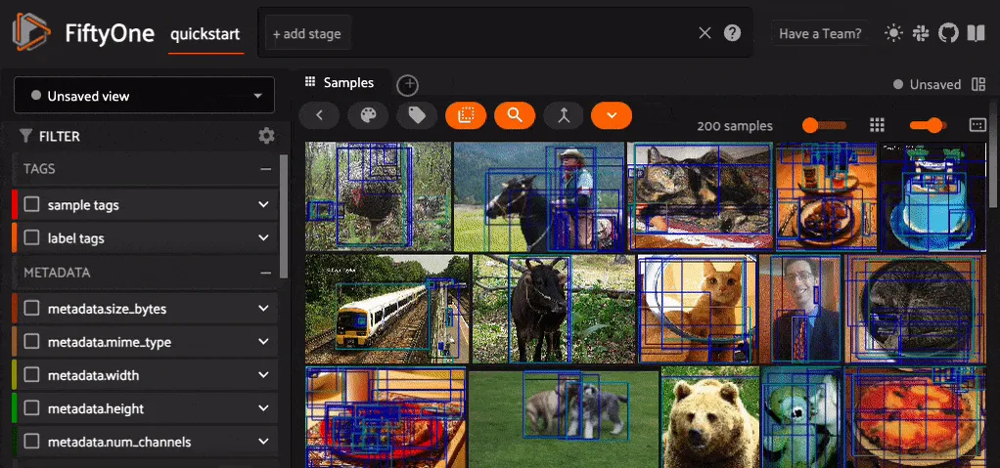

#### Panel state [¶](\#panel-state "Permalink to this headline")

Panel state is included in every
[`render()`](../api/fiftyone.operators.panel.html#fiftyone.operators.panel.Panel.render "fiftyone.operators.panel.Panel.render") call and event
callback and is analogous to [operator parameters](#operator-inputs):

- The values of any components defined in a panel’s
[`render()`](../api/fiftyone.operators.panel.html#fiftyone.operators.panel.Panel.render "fiftyone.operators.panel.Panel.render") method are
available via corresponding state properties of the same name

- The current panel state is readable during a panel’s execution

```python
def render(self, ctx):
    panel = types.Object()

    menu = panel.menu("menu", ...)
    actions = menu.btn_group("actions")
    actions.enum(
        "mode",
        values=["foo", "bar"],
        on_change=self.on_change_mode,
        ...
    )

    panel.str("user_input", default="spam")

def on_change_mode(self, ctx):
    # Object-based interface
    mode = ctx.panel.state.menu.actions.mode
    user_input = ctx.panel.state.user_input

    # Functional interface
    mode = ctx.panel.get_state("menu.actions.mode")
    user_input = ctx.panel.get_state("user_input")

```

Panel state can be programmatically updated in panel methods via the two
syntaxes shown below:

```python
def on_change_view(self, ctx):
    # Top-level state attributes can be modified by setting properties
    ctx.panel.state.foo = "bar"

    # Use set_state() to efficiently apply nested updates
    ctx.panel.set_state("foo.bar", {"spam": "eggs"})

```

Warning

Don’t directly modify panel state in
[`render()`](../api/fiftyone.operators.panel.html#fiftyone.operators.panel.Panel.render "fiftyone.operators.panel.Panel.render"), just like how
`setState()` should not be called in
React’s
[render()](https://legacy.reactjs.org/docs/react-component.html#render).

Instead set panel state in event callbacks as demonstrated above.

#### Panel data [¶](\#panel-data "Permalink to this headline")

Panel data is designed to store larger content such as plot data that is
loaded once and henceforward stored _only_ clientside to avoid
unnecessary/expensive reloads and serverside serialization during the lifecycle
of the panel.

```python
def on_load(self, ctx):
    self.update_plot_data(ctx)

def render(self, ctx):
    panel = types.Object()

    menu = panel.menu("menu", ...)
    actions = menu.btn_group("actions")
    actions.enum(
        "brain_key",
        label="Brain key",
        values=["foo", "bar"],
        default=None,
        on_change=self.update_plot_data,
    )

    panel.plot("embeddings", config=..., layout=...)

    return types.Property(panel)

def update_plot_data(self, ctx):
    brain_key = ctx.panel.state.menu.actions.brain_key
    if brain_key is None:
        return

    # Load expensive content based on current `brain_key`
    results = ctx.dataset.load_brain_results(brain_key)

    # Store large content as panel data for efficiency
    data = {"points": results.points, ...}
    ctx.panel.set_data("embeddings", data)

```

Note how the panel’s `on_load()` hook is implemented so that panel data can be
hydrated when the panel is initially loaded, and then subsequently plot data is
loaded only when the `brain_key` property is modified.

Note

Panel data is never readable in Python; it is only implicitly used by
the types you define when they are rendered clientside.

### Execution store [¶](\#execution-store "Permalink to this headline")

Panels can store data in the execution store, which is a key-value store that
is persisted beyond the lifetime of the panel. This is useful for storing
information that should persist across panel instances and App sessions, such
as cached data, long-lived panel state, or user preferences.

You can create/retrieve execution stores scoped to the current `ctx.dataset`
via `ctx.store`:

```python
def on_load(ctx):
    # Retrieve a store scoped to the current `ctx.dataset`
    # The store is automatically created if necessary
    store = ctx.store("my_store")

    # Load a pre-existing value from the store
    user_choice = store.get("user_choice")

    # Store data with a TTL to ensure it is evicted after `ttl` seconds
    store.set("my_key", {"foo": "bar"}, ttl=60)

    # List all keys in the store
    print(store.list_keys())  # ["user_choice", "my_key"]

    # Retrieve data from the store
    print(store.get("my_key"))  # {"foo": "bar"}

    # Retrieve metadata about a key
    print(store.get_metadata("my_key"))
    # {"created_at": ..., "updated_at": ..., "expires_at": ...}

    # Delete a key from the store
    store.delete("my_key")

    # Clear all data in the store
    store.clear()

```

Note

Did you know? Any execution stores associated with a dataset are
automatically deleted when the dataset is deleted.

For advanced use cases, it is also possible to create and use global stores
that are available to all datasets via the
[`ExecutionStore`](../api/fiftyone.operators.store.html#fiftyone.operators.store.ExecutionStore "fiftyone.operators.store.ExecutionStore") class:

```python
from fiftyone.operators import ExecutionStore

# Retrieve a global store
# The store is automatically created if necessary
store = ExecutionStore.create("my_store")

# Store data with a TTL to ensure it is evicted after `ttl` seconds
store.set("my_key", {"foo": "bar"}, ttl=60)

# List all keys in the global store
print(store.list_keys())  # ["my_key"]

# Retrieve data from the global store
print(store.get("my_key"))  # {"foo": "bar"}

# Retrieve metadata about a key
print(store.get_metadata("my_key"))
# {"created_at": ..., "updated_at": ..., "expires_at": ...}

# Delete a key from the global store
store.delete("my_key")

# Clear all data in the global store
store.clear()

```

Warning

Global stores have no automatic garbage collection, so take care when
creating and using global stores whose keys do not utilize TTLs.

### Saved workspaces [¶](\#saved-workspaces "Permalink to this headline")

[Saved workspaces](../fiftyone_concepts/app.md#app-workspaces) may contain any number of Python
panels!

When a workspace is saved, the current [panel state](#panel-state) of any
panels in the layout is persisted as part of the workspace’s definition. Thus
when the workspace is loaded later, all panels will “remember” their state.

[Panel data](#panel-data) (which may be large), on the other hand, is
_not_ explicitly persisted. Instead it should be hydrated when the panel is
loaded using the pattern [demonstrated here](#panel-data).

### Accessing secrets [¶](\#panel-accessing-secrets "Permalink to this headline")

Panels can [access secrets](#operator-secrets) defined by their plugin.

At runtime, the panel’s [execution context](#operator-execution-context)
is automatically hydrated with any available secrets that are declared by the
plugin. Panels can access these secrets via the `ctx.secrets` dict:

```python
def on_load(self, ctx):
    url = ctx.secrets["FIFTYONE_CVAT_URL"]
    username = ctx.secrets["FIFTYONE_CVAT_USERNAME"]
    password = ctx.secrets["FIFTYONE_CVAT_PASSWORD"]
    email = ctx.secrets["FIFTYONE_CVAT_EMAIL"]

```

### Common patterns [¶](\#common-patterns "Permalink to this headline")

Most panels make use of common patterns like callbacks, menus, interactive
plots, and walkthrough layouts.

Learning the patterns described below will help you build panels faster and
avoid roadblocks along the way.

Note

Check out the
[panel examples](https://github.com/voxel51/fiftyone-plugins/tree/main/plugins/panel-examples)
plugin to see a collection of fully-functional panels that demonstrate
the common patterns below.

#### Callbacks [¶](\#callbacks "Permalink to this headline")

Most panel components support callback methods like `on_click` and `on_change`
that you can implement to perform operations and trigger state updates when
users interact with the components.

For example, the code below shows how clicking a button or changing the state
of a slider can initiate callbacks that trigger operators, open other panels,
and programmatically modify the current state.

Note

All callback functions have access to the current
`ExecutionContext`
via their `ctx` argument and can use it to get/update panel state and
trigger other operations.

```python
def on_load(self, ctx):
    # Set initial slider state
    ctx.panel.state.slider_value = 5

def open_compute(self, ctx):
    # Launch an interactive prompt for user to execute an operator
    ctx.prompt("@voxel51/brain/compute_visualization")

def open_embeddings(self, ctx):
    # Open embeddings panel
    ctx.trigger("open_panel", params=dict(name="Embeddings"))

def change_value(self, ctx):
    # Grab current slider value from `ctx.params`
    ctx.panel.state.slider_value = (
        ctx.params["value"] or ctx.params["panel_state"]["slider_value"]
    )

def render(self, ctx):
    panel = types.Object()

    # Define buttons that work with on_click callbacks
    panel.btn(
        "button_1",
        label="Compute visualization",
        on_click=self.open_compute,
    )
    panel.btn(
        "button_2",
        label="Open embeddings panel",
        on_click=self.open_embeddings,
    )

    # Define a slider with an `on_change` callback
    slider = types.SliderView(
        data=ctx.panel.state.slider_value, label="Example Slider"
    )
    schema = {"min": 0, "max": 10, "multipleOf": 1}
    panel.int(
        "slider_value", view=slider, on_change=self.change_value, **schema
    )

```

Note

Did you know? You can use `ctx.params` in a callback to access the state
of the property that triggered the action.

#### Dropdown menus [¶](\#dropdown-menus "Permalink to this headline")

Dropdown menus can be a useful tool to build panels whose layout/content
dynamically changes based on the current state of the menu.

Here’s an example of a dropdown menu with selectable options that alters the
panel layout based on user input.

Note

Panels also support a `menu()` property that provides a convenient syntax
for defining a group of dropdowns, buttons, etc that can be anchored
to a particular position in your panel (e.g., top-left).

Check out [this section](#panel-interface) for an example panel that
makes use of `menu()`.

```python
class DropdownMenuExample(foo.Panel):
    @property
    def config(self):
        return foo.PanelConfig(
            name="example_dropdown_menu",
            label="Examples: Dropdown Menu",
        )

    def on_load(self, ctx):
        ctx.panel.state.selection = None

    def alter_selection(self, ctx):
        ctx.panel.state.selection = ctx.params["value"]

    def refresh_page(self, ctx):
        ctx.ops.reload_dataset()

    def reload_samples(self, ctx):
        ctx.ops.reload_samples()

    def say_hi(self, ctx):
        ctx.ops.notify("Hi!", variant="success")

    def render(self, ctx):
        panel = types.Object()

        panel.md(
            """
            ### Welcome to the Python Panel Dropdown Menu Example
            Use the menu below to select what you would like to do next!

            ---

        """,
            name="header",
            width=50,  # 50% of current panel width
            height="200px",
        )

        # Define a dropdown menu and add choices
        dropdown = types.DropdownView()
        dropdown.add_choice(
            "refresh",
            label="Display Refresh Button",
            description="Displays button that will refresh the FiftyOne App",
        )
        dropdown.add_choice(
            "reload_samples",
            label="Display Reload Samples Button",
            description="Displays button that will reload the samples view",
        )
        dropdown.add_choice(
            "say_hi",
            label="Display Hi Button",
            description="Displays button that will say hi",
        )

        # Add dropdown menu to the panel as a view and use the `on_change`
        # callback to trigger `alter_selection`
        panel.view(
            "dropdown",
            view=dropdown,
            label="Dropdown Menu",
            on_change=self.alter_selection,
        )

        # Change panel visual state dependent on dropdown menu selection
        if ctx.panel.state.selection == "refresh":
            panel.btn(
                "refresh",
                label="Refresh FiftyOne",
                on_click=self.refresh_page,
                variant="contained",
            )
        elif ctx.panel.state.selection == "reload_samples":
            panel.btn(
                "reload_samples",
                label="Reload Samples",
                on_click=self.reload_samples,
                variant="contained",
            )
        elif ctx.panel.state.selection == "say_hi":
            panel.btn(
                "say_hi",
                label="Say Hi",
                on_click=self.say_hi,
                variant="contained",
            )

        return types.Property(
            panel,
            view=types.GridView(
                height=100,
                width=100,
                align_x="center",
                align_y="center",
                orientation="vertical",
            ),
        )

```


#### Interactive plots [¶](\#interactive-plots "Permalink to this headline")

Panels provide native support for defining interactive plots that can render
data from the current dataset and dynamically update or trigger actions as
users interact with the plots.

For example, here’s a panel that displays a histogram of a specified field of
the current dataset where clicking a bar loads the corresponding samples in
the App.

```python
import fiftyone.operators as foo
import fiftyone.operators.types as types
from fiftyone import ViewField as F

class InteractivePlotExample(foo.Panel):
    @property
    def config(self):
        return foo.PanelConfig(
            name="example_interactive_plot",
            label="Examples: Interactive Plot",
            icon="bar_chart",
        )

    def on_load(self, ctx):
        # Get target field
        target_field = (
            ctx.panel.state.target_field or "ground_truth.detections.label"
        )
        ctx.panel.state.target_field = target_field

        # Compute target histogram for current dataset
        counts = ctx.dataset.count_values(target_field)
        keys, values = zip(*sorted(counts.items(), key=lambda x: x[0]))

        # Store as panel data for efficiency
        ctx.panel.data.histogram = {"x": keys, "y": values, "type": "bar"}

        # Launch panel in a horizontal split view
        ctx.ops.split_panel("example_interactive_plot", layout="horizontal")

    def on_change_view(self, ctx):
        # Update histogram when current view changes
        self.on_load(ctx)

    def on_histogram_click(self, ctx):
        # The histogram bar that the user clicked
        value = ctx.params.get("x")

        # Create a view that matches the selected histogram bar
        field = ctx.panel.state.target_field
        view = _make_matching_view(ctx.dataset, field, value)

        # Load view in App
        if view is not None:
            ctx.ops.set_view(view=view)

    def reset(self, ctx):
        ctx.ops.clear_view()
        self.on_load(ctx)

    def render(self, ctx):
        panel = types.Object()

        panel.plot(
            "histogram",
            layout={
                "title": {
                    "text": "Interactive Histogram",
                    "xanchor": "center",
                    "yanchor": "top",
                    "automargin": True,
                },
                "xaxis": {"title": "Labels"},
                "yaxis": {"title": "Count"},
            },
            on_click=self.on_histogram_click,
            width=100,
        )

        panel.btn(
            "reset",
            label="Reset Chart",
            on_click=self.reset,
            variant="contained",
        )

        return types.Property(
            panel,
            view=types.GridView(
                align_x="center",
                align_y="center",
                orientation="vertical",
                height=100,
                width=100,
                gap=2,
                padding=0,
            ),
        )

def _make_matching_view(dataset, field, value):
    if field.endswith(".label"):
        root_field = field.split(".")[0]
        return dataset.filter_labels(root_field, F("label") == value)
    elif field == "tags":
        return dataset.match_tags(value)
    else:
        return dataset.match(F(field) == value)

```


#### Walkthroughs [¶](\#walkthroughs "Permalink to this headline")

You can use a combination of panel objects like markdown, buttons, arrow
navigation, and layout containers to create guided walkthroughs similar to the
ones at [try.fiftyone.ai](https://try.fiftyone.ai/datasets/example/samples).

Here’s an example of a panel that leads the user through multiple steps of a
guided workflow.

```python
class WalkthroughExample(foo.Panel):
    @property
    def config(self):
        return foo.PanelConfig(
            name="example_walkthrough",
            label="Examples: Walkthrough",
        )

    def on_load(self, ctx):
        ctx.panel.state.page = 1
        info_table = [\
            {\
                "Dataset Name": f"{ctx.dataset.name}",\
                "Dataset Description": "FiftyOne Quick Start Zoo Dataset",\
                "Number of Samples": f"{ctx.dataset.count()}",\
            },\
        ]

    ctx.panel.state.info_table = info_table

    def go_to_next_page(self, ctx):
        ctx.panel.state.page = ctx.panel.state.page + 1

    def go_to_previous_page(self, ctx):
        ctx.panel.state.page = ctx.panel.state.page - 1

    def reset_page(self, ctx):
        ctx.panel.state.page = 1

    def open_operator_io(self, ctx):
        ctx.ops.open_panel("OperatorIO")

    def render(self, ctx):
        panel = types.Object()

        # Define a vertical stack to live inside your panel
        stack = panel.v_stack(
            "welcome", gap=2, width=75, align_x="center", align_y="center"
        )
        button_container = types.GridView(
            gap=2, align_x="left", align_y="center"
        )

        page = ctx.panel.state.get("page", 1)

        if page == 1:
            stack.md(
                """
                ### A Tutorial Walkthrough

                Welcome to the FiftyOne App! Here is a great example of what it looks like to create a tutorial style walkthrough via a Python Panel.
            """,
                name="markdown_screen_1",
            )
            stack.media_player(
                "video",
                "https://youtu.be/ad79nYk2keg",
                align_x="center",
                align_y="center",
            )
        elif page == 2:
            stack.md(
                """
                ### Information About Your Dataset

                Perhaps you would like to know some more information about your dataset?
            """,
                name="markdown_screen_2",
            )
            table = types.TableView()
            table.add_column("Dataset Name", label="Dataset Name")
            table.add_column("Dataset Description", label="Description")
            table.add_column("Number of Samples", label="Number of Samples")

            panel.obj(
                name="info_table",
                view=table,
                label="Cool Info About Your Data",
            )
        elif page == 3:
            if ctx.panel.state.operator_status != "opened":
                stack.md(
                    """
                    ### One Last Trick

                    If you want to do something cool, click the button below.
                """,
                    name="markdown_screen_3",
                )
                btns = stack.obj("top_btns", view=button_container)
                btns.type.btn(
                    "open_operator_io",
                    label="Do Something Cool",
                    on_click=self.open_operator_io,
                    variant="contained"
                )
        else:
            stack.md(
                """
                #### How did you get here?
                Looks like you found the end of the walkthrough. Or have you gotten a little lost in the grid? No worries, let's get you back to the walkthrough!
            """
            )
            btns = stack.obj("btns", view=button_container)
            btns.type.btn("reset", label="Go Home", on_click=self.reset_page)

        # Arrow navigation to go to next or previous page
        panel.arrow_nav(
            "arrow_nav",
            forward=page != 3,  # hidden for the last page
            backward=page != 1,  # hidden for the first page
            on_forward=self.go_to_next_page,
            on_backward=self.go_to_previous_page,
        )

        return types.Property(
            panel,
            view=types.GridView(
                height=100, width=100, align_x="center", align_y="center"
            ),
        )

```


#### Displaying multimedia [¶](\#displaying-multimedia "Permalink to this headline")

Displaying images, videos, and other forms of multimedia is straightforward in
panels. You can embed third-party resources like URLs or load multimedia stored
in local directories.

Here are some examples of panels that load, render, and manipulate various
forms of image and video data.


#### Type hints [¶](\#type-hints "Permalink to this headline")

Defining the types of your panel’s function arguments allows you to inspect the
methods available to an object and will dramatically help you increase your
speed of development.

With type hints, your IDE can preview helpful docstrings, trace `fiftyone`
source code, and see what methods exist on your object during the development
process.

For example, declaring that the `ctx` variable has type
`ExecutionContext` allows
you to reveal all of its available methods during development:

```python
from fiftyone.operators import ExecutionContext

def on_load(ctx: ExecutionContext):
    ctx.trigger()
    ctx.ops()
    ctx.secrets()

    # Reveals the remaining methods available to ctx
    ctx.
    ...

```

## Developing JS plugins [¶](\#developing-js-plugins "Permalink to this headline")

This section describes how to develop JS-specific plugin components.

### Getting Started [¶](\#getting-started "Permalink to this headline")

To start building your own JS plugin, refer to the
[hello-world-plugin-js](https://github.com/voxel51/hello-world-plugin-js)
repository. This repo serves as a starting point, providing examples of a build
process, a JS panel, and a JS operator.

The [fiftyone-js-plugin-build](https://github.com/voxel51/fiftyone-js-plugin-build)
package offers a utility for configuring [vite](https://vite.dev) to build your
JS plugin bundle.

### Component types [¶](\#component-types "Permalink to this headline")

JS plugins may register components to add or customize functionality within the
FiftyOne App. Each component is registered with an activation function. The
component will only be considered for rendering when the activation function
returns `true`:

- **Panel**: JS plugins can register panel components that can be opened by
clicking the `+` next to any existing panel’s tab

- **Component**: JS plugins can register generic components that can be used
to render operator input and output

### Panels and Components [¶](\#panels-and-components "Permalink to this headline")

Here’s some examples of using panels and components to add your
own custom user interface and components to the FiftyOne App.

#### Hello world panel [¶](\#hello-world-panel "Permalink to this headline")

A simple plugin that renders “Hello world” in a panel would look like this:

```python
import { registerComponent, PluginComponentTypes } from "@fiftyone/plugins";

function HelloWorld() {
    return <h1>Hello world</h1>;
}

registerComponent({
    name: "HelloWorld",
    label: "Hello world",
    component: HelloWorld,
    type: PluginComponentTypes.Panel,
    activator: () => true
});

```

#### Adding a custom Panel [¶](\#adding-a-custom-panel "Permalink to this headline")

```python
import * as fop from "@fiftyone/plugins";
import * as fos from "@fiftyone/state";
import * as foa from "@fiftyone/aggregations";
import AwesomeMap from "react-mapping-library";

function CustomPanel() {
    const dataset = useRecoilValue(fos.dataset);
    const view = useRecoilValue(fos.view);
    const filters = useRecoilValue(fos.filters);
    const [aggregate, points, loading] = foa.useAggregation({
        dataset,
        filters,
        view,
    });

    React.useEffect(() => {
        aggregate(
            [\
                new foa.aggregations.Values({\
                    fieldOrExpr: "id",\
                }),\
                new foa.aggregations.Values({\
                    fieldOrExpr: "location.point.coordinates",\
                }),\
            ],
            dataset.name
        );
    }, [dataset, filters, view]);

    if (loading) return <h1>Loading</h1>;

    return <MyMap geoPoints={points} />;
}

fop.registerComponent({
    // component to delegate to
    component: CustomPanel,

    // tell FiftyOne you want to provide a custom panel
    type: PluginComponentTypes.Panel,

    // used for the panel selector button
    label: "Map",

    // only show the Map panel when the dataset has Geo data
    activator: ({ dataset }) => dataset.sampleFields.location,
});

```

#### Custom operator view using component plugin [¶](\#custom-operator-view-using-component-plugin "Permalink to this headline")

Creating and registering a custom view type:

```python
import * as fop from "@fiftyone/plugins";
import { useState } from "react"

function CustomOperatorView(props) {
    // these props are provided to the component used as the view for an
    // operator input/output field
    const { errors, data, id, onChange, path, schema } = props

    // schema may optionally include a view property which contains
    // attributes such label, description, caption for
    // the field. Schema will also provide a type property to indicate the type
    // of value expected for the field (i.e. string, number, object, array, etc.)
    const { default: defaultValue, view, type } = schema

    // Schema may also provide a default value for the field
    const [value, setValue] = useState(defaultValue)

    return (
        <div>
            <label.mdFor={id}>{view.label}</label>
            <input
                value={value}
                id={id}
                type={type}
                onChange={(e) => {
                    // onChange function passed as a prop can be called with
                    // path and value to set the current value for a field
                    onChange(path, e.target.value)
                }}
            />
        </div>
    )
}

fop.registerComponent({
    // unique name you can use later to refer to the component plugin
    name: "CustomOperatorView",

    // component to delegate to
    component: CustomOperatorView,

    // tell FiftyOne you want to provide a custom component
    type: PluginComponentTypes.Component,

    // activate this plugin unconditionally
    activator: () => true,
});

```

Using the custom component as the view for a Python operator field:

```python
import fiftyone.operators as foo
import fiftyone.operators.types as types

class CustomViewOperator(foo.Operator):
    @property
    def config(self):
        return foo.OperatorConfig(
            name="custom_view_operator",
            label="Custom View Operator",
        )

    def resolve_input(self, ctx):
        inputs = types.Object()
        inputs.str(
            "name",
            label="Name",
            default="FiftyOne",
            # provide the name of a registered component plugin
            view=types.View(component="CustomOperatorView")
        )
        return types.Property(inputs)

    def execute(self, ctx):
        return {}

```

### FiftyOne App state [¶](\#fiftyone-app-state "Permalink to this headline")

There are a few ways to manage the state of your plugin. By default you should
defer to existing state management in the FiftyOne App.

For example, if you want to allow users to select samples, you can use the
`@fiftyone/state` package.

#### Interactivity and state [¶](\#interactivity-and-state "Permalink to this headline")

If your plugin only has internal state, you can use existing state management
to achieve your desired UX. For example, in a 3D visualizer, you might want to
use [Three.js](https://threejs.org) and its object model, events, and state
management. Or just use your own React hooks to maintain your plugin components
internal state.

If you want to allow users to interact with other aspects of FiftyOne through
your plugin, you can use the `@fiftyone/state` package:

```python
// note: similar to react hooks, these must be used in the context
// of a React component

// select a dataset
const selectLabel = fos.useOnSelectLabel();

// in a callback
selectLabel({ id: "labelId", field: "fieldName" });

```

The example above shows how you can coordinate or surface existing features of
FiftyOne through your plugin via the `@fiftyone/state` package. This package
provides hooks to access and modify the state of the FiftyOne App.

#### Recoil, atoms, and selectors [¶](\#recoil-atoms-and-selectors "Permalink to this headline")

You can also use a combination of your own and fiftyone’s recoil `atoms` and
`selectors`.

Here’s an example the combines both approaches in a hook that you could call
from anywhere where hooks are supported (almost all plugin component types).

```python
import {atom, useRecoilValue, useRecoilState} from 'recoil';

const myPluginmyPluginFieldsState = atom({
    key: 'myPluginFields',
    default: []
})

function useMyHook() {
    const dataset = useRecoilValue(fos.dataset);
    const [fields, setFields] = useRecoilState(myPluginFieldsState);

    return {
        dataset,
        fields,
        addField: (field) => setFields([...fields, field])
    }
}

```

### Panel state [¶](\#id29 "Permalink to this headline")

Plugins that provide `PluginComponentTypes.Panel` components should use the
`@fiftyone/spaces` package to manage their state. This package provides hooks
to allow plugins to manage the state of individual panel instances.

```python
import { usePanelStatePartial, usePanelTitle } from "@fiftyone/spaces";
import { Button } from '@fiftyone/components';

// in your panel component, you can use the usePanelStatePartial hook
// to read and write to the panel state
function MyPanel() {
    const [state, setState] = usePanelStatePartial('choice');
    const setTitle = usePanelTitle();

    React.useEffect(() => {
      setTitle(`My Panel: ${state}`);
    }, [state]);

    return (
      <div>
        <h1>Choice: {state}</h1>
        <Button onClick={() => setState('A')}>A</Button>
        <Button onClick={() => setState('B')}>B</Button>
      </div>
    );
}

```

### Reading settings in your plugin [¶](\#reading-settings-in-your-plugin "Permalink to this headline")

Plugins may support two styles of configuration settings:

- System-wide plugin settings under the `plugins` key of your
[App config](../fiftyone_concepts/config.md#configuring-fiftyone-app)

- Dataset-specific plugin settings for any subset of the above values on a
[dataset’s App config](../fiftyone_concepts/using_datasets.md#dataset-app-config).

Plugin settings are used, for example, to allow the user to configure the
default camera position of FiftyOne’s builtin
[3D visualizer](../fiftyone_concepts/app.md#app-3d-visualizer-config).

Here’s an example of a system-wide plugin setting:

```python
// app_config.json
{
  "plugins": {
    "my-plugin": {
      "mysetting": "foo"
    }
  }
}

```

And here’s how to customize that setting for a particular dataset:

```python
import fiftyone as fo

dataset = fo.load_dataset("quickstart")
dataset.app_config.plugins["my-plugin"] = {"mysetting": "bar"}
dataset.save()

```

In your plugin implementation, you can read settings with the `useSettings`
hook:

```python
const { mysetting } = fop.useSettings("my-plugin");

```

Note

See the [this page](../fiftyone_concepts/config.md#configuring-plugins) page for more information
about configuring plugins.

### Querying FiftyOne [¶](\#querying-fiftyone "Permalink to this headline")

A typical use case for a JS plugin is to provide a unique way of visualizing
FiftyOne data. However some plugins may need to also fetch data in a unique way
to efficiently visualize it.

For example, a `PluginComponentType.Panel` plugin rendering a map of geo points
may need to fetch data relative to where the user is currently viewing. In
MongoDB, such a query would look like this:

```python
{
  $geoNear: {
    near: { type: "Point", coordinates: [ -73.99279 , 40.719296 ] },
    maxDistance: 2,
    query: { category: "Parks" },
  }
}

```

In a FiftyOne plugin this same query can be performed using the
`useAggregation()` method of the plugin SDK:

```python
import * as fop from "@fiftyone/plugins";
import * as fos from "@fiftyone/state";
import * as foa from "@fiftyone/aggregations";
import * as recoil from "recoil";

function useGeoDataNear() {
    const dataset = useRecoilValue(fos.dataset);
    const view = useRecoilValue(fos.view);
    const filters = useRecoilValue(fos.filters);
    const [aggregate, points, isLoading] = foa.useAggregation({
        dataset,
        filters,
        view,
    });
    const availableFields = findAvailableFields(dataset.sampleFields);
    const [selectedField, setField] = React.useState(availableFields[0]);

    React.useEffect(() => {
        aggregate([\
            new foa.aggregations.Values({\
                fieldOrExpr: "location.point.coordinates",\
            }),\
        ]);
    }, []);

    return {
        points,
        isLoading,
        setField,
        availableFields,
        selectedField,
    };
}

function MapPlugin() {
    const { points, isLoading, setField, availableFields, selectedField } =
        useGeoDataNear();

    return (
        <Map
            points={points}
            onSelectField={(f) => setField(f)}
            selectedField={selectedField}
            locationFields={availableFields}
        />
    );
}

fop.registerComponent({
    name: "MapPlugin",
    label: "Map",
    activator: ({ dataset }) => findAvailableFields(dataset.fields).length > 0,
});

```

## Plugin runtime [¶](\#plugin-runtime "Permalink to this headline")

### JS runtime [¶](\#js-runtime "Permalink to this headline")

In JS, plugins are loaded from your
[plugins directory](using_plugins.md#plugins-directory) into the browser. The FiftyOne App
server finds these plugins by looking for `package.json` files that include
`fiftyone` as a property. This `fiftyone` property describes where the plugin
executable (dist) is.

### Python runtime [¶](\#python-runtime "Permalink to this headline")

Python operators are executed in two ways:

#### Immediate execution [¶](\#immediate-execution "Permalink to this headline")

By default, all operations are executed by the plugin server immediately after
they are triggered, either programmatically or by the user in the App.

The plugin server is launched by the FiftyOne App as a subprocess that is
responsible for loading plugins and executing them. The plugin server is only
accessible via ipc. Its interface (similar to JSON rpc) allows for functions to
be called over interprocess communication. This allows for user python code to
be isolated from core code. It also allows for the operating system to manage
the separate process as it exists in the same process tree as the root process
(ipython, Jupyter, etc).

#### Delegated execution [¶](\#id31 "Permalink to this headline")

Python operations may also be [delegated](#operator-delegated-execution)
for execution in the background.

When an operation is delegated, the following happens:

1. The operation’s [execution context](#operator-execution-context) is
serialized and stored in the database

2. The [connected orchestrator](using_plugins.md#delegated-orchestrator) picks up the
task and executes it when resources are available

## Advanced usage [¶](\#advanced-usage "Permalink to this headline")

### Storing custom runs [¶](\#storing-custom-runs "Permalink to this headline")

When users execute builtin methods like
[annotation](../fiftyone_concepts/annotation.md#fiftyone-annotation),
[evaluation](../fiftyone_concepts/evaluation.md#evaluating-models), and
[brain methods](../fiftyone_concepts/brain.md#fiftyone-brain) on their datasets, certain configuration
and results information is stored on the dataset that can be accessed later;
for example, see [managing brain runs](../fiftyone_concepts/brain.md#brain-managing-runs).

FiftyOne also provides the ability to store _custom runs_ on datasets, which
can be used by plugin developers to persist arbitrary application-specific
information that can be accessed later by users and/or plugins.

The interface for creating custom runs is simple:

```python
import fiftyone as fo

dataset = fo.Dataset("custom-runs-example")
dataset.persistent = True

config = dataset.init_run()
config.foo = "bar"  # add as many key-value pairs as you need

# Also possible
# config = fo.RunConfig(foo="bar")

dataset.register_run("custom", config)

results = dataset.init_run_results("custom")
results.spam = "eggs"  # add as many key-value pairs as you need

# Also possible
# results = fo.RunResults(dataset, config, "custom", spam="eggs")

dataset.save_run_results("custom", results)

```

Note

[`RunConfig`](../api/fiftyone.core.runs.html#fiftyone.core.runs.RunConfig "fiftyone.core.runs.RunConfig") and
[`RunResults`](../api/fiftyone.core.runs.html#fiftyone.core.runs.RunResults "fiftyone.core.runs.RunResults") can store any JSON
serializable values.

[`RunConfig`](../api/fiftyone.core.runs.html#fiftyone.core.runs.RunConfig "fiftyone.core.runs.RunConfig") documents must be less
than 16MB, although they are generally far smaller as they are intended to
store only a handful of simple parameters.

[`RunResults`](../api/fiftyone.core.runs.html#fiftyone.core.runs.RunResults "fiftyone.core.runs.RunResults") instances are stored in
[GridFS](https://www.mongodb.com/docs/manual/core/gridfs) and may exceed
16MB. They are only loaded when specifically accessed by a user.

You can access custom runs at any time as follows:

```python
import fiftyone as fo

dataset = fo.load_dataset("custom-runs-example")

info = dataset.get_run_info("custom")
print(info)

results = dataset.load_run_results("custom")
print(results)

```

```python
{
    "key": "custom",
    "version": "0.22.3",
    "timestamp": "2023-10-26T13:29:20.837595",
    "config": {
        "type": "run",
        "method": null,
        "cls": "fiftyone.core.runs.RunConfig",
        "foo": "bar"
    }
}

```

```python
{
    "cls": "fiftyone.core.runs.RunResults",
    "spam": "eggs"
}

```

### Managing custom runs [¶](\#managing-custom-runs "Permalink to this headline")

FiftyOne provides a variety of methods that you can use to manage custom runs
stored on datasets.

Call
[`list_runs()`](../api/fiftyone.core.collections.html#fiftyone.core.collections.SampleCollection.list_runs "fiftyone.core.collections.SampleCollection.list_runs")
to see the available custom run keys on a dataset:

```python
dataset.list_runs()

```

Use
[`get_run_info()`](../api/fiftyone.core.collections.html#fiftyone.core.collections.SampleCollection.get_run_info "fiftyone.core.collections.SampleCollection.get_run_info")
to retrieve information about the configuration of a custom run:

```python
info = dataset.get_run_info(run_key)
print(info)

```

Use [`init_run()`](../api/fiftyone.core.collections.html#fiftyone.core.collections.SampleCollection.init_run "fiftyone.core.collections.SampleCollection.init_run")
and
[`register_run()`](../api/fiftyone.core.collections.html#fiftyone.core.collections.SampleCollection.register_run "fiftyone.core.collections.SampleCollection.register_run")
to create a new custom run on a dataset:

```python
config = dataset.init_run()
config.foo = "bar"  # add as many key-value pairs as you need

dataset.register_run(run_key, config)

```

Use
[`update_run_config()`](../api/fiftyone.core.collections.html#fiftyone.core.collections.SampleCollection.update_run_config "fiftyone.core.collections.SampleCollection.update_run_config")
to update the run config associated with an existing custom run:

```python
dataset.update_run_config(run_key, config)

```

Use
[`init_run_results()`](../api/fiftyone.core.collections.html#fiftyone.core.collections.SampleCollection.init_run_results "fiftyone.core.collections.SampleCollection.init_run_results")
and
[`save_run_results()`](../api/fiftyone.core.collections.html#fiftyone.core.collections.SampleCollection.save_run_results "fiftyone.core.collections.SampleCollection.save_run_results")
to store run results for a custom run:

```python
results = dataset.init_run_results(run_key)
results.spam = "eggs"  # add as many key-value pairs as you need

dataset.save_run_results(run_key, results)

# update existing results
dataset.save_run_results(run_key, results, overwrite=True)

```

Use
[`load_run_results()`](../api/fiftyone.core.collections.html#fiftyone.core.collections.SampleCollection.load_run_results "fiftyone.core.collections.SampleCollection.load_run_results")
to load the results for a custom run:

```python
results = dataset.load_run_results(run_key)

```

Use
[`rename_run()`](../api/fiftyone.core.collections.html#fiftyone.core.collections.SampleCollection.rename_run "fiftyone.core.collections.SampleCollection.rename_run")
to rename the run key associated with an existing custom run:

```python
dataset.rename_run(run_key, new_run_key)

```

Use
[`delete_run()`](../api/fiftyone.core.collections.html#fiftyone.core.collections.SampleCollection.delete_run "fiftyone.core.collections.SampleCollection.delete_run")
to delete the record of a custom run from a dataset:

```python
dataset.delete_run(run_key)

```
