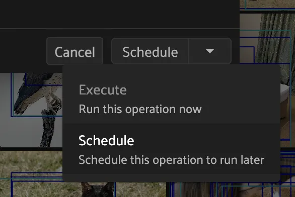

# Using Plugins [¶](\#using-plugins "Permalink to this headline")

Every plugin that you [download](#plugins-download) exposes one or more
[Panels](#using-panels) and/or [Operators](#using-operators) that you
can access from within the App.

Note

Check out the[index.md](index.md)
[FiftyOne plugins](https://github.com/voxel51/fiftyone-plugins)
repository for a growing collection of plugins that you can easily
[download](#plugins-download) and use locally.

Then, after you get comfortable using prebuilt plugins, try your hand at
[writing your own](developing_plugins.md#developing-plugins)!

## Downloading plugins [¶](\#downloading-plugins "Permalink to this headline")

To download and use a plugin, all you need is the plugin’s GitHub repository or
a link to a ZIP archive of the plugin’s source code.

You can download plugins using any of the methods described below:

Note

A GitHub repository may contain multiple plugins. By default, all plugins
that are found within the first three directory levels are installed, but
you can select specific ones if desired as shown above.

Note

All plugins are downloaded to your
[plugins directory](#plugins-directory).

Note

You can download plugins from private GitHub repositories that you have
access to by providing your GitHub personal access token via the
`GITHUB_TOKEN` environment variable.

## Your plugins directory [¶](\#your-plugins-directory "Permalink to this headline")

All plugins must be stored and are automatically
[downloaded to](#plugins-download) your plugins directory in order for
FiftyOne to find them.

By default, plugins are downloaded to `~/fiftyone/__plugins__`, but you can
customize this directory by setting the `FIFTYONE_PLUGINS_DIR` environment
variable:

```python
export FIFTYONE_PLUGINS_DIR=/path/to/your/plugins

```

You can also permanently configure this directory by adding it to your
[FiftyOne config](../fiftyone_concepts/config.md#configuring-fiftyone).

```python
{
    "plugins_dir": "/path/to/your/plugins"
}

```

You can locate your current plugins directory by running the following command:

```python
fiftyone config plugins_dir
# ~/fiftyone/__plugins__

```

Note

Your plugins directory must be readable by the FiftyOne server.

## Managing plugins [¶](\#managing-plugins "Permalink to this headline")

You can use the [fiftyone plugins](../cli/index.md#cli-fiftyone-plugins) and
[fiftyone operators](../cli/index.md#cli-fiftyone-operators) CLI methods to perform a
variety of plugin-related actions.

### Listing plugins [¶](\#listing-plugins "Permalink to this headline")

You can use the [fiftyone plugins list](../cli/index.md#cli-fiftyone-plugins-list)
command to list the plugins that you’ve downloaded or created locally:

```python
# List all locally available plugins
fiftyone plugins list

```

```python
# List enabled plugins
fiftyone plugins list --enabled

```

```python
# List disabled plugins
fiftyone plugins list --disabled

```

```python
plugin               version   enabled  directory
-------------------  -------  -------  ----------------------------------------------------------
@voxel51/annotation  1.0.0    ✓        ~/fiftyone/__plugins__/fiftyone-plugins/plugins/annotation
@voxel51/brain       1.0.0    ✓        ~/fiftyone/__plugins__/fiftyone-plugins/plugins/brain
@voxel51/evaluation  1.0.0    ✓        ~/fiftyone/__plugins__/fiftyone-plugins/plugins/evaluation
@voxel51/indexes     1.0.0    ✓        ~/fiftyone/__plugins__/fiftyone-plugins/plugins/indexes
@voxel51/io          1.0.0    ✓        ~/fiftyone/__plugins__/fiftyone-plugins/plugins/io
@voxel51/utils       1.0.0    ✓        ~/fiftyone/__plugins__/fiftyone-plugins/plugins/utils
@voxel51/voxelgpt    1.0.0    ✓        ~/fiftyone/__plugins__/voxelgpt
@voxel51/zoo         1.0.0    ✓        ~/fiftyone/__plugins__/fiftyone-plugins/plugins/zoo

```

### Listing operators [¶](\#listing-operators "Permalink to this headline")

You can use the [fiftyone operators list](../cli/index.md#cli-fiftyone-operators-list)
command to list the individual operators and panels within the plugins that
you’ve installed locally:

```python
# List all available operators and panels
fiftyone operators list

```

```python
# List enabled operators and panels
fiftyone operators list --enabled

```

```python
# List disabled operators and panels
fiftyone operators list --disabled

```

```python
# Only list panels
fiftyone operators list --panels-only

```

```python
uri                                          enabled   builtin   panel   unlisted
-------------------------------------------  --------  --------  ------  ---------
@voxel51/annotation/request_annotations      ✓
@voxel51/annotation/load_annotations         ✓
@voxel51/annotation/get_annotation_info      ✓
@voxel51/annotation/load_annotation_view     ✓
@voxel51/annotation/rename_annotation_run    ✓
@voxel51/annotation/delete_annotation_run    ✓
@voxel51/brain/compute_visualization         ✓
@voxel51/brain/compute_similarity            ✓
@voxel51/brain/compute_uniqueness            ✓
@voxel51/brain/compute_mistakenness          ✓
@voxel51/brain/compute_hardness              ✓
@voxel51/brain/get_brain_info                ✓
@voxel51/brain/load_brain_view               ✓
@voxel51/brain/rename_brain_run              ✓
@voxel51/brain/delete_brain_run              ✓
@voxel51/evaluation/evaluate_model           ✓
@voxel51/evaluation/get_evaluation_info      ✓
@voxel51/evaluation/load_evaluation_view     ✓
@voxel51/evaluation/rename_evaluation        ✓
@voxel51/evaluation/delete_evaluation        ✓
@voxel51/io/import_samples                   ✓
@voxel51/io/merge_samples                    ✓
@voxel51/io/merge_labels                     ✓
@voxel51/io/export_samples                   ✓
@voxel51/io/draw_labels                      ✓
@voxel51/operators/clone_selected_samples    ✓          ✓
@voxel51/operators/clone_sample_field        ✓          ✓
@voxel51/operators/rename_sample_field       ✓          ✓
@voxel51/operators/delete_selected_samples   ✓          ✓
@voxel51/operators/delete_sample_field       ✓          ✓
@voxel51/operators/print_stdout              ✓          ✓                 ✓
@voxel51/operators/list_files                ✓          ✓                 ✓
@voxel51/utils/create_dataset                ✓
@voxel51/utils/load_dataset                  ✓
@voxel51/utils/edit_dataset_info             ✓
@voxel51/utils/rename_dataset                ✓
@voxel51/utils/delete_dataset                ✓
@voxel51/utils/compute_metadata              ✓
@voxel51/utils/generate_thumbnails           ✓
@voxel51/utils/manage_plugins                ✓
@voxel51/zoo/load_zoo_dataset                ✓
@voxel51/zoo/apply_zoo_model                 ✓

```

### Downloading plugins [¶](\#id2 "Permalink to this headline")

You can use the
[fiftyone plugins download](../cli/index.md#cli-fiftyone-plugins-download) command to
list the plugins that you’ve downloaded or created locally:

```python
# Download plugins from a GitHub repository URL
fiftyone plugins download <github-repo-url>

```

```python
# Download plugins by specifying the GitHub repository details
fiftyone plugins download <user>/<repo>[/<ref>]

```

```python
# Download specific plugins from a URL with a custom search depth
fiftyone plugins download \
    <url> \
    --plugin-names <name1> <name2> <name3> \
    --max-depth 2  # search nested directories for plugins

```

### Getting plugin info [¶](\#getting-plugin-info "Permalink to this headline")

You can use the
[fiftyone plugins info](../cli/index.md#cli-fiftyone-plugins-info) command to view the
available metadata about a plugin:

```python
fiftyone plugins info @voxel51/annotation

```

```python
key                     value
----------------------  --------------------------------------------------------------------
name                    @voxel51/annotation
author
version                 1.0.0
url                     https://github.com/voxel51/fiftyone-plugins/.../annotation/README.md
license                 Apache 2.0
description             Utilities for integrating FiftyOne with annotation tools
fiftyone_compatibility  >=0.22
operators               request_annotations
                        load_annotations
                        get_annotation_info
                        load_annotation_view
                        rename_annotation_run
                        delete_annotation_run
js_bundle               dist/index.umd.js
py_entry                __init__.py
js_bundle_exists        False
js_bundle_server_path
has_py                  True
has_js                  False
server_path             /plugins/fiftyone-plugins/plugins/annotation
secrets                 FIFTYONE_CVAT_URL
                        FIFTYONE_CVAT_USERNAME
                        FIFTYONE_CVAT_PASSWORD
                        FIFTYONE_CVAT_EMAIL
                        FIFTYONE_LABELBOX_URL
                        FIFTYONE_LABELBOX_API_KEY
                        FIFTYONE_LABELSTUDIO_URL
                        FIFTYONE_LABELSTUDIO_API_KEY
directory               ~/fiftyone/__plugins__/fiftyone-plugins/plugins/annotation

```

### Getting operator info [¶](\#getting-operator-info "Permalink to this headline")

You can use the [fiftyone operators info](../cli/index.md#cli-fiftyone-operators-info) to
view the available metadata about an individual operator or panel within a
plugin:

```python
fiftyone operators info @voxel51/io/import_samples

```

```python
key                                  value
-----------------------------------  ----------------------
name                                 import_samples
label                                Import samples
description
execute_as_generator                 True
unlisted                             False
dynamic                              True
on_startup                           False
on_dataset_open                      False
disable_schema_validation            False
delegation_target
icon
dark_icon                            /assets/icon-dark.svg
light_icon                           /assets/icon-light.svg
allow_immediate_execution            True
allow_delegated_execution            False
default_choice_to_delegated          False
resolve_execution_options_on_change  True

```

### Installing plugin requirements [¶](\#installing-plugin-requirements "Permalink to this headline")

You can use the
[fiftyone plugins requirements](../cli/index.md#cli-fiftyone-plugins-requirements)
command to view, install, and ensure installation of a plugin’s requirements:

```python
# Print requirements for a plugin
fiftyone plugins requirements <name> --print

```

```python
# Install any requirements for the plugin
fiftyone plugins requirements <name> --install

```

```python
# Ensures that the requirements for the plugin are satisfied
fiftyone plugins requirements <name> --ensure

```

### Enabling and disabling plugins [¶](\#enabling-and-disabling-plugins "Permalink to this headline")

You can use the
[fiftyone plugins enable](../cli/index.md#cli-fiftyone-plugins-enable) and
[fiftyone plugins disable](../cli/index.md#cli-fiftyone-plugins-disable) commands to
enable and disable plugins that you’ve downloaded:

```python
# Enable a plugin
fiftyone plugins enable <name>

# Enable multiple plugins
fiftyone plugins enable <name1> <name2> ...

# Enable all plugins
fiftyone plugins enable --all

```

```python
# Disable a plugin
fiftyone plugins disable <name>

# Disable multiple plugins
fiftyone plugins disable <name1> <name2> ...

# Disable all plugins
fiftyone plugins disable --all

```

Note

Operators associated with disabled plugins will not appear in the App’s
[operator browser](#using-operators).

Plugin disablement is stored as an `enabled: false` entry in the plugin’s
[config settings](#plugins-configuration).

```python
fiftyone plugins disable @voxel51/zoo
fiftyone app config plugins

```

```python
{
    "map": {
        "mapboxAccessToken": "XXXXXXXX"
    },
    "@voxel51/zoo": {
        "enabled": false
    },
    ...
}

```

### Deleting plugins [¶](\#deleting-plugins "Permalink to this headline")

You can use the
[fiftyone plugins delete](../cli/index.md#cli-fiftyone-plugins-delete) command to delete
plugins from your local machine.

```python
# Delete a plugin from local disk
fiftyone plugins delete <name>

```

```python
# Delete multiple plugins from local disk
fiftyone plugins delete <name1> <name2> ...

```

```python
# Delete all plugins from local disk
fiftyone plugins delete --all

```

## Configuring plugins [¶](\#configuring-plugins "Permalink to this headline")

Certain plugins support configuration. For those plugins, you can store:

- System-wide plugin settings under the `plugins` key of your
[App config](../fiftyone_concepts/config.md#configuring-fiftyone-app)

- Dataset-specific plugin settings for any subset of the above values on a
[dataset’s App config](../fiftyone_concepts/using_datasets.md#dataset-app-config).


See the [configuring plugins](../fiftyone_concepts/config.md#configuring-plugins) page for more
information.

## Plugin secrets [¶](\#plugin-secrets "Permalink to this headline")

Some plugins may require sensitive information such as API tokens and login
credentials in order to function. Any secrets that a plugin requires are
documented under the `secrets` key of its `fiftyone.yml` file.

For example, the
[@voxel51/annotation](https://github.com/voxel51/fiftyone-plugins/blob/main/plugins/annotation/fiftyone.yml)
plugin declares the following secrets:

```python
secrets:
  - FIFTYONE_CVAT_URL
  - FIFTYONE_CVAT_USERNAME
  - FIFTYONE_CVAT_PASSWORD
  - FIFTYONE_CVAT_EMAIL
  - FIFTYONE_LABELBOX_URL
  - FIFTYONE_LABELBOX_API_KEY
  - FIFTYONE_LABELSTUDIO_URL
  - FIFTYONE_LABELSTUDIO_API_KEY

```

Note

You can use the [fiftyone plugins info](../cli/index.md#cli-fiftyone-plugins-info)
CLI command to print information about a plugin, including its required
secrets.

As the naming convention implies, any necessary secrets are provided by setting
environment variables with the appropriate names. For example, if you want to
use the CVAT backend with the
[@voxel51/annotation](https://github.com/voxel51/fiftyone-plugins/blob/main/plugins/annotation/fiftyone.yml)
plugin, you would set:

```python
FIFTYONE_CVAT_URL=...
FIFTYONE_CVAT_USERNAME=...
FIFTYONE_CVAT_PASSWORD=...
FIFTYONE_CVAT_EMAIL=...

```

At runtime, the plugin’s execution context will automatically be hydrated with
any available secrets that are declared by the plugin. Operators access these
secrets via the `ctx.secrets` dict:

```python
def execute(self, ctx):
    url = ctx.secrets["FIFTYONE_CVAT_URL"]
    username = ctx.secrets["FIFTYONE_CVAT_USERNAME"]
    password = ctx.secrets["FIFTYONE_CVAT_PASSWORD"]
    email = ctx.secrets["FIFTYONE_CVAT_EMAIL"]

```

## Using panels [¶](\#using-panels "Permalink to this headline")

Panels are miniature full-featured data applications that you can open in
[App Spaces](../fiftyone_concepts/app.md#app-spaces) and interactively manipulate to explore your
dataset and update/respond to updates from other spaces that are currently open
in the App.

FiftyOne natively includes the following Panels:

- [Samples panel](../fiftyone_concepts/app.md#app-samples-panel): the media grid that loads by
default when you launch the App

- [Histograms panel](../fiftyone_concepts/app.md#app-histograms-panel): a dashboard of histograms
for the fields of your dataset

- [Embeddings panel](../fiftyone_concepts/app.md#app-embeddings-panel): a canvas for working with
[embeddings visualizations](../fiftyone_concepts/brain.md#brain-embeddings-visualization)

- [Map panel](../fiftyone_concepts/app.md#app-map-panel): visualizes the geolocation data of
datasets that have a [`GeoLocation`](../api/fiftyone.core.labels.html#fiftyone.core.labels.GeoLocation "fiftyone.core.labels.GeoLocation") field


Any plugins that you’ve installed may expose additional panels too.

Click the `+` icon next to the “Samples” tab to open a new panel:


Note

Did you know? You can also programmatically configure spaces
[in Python](../fiftyone_concepts/app.md#app-spaces-python).

## Using operators [¶](\#using-operators "Permalink to this headline")

Operators are a powerful feature in FiftyOne that allow plugin developers to
define custom operations that can be executed from within the App.

Some operators may expose themselves as custom buttons, icons, or menu items
throughout the App. However, the Operator Browser allows users to search
through all available (enabled) operators.

You can open the Operator Browser by clicking on the Operator Browser icon
above the sample grid or by typing backtick ( `` ` ``):


Operators provide dynamic input forms that collect the necessary user inputs.
The actual operation is then performed by pressing the `Execute`/ `Schedule`
button at the bottom of the form.

Some Operators perform an immediate action when executed, while other Operators
[delegate](#delegated-operations) their execution to another process.

## Executing operators via SDK [¶](\#executing-operators-via-sdk "Permalink to this headline")

Many operators are intended to be executed programmatically via the SDK rather
than (or in addition to) executing them by filling out their input form in the
App.

### Calling operators [¶](\#calling-operators "Permalink to this headline")

By convention, operators that are intended to be executed programmatically
should implement `__call__()` so that users have a well-documented interface
for invoking the operator as a function.

For example, the
[@voxel51/utils/compute\_metadata](https://github.com/voxel51/fiftyone-plugins/tree/main/plugins/utils)
operator can be invoked like so:

```python
import fiftyone as fo
import fiftyone.operators as foo
import fiftyone.zoo as foz

dataset = foz.load_zoo_dataset("quickstart")
compute_metadata = foo.get_operator("@voxel51/utils/compute_metadata")

# (Re)compute the dataset's metadata
compute_metadata(dataset, overwrite=True)

```

Note

Notice that `get_operator()` is
used to retrieve the operator by its URI.

Behind the scenes, the operator’s `__call__()` method is implemented as
follows:

```python
class ComputeMetadata(foo.Operator):
    def __call__(
        self,
        sample_collection,
        overwrite=False,
        num_workers=None,
    ):
        ctx = dict(view=sample_collection.view())
        params = dict(
            overwrite=overwrite,
            num_workers=num_workers,
        )
        return foo.execute_operator(self.uri, ctx, params=params)

```

which simply packages up the provided keyword arguments into the correct format
for the operator’s `ctx.params` and then passes them to
`execute_operator()`, which
performs the execution.

For operators whose
[`execute()`](../api/fiftyone.operators.operator.html#fiftyone.operators.operator.Operator.execute "fiftyone.operators.operator.Operator.execute") method returns
data, you can access it via the `result` property of the returned
`ExecutionResult` object:

```python
op = foo.get_operator("@an-operator/with-results")

result = op(...)
print(result.result) # {...}

```

Note

When working in notebook contexts, executing operators returns an
`asyncio.Task` that you can `await` to retrieve the
`ExecutionResult`:

```python
op = foo.get_operator("@an-operator/with-results")

result = await op(...)
print(result.result) # {...}

```

#### Requesting delegation [¶](\#requesting-delegation "Permalink to this headline")

Operators that support [delegated execution](#delegated-operations) can
support this via the `__call__()` syntax by passing the
`request_delegation=True` flag to
`execute_operator()`.

In fact, the
[@voxel51/utils/compute\_metadata](https://github.com/voxel51/fiftyone-plugins/tree/main/plugins/utils)
operator does just that:

```python
class ComputeMetadata(foo.Operator):
    return foo.OperatorConfig(
        ...
        allow_immediate_execution=True,
        allow_delegated_execution=True,
    )

    def __call__(
        self,
        sample_collection,
        overwrite=False,
        num_workers=None,
        delegate=False,
    ):
        ctx = dict(view=sample_collection.view())
        params = dict(
            overwrite=overwrite,
            num_workers=num_workers,
        )
        return foo.execute_operator(
            self.uri,
            ctx,
            params=params,
            request_delegation=delegate,
        )

```

which means that it can be invoked like so:

```python
compute_metadata = foo.get_operator("@voxel51/utils/compute_metadata")

# Schedule a delegated operation to (re)compute metadata
compute_metadata(dataset, overwrite=True, delegate=True)

```

### Direct execution [¶](\#direct-execution "Permalink to this headline")

You can programmatically execute any operator by directly calling
`execute_operator()`:

```python
import fiftyone as fo
import fiftyone.operators as foo
import fiftyone.zoo as foz

dataset = foz.load_zoo_dataset("quickstart")

ctx = {
    "view": dataset.take(10),
    "params": dict(
        export_type="LABELS_ONLY",
        dataset_type="COCO",
        labels_path=dict(absolute_path="/tmp/coco/labels.json"),
        label_field="ground_truth",
    )
}

foo.execute_operator("@voxel51/io/export_samples", ctx)

```

Note

In general, to use
`execute_operator()` you must
inspect the operator’s
[`execute()`](../api/fiftyone.operators.operator.html#fiftyone.operators.operator.Operator.execute "fiftyone.operators.operator.Operator.execute")
implementation to understand what parameters are required.

For operators whose
[`execute()`](../api/fiftyone.operators.operator.html#fiftyone.operators.operator.Operator.execute "fiftyone.operators.operator.Operator.execute") method returns
data, you can access it via the `result` property of the returned
`ExecutionResult` object:

```python
result = foo.execute_operator("@an-operator/with-results", ctx)
print(result.result)  # {...}

```

Note

When working in notebook contexts, executing operators returns an
`asyncio.Task` that you can `await` to retrieve the
`ExecutionResult`:

```python
result = await foo.execute_operator("@an-operator/with-results", ctx)
print(result.result)  # {...}

```

#### Requesting delegation [¶](\#id8 "Permalink to this headline")

If an operation supports both immediate and
[delegated execution](#delegated-operations) as specified by its
[execution options](developing_plugins.md#operator-execution-options), you can request
delegated execution by passing the `request_delegation=True` flag to
`execute_operator()`:

```python
foo.execute_operator(operator_uri, ctx=ctx, request_delegation=True)

```

This has the same effect as choosing `Schedule` from the dropdown in the
operator’s input modal when executing it from within the App:



Note

[FiftyOne Teams](../teams/index.md#fiftyone-teams) users can also specify an optional
delegation target for their delegated operations:

```python
foo.execute_operator(
    operator_uri,
    ctx=ctx,
    request_delegation=True,
    delegation_target="overnight",
)

```

### Delegating function calls [¶](\#delegating-function-calls "Permalink to this headline")

The
[@voxel51/utils/delegate](https://github.com/voxel51/fiftyone-plugins/tree/main/plugins/utils)
operator provides a general purpose utility for
[delegating execution](#delegated-operations) of an arbitrary function
call that can be expressed in any of the following forms:

- Execute an arbitrary function: `fcn(*args, **kwargs)`

- Apply a function to a dataset or view:
`fcn(dataset_or_view, *args, **kwargs)`

- Call an instance method of a dataset or view:
`dataset_or_view.fcn(*args, **kwargs)`


Here’s some examples of delegating common tasks that can be expressed in the
above forms:

```python
import fiftyone as fo
import fiftyone.operators as foo
import fiftyone.zoo as foz

dataset = foz.load_zoo_dataset("quickstart")
delegate = foo.get_operator("@voxel51/utils/delegate")

# Compute metadata
delegate("compute_metadata", dataset=dataset)

# Compute visualization
delegate(
    "fiftyone.brain.compute_visualization",
    dataset=dataset,
    brain_key="img_viz",
)

# Export a view
delegate(
    "export",
    view=dataset.to_patches("ground_truth"),
    export_dir="/tmp/patches",
    dataset_type="fiftyone.types.ImageClassificationDirectoryTree",
    label_field="ground_truth",
)

# Load the exported patches into a new dataset
delegate(
    "fiftyone.Dataset.from_dir",
    dataset_dir="/tmp/patches",
    dataset_type="fiftyone.types.ImageClassificationDirectoryTree",
    label_field="ground_truth",
    name="patches",
    persistent=True,
)

```

## Delegated operations [¶](\#delegated-operations "Permalink to this headline")

Delegated operations are a powerful feature of FiftyOne’s plugin framework that
allows you to schedule potentially long-running tasks from within the App that
are executed in the background while you continue to work.

Note

[FiftyOne Teams](../teams/teams_plugins.md#teams-delegated-operations) deployments come out of
the box with a connected compute cluster for executing delegated operations
at scale.

In FiftyOne Open Source, you can use delegated operations at small scale
by [running them locally](#delegated-orchestrator-open-source).

For example, have model predictions on your dataset that you want to evaluate?
The [@voxel51/evaluation](https://github.com/voxel51/fiftyone-plugins/blob/main/plugins/evaluation/README.md)
plugin makes it easy:


Need to compute embedding for your dataset so you can visualize them in the
[Embeddings panel](../fiftyone_concepts/app.md#app-embeddings-panel)? Kick off the task with the
[@voxel51/brain](https://github.com/voxel51/fiftyone-plugins/blob/main/plugins/brain/README.md)
plugin and proceed with other work while the execution happens in the background:


Why is this awesome? Your AI stack needs a flexible data-centric component that
enables you to organize and compute on your data. With delegated operations,
FiftyOne becomes both a dataset management/visualization tool and a workflow
automation tool that defines how your data-centric workflows like ingestion,
curation, and evaluation are performed.

Note

Want to run delegated operations at scale?
[Contact us](https://voxel51.com/get-fiftyone-teams) about
[FiftyOne Teams](../teams/index.md#fiftyone-teams), an open source-compatible
enterprise deployment of FiftyOne with multiuser collaboration features,
native cloud dataset support, and much more!

Think of FiftyOne Teams as the single source of truth on which you
co-develop your data and models together 📈

## Setting up an orchestrator [¶](\#setting-up-an-orchestrator "Permalink to this headline")

### FiftyOne Open Source [¶](\#fiftyone-open-source "Permalink to this headline")

FiftyOne Open Source users can run delegated operations via the
[fiftyone delegated launch](../cli/index.md#cli-fiftyone-delegated-launch) CLI command:

```python
fiftyone delegated launch

```

This command starts a service that will continuously check for any queued
delegated operations and execute them serially in its process.

You must also ensure that the
[allow\_legacy\_orchestrators](../fiftyone_concepts/config.md#configuring-fiftyone) config flag is set
in the environment where you run the App/SDK, e.g. by setting:

```python
export FIFTYONE_ALLOW_LEGACY_ORCHESTRATORS=true

```

### FiftyOne Teams [¶](\#fiftyone-teams "Permalink to this headline")

[FiftyOne Teams](../teams/teams_plugins.md#teams-delegated-operations) deployments come out of the
box with a connected compute cluster for executing delegated operations at
scale.

This powerful feature allows users to install/build plugins that execute
potentially long-running tasks in the background while users continue with
other work in the App.

Note

Want to take advantage of this functionality?
[Contact us](https://voxel51.com/get-fiftyone-teams) about
[FiftyOne Teams](../teams/index.md#fiftyone-teams), an open source-compatible
enterprise deployment of FiftyOne with multiuser collaboration features,
native cloud dataset support, and much more!

Think of FiftyOne Teams as the single source of truth on which you
co-develop your data and models together 📈

## Managing delegated operations [¶](\#managing-delegated-operations "Permalink to this headline")

The [fiftyone delegated](../cli/index.md#cli-fiftyone-delegated) CLI command contains a
number of useful utilities for viewing the status of your delegated operations.

### Listing delegated operations [¶](\#listing-delegated-operations "Permalink to this headline")

You can use the [fiftyone delegated list](../cli/index.md#cli-fiftyone-delegated-list)
command to list the delegated operations that you’ve run:

```python
# List all delegated operations
fiftyone delegated list

```

```python
# List some specific delegated operations
fiftyone delegated list \
    --dataset quickstart \
    --operator @voxel51/io/export_samples \
    --state COMPLETED \
    --sort-by COMPLETED_AT \
    --limit 10

```

### Getting delegated operation info [¶](\#getting-delegated-operation-info "Permalink to this headline")

You can use the
[fiftyone delegated info](../cli/index.md#cli-fiftyone-delegated-info) command to view
the available metadata about a delegated operation, including its inputs,
execution status, and error stack trace, if applicable.

```python
# Print information about a delegated operation
fiftyone delegated info <id>

```

### Cleaning up delegated operations [¶](\#cleaning-up-delegated-operations "Permalink to this headline")

You can use the
[fiftyone delegated cleanup](../cli/index.md#cli-fiftyone-delegated-cleanup) command to
cleanup delegated operations:

```python
# Delete all failed operations associated with a given dataset
fiftyone delegated cleanup --dataset quickstart --state FAILED

```

```python
# Delete all delegated operations associated with non-existent datasets
fiftyone delegated cleanup --orphan

```

```python
# Print information about operations rather than actually deleting them
fiftyone delegated cleanup --orphan --dry-run

```

