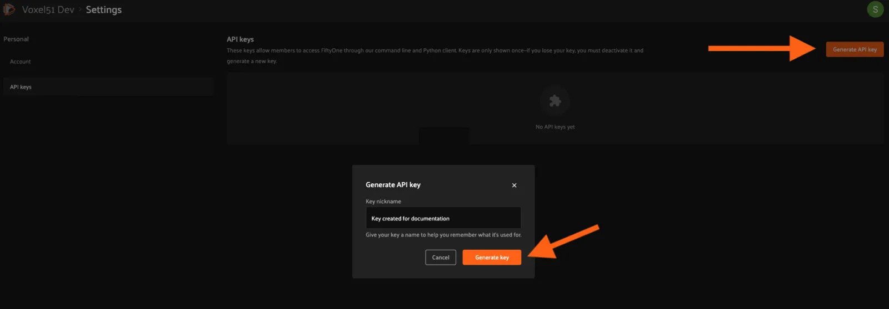
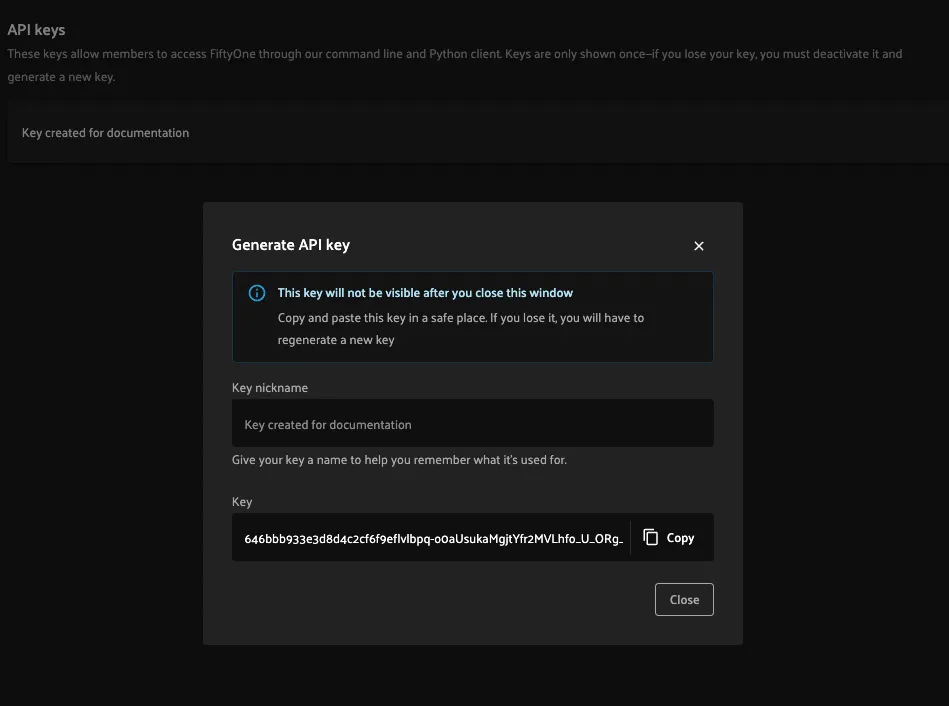
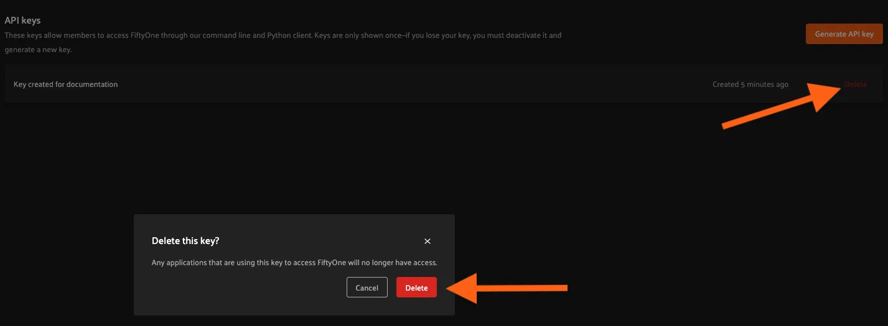

# API Connection [¶](\#api-connection "Permalink to this headline")

This page describes how to create API keys and configure your
[SDK installation](installation.md#teams-python-sdk) to connect to your Teams
deployment’s API.

All actions taken via API connections are authenticated based on the user
associated with the API key, which means that concepts like user roles and
dataset permissions _are enforced_.

Note

**API connections are currently in beta.** The recommended stable solution
is to use your Teams deployment’s
[MongoDB connection](../fiftyone_concepts/config.md#configuring-mongodb-connection).

## Configuring an API connection [¶](\#configuring-an-api-connection "Permalink to this headline")

You can configure an API connection by adding an API URI and API key to your
FiftyOne config as described below:

| Config field | Environment variable | Description |
| --- | --- | --- |
| `api_uri` | `FIFTYONE_API_URI` | The URI of your FiftyOne Teams API. Ask your deployment admin for this value. |
| `api_key` | `FIFTYONE_API_KEY` | Your FiftyOne Teams API key. [See here](#teams-generate-api-key) to generate one. |

For example, you can set environment variables:

```python
export FIFTYONE_API_URI==XXXXXXXX
export FIFTYONE_API_KEY==YYYYYYYY

```

See
[this page](../fiftyone_concepts/config.md#configuring-fiftyone) for more information about using your
FiftyOne config.

## Generating an API key [¶](\#generating-an-api-key "Permalink to this headline")

Users can generate and manage API keys via the UI or the
[Management SDK](management_sdk.md#teams-management-sdk).

Note

Guests cannot create or use API keys.

### Generating keys via the UI [¶](\#generating-keys-via-the-ui "Permalink to this headline")

You can access API key management features by clicking on your account icon in
the upper-right of the FiftyOne Teams App and navigating to the
“Settings > API keys” page.

A new key can be generated by clicking on “Generate API key” and optionally
providing a nickname for the key to identify what it is used for. Click
“Generate key” to complete the process.



Finally, copy the key and configure it locally using one of the options
[described here](#teams-api-connection).



Warning

Keys are only shown once. Copy the key immediately, as it will not be
accessible again. API keys provide full programmatic access to perform
actions as a user, so secure them as you would a password!

### Generating keys programmatically [¶](\#generating-keys-programmatically "Permalink to this headline")

You can also use
`generate_api_key()` to
generate API keys programmatically.

Note

Admins can generate API keys for other users, if desired.

## Deleting an API key [¶](\#deleting-an-api-key "Permalink to this headline")

To delete a key and remove its access, find the key to delete in the list and
click “Delete”.



You can also programmatically delete API keys via
`delete_api_key()`.

Note

Admins can delete API keys for other users, if desired.

