# Data Lens [¶](\#data-lens "Permalink to this headline")

**Available in FiftyOne Teams v2.2+**

Data Lens is a feature built into the [FiftyOne Teams App](teams_app.md#teams-app)
which allows you to use FiftyOne to explore and import samples from external
data sources.

Whether your data resides in a database like PostgreSQL or a data lake like
[Databricks](#data-lens-databricks) or
[BigQuery](#data-lens-bigquery), Data Lens provides a way to search your
data sources, visualize sample data, and import into FiftyOne for further
analysis.

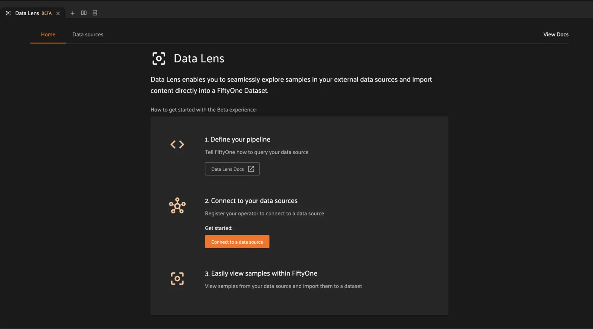

## How it works [¶](\#how-it-works "Permalink to this headline")

1. **Define your search experience**

Tailor the interactions with your data source to exactly what you need.
Data Lens provides a flexible framework which allows for extensive
customization, allowing you to hone in on the questions that are most
critical to your workflow. See
[Integrating with Data Lens](#data-lens-integration) to learn more.

2. **Connect your data source**

Provide configuration to Data Lens to connect to your data source. Once
connected, you can start searching for samples directly from FiftyOne.
See [Connecting a data source](#data-lens-connecting-a-data-source)
to learn more.

3. **Interact with your data**

View your samples using Data Lens’ rich preview capabilities. Refine your
search criteria to find samples of interest, then import your samples
into a FiftyOne dataset for further analysis. See
[Exploring samples](#data-lens-querying-data) to learn more.


### Connecting a data source [¶](\#connecting-a-data-source "Permalink to this headline")

A data source represents anywhere that you store your data outside of FiftyOne.
This could be a local SQL database, a hosted data lake, or an internal data
platform. To connect to your data source, you’ll first implement a simple
operator which FiftyOne can use to communicate with your data source.

Once your operator is defined, you can navigate to the “Data sources” tab by
clicking on the tab header or by clicking on “Connect to a data source” from
the “Home” tab.

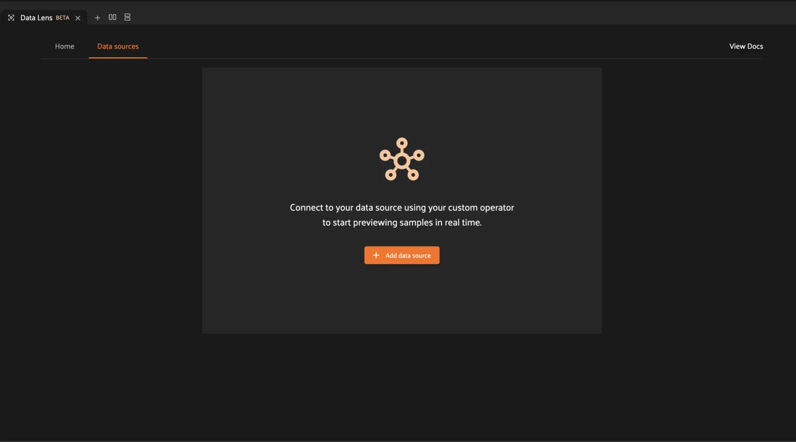

Add a new data source by clicking on “Add data source”.

Enter a useful name for your data source and provide the URI for your operator.
The URI should have the format `<your-plugin-name>/<your-operator-name>`.

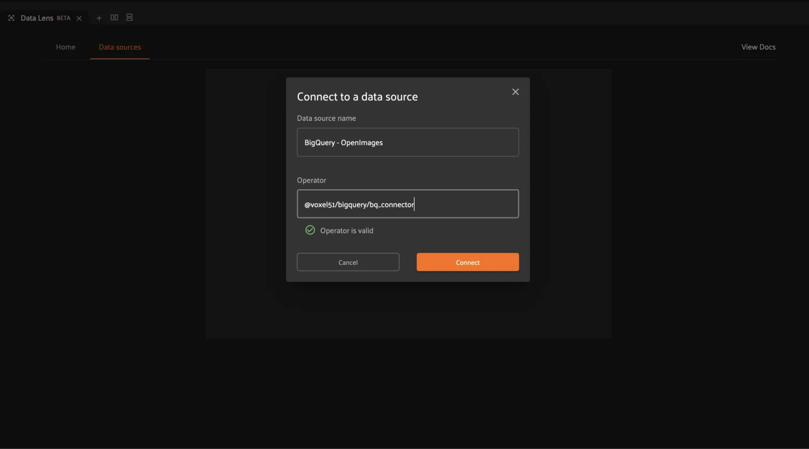

Click “Connect” once you’re finished to save your configuration.

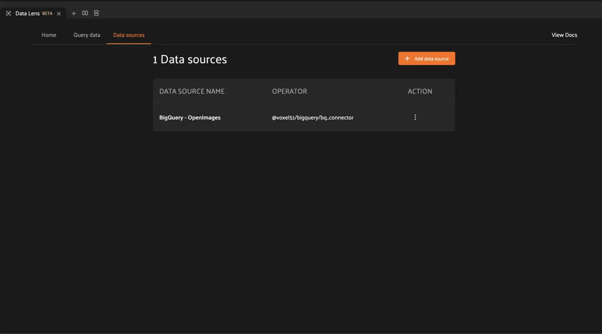

If you need to update your Data Lens configuration, simply click the action
menu icon and select “Edit”. Similarly, you can delete a Data Lens
configuration by clicking the action menu icon and selecting “Delete”.

That’s it. Now you’re ready to explore your data source. You can head over to
the “Query data” tab and start interacting with your data.

Note

Don’t have a Data Lens operator yet? When you’re ready to get started, you
can follow our detailed [integration guide](#data-lens-integration).

### Exploring samples [¶](\#exploring-samples "Permalink to this headline")

Once you’ve connected to a data source, you can open the “Query data” tab to
start working with your data.

In this tab, you can select from your connected data sources using the
“Select a data source” dropdown.

Below this dropdown, you can parameterize your search using the available
query parameters. These parameters are unique to each connected data source,
allowing you to tailor your search experience to exactly what you need.
Selecting a new data source will automatically update the query parameters to
match those expected by your data source.

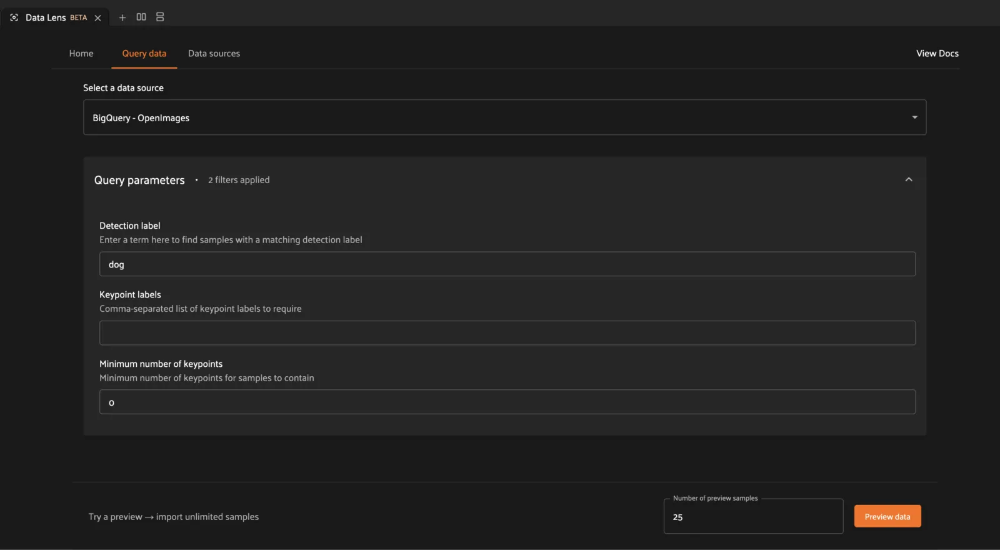

After you enter your query parameters, you can click the “Preview data” button
at the bottom of the page to fetch samples which match your query parameters.
These samples will be displayed in the preview panel, along with any features
associated with the sample like labels or bounding boxes.

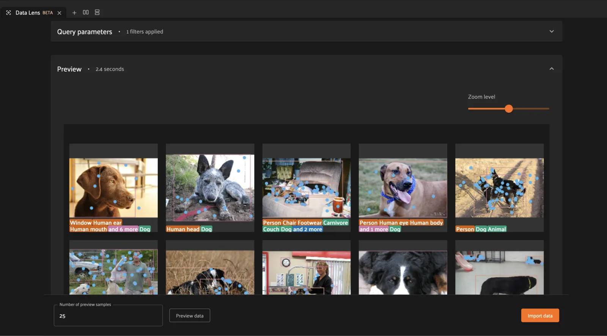

You can use the zoom slider to control the size of the samples, and you can
modify the number of preview samples shown by changing the “Number of preview
samples” input value and clicking “Preview data” again.

If you want to change your search, simply reopen the query parameters panel
and modify your inputs. Clicking “Preview data” will fetch new samples matching
the current query parameters.

If you want to import your samples into FiftyOne for further analysis, you can
import your samples to a dataset.

### Importing samples to FiftyOne [¶](\#importing-samples-to-fiftyone "Permalink to this headline")

After generating a preview in Data Lens, you can click on the “Import data”
button to open the import dialog.

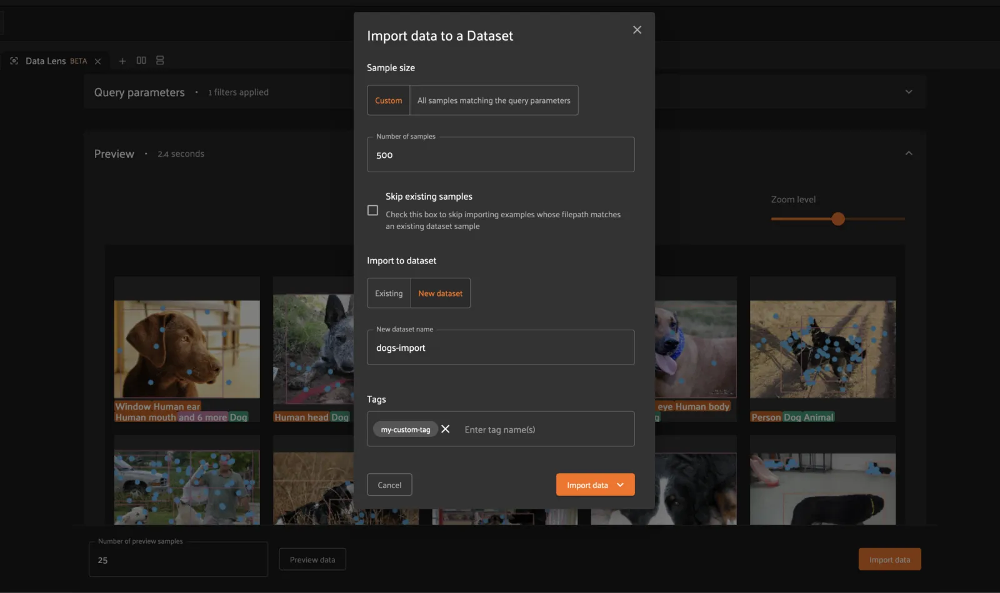

Imports can be limited to a specific number of samples, or you can import all
samples matching your query parameters.

The “Skip existing samples” checkbox allows you to configure the behavior for
merging samples into a dataset. If checked, samples with a `filepath` which is
already present in the dataset will be skipped. If left unchecked, all samples
will be added to the dataset.

Note

If you elect to skip existing samples, this will also deduplicate samples
within the data being imported.

After configuring the size/behavior of your import, select a destination
dataset for the samples. This can be an existing dataset, or you can choose to
create a new dataset.

You can optionally specify tags to append to the `tags` field of each imported
sample.

When you click import, you will have the option to either execute immediately
or to schedule this import for asynchronous execution.


If you are importing a small number of samples, then immediate execution may
be appropriate. However, for most cases it is recommended to schedule the
import, as this will result in more consistent and performant execution.

Note

Scheduled imports use the
[delegated operations](teams_plugins.md#teams-delegated-operations) framework to
execute asynchronously on your connected compute cluster!

After selecting your execution preference, you will be able to monitor the
status of your import through the information provided by the import panel.

In the case of immediate execution, you will be presented with an option to
view your samples once the import is complete. Clicking on this button will
open your destination dataset containing your imported samples.


In the case of scheduled execution, you will be presented with an option to
visit the [Runs page](teams_plugins.md#teams-runs-page).


From the Runs page, you can track the status of your import.


Once your samples are imported, you will be able to leverage the full
capabilities of FiftyOne to analyze and curate your data, and you can continue
to use Data Lens to augment your datasets.

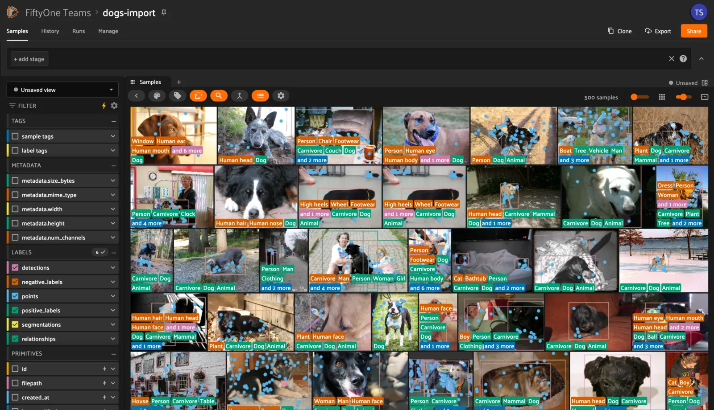

## Integrating with Data Lens [¶](\#integrating-with-data-lens "Permalink to this headline")

Data Lens makes use of FiftyOne’s powerful
[plugins framework](../plugins/index.md#fiftyone-plugins) to allow you to tailor your
experience to meet the needs of your data. As part of the plugin framework,
you are able to create custom [operators](../plugins/developing_plugins.md#plugins-design-operators),
which are self-contained Python classes that provide custom functionality to
FiftyOne.

Data Lens defines an operator interface which makes it easy to connect to your
data sources. We’ll walk through an example of creating your first Data Lens
operator.

### Setting up your operator [¶](\#setting-up-your-operator "Permalink to this headline")

To assist with Data Lens integration, we can use the
`DataLensOperator`
base class provided with the Teams SDK. This base class handles the
implementation for the operator’s `execute()` method, and defines a single
abstract method that we’ll implement.

```python
# my_plugin/__init__.py
from typing import Generator

import fiftyone.operators as foo
from fiftyone.operators.data_lens import (
    DataLensOperator,
    DataLensSearchRequest,
    DataLensSearchResponse
)

class MyCustomDataLensOperator(DataLensOperator):
    """Custom operator which integrates with Data Lens."""

    @property
    def config(self) -> foo.OperatorConfig:
        return foo.OperatorConfig(
            name="my_custom_data_lens_operator",
            label="My custom Data Lens operator",
            unlisted=True,
            execute_as_generator=True,
        )

    def handle_lens_search_request(
        self,
        request: DataLensSearchRequest,
        ctx: foo.ExecutionContext
    ) -> Generator[DataLensSearchResponse, None, None]
        # We'll implement our logic here
        pass

```

Let’s take a look at what we have so far.

```python
class MyCustomDataLensOperator(DataLensOperator):

```

Our operator extends the
`DataLensOperator`
provided by the Teams SDK. This base class defines the abstract
`handle_lens_search_request()`
method, which we will need to implement.

```python
@property
def config(self) -> foo.OperatorConfig:
    return foo.OperatorConfig(
        # This is the name of your operator. FiftyOne will canonically
        # refer to your operator as <your-plugin>/<your-operator>.
        name="my_custom_data_lens_operator",

        # This is a human-friendly label for your operator.
        label="My custom Data Lens operator",

        # Setting unlisted to True prevents your operator from appearing
        # in lists of general-purpose operators, as this operator is not
        # intended to be directly executed.
        unlisted=True,

        # For compatibility with the DataLensOperator base class, we
        # instruct FiftyOne to execute our operator as a generator.
        execute_as_generator=True,
    )

```

The [`config`](../api/fiftyone.operators.operator.html#fiftyone.operators.operator.Operator.config "fiftyone.operators.operator.Operator.config") property
is part of the standard [operator interface](../plugins/developing_plugins.md#operator-interface) and
provides configuration options for your operator.

```python
def handle_lens_search_request(
    self,
    request: DataLensSearchRequest,
    ctx: foo.ExecutionContext
) -> Generator[DataLensSearchResponse, None, None]
    pass

```

The
`handle_lens_search_request()`
method provides us with two arguments: a
`DataLensSearchRequest`
instance, and the current operator execution context.

The
`DataLensSearchRequest`
is generated by the Data Lens framework and provides information about the
Data Lens user’s query. The request object has
the following properties:

- `request.search_params`: a dict containing the search parameters provided
by the Data Lens user.

- `request.batch_size`: a number indicating the maximum number of samples to
return in a single batch.

- `request.max_results`: a number indicating the maximum number of
samples to return across all batches.


Note

The Data Lens framework will automatically truncate responses to adhere
to `request.max_results`. Any sample data beyond this limit will be
discarded.

The `ctx` argument provides access to a
[range of useful capabilities](../plugins/developing_plugins.md#operator-execution-context) which you can
leverage in your operator, including things like
[providing secrets to your operator](secrets.md#teams-secrets).

Using these inputs, we are expected to return a generator which yields
`DataLensSearchResponse`
objects. To start, we’ll create some synthetic data to better understand the
interaction between Data Lens and our operator. We’ll look at a
[more realistic example](#data-lens-databricks) later on.

Note

Why a generator? Generators provide a convenient approach for long-lived,
lazy-fetching connections that are common in databases and data lakes.
While Data Lens does support operators which do not execute as generators,
we recommend using a generator for ease of integration.

### Generating search responses [¶](\#generating-search-responses "Permalink to this headline")

To adhere to the Data Lens interface, we need to yield
`DataLensSearchResponse`
objects from our operator. A
`DataLensSearchResponse`
is comprised of the following fields:

- `response.result_count`: a number indicating the number of samples being
returned in this response.

- `response.query_result`: a list of dicts containing serialized
[`Sample`](../api/fiftyone.core.sample.html#fiftyone.core.sample.Sample "fiftyone.core.sample.Sample") data, e.g. obtained via
[`to_dict()`](../api/fiftyone.core.sample.html#fiftyone.core.sample.Sample.to_dict "fiftyone.core.sample.Sample.to_dict").


Note

Data Lens expects sample data to adhere to the
[`Sample`](../api/fiftyone.core.sample.html#fiftyone.core.sample.Sample "fiftyone.core.sample.Sample") format, which is easy to
achieve by using the FiftyOne SDK to create your sample data, as shown
below.

To see how Data Lens works, let’s yield a response with a single synthetic
sample.

```python
def handle_lens_search_request(
    self,
    request: DataLensSearchRequest,
    ctx: foo.ExecutionContext
) -> Generator[DataLensSearchResponse, None, None]
    # We'll use a placeholder image for our synthetic data
    image_url = "https://placehold.co/150x150"

    # Create a sample using the SDK
    synthetic_sample = fo.Sample(filepath=image_url)

    # Convert our samples to dicts
    samples = [synthetic_sample.to_dict()]

    # We'll ignore any inputs for now and yield a single response
    yield DataLensSearchResponse(
        result_count=len(samples),
        query_result=samples
    )

```

Let’s see what this looks like in Data Lens.

After adding the operator as a data source, we can navigate to the “Query data”
tab to interact with the operator. When we click the preview button, the Data
Lens framework invokes our operator to retrieve sample data. Our operator
yields a single sample, and we see that sample shown in the preview.


Let’s modify our operator to incorporate the `request.batch_size` property.

```python
def handle_lens_search_request(
    self,
    request: DataLensSearchRequest,
    ctx: foo.ExecutionContext
) -> Generator[DataLensSearchResponse, None, None]
    samples = []

    # Generate number of samples equal to request.batch_size
    for i in range(request.batch_size):
        samples.append(
            fo.Sample(
                # We'll modify our synthetic data to include the
                # sample's index as the image text.
                filepath=f"https://placehold.co/150x150?text={i + 1}"
            ).to_dict()
        )

    # Still yielding a single response
    yield DataLensSearchResponse(
        result_count=len(samples),
        query_result=samples
    )

```

Now if we re-run our preview, we see that we get a number of samples equal to
the “Number of preview samples” input.

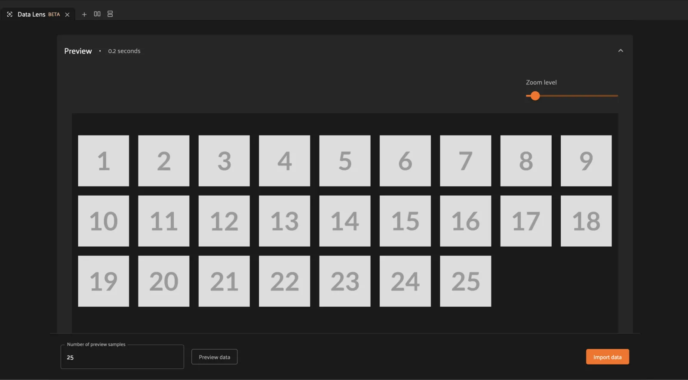

If we modify that number and regenerate the preview, we can see that the number
of samples remains in sync. For preview functionality, Data Lens fetches
sample data in a single batch, so we can expect these values to be the same.

### Working with user-provided data [¶](\#working-with-user-provided-data "Permalink to this headline")

Let’s now look at how Data Lens users are able to interact with our operator.
Data Lens is designed to enable users to quickly explore samples of interest,
and a key component is providing users a way to control the behavior of our
operator.

To achieve this, we simply need to define the possible inputs to our operator
in the
[`resolve_input()`](../api/fiftyone.operators.operator.html#fiftyone.operators.operator.Operator.resolve_input "fiftyone.operators.operator.Operator.resolve_input")
method.

```python
def resolve_input(self):
    # We define our inputs as an object.
    # We'll add specific fields to this object which represent a single input.
    inputs = types.Object()

    # Add a string field named "sample_text"
    inputs.str("sample_text", label="Sample text", description="Text to render in samples")

    return types.Property(inputs)

```

Note

For more information on operator inputs, see
[the plugin documentation](../plugins/developing_plugins.md#operator-inputs).

With this method implemented, Data Lens will construct a form allowing users
to define any or all of these inputs.

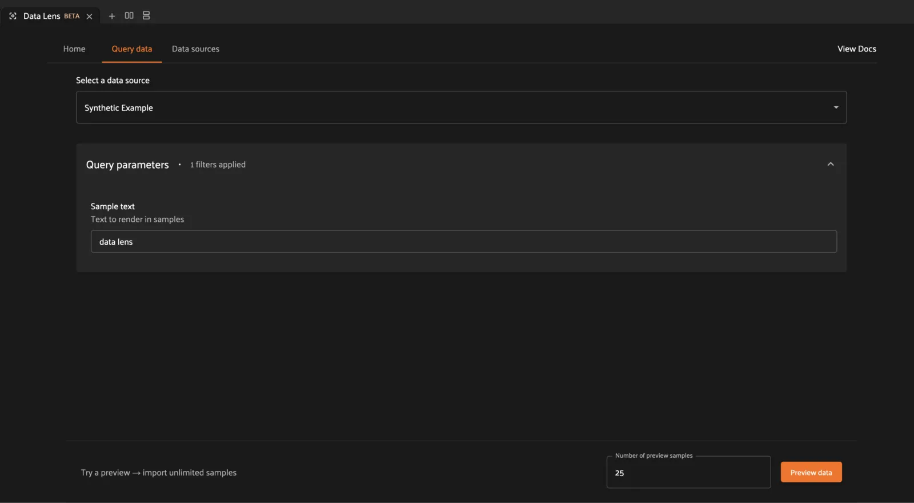

We can then use this data to change the behavior of our operator. Let’s add
logic to integrate `sample_text` into our operator.

```python
def handle_lens_search_request(
    self,
    request: DataLensSearchRequest,
    ctx: foo.ExecutionContext
) -> Generator[DataLensSearchResponse, None, None]
    # Retrieve our "sample_text" input from request.search_params.
    # These parameter names should match those used in resolve_input().
    sample_text = request.search_params.get("sample_text", "")

    samples = []

    # Create a sample for each character in our input text
    for char in sample_text:
        samples.append(
            fo.Sample(
                filepath=f"https://placehold.co/150x150?text={char}"
            ).to_dict()
        )

        # Yield batches when we have enough samples
        if len(samples) == request.batch_size:
            yield DataLensSearchResponse(
                result_count=len(samples),
                query_result=samples
            )

            # Reset our batch
            samples = []

    # We've generated all our samples, but might be in the middle of a batch
    if len(samples) > 0:
        yield DataLensSearchResponse(
            result_count=len(samples),
            query_result=samples
        )

    # Now we're done :)

```

Now when we run our preview, we can see that the text we provide as input is
reflected in the samples returned by our operator. Modifying the text and
regenerating the preview yields the expected result.

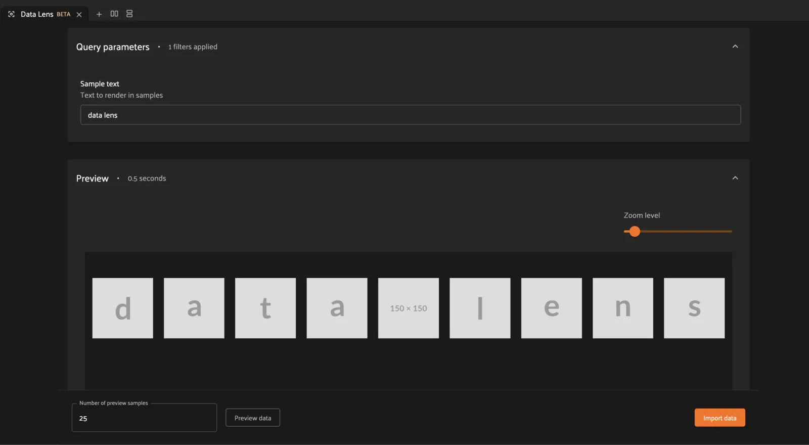

There are a couple things to note about the changes we made here.

- Inputs can be specified with `required=True`, in which case Data Lens will
ensure that the user provides a value for that input. If an input is not
explicitly required, then we should be sure to handle the case where it is
not present.

- In most real scenarios, our operator will be processing more samples than
fit in a single batch. (This is even true here, where there is no upper
bound on our input length). As such, our operator should respect the
`request.batch_size` parameter and yield batches of samples as they are
available.


Note

This example is meant to illustrate how users can interact with our
operator. For a more realistic view into how inputs can tailor our search
experience, see our example
[integration with Databricks](#data-lens-databricks).

### Differences in preview and import [¶](\#differences-in-preview-and-import "Permalink to this headline")

While the examples here are focused on preview functionality, the Data Lens
framework invokes your operator in the same way to achieve both preview and
import functionality. The `request.batch_size` and `request.max_results`
parameters can be used to optimize your data retrieval, but preview and import
should otherwise be treated as functionally equivalent.

## Example data source connectors [¶](\#example-data-source-connectors "Permalink to this headline")

This section provides example Data Lens connectors for various popular data
sources.

### Databricks [¶](\#databricks "Permalink to this headline")

Below is an example of a Data Lens connector for Databricks. This example uses
a schema consistent with the Berkeley DeepDrive dataset format.

```python
import json
import time
from typing import Generator

import fiftyone as fo
from databricks.sdk import WorkspaceClient
from databricks.sdk.service.sql import (
    StatementResponse, StatementState, StatementParameterListItem
)
from fiftyone import operators as foo
from fiftyone.operators import types
from fiftyone.operators.data_lens import (
    DataLensOperator, DataLensSearchRequest, DataLensSearchResponse
)

class DatabricksConnector(DataLensOperator):
    """Data Lens operator which retrieves samples from Databricks."""

    @property
    def config(self) -> foo.OperatorConfig:
        return foo.OperatorConfig(
            name="databricks_connector",
            label="Databricks Connector",
            unlisted=True,
            execute_as_generator=True,
        )

    def resolve_input(self, ctx: foo.ExecutionContext):
        inputs = types.Object()

        # Times of day
        inputs.bool(
            "daytime",
            label="Day",
            description="Show daytime samples",
            default=True,
        )
        inputs.bool(
            "night",
            label="Night",
            description="Show night samples",
            default=True,
        )
        inputs.bool(
            "dawn/dusk",
            label="Dawn / Dusk",
            description="Show dawn/dusk samples",
            default=True,
        )

        # Weather
        inputs.bool(
            "clear",
            label="Clear weather",
            description="Show samples with clear weather",
            default=True,
        )
        inputs.bool(
            "rainy",
            label="Rainy weather",
            description="Show samples with rainy weather",
            default=True,
        )

        # Detection label
        inputs.str(
            "detection_label",
            label="Detection label",
            description="Filter samples by detection label",
        )

        return types.Property(inputs)

    def handle_lens_search_request(
            self,
            request: DataLensSearchRequest,
            ctx: foo.ExecutionContext
    ) -> Generator[DataLensSearchResponse, None, None]:
        handler = DatabricksHandler()
        for response in handler.handle_request(request, ctx):
            yield response

class DatabricksHandler:
    """Handler for interacting with Databricks tables."""

    def __init__(self):
        self.client = None
        self.warehouse_id = None

    def handle_request(
            self,
            request: DataLensSearchRequest,
            ctx: foo.ExecutionContext
    ) -> Generator[DataLensSearchResponse, None, None]:

        # Initialize the client
        self._init_client(ctx)

        # Iterate over samples
        sample_buffer = []
        for sample in self._iter_data(request):
            sample_buffer.append(self._transform_sample(sample))

            # Yield batches of data as they are available
            if len(sample_buffer) == request.batch_size:
                yield DataLensSearchResponse(
                    result_count=len(sample_buffer),
                    query_result=sample_buffer,
                )

                sample_buffer = []

        # Yield final batch if it's non-empty
        if len(sample_buffer) > 0:
            yield DataLensSearchResponse(
                result_count=len(sample_buffer),
                query_result=sample_buffer,
            )

        # No more samples.

    def _init_client(self, ctx: foo.ExecutionContext):
        """Prepare the Databricks client for query execution."""

        # Initialize the Databricks client using credentials provided via `ctx.secret`
        self.client = WorkspaceClient(
            host=ctx.secret("DATABRICKS_HOST"),
            account_id=ctx.secret("DATABRICKS_ACCOUNT_ID"),
            client_id=ctx.secret("DATABRICKS_CLIENT_ID"),
            client_secret=ctx.secret("DATABRICKS_CLIENT_SECRET"),
        )

        # Start a SQL warehouse instance to execute our query
        self.warehouse_id = self._start_warehouse()
        if self.warehouse_id is None:
            raise ValueError("No available warehouse")

    def _start_warehouse(self) -> str:
        """Start a SQL warehouse and return its ID."""

        last_warehouse_id = None

        # If any warehouses are already running, use the first available
        for warehouse in self.client.warehouses.list():
            last_warehouse_id = warehouse.id
            if warehouse.health.status is not None:
                return warehouse.id

        # Otherwise, manually start the last available warehouse
        if last_warehouse_id is not None:
            self.client.warehouses.start(last_warehouse_id)

        return last_warehouse_id

    def _iter_data(self, request: DataLensSearchRequest) -> Generator[dict, None, None]:
        """Iterate over sample data retrieved from Databricks."""

        # Filter samples based on selected times of day
        enabled_times_of_day = tuple([\
            f'"{tod}"'\
            for tod in ["daytime", "night", "dawn/dusk"]\
            if request.search_params.get(tod, False)\
        ])

        # Filter samples based on selected weather
        enabled_weather = tuple([\
            f'"{weather}"'\
            for weather in ["clear", "rainy"]\
            if request.search_params.get(weather, False)\
        ])

        # Build Databricks query
        query = f"""
            SELECT * FROM datasets.bdd.det_train samples
            WHERE
                samples.attributes.timeofday IN ({", ".join(enabled_times_of_day)})
            AND samples.attributes.weather IN ({", ".join(enabled_weather)})
        """

        query_parameters = []

        # Filter samples based on detection label if provided
        if request.search_params.get("detection_label") not in (None, ""):
            query += f"""
            AND samples.name IN (
                SELECT DISTINCT(labels.name)
                FROM datasets.bdd.det_train_labels labels
                WHERE labels.category = :detection_label
            )
            """

            query_parameters.append(
                StatementParameterListItem(
                    "detection_label",
                    value=request.search_params.get("detection_label")
                )
            )

        # Execute query asynchronously;
        #   we'll get a statement_id that we can use to poll for results
        statement_response = self.client.statement_execution.execute_statement(
            query,
            self.warehouse_id,
            catalog="datasets",
            parameters=query_parameters,
            row_limit=request.max_results,
            wait_timeout="0s"
        )

        # Poll on our statement until it's no longer in an active state
        while (
                statement_response.status.state in
                (StatementState.PENDING, StatementState.RUNNING)
        ):
            statement_response = self.client.statement_execution.get_statement(
                statement_response.statement_id
            )

            time.sleep(2.5)

        # Process the first batch of data
        json_result = self._response_to_dicts(statement_response)

        for element in json_result:
            yield element

        # Databricks paginates samples using "chunks"; iterate over chunks until next is None
        while statement_response.result.next_chunk_index is not None:
            statement_response = self.client.statement_execution.get_statement_result_chunk_n(
                statement_response.statement_id,
                statement_response.result.next_chunk_index
            )

            # Process the next batch of data
            json_result = self._response_to_dicts(statement_response)

            for element in json_result:
                yield element

    def _transform_sample(self, sample: dict) -> dict:
        """Transform a dict of raw Databricks data into a FiftyOne Sample dict."""

        return fo.Sample(
            filepath=f"cloud://bucket/{sample.get('name')}",
            detections=self._build_detections(sample),
        ).to_dict()

    def _build_detections(self, sample: dict) -> fo.Detections:
        # Images are a known, static size
        image_width = 1280
        image_height = 720

        # Extract detection labels and pre-process bounding boxes
        labels_list = json.loads(sample["labels"])
        for label_data in labels_list:
            if "box2d" in label_data:
                label_data["box2d"] = {
                    k: float(v)
                    for k, v in label_data["box2d"].items()
                }

        return fo.Detections(
            detections=[\
                fo.Detection(\
                    label=label_data["category"],\
                    # FiftyOne expects bounding boxes to be of the form\
                    #   [x, y, width, height]\
                    # where values are normalized to the image's dimensions.\
                    #\
                    # Our source data is of the form\
                    #   {x1, y1, x2, y2}\
                    # where values are in absolute pixels.\
                    bounding_box=[\
                        label_data["box2d"]["x1"] / image_width,\
                        label_data["box2d"]["y1"] / image_height,\
                        (label_data["box2d"]["x2"] - label_data["box2d"]["x1"]) / image_width,\
                        (label_data["box2d"]["y2"] - label_data["box2d"]["y1"]) / image_height\
                    ]\
                )\
                for label_data in labels_list\
                if "box2d" in label_data\
            ]
        )

    def _response_to_dicts(self, response: StatementResponse) -> list[dict]:
        # Check for response errors before processing
        self._check_for_error(response)

        # Extract column names from response
        columns = response.manifest.schema.columns
        column_names = [column.name for column in columns]

        # Extract data from response
        data = response.result.data_array or []

        # Each element in data is a list of raw column values.
        # Remap ([col1, col2, ..., colN], [val1, val2, ..., valN]) tuples
        #   to {col1: val1, col2: val2, ..., colN: valN} dicts
        return [\
            {\
                key: value\
                for key, value in zip(column_names, datum)\
            }\
            for datum in data\
        ]

    def _check_for_error(self, response: StatementResponse):
        if response is None:
            raise ValueError("received null response from databricks")

        if response.status is not None:
            if response.status.error is not None:
                raise ValueError("databricks error: ({0}) {1}".format(
                    response.status.error.error_code,
                    response.status.error.message
                ))

            if response.status.state in (
                    StatementState.CLOSED,
                    StatementState.FAILED,
                    StatementState.CANCELED,
            ):
                raise ValueError(
                    f"databricks error: response state = {response.status.state}"
                )

```

### Google BigQuery [¶](\#google-bigquery "Permalink to this headline")

Below is an example of a Data Lens connector for BigQuery:

```python
import fiftyone.operators as foo
import fiftyone.operators.types as types
from fiftyone.operators.data_lens import (
    DataLensOperator,
    DataLensSearchRequest,
    DataLensSearchResponse
)

from google.cloud import bigquery

class BigQueryConnector(DataLensOperator):
    @property
    def config(self):
        return foo.OperatorConfig(
            name="bq_connector",
            label="BigQuery Connector",
            unlisted=True,
            execute_as_generator=True,
        )

    def resolve_input(self, ctx):
        inputs = types.Object()

        # We'll enable searching on detection labels
        inputs.str(
            "detection_label",
            label="Detection label",
            description="Enter a label to find samples with a matching detection",
            required=True,
        )

        return types.Property(inputs)

    def handle_lens_search_request(
        self,
        request: DataLensSearchRequest,
        ctx: foo.ExecutionContext,
    ) -> Generator[DataLensSearchResponse, None, None]:
        handler = BigQueryHandler()
        for batch in handler.handle_request(request, ctx):
            yield batch

class BigQueryHandler:
    def handle_request(
        self,
        request: DataLensSearchRequest,
        ctx: foo.ExecutionContext,
    ) -> Generator[DataLensSearchResponse, None, None]:
        # Create our client.
        # If needed, we can use secrets from `ctx.secrets` to provide credentials
        #  or other secure configuration required to interact with our data source.
        client = bigquery.Client()

        try:
            # Retrieve our Data Lens search parameters
            detection_label = request.search_params.get("detection_label", "")

            # Construct our query
            query = """
                    SELECT
                        media_path, tags, detections, keypoints
                    FROM `my_dataset.samples_json`,
                    UNNEST(JSON_QUERY_ARRAY(detections)) as detection
                    WHERE JSON_VALUE(detection.label) = @detection_label
                """

            # Submit our query to BigQuery
            job_config = bigquery.QueryJobConfig(
                query_parameters=[\
                    bigquery.ScalarQueryParameter(\
                        "detection_label",\
                        "STRING",\
                        detection_label\
                    )\
                ]
            )
            query_job = client.query(query, job_config=job_config)

            # Wait for results
            rows = query_job.result(
                # BigQuery will handle pagination automatically, but
                # we can optimize its behavior by synchronizing with
                # the parameters provided by Data Lens
                page_size=request.batch_size,
                max_results=request.max_results
            )

            samples = []

            # Iterate over data from BigQuery
            for row in rows:

                # Transform sample data from BigQuery format to FiftyOne
                samples.append(self.convert_to_sample(row))

                # Yield next batch when we have enough samples
                if len(samples) == request.batch_size:
                    yield DataLensSearchResponse(
                        result_count=len(samples),
                        query_result=samples
                    )

                    # Reset our batch
                    samples = []

            # We've run out of rows, but might have a partial batch
            if len(samples) > 0:
                yield DataLensSearchResponse(
                    result_count=len(samples),
                    query_result=samples
                )

            # Our generator is now exhausted

        finally:
            # Clean up our client on exit
            client.close()

```

Let’s take a look at a few parts in detail.

```python
# Create our client
client = bigquery.Client()

```

In practice, you’ll likely need to use [secrets](secrets.md#teams-secrets) to
securely provide credentials to connect to your data source.

```python
# Retrieve our Data Lens search parameters
detection_label = request.search_params.get("detection_label", "")

# Construct our query
query = """
        SELECT
            media_path, tags, detections, keypoints
        FROM `my_dataset.samples_json`,
        UNNEST(JSON_QUERY_ARRAY(detections)) as detection
        WHERE JSON_VALUE(detection.label) = @detection_label
    """

```

Here we’re using our user-provided input parameters to tailor our query to only
the samples of interest. This logic can be as simple or complex as needed to
match our use case.

```python
# Wait for results
rows = query_job.result(
    # BigQuery will handle pagination automatically, but
    # we can optimize its behavior by synchronizing with
    # the parameters provided by Data Lens
    page_size=request.batch_size,
    max_results=request.max_results
)

```

Here we’re using `request.batch_size` and `request.max_results` to help
BigQuery align its performance with our use case. In cases where
`request.max_results` is smaller than our universe of samples (such as during
preview or small imports), we can prevent fetching more data than we need,
improving both query performance and operational cost.

```python
# Transform sample data from BigQuery format to FiftyOne
samples.append(self.convert_to_sample(row))

```

Here we are converting our sample data from its storage format to a FiftyOne
[`Sample`](../api/fiftyone.core.sample.html#fiftyone.core.sample.Sample "fiftyone.core.sample.Sample"). This is where we’ll add features
to our samples, such as [labels](../fiftyone_concepts/using_datasets.md#using-labels).

As we can see from this example, we can make our Data Lens search experience
as powerful as it needs to be. We can leverage internal libraries and services,
hosted solutions, and tooling that meets the specific needs of our data. We
can expose flexible but precise controls to users to allow them to find exactly
the data that’s needed.

### Snippet: Dynamic user inputs [¶](\#snippet-dynamic-user-inputs "Permalink to this headline")

As the volume and complexity of your data grows, you may want to expose many
options to Data Lens users, but doing so all at once can be overwhelming for
the user. In this example, we’ll look at how we can use
[dynamic operators](../plugins/developing_plugins.md#operator-inputs) to conditionally expose
configuration options to Data Lens users.

```python
class MyOperator(DataLensOperator):
    @property
    def config(self) -> foo.OperatorConfig:
        return OperatorConfig(
            name="my_operator",
            label="My operator",
            dynamic=True,
        )

```

By setting `dynamic=True` in our operator config, our operator will be able to
customize the options shown to a Data Lens user based on the current state.
Let’s use this to optionally show an “advanced options” section in our query
parameters.

```python
def resolve_input(self, ctx: foo.ExecutionContext):
    inputs = types.Object()

    inputs.str("some_param", label="Parameter value")
    inputs.str("other_param", label="Other value")

    inputs.bool("show_advanced", label="Show advanced options", default=False)

    # Since this is a dynamic operator,
    #   we can use `ctx.params` to conditionally show options
    if ctx.params.get("show_advanced") is True:
        # In this example, we'll optionally show configuration which allows a user
        #   to remap selected sample fields to another name.
        # This could be used to enable users to import samples into datasets with
        #   varying schemas.
        remappable_fields = ("field_a", "field_b")
        for field_name in remappable_fields:
            inputs.str(f"{field_name}_remap", label=f"Remap {field_name} to another name")

    return types.Property(inputs)

```

Our operator’s `resolve_input` method will be called each time `ctx.params`
changes, which allows us to create an experience that is tailored to the Data
Lens user’s behavior. In this example, we’re optionally displaying advanced
configuration that allows a user to remap sample fields. Applying this
remapping might look something like this.

```python
def _remap_sample_fields(self, sample: dict, request: DataLensSearchRequest):
    remappable_fields = ("field_a", "field_b")
    for field_name in remappable_fields:
        remapped_field_name = request.search_params.get(f"{field_name}_remap")
        if remapped_field_name not in (None, ""):
            sample[remapped_field_name] = sample[field_name]
            del sample[field_name]

```

Of course, dynamic operators can be used for much more than this. Search
experiences can be broadened or narrowed to allow for both breadth and depth
within your connected data sources.

As an example, suppose a user is searching for detections of “traffic light”
in an autonomous driving dataset. A dynamic operator can be used to expose
additional search options that are specific to traffic lights, such as being
able to select samples with only red, yellow, or green lights. In this way,
dynamic operators provide a simple mechanism for developing intuitive and
context-sensitive search experiences for Data Lens users.

