# Dataset Versioning [¶](\#dataset-versioning "Permalink to this headline")

FiftyOne Teams provides native support for versioning your datasets!

Dataset Versioning allows you to capture the state of your dataset in time so
that it can be referenced in the future. This enables workflows like recalling
particular important events in the dataset’s lifecycle (model trained,
annotation added, etc) as well as helping to prevent accidental data loss.

FiftyOne Teams: Dataset Versioning - YouTube

Voxel51

1.43K subscribers

[FiftyOne Teams: Dataset Versioning](https://www.youtube.com/watch?v=DKUkiDQVDqA)

Voxel51

Search

Info

Shopping

Tap to unmute

If playback doesn't begin shortly, try restarting your device.

You're signed out

Videos you watch may be added to the TV's watch history and influence TV recommendations. To avoid this, cancel and sign in to YouTube on your computer.

CancelConfirm

Share

Include playlist

An error occurred while retrieving sharing information. Please try again later.

Watch later

Share

Copy link

Watch on

0:00

/ •Live

•

[Watch on YouTube](https://www.youtube.com/watch?v=DKUkiDQVDqA "Watch on YouTube")

## Overview [¶](#overview "Permalink to this headline")

Dataset Versioning in FiftyOne Teams is implemented as a linear sequence of
read-only [Snapshots](\#dataset-versioning-snapshots). In other words,
creating a new Snapshot creates a permanent record of the dataset’s contents
that can be loaded and viewed at any time in the future, but not directly
edited. Conversely, the current version of a dataset is called its HEAD
(think git). If you have not explicitly loaded a Snapshot, you are viewing its
HEAD, and you can make additions, updates, and deletions to the dataset’s
contents as you normally would (provided you have sufficient permissions).

Snapshots record all aspects of your data stored within FiftyOne, including
dataset-level information, schema, samples, frames, brain runs, and
evaluations. However, Snapshots exclude any information stored in external
services, such as media stored in cloud buckets or embeddings stored in an
external vector database, which are assumed to be immutable. If you need to
update the image for a sample in a dataset, for example, update the sample’s
filepath—-which is tracked by snapshots—-rather than updating the media in
cloud storage in-place—-which would not be tracked by snapshots. This design
allows dataset snapshots to be as lightweight and versatile as possible.

Dataset Versioning has been built with an extensible architecture so that
different versioning backends can be swapped in. Each backend may have
different tradeoffs in terms of performance, storage, and deployment needs, so
users should be able to choose the best fit for their needs. In addition, many
users may already have a versioning solution external to FiftyOne Teams, and
the goal is to support integration around those use cases as well.

Currently, only the
[internal duplication backend](\#internal-duplication-backend) is
available, but further improvements and implementing additional backend choices
are [on the roadmap](\#dataset-versioning-roadmap).

Warning

Dataset Versioning is not a replacement for database backups. We strongly
encourage the use of regular data backups and good storage maintenance
processes.

## Snapshots [¶](\#snapshots "Permalink to this headline")

Dataset Versioning in FiftyOne Teams is implemented as a linear history of
**Snapshots**. A Snapshot captures the state of a dataset at a particular point
in time as an immutable object. Compare this concept to creating commits and
tags in a single branch of a version control system such as git or svn; a
Snapshot is a commit and tag (including readable name, description, creator)
all in one.

The current working version of the dataset (called the **HEAD**) can be edited
by anyone with appropriate permissions, as normal. Since Snapshots include a
commit-like operation, they can only be created on the dataset HEAD.

### Snapshot states [¶](\#snapshot-states "Permalink to this headline")

Snapshots can be in a few different states of existence depending on deployment
choices and user actions.

Materialized Snapshot [¶](\#term-Materialized-Snapshot "Permalink to this term")

A Snapshot whose state and contents are entirely _materialized_ in
the MongoDB database. The Snapshot is “ready to go” and be loaded
instantly for analysis and visualization.

Archived Snapshot [¶](\#term-Archived-Snapshot "Permalink to this term")

A materialized Snapshot that has been archived to cold storage to
free up working space in the MongoDB instance. The Snapshot cannot be
loaded by users until it is re-materialized into MongoDB. Since it is
stored in its materialized form already though, an archived Snapshot
can be re-materialized easily, at merely the cost of network transfer
and MongoDB write latencies. See [here](\#dataset-versioning-snapshot-archival)
for more.

Virtual Snapshot [¶](\#term-Virtual-Snapshot "Permalink to this term")

A Snapshot whose state and contents are stored by the pluggable backend
versioning implementation in whatever way it chooses. In order to be
loaded by FiftyOne Teams users, the Snapshot must be _materialized_
into its workable form in MongoDB. This is done through a combination
of the overarching versioning infrastructure and the specific
versioning backend.

For a given Snapshot, the virtual form always exists. It may also be
materialized, archived, or both (in the case that an archived Snapshot has
been re-materialized but kept in cold storage also).

Note

With the [internal duplication backend](\#internal-duplication-backend)
there is no distinction between materialized and virtual Snapshots since by
definition the implementation uses materialized Snapshots as its method of
storage.

### Snapshot archival [¶](\#snapshot-archival "Permalink to this headline")

Snapshot your datasets easier knowing your database won’t be overrun!

If your snapshots are important for historical significance but aren’t used
very often, then you can consider archiving snapshots. This is especially
helpful with the
[internal duplication backend](\#internal-duplication-backend) where
creating snapshots causes database storage to grow quickly!

When a snapshot is archived, all of its contents are stored in an archive in
the configured cold storage location: either a mounted filesystem or cloud
storage folder (using your deployment’s
[cloud credentials](FIXMEgithub.io/zxcv/teams/installation.html#teams-cloud-credentials)).

Note

Snapshots must be unarchived in order to browse them in the UI or load them
with the SDK.

#### Automatic archival [¶](\#automatic-archival "Permalink to this headline")

If snapshot archival is enabled, snapshots will automatically be archived
to make room for newer snapshots as necessary. This can be triggered when a
snapshot is created or unarchived, which would then put the number of snapshots
in the database above one of the
[configured limits](\#dataset-versioning-configuration).

If the total materialized snapshots limit is exceeded, then the snapshot
that was least-recently loaded will be automatically archived.

If the materialized snapshots per-dataset limit is exceeded, then the snapshot
_within the dataset_ that was least-recently loaded will be archived.

Note

Some snapshots will not be chosen for automatic archival, even if they
would otherwise qualify based on their last load time: the most recent
snapshot for each dataset, and those that have been loaded within the
configured age requirement.

If no snapshot can be automatically archived then the triggering event will
report an error and fail. This can be fixed by deleting snapshots, manually
archiving snapshots, or changing deployment configuration values.

#### Manual archival [¶](\#manual-archival "Permalink to this headline")

Users with Can Manage permissions to a dataset can manually archive snapshots
[via the UI or management SDK](\#dataset-versioning-archive-snapshot).

#### Unarchival [¶](\#unarchival "Permalink to this headline")

While a snapshot is archived, you cannot browse it in the UI or load with
the SDK.

To enable browsing or loading again, the snapshot can be unarchived
[via the UI or management SDK](\#dataset-versioning-unarchive-snapshot).

#### Usage notes [¶](\#usage-notes "Permalink to this headline")

Note

If the most recent snapshot is archived then the latest changes in HEAD
cannot be calculated and may be reported as unknown.

Note

If a snapshot is deleted, the change summary for the following snapshot
must be recomputed against the previous snapshot. However, if either of
these snapshots are currently archived then the change summary cannot be
recomputed and may be reported as unknown.

## Snapshot permissions [¶](\#snapshot-permissions "Permalink to this headline")

The table below shows the [dataset permissions](FIXMEgithub.io/zxcv/teams/roles_and_permissions.html#teams-permissions)
required to perform different Snapshot-related operations:

| Snapshot Operation | User Permissions on Dataset |
| --- | --- |
|  | Can View | Can Edit | Can Manage |
| Browse Snapshot in App | ✅ | ✅ | ✅ |
| Load Snapshot in SDK | ✅ | ✅ | ✅ |
| Create Snapshot |  |  | ✅ |
| Delete Snapshot |  |  | ✅ |
| Archive Snapshot |  |  | ✅ |
| Unarchive Snapshot | ✅ | ✅ | ✅ |
| Revert dataset to Snapshot |  |  | ✅ |
| Edit Snapshot’s contents | ❌ | ❌ | ❌ |

## Using snapshots [¶](\#using-snapshots "Permalink to this headline")

In contrast to a dataset’s HEAD, Snapshots are **read-only**. When viewing in
the App, the UI is similar to interacting with a HEAD dataset, but users will
not be able to make any edits to the objects. Similarly, when using the
FiftyOne SDK, users will not be able to perform any operation that would
trigger a modification to the stored dataset.

### List snapshots [¶](\#list-snapshots "Permalink to this headline")

#### Teams UI [¶](\#teams-ui "Permalink to this headline")

To access the Snapshot history and management page, click the “History tab” on
a dataset’s main page.

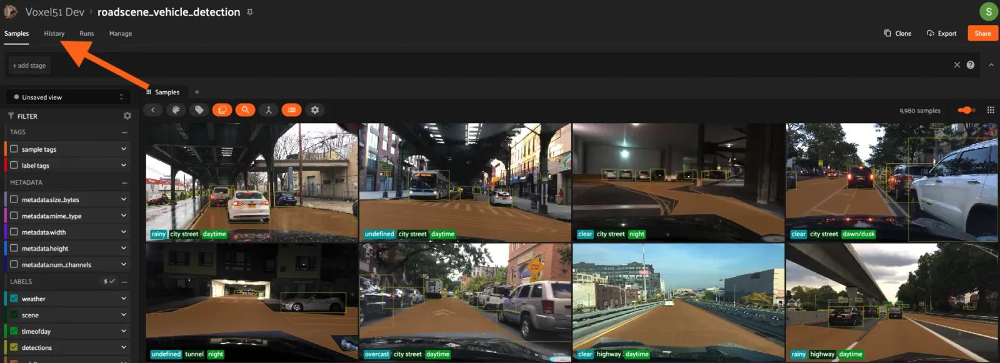

On this page you can see a listing of the Snapshot history for the dataset.
Each row contains information about a single Snapshot.

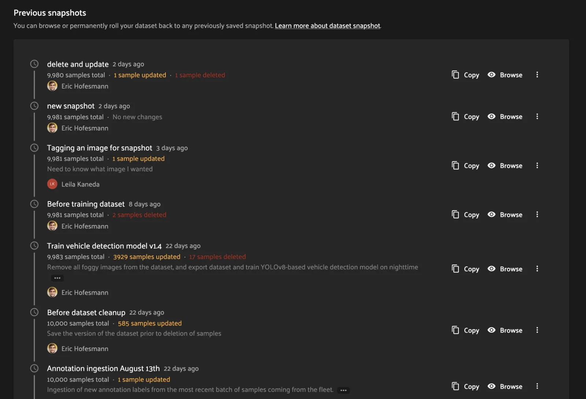

#### SDK [¶](\#sdk "Permalink to this headline")

You can also list Snapshot names for a dataset using the
`list_snapshots()` method
from the Management SDK.

```python
import fiftyone.management as fom

dataset_name = "quickstart"
fom.list_snapshots(dataset_name)

```

Then you can get more detailed information on a single Snapshot using the
`get_snapshot_info()`
method.

```python
import fiftyone.management as fom

dataset = "quickstart"
snapshot_name = "v0.1"

fom.get_snapshot_info(dataset, snapshot_name)

```

### Loading snapshots [¶](\#loading-snapshots "Permalink to this headline")

Any user with Can View permissions to a dataset can view and load its snapshots
via the Teams UI or the SDK.

#### Teams UI [¶](\#id2 "Permalink to this headline")

From the dataset’s History tab, click the “Browse” button next to a Snapshot in
the [snapshot list](\#dataset-versioning-list-snapshots) to load the
Snapshot in the UI.

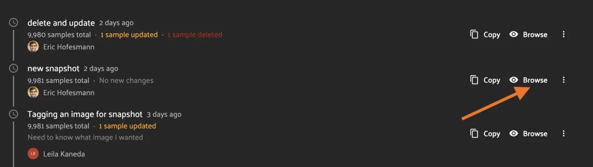

This will open the Snapshot in the normal dataset samples UI with all your
favorite FiftyOne visualization tools at your fingertips! However, all
dataset-modification features such as tagging have been removed.

We can also link directly to this Snapshot page by copying the URL from the
address bar or from the “Share Dataset” page which opens from the “Share”
button. For the above Snapshot, it would look like this:

```python
https://<your-teams-url>/datasets/roadscene-vehicle-detection/samples?snapshot=new+snapshot

```

One other difference from the normal page is the Snapshot banner which gives
information about the Snapshot being viewed, and other quick-click operations.
Clicking the name line drops down a list of the Snapshots where the current one
is highlighted. Clicking on a Snapshot in the dropdown will navigate to the
browse page for that Snapshot.

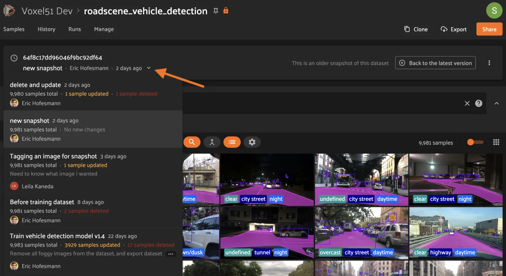

On the right side of the banner, clicking the “Back to the latest version”
button will take you back to the samples page for the dataset HEAD. You can
also do this by clicking the “Samples” tab. There is also a convenient dropdown
from the 3-dot (kebab) menu which gives various
[management functions](\#dataset-versioning-snapshot-management) for the
current Snapshot.

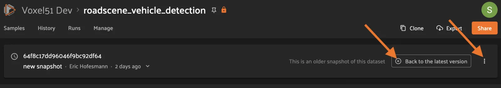

#### SDK [¶](\#id3 "Permalink to this headline")

Snapshots can also be loaded via the FiftyOne SDK
[`load_dataset()`](FIXMEgithub.io/zxcv/api/fiftyone.core.dataset.html#fiftyone.core.dataset.load_dataset "fiftyone.core.dataset.load_dataset") method. The
following snippet will load an existing Snapshot of a dataset. It can then be
interacted with as if it is a normal dataset, except for any operations that
would cause modifications.

```python
import fiftyone as fo

dataset_name = "quickstart"
existing_snapshot_name = "v1"

snapshot = fo.load_dataset(dataset_name, snapshot=existing_snapshot_name)
print(snapshot)

```

## Snapshot management [¶](\#snapshot-management "Permalink to this headline")

The following sections describe how to create and use snapshots.

### Creating a snapshot [¶](\#creating-a-snapshot "Permalink to this headline")

Users with Can Manage permissions to a dataset can create Snapshots through the
Teams UI or the Management SDK.

Note

Snapshots can only be created from the HEAD of the dataset.

#### Teams UI [¶](\#id4 "Permalink to this headline")

At the top of the History tab for a dataset is the Create snapshot panel.
This panel shows the number of changes that have happened between the last
Snapshot and the current state of the dataset.

Note

The latest changes summary is not continuously updated; click the “Refresh”
button to recompute these values.

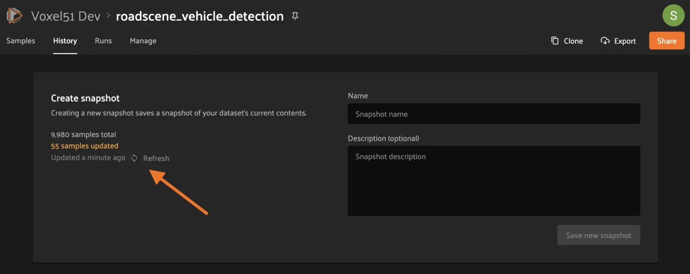

To create a Snapshot, provide a unique name and an optional description, then
click the “Save new snapshot” button.

Note

Depending on the [versioning backend](\#dataset-versioning-backends)
used, deployment options chosen, and the size of the dataset, this may take
some time.


After creation, the new Snapshot will show up in the list!

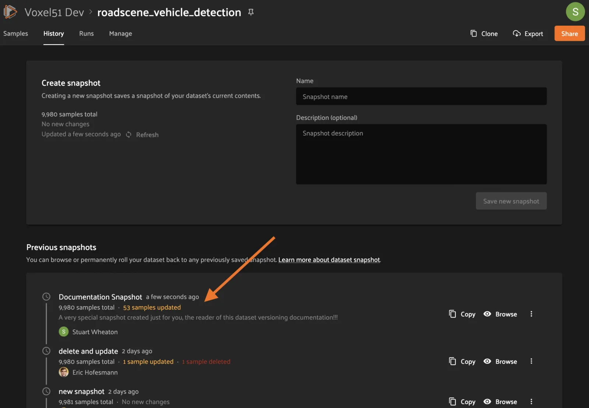

#### SDK [¶](\#id5 "Permalink to this headline")

You can also create Snapshots via the Management SDK.

To get the latest changes summary as in the Create snapshot panel, use
`get_dataset_latest_changes_summary()`.

```python
import fiftyone.management as fom

fom.get_dataset_latest_changes_summary(dataset.name)

```

To recalculate the latest changes summary as in the Refresh button in that
panel, use
`calculate_dataset_latest_changes_summary()`.

```python
import fiftyone.management as fom

old = fom.calculate_dataset_latest_changes_summary(dataset.name)
assert old == fom.get_dataset_latest_changes_summary(dataset.name)

dataset.delete_samples(dataset.take(5))

# Cached summary hasn't been updated
assert old == fom.get_dataset_latest_changes_summary(dataset.name)

new = fom.calculate_dataset_latest_changes_summary(dataset.name)
assert new.updated_at > changes.updated_at

```

To create a new Snapshot, use the
`create_snapshot()`
method.

```python
import fiftyone.management as fom

dataset_name = "quickstart"
snapshot_name = "v0.1"
description = "Version 0.1 in which I have made many awesome changes!"
snapshot = fom.create_snapshot(dataset_name, snapshot_name, description)

```

### Deleting a snapshot [¶](\#deleting-a-snapshot "Permalink to this headline")

Users with Can Manage permissions to a dataset can delete snapshots through the
Teams UI or the Management SDK.

If the Snapshot is the most recent, the latest (HEAD) sample changes summary is
not automatically recalculated. See
[this section](\#dataset-versioning-creating-snapshot) to see how to
recalculate these now-stale values.

If the Snapshot is _not_ the most recent, the sample change summary for the
following Snapshot will be automatically recalculated based on the previous
Snapshot.

Warning

Deleting a Snapshot cannot be undone!

#### Teams UI [¶](\#id6 "Permalink to this headline")

To delete a Snapshot via the App, open the 3-dot (kebab) menu for the Snapshot.
In the menu, click “Delete snapshot”. This will bring up a confirmation dialog
to prevent accidental deletions.

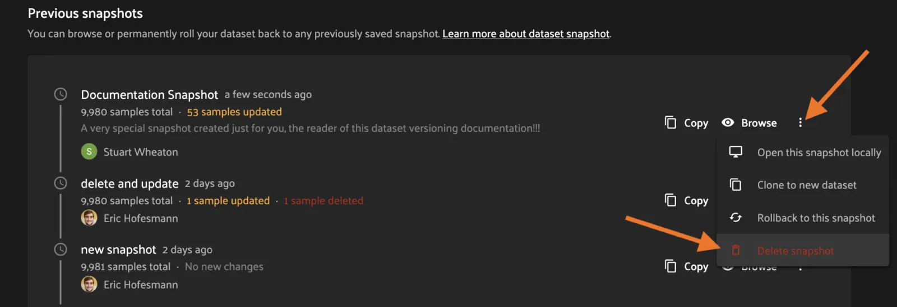

#### SDK [¶](\#id7 "Permalink to this headline")

You can also use the
`delete_snapshot()` method
in the Management SDK.

```python
import fiftyone.management as fom

dataset = "quickstart"
snapshot_name = "v0.1"
fom.delete_snapshot(dataset, snapshot_name)

```

### Rollback dataset to snapshot [¶](\#rollback-dataset-to-snapshot "Permalink to this headline")

In case unwanted edits have been added to the dataset HEAD, FiftyOne provides
the ability for dataset Managers to roll the dataset back (revert) to the state
of a given Snapshot.

Warning

This is a destructive operation! Rolling back to a Snapshot discards
**all** changes between the selected Snapshot and the current working
version of the dataset, including all newer Snapshots.

#### Teams UI [¶](\#id8 "Permalink to this headline")

To revert a dataset to a Snapshot’s state, click the 3-dot (kebab) menu in
the History tab for the Snapshot you want to rollback to and select
“Rollback to this snapshot”. This will bring up a confirmation dialog to
prevent accidental deletions.

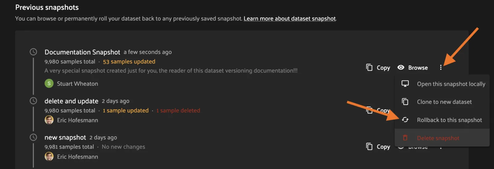

#### SDK [¶](\#id9 "Permalink to this headline")

You can also use the
`revert_dataset_to_snapshot()`
method in the Management SDK.

```python
import fiftyone.management as fom

dataset = "quickstart"
snapshot_name = "v0.1"
description = "Initial dataset snapshot"
fom.create_snapshot(dataset, snapshot_name, description)

# Oops we deleted everything!
dataset.delete_samples(dataset.values("id"))

# Phew!
fom.revert_dataset_to_snapshot(dataset.name, snapshot_name)
dataset.reload()

assert len(dataset) > 0

```

### Archive snapshot [¶](\#archive-snapshot "Permalink to this headline")

Users with Can Manage permissions to a dataset can manually
[archive snapshots](\#dataset-versioning-automatic-archival) to the
configured cold storage location via the UI or the Management SDK.

Note

Users cannot browse archived snapshots via the UI or load them via the SDK.
The snapshot must first be
[unarchived](\#dataset-versioning-unarchive-snapshot).

#### Teams UI [¶](\#id10 "Permalink to this headline")

To manually archive a snapshot, click the 3-dot (kebab) menu in the History tab
for a snapshot you want to archive and select “Archive snapshot”. This will
begin the archival process and the browse button will be replaced with an
“Archiving” spinner”:

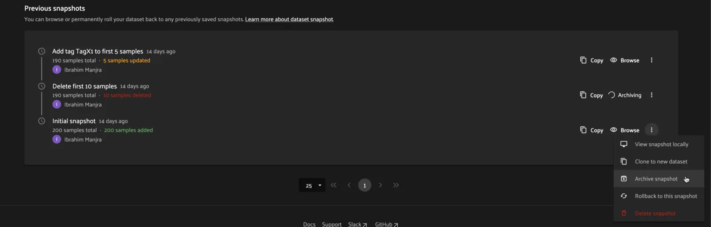

#### SDK [¶](\#id11 "Permalink to this headline")

You can also use the
`archive_snapshot()`
method in the Management SDK:

```python
import fiftyone as fo
import fiftyone.management as fom

snapshot_name = "v0.1"

# We don't use this regularly, archive it!
fom.archive_snapshot(dataset.name, snapshot_name)

fo.load_dataset(dataset.name, snapshot_name) # throws error, can't load!

```

### Unarchive snapshot [¶](\#unarchive-snapshot "Permalink to this headline")

To make an archived snapshot browsable again, users with Can Manage
permissions to the dataset can unarchive it via the UI or Management SDK.

#### Teams UI [¶](\#id12 "Permalink to this headline")

To unarchive a snapshot, click the “Unarchive” button in the History tab for a
snapshot you want to unarchive. This will begin the unarchival process and the
archive button will be replaced with an “Unarchiving” spinner:

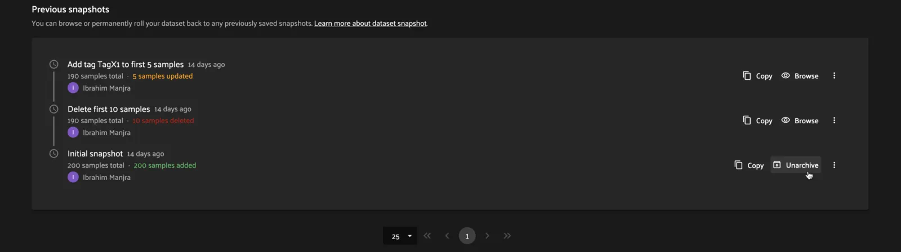

#### SDK [¶](\#id13 "Permalink to this headline")

You can also use the
`unarchive_snapshot()`
method in the Management SDK:

```python
import fiftyone as fo
import fiftyone.management as fom

snapshot_name = "v0.1"
description = "Initial dataset snapshot"

# We don't use this regularly, archive it!
fom.archive_snapshot(dataset.name, snapshot_name)
fo.load_dataset(dataset.name, snapshot_name) # throws error, can't load!

# Oops we need it now, unarchive it!
fom.unarchive_snapshot(dataset.name, snapshot_name)
fo.load_dataset(dataset.name, snapshot_name) # works now!

```

## Pluggable backends [¶](\#pluggable-backends "Permalink to this headline")

Dataset versioning was built with an extensible architecture to support
different versioning backend implementations being built and swapped in to
better suit the users’ needs and technology preferences. In the future, this
section will contain information and discussion about each of these available
backends, including their strengths/limitations and configuration options.

For the initial release in FiftyOne Teams v1.4.0, however, there is only one
backend choice described below. Additional backends may be implemented in the
future, but for now, releasing dataset versioning with the first
iteration was prioritized so that users can begin to see value and provide
feedback as soon as possible.

### Internal duplication backend [¶](\#internal-duplication-backend "Permalink to this headline")

This backend is similar to cloning a dataset; Snapshots are stored in the same
MongoDB database as the original dataset.

Creating a Snapshot with this backend is similar to cloning a dataset in terms
of performance and storage needs.

Creating a Snapshot should take roughly the same amount of time as cloning the
dataset, and so is proportional to the size of the dataset being versioned.

At this time, Snapshots are stored in the same database as the original dataset.

These requirements should be taken into consideration when using Snapshots and
when determining values for the
[max number of Snapshots allowed](\#dataset-versioning-configuration).

#### Time and space [¶](\#time-and-space "Permalink to this headline")

**Time**

The create Snapshot operation takes time proportional to cloning the dataset.
This backend is the most performant when creating a Snapshot then immediately
loading it for use; while other backends would have to store the virtual
Snapshot and then materialize it, this one simply does one big intra-MongoDB
clone.

Additionally, change summary calculation can be slow.

Note

In v1.4.0, calculating number of samples modified in particular can
cause slowdown with larger datasets. This value is not computed for
datasets larger than 200 thousand samples.

**Space**

The amount of storage required scales with the number of Snapshots created, not
the volume of changes. Since it is stored in the same database as normal
datasets, creating too many Snapshots without the ability to archive them
could fill up the database.

#### Strengths [¶](\#strengths "Permalink to this headline")

|     |     |
| --- | --- |
| ✅ | Simple |
| ✅ | Uses existing MongoDB; no extra deployment components |
| ✅ | Browsing/loading is fast because the Snapshots are always materialized |
| ✅ | For a create-then-load workflow, it has the lowest overhead cost of<br>any backend since materialized and virtual forms are one and the same |

#### Limitations [¶](\#limitations "Permalink to this headline")

|     |     |
| --- | --- |
| ❌ | Creating a Snapshot takes time proportional to clone dataset |
| ❌ | Calculating sample change summaries is less efficient |
| ❌ | Storage is highly duplicative |

#### Configuration [¶](\#configuration "Permalink to this headline")

There are no unique configuration options for this backend.

## Usage considerations [¶](\#usage-considerations "Permalink to this headline")

### Best practices [¶](\#best-practices "Permalink to this headline")

As this feature matures, we will have better recommendations for best practices.
For now given the limited starting options in the initial iteration, we have the
following advice:

- Use snapshots on smaller datasets if possible.

- Since space is at a premium, limit creation of snapshots to marking milestone
events which you want to revisit or restore later.

- Delete old snapshots you don’t need anymore.

- Set the [versioning configuration](\#dataset-versioning-configuration)
to the highest your deployment can comfortably support, to better enable
user workflows without breaking the (MongoDB) bank.


### Configuration [¶](\#dataset-versioning-configuration "Permalink to this headline")

Since Snapshots impact the storage needs of FiftyOne Teams, some guard rails
have been put in place to control the maximum amount of Snapshots that can be
created. If a threshold has been exceeded while a user attempts to create a
new Snapshot, they will receive an error informing them that it may be time to
remove old Snapshots.

The configurations allowed are described in the table below. Adjusting these
defaults should be done in consideration with the needs of the team and the
storage requirements necessary.

| Config name | Environment variable | Default \| Description |
| --- | --- | --- |
| Maximum total Snapshots | `FIFTYONE_SNAPSHOTS_MAX_IN_DB` | 100 | The max total number of Snapshots allowed at once. -1 for no limit. If this<br>limit is exceeded then automatic archival is triggered if enabled,<br>otherwise an error is raised. |
| Maximum Snapshots per-dataset | `FIFTYONE_SNAPSHOTS_MAX_PER_DATASET` | 20 | The max number of Snapshots allowed per dataset. -1 for no limit. If this<br>limit is exceeded then automatic archival is triggered if enabled,<br>otherwise an error is raised. |
| Snapshot Archive Path | `FIFTYONE_SNAPSHOTS_ARCHIVE_PATH` | `None` | Full path to network-mounted file system or a cloud storage path to use for<br>snapshot archive storage. The default `None` means archival is disabled. |
| Automatic Archival Min Age | `FIFTYONE_SNAPSHOTS_MIN_LAST_LOADED_SEC` | 86400 | The minimum last-loaded age in seconds (as defined by `now-last_loaded_at`<br>) a snapshot must meet to be considered for automatic archival. This limit<br>is intended to help curtail automatic archival of a snapshot a user is<br>actively working with. The default value is 1 day. |

## Roadmap [¶](\#roadmap "Permalink to this headline")

The following are some items that are on the roadmap for future iterations
of the dataset versioning system. Keep an eye out for future FiftyOne Teams
versions for these additional features!

**Near term**

- Optimize diff computation for larger datasets (over 200k samples) and add
support for modification summaries for these datasets


**Longer term**

- Further optimize existing versioning system

- Support external versioning backends

- Searching Snapshots

- Content-aware Snapshot change summaries


**Exploratory**

- Visualization of Snapshot diffs

- Implement a branch-and-merge model

- Deep integrations with versioning backend tools to version FiftyOne
datasets alongside your models and media


