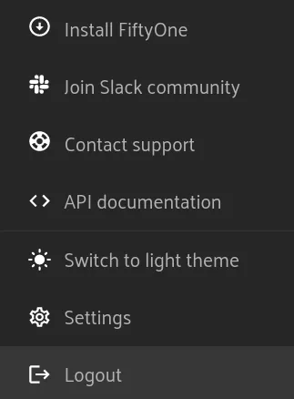
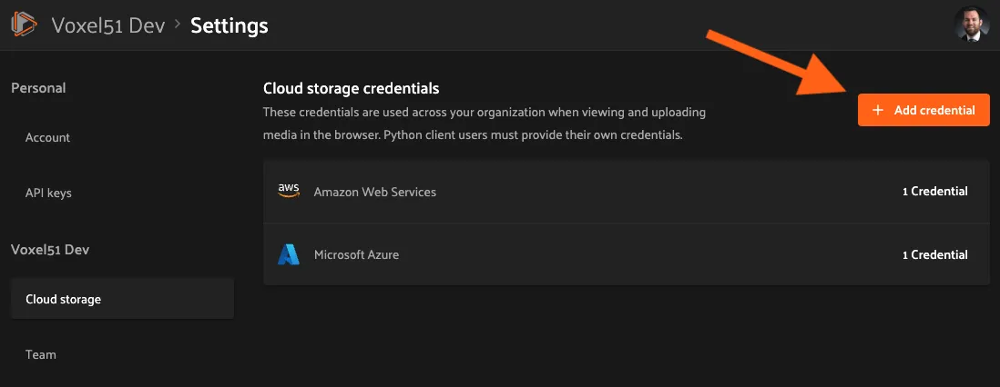
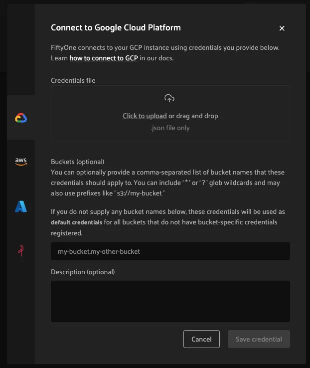

# FiftyOne Teams Installation [¶](\#fiftyone-teams-installation "Permalink to this headline")

FiftyOne Teams deployments come with a centralized FiftyOne Teams App and
database that allows your entire team to collaborate securely on the same
datasets. FiftyOne Teams is deployed entirely into your environment, either
on-premises or in a private cloud. Your data never leaves your environment.

FiftyOne Teams can be deployed on a wide variety of infrastructure solutions,
including Kubernetes and Docker.

Note

Detailed instructions for the initial FiftyOne Teams deployment, along with
all necessary components, are made available by your Voxel51 CS engineer
during the onboarding process.

## Python SDK [¶](\#python-sdk "Permalink to this headline")

While the [FiftyOne Teams App](teams_app.md#teams-app) allows for countless new
App-centric workflows, any existing Python-based workflows that you’ve fallen
in love with in the open-source version of FiftyOne are still directly
applicable!

FiftyOne Teams requires an updated Python SDK, which is a wrapper around the
open-source FiftyOne package that adds new functionality like support for
cloud-backed media.

You can find the installation instructions under the “Install FiftyOne” section
of the Teams App by clicking on your user icon in the upper right corner:

[](../_images/install_fiftyone.webp)

There you’ll see instructions for installing a `fiftyone` package from the
private PyPI server as shown below:

```python
pip install --index-url https://${TOKEN}@pypi.fiftyone.ai fiftyone

```

Note

See [Installation with Poetry](#teams-installation-poetry) if you use
`poetry` instead of `pip`.

Note

The Teams Python package is named `fiftyone` and has the same module
structure as [fiftyone](../api/fiftyone.html), so any existing scripts you
built using open source will continue to run after you upgrade!

### Next Steps [¶](\#next-steps "Permalink to this headline")

After installing the Teams Python SDK in your virtual environment, you’ll need
to configure two things:

- Your team’s [API connection](api_connection.md#teams-api-connection) or
[MongoDB connection](../fiftyone_concepts/config.md#configuring-mongodb-connection)

- The [cloud credentials](#teams-cloud-credentials) to access your
cloud-backed media


That’s it! Any operations you perform will be stored in a centralized location
and will be available to all users with access to the same datasets in the
Teams App or their Python workflows.

### Installation with Poetry [¶](\#installation-with-poetry "Permalink to this headline")

If you are using [poetry](https://python-poetry.org/) to install your
dependencies rather than `pip`, you will need to follow instructions in
[the docs for installing from a private repository.](https://python-poetry.org/docs/repositories/#installing-from-private-package-sources)
The two key points are specifying the additional private source and declaring
that the `fiftyone` module should be found there and not the default PyPI
location.

#### Add source [¶](\#add-source "Permalink to this headline")

In poetry v1.5, it is recommended to use an
[explicit package source.](https://python-poetry.org/docs/repositories/#explicit-package-sources)

```python
poetry source add --priority=explicit fiftyone-teams https://pypi.fiftyone.ai/simple/

```

Prior to v1.5, you should use the deprecated
[secondary package source.](https://python-poetry.org/docs/1.4/repositories/#secondary-package-sources)

```python
poetry source add --secondary fiftyone-teams https://pypi.fiftyone.ai/simple/

```

#### Configure credentials [¶](\#configure-credentials "Permalink to this headline")

```python
poetry config http-basic.fiftyone-teams ${TOKEN} ""

```

Alternatively, you can specify the credentials in environment variables.

```python
export POETRY_HTTP_BASIC_FIFTYONE_TEAMS_USERNAME="${TOKEN}"
export POETRY_HTTP_BASIC_FIFTYONE_TEAMS_PASSWORD=""

```

If you have trouble configuring the credentials, see
[more in the poetry docs here.](https://python-poetry.org/docs/repositories/#configuring-credentials)

#### Add fiftyone dependency [¶](\#add-fiftyone-dependency "Permalink to this headline")

Replace `X.Y.Z` with the proper version

```python
poetry add --source fiftyone-teams fiftyone==X.Y.Z

```

Note

Due to an [unresolved misalignment](https://github.com/python-poetry/poetry/issues/4046)
with `poetry` and a FiftyOne dependency, `kaleido`, you must add it
to your own dependencies as well:

```python
poetry add kaleido==0.2.1

```

You should then see snippets in the `pyproject.toml` file like the following
(the `priority` line will be different for `poetry<v1.5`):

```python
[[tool.poetry.source]]
name = "fiftyone-teams"
url = "https://pypi.fiftyone.ai"
priority = "explicit"

```

```python
[tool.poetry.dependencies]
fiftyone = {version = "X.Y.Z", source = "fiftyone-teams}

```

## Cloud credentials [¶](\#cloud-credentials "Permalink to this headline")

In order to utilize cloud-backed media functionality of FiftyOne Teams, at
least one cloud source must be configured with proper credentials. Below are
instructions for configuring each supported cloud provider for local SDK use
or directly to the Teams containers. An admin can also [configure\\
credentials for use by all app users](#teams-cloud-storage-page).

### Cross-origin resource sharing (CORS) [¶](\#cross-origin-resource-sharing-cors "Permalink to this headline")

If your datasets include cloud-backed
[point clouds](../fiftyone_concepts/using_datasets.md#point-cloud-datasets) or
[segmentation maps](../fiftyone_concepts/using_datasets.md#semantic-segmentation), you may need to configure
cross-origin resource sharing (CORS) for your cloud buckets. Details are
provided below for each cloud platform.

### Browser caching [¶](\#browser-caching "Permalink to this headline")

If your datasets include cloud-backed media, we strongly recommend configuring your data
sources to allow for built in browser caching. This will cache signed URL responses
so you don’t need to reload assets from your cloud storage between sessions.
Details are provided below for each cloud platform.

### Amazon S3 [¶](\#amazon-s3 "Permalink to this headline")

To work with FiftyOne datasets whose media are stored in Amazon S3, you simply
need to provide
[AWS credentials](https://boto3.amazonaws.com/v1/documentation/api/latest/guide/configuration.html#using-a-configuration-file)
to your Teams client with read access to the relevant objects and buckets.

You can do this in any of the following ways:

1\. Configure/provide AWS credentials in any format supported by the
[boto3 library](https://boto3.amazonaws.com/v1/documentation/api/latest/guide/credentials.html#configuring-credentials).
For example, here are two of the supported methods:

```python
# Access key
export AWS_ACCESS_KEY_ID=...
export AWS_SECRET_ACCESS_KEY=...
export AWS_SESSION_TOKEN=... # if applicable
export AWS_DEFAULT_REGION=...

```

```python
# Web identity provider
export AWS_ROLE_ARN=...
export AWS_WEB_IDENTITY_TOKEN_FILE=...
export AWS_ROLE_SESSION_NAME... #if applicable
export AWS_DEFAULT_REGION=...

```

2\. Provide AWS credentials on a per-session basis by setting one of the
following sets of environment variables to point to your AWS credentials on
disk:

```python
# AWS config file
export AWS_CONFIG_FILE="/path/to/aws-config.ini"
export AWS_PROFILE=default  # optional

```

```python
# Shared credentials file
export AWS_SHARED_CREDENTIALS_FILE="/path/to/aws-credentials.ini"
export AWS_PROFILE=default  # optional

```

In the above, the config file should use
[this syntax](https://boto3.amazonaws.com/v1/documentation/api/latest/guide/configuration.html#using-a-configuration-file)
and the shared credentials file should use
[this syntax](https://boto3.amazonaws.com/v1/documentation/api/latest/guide/credentials.html#shared-credentials-file).

Note

FiftyOne Teams requires either the `s3:ListBucket` or
`s3:GetBucketLocation` permission in order to access objects in S3 buckets.

If you wish to use multi-account credentials, your credentials must have
the `s3:ListBucket` permission, as `s3:GetBucketLocation` does not support
this.

3\. Permanently register AWS credentials on a particular machine by adding the
following keys to your [media cache config](cloud_media.md#teams-media-cache-config):

```python
{
    "aws_config_file": "/path/to/aws-config.ini",
    "aws_profile": "default"  # optional
}

```

If you need to [configure CORS on your AWS buckets](https://docs.aws.amazon.com/AmazonS3/latest/userguide/enabling-cors-examples.html),
here is an example configuration:

```python
[\
    {\
        "origin": ["https://fiftyone-teams-deployment.yourcompany.com"],\
        "method": ["GET", "HEAD"],\
        "responseHeader": ["*"],\
        "maxAgeSeconds": 86400\
    }\
]

```

If you would like to take advantage of browser caching you can
[specify cache-control headers on S3 objects](https://docs.aws.amazon.com/whitepapers/latest/build-static-websites-aws/controlling-how-long-amazon-s3-content-is-cached-by-amazon-cloudfront.html#specify-cache-control-headers).
By default S3 does not provide cache-control headers so it will be up to your browser’s
heuristics engine to determine how long to cache the object.

### Google Cloud Storage [¶](\#google-cloud-storage "Permalink to this headline")

To work with FiftyOne datasets whose media are stored in Google Cloud Storage,
you simply need to provide [credentials](https://cloud.google.com/docs/authentication)
to your Teams client with read access to the relevant objects and buckets.

You can do this in any of the following ways:

1\. Configure
[application default credentials](https://cloud.google.com/docs/authentication/application-default-credentials)
in a manner supported by Google Cloud, such as:

- [Using the gcloud CLI](https://cloud.google.com/docs/authentication/application-default-credentials#personal)

- [Attaching a service account to your Google Cloud resource](https://cloud.google.com/docs/authentication/application-default-credentials#attached-sa)


2\. Provide GCS credentials on a per-session basis by setting the following
environment variables to point to your GCS credentials on disk:

```python
export GOOGLE_APPLICATION_CREDENTIALS="/path/to/gcp-credentials.json"

```

3\. Permanently register GCS credentials on a particular machine by adding the
following keys to your [media cache config](cloud_media.md#teams-media-cache-config):

```python
{
    "google_application_credentials": "/path/to/gcp-credentials.json"
}

```

In the above, the credentials file can contain any format supported by
[google.auth.load\_credentials\_from\_file()](https://google-auth.readthedocs.io/en/master/reference/google.auth.html#google.auth.load_credentials_from_file),
which includes a service account key, stored authorized user credentials, or
external account credentials.

If you need to [configure CORS on your GCP buckets](https://cloud.google.com/storage/docs/using-cors),
here is an example configuration:

```python
[\
    {\
        "origin": ["https://fiftyone-teams-deployment.yourcompany.com"],\
        "method": ["GET", "HEAD"],\
        "responseHeader": ["*"],\
        "maxAgeSeconds": 3600\
    }\
]

```

If you would like to take advantage of browser caching you can
[specify cache-control headers on GCP content](https://cloud.google.com/storage/docs/metadata#cache-control).
By default GCP sets the max-age=0 seconds meaning no caching will occur.

### Microsoft Azure [¶](\#microsoft-azure "Permalink to this headline")

To work with FiftyOne datasets whose media are stored in Azure Storage, you
simply need to provide
[Azure credentials](https://learn.microsoft.com/en-us/azure/storage/blobs/authorize-data-operations-cli)
to your Teams client with read access to the relevant objects and containers.

You can do this in any of the following ways:

1\. Provide your Azure credentials in any manner recognized by
[azure.identity.DefaultAzureCredential](https://learn.microsoft.com/en-us/python/api/azure-identity/azure.identity.defaultazurecredential?view=azure-python)

2\. Provide your Azure credentials on a per-session basis by setting any group
of environment variables shown below:

```python
# Option 1
export AZURE_STORAGE_CONNECTION_STRING=...
export AZURE_ALIAS=...  # optional

```

```python
# Option 2
export AZURE_STORAGE_ACCOUNT=...
export AZURE_STORAGE_KEY=...
export AZURE_ALIAS=...  # optional

```

```python
# Option 3
export AZURE_STORAGE_ACCOUNT=...
export AZURE_CLIENT_ID=...
export AZURE_CLIENT_SECRET=...
export AZURE_TENANT_ID=...
export AZURE_ALIAS=...  # optional

```

3\. Provide Azure credentials on a per-session basis by setting the following
environment variables to point to your Azure credentials on disk:

```python
export AZURE_CREDENTIALS_FILE=/path/to/azure-credentials.ini
export AZURE_PROFILE=default  # optional

```

4\. Permanently register Azure credentials on a particular machine by adding the
following keys to your [media cache config](cloud_media.md#teams-media-cache-config):

```python
{
    "azure_credentials_file": "/path/to/azure-credentials.ini",
    "azure_profile": "default"  # optional
}

```

In the options above, the `.ini` file should have syntax similar to one of
the following:

```python
[default]
conn_str = ...
alias = ...  # optional

```

```python
[default]
account_name = ...
account_key = ...
alias = ...  # optional

```

```python
[default]
account_name = ...
client_id = ...
secret = ...
tenant = ...
alias = ...  # optional

```

When populating samples with Azure Storage filepaths, you can either specify
paths by their full URL:

```python
filepath = "https://${account_name}.blob.core.windows.net/container/path/to/object.ext"

# For example
filepath = "https://voxel51.blob.core.windows.net/test-container/image.jpg"

```

or, if you have defined an alias in your config, you may instead prefix the
alias:

```python
filepath = "${alias}://container/path/to/object.ext"

# For example
filepath = "az://test-container/image.jpg"

```

Note

If you use a
[custom Azure domain](https://learn.microsoft.com/en-us/azure/storage/blobs/storage-custom-domain-name?tabs=azure-portal),
you can provide it by setting the
`AZURE_STORAGE_ACCOUNT_URL` environment variable or by including the
`account_url` key in your credentials `.ini` file.

If you would like to take advantage of browser caching you can
[specify cache-control headers on Azure blobs](https://learn.microsoft.com/en-us/azure/cdn/cdn-manage-expiration-of-blob-content#setting-cache-control-headers-by-using-azure-powershell).
By default Azure does not provide cache-control headers so it will be up to your browser’s
heuristics engine to determine how long to cache the object.

### MinIO [¶](\#minio "Permalink to this headline")

To work with FiftyOne datasets whose media are stored in
[MinIO](https://min.io/), you simply need to provide the credentials to your
Teams client with read access to the relevant objects and buckets.

You can do this in any of the following ways:

1\. Provide your MinIO credentials on a per-session basis by setting the
individual environment variables shown below:

```python
export MINIO_ACCESS_KEY=...
export MINIO_SECRET_ACCESS_KEY=...
export MINIO_ENDPOINT_URL=...
export MINIO_ALIAS=...  # optional
export MINIO_REGION=...  # if applicable

```

2\. Provide MinIO credentials on a per-session basis by setting the following
environment variables to point to your MinIO credentials on disk:

```python
export MINIO_CONFIG_FILE=/path/to/minio-config.ini
export MINIO_PROFILE=default  # optional

```

3\. Permanently register MinIO credentials on a particular machine by adding the
following keys to your [media cache config](cloud_media.md#teams-media-cache-config):

```python
{
    "minio_config_file": "/path/to/minio-config.ini",
    "minio_profile": "default"  # optional
}

```

In the options above, the `.ini` file should have syntax similar the following:

```python
[default]
access_key = ...
secret_access_key = ...
endpoint_url = ...
alias = ...  # optional
region = ...  # if applicable

```

When populating samples with MinIO filepaths, you can either specify paths by
prefixing your MinIO endpoint URL:

```python
filepath = "${endpoint_url}/bucket/path/to/object.ext"

# For example
filepath = "https://voxel51.min.io/test-bucket/image.jpg"

```

or, if you have defined an alias in your config, you may instead prefix the
alias:

```python
filepath = "${alias}://bucket/path/to/object.ext"

# For example
filepath = "minio://test-bucket/image.jpg"

```

If you would like to take advantage of browser caching you can
[specify cache-control headers on MinIO content using the metadata field of the put\_object API](https://min.io/docs/minio/linux/developers/python/API.html).
By default Minio does not provide cache-control headers so it will be up to your browser’s
heuristics engine to determine how long to cache the object.

### Extra client arguments [¶](\#extra-client-arguments "Permalink to this headline")

Configuring credentials following the instructions above is almost always
sufficient for FiftyOne Teams to properly utilize them. In rare cases where the
cloud provider client needs non-default configuration, you can add extra client
kwargs via the [media cache config](cloud_media.md#teams-media-cache-config):

```python
{
    "extra_client_kwargs": {
        "azure": {"extra_kwarg": "value"},
        "gcs": {"extra_kwarg": "value"},
        "minio": {"extra_kwarg": "value"},
        "s3": {"extra_kwarg": "value"}
    }
}

```

Provider names and the class that extra kwargs are passed to:

- **azure**: `azure.identity.DefaultAzureCredential`
- **gcs**: `google.cloud.storage.Client`
- **minio**: `botocore.config.Config`
- **s3**: `botocore.config.Config`

## Cloud storage page [¶](\#cloud-storage-page "Permalink to this headline")

Admins can also configure cloud credentials via the Settings > Cloud storage
page.

Credentials configured via this page are stored (encrypted) in the Teams
database, rather than needing to be configured through environment variables in
your Teams deployment.

Note

Any credentials configured via environment variables in your deployment
will not be displayed in this page.

To upload a new credential, click the `Add credential` button:



This will open a modal that you can use to add a credential for any of the
available providers:



After the appropriate files or fields are populated, click `Save credential`
to store the (encrypted) credential.

As depicted in the screenshot above, a credential can optionally be restricted
to a specific list of bucket(s):

- If one or more buckets are provided, the credentials are
**bucket-specific credentials** that will only be used to read/write media
within the specified bucket(s)

- If no buckets are provided, the credentials are **default credentials**
that will be used whenever trying to read/write any media for the provider
that does not belong to a bucket with bucket-specific credentials


Note

Bucket-specific credentials are useful in situations where you cannot or
do not wish to provide a single set of credentials to cover all buckets
that your team plans to use within a given cloud storage provider.

When providing bucket-specific credentials, you may either provide bucket
names like `my-bucket`, or you can provide fully-qualified buckets like
`s3://my-bucket` and
`https://voxel51.blob.core.windows.net/my-container`.

Alternatively, credentials can be updated programmatically with the
`add_cloud_credentials()`
method in the Management SDK.

Any cloud credentials uploaded via this method will automatically be used by
the Teams UI when any user attempts to load media associated with the
appropriate provider or specific bucket.

Note

By default, Teams servers refresh their credentials every 120 seconds, so
you may need to wait up to two minutes after modifying your credentials via
this page in order for the changes to take effect.

Note

Users cannot access stored credentials directly, either via the Teams UI or
by using the Teams SDK locally. The credentials are only decrypted and
used internally by the Teams servers.

