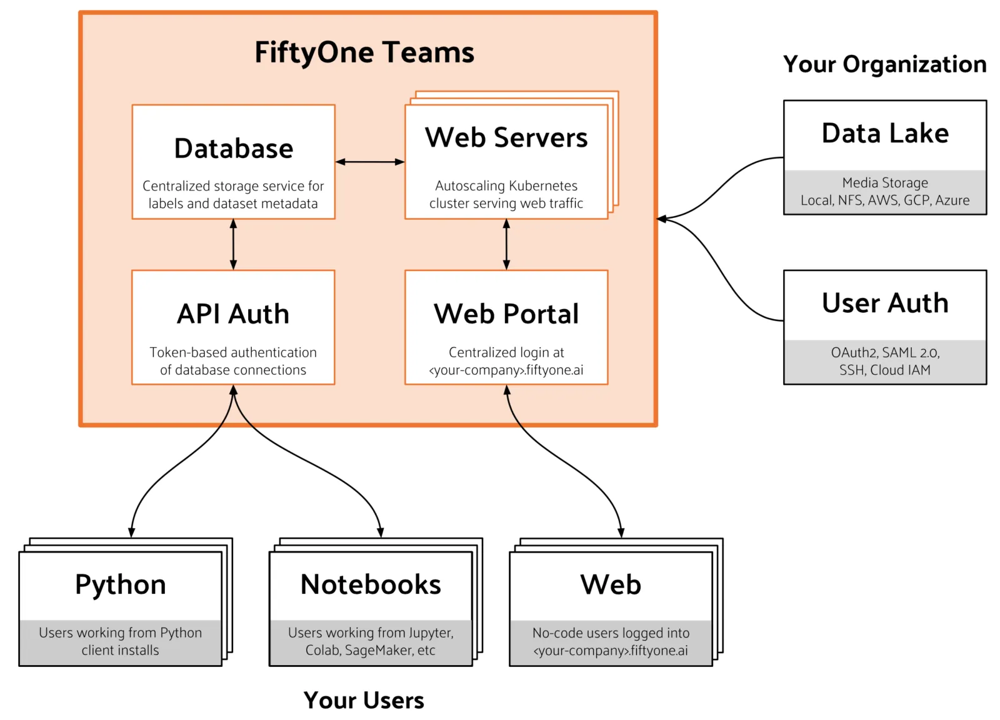

# FiftyOne Teams Overview [¶](\#fiftyone-teams-overview "Permalink to this headline")

FiftyOne Teams is purpose-built to integrate into your existing ML workflows,
including annotation, evaluation, model training, and deployment.

Note

[Learn more](https://voxel51.com/fiftyone-teams) about FiftyOne Teams and
[contact us](https://voxel51.com/get-fiftyone-teams) to try it!

## FiftyOne vs FiftyOne Teams [¶](\#fiftyone-vs-fiftyone-teams "Permalink to this headline")

Here’s a high-level overview of the capabilities that FiftyOne Teams brings:

|  | FiftyOne Teams | FiftyOne |
| --- | --- | --- |
| Curate Datasets |  |  |
| Evaluate Models |  |  |
| Find Mistakes |  |  |
| Visualize Embeddings |  |  |
| Deployment | Multi-user, on-premise, private/public cloud | Local, Single user |
| Dataset Management |  |  |
| User Permissions |  |  |
| Dataset Permissions |  |  |
| Dataset Versioning |  |  |
| SSO |  |  |
| Enterprise Support |  | Discord Community |
| Licensing | Unlimited data, flexible user-based licensing |

Apache 2.0

## Backwards compatibility [¶](\#backwards-compatibility "Permalink to this headline")

FiftyOne Teams is fully backwards compatible with open-source FiftyOne. This
means that all of your pre-existing FiftyOne workflows should be usable without
modification.

For example, you can continue running all of the workflows listed below as you
would with open source FiftyOne:

| Application | Workflows                                                                                                                                                                                                                                                                                                                                                                                                                            |
| --- |--------------------------------------------------------------------------------------------------------------------------------------------------------------------------------------------------------------------------------------------------------------------------------------------------------------------------------------------------------------------------------------------------------------------------------------|
| Data ingestion | [Loading data into FiftyOne](../fiftyone_concepts/dataset_creation/index.md#loading-datasets)                                                                                                                                                                                                                                                                                                                                        |
| Data curation | [Using the FiftyOne App](../fiftyone_concepts/app.md#fiftyone-app) [Creating views into datasets](../fiftyone_concepts/using_views.md#using-views) [Embedding-based dataset analysis](https://voxel51.com/docs/fiftyone/tutorials/image_embeddings.html) [Visual similarity](../fiftyone_concepts/brain.md#brain-similarity) and [dataset uniqueness](../fiftyone_concepts/brain.md#brain-image-uniqueness)                 |
| Annotation | [Using the annotation API](../fiftyone_concepts/annotation.md#fiftyone-annotation)                                                                                                                                                                                                                                                                                                                                                   |
| Model training and evaluation | [Exporting data for model training](../fiftyone_concepts/export_datasets.md#exporting-datasets) [Adding model predictions to FiftyOne](https://voxel51.com/docs/fiftyone/tutorials/evaluate_detections.html#Add-predictions-to-dataset) [Evaluating models in FiftyOne](../fiftyone_concepts/evaluation.md#evaluating-models) [Using interactive plots to explore results](../fiftyone_concepts/plots.md#interactive-plots) |

## System architecture [¶](\#system-architecture "Permalink to this headline")

FiftyOne Teams is implemented as a set of interoperable services, as described
in the figure below.

FiftyOne Teams is strictly a software offering. All relevant hardware is owned
and managed by your organization, whether on-premises or in your virtual
private cloud.

**Teams database services**

The primary storage location for all of the FiftyOne Teams datasets and related
metadata (excluding media files) for your organization.

**Teams web service**

An always-on front-end from which you can visually access the datasets in your
FiftyOne Teams deployment. Web-based access is the standard entrypoint for
non-technical users who need point-and-click access to dataset curation and
related features, as well as basic workflows for technical users. Most dataset
curation and model analysis work by engineers happens via client installations.

**Teams API authentication**

Technical users connecting to FiftyOne Teams via Python or Jupyter notebooks
use token-based authentication to make authorized connections to the
centralized database storing your Team’s dataset metadata.

**Python/notebook users (your organization)**

Similar to FiftyOne, technical users can install the FiftyOne Teams client in
their working environment(s). These clients are configured to use the
centralized database service and will additionally serve their own App
instances (like open source FiftyOne) so that engineers can work locally,
remotely, and in Jupyter notebooks.

**Web users (your organization)**

FiftyOne Teams provides an always-on login portal at
`https://<your-org>.fiftyone.ai` that users can login to from any browser for
web-only workflows.

**Data lake (your organization)**

FiftyOne Teams does not require duplication or control over how your source
media files are stored. Instead, FiftyOne Teams stores references (e.g., cloud
object URLs or network storage paths) to the media in your datasets, thereby
minimizing storage costs and providing you the flexibility to provision your
object storage as you see fit. FiftyOne Teams has full support for cloud,
network, and local media storage.

**User authentication (your organization)**

FiftyOne Teams can be configured to work with your organization’s
authentication and authorization systems, enabling you to manage access to
FiftyOne Teams using your existing OAuth stack. FiftyOne Teams supports SAML
2.0 and OAuth 2.0.

## Security considerations [¶](\#security-considerations "Permalink to this headline")

FiftyOne Teams relies on your organization’s existing security infrastructure.
No user accounts are created specifically for FiftyOne Teams; we integrate
directly with your OAuth system.

Usage of the FiftyOne Teams client by technical users of your organization is
also secure. All database access is managed by the central authentication
service, and self-hosted App instances can be configured to only accept
connections from known servers (e.g., only localhost connections). In remote
client workflows, users are instructed how to configure ssh tunneling to
securely access self-hosted App instances.

No outside network access is required to operate FiftyOne Teams. Voxel51 only
requests the ability to (a) access the system logs for usage tracking and
auditing purposes, and (b) access the system at the customer’s request to
provide technical support. We are flexible in the mechanisms used to accomplish
these goals.
