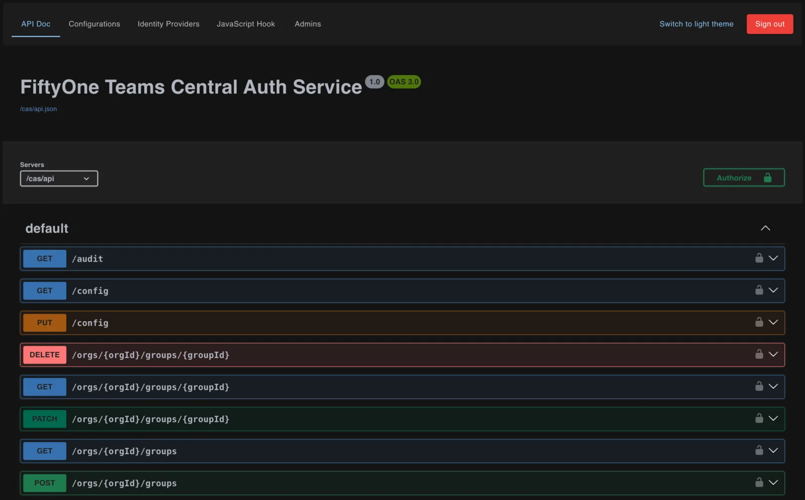
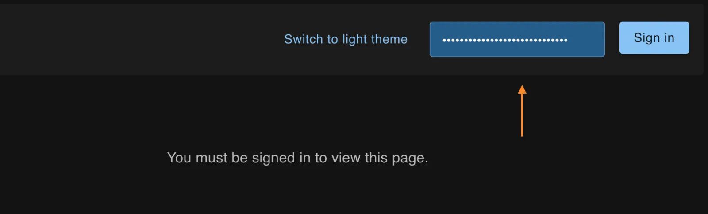
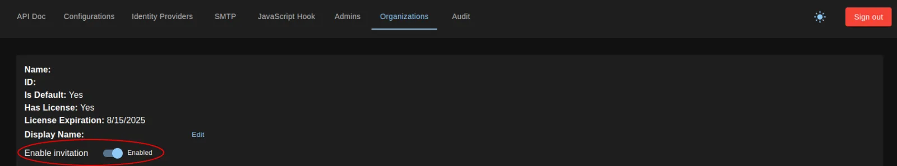
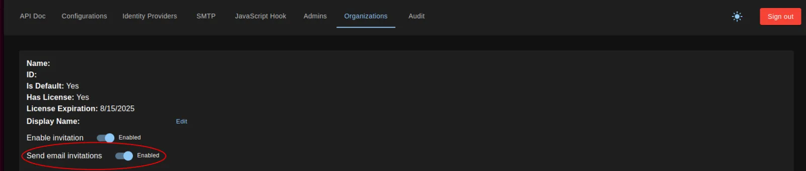
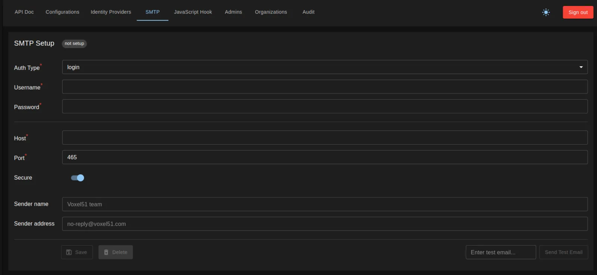
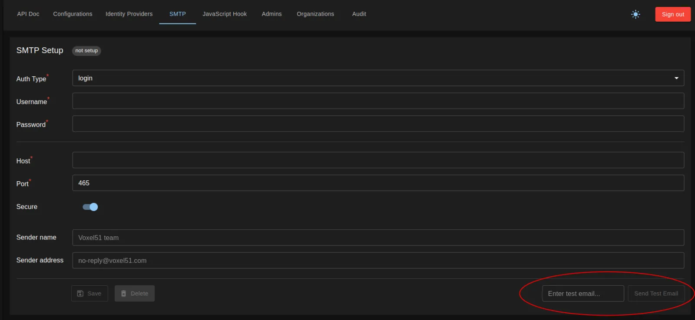

# Pluggable Authentication [¶](\#pluggable-authentication "Permalink to this headline")

FiftyOne Teams v1.6.0 introduces Pluggable Authentication that provides the
Central Authentication Service (CAS). CAS is a self-contained authentication
system with two modes ( `legacy` and `internal`). Legacy mode uses Auth0.
Internal mode eliminates the Auth0 external dependency and may run in
environments without egress to the internet. CAS provides a UI, REST API, and
JavaScript (JS) Hook mechanism to manage FiftyOne Teams user data and
authentication.

## FiftyOne Authentication Modes [¶](\#fiftyone-authentication-modes "Permalink to this headline")

The setting `FIFTYONE_AUTH_MODE` specifies the authentication mode `legacy` or
`internal`.

### Legacy Mode [¶](\#legacy-mode "Permalink to this headline")

In legacy mode, FiftyOne Teams uses Auth0 for user authentication and
authorization. This mode requires an external connection to Auth0 endpoints.
User data is eventually consistent (where changes are reflected across
FiftyOneTeams eventually). Auth0 contains the configuration for identity
providers and the persistence of user data. Auth0 supports multiple providers
(including SAML). For the supported IdPs, see
[Auth0 Enterprise Identity Providers](https://auth0.com/docs/authenticate/identity-providers/enterprise-identity-providers).

### Internal Mode [¶](\#internal-mode "Permalink to this headline")

In internal mode, FiftyOne Teams the CAS replaces Auth0. FiftyOne Teams will
not require network egress to external services. User data is immediately
consistent (where changes are reflected across FiftyOne Teams instantly).
Directory data is immediately written to MongoDB, and organizations have the
autonomy to manage their Identity Provider Configuration. Internal mode
supports
[OpenID Connect (OIDC)](https://openid.net/developers/discover-openid-and-openid-connect/)
and [OAuth2](https://oauth.net/2/).

> **NOTE**: SAML is not supported in [internal mode](#internal-mode)

## Super Admin UI [¶](\#super-admin-ui "Permalink to this headline")



The Super Admin UI contains FiftyOne Teams deployment wide configurations. When
logging into FiftyOne Teams as an admin, you are in the context of an
organization. Settings are scoped by organization and only apply to that
organization. The Super Admin UI allows you to administer all organizations and
global configurations (Identity Providers, Session timeouts, and JS hooks).

> **NOTE**: In v1.6.0, the Super Admin UI is only available in
> [internal mode](#internal-mode)



To login to this application navigate to
`https://<YOUR_FIFTYONE_TEAMS_URL>/cas/configurations`. In the top right of the
screen, and provide the `FIFTYONE_AUTH_SECRET` to login.

> **NOTE**: The value of `FIFTYONE_AUTH_SECRET` should be set prior to
> installation or upgrade.

### New User Invitations [¶](\#new-user-invitations "Permalink to this headline")

As of FiftyOne Teams 2.1.0, onboarding new users can be done via invitation
links. To do so, “Enable invitation” must be toggled on in the Organizations
section of the [Super Admin UI](#super-admin-ui).



This allows creating invitation links in [internal mode](#internal-mode) that
can be manually sent to users. When those users click the links, they will be
added to the Organization and prompted to log in.

As of FiftyOne Teams 2.2.0, these invitation links can be automatically sent
via an email through a configured SMTP server. This provides similar
functionality to [legacy mode](#legacy-mode) email invitations, but without the
need for Auth0 or any other external connections beyond the SMTP server itself.

> **NOTE:** Unless the deployment is a Managed Deployment, users must provide
> their own SMTP server to use in [internal mode](#internal-mode). This new
> functionality provides a way to authenticate and communicate with your
> existing mail server.

To do so, “Send email invitations” must be toggled on in the Organizations
section of the [Super Admin UI](#super-admin-ui)



To configure your SMTP connection, navigate to the SMTP section of the
[Super Admin UI](#super-admin-ui)



A notification at the top of the menu will inform if an SMTP configuration is
already saved. Currently, only one SMTP configuration can be saved per
Organization.

Select the appropriate type of authentication for your SMTP server and fill out
the associated fields. When you save the configuration, FiftyOne Teams will do
a preliminary check to ensure that the SMTP server is reachable at the host
provided. The configuration will not save otherwise.

Additionally, users can enter a valid email address and click Send Test Email
to test the connection.



> **NOTE:** Emails and an SMTP connection are not required to use invitations.
> Invitation links can still be generated and manually distributed without an
> SMTP configuration.

## Identity Providers (IdP) [¶](\#identity-providers-idp "Permalink to this headline")

In [internal mode](#internal-mode), use the CAS REST API or Super Admin UI to
configure FiftyOne teams to authenticate users via OIDC or OAuth2 compatible
Identity Providers. Below is an example configuration for KeyCloak as an
Identity Provider.

```python
{
    "id": "keycloak-example",
    "wellKnown": "https://keycloak.dev.acme.ai/auth/realms/acme/.well-known/openid-configuration",
    "name": "KeyCloak",
    "type": "oauth",
    "authorization": {
        "url": "https://keycloak.acme.ai/auth/realms/acme/protocol/openid-connect/auth",
        "params": {
            "scope": "openid email profile"
        }
    },
    "clientId": "...",
    "clientSecret": "...",
    "issuer": "https://keycloak.dev.acme.ai/auth/realms/acme",
    "token": {
        "url": "https://keycloak.dev.acme.ai/auth/realms/acme/protocol/openid-connect/token"
    },
    "userinfo": {
        "url": "https://keycloak.dev.acme.ai/auth/realms/acme/protocol/openid-connect/userinfo"
    },
    "idToken": true,
    "style": {
        "logoDark": "https://images.com/keycloak.svg",
        "bg": "#47abc6",
        "text": "#fff"
    },
    "profile": "(e,l)=>(console.log({profile:e,tokens:l}),{id:e.sub,name:e.name,email:e.email,image:null})",
    "allowDangerousEmailAccountLinking": true
}

```

## Getting Started with Internal Mode [¶](\#getting-started-with-internal-mode "Permalink to this headline")

These steps are only required to run FiftyOne Teams in
[internal mode](#internal-mode). Please skip when using Auth0 in
[legacy mode](#legacy-mode).

1. Configure your Identity Provider

2. Login to the SuperUser UI by navigating to
`https://<YOUR_FIFTYONE_TEAMS_URL>/cas/configurations` and in the top right,
and provide the `FIFTYONE_AUTH_SECRET` to login.

3. Create an Admin

1. Click on the “Admins” tab

2. Click “Add admin” in the bottom left

3. Set the name and email address (as it appears in your Identity Provider)
      and click “Add”
4. Add your Identity Provider

1. Click on the “Identity Providers” tab at the top of the screen and click
      “Add provider”

2. Fill out the “Add identity provider”

      1. You can also click “Switch to advanced editor” to provide the full
         configuration as a JSON object
3. In the “Profile callback” field, set the mapping that your Identity
      Provider expects
5. Login with the admin user

1. Navigate to `https://<YOUR_FIFTYONE_TEAMS_URL>/datasets`

2. You should see the login screen for your newly configured authentication
      provider

3. Before logging in, set the admin user (in step 5). Otherwise, you will
      need to remove this user from the database and try again.

4. Click the login button and provide the credentials of the Admin user
      (set in step 3)

5. Click on the icon in the top right corner then click “Settings”

6. Click “Users” on the left side

7. Validate the user is listed as an admin

## Syncing with 3rd Party Directories (Open Directory, LDAP, and Active Directory) [¶](\#syncing-with-3rd-party-directories-open-directory-ldap-and-active-directory "Permalink to this headline")

Below is an example of how to use JavaScript hooks to sync FiftyOne Teams with
a corporate directory (such as Open Directory, LDAP, or Active Directory) via
an intermediary REST API or Identity Provider. The recommended setup is with
OAuth/OIDC claims, however the example below illustrates a more intricate
integration.

This example specifically addresses a scenario in which additional actions are
performed during the `signIn` trigger. This demonstrates how hooks can extend
beyond simple authentication to interact with external APIs and internal
services for complex user management and group assignment tasks. Here’s a
breakdown of the example:

```python
// Example JavaScript hook implementation
async function Hook(context) {
    const { params, services, trigger } = context;
    const { user } = params;

    switch (trigger) {
        // Callback: user is trying to sign in
        case "signIn":
            // returning false will prevent user from signing in
            try {
                const groups = await getGroups();
                for (const group of groups) {
                    await addUserToGroup(group.name);
                }
            } catch (error) {
                console.error(error);
            }
            return true;
    }

    async function getGroups() {
        const { account } = params;
        const response = await services.util.http.get(
            `https://fiftyone.ai/list_groups/${user.id}`,
            { headers: { Authorization: `Bearer ${account?.access_token}` } }
        );
        return response.json();
    }

    async function addUserToGroup(groupName) {
        const orgId = "my_org_id";
        // Retrieve all existing groups
        const groups = await services.directory.groups.listGroups(orgId);
        // Find an existing group by name
        let group = groups.find((group) => {
            return group.name === groupName;
        });
        // If group does not exist, create a new group
        if (!group) {
            group = await services.directory.groups.createGroup(
                orgId,
                groupName
            );
        }

        if (!group.userIds.includes(user.id)) {
            // Add signed-in user to the group and update the group
            const updatedGroupName = undefined;
            const updatedGroupDescription = undefined;
            const updatedGroupUserIds = [...group.userIds, user.id];
            const accessorId = undefined;
            await services.directory.groups.updateGroup(
                orgId,
                group.id,
                accessorId,
                updatedGroupName,
                updatedGroupDescription,
                updatedGroupUserIds
            );
        }
    }
}

```

### **Context Object** [¶](\#context-object "Permalink to this headline")

The context object provides information about the current operation, including
parameters like the user’s details, and services (services) that offer utility
functions and access to directory operations.

### **External API Integration** [¶](\#external-api-integration "Permalink to this headline")

- `getGroups`: This function calls an external API to retrieve a list of
groups to which the signing-in user should be added. It utilizes the
`services.util.http.get` method for making the HTTP request, demonstrating
how external services can be queried within the hook.

- `addUserToGroup`: For each group retrieved from the external API, this
function checks if the group exists in the organization’s directory. If a
group does not exist, it is created, and then the user is added to it. This
process involves querying and modifying the organization’s group directory,
illustrating the hook’s capability to perform complex operations like
dynamic group management based on external data.

### Error Handling [¶](\#error-handling "Permalink to this headline")

- The try-catch block around the external API call and group manipulation
logic ensures that errors do not prevent the user from signing in but are
properly logged

### Summary [¶](\#summary "Permalink to this headline")

This hook example demonstrates a pattern for extending authentication flows in
CAS with custom logic. By integrating with an external API to fetch group
information and manipulating the organization’s group memberships accordingly,
it showcases the flexibility and extensibility of hooks in supporting complex,
real-world authentication and authorization scenarios.

## REST API [¶](\#rest-api "Permalink to this headline")

You can view the REST API Documentation by logging into the Super Admin UI (see
above) or by directly visiting `https://<YOUR_FIFTYONE_TEAMS_URL>/cas/api-doc`

## Configuration [¶](\#configuration "Permalink to this headline")

|     |     |     |     |
| --- | --- | --- | --- |
| **Setting** | Type | Default | Description |
| `authentication_providers` | `Array` | `[]` | A list of definitions of OIDC and/or OAuth providers. |
| `authentication_provider.profile` | `String` (parseable to JS function) | `null` | When provided this function is called to map the external user\_info to the internal fiftyone user/account. |
| `session_ttl` | `Number` | `300` | Time in seconds for sessions to live after which users will be forced to log out. Must be greater than 120 seconds to support refreshing of user session using refresh token. |
| `js_hook_enabled` | `Boolean` | `true` | When set to False, configured JavaScript hooks will not be invoked. |
| `js_hook` | `String` (parseable to a single JS function) | `null` | JavaScript hook which is invoked on several CAS events described in JS Hooks section below |
| `skipSignInPage` | `Boolean` | `false` | When set to True, sign in page with identity provider choices will be skipped when there is only one identity provider is configured |

## JavaScript Hooks [¶](\#javascript-hooks "Permalink to this headline")

This documentation outlines the JavaScript hook implementation for the Central
Authentication Service (CAS). As a CAS superuser, you are able to define
JavaScript functions that integrate with various authentication flows within
CAS, customizing the authentication processes.

### Overview [¶](\#overview "Permalink to this headline")

JavaScript hooks allow superusers to programmatically influence authentication
flows, including sign-in, sign-up, JWT handling and customization, redirection,
and session management. This document describes the available hooks, their
triggers, expected return types, and contextual information provided to each
hook.

### Example JavaScript Hook [¶](\#example-javascript-hook "Permalink to this headline")

```python
// Example JavaScript hook implementation
async function Hook(context) {
    const { params, services, trigger } = context;

    switch (trigger) {
        // user is trying to sign in
        case "signIn":
            // returning false will prevent user from signing in
            return true;

        // JWT token is created for user session
        case "jwt":
            // custom payload returned will be merged with default payload
            return {};

        // user has logged out
        case "logout":
            // returning or throwing here does not affect the sign out flow
            break;

        // user is being redirected on sign in our sign out
        case "redirect":
            // user will be redirected to this URL on sign in our sign out
            return "/settings/accounts";
    }
}

```

### Actionable Triggers [¶](\#actionable-triggers "Permalink to this headline")

|     |     |     |
| --- | --- | --- |
| **Trigger** | **Description** | **Return Type** |
| `signIn` | Invoked when a user signs in. If the hook returns false or error is thrown, sign-in will be prevented. | Boolean |
| `signUp` | Invoked when a new user signs in for the very first time. If the hook returns false or an error is thrown, sign-in will be prevented and a user/account will not be created. |  |
| `jwt` | Invoked when JWT is created (on signIn, signUp, refresh token). The returned object will override payload of default JWT payload. If an error is thrown, the session will be expired and user will be redirected to sign-in | Object \| undefined |
| `redirect` | Invoked post signIn or signOut. The user will be redirected to the URL/Path returned from the hook. | String (URL) |
| `session` | Invoked when a request for a session (on signIn, signUp, refresh token) is received. |  |

**Event-Only Triggers**

|     |     |
| --- | --- |
| **Trigger** | **Description** |
| `signOut` | Invoked when a user signs out. |
| `createUser` | Invoked when the adapter is asked to create a user. |
| `linkAccount` | Invoked when an account is linked to a user. |

**JavaScript Hooks Contextual Parameters**

|     |     |     |
| --- | --- | --- |
| **Parameter** | **Description** | **Available in Triggers** |
| `token` | The payload of a JWT token. | `signIn, signUp, jwt, session, signOut, linkAccount, createUser` |
| `user` | The signed-in user object. | `signIn, signUp, jwt, linkAccount` |
| `account` | The account from an identity provider. | `signIn, signUp, jwt, linkAccount` |
| `profile` | The profile from an identity provider. | `signIn, signUp, jwt, linkAccount` |
| `isNewUser` | True if a user is signing in for the first time. | `jwt` |
| `trigger` | Specifies the current trigger event. | `jwt` |
| `Session` | The session object. | `session` |
| `services` | Provides access to various services. | **all** |

**Services**

|     |     |
| --- | --- |
| **Service** | **Description** |
| `services.util.http` | Provides `get`, `post`, `put`, and `delete` functions for making `HTTP` requests from a JS Hook. |
| `services.userContext` | Object containing information about the user performing the current action. |
| `services.directory` |  |
| `services.directory.users` | The `UserService` \- providing methods for interacting with the directory of users. |
| `services.directory.groups` | The `GroupsService`\- providing methods for interacting with the directory of groups. |
| `services.config` | The `ConfigService`\- providing methods for reading and writing the `AuthenticationConfig`. |
| `services.util` |  |
| `services.directory.orgs` | The `OrgsService`\- providing methods for interacting with the directory of organizations. |
| `services.webhookService` | Experimental |
| `process.env['MY_ENV_VAR']` | Syntax for reading environment variables in a JS Hook. |
