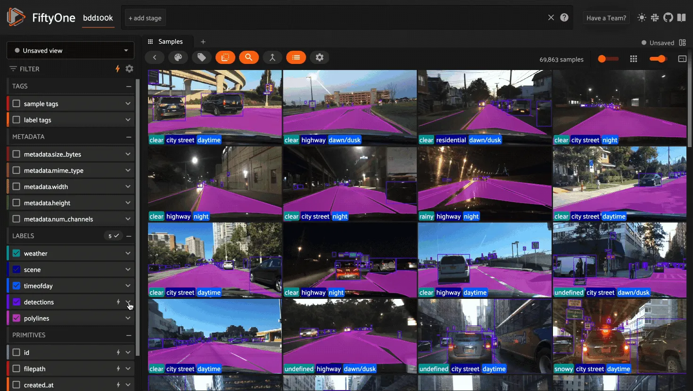
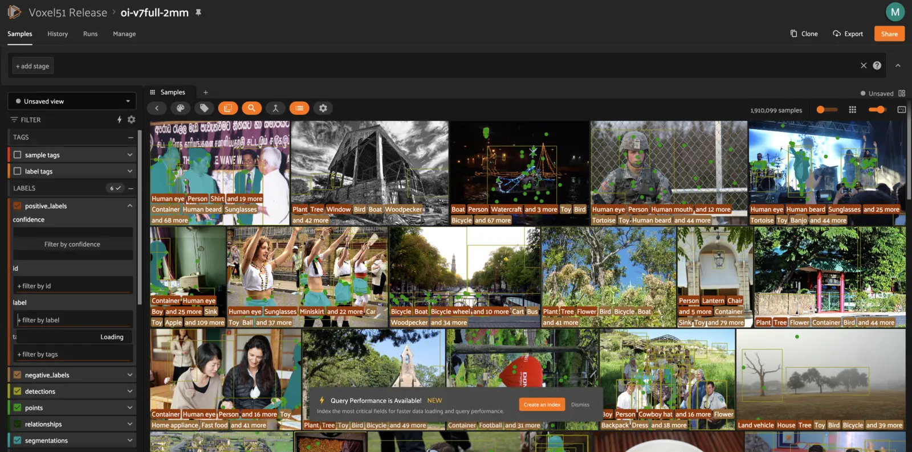
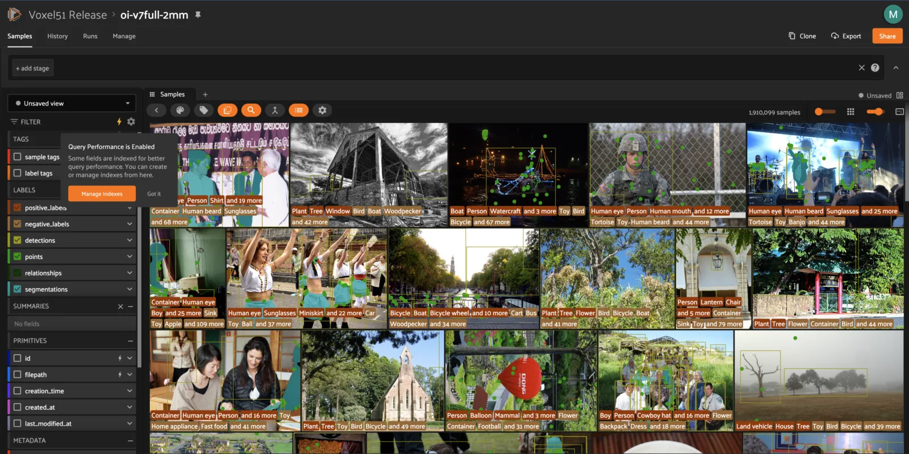
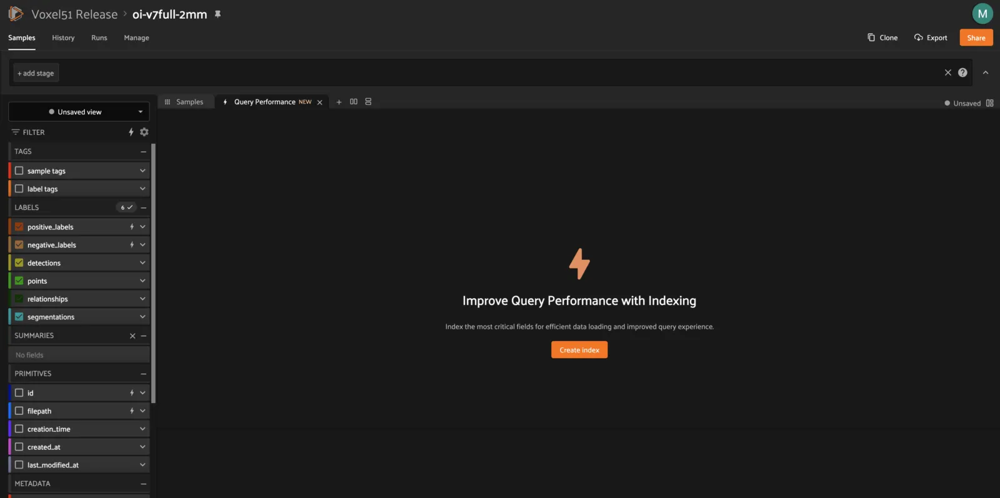
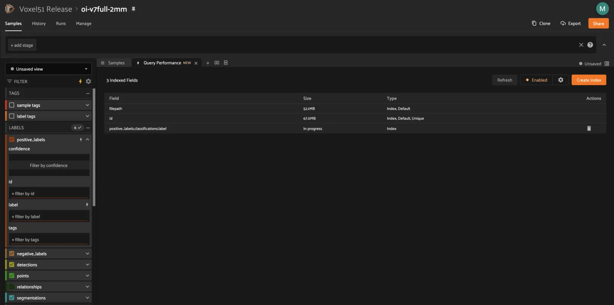
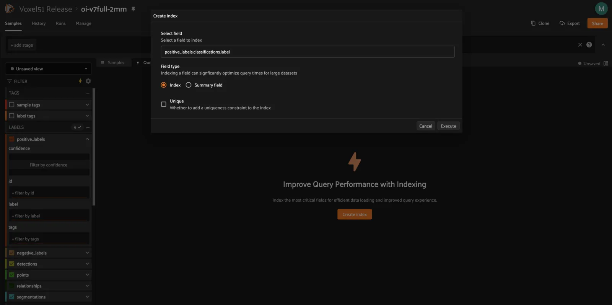
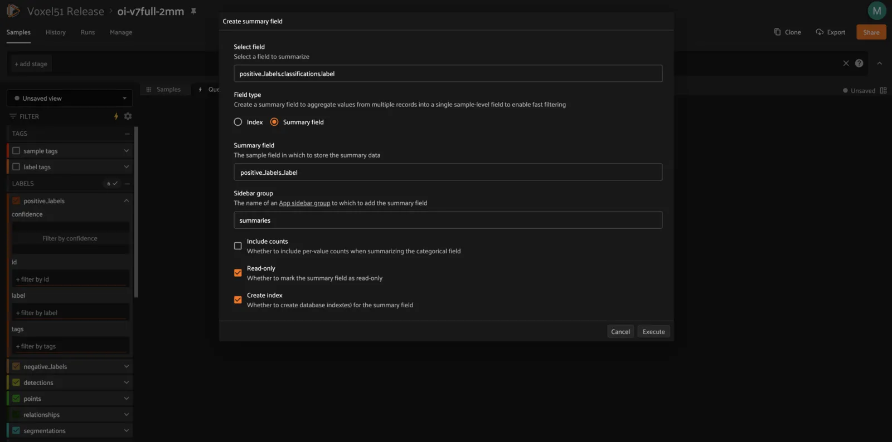
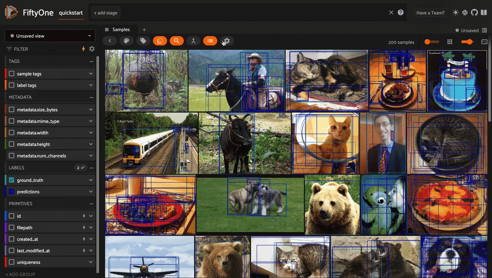
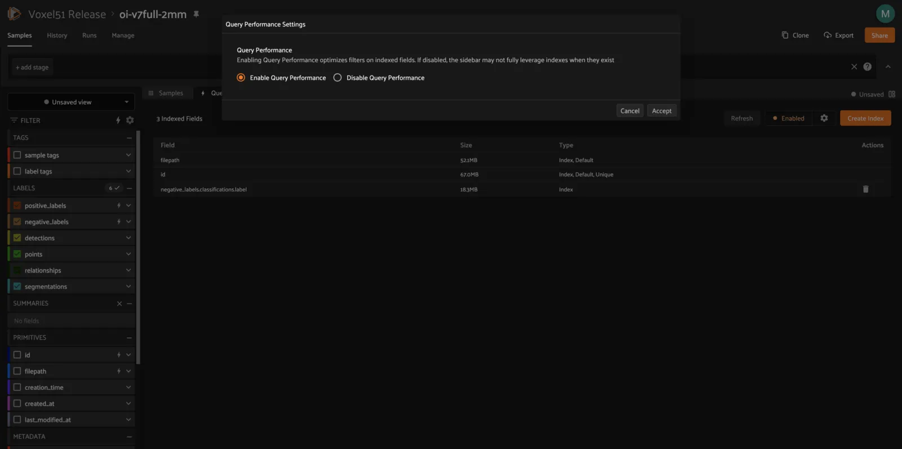

# Query Performance [¶](\#query-performance "Permalink to this headline")

**Available in FiftyOne Teams v2.2+**

Query Performance is a builtin feature of the
[FiftyOne Teams App](teams_app.md#teams-app) that leverages database indexes to
optimize your queries on large-scale datasets.

## Optimizing Query Performance [¶](\#optimizing-query-performance "Permalink to this headline")

The App’s sidebar is optimized to leverage database indexes whenever possible.

Fields that are indexed are indicated by lightning bolt icons next to their
field/attribute names:



The above GIF shows Query Performance in action on the train split of the
[BDD100K dataset](../data/dataset_zoo/datasets.md#dataset-zoo-bdd100k) with an index on the
`detections.detections.label` field.

Note

When filtering by multiple fields, queries will be more efficient when your
**first** filter is on an indexed field.

If you perform a filter that could benefit from an index and the query takes
longer than a few seconds, you’ll see a toast notification that nudges you to
take the appropriate action to optimize the query:



Clicking “Create Index” will open the
[Query Performance panel](#query-performance-panel) with a preconfigured
recommendation of an [index](#query-performance-index) or
[summary field](#query-performance-summary) to create.

Note

Clicking “Dismiss” will prevent this notification from appearing for the
remainder of your current App session.

## Query Performance panel [¶](\#query-performance-panel "Permalink to this headline")

You can open the Query Performance panel manually either by clicking the “+”
icon next to the Samples tab or by clicking the yellow lightning bolt in the
top-right of the sidbar:



The first time you open the Query Performance panel, you’ll see a welcome page:



After you’ve created at least one custom index or summary field for a dataset,
you’ll instead see a list of the indexes and summary fields that exist on the
dataset:



### Creating indexes [¶](\#creating-indexes "Permalink to this headline")

You can create a new index at any time by clicking the `Create Index` button
in the top-right of the panel:



When you click “Execute”, the index will be initiated and you’ll see
“In progress” in the panel’s summary table.

After the index creation has finished, the field that you indexed will have a
lightning bolt icon in the sidebar, and you should notice that expanding the
field’s filter widget and performing queries on it will be noticably faster.

Warning

For large datasets, index creation can have a significant impact on the
performance of the database while the index is under construction.

We recommend indexing _only_ the specific fields that you wish to perform
initial filters on, and we recommend consulting with your deployment admin
before creating multiple indexes simultaneously.

You can also create and manage custom indexes
[via the SDK](../fiftyone_concepts/app.md#app-optimizing-query-performance).

### Creating summary fields [¶](\#creating-summary-fields "Permalink to this headline")

The Query Performance panel also allows you to create
[summary fields](../fiftyone_concepts/using_datasets.md#summary-fields), which are sample-level fields that
allow you to efficiently perform queries on large datasets where directly
querying the underlying field is prohibitively slow due to the number of
objects/frames in the field.

For example, summary fields can help you query video datasets to find samples
that contain specific classes of interest, eg `person`, in at least one frame.

You can create a new summary field at any time by clicking the `Create Index`
button in the top-right of the panel and selecting the “Summary field” type in
the model:



Warning

For large datasets, creating summary fields can take a few minutes.

You can also create and manage summary fields
[via the SDK](../fiftyone_concepts/using_datasets.md#summary-fields).

### Updating summary fields [¶](\#updating-summary-fields "Permalink to this headline")

Since a [summary field](../fiftyone_concepts/using_datasets.md#summary-fields) is derived from the contents of
another field, it must be updated whenever there have been modifications to its
source field.

Click the update icon in the actions column of any summary field to open a
modal that will provide guidance on whether to update the summary field to
reflect recent dataset changes.

### Deleting indexes/summaries [¶](\#deleting-indexes-summaries "Permalink to this headline")

You can delete a custom index or summary field by clicking its trash can icon
in the actions column of the panel.

## Disabling Query Performance [¶](\#disabling-query-performance "Permalink to this headline")

Query Performance is enabled by default for all datasets. This is generally the
recommended setting for all large datasets to ensure that queries are
performant.

However, in certain circumstances you may prefer to disable Query Performance,
which enables the App’s sidebar to show additional information such as
label/value counts that are useful but more expensive to compute.

You can enable/disable Query Performance for a particular dataset for its
lifetime (in your current browser) via the gear icon in the Samples panel’s
actions row:



You can also enable/disable Query Performance via the status button in the
upper right corner of the Query Performance panel:



Deployment admins can also configure the global behavior of Query Performance
via the following environment variables:

```python
# Disable Query Performance by default for all new datasets
FIFTYONE_APP_DEFAULT_QUERY_PERFORMANCE=false

```

```python
# Completely disable Query Performance for all users
FIFTYONE_APP_ENABLE_QUERY_PERFORMANCE=false

```

