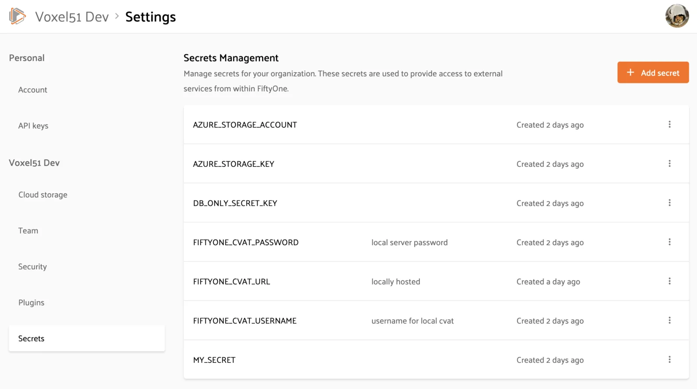
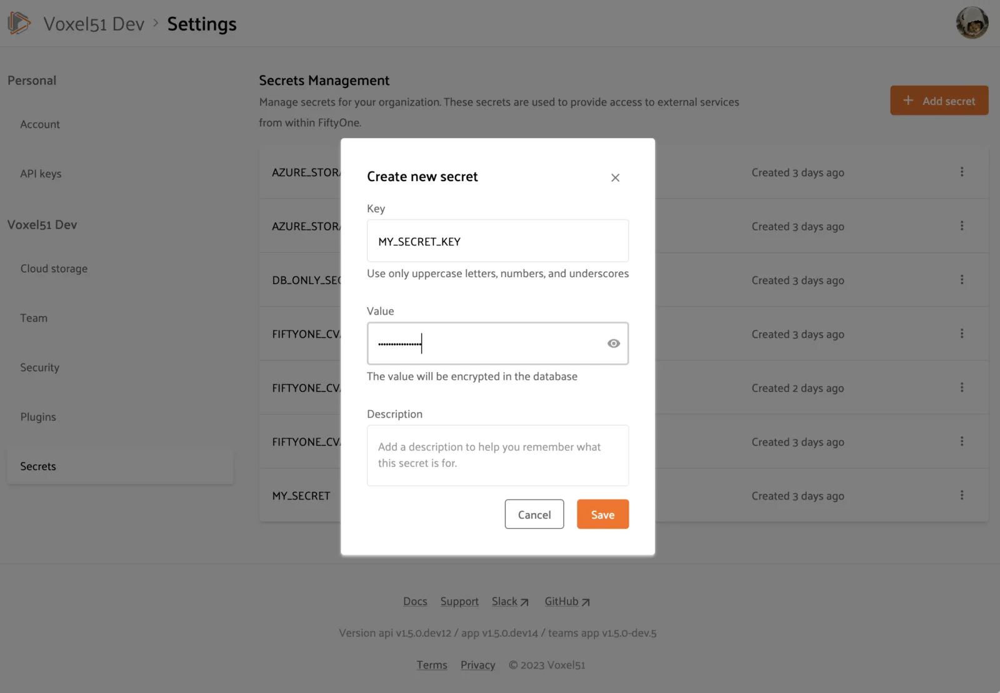

# FiftyOne Teams Secrets [¶](\#fiftyone-teams-secrets "Permalink to this headline")

FiftyOne Teams provides a Secrets interface for storing sensitive information
such as API tokens and login credentials in a secure manner for use by your
[Team’s plugins](teams_plugins.md#teams-plugins).

Managing secrets through the Teams App is a straightforward and secure way to
configure connections to and integrations with external services and APIs such
as GCP, OpenAI, CVAT, etc without the need to change the configuration or
environment variables of your FiftyOne Teams containers and restarting them.
Instead, you can simply add or remove secrets using the
[Teams UI](#teams-adding-secrets) and they will immediately be available
to any plugins that require them.

## Adding secrets [¶](\#adding-secrets "Permalink to this headline")

Admins can add, configure, and remove secrets in the FiftyOne Teams App by
navigating to the Secrets Management page under Settings > Secrets:



When you tap on the “Add secret” button, you will see that a secret is
comprised of a key, value, and optional description:



Secret keys must be upper snake case strings like `MY_SECRET_KEY`.

Secret values are stored encrypted in the database and are only available to
and decrypted at runtime by _internal services_ that have access to your
encryption key.

Note

Only Admins have access to the Secrets page. However, once added, any App
component or [plugin](teams_plugins.md#teams-plugins) requiring secret values can
access them via the [Secrets interface](#teams-using-secrets).

## Using secrets [¶](\#using-secrets "Permalink to this headline")

In order to access secrets, [plugins](teams_plugins.md#teams-plugins) must declare the
secrets that they may use by adding them to the plugin’s `fiftyone.yml` file.

For example, the
[@voxel51/annotation](https://github.com/voxel51/fiftyone-plugins/blob/main/plugins/annotation/fiftyone.yml)
plugin declares the following secrets:

```python
secrets:
  - FIFTYONE_CVAT_URL
  - FIFTYONE_CVAT_USERNAME
  - FIFTYONE_CVAT_PASSWORD
  - FIFTYONE_CVAT_EMAIL
  - FIFTYONE_LABELBOX_URL
  - FIFTYONE_LABELBOX_API_KEY
  - FIFTYONE_LABELSTUDIO_URL
  - FIFTYONE_LABELSTUDIO_API_KEY

```

At runtime, the plugin’s execution context will automatically be hydrated with
any available secrets that are declared by the plugin. Operators access these
secrets via the `ctx.secrets` dict:

```python
def execute(self, ctx):
    url = ctx.secrets["FIFTYONE_CVAT_URL"]
    username = ctx.secrets["FIFTYONE_CVAT_USERNAME"]
    password = ctx.secrets["FIFTYONE_CVAT_PASSWORD"]
    email = ctx.secrets["FIFTYONE_CVAT_EMAIL"]

```

The `ctx.secrets` dict will also be automatically populated with the
values of any environment variables whose name matches a secret key declared
by a plugin. Therefore, a plugin written using the above pattern can run in
all of the following environments with no code changes:

- A FiftyOne Teams deployment that uses the Secrets interface

- A FiftyOne Teams deployment that injects secrets directly as environment
variables

- A locally launched App via the Teams SDK

- Open source FiftyOne


