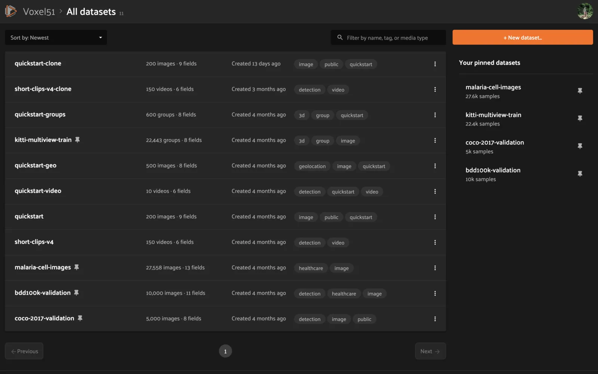
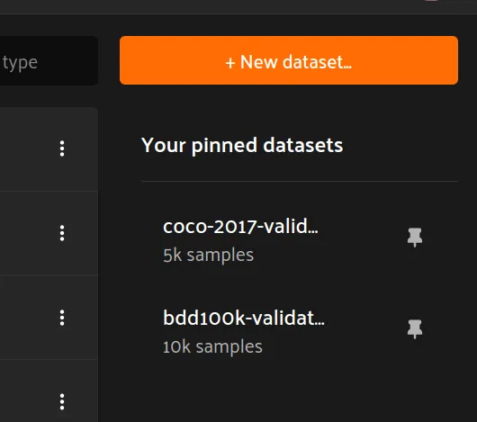
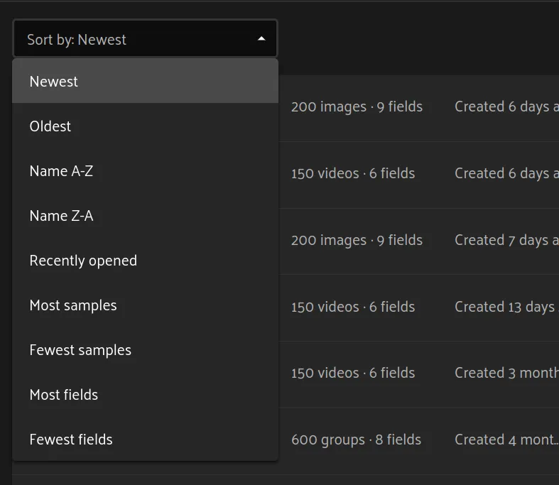
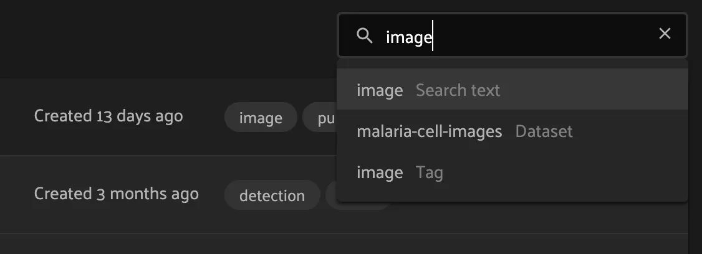
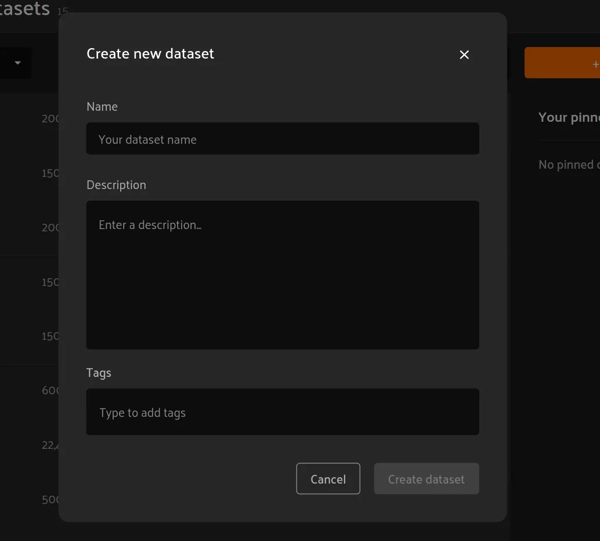
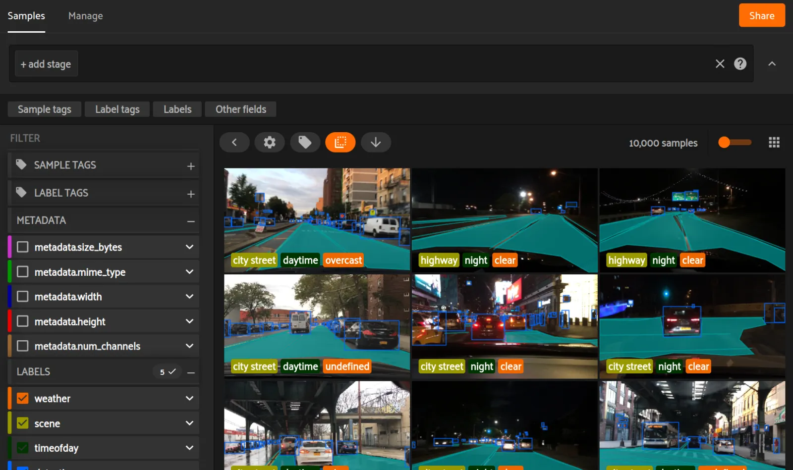
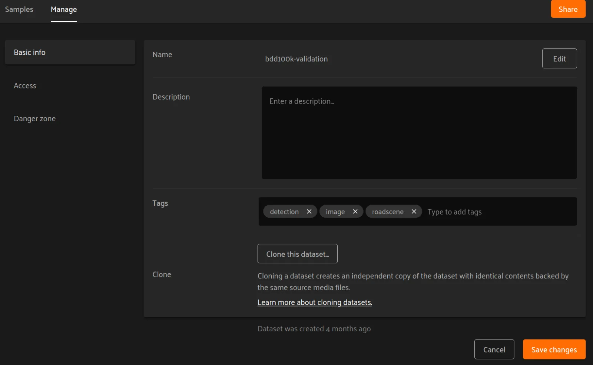
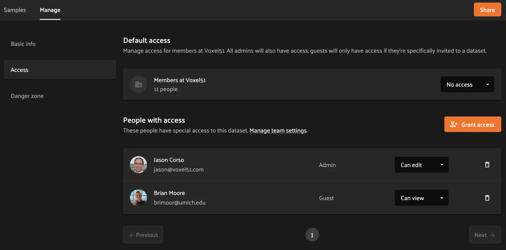
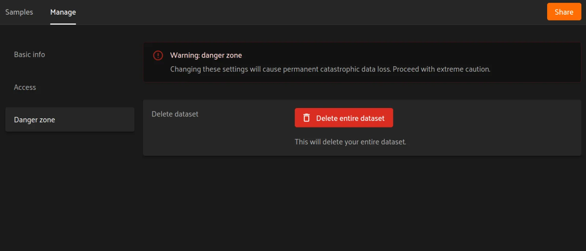

# FiftyOne Teams App [¶](\#fiftyone-teams-app "Permalink to this headline")

The FiftyOne Teams App allows you to visualize, browse, and interact with your
individual datasets like you can with the [FiftyOne App](../fiftyone_concepts/app.md#fiftyone-app),
but with expanded features for organizing, permissionsing, versioning, and
sharing your team’s datasets, all from a centralized web portal.

This page provides a brief overview of some features available only in the
FiftyOne Teams App.

## The homepage [¶](\#the-homepage "Permalink to this headline")

When you login to the FiftyOne Teams App, you’ll land on the homepage pictured
below.

In the top bar of this page, on the left side, the gray number next to
“All datasets” indicates the total number of datasets that you have access to.
If there are more than 20 datasets, you can use the “Previous” and “Next”
buttons at the bottom of the page to see different batches of datasets.

Note

You can return to the homepage from any page of the Teams App by clicking on
the Voxel51 logo in the upper left corner.

### Pinned datasets [¶](\#pinned-datasets "Permalink to this headline")

You can pin datasets for easy access by hovering over the dataset’s name in
the main table and clicking the pin icon.

The “Your pinned datasets” widget on the right-hand side of the hompage shows
your pinned datasets at a glance and allows you to quickly open one by
clicking on its name. Pinned datasets are listed in reverse chronological order
(most recently pinned on top).

To unpin a dataset, click the pin icon next to the dataset name in the “Your
pinned datasets” widget or the pin next to the dataset’s name in the main
table.

### Sorting datasets [¶](\#sorting-datasets "Permalink to this headline")

You can use the drop-down menu in the upper left of the main table to sort your
datasets by various criteria, including size, creation date, recently used, and
alphabetically by name:

### Filtering datasets [¶](\#filtering-datasets "Permalink to this headline")

You can use the search bar (with the magnifying glass icon) in the upper right
corner of the dataset table to filter datasets by name, tags, and media type:

By default, datasets that match across any supported field are returned, but
you can narrow the search to specific fields by selecting the relevant option
in the search dropdown:

## Creating datasets [¶](\#creating-datasets "Permalink to this headline")

To create a new dataset, click on the “New dataset” button in the upper right
corner of the homepage. A pop-up will appear allowing you to choose a name,
description, and tags for the dataset:

- **Name**: as you’re typing a name for your dataset, a URL will appear below
denoting the address at which the dataset will be accessible. If the name or
URL is not available, you will be prompted to try another name.

- **Description**: an optional free text description that you can use to store
relevant information about your dataset.

- **Tags**: an optional list of tag(s) for your dataset. For example, you may
want to record the media type, task type, project name, or other pertinent
information. To add a tag, type it in the text bar. If you have previously
used a tag, it will automatically appear in a dropdown and you can select
it. To add a new tag, type tab or comma.

Note

A dataset’s name, description, and tags can be edited later from the
dataset’s [Manage tab](#teams-managing-datasets).

Note

What next? Use the [Teams Python SDK](installation.md#teams-python-sdk) to upload new
samples, labels, and metadata to your dataset. A common approach is to
automate this process via [cloud functions](cloud_media.md#teams-cloud-functions).

## Using a dataset [¶](\#using-a-dataset "Permalink to this headline")

Click on a dataset from the homepage to open the dataset’s “Samples” tab.

From the Samples tab you can visualize, tag, filter, and explore your dataset
just as you would via the [FiftyOne App](../fiftyone_concepts/app.md#fiftyone-app).

Note

Did you know? You can also navigate directly to a dataset of interest by
pasting its URL into your browser’s URL bar.

## Managing a dataset [¶](\#managing-a-dataset "Permalink to this headline")

The FiftyOne Teams App provides a number of options for managing existing
datasets, as described below.

You can access these options from the [Samples tab](#teams-using-datasets)
by clicking on the “Manage” tab in the upper left corner of the page.

You can also directly navigate to this page from the
[homepage](#teams-homepage) by clicking the three dots on the
right hand side of a row of the dataset listing table and selecting
“Edit dataset”.

Note

Did you know? You can also use the [Teams SDK](installation.md#teams-python-sdk) to
programmatically, create, edit, and delete datasets.

### Basic info [¶](\#basic-info "Permalink to this headline")

The “Basic info” tab is accessible to all users with
[Can view](roles_and_permissions.md#teams-can-view) access to the dataset.

Users with [Can manage](roles_and_permissions.md#teams-can-manage) permissions on the dataset can
edit the name, description, and tags of a dataset from this page.

Additionally, members can create a copy of the dataset by clicking on the
“Clone this dataset” button.

### Access [¶](\#access "Permalink to this headline")

The “Access” tab is only accessible to users with
[Can manage](roles_and_permissions.md#teams-can-manage) permissions on the dataset.

From this tab, users can add, remove, edit, or invite users to the dataset.
Refer to [this page](roles_and_permissions.md#teams-permissions) for more information about the
available dataset-level permissions that you can grant.

### Danger zone [¶](\#danger-zone "Permalink to this headline")

The “Danger zone” tab is only accessible to users with
[Can manage](roles_and_permissions.md#teams-can-manage) permissions on the dataset.

From this tab, you can select “Delete entire dataset” to permanently delete a
dataset from your Teams deployment. You must type the dataset’s full name in
the modal to confirm this action.

Warning

Deleting a dataset is permanent!
