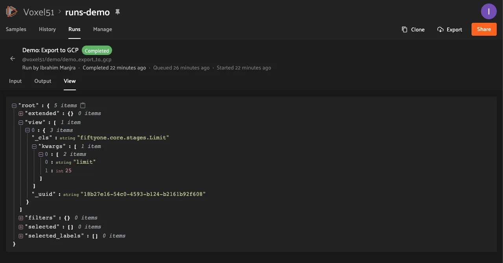

# FiftyOne Teams Plugins [¶](\#fiftyone-teams-plugins "Permalink to this headline")

FiftyOne Teams provides native support for installing and running
[FiftyOne plugins](../plugins/index.md#fiftyone-plugins), which offers powerful opportunities
to extend and customize the functionality of your Teams deployment to suit your
needs.

Note

What can you do with plugins? Check out
[delegated operations](#teams-delegated-operations) to see some quick
examples, then check out the
[FiftyOne plugins](https://github.com/voxel51/fiftyone-plugins)
repository for a growing collection of prebuilt plugins that you can add to
your Teams deployment!

## Plugins page [¶](\#plugins-page "Permalink to this headline")

Admins can use the plugins page to upload, manage, and configure permissions
for plugins that are made available to users of your Teams deployment.

Admins can access the plugins page under Settings > Plugins. It displays a
list of all installed plugins and their operators, as well as the enablement
and permissions of each.


## Installing a plugin [¶](\#installing-a-plugin "Permalink to this headline")

Admins can install plugins via the Teams UI or Management SDK.

Note

A plugin is a directory (or ZIP of it) that contains a top-level
`fiftyone.yml` file.

### Teams UI [¶](\#teams-ui "Permalink to this headline")

To install a plugin, click the “Install plugin” button on the plugins page.


Then upload or drag and drop the plugin contents as a ZIP file and click
install.


You should then see a success message and the newly installed plugin listed on
the plugins page.


### SDK [¶](\#sdk "Permalink to this headline")

Admins can also use the
`upload_plugin()` method from
the Management SDK:

```python
import fiftyone.management as fom

# You can pass the directory or an already zipped version of it
fom.upload_plugin("/path/to/plugin_dir")

```

## Upgrading a plugin [¶](\#upgrading-a-plugin "Permalink to this headline")

Admins can upgrade plugins at any time through the Teams UI or Management SDK.

### Teams UI [¶](\#id1 "Permalink to this headline")

To upgrade a plugin, click the plugin’s dropdown and select “Upgrade plugin”.


Then upload or drag and drop the upgraded plugin as a ZIP file and click
upgrade.


Note

If the `name` attribute within the uploaded plugin’s `fiftyone.yml` file
doesn’t match the existing plugin, a new plugin will be created. Simply
delete the old one.

You should then see a success message and the updated information about the
plugin on the plugins page.


### SDK [¶](\#id2 "Permalink to this headline")

Admins can also use the
`upload_plugin()` method from
the Management SDK with the `overwrite=True` option:

```python
import fiftyone.management as fom

# You can pass the directory or an already zipped version of it
fom.upload_plugin("/path/to/plugin_dir", overwrite=True)

```

## Uninstalling a plugin [¶](\#uninstalling-a-plugin "Permalink to this headline")

Admins can uninstall plugins at any time through the Teams UI or Management
SDK.

Note

Did you know? You can
[enable/disable plugins](#teams-plugins-enable-disable) rather than
permanently uninstalling them.

### Teams UI [¶](\#id3 "Permalink to this headline")

To uninstall a plugin, click the plugin’s dropdown and select
“Uninstall plugin”.


### SDK [¶](\#id4 "Permalink to this headline")

Admins can also use the
`delete_plugin()` method from
the Management SDK:

```python
import fiftyone.management as fom

fom.delete_plugin(plugin_name)

```

## Enabling/disabling plugins [¶](\#enabling-disabling-plugins "Permalink to this headline")

### Teams UI [¶](\#id5 "Permalink to this headline")

When plugins are first installed into Teams, they are enabled by default, along
with any operators they contain.

Admins can enable/disable a plugin and all of its operators by toggling the
enabled/disabled switch.


Admins can also disable/enable specific operators within an (enabled) plugin
by clicking on the plugin’s operators link.


and then toggling the enabled/disabled switch for each operator as necessary.


### SDK [¶](\#id6 "Permalink to this headline")

Admins can also use the
`set_plugin_enabled()`
and
`set_plugin_operator_enabled()`
methods from the management SDK:

```python
import fiftyone.management as fom

# Disable a plugin
fom.set_plugin_enabled(plugin_name, False)

# Disable a particular operator
fom.set_plugin_operator_enabled(plugin_name, operator_name, False)

```

## Plugin permissions [¶](\#plugin-permissions "Permalink to this headline")

Admins can optionally configure access to plugins and individual operators
within them via any combination of the permissions described below:

| Permission | Description |
| --- | --- |
| Minimum Role | The minimum role a user must have to execute the operation. |
| Minimum Dataset Permission | The minimum dataset permission a user must have to perform the operation<br>on a particular dataset. |

### Teams UI [¶](\#id7 "Permalink to this headline")

To configure the permissions for an operator, first click on the plugin’s
operators link.


Then change the dropdown for the operator to reflect the desired permission
level.

[](../_images/plugins_operators_perms.webp) [](../_images/plugins_operators_perms2.webp)

### SDK [¶](\#id8 "Permalink to this headline")

Admins can also use the
`set_plugin_operator_permissions()`
method from the Management SDK:

```python
import fiftyone.management as fom

# Set minimum role permission only
fom.set_plugin_operator_enabled(
    plugin_name,
    operator_name,
    minimum_role=fom.MEMBER,
)

# Set minimum dataset permission only
fom.set_plugin_operator_enabled(
    plugin_name,
    operator_name,
    minimum_dataset_permission=fom.EDIT,
)

# Set both minimum role and minimum dataset permissions
fom.set_plugin_operator_enabled(
    plugin_name,
    operator_name,
    minimum_role=fom.EDIT,
    minimum_dataset_permission=fom.EDIT,
)

```

### Default permissions [¶](\#default-permissions "Permalink to this headline")

When new plugins are installed, any operators they contain are initialized with
the default permissions for your deployment.

By default, the initial permissions are:

| Permission | Default |
| --- | --- |
| Minimum Role | Member |
| Minimum Dataset Permission | Edit |

#### Teams UI [¶](\#id9 "Permalink to this headline")

Default operator permissions can be configured by navigating to the page at
Settings > Security and looking under the Plugins header. Click the dropdown
for the permission you want to change and select the new value.


#### SDK [¶](\#id10 "Permalink to this headline")

Admins can also use the
`set_organization_settings()`
method from the Management SDK:

```python
import fiftyone.management as fom

fom.set_organization_settings(
    default_operator_minimum_role=fom.MEMBER,
    default_operator_minimum_dataset_permission=fom.EDIT,
)

```

## Delegated operations [¶](\#delegated-operations "Permalink to this headline")

[Delegated operations](../plugins/using_plugins.md#delegated-operations) are a powerful feature of
FiftyOne’s plugin framework that allows users to schedule tasks from within the
App that are executed in the background on a connected compute cluster.

With FiftyOne Teams, your team can
[upload and permission](#teams-plugins-page) custom operations that your
users can execute from the Teams App, all of which run against a central
orchestrator [configured by](#teams-delegated-orchestrator) your admins.

Why is this awesome? Your AI stack needs a flexible data-centric component that
enables you to organize and compute on your data. With delegated operations,
FiftyOne Teams becomes both a dataset management/visualization tool and a
workflow automation tool that defines how your data-centric workflows like
ingestion, curation, and evaluation are performed. In short, think of FiftyOne
Teams as the single source of truth on which you co-develop your data and
models together.

What can delegated operations do for you? Get started by installing any of
these plugins available in the
[FiftyOne Plugins](https://github.com/voxel51/fiftyone-plugins) repository:

|     |     |
| --- | --- |
| [@voxel51/annotation](https://github.com/voxel51/fiftyone-plugins/blob/main/plugins/annotation/README.md) | ✏️ Utilities for integrating FiftyOne with annotation tools |
| [@voxel51/brain](https://github.com/voxel51/fiftyone-plugins/blob/main/plugins/brain/README.md) | 🧠 Utilities for working with the FiftyOne Brain |
| [@voxel51/evaluation](https://github.com/voxel51/fiftyone-plugins/blob/main/plugins/evaluation/README.md) | ✅ Utilities for evaluating models with FiftyOne |
| [@voxel51/io](https://github.com/voxel51/fiftyone-plugins/blob/main/plugins/io/README.md) | 📁 A collection of import/export utilities |
| [@voxel51/indexes](https://github.com/voxel51/fiftyone-plugins/blob/main/plugins/indexes/README.md) | 📈 Utilities working with FiftyOne database indexes |
| [@voxel51/utils](https://github.com/voxel51/fiftyone-plugins/blob/main/plugins/utils/README.md) | ⚒️ Call your favorite SDK utilities from the App |
| [@voxel51/voxelgpt](https://github.com/voxel51/voxelgpt) | 🤖 An AI assistant that can query visual datasets, search the FiftyOne docs, and answer general computer vision questions |
| [@voxel51/zoo](https://github.com/voxel51/fiftyone-plugins/blob/main/plugins/zoo/README.md) | 🌎 Download datasets and run inference with models from the FiftyOne Zoo, all without leaving the App |

For example, wish you could import data from within the App? With the
[@voxel51/io](https://github.com/voxel51/fiftyone-plugins/blob/main/plugins/io/README.md),
plugin you can!


Want to send data for annotation from within the App? Sure thing, just install the
[@voxel51/annotation](https://github.com/voxel51/fiftyone-plugins/blob/main/plugins/annotation/README.md)
plugin:


Have model predictions on your dataset that you want to evaluate? The
[@voxel51/evaluation](https://github.com/voxel51/fiftyone-plugins/blob/main/plugins/evaluation/README.md)
plugin makes it easy:


Need to compute embedding for your dataset so you can visualize them in the
[Embeddings panel](../fiftyone_concepts/app.md#app-embeddings-panel)? Kick off the task with the
[@voxel51/brain](https://github.com/voxel51/fiftyone-plugins/blob/main/plugins/brain/README.md)
plugin and proceed with other work while the execution happens in the background:


When you choose delegated execution in the App, these tasks are automatically
scheduled for execution on your
[connected orchestrator](#teams-delegated-orchestrator) and you can
continue with other work. Meanwhile, all datasets have a
[Runs tab](#teams-managing-delegated-operations) in the App where you can
browse a history of all delegated operations that have been run on the dataset
and their status.

## Configuring your orchestrator(s) [¶](\#configuring-your-orchestrator-s "Permalink to this headline")

FiftyOne Teams offers a builtin orchestrator that is configured as part of your
team’s deployment with a default level of compute capacity.

It is also possible to connect your FiftyOne Teams deployment to an externally
managed workflow orchestration tool ( [Airflow](https://airflow.apache.org),
[Flyte](https://flyte.org),
[Spark](https://www.databricks.com/product/spark), etc).

Note

Contact your Voxel51 support team to scale your deployment’s compute
capacity or if you’d like to use an external orchestrator.

## Managing delegated operations [¶](\#managing-delegated-operations "Permalink to this headline")

Every dataset in FiftyOne Teams has a Runs page that allows users with access
to monitor and explore delegated operations scheduled against that dataset.

All scheduled operations are maintained in a queue and will be automatically
executed as resources are available on the targeted orchestrator.

Note

The Runs page only tracks operations that are **scheduled** for delegated
execution, not operations that are executed immediately in the App.

### Runs page [¶](\#runs-page "Permalink to this headline")

The Runs page is accessible to all users with Can view access to the dataset.

You can access the Runs page by clicking on the “Runs” tab from the
[Samples tab](teams_app.md#teams-using-datasets).

Once you are on the Runs page, you will see a table with the list of all
operators scheduled by any user of your organization on the dataset. You can
sort, search and filter runs listed to refine the list as you like:


#### Sorting [¶](\#sorting "Permalink to this headline")

By default, the runs table is sorted by recency, but you can use the dropdown
menu in the upper left of table to sort by other fields like update time or the
name of the operator:


#### Filtering [¶](\#filtering "Permalink to this headline")

You can also filter the runs table to see a subset of runs.

Use the “My runs” radio button to see only the runs that you scheduled:


You can further refine the list of runs using the status dropdown to select one
or more status you would like to filter by:


#### Searching [¶](\#searching "Permalink to this headline")

You can also use the search functionality to filter the list of runs by
keyword. As you type your query in the search box, the list of runs will be
updated to show only the runs matching your query:


Note

Search is case-sensitive and you can currently only search by operator
name, not label. For example, searches will not match against
**Demo: Export to GCP** in the image above.

#### Re-running [¶](\#re-running "Permalink to this headline")

From the Runs page, you can trigger a re-run of any listed run by clicking the
three-dots to open actions menu and then clicking “Re-run”:


#### Pinning [¶](\#pinning "Permalink to this headline")

Pinned runs are displayed to the right of the runs table. By default, five
pinned runs will be displayed. However, if there are more than five pinned
runs, you will see a button to expand the list.

To pin a run, hover over its row in the runs table and click the pin icon that
appears beside the operator label:


Note

Pinned runs are stored at the dataset-level and will be visible to all
users with access to the dataset.

#### Renaming [¶](\#renaming "Permalink to this headline")

When delegating an operator multiple times on the same dataset, you may wish to
give the runs custom labels so that you can easily identify each run later.

To edit the label of an operator run, move your mouse cursor over the label of
interest and click the pencil button as indicated by “1” below. This will
present an input field indicated by “2” where you can update label to text of
your choice. Once you are ready to apply changes, click the save button
indicated by “3”.


#### Mark as failed [¶](\#mark-as-failed "Permalink to this headline")

If a delegated operation run terminates unexpectedly without reporting failure,
you can manually mark it as failed from the Runs page.

To mark a run as failed, click the three dots indicated by “1”. Then, in the
menu, click “Mark as failed” as indicated by “2”. The run status will be
updated and will now display as failed.


Note

If the delegated operation is, in fact, still in progress in your
orchestrator, marking the run as failed will **not** terminate the
execution of operation.

#### Monitoring progress [¶](\#monitoring-progress "Permalink to this headline")

Delegated operations can optionally
[report their progress](../plugins/developing_plugins.md#operator-reporting-progress) during execution.

If a progress is available for a run, it will be displayed in the Runs table
as indicated by “2”. By default, the progress of running operations is
automatically refreshed. You can disable auto-refresh of running operations by
toggling the auto refresh setting indicated by “1”.


Note

Only the progress of running operations is automatically refreshed.

### Run page [¶](\#run-page "Permalink to this headline")

The Run page allows you to see information about a specific run such as inputs,
outputs, and errors.

You can visit the Run page for a run by clicking on a run in the runs table,
the Pinned runs, or Recent runs widgets.

#### Input [¶](\#input "Permalink to this headline")

The Input tab on the Run page lets you see the input parameters that were
provided when the run was scheduled:


**Raw input**

By default, a rendered version (similar to what is displayed when invoking an
operator) of input parameters is displayed. However, you can switch to raw view
by clicking the “Show raw” toggle button:


#### Output [¶](\#output "Permalink to this headline")

The Output tab on the Run page lets you see the preview of the result of a
completed run:

Note

Output tab is only available for completed run.


#### Errors [¶](\#errors "Permalink to this headline")

The Errors tab on the Run page will appear if the run failed and lets you see
the errors that occurred:


#### View [¶](\#view "Permalink to this headline")

The View tab on the Run page lets you see the dataset view on which the run was
scheduled:



